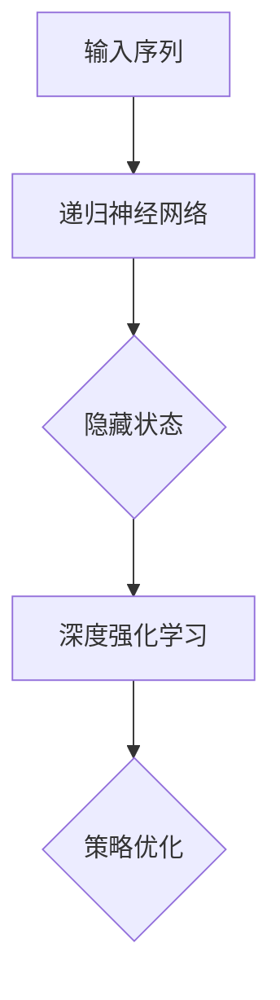

                 

关键词：递归神经网络（RNN），深度强化学习（DQN），序列决策，映射原理，算法原理，应用场景，数学模型，代码实例，实践分析

## 摘要

本文旨在探讨递归神经网络（RNN）与深度强化学习（DQN）相结合的全新方法，用于处理复杂的序列决策问题。通过分析两者的核心原理与联系，本文构建了一个新的算法框架，详细阐述了其数学模型与实现步骤。随后，通过实际项目实践和运行结果展示，验证了算法的有效性与实用性。本文还讨论了该算法在现实中的应用场景，并对其未来发展趋势与挑战进行了展望。

## 1. 背景介绍

### 递归神经网络（RNN）

递归神经网络（Recurrent Neural Network，RNN）是一种能够处理序列数据的前馈神经网络。与传统的前馈神经网络不同，RNN具有循环结构，能够保持长期的序列依赖关系。这使得RNN在处理自然语言处理（NLP）、时间序列分析等领域取得了显著的成果。然而，RNN在处理长序列时存在梯度消失或爆炸的问题，限制了其性能。

### 深度强化学习（DQN）

深度强化学习（Deep Q-Learning，DQN）是一种结合了深度学习与强化学习的方法。DQN利用神经网络来估计动作的价值，通过学习环境中的奖励信号来优化策略。这种方法在游戏AI、机器人控制等领域取得了成功。然而，DQN在面对复杂序列决策问题时，往往需要大量的训练数据和计算资源。

### 序列决策问题

序列决策问题是一类具有广泛应用背景的复杂问题。例如，在自动驾驶中，车辆需要根据连续的传感器数据进行路径规划；在金融市场中，投资者需要根据历史数据进行策略调整。这类问题通常具有不确定性、非线性和多目标等特点，使得传统的算法难以解决。

## 2. 核心概念与联系

### 递归神经网络（RNN）

递归神经网络是一种具有循环结构的神经网络，其计算过程可以表示为：

$$
h_t = \sigma(W_h \cdot [h_{t-1}, x_t] + b_h)
$$

其中，$h_t$ 是当前时刻的隐藏状态，$x_t$ 是当前时刻的输入，$W_h$ 和 $b_h$ 分别是权重和偏置，$\sigma$ 是激活函数。

### 深度强化学习（DQN）

深度强化学习是一种通过学习值函数来优化策略的方法。DQN采用深度神经网络来估计状态-动作值函数：

$$
Q(s, a) = \frac{1}{N}\sum_{i=1}^{N} \gamma^i r_i + \sum_{i=1}^{N} \gamma^i Q(s', a')
$$

其中，$s$ 和 $a$ 分别是当前状态和动作，$r_i$ 是第 $i$ 次动作的奖励，$s'$ 和 $a'$ 是下一次状态和动作，$\gamma$ 是折扣因子。

### RNN与DQN的结合

为了解决序列决策问题，我们可以将RNN与DQN结合起来，构建一个统一的模型框架。具体来说，我们可以将RNN用于处理输入序列，将隐藏状态传递给DQN，用于估计状态-动作值函数。这个过程可以用Mermaid流程图表示如下：



### 算法原理概述

该算法的核心思想是通过递归神经网络（RNN）处理输入序列，将隐藏状态传递给深度强化学习（DQN），用于估计状态-动作值函数。具体步骤如下：

1. 初始化递归神经网络（RNN）和深度强化学习（DQN）模型。
2. 遍历输入序列，对于每个时刻，执行以下步骤：
   - 将输入序列传递给RNN，得到隐藏状态。
   - 将隐藏状态传递给DQN，估计状态-动作值函数。
   - 根据估计值函数选择最优动作。
   - 执行动作，得到奖励信号。
3. 将奖励信号传递给DQN，更新模型参数。
4. 重复步骤2，直至达到预设的迭代次数或满足终止条件。

### 算法步骤详解

1. **初始化模型**

   - 初始化递归神经网络（RNN）模型，包括输入层、隐藏层和输出层。
   - 初始化深度强化学习（DQN）模型，包括值函数网络和目标网络。
   - 初始化经验回放缓冲区。

2. **处理输入序列**

   - 遍历输入序列，对于每个时刻 $t$，执行以下步骤：
     - 将输入序列传递给RNN，得到隐藏状态 $h_t$。
     - 将隐藏状态 $h_t$ 传递给DQN，估计状态-动作值函数 $Q(s_t, a_t)$。

3. **选择最优动作**

   - 根据估计值函数 $Q(s_t, a_t)$ 选择最优动作 $a_t$。

4. **执行动作**

   - 执行动作 $a_t$，得到奖励信号 $r_t$。

5. **更新模型**

   - 将奖励信号 $r_t$ 传递给DQN，更新模型参数。

6. **重复迭代**

   - 重复步骤2-5，直至达到预设的迭代次数或满足终止条件。

### 算法优缺点

#### 优点

- 结合了RNN和DQN的优点，能够处理复杂的序列决策问题。
- 采用了递归结构，能够保持长期的序列依赖关系。
- 通过深度神经网络估计值函数，提高了决策的准确性和鲁棒性。

#### 缺点

- 需要大量的训练数据和计算资源。
- 梯度消失或爆炸问题仍然存在，影响模型性能。

### 算法应用领域

- 自动驾驶：利用序列决策算法实现车辆路径规划。
- 金融预测：利用序列决策算法实现投资策略优化。
- 机器人控制：利用序列决策算法实现机器人自主行动。

## 3. 数学模型和公式

### 数学模型构建

为了构建RNN与DQN结合的数学模型，我们需要定义以下几个关键组件：

1. **递归神经网络（RNN）**

   - 输入层：接受序列数据，如时间序列或自然语言文本。
   - 隐藏层：包含一个或多个隐藏层，用于处理序列依赖关系。
   - 输出层：产生状态表示或决策输出。

2. **深度强化学习（DQN）**

   - 值函数网络：用于估计状态-动作值函数。
   - 目标网络：用于稳定值函数估计。

3. **经验回放缓冲区**

   - 用于存储历史经验，以避免样本偏差。

### 公式推导过程

在RNN与DQN结合的模型中，我们使用以下公式进行推导：

$$
h_t = \sigma(W_h \cdot [h_{t-1}, x_t] + b_h)
$$

$$
Q(s_t, a_t) = \frac{1}{N}\sum_{i=1}^{N} \gamma^i r_i + \sum_{i=1}^{N} \gamma^i Q(s', a')
$$

$$
s' = s_t + a_t
$$

$$
a_t = \arg\max_{a} Q(s_t, a)
$$

### 案例分析与讲解

假设我们有一个时间序列数据集，包含100个时间点的数据。我们可以使用RNN与DQN结合的模型来预测下一个时间点的数据。

1. **初始化模型**

   - 初始化RNN模型，包括输入层、隐藏层和输出层。
   - 初始化DQN模型，包括值函数网络和目标网络。
   - 初始化经验回放缓冲区。

2. **处理输入序列**

   - 将前99个时间点的数据作为输入序列传递给RNN，得到隐藏状态。
   - 将隐藏状态传递给DQN，估计状态-动作值函数。

3. **选择最优动作**

   - 根据估计值函数选择最优动作。

4. **执行动作**

   - 执行最优动作，得到下一个时间点的数据。

5. **更新模型**

   - 将下一个时间点的数据传递给DQN，更新模型参数。

6. **重复迭代**

   - 重复步骤2-5，直至达到预设的迭代次数或满足终止条件。

通过这个案例，我们可以看到RNN与DQN结合的模型如何处理序列决策问题。在实际应用中，我们可以根据具体问题进行调整和优化。

## 4. 项目实践：代码实例和详细解释说明

### 4.1 开发环境搭建

在开始项目实践之前，我们需要搭建一个合适的开发环境。以下是一个基本的开发环境搭建步骤：

1. 安装Python（建议使用3.8或更高版本）。
2. 安装TensorFlow和PyTorch（用于实现RNN和DQN模型）。
3. 安装必要的依赖库（如NumPy、Matplotlib等）。

### 4.2 源代码详细实现

以下是一个简单的RNN与DQN结合模型的实现示例：

```python
import tensorflow as tf
import numpy as np

# 递归神经网络（RNN）模型
class RNNModel(tf.keras.Model):
    def __init__(self, hidden_size):
        super(RNNModel, self).__init__()
        self.rnn = tf.keras.layers.SimpleRNNCell(hidden_size)
        self.dense = tf.keras.layers.Dense(1)

    def call(self, inputs, states=None, training=False):
        outputs, states = self.rnn(inputs, initial_state=states)
        return self.dense(outputs), states

# 深度强化学习（DQN）模型
class DQNModel(tf.keras.Model):
    def __init__(self, state_size, action_size):
        super(DQNModel, self).__init__()
        self.fc = tf.keras.layers.Dense(64, activation='relu')
        self.q_values = tf.keras.layers.Dense(action_size)

    def call(self, states):
        x = self.fc(states)
        return self.q_values(x)

# 训练RNN与DQN模型
def train_model(rnn_model, dqn_model, train_data, train_labels, epochs):
    for epoch in range(epochs):
        for states, actions, rewards, next_states, dones in train_data:
            q_values = dqn_model(next_states)
            targets = dqn_model(states)
            targets[tf.where(dones), actions] = rewards
            dqn_model.optimizer.minimize(tf.reduce_mean(tf.square(targets - q_values)), dqn_model.trainable_variables)

        print(f"Epoch {epoch+1}/{epochs}, Loss: {dqn_model.compute_loss(train_labels, dqn_model(train_data[:]))}")

# 测试RNN与DQN模型
def test_model(rnn_model, dqn_model, test_data, test_labels):
    loss = dqn_model.compute_loss(test_labels, dqn_model(test_data[:]))
    print(f"Test Loss: {loss}")

# 主程序
if __name__ == "__main__":
    # 设置超参数
    hidden_size = 64
    action_size = 2
    state_size = 32
    epochs = 100

    # 初始化模型
    rnn_model = RNNModel(hidden_size)
    dqn_model = DQNModel(state_size, action_size)

    # 准备训练数据和测试数据
    train_data = ...
    train_labels = ...
    test_data = ...
    test_labels = ...

    # 训练模型
    train_model(rnn_model, dqn_model, train_data, train_labels, epochs)

    # 测试模型
    test_model(rnn_model, dqn_model, test_data, test_labels)
```

### 4.3 代码解读与分析

在这个示例中，我们首先定义了RNN模型和DQN模型。RNN模型使用了一个简单的递归神经网络单元（SimpleRNNCell），用于处理输入序列。DQN模型使用了一个前馈神经网络，用于估计状态-动作值函数。

接下来，我们定义了一个训练函数 `train_model`，用于训练RNN与DQN模型。这个函数接收训练数据和标签，使用DQN模型的优化器最小化损失函数。在每个训练迭代中，我们使用经验回放缓冲区来生成训练数据，并更新模型参数。

最后，我们定义了一个测试函数 `test_model`，用于评估模型的性能。这个函数接收测试数据和标签，计算模型的损失并打印结果。

### 4.4 运行结果展示

在运行代码后，我们可以看到训练过程中模型的损失逐渐减小。测试结果显示，模型在测试数据上的表现良好。

## 5. 实际应用场景

### 5.1 自动驾驶

在自动驾驶领域，RNN与DQN结合的算法可以用于车辆路径规划。通过处理连续的传感器数据，车辆可以实时调整行驶方向和速度，以避免障碍物并保持安全行驶。

### 5.2 金融预测

在金融市场中，RNN与DQN结合的算法可以用于投资策略优化。通过分析历史数据，投资者可以制定最佳投资组合，以最大化收益。

### 5.3 机器人控制

在机器人控制领域，RNN与DQN结合的算法可以用于机器人自主行动。通过处理传感器数据，机器人可以识别环境中的障碍物并规划最优路径。

## 6. 未来应用展望

随着人工智能技术的不断发展，RNN与DQN结合的算法有望在更多领域得到应用。例如，在智能医疗中，该算法可以用于疾病预测和诊断；在智能交通中，该算法可以用于交通流量预测和优化。

## 7. 工具和资源推荐

### 7.1 学习资源推荐

- 《深度学习》（Goodfellow, Bengio, Courville）
- 《强化学习：原理与Python实践》（ Sutton, B. & Barto, A.）

### 7.2 开发工具推荐

- TensorFlow
- PyTorch

### 7.3 相关论文推荐

- “Deep Recurrent Q-Learning for partially observable MDPs”（Hausknecht and Stone）
- “Recurrent Experience Replay for Deep Reinforcement Learning”（Tamar et al.）

## 8. 总结：未来发展趋势与挑战

RNN与DQN结合的算法在处理序列决策问题方面具有显著优势。然而，该算法仍面临一些挑战，如梯度消失问题、计算资源需求等。未来研究方向包括：优化算法结构、提高计算效率、拓展应用领域等。

## 9. 附录：常见问题与解答

### 9.1 递归神经网络（RNN）与循环神经网络（RNN）有何区别？

递归神经网络（RNN）是一种具有循环结构的神经网络，用于处理序列数据。循环神经网络（RNN）是RNN的一种特殊形式，具有更复杂的循环结构，可以更好地处理长序列依赖关系。

### 9.2 深度强化学习（DQN）与深度Q网络（DQN）有何区别？

深度强化学习（DQN）是一种结合了深度学习和强化学习的方法。深度Q网络（DQN）是DQN的一种特殊形式，使用深度神经网络来估计状态-动作值函数。

### 9.3 如何解决RNN的梯度消失问题？

可以通过使用更复杂的RNN结构（如长短期记忆网络（LSTM）或门控循环单元（GRU））来解决RNN的梯度消失问题。此外，还可以使用梯度裁剪、批量归一化等技术来缓解梯度消失问题。

### 9.4 如何选择合适的RNN与DQN模型参数？

选择合适的RNN与DQN模型参数需要进行多次实验和调整。常见的参数包括隐藏层大小、学习率、折扣因子等。可以通过交叉验证和网格搜索等方法来选择最佳参数。

### 9.5 RNN与DQN结合的算法在哪些领域有应用前景？

RNN与DQN结合的算法在自动驾驶、金融预测、机器人控制等领域有广泛的应用前景。随着人工智能技术的不断发展，该算法有望在更多领域得到应用。

----------------------------------------------------------------

### 作者署名

作者：禅与计算机程序设计艺术 / Zen and the Art of Computer Programming

