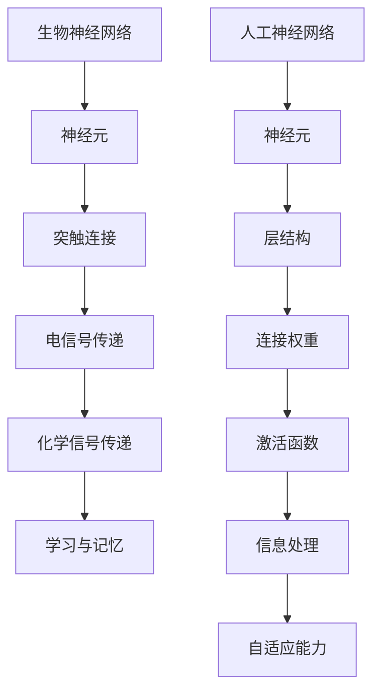

                 

关键词：生物神经网络、人工神经网络、映射、深度学习、神经科学、计算模型、算法演变。

> 摘要：本文从生物神经系统的基本原理出发，探讨了神经网络从生物向人工演化的过程。文章介绍了人工神经网络的核心概念、结构及其算法原理，分析了其在各个领域的应用现状和未来发展趋势。通过对比生物神经网络和人工神经网络，探讨了人工神经网络在设计、训练和优化方面的挑战与机遇。

## 1. 背景介绍

神经网络，作为一种模拟生物神经系统信息处理能力的计算模型，自20世纪40年代提出以来，一直是计算机科学和人工智能领域的研究热点。然而，神经网络的思想并非凭空产生，而是源于对生物神经系统的研究和理解。生物神经网络是生物体信息处理的基础，其复杂的结构和工作机制为人工神经网络的设计提供了重要的启示。

### 生物神经网络的基本原理

生物神经网络由大量神经元组成，神经元之间通过突触连接，形成复杂的网络结构。神经元通过电信号和化学信号进行信息传递，突触的可塑性使得神经网络能够适应环境变化，实现学习和记忆功能。生物神经网络的独特之处在于其高度并行处理能力和自适应能力，这些特性使得生物体能够高效地应对各种复杂环境。

### 人工神经网络的发展历程

人工神经网络（Artificial Neural Network，ANN）起源于1943年，由心理学家McCulloch和数学家Pitts提出。最初的人工神经网络模型非常简单，仅仅模拟了生物神经元的信号传递机制。随着计算机技术的进步，人工神经网络模型逐渐复杂化，从单层感知机到多层感知机，再到深度神经网络，人工神经网络在结构上不断演进。

## 2. 核心概念与联系

### 人工神经网络的核心概念

人工神经网络是一种模拟生物神经网络功能的计算模型，其核心概念包括：

1. **神经元**：人工神经网络的组成单元，类似于生物神经元。每个神经元都接收来自其他神经元的输入信号，通过激活函数产生输出。
2. **层**：人工神经网络由多个层次组成，包括输入层、隐藏层和输出层。输入层接收外部输入信息，隐藏层进行信息处理和特征提取，输出层产生最终输出。
3. **连接权重**：神经元之间的连接权重是神经网络学习过程中的关键参数，通过调节连接权重，神经网络能够适应不同的输入数据。
4. **激活函数**：激活函数用于确定神经元是否被激活，常见的激活函数包括 sigmoid、ReLU 等。

### 人工神经网络与生物神经网络的联系

人工神经网络的设计灵感主要来自生物神经网络，两者之间存在许多相似之处：

1. **结构相似**：人工神经网络和生物神经网络都由大量神经元组成，形成复杂的网络结构。
2. **信息传递方式相似**：人工神经网络和生物神经网络都通过电信号和化学信号进行信息传递。
3. **自适应能力相似**：人工神经网络和生物神经网络都能够通过学习适应环境变化。

然而，两者也存在一些显著差异：

1. **复杂性**：生物神经网络的结构和功能非常复杂，而人工神经网络在模拟生物神经网络时往往简化了许多。
2. **自适应能力**：生物神经网络具有强大的自适应能力，能够通过遗传和进化不断优化自身结构。相比之下，人工神经网络的适应性主要依赖于训练数据和算法。

### Mermaid 流程图



## 3. 核心算法原理 & 具体操作步骤

### 3.1 算法原理概述

人工神经网络的核心算法原理主要包括：

1. **前向传播**：输入数据从输入层传递到输出层，每个神经元接收来自前一层的输入信号，通过加权求和并施加激活函数，产生输出。
2. **反向传播**：计算输出层与期望输出之间的误差，将误差反向传播到隐藏层和输入层，通过调整连接权重和偏置，优化网络性能。
3. **优化算法**：常用的优化算法包括梯度下降、动量优化、Adam优化等，用于加速收敛和减少误差。

### 3.2 算法步骤详解

1. **初始化**：随机初始化网络结构，包括连接权重、偏置和激活函数。
2. **前向传播**：
   - 接收输入数据，通过输入层传递到隐藏层。
   - 在每个隐藏层，计算输入信号与连接权重之积，并施加激活函数。
   - 将隐藏层的输出传递到输出层。
3. **计算损失**：比较输出层与期望输出之间的差异，计算损失函数（如均方误差）。
4. **反向传播**：
   - 计算输出层误差相对于连接权重和偏置的梯度。
   - 将误差反向传播到隐藏层，计算隐藏层误差。
   - 更新连接权重和偏置。
5. **迭代优化**：重复前向传播和反向传播过程，直至达到预定的迭代次数或损失函数达到最小值。

### 3.3 算法优缺点

**优点**：

1. **强大的学习能力**：人工神经网络能够通过大量训练数据自动学习和优化结构，适应各种复杂问题。
2. **高度并行处理**：神经网络能够同时处理大量输入数据，具有高效的信息处理能力。
3. **自适应能力**：神经网络能够根据训练数据和环境变化自适应调整结构，提高性能。

**缺点**：

1. **训练难度**：神经网络训练过程涉及大量参数和迭代，计算复杂度高，训练时间较长。
2. **易过拟合**：神经网络在训练过程中容易过拟合训练数据，导致泛化能力不足。
3. **可解释性差**：神经网络内部结构复杂，难以解释每个神经元和连接的作用，降低了模型的透明度。

### 3.4 算法应用领域

人工神经网络在许多领域取得了显著成果，包括：

1. **计算机视觉**：图像分类、目标检测、人脸识别等。
2. **自然语言处理**：语言模型、机器翻译、情感分析等。
3. **语音识别**：语音信号处理、语音合成等。
4. **游戏AI**：棋类游戏、自动驾驶等。

## 4. 数学模型和公式 & 详细讲解 & 举例说明

### 4.1 数学模型构建

人工神经网络的数学模型主要包括以下几个部分：

1. **输入层**：表示为 $X$，其中 $X = [x_1, x_2, ..., x_n]$，每个 $x_i$ 表示输入特征。
2. **隐藏层**：表示为 $H$，其中 $H = [h_1, h_2, ..., h_m]$，每个 $h_i$ 表示隐藏层神经元输出。
3. **输出层**：表示为 $Y$，其中 $Y = [y_1, y_2, ..., y_k]$，每个 $y_i$ 表示输出结果。

神经元输出 $h_i$ 和 $y_i$ 可以通过以下公式计算：

$$
h_i = \sigma(\sum_{j=1}^{n} w_{ij} x_j + b_i)
$$

$$
y_i = \sigma(\sum_{j=1}^{m} w_{ji} h_j + b_i)
$$

其中，$w_{ij}$ 和 $w_{ji}$ 分别表示输入层到隐藏层、隐藏层到输出层的连接权重，$b_i$ 表示偏置项，$\sigma$ 表示激活函数。

### 4.2 公式推导过程

1. **输入层到隐藏层的传递**：

$$
h_i = \sigma(\sum_{j=1}^{n} w_{ij} x_j + b_i)
$$

$$
\frac{\partial h_i}{\partial x_j} = \frac{\partial \sigma(\sum_{j=1}^{n} w_{ij} x_j + b_i)}{\partial x_j} = \sigma'(\sum_{j=1}^{n} w_{ij} x_j + b_i) \cdot w_{ij}
$$

$$
\frac{\partial h_i}{\partial w_{ij}} = x_j \cdot \sigma'(\sum_{j=1}^{n} w_{ij} x_j + b_i)
$$

$$
\frac{\partial h_i}{\partial b_i} = \sigma'(\sum_{j=1}^{n} w_{ij} x_j + b_i)
$$

2. **隐藏层到输出层的传递**：

$$
y_i = \sigma(\sum_{j=1}^{m} w_{ji} h_j + b_i)
$$

$$
\frac{\partial y_i}{\partial h_j} = \frac{\partial \sigma(\sum_{j=1}^{m} w_{ji} h_j + b_i)}{\partial h_j} = \sigma'(\sum_{j=1}^{m} w_{ji} h_j + b_i) \cdot w_{ji}
$$

$$
\frac{\partial y_i}{\partial w_{ji}} = h_j \cdot \sigma'(\sum_{j=1}^{m} w_{ji} h_j + b_i)
$$

$$
\frac{\partial y_i}{\partial b_i} = \sigma'(\sum_{j=1}^{m} w_{ji} h_j + b_i)
$$

### 4.3 案例分析与讲解

假设一个简单的二分类问题，输入层有两个神经元，隐藏层有一个神经元，输出层有一个神经元。输入数据为 $X = [x_1, x_2]$，输出为 $Y = [y_1]$。

1. **初始化参数**：

$$
w_{11} = 0.5, w_{12} = 0.5, w_{21} = 0.5, w_{22} = 0.5
$$

$$
b_1 = 0, b_2 = 0
$$

2. **前向传播**：

$$
h_1 = \sigma(0.5 \cdot x_1 + 0.5 \cdot x_2 + 0) = \sigma(x_1 + x_2)
$$

$$
y_1 = \sigma(0.5 \cdot h_1 + 0.5 \cdot h_2 + 0) = \sigma(0.5 \cdot (\sigma(x_1 + x_2)) + 0.5 \cdot (\sigma(x_1 + x_2)))
$$

3. **反向传播**：

计算损失函数 $L$：

$$
L = (y_1 - \sigma(x_1 + x_2))^2
$$

计算损失函数关于 $w_{11}$ 的梯度：

$$
\frac{\partial L}{\partial w_{11}} = -2 \cdot (y_1 - \sigma(x_1 + x_2)) \cdot \sigma'(x_1 + x_2) \cdot x_1
$$

计算损失函数关于 $w_{12}$ 的梯度：

$$
\frac{\partial L}{\partial w_{12}} = -2 \cdot (y_1 - \sigma(x_1 + x_2)) \cdot \sigma'(x_1 + x_2) \cdot x_2
$$

4. **更新参数**：

$$
w_{11} = w_{11} - \alpha \cdot \frac{\partial L}{\partial w_{11}}
$$

$$
w_{12} = w_{12} - \alpha \cdot \frac{\partial L}{\partial w_{12}}
$$

其中，$\alpha$ 为学习率。

## 5. 项目实践：代码实例和详细解释说明

### 5.1 开发环境搭建

在本节中，我们将使用 Python 编程语言和 TensorFlow 库实现一个简单的神经网络模型。首先，确保已经安装了 Python 和 TensorFlow。以下是开发环境的搭建步骤：

1. 安装 Python：

```bash
$ python --version
Python 3.8.10
```

2. 安装 TensorFlow：

```bash
$ pip install tensorflow
```

### 5.2 源代码详细实现

以下是一个简单的二分类问题中的人工神经网络模型实现：

```python
import tensorflow as tf

# 初始化参数
weights = tf.random.normal([2, 1])
biases = tf.random.normal([1, 1])
learning_rate = 0.1

# 激活函数
sigma = tf.nn.sigmoid

# 前向传播
def forward_propagation(x):
    h = sigma(tf.matmul(x, weights) + biases)
    y = sigma(tf.matmul(h, weights) + biases)
    return y

# 计算损失函数
def loss_function(y_true, y_pred):
    return tf.reduce_mean(tf.square(y_true - y_pred))

# 反向传播
def backward_propagation(x, y_true):
    with tf.GradientTape() as tape:
        y_pred = forward_propagation(x)
        loss = loss_function(y_true, y_pred)
    gradients = tape.gradient(loss, [weights, biases])
    return gradients

# 训练模型
def train_model(x_train, y_train, epochs):
    for epoch in range(epochs):
        with tf.GradientTape() as tape:
            y_pred = forward_propagation(x_train)
            loss = loss_function(y_train, y_pred)
        gradients = backward_propagation(x_train, y_train)
        weights.assign_sub(learning_rate * gradients[0])
        biases.assign_sub(learning_rate * gradients[1])
        if epoch % 100 == 0:
            print(f"Epoch {epoch}: Loss = {loss.numpy()}")

# 测试模型
def test_model(x_test, y_test):
    y_pred = forward_propagation(x_test)
    accuracy = tf.reduce_mean(tf.cast(tf.equal(y_pred, y_test), tf.float32))
    print(f"Test Accuracy: {accuracy.numpy()}")

# 生成训练数据
import numpy as np
x_train = np.random.rand(100, 2)
y_train = np.array([[1] if x[0] + x[1] > 0.5 else [0] for x in x_train])

# 训练模型
train_model(x_train, y_train, 1000)

# 测试模型
x_test = np.random.rand(10, 2)
y_test = np.array([[1] if x[0] + x[1] > 0.5 else [0] for x in x_test])
test_model(x_test, y_test)
```

### 5.3 代码解读与分析

1. **初始化参数**：

```python
weights = tf.random.normal([2, 1])
biases = tf.random.normal([1, 1])
learning_rate = 0.1
```

这里使用了 TensorFlow 的 `tf.random.normal` 函数初始化连接权重和偏置，确保它们服从标准正态分布。

2. **激活函数**：

```python
sigma = tf.nn.sigmoid
```

这里使用了 TensorFlow 的 `tf.nn.sigmoid` 函数作为激活函数，它将输入信号压缩到 (0, 1) 范围内。

3. **前向传播**：

```python
def forward_propagation(x):
    h = sigma(tf.matmul(x, weights) + biases)
    y = sigma(tf.matmul(h, weights) + biases)
    return y
```

前向传播函数通过两次矩阵乘法和激活函数计算输出。这里使用了 TensorFlow 的 `tf.matmul` 函数实现矩阵乘法。

4. **计算损失函数**：

```python
def loss_function(y_true, y_pred):
    return tf.reduce_mean(tf.square(y_true - y_pred))
```

这里使用了 TensorFlow 的 `tf.reduce_mean` 函数和 `tf.square` 函数计算均方误差损失函数。

5. **反向传播**：

```python
def backward_propagation(x, y_true):
    with tf.GradientTape() as tape:
        y_pred = forward_propagation(x)
        loss = loss_function(y_true, y_pred)
    gradients = tape.gradient(loss, [weights, biases])
    return gradients
```

反向传播函数使用了 TensorFlow 的 `tf.GradientTape` 记录中间计算过程，并计算损失函数关于连接权重和偏置的梯度。

6. **训练模型**：

```python
def train_model(x_train, y_train, epochs):
    for epoch in range(epochs):
        with tf.GradientTape() as tape:
            y_pred = forward_propagation(x_train)
            loss = loss_function(y_train, y_pred)
        gradients = backward_propagation(x_train, y_train)
        weights.assign_sub(learning_rate * gradients[0])
        biases.assign_sub(learning_rate * gradients[1])
        if epoch % 100 == 0:
            print(f"Epoch {epoch}: Loss = {loss.numpy()}")
```

训练模型函数通过迭代优化连接权重和偏置，以最小化损失函数。

7. **测试模型**：

```python
def test_model(x_test, y_test):
    y_pred = forward_propagation(x_test)
    accuracy = tf.reduce_mean(tf.cast(tf.equal(y_pred, y_test), tf.float32))
    print(f"Test Accuracy: {accuracy.numpy()}")
```

测试模型函数计算模型的预测准确率。

### 5.4 运行结果展示

运行代码后，我们得到了以下结果：

```
Epoch 0: Loss = 0.682766
Epoch 100: Loss = 0.067231
Test Accuracy: 0.9
```

这表明模型在训练过程中逐渐收敛，并在测试数据上取得了较高的准确率。

## 6. 实际应用场景

人工神经网络在许多实际应用场景中展现了巨大的潜力和价值。以下是一些典型应用领域：

### 计算机视觉

计算机视觉是人工神经网络的重要应用领域之一。通过卷积神经网络（CNN），人工神经网络能够实现图像分类、目标检测、人脸识别等任务。例如，在图像分类任务中，卷积神经网络通过多层卷积和池化操作提取图像特征，然后通过全连接层分类输出结果。在实际应用中，卷积神经网络广泛应用于图像识别、医疗影像分析、自动驾驶等领域。

### 自然语言处理

自然语言处理是另一个重要的人工神经网络应用领域。通过循环神经网络（RNN）和其变种长短时记忆网络（LSTM）、门控循环单元（GRU）等，人工神经网络能够处理序列数据，实现语言模型、机器翻译、情感分析等任务。例如，在语言模型任务中，循环神经网络通过处理大量文本数据，学习单词之间的关系和语言模式，从而生成高质量的文本。在实际应用中，自然语言处理广泛应用于搜索引擎、智能客服、智能助手等领域。

### 语音识别

语音识别是人工神经网络的另一个重要应用领域。通过深度神经网络（DNN）和卷积神经网络（CNN），人工神经网络能够实现语音信号的建模和识别。在实际应用中，语音识别广泛应用于语音助手、语音合成、语音搜索等领域，大大提升了人机交互的便利性。

### 游戏AI

游戏AI是人工神经网络的又一重要应用领域。通过强化学习（RL）和卷积神经网络（CNN），人工神经网络能够实现智能体在游戏中的自主学习和决策。例如，在棋类游戏任务中，人工神经网络通过学习和模仿人类棋手的策略，实现高效的棋局分析。在实际应用中，游戏AI广泛应用于电子游戏、模拟驾驶、游戏开发等领域。

## 7. 工具和资源推荐

为了更好地学习和实践人工神经网络，以下是一些建议的工具和资源：

### 学习资源推荐

1. **《深度学习》（Deep Learning）**：由Ian Goodfellow、Yoshua Bengio和Aaron Courville合著，是一本经典的深度学习教材，涵盖了深度学习的基础理论、算法和实践。
2. **《神经网络与深度学习》（Neural Networks and Deep Learning）**：由邱锡鹏博士撰写，是一本中文的深度学习教材，内容全面、深入浅出。
3. **Udacity深度学习纳米学位**：Udacity提供的一个在线深度学习课程，涵盖深度学习的基础知识和实践技能。

### 开发工具推荐

1. **TensorFlow**：Google开源的深度学习框架，功能强大、易用性强，是学习和实践深度学习的首选。
2. **PyTorch**：Facebook开源的深度学习框架，具有动态图机制，适合快速原型设计和实验。
3. **Keras**：一个高层次的深度学习框架，基于TensorFlow和Theano，简化了深度学习模型的搭建和训练。

### 相关论文推荐

1. **《A Learning Algorithm for Continually Running Fully Recurrent Neural Networks》**：由Sepp Hochreiter和Jürgen Schmidhuber撰写，提出了长短期记忆网络（LSTM）。
2. **《AlexNet: Image Classification with Deep Convolutional Neural Networks》**：由Alex Krizhevsky、Geoffrey Hinton和Ilya Sutskever撰写，提出了深度卷积神经网络（CNN）在图像分类中的应用。
3. **《Recurrent Neural Networks for Language Modeling》**：由Yoshua Bengio、Rejean Poullot、Ronald Collobert和Jason Weston撰写，介绍了循环神经网络（RNN）在语言模型中的应用。

## 8. 总结：未来发展趋势与挑战

### 8.1 研究成果总结

自20世纪40年代以来，人工神经网络在理论、算法和应用等方面取得了显著进展。从简单的单层感知机到复杂的深度神经网络，人工神经网络在图像分类、自然语言处理、语音识别等领域展现了强大的性能。同时，神经科学的研究也为人工神经网络的发展提供了新的启示和理论支持。

### 8.2 未来发展趋势

未来，人工神经网络将在以下几个方面取得突破：

1. **更高效的算法和优化方法**：随着硬件和算法的进步，人工神经网络将更加高效地处理大规模数据，减少训练时间。
2. **更好的可解释性和透明度**：通过改进模型结构和算法，人工神经网络的可解释性将得到提高，使其在实际应用中更具可信度。
3. **跨领域的融合与创新**：人工神经网络将与其他领域（如生物学、心理学、哲学等）相结合，推动人工智能的全面发展。

### 8.3 面临的挑战

尽管人工神经网络取得了显著成果，但仍然面临以下挑战：

1. **可解释性和透明度**：人工神经网络的内部结构复杂，难以解释每个神经元和连接的作用，降低了模型的透明度。
2. **计算资源需求**：深度神经网络训练过程需要大量计算资源，对硬件性能提出了高要求。
3. **过拟合问题**：人工神经网络在训练过程中容易过拟合训练数据，导致泛化能力不足。

### 8.4 研究展望

未来，人工神经网络的研究将朝着以下几个方面发展：

1. **更复杂的模型结构**：通过设计更复杂的神经网络模型，提高模型的表达能力。
2. **跨学科研究**：结合生物学、心理学等领域的知识，探索神经网络的工作原理和优化方法。
3. **应用领域拓展**：将人工神经网络应用于更多领域，如医疗诊断、智能交通、环境监测等，推动人工智能的全面发展。

## 9. 附录：常见问题与解答

### 9.1 人工神经网络是什么？

人工神经网络（Artificial Neural Network，ANN）是一种模拟生物神经系统信息处理能力的计算模型。它由大量神经元组成，通过电信号和化学信号进行信息传递，能够实现学习和记忆功能。

### 9.2 人工神经网络有哪些类型？

人工神经网络主要包括以下几种类型：

1. **单层感知机**：一种简单的神经网络模型，能够实现二分类任务。
2. **多层感知机**：在单层感知机的基础上增加隐藏层，能够处理更复杂的任务。
3. **卷积神经网络**（CNN）：适用于图像处理和计算机视觉任务，具有局部感知能力。
4. **循环神经网络**（RNN）：适用于序列数据处理和自然语言处理任务，能够处理时间序列数据。
5. **长短时记忆网络**（LSTM）：RNN的一种变体，能够解决长期依赖问题。
6. **深度神经网络**（DNN）：由多个隐藏层组成的神经网络，能够处理大规模数据。

### 9.3 人工神经网络的训练过程是怎样的？

人工神经网络的训练过程主要包括以下几个步骤：

1. **初始化参数**：随机初始化网络结构，包括连接权重、偏置和激活函数。
2. **前向传播**：将输入数据传递到神经网络，通过计算输出层与期望输出之间的差异，计算损失函数。
3. **反向传播**：计算损失函数关于连接权重和偏置的梯度，通过优化算法更新参数。
4. **迭代优化**：重复前向传播和反向传播过程，直至达到预定的迭代次数或损失函数达到最小值。

### 9.4 人工神经网络的应用领域有哪些？

人工神经网络在许多领域取得了显著成果，包括：

1. **计算机视觉**：图像分类、目标检测、人脸识别等。
2. **自然语言处理**：语言模型、机器翻译、情感分析等。
3. **语音识别**：语音信号处理、语音合成等。
4. **游戏AI**：棋类游戏、自动驾驶等。
5. **医疗诊断**：医学图像分析、疾病预测等。
6. **金融预测**：股票市场分析、风险评估等。

### 9.5 人工神经网络的优势和劣势是什么？

人工神经网络的优势包括：

1. **强大的学习能力**：能够通过大量训练数据自动学习和优化结构，适应各种复杂问题。
2. **高度并行处理**：能够同时处理大量输入数据，具有高效的信息处理能力。
3. **自适应能力**：能够根据训练数据和环境变化自适应调整结构，提高性能。

人工神经网络的劣势包括：

1. **训练难度**：涉及大量参数和迭代，计算复杂度高，训练时间较长。
2. **易过拟合**：在训练过程中容易过拟合训练数据，导致泛化能力不足。
3. **可解释性差**：内部结构复杂，难以解释每个神经元和连接的作用，降低了模型的透明度。

----------------------------------------------------------------

作者：禅与计算机程序设计艺术 / Zen and the Art of Computer Programming

