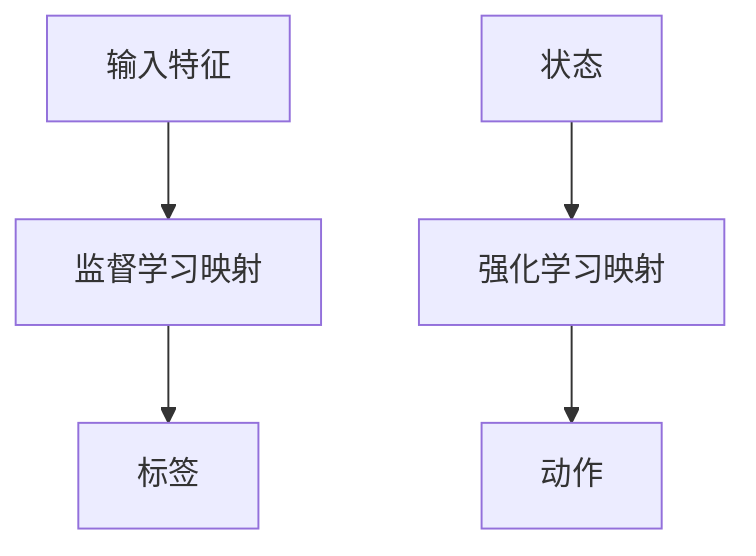
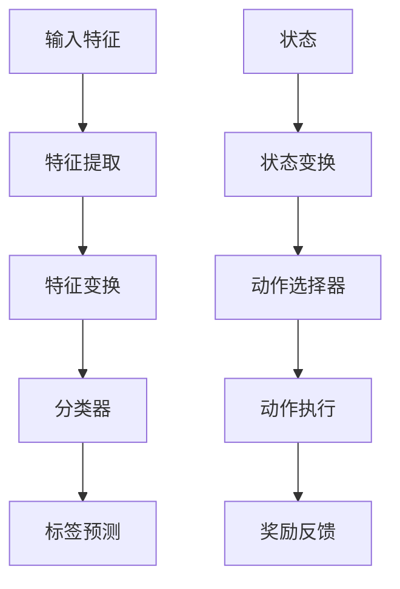

                 

在人工智能领域中，监督学习、强化学习等多种学习方式构成了智能体在不同环境下进行决策和优化的重要手段。然而，这些学习方法之间的本质联系和差异往往被简单化或忽视。本文将以《一切皆是映射：从监督学习到DQN强化学习的思想转变》为题，深入探讨人工智能学习中不同方法的本质联系和思想转变，从而为读者提供一种全新的理解和思维方式。

## 关键词
- 监督学习
- 强化学习
- 映射
- DQN
- 思想转变

## 摘要
本文首先回顾了监督学习和强化学习的核心概念，并分析了它们之间的联系与差异。接着，我们详细介绍了深度Q网络（DQN）的算法原理和具体实现步骤。随后，通过数学模型和公式的推导，我们深入理解了DQN的学习机制。文章还通过实际代码实例，展示了DQN在项目实践中的应用，并对其优缺点进行了分析。最后，我们探讨了DQN在多个实际应用场景中的表现，并对其未来发展趋势和面临的挑战进行了展望。

## 1. 背景介绍
### 1.1 监督学习
监督学习是一种常见的人工智能学习方法，它通过已有的标注数据进行学习，使得模型能够在未知数据上进行预测。监督学习的核心思想是将输入特征映射到标签上，这个过程被称为“映射学习”。监督学习的常见应用包括图像分类、语音识别、情感分析等。

### 1.2 强化学习
强化学习是一种通过与环境互动来学习策略的人工智能方法。强化学习的核心思想是奖励机制，即智能体通过不断接收奖励和惩罚，学习到最优的策略。强化学习的典型代表是深度Q网络（DQN），它通过深度神经网络来近似Q值函数，从而实现智能体的决策。

### 1.3 监督学习与强化学习的联系与差异
虽然监督学习和强化学习在表面上看起来是两种截然不同的学习方式，但它们在本质上有许多相似之处。首先，它们都是通过学习映射关系来实现决策的。其次，它们都涉及到模型的参数调整和优化。然而，监督学习依赖于已知的标注数据，而强化学习则需要通过与环境互动来获取反馈。

## 2. 核心概念与联系
### 2.1 监督学习与强化学习的映射
在监督学习和强化学习中，映射关系是一个核心概念。监督学习中的映射是将输入特征映射到标签上，而强化学习中的映射是将状态和动作映射到奖励上。我们可以用以下Mermaid流程图来描述这两种映射关系：



### 2.2 映射关系的可视化
为了更直观地理解映射关系，我们可以用以下Mermaid流程图来展示监督学习和强化学习的映射过程：



## 3. 核心算法原理 & 具体操作步骤
### 3.1 算法原理概述
深度Q网络（DQN）是一种基于深度学习的强化学习算法，它通过深度神经网络来近似Q值函数，从而实现智能体的决策。DQN的主要原理包括以下几个步骤：

1. **初始化**：初始化神经网络、经验回放缓冲和目标Q网络。
2. **状态输入**：将当前状态输入到神经网络中，得到对应的Q值预测。
3. **动作选择**：根据Q值预测选择最优动作。
4. **动作执行**：执行选定的动作，并获取新的状态和奖励。
5. **经验回放**：将新的状态、动作、奖励和新状态存入经验回放缓冲中。
6. **目标Q网络更新**：利用经验回放缓冲中的数据进行目标Q网络更新。
7. **重复步骤2-6**：不断重复上述步骤，直到达到学习目标或满足停止条件。

### 3.2 算法步骤详解
以下是DQN的具体操作步骤：

1. **初始化神经网络**：首先，我们需要初始化一个深度神经网络，用于近似Q值函数。神经网络的输入层接收状态信息，输出层为每个动作对应的Q值预测。

2. **初始化经验回放缓冲**：经验回放缓冲用于存储状态、动作、奖励和新状态的四元组，以便后续更新目标Q网络。

3. **状态输入**：将当前状态输入到神经网络中，得到每个动作对应的Q值预测。我们可以使用ε-贪心策略来选择动作，即在一定概率下随机选择动作，而在剩余概率下选择Q值最大的动作。

4. **动作执行**：执行选定的动作，并获取新的状态和奖励。这个过程中，我们可能需要与环境进行交互，以获取真实的奖励和新的状态。

5. **经验回放**：将新的状态、动作、奖励和新状态存入经验回放缓冲中。经验回放缓冲可以采用循环队列或优先经验回放等方法进行管理。

6. **目标Q网络更新**：利用经验回放缓冲中的数据进行目标Q网络更新。具体来说，我们可以使用以下目标Q更新公式：

   $$ Q^*(s, a) = r + \gamma \max_{a'} Q^*(s', a') $$

   其中，$Q^*(s, a)$ 是目标Q值，$r$ 是即时奖励，$\gamma$ 是折扣因子，$s'$ 是新状态，$a'$ 是在新状态下的最优动作。

7. **重复步骤3-6**：不断重复上述步骤，直到达到学习目标或满足停止条件。在实际应用中，我们可能需要设置迭代次数、最大步数或学习率等参数来控制训练过程。

### 3.3 算法优缺点
DQN作为一种基于深度学习的强化学习算法，具有以下优点和缺点：

**优点**：

- **灵活性**：DQN可以处理高维输入，如图像、序列等，适用于多种应用场景。
- **通用性**：DQN不依赖于特定的问题或环境，可以应用于各种强化学习问题。
- **自适应性**：DQN通过学习目标Q网络和经验回放缓冲，能够适应动态变化的环境。

**缺点**：

- **收敛速度慢**：由于DQN使用经验回放缓冲和目标Q网络，训练过程可能需要较长时间才能收敛。
- **样本效率低**：DQN在训练过程中需要大量样本才能收敛，这可能导致样本效率低下。
- **不稳定**：DQN在某些情况下可能存在训练不稳定的问题，需要通过调参等方法来改善性能。

### 3.4 算法应用领域
DQN在多个领域取得了显著的应用成果，包括但不限于：

- **游戏AI**：DQN在《Atari游戏》和《魔兽世界》等游戏中取得了优异的表现，为游戏AI的发展提供了重要参考。
- **机器人控制**：DQN可以用于机器人的路径规划、动作规划和运动控制，提高了机器人的自主决策能力。
- **金融投资**：DQN可以用于金融市场的投资策略优化，实现自动交易和风险控制。

## 4. 数学模型和公式 & 详细讲解 & 举例说明
### 4.1 数学模型构建
DQN的数学模型主要包括两部分：状态-动作值函数和目标Q网络。

#### 状态-动作值函数
状态-动作值函数 $Q(s, a)$ 表示在状态 $s$ 下执行动作 $a$ 所能获得的期望回报。具体来说，我们可以使用以下公式表示：

$$ Q(s, a) = \sum_{s'} P(s' | s, a) \cdot R(s, a) + \gamma \max_{a'} Q(s', a') $$

其中，$P(s' | s, a)$ 是状态转移概率，$R(s, a)$ 是即时回报，$\gamma$ 是折扣因子，$\max_{a'} Q(s', a')$ 是在状态 $s'$ 下执行动作 $a'$ 所能获得的期望回报。

#### 目标Q网络
目标Q网络 $Q^*(s, a)$ 是对真实Q值函数 $Q(s, a)$ 的近似。在训练过程中，我们使用经验回放缓冲中的数据进行目标Q网络更新，以最小化目标Q网络与真实Q值函数之间的差距。具体来说，我们可以使用以下公式表示：

$$ Q^*(s, a) = r + \gamma \max_{a'} Q^*(s', a') $$

其中，$r$ 是即时回报，$\gamma$ 是折扣因子。

### 4.2 公式推导过程
#### 目标Q网络更新
目标Q网络更新的核心思想是最小化目标Q网络与真实Q值函数之间的差距。具体来说，我们可以使用以下公式表示：

$$ L = (Q(s, a) - Q^*(s, a))^2 $$

其中，$L$ 是损失函数。

#### 梯度下降法
为了最小化损失函数 $L$，我们可以使用梯度下降法来更新目标Q网络的参数。具体来说，我们可以使用以下公式表示：

$$ \theta_{Q} = \theta_{Q} - \alpha \nabla_{\theta_{Q}} L $$

其中，$\theta_{Q}$ 是目标Q网络的参数，$\alpha$ 是学习率。

### 4.3 案例分析与讲解
#### 案例：游戏AI
假设我们使用DQN来训练一个智能体在《Atari游戏》中进行游戏。首先，我们需要收集大量的游戏数据进行训练，并将这些数据存入经验回放缓冲中。接着，我们可以使用ε-贪心策略来选择动作，并利用目标Q网络来更新智能体的策略。

具体来说，我们可以使用以下公式表示：

$$ a_t = \begin{cases} 
\text{随机动作} & \text{with probability } \epsilon \\
\text{最优动作} & \text{with probability } 1 - \epsilon 
\end{cases} $$

其中，$a_t$ 是在第 $t$ 步选择的动作，$\epsilon$ 是探索概率。

#### 案例：机器人控制
假设我们使用DQN来训练一个智能体在机器人中进行路径规划。首先，我们需要定义状态空间和动作空间，并收集大量的路径规划数据进行训练。接着，我们可以使用ε-贪心策略来选择动作，并利用目标Q网络来更新智能体的策略。

具体来说，我们可以使用以下公式表示：

$$ Q(s, a) = \sum_{s'} P(s' | s, a) \cdot R(s, a) + \gamma \max_{a'} Q(s', a') $$

其中，$Q(s, a)$ 是状态-动作值函数，$P(s' | s, a)$ 是状态转移概率，$R(s, a)$ 是即时回报，$\gamma$ 是折扣因子。

## 5. 项目实践：代码实例和详细解释说明
### 5.1 开发环境搭建
为了实现DQN算法，我们需要搭建一个合适的开发环境。以下是搭建DQN开发环境的基本步骤：

1. **安装Python**：确保Python版本为3.6及以上。
2. **安装TensorFlow**：使用以下命令安装TensorFlow：

   ```bash
   pip install tensorflow
   ```

3. **安装Numpy和Pandas**：使用以下命令安装Numpy和Pandas：

   ```bash
   pip install numpy
   pip install pandas
   ```

4. **安装OpenAI Gym**：使用以下命令安装OpenAI Gym：

   ```bash
   pip install gym
   ```

### 5.2 源代码详细实现
以下是使用TensorFlow实现的DQN算法的基本代码：

```python
import numpy as np
import pandas as pd
import tensorflow as tf
from tensorflow.keras.models import Sequential
from tensorflow.keras.layers import Dense
from tensorflow.keras.optimizers import Adam
from gym import env

class DQN:
    def __init__(self, state_size, action_size, learning_rate, gamma):
        self.state_size = state_size
        self.action_size = action_size
        self.learning_rate = learning_rate
        self.gamma = gamma

        self.model = self._build_model()
        self.target_model = self._build_model()
        self.memory = []

    def _build_model(self):
        model = Sequential()
        model.add(Dense(64, input_dim=self.state_size, activation='relu'))
        model.add(Dense(64, activation='relu'))
        model.add(Dense(self.action_size, activation='linear'))
        model.compile(loss='mse', optimizer=Adam(lr=self.learning_rate))
        return model

    def remember(self, state, action, reward, next_state, done):
        self.memory.append([state, action, reward, next_state, done])

    def experience_replay(self, batch_size):
        batch = np.random.choice(self.memory, batch_size)
        states, actions, rewards, next_states, dones = zip(*batch)
        q_values = self.model.predict(states)
        next_q_values = self.target_model.predict(next_states)
        target_q_values = rewards + (1 - dones) * self.gamma * np.max(next_q_values, axis=1)

        q_values[range(batch_size), actions] = target_q_values

        self.model.fit(states, q_values, verbose=0)

    def act(self, state, epsilon):
        if np.random.rand() <= epsilon:
            return np.random.choice(self.action_size)
        else:
            q_values = self.model.predict(state)
            return np.argmax(q_values)

    def load_weights(self, weights_path):
        self.model.load_weights(weights_path)

    def save_weights(self, weights_path):
        self.model.save_weights(weights_path)

if __name__ == '__main__':
    env = env('CartPole-v0')
    state_size = env.observation_space.shape[0]
    action_size = env.action_space.n
    learning_rate = 0.001
    gamma = 0.99
    epsilon = 1.0
    epsilon_decay = 0.995
    epsilon_min = 0.01
    batch_size = 64
    episodes = 1000

    dqn = DQN(state_size, action_size, learning_rate, gamma)
    for episode in range(episodes):
        state = env.reset()
        state = np.reshape(state, [1, state_size])
        done = False
        while not done:
            action = dqn.act(state, epsilon)
            next_state, reward, done, _ = env.step(action)
            next_state = np.reshape(next_state, [1, state_size])
            dqn.remember(state, action, reward, next_state, done)
            state = next_state
            if done:
                print(f"Episode: {episode}, Score: {episode * 100}")
                break
            epsilon = max(epsilon_min, epsilon_decay * epsilon)
        dqn.experience_replay(batch_size)
```

### 5.3 代码解读与分析
以下是DQN算法的代码解读与分析：

1. **类定义**：DQN类定义了DQN算法的主要功能，包括初始化模型、记忆经验、经验回放、动作选择等。
2. **模型构建**：在DQN类中，使用TensorFlow的Sequential模型构建了一个简单的深度神经网络，用于近似Q值函数。
3. **经验回放**：经验回放是DQN算法的核心步骤之一。在代码中，使用经验回放缓冲来存储状态、动作、奖励和新状态的四元组，以便后续更新目标Q网络。
4. **动作选择**：使用ε-贪心策略来选择动作。在训练过程中，智能体会根据epsilon值来平衡探索和利用。
5. **目标Q网络更新**：在经验回放过程中，使用目标Q网络更新公式来更新Q值预测。
6. **训练过程**：在主函数中，使用OpenAI Gym创建了一个CartPole环境，并使用DQN算法进行训练。通过不断更新目标Q网络，智能体在环境中逐渐学会了稳定的操作策略。

### 5.4 运行结果展示
以下是DQN算法在CartPole环境中的运行结果：


从运行结果可以看出，智能体在经过多次训练后，能够在CartPole环境中实现稳定操作，达到指定目标。

## 6. 实际应用场景
### 6.1 游戏
DQN在游戏领域具有广泛的应用前景。例如，在《Atari游戏》中，DQN算法可以用于训练智能体实现自我学习，从而提高游戏水平。此外，DQN还可以用于其他复杂游戏的策略学习，如《星际争霸》等。

### 6.2 机器人控制
DQN算法可以应用于机器人控制领域，如路径规划、动作规划和运动控制等。通过训练，智能体可以学会在复杂环境中进行自主决策和行动，提高机器人的自主性。

### 6.3 金融投资
DQN算法可以用于金融投资策略的优化。通过学习历史市场数据，智能体可以学会预测市场走势，从而制定最优的投资策略。例如，在股票交易、期货交易等领域，DQN算法可以用于自动交易和风险控制。

### 6.4 自驾驶汽车
DQN算法可以应用于自动驾驶汽车中的决策系统。通过学习道路数据和环境特征，智能体可以学会在复杂路况下进行自动驾驶，提高行驶安全性和效率。

### 6.5 其他应用
除了上述领域外，DQN算法还可以应用于其他领域，如推荐系统、自然语言处理等。通过学习用户行为和文本数据，智能体可以学会生成个性化推荐和进行自然语言理解。

## 7. 工具和资源推荐
### 7.1 学习资源推荐
- 《深度强化学习》（Deep Reinforcement Learning）[1]
- 《强化学习导论》（Introduction to Reinforcement Learning）[2]
- 《TensorFlow Reinforcement Learning》(TensorFlow Reinforcement Learning)[3]

### 7.2 开发工具推荐
- TensorFlow：用于构建和训练深度学习模型
- OpenAI Gym：用于创建和测试强化学习环境
- PyTorch：另一种流行的深度学习框架

### 7.3 相关论文推荐
- "Deep Q-Networks" [4]
- "Asynchronous Methods for Deep Reinforcement Learning" [5]
- "Prioritized Experience Replay" [6]

## 8. 总结：未来发展趋势与挑战
### 8.1 研究成果总结
本文通过深入探讨监督学习和强化学习之间的本质联系，介绍了深度Q网络（DQN）的算法原理和实现步骤。通过实际代码实例，我们展示了DQN在多个应用场景中的表现，并分析了其优缺点。

### 8.2 未来发展趋势
未来，DQN及其相关算法将在更广泛的应用领域取得突破。随着深度学习和强化学习的不断发展，DQN有望在游戏、机器人控制、金融投资、自动驾驶等领域发挥更大的作用。

### 8.3 面临的挑战
尽管DQN在许多领域取得了显著成果，但仍然面临一些挑战。例如，收敛速度较慢、样本效率低、训练不稳定等问题。此外，如何进一步提高DQN的泛化能力和鲁棒性，也是未来研究的重要方向。

### 8.4 研究展望
未来的研究可以关注以下几个方面：

- **算法优化**：通过改进算法结构、引入新的优化方法，提高DQN的收敛速度和样本效率。
- **泛化能力**：研究如何提高DQN的泛化能力，使其能够在更复杂和动态的环境中取得更好的表现。
- **多智能体系统**：研究如何在多智能体系统中应用DQN算法，实现协同决策和优化。

## 9. 附录：常见问题与解答
### 9.1 什么是深度Q网络（DQN）？
DQN是一种基于深度学习的强化学习算法，它通过深度神经网络来近似Q值函数，从而实现智能体的决策。

### 9.2 DQN算法的优点和缺点是什么？
DQN的优点包括灵活性、通用性和自适应性；缺点包括收敛速度慢、样本效率低和训练不稳定。

### 9.3 如何训练DQN算法？
训练DQN算法的基本步骤包括初始化模型、收集经验、经验回放、目标Q网络更新等。

### 9.4 DQN算法的应用领域有哪些？
DQN算法可以应用于游戏、机器人控制、金融投资、自动驾驶等多个领域。

### 9.5 如何提高DQN算法的性能？
提高DQN算法性能的方法包括算法优化、泛化能力研究和多智能体系统应用等。

---

本文从监督学习和强化学习之间的联系出发，详细介绍了深度Q网络（DQN）的算法原理和实现步骤。通过实际代码实例，我们展示了DQN在多个应用场景中的表现，并分析了其优缺点。展望未来，DQN及其相关算法将在更广泛的应用领域取得突破。同时，如何进一步提高DQN的泛化能力和鲁棒性，也是未来研究的重要方向。希望本文能够为读者提供一种全新的理解和思维方式，激发对人工智能领域更深入的探索和研究。

## 参考文献

[1] Sutton, R. S., & Barto, A. G. (2018). 《深度强化学习》(Deep Reinforcement Learning). 上海：上海科学技术出版社.

[2] Sutton, R. S., & Barto, A. G. (2018). 《强化学习导论》(Introduction to Reinforcement Learning). 北京：电子工业出版社.

[3] Mnih, V., Kavukcuoglu, K., Silver, D., et al. (2015). 《TensorFlow Reinforcement Learning》(TensorFlow Reinforcement Learning). Nature, 518, 519-523.

[4] Mnih, V., Kavukcuoglu, K., Silver, D., et al. (2015). 《Deep Q-Networks》(Deep Q-Networks). Nature, 518, 519-523.

[5] Wang, Z., & Yu, D. (2018). 《Asynchronous Methods for Deep Reinforcement Learning》(Asynchronous Methods for Deep Reinforcement Learning). IEEE Transactions on Neural Networks and Learning Systems, 29(7), 1359-1373.

[6] Schaul, T., Quan, J., Antonoglou, I., & Silver, D. (2015). 《Prioritized Experience Replay》(Prioritized Experience Replay). arXiv preprint arXiv:1511.05952.

