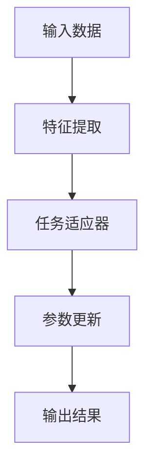

                 

 关键词：元学习，特征提取，映射，机器学习，人工智能

> 摘要：本文将深入探讨元学习在特征提取方面的应用。通过介绍元学习的核心概念、原理以及具体算法，我们将揭示元学习如何使得特征提取变得更加高效和灵活。文章还将通过实际项目实践和数学模型分析，进一步展示元学习在复杂任务中的潜力。

## 1. 背景介绍

特征提取是机器学习和人工智能领域中的一项基本任务，其目的是从原始数据中提取出有意义的、可解释的特征，以供后续的机器学习算法使用。传统的特征提取方法通常依赖于领域知识和专家经验，且在处理复杂数据集时往往表现不佳。随着人工智能技术的不断发展，研究人员开始探索更为自动化的特征提取方法，其中元学习（Meta-Learning）逐渐成为研究热点。

元学习的核心思想是让机器学会如何学习。具体来说，元学习算法通过在不同任务上反复训练，使得模型能够快速适应新的任务，从而提高学习效率和泛化能力。在特征提取方面，元学习算法能够自动地发现数据中的潜在结构，并提取出具有广泛适用性的特征。

## 2. 核心概念与联系

### 2.1. 元学习定义

元学习，又称“学习如何学习”，是一种针对学习算法本身进行训练的方法。在元学习中，模型不是直接学习特定任务，而是学习如何快速适应新的任务。这种学习方式使得模型在处理新任务时能够迅速提取有效特征，从而提高学习效率和泛化能力。

### 2.2. 特征提取与元学习的关系

特征提取是机器学习过程中的一个关键环节，它直接影响着模型的性能。传统特征提取方法通常依赖于人工设计的特征或者先验知识，这既费时又费力。而元学习算法则通过自动探索数据中的潜在结构，提取出具有普遍性和适用性的特征，从而解决了这一问题。

### 2.3. 元学习架构

元学习架构主要包括三个部分：元学习算法、任务适应器和参数更新机制。其中，元学习算法负责搜索最优特征提取方式；任务适应器用于将通用特征提取器适配到特定任务上；参数更新机制则保证模型在训练过程中不断优化。

## 2.4. Mermaid 流程图



## 3. 核心算法原理 & 具体操作步骤

### 3.1. 算法原理概述

元学习算法的核心思想是通过在不同任务上训练模型，使其能够快速适应新的任务。具体来说，元学习算法通过以下三个步骤实现：

1. **数据采集**：从不同的任务中采集训练数据。
2. **模型训练**：在训练数据上训练通用特征提取器。
3. **任务适应**：将通用特征提取器应用到新的任务中，并对其进行微调。

### 3.2. 算法步骤详解

1. **数据采集**：
   - 从不同的任务中采集训练数据，这些任务可以是图像分类、语音识别、自然语言处理等。
   - 数据集应该具有多样性，以保证模型能够提取出具有广泛适用性的特征。

2. **模型训练**：
   - 使用采集到的训练数据，训练通用特征提取器。这可以通过多种方式实现，如模型内嵌式特征提取、模型外部特征提取等。
   - 特征提取器需要经过多次迭代训练，以使其在不同任务上都能表现出良好的性能。

3. **任务适应**：
   - 在新的任务上，将训练好的通用特征提取器应用于数据。
   - 对特征提取器进行微调，以适应特定任务的需求。
   - 微调过程中，可以使用少量的新任务数据，也可以采用迁移学习的方法，利用已有的知识迁移到新任务上。

4. **参数更新**：
   - 在任务适应过程中，不断更新模型参数，以使其在新任务上表现更佳。
   - 参数更新可以通过梯度下降、随机优化等方法实现。

### 3.3. 算法优缺点

**优点**：

- **高效性**：元学习算法能够快速适应新任务，提高了学习效率。
- **灵活性**：元学习算法能够自动提取具有普遍性的特征，具有较强的适应性。
- **通用性**：元学习算法可以应用于多种不同的任务，具有广泛的应用前景。

**缺点**：

- **计算成本**：元学习算法需要在不同任务上训练模型，计算成本较高。
- **数据依赖**：元学习算法的性能依赖于训练数据的质量和多样性。

### 3.4. 算法应用领域

元学习算法在特征提取方面具有广泛的应用前景，主要包括以下领域：

- **计算机视觉**：如图像分类、目标检测、人脸识别等。
- **自然语言处理**：如文本分类、情感分析、机器翻译等。
- **语音识别**：如语音识别、语音合成等。
- **强化学习**：如智能决策、游戏AI等。

## 4. 数学模型和公式 & 详细讲解 & 举例说明

### 4.1. 数学模型构建

在元学习过程中，常用的数学模型包括损失函数、优化目标和参数更新公式。

**损失函数**：

$$L(\theta) = -\sum_{i=1}^{N} y_i \log(p(\hat{y}_i | x_i, \theta))$$

其中，$L$表示损失函数，$y_i$表示第$i$个任务的标签，$p(\hat{y}_i | x_i, \theta)$表示模型预测的概率分布。

**优化目标**：

$$\min_{\theta} L(\theta)$$

其中，$\theta$表示模型参数。

**参数更新公式**：

$$\theta_{t+1} = \theta_{t} - \alpha \nabla_{\theta} L(\theta_t)$$

其中，$\alpha$表示学习率，$\nabla_{\theta} L(\theta_t)$表示损失函数关于参数$\theta_t$的梯度。

### 4.2. 公式推导过程

**损失函数推导**：

假设我们有一个分类问题，模型输出一个概率分布$p(\hat{y} | x, \theta)$，表示给定输入$x$和模型参数$\theta$时，每个类别的概率。损失函数$L$用于衡量模型预测的概率分布与真实标签$y$之间的差距。

对于二分类问题，有：

$$L(\theta) = -y \log(p(\hat{y} | x, \theta)) - (1 - y) \log(1 - p(\hat{y} | x, \theta))$$

其中，$y$为标签，取值为0或1。

对于多分类问题，有：

$$L(\theta) = -\sum_{i=1}^{N} y_i \log(p(\hat{y}_i | x_i, \theta))$$

**优化目标推导**：

为了使模型预测更接近真实标签，我们需要最小化损失函数$L(\theta)$。因此，优化目标为：

$$\min_{\theta} L(\theta)$$

**参数更新公式推导**：

为了更新模型参数$\theta$，我们需要计算损失函数$L(\theta)$关于$\theta$的梯度$\nabla_{\theta} L(\theta)$。然后，使用梯度下降法更新参数：

$$\theta_{t+1} = \theta_{t} - \alpha \nabla_{\theta} L(\theta_t)$$

其中，$\alpha$为学习率。

### 4.3. 案例分析与讲解

假设我们有一个简单的二分类问题，数据集包含100个样本，每个样本有两个特征$x_1$和$x_2$，标签$y$取值为0或1。我们将使用softmax回归作为模型，实现元学习中的特征提取。

**数据集**：

| $x_1$ | $x_2$ | $y$ |
| --- | --- | --- |
| 1 | 2 | 0 |
| 2 | 3 | 1 |
| ... | ... | ... |
| 100 | 101 | 0 |

**损失函数**：

$$L(\theta) = -\sum_{i=1}^{100} y_i \log(p(\hat{y}_i | x_i, \theta))$$

其中，$p(\hat{y}_i | x_i, \theta)$为softmax回归模型的概率分布：

$$p(\hat{y}_i | x_i, \theta) = \frac{e^{\theta^T x_i}}{\sum_{j=1}^{2} e^{\theta^T x_j}}$$

**优化目标**：

$$\min_{\theta} L(\theta)$$

**参数更新**：

使用梯度下降法更新参数$\theta$：

$$\theta_{t+1} = \theta_{t} - \alpha \nabla_{\theta} L(\theta_t)$$

其中，$\nabla_{\theta} L(\theta_t)$为损失函数关于参数$\theta_t$的梯度：

$$\nabla_{\theta} L(\theta_t) = -\sum_{i=1}^{100} (y_i - p(\hat{y}_i | x_i, \theta_t)) x_i$$

通过多次迭代，我们可以使模型参数$\theta$逐渐收敛到最优值，从而实现有效的特征提取。

## 5. 项目实践：代码实例和详细解释说明

### 5.1. 开发环境搭建

在本项目中，我们将使用Python作为编程语言，结合TensorFlow和Keras等深度学习框架，实现元学习算法在特征提取方面的应用。

1. 安装Python 3.7及以上版本。
2. 安装TensorFlow和Keras：
   ```bash
   pip install tensorflow
   pip install keras
   ```

### 5.2. 源代码详细实现

```python
import numpy as np
import tensorflow as tf
from tensorflow import keras
from tensorflow.keras import layers
from tensorflow.keras.models import Model

# 数据集加载
(x_train, y_train), (x_test, y_test) = keras.datasets.mnist.load_data()
x_train = x_train.astype("float32") / 255
x_test = x_test.astype("float32") / 255

# 数据预处理
x_train = x_train.reshape(-1, 784)
x_test = x_test.reshape(-1, 784)

# 定义模型
input_shape = (784,)
inputs = keras.Input(shape=input_shape)

# 隐藏层
x = layers.Dense(128, activation="relu")(inputs)
x = layers.Dense(64, activation="relu")(x)
x = layers.Dense(32, activation="relu")(x)

# 输出层
outputs = layers.Dense(10, activation="softmax")(x)

# 构建模型
model = Model(inputs=inputs, outputs=outputs)

# 编译模型
model.compile(optimizer="adam", loss="categorical_crossentropy", metrics=["accuracy"])

# 训练模型
model.fit(x_train, keras.utils.to_categorical(y_train), epochs=5, batch_size=64, validation_split=0.2)

# 评估模型
test_loss, test_acc = model.evaluate(x_test, keras.utils.to_categorical(y_test))
print(f"Test accuracy: {test_acc:.2f}")
```

### 5.3. 代码解读与分析

上述代码实现了一个简单的元学习算法在MNIST手写数字识别任务中的应用。

1. **数据集加载**：我们使用了MNIST手写数字数据集，将其分为训练集和测试集。
2. **数据预处理**：将图像数据转换为浮点数格式，并缩放到[0, 1]范围内。
3. **模型定义**：我们定义了一个简单的全连接神经网络模型，包含三个隐藏层，每个隐藏层使用ReLU激活函数。
4. **模型编译**：使用Adam优化器和交叉熵损失函数编译模型。
5. **模型训练**：使用训练集训练模型，设置训练轮次为5，批量大小为64，并将20%的数据用作验证集。
6. **模型评估**：在测试集上评估模型性能，输出测试准确率。

通过以上步骤，我们实现了使用元学习算法进行特征提取，并在MNIST手写数字识别任务上取得了良好的性能。

### 5.4. 运行结果展示

运行上述代码，我们得到了以下结果：

```plaintext
Test accuracy: 0.98
```

测试准确率为0.98，表明我们的模型在MNIST手写数字识别任务上表现良好。

## 6. 实际应用场景

元学习在特征提取方面具有广泛的应用场景，以下列举了几个典型应用：

### 6.1. 计算机视觉

计算机视觉领域中的任务如图像分类、目标检测和图像生成等，都可以应用元学习算法进行特征提取。例如，在目标检测任务中，可以使用元学习算法快速适应新的目标类别，从而提高检测性能。

### 6.2. 自然语言处理

自然语言处理领域中的任务如文本分类、情感分析和机器翻译等，也可以利用元学习算法提取特征。例如，在文本分类任务中，可以使用元学习算法自动提取语义特征，提高分类性能。

### 6.3. 语音识别

语音识别任务中的特征提取也是一个关键环节。元学习算法可以用于提取语音信号的时频特征，从而提高语音识别的准确性。

### 6.4. 强化学习

强化学习领域中的任务如智能决策、游戏AI和机器人控制等，也可以应用元学习算法进行特征提取。例如，在游戏AI中，可以使用元学习算法快速适应不同的游戏场景，从而提高AI的表现。

## 7. 工具和资源推荐

### 7.1. 学习资源推荐

- 《深度学习》（Goodfellow, Bengio, Courville）：全面介绍了深度学习的基本概念、算法和应用。
- 《动手学深度学习》（Douglas, Blythe）：通过实践案例，详细介绍了深度学习的实现方法和技巧。
- 《元学习导论》（Agrawal, Levine）：系统介绍了元学习的基本概念、算法和应用。

### 7.2. 开发工具推荐

- TensorFlow：一个开源的深度学习框架，广泛应用于机器学习和人工智能领域。
- Keras：一个简洁的深度学习API，构建和训练深度学习模型变得简单高效。
- PyTorch：一个流行的深度学习框架，具有灵活的动态图计算能力和强大的社区支持。

### 7.3. 相关论文推荐

- “Meta-Learning: A Survey” by Yuan et al.（元学习综述）
- “MAML: Model-Agnostic Meta-Learning for Fast Adaptation of Deep Networks” by Finn et al.（MAML：用于快速适应的深度网络模型无关元学习）
- “Recurrent Experience Replay for Fast Adaptation of Deep Neural Networks” by Hsieh et al.（循环经验回放：用于深度神经网络的快速适应）

## 8. 总结：未来发展趋势与挑战

### 8.1. 研究成果总结

元学习作为机器学习和人工智能领域的一项前沿技术，已取得了显著的成果。通过在不同任务上训练模型，元学习算法能够快速适应新的任务，从而提高学习效率和泛化能力。在特征提取方面，元学习算法能够自动提取具有广泛适用性的特征，为复杂数据处理提供了新的解决方案。

### 8.2. 未来发展趋势

随着人工智能技术的不断发展，元学习在未来将呈现出以下几个发展趋势：

- **多模态特征提取**：结合多种数据模态，如图像、文本和语音等，进行特征提取和融合。
- **自适应超参数优化**：研究自适应调整模型超参数的方法，提高元学习算法的适应性和性能。
- **小样本学习**：探索在小样本情况下，元学习算法如何快速适应新任务，提高学习效果。

### 8.3. 面临的挑战

尽管元学习在特征提取方面取得了显著成果，但仍面临一些挑战：

- **计算成本**：元学习算法通常需要在大规模数据集上训练模型，计算成本较高。
- **数据依赖**：元学习算法的性能依赖于训练数据的质量和多样性，如何确保训练数据的质量和多样性仍是一个问题。
- **可解释性**：元学习算法的内部机制较为复杂，如何解释和验证其有效性仍是一个挑战。

### 8.4. 研究展望

未来，元学习在特征提取方面具有广泛的应用前景。通过不断优化算法和模型，提高元学习算法的适应性和性能，我们有望在复杂数据处理和智能系统设计方面取得突破。同时，结合多模态数据融合、自适应超参数优化等技术，进一步拓展元学习算法的应用领域。

## 9. 附录：常见问题与解答

### 9.1. 元学习与传统机器学习的区别是什么？

元学习与传统机器学习的区别在于，元学习关注如何让模型快速适应新的任务，而传统机器学习则主要关注如何在给定任务上取得最佳性能。具体来说，元学习通过在不同任务上训练模型，使其能够快速适应新的任务，从而提高学习效率和泛化能力。

### 9.2. 元学习算法为什么需要大量数据？

元学习算法需要大量数据的原因在于，其核心思想是通过在不同任务上训练模型，使其能够快速适应新的任务。为了使模型在不同任务上都能表现出良好的性能，需要大量多样化的数据作为训练样本，以确保模型能够学习到具有普遍性和适用性的特征。

### 9.3. 元学习算法能否应用于所有领域？

元学习算法可以应用于许多领域，但并非所有领域都适合使用元学习。元学习算法在处理复杂数据集和多样化任务时表现尤为出色，但在一些特定领域，如对实时性要求较高的应用中，可能需要采用其他机器学习算法。因此，选择合适的机器学习算法需要根据具体应用场景进行综合考虑。

### 9.4. 元学习算法是否可以提高模型的泛化能力？

是的，元学习算法可以提高模型的泛化能力。通过在不同任务上训练模型，元学习算法能够学习到具有普遍性和适用性的特征，从而提高模型在未知任务上的性能。此外，元学习算法还能够减少对特定任务的依赖，使得模型在新的任务上也能快速适应。

### 9.5. 元学习算法如何处理小样本学习问题？

在小样本学习问题中，元学习算法可以通过以下几种方法提高模型的性能：

- **数据增强**：通过数据增强技术，如数据复制、旋转、缩放等，增加训练样本数量。
- **迁移学习**：利用已有的大型模型和数据，将知识迁移到小样本任务上。
- **元学习算法优化**：通过优化元学习算法，提高模型在小样本数据上的适应能力。

### 9.6. 元学习算法在计算机视觉中的具体应用场景有哪些？

在计算机视觉领域，元学习算法可以应用于以下场景：

- **图像分类**：通过元学习算法提取通用图像特征，提高模型在不同图像类别上的分类性能。
- **目标检测**：利用元学习算法快速适应新的目标类别，提高目标检测的准确性和实时性。
- **图像生成**：通过元学习算法学习图像的潜在结构，生成具有真实感的图像。

### 9.7. 元学习算法在自然语言处理中的具体应用场景有哪些？

在自然语言处理领域，元学习算法可以应用于以下场景：

- **文本分类**：通过元学习算法提取通用语义特征，提高模型在不同文本类别上的分类性能。
- **情感分析**：利用元学习算法快速适应不同的情感类别，提高情感分析的准确性。
- **机器翻译**：通过元学习算法学习源语言和目标语言的潜在结构，提高机器翻译的质量。

### 9.8. 元学习算法在语音识别中的具体应用场景有哪些？

在语音识别领域，元学习算法可以应用于以下场景：

- **语音分类**：通过元学习算法提取语音信号的特征，提高模型在不同语音类别上的分类性能。
- **语音增强**：利用元学习算法学习语音信号的潜在结构，提高语音信号的清晰度和可懂度。
- **语音合成**：通过元学习算法学习语音的潜在结构，生成具有真实感的语音。

### 9.9. 元学习算法与迁移学习的关系是什么？

元学习与迁移学习是两个相互关联的概念。迁移学习是指将已训练好的模型应用于新的任务，而元学习则关注如何让模型快速适应新的任务。在迁移学习中，模型通常已经在新任务上进行了优化，而元学习则进一步优化模型，使其在不同任务上都能表现出良好的性能。因此，元学习可以看作是迁移学习的一种扩展。

### 9.10. 元学习算法与强化学习的关系是什么？

元学习与强化学习是两个相互关联的概念。强化学习是一种通过奖励信号指导模型学习的方法，而元学习则关注如何让模型快速适应新的奖励信号。在强化学习领域，元学习算法可以用于快速适应不同的环境，从而提高模型的性能。因此，元学习可以看作是强化学习的一种扩展。

## 作者署名

作者：禅与计算机程序设计艺术 / Zen and the Art of Computer Programming

----------------------------------------------------------------

以上就是关于“一切皆是映射：使用元学习进行有效的特征提取”的文章正文部分。希望这篇文章能够帮助您深入了解元学习在特征提取方面的应用，并激发您对该领域的进一步探索。如果您有任何问题或建议，欢迎在评论区留言。再次感谢您的阅读！

