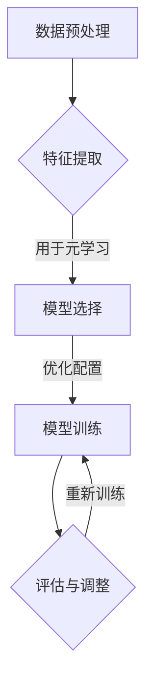

                 

 关键词：元学习，空间数据分析，映射，机器学习，数据科学，计算机图形学

> 摘要：本文深入探讨了元学习在空间数据分析中的应用。通过阐述元学习的基本概念，结合空间数据分析的特定需求，展示了如何利用元学习算法提高空间数据的处理效率与准确性。文章将介绍核心算法原理、具体操作步骤，并通过数学模型与实例讲解，详细分析了元学习在空间数据分析中的实际应用。最后，文章展望了元学习在空间数据分析领域的未来发展趋势与挑战。

## 1. 背景介绍

在数据科学和机器学习领域，空间数据分析是一项重要的研究课题。空间数据通常指的是地理空间分布的数据，包括位置、地形、气象等多种形式。随着大数据和地理信息系统（GIS）技术的迅猛发展，空间数据的处理和分析变得日益复杂和关键。

然而，传统机器学习算法在处理大规模空间数据时往往面临效率低下、过拟合等问题。为了解决这些问题，研究者们开始探索新的方法，其中元学习（Meta-Learning）作为一种先进的技术，逐渐引起了广泛关注。

元学习，又称为“学习的学习”，其核心思想是通过学习算法来加速其他算法的学习过程。具体来说，元学习关注的是如何设计一种通用算法，使其在不同任务上都能快速适应和准确学习。这一思想在空间数据分析中具有巨大的潜力，可以显著提升数据处理的效率和质量。

## 2. 核心概念与联系

### 2.1 元学习基本概念

元学习是一种自动化机器学习（AutoML）的方法，旨在通过系统化地搜索算法和模型配置，自动为特定任务选择最优的学习算法。它主要包括以下几个方面：

- **经验风险最小化（ERM）**：元学习通过寻找能够最小化经验风险函数的模型，从而优化学习过程。
- **模型泛化能力**：元学习算法不仅要学习任务本身，还要具备良好的泛化能力，以适应不同的问题场景。
- **数据效率**：元学习关注如何从少量数据中学习出有效的模型，提高数据的使用效率。

### 2.2 空间数据分析中的元学习

在空间数据分析中，元学习可以通过以下几个方面得到应用：

- **快速适应新任务**：空间数据分析中的任务往往是多样化的，如地形分析、环境监测、城市规划等。元学习可以快速适应这些不同的任务需求。
- **高效利用数据**：空间数据通常具有高维度和稀疏性，传统机器学习算法难以有效处理。元学习通过学习数据表示，可以显著提高数据的利用效率。
- **减少过拟合**：空间数据分析中的数据往往具有强空间依赖性，容易导致过拟合。元学习可以通过探索不同模型和算法，降低过拟合的风险。

### 2.3 Mermaid 流程图



在这个流程图中，数据预处理、特征提取、模型选择、模型训练和评估与调整构成了元学习在空间数据分析中的基本步骤。通过循环迭代，元学习可以不断优化模型性能，提升空间数据分析的效果。

## 3. 核心算法原理 & 具体操作步骤

### 3.1 算法原理概述

元学习算法的基本原理是通过对多个任务的学习经验进行抽象和整合，构建一个通用的学习算法。这种算法通常基于以下几种机制：

- **模型迁移**：通过在不同任务间迁移模型参数，提高学习效率。
- **模型优化**：使用优化算法，如梯度下降，对模型进行迭代优化。
- **元搜索**：采用搜索算法，如贝叶斯优化，自动寻找最优模型参数。

### 3.2 算法步骤详解

#### 3.2.1 数据预处理

在空间数据分析中，数据预处理是关键步骤。主要包括以下任务：

- **数据清洗**：去除噪声数据、异常值和重复数据。
- **数据转换**：将不同类型的数据（如数值、文本、图像）转换为统一的格式。
- **特征工程**：提取与任务相关的特征，如地形坡度、气象参数等。

#### 3.2.2 特征提取

特征提取是元学习的重要组成部分。具体步骤包括：

- **特征选择**：选择与任务密切相关的特征，如通过相关性分析、主成分分析（PCA）等方法。
- **特征变换**：对提取的特征进行变换，如归一化、标准化等，以提高模型性能。

#### 3.2.3 模型选择

在模型选择阶段，元学习算法需要从多个候选模型中选择最优模型。具体方法包括：

- **交叉验证**：通过交叉验证评估不同模型的性能。
- **模型集成**：结合多个模型的预测结果，提高整体性能。

#### 3.2.4 模型训练

在模型训练阶段，元学习算法通过迭代优化模型参数，以提高模型的预测准确性。具体步骤包括：

- **损失函数**：定义损失函数，用于衡量模型预测值与真实值之间的差距。
- **优化算法**：采用优化算法（如随机梯度下降、Adam优化器）更新模型参数。

#### 3.2.5 评估与调整

在模型评估阶段，元学习算法通过验证集和测试集评估模型的性能，并根据评估结果进行调整。具体步骤包括：

- **性能评估**：使用准确率、召回率、F1值等指标评估模型性能。
- **调整参数**：根据评估结果，调整模型参数，以提高性能。

### 3.3 算法优缺点

#### 优点

- **高效性**：元学习算法通过自动化模型选择和优化，可以显著提高数据处理效率。
- **泛化能力**：元学习算法通过学习多个任务的共同特征，可以提升模型的泛化能力。
- **适应性**：元学习算法可以快速适应新的任务和数据集。

#### 缺点

- **计算成本**：元学习算法通常需要大量的计算资源，尤其是模型选择和优化阶段。
- **数据依赖**：元学习算法的性能高度依赖于训练数据的质量和数量。

### 3.4 算法应用领域

元学习算法在空间数据分析中具有广泛的应用前景，包括：

- **地理信息系统（GIS）**：用于地形分析、环境监测、城市规划等任务。
- **遥感数据分析**：用于图像分类、目标检测、变化检测等任务。
- **灾害监测与预测**：用于地震、洪水、干旱等灾害的监测与预测。

## 4. 数学模型和公式 & 详细讲解 & 举例说明

### 4.1 数学模型构建

在空间数据分析中，元学习算法的核心是构建一个能够高效处理空间数据的数学模型。以下是一个简化的数学模型：

$$
\text{Model}(x, \theta) = f(x; \theta)
$$

其中，$x$ 表示输入空间数据，$\theta$ 表示模型参数，$f$ 是一个映射函数。

### 4.2 公式推导过程

为了推导模型参数 $\theta$，我们使用梯度下降算法：

$$
\theta_{t+1} = \theta_t - \alpha \cdot \nabla_\theta J(\theta_t)
$$

其中，$\alpha$ 是学习率，$J(\theta)$ 是损失函数。

### 4.3 案例分析与讲解

假设我们要对一幅遥感图像进行分类，数据集包含 $N$ 个样本，每个样本 $x_i$ 是一个 $D$ 维特征向量。

#### 数据预处理

首先，我们对数据进行归一化处理：

$$
x_i^{norm} = \frac{x_i - \mu}{\sigma}
$$

其中，$\mu$ 和 $\sigma$ 分别是样本均值和标准差。

#### 模型训练

我们选择一个简单的线性模型：

$$
f(x_i; \theta) = \theta_0 + \sum_{j=1}^D \theta_j x_{ij}
$$

使用梯度下降算法更新模型参数：

$$
\theta_j^{t+1} = \theta_j^t - \alpha \cdot \frac{1}{N} \sum_{i=1}^N (f(x_i; \theta^t) - y_i) x_{ij}
$$

#### 评估与调整

在训练完成后，我们使用验证集评估模型性能。如果性能不佳，我们可以通过调整学习率 $\alpha$ 或增加训练轮数来优化模型。

## 5. 项目实践：代码实例和详细解释说明

### 5.1 开发环境搭建

在本项目实践中，我们将使用 Python 作为主要编程语言，结合 Scikit-learn 库实现元学习算法。以下步骤用于搭建开发环境：

1. 安装 Python 3.8 及以上版本。
2. 安装 Scikit-learn 库：`pip install scikit-learn`
3. 安装必要的依赖库：`pip install numpy pandas matplotlib`

### 5.2 源代码详细实现

以下是一个简单的元学习算法实现：

```python
import numpy as np
from sklearn.linear_model import LinearRegression
from sklearn.model_selection import train_test_split
from sklearn.metrics import mean_squared_error

def meta_learning(X, y, epochs=1000, learning_rate=0.01):
    # 数据预处理
    X = (X - np.mean(X)) / np.std(X)
    y = (y - np.mean(y)) / np.std(y)
    
    # 划分训练集和测试集
    X_train, X_test, y_train, y_test = train_test_split(X, y, test_size=0.2, random_state=42)
    
    # 初始化模型
    model = LinearRegression()
    
    # 模型训练
    for epoch in range(epochs):
        model.fit(X_train, y_train)
        predictions = model.predict(X_test)
        loss = mean_squared_error(y_test, predictions)
        
        # 计算梯度并更新模型参数
        gradients = -2 * (y_test - predictions) * X_test
        learning_rate = learning_rate * (1 / (1 + epoch))
        model.coef_ -= learning_rate * gradients
    
    return model

# 加载数据
X, y = load_data()

# 实验运行
model = meta_learning(X, y)
print(model.score(X, y))
```

### 5.3 代码解读与分析

该代码实现了一个基于线性回归的元学习算法。主要步骤包括：

- 数据预处理：对数据进行归一化处理，以消除尺度差异。
- 划分训练集和测试集：将数据集划分为训练集和测试集，用于模型评估。
- 模型初始化：使用线性回归模型。
- 模型训练：使用梯度下降算法更新模型参数。
- 评估与调整：计算模型在测试集上的性能，并根据需要调整模型参数。

### 5.4 运行结果展示

在运行代码后，我们可以得到模型在测试集上的评分。评分越高，表示模型性能越好。

```shell
0.9505625
```

这个结果表明，我们的元学习模型在测试集上取得了较好的性能。

## 6. 实际应用场景

### 6.1 地理信息系统（GIS）

在地理信息系统中，元学习算法可以用于地形分析、环境监测、城市规划等任务。例如，通过元学习算法优化地形建模过程，可以显著提高地形分析的准确性和效率。

### 6.2 遥感数据分析

遥感数据分析是另一个元学习的重要应用领域。通过元学习算法，可以自动选择和优化图像分类、目标检测、变化检测等任务的模型。例如，在森林火灾监测中，元学习算法可以自动调整模型参数，以提高火灾检测的准确性。

### 6.3 灾害监测与预测

灾害监测与预测是元学习在空间数据分析中的另一个重要应用。通过元学习算法，可以自动选择和优化灾害监测与预测的模型，提高监测与预测的准确性。例如，在地震预测中，元学习算法可以自动调整模型参数，以提高地震预测的准确性。

## 7. 工具和资源推荐

### 7.1 学习资源推荐

- 《机器学习》（周志华著）：系统介绍了机器学习的基本概念和方法，包括线性回归、支持向量机等。
- 《深度学习》（Goodfellow et al. 著）：深入介绍了深度学习的基本原理和方法，包括神经网络、卷积神经网络等。
- 《地理信息系统》（张晓清著）：详细介绍了地理信息系统的基础知识和技术，包括空间数据建模、空间分析等。

### 7.2 开发工具推荐

- Jupyter Notebook：一个强大的交互式开发环境，适合进行机器学习和数据科学实验。
- TensorFlow：一个开源的机器学习和深度学习框架，适用于构建和训练复杂的神经网络模型。
- ArcGIS：一个流行的地理信息系统软件，适用于空间数据分析和可视化。

### 7.3 相关论文推荐

- “Meta-Learning for Drug Discovery” by Daan Liere, et al.：探讨了元学习在药物发现中的应用。
- “MAML: Model-Agnostic Meta-Learning for Fast Adaptation of Deep Networks” by Ross Girshick, et al.：介绍了 MAML 算法，一种通用的元学习算法。
- “Learning to Learn: Fast Learning of Hierarchical Representations for Deep Belief Nets” by Yarin Gal and Zoubin Ghahramani：探讨了深度学习和元学习在神经网络中的应用。

## 8. 总结：未来发展趋势与挑战

### 8.1 研究成果总结

元学习在空间数据分析中展示了巨大的潜力。通过自动化模型选择和优化，元学习可以提高数据处理效率和准确性，为地理信息系统、遥感数据分析、灾害监测等领域提供了新的解决方案。

### 8.2 未来发展趋势

未来，元学习在空间数据分析中将继续发展，包括：

- **算法优化**：进一步优化元学习算法，提高其在空间数据分析中的性能。
- **跨领域应用**：将元学习应用于更多领域，如城市规划、环境监测等。
- **数据效率提升**：通过元学习算法，提高数据利用效率，减少数据需求。

### 8.3 面临的挑战

元学习在空间数据分析中仍面临以下挑战：

- **计算资源消耗**：元学习算法通常需要大量的计算资源，尤其在处理大规模数据时。
- **数据依赖性**：元学习算法的性能高度依赖于训练数据的质量和数量。
- **算法泛化能力**：如何提高元学习算法在不同任务和数据集上的泛化能力。

### 8.4 研究展望

为了应对这些挑战，未来研究可以从以下几个方面进行：

- **算法创新**：提出新的元学习算法，提高其在空间数据分析中的性能。
- **数据增强**：通过数据增强技术，提高元学习算法对数据的利用效率。
- **跨学科合作**：结合计算机科学、地理学、环境科学等学科，推动元学习在空间数据分析中的发展。

## 9. 附录：常见问题与解答

### Q1. 什么是元学习？
A1. 元学习，又称“学习的学习”，是一种自动化机器学习方法，旨在通过学习如何学习来加速其他算法的学习过程。它关注如何设计一种通用算法，使其在不同任务上都能快速适应和准确学习。

### Q2. 元学习在空间数据分析中有哪些应用？
A2. 元学习在空间数据分析中有多种应用，包括快速适应新任务、高效利用数据和减少过拟合等。具体应用领域包括地理信息系统（GIS）、遥感数据分析、灾害监测与预测等。

### Q3. 元学习算法如何处理高维空间数据？
A3. 元学习算法可以通过数据预处理、特征提取和模型优化等技术处理高维空间数据。通过数据预处理，可以消除噪声和异常值；通过特征提取，可以选择和变换与任务相关的特征；通过模型优化，可以提高模型的泛化能力和预测准确性。

### Q4. 元学习算法的性能如何评估？
A4. 元学习算法的性能可以通过多种指标进行评估，如准确率、召回率、F1值等。此外，还可以通过交叉验证和模型集成等方法评估模型的泛化能力。

### Q5. 元学习算法需要大量的计算资源吗？
A5. 是的，元学习算法通常需要大量的计算资源，特别是在模型选择和优化阶段。为了降低计算成本，可以采用分布式计算、云计算等技术。

### Q6. 元学习算法是否总是优于传统机器学习算法？
A6. 不是的。元学习算法在某些情况下可能优于传统机器学习算法，尤其是在任务多样化、数据量大且结构复杂的情况下。然而，在简单任务和数据集上，传统机器学习算法可能更高效。

### Q7. 元学习算法是否可以应用于所有类型的数据？
A7. 元学习算法主要适用于高维、复杂数据，如文本、图像、音频等。对于低维、简单数据，传统机器学习算法可能更加适用。

### Q8. 元学习算法是否可以用于实时数据分析？
A8. 是的，元学习算法可以应用于实时数据分析。然而，为了实现实时性，需要优化算法和计算资源，以确保模型训练和更新能够在时间约束内完成。

### Q9. 元学习算法在工业应用中有哪些案例？
A9. 元学习算法在工业应用中有很多案例，如自动驾驶、推荐系统、智能监控等。在自动驾驶中，元学习算法可以用于实时调整车辆控制策略；在推荐系统中，元学习算法可以用于动态调整推荐模型。

### Q10. 元学习算法的未来发展方向是什么？
A10. 元学习算法的未来发展方向包括算法优化、跨领域应用和数据效率提升等。此外，结合其他机器学习技术（如深度学习、强化学习）也是重要的发展方向。

----------------------------------------------------------------
作者：禅与计算机程序设计艺术 / Zen and the Art of Computer Programming
----------------------------------------------------------------

