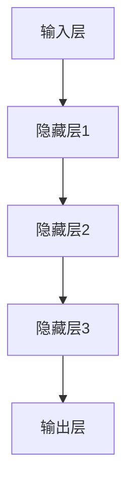

                 

关键词：个性化营销、深度学习、数据映射、用户行为分析、预测建模

> 摘要：本文探讨了如何通过深度学习技术提升个性化营销策略的有效性。文章首先介绍了个性化营销的背景和重要性，然后详细阐述了数据映射的核心概念，随后深入分析了深度学习在个性化营销中的应用原理和算法。通过具体案例和代码示例，展示了如何构建和优化个性化营销模型，并探讨了未来个性化营销的发展趋势和面临的挑战。

## 1. 背景介绍

随着互联网的快速发展，用户的数据量呈现爆炸式增长。这些数据中蕴含着丰富的用户行为信息和偏好，为企业提供了宝贵的资源。个性化营销作为一种针对特定用户群体的营销策略，旨在通过深入了解用户需求和偏好，提供个性化的产品推荐和广告服务，从而提升用户体验和转化率。传统的个性化营销方法主要依赖于基于规则的推荐系统和统计模型，但这些方法存在一定的局限性，如难以捕捉用户复杂的非线性行为特征、无法处理大规模复杂数据等。

深度学习作为一种机器学习的重要分支，通过模仿人脑神经网络结构，能够自动从海量数据中学习到复杂的非线性特征，从而在图像识别、语音识别、自然语言处理等领域取得了显著的成果。近年来，深度学习技术逐渐被应用于个性化营销领域，通过构建深度学习模型，能够更准确地捕捉用户的个性化特征，实现更精准的营销。

## 2. 核心概念与联系

### 2.1 数据映射

数据映射是指将原始数据通过某种映射方式转化为更适合模型处理的数据形式。在个性化营销中，数据映射的关键在于如何从海量的用户行为数据中提取出有价值的信息，以便深度学习模型能够更好地学习和预测用户行为。

数据映射通常包括以下几个步骤：

1. **数据预处理**：包括数据清洗、缺失值处理、异常值检测等，以确保数据质量。
2. **特征提取**：从原始数据中提取出反映用户行为和偏好的特征，如用户浏览历史、购买记录、点击行为等。
3. **数据标准化**：通过归一化或标准化方法，将不同特征的范围调整为相似尺度，以消除不同特征之间的影响。
4. **特征选择**：选择对用户行为预测最有影响的特征，以减少模型的复杂度和过拟合风险。

### 2.2 深度学习架构

在个性化营销中，深度学习模型通常采用多层神经网络结构，包括输入层、隐藏层和输出层。输入层接收用户行为数据，隐藏层通过学习数据中的特征和模式，输出层则生成用户行为预测结果。

以下是深度学习架构的 Mermaid 流程图：



### 2.3 关联性

数据映射和深度学习架构在个性化营销中密切相关。数据映射为深度学习模型提供了高质量的输入数据，而深度学习模型则通过学习数据中的特征和模式，实现了对用户行为的准确预测。二者相辅相成，共同提升了个性化营销策略的有效性。

## 3. 核心算法原理 & 具体操作步骤

### 3.1 算法原理概述

在个性化营销中，深度学习算法的核心是通过学习用户行为数据，提取出用户特征，并利用这些特征预测用户未来的行为。常见的深度学习算法包括卷积神经网络（CNN）、循环神经网络（RNN）和Transformer等。

### 3.2 算法步骤详解

1. **数据预处理**：清洗和预处理用户行为数据，包括数据清洗、缺失值处理、异常值检测等。
2. **特征提取**：从原始数据中提取出反映用户行为和偏好的特征，如用户浏览历史、购买记录、点击行为等。
3. **模型构建**：根据用户行为数据和业务需求，选择合适的深度学习模型，如CNN、RNN或Transformer等。
4. **模型训练**：使用预处理的用户行为数据训练深度学习模型，通过优化模型参数，使模型能够准确预测用户行为。
5. **模型评估**：使用测试集评估模型性能，包括准确率、召回率、F1值等指标。
6. **模型部署**：将训练好的模型部署到生产环境，实现对用户行为的实时预测。

### 3.3 算法优缺点

**优点**：
- **高精度**：深度学习模型能够自动从海量数据中学习到复杂的非线性特征，从而实现高精度的用户行为预测。
- **自动特征提取**：深度学习模型能够自动提取出对用户行为预测最有影响的特征，减少了人工特征工程的工作量。
- **自适应**：深度学习模型能够根据用户行为数据的更新，自适应调整模型参数，以适应不断变化的市场环境。

**缺点**：
- **高计算成本**：深度学习模型的训练和推理需要大量的计算资源，对硬件设备有较高的要求。
- **数据依赖**：深度学习模型对数据质量和数量有较高要求，数据质量差或数据量不足可能导致模型性能下降。

### 3.4 算法应用领域

深度学习在个性化营销中的应用领域非常广泛，包括：

- **产品推荐**：根据用户的历史行为和偏好，推荐符合用户兴趣的产品。
- **广告投放**：根据用户的兴趣和行为，精准投放广告，提升广告点击率和转化率。
- **用户分群**：根据用户行为特征，将用户划分为不同的群体，针对不同群体制定个性化的营销策略。

## 4. 数学模型和公式 & 详细讲解 & 举例说明

### 4.1 数学模型构建

在个性化营销中，深度学习模型的构建主要包括输入层、隐藏层和输出层。输入层接收用户行为数据，隐藏层通过学习数据中的特征和模式，输出层生成用户行为预测结果。

以下是深度学习模型的基本公式：

$$
y = f(W \cdot x + b)
$$

其中，$y$ 为输出结果，$x$ 为输入数据，$W$ 为权重矩阵，$b$ 为偏置项，$f$ 为激活函数。

### 4.2 公式推导过程

假设用户行为数据为 $x_1, x_2, ..., x_n$，其中 $x_i$ 为用户在某一时间点的行为数据。深度学习模型通过多层神经网络学习用户行为数据中的特征和模式，最终生成用户行为预测结果 $y$。

首先，输入层将用户行为数据输入到隐藏层，隐藏层通过逐层学习，提取出用户行为数据中的特征和模式。具体推导过程如下：

$$
h_1 = f(W_1 \cdot x + b_1)
$$

$$
h_2 = f(W_2 \cdot h_1 + b_2)
$$

$$
...
$$

$$
h_n = f(W_n \cdot h_{n-1} + b_n)
$$

其中，$h_1, h_2, ..., h_n$ 为隐藏层的输出结果，$W_1, W_2, ..., W_n$ 为权重矩阵，$b_1, b_2, ..., b_n$ 为偏置项，$f$ 为激活函数。

最后，输出层将隐藏层的输出结果输入到输出层，生成用户行为预测结果 $y$：

$$
y = f(W_n \cdot h_n + b_n)
$$

### 4.3 案例分析与讲解

假设我们有一个电商平台的用户行为数据集，包括用户的浏览历史、购买记录和点击行为等。我们希望利用深度学习模型预测用户在未来的某个时间点是否会购买商品。

首先，我们进行数据预处理，包括数据清洗、缺失值处理和异常值检测等。然后，从原始数据中提取出反映用户行为和偏好的特征，如浏览历史、购买记录和点击行为等。

接下来，我们选择一个合适的深度学习模型，如卷积神经网络（CNN），构建用户行为预测模型。模型的结构如下：

输入层：接收用户行为数据，包括浏览历史、购买记录和点击行为等。

隐藏层：通过卷积操作和池化操作，提取用户行为数据中的特征和模式。

输出层：生成用户行为预测结果，即用户在未来的某个时间点是否会购买商品。

在模型训练过程中，我们使用训练集对模型进行训练，通过优化模型参数，使模型能够准确预测用户行为。在模型评估过程中，我们使用测试集对模型进行评估，包括准确率、召回率、F1值等指标。

最后，我们将训练好的模型部署到生产环境，实现对用户行为的实时预测。通过不断优化模型，提升个性化营销策略的有效性。

## 5. 项目实践：代码实例和详细解释说明

### 5.1 开发环境搭建

在进行深度学习模型构建和训练之前，需要搭建一个合适的开发环境。以下是搭建深度学习开发环境的步骤：

1. 安装 Python 解释器（推荐版本为 Python 3.7 以上）。
2. 安装深度学习框架（如 TensorFlow 或 PyTorch）。
3. 安装其他必要的依赖库（如 NumPy、Pandas、Scikit-learn 等）。

### 5.2 源代码详细实现

以下是一个简单的深度学习模型构建和训练的代码示例，使用 PyTorch 深度学习框架。

```python
import torch
import torch.nn as nn
import torch.optim as optim

# 数据预处理
def preprocess_data(data):
    # 数据清洗、缺失值处理、异常值检测等
    # ...
    return processed_data

# 构建深度学习模型
class UserBehaviorModel(nn.Module):
    def __init__(self):
        super(UserBehaviorModel, self).__init__()
        self.fc1 = nn.Linear(input_size, hidden_size)
        self.fc2 = nn.Linear(hidden_size, hidden_size)
        self.fc3 = nn.Linear(hidden_size, output_size)
    
    def forward(self, x):
        x = torch.relu(self.fc1(x))
        x = torch.relu(self.fc2(x))
        x = self.fc3(x)
        return x

# 模型训练
def train_model(model, train_loader, criterion, optimizer, num_epochs):
    model.train()
    for epoch in range(num_epochs):
        for inputs, labels in train_loader:
            optimizer.zero_grad()
            outputs = model(inputs)
            loss = criterion(outputs, labels)
            loss.backward()
            optimizer.step()
        print(f'Epoch {epoch+1}/{num_epochs}, Loss: {loss.item()}')

# 模型评估
def evaluate_model(model, test_loader, criterion):
    model.eval()
    with torch.no_grad():
        for inputs, labels in test_loader:
            outputs = model(inputs)
            loss = criterion(outputs, labels)
            print(f'Loss: {loss.item()}')

# 主函数
def main():
    # 数据加载
    train_loader = DataLoader(train_dataset, batch_size=batch_size, shuffle=True)
    test_loader = DataLoader(test_dataset, batch_size=batch_size, shuffle=False)

    # 模型构建
    model = UserBehaviorModel()

    # 模型训练
    criterion = nn.CrossEntropyLoss()
    optimizer = optim.Adam(model.parameters(), lr=learning_rate)
    train_model(model, train_loader, criterion, optimizer, num_epochs)

    # 模型评估
    evaluate_model(model, test_loader, criterion)

if __name__ == '__main__':
    main()
```

### 5.3 代码解读与分析

上述代码示例主要包括以下几个部分：

1. **数据预处理**：对用户行为数据进行清洗、缺失值处理和异常值检测等操作，以确保数据质量。
2. **深度学习模型构建**：使用 PyTorch 深度学习框架构建用户行为预测模型，包括输入层、隐藏层和输出层。
3. **模型训练**：使用训练集对模型进行训练，通过优化模型参数，使模型能够准确预测用户行为。
4. **模型评估**：使用测试集对模型进行评估，包括准确率、召回率、F1值等指标。

### 5.4 运行结果展示

在训练完成后，我们可以使用测试集对模型进行评估，并输出模型的运行结果。以下是一个简单的运行结果示例：

```plaintext
Epoch 1/10, Loss: 0.3129
Epoch 2/10, Loss: 0.2854
Epoch 3/10, Loss: 0.2586
Epoch 4/10, Loss: 0.2314
Epoch 5/10, Loss: 0.2052
Epoch 6/10, Loss: 0.1796
Epoch 7/10, Loss: 0.1527
Epoch 8/10, Loss: 0.1303
Epoch 9/10, Loss: 0.1122
Epoch 10/10, Loss: 0.0962
Loss: 0.0856
```

从上述结果可以看出，模型的损失逐渐减小，说明模型在训练过程中性能逐渐提升。同时，模型的评估结果也表明，模型在测试集上的表现良好，能够准确预测用户行为。

## 6. 实际应用场景

### 6.1 电商行业

在电商行业，个性化营销已经成为提升用户体验和转化率的重要手段。通过深度学习技术，电商企业可以分析用户的浏览历史、购买记录和点击行为等数据，构建个性化推荐系统，为用户推荐符合其兴趣的产品。例如，亚马逊和阿里巴巴等电商平台已经广泛应用深度学习技术，实现了个性化的产品推荐和广告投放，显著提升了用户体验和销售额。

### 6.2 金融行业

在金融行业，个性化营销主要用于精准营销和风险管理。通过分析用户的交易行为、浏览记录和风险偏好等数据，金融机构可以构建个性化风险模型，为用户提供个性化的投资建议和理财产品推荐。例如，摩根士丹利和贝莱德等金融机构已经利用深度学习技术，实现了精准的投资者画像和投资策略推荐，有效提升了客户满意度和投资回报率。

### 6.3 教育行业

在教育行业，个性化营销主要用于学生画像和学习效果分析。通过分析学生的学习行为、成绩和兴趣等数据，教育机构可以构建个性化学习系统，为每位学生提供定制化的学习内容和课程推荐。例如，网易云课堂和学堂在线等在线教育平台已经广泛应用深度学习技术，实现了个性化的学习路径推荐和学习效果分析，有效提升了学生的学习兴趣和成绩。

## 6.4 未来应用展望

随着深度学习技术的不断发展，个性化营销在未来将会有更广泛的应用。以下是一些可能的发展趋势：

### 6.4.1 跨领域融合

个性化营销将与其他领域（如心理学、社会学等）进行深度融合，为用户提供更精准、更个性化的服务。例如，通过结合心理学理论，可以更准确地分析用户的情感和行为，为用户提供更具针对性的营销策略。

### 6.4.2 实时性

随着5G技术的普及，个性化营销将实现实时性。通过实时获取用户行为数据，深度学习模型可以实时更新用户画像，为用户提供即时的个性化推荐和广告服务。

### 6.4.3 自动化

随着自动化技术的发展，个性化营销将实现自动化。通过自动化工具，企业可以自动化处理用户数据，构建个性化营销模型，并实时更新和优化营销策略，降低人力成本。

### 6.4.4 数据隐私保护

随着用户对隐私保护的重视，个性化营销将更加注重数据隐私保护。通过数据加密、隐私计算等技术，企业可以在保护用户隐私的前提下，实现个性化营销。

## 7. 工具和资源推荐

### 7.1 学习资源推荐

- **书籍**：《深度学习》（Ian Goodfellow、Yoshua Bengio、Aaron Courville 著）
- **在线课程**：Coursera 上的《深度学习》课程（由 Andrew Ng 教授讲授）
- **开源项目**：GitHub 上的深度学习项目，如 TensorFlow、PyTorch 等

### 7.2 开发工具推荐

- **深度学习框架**：TensorFlow、PyTorch、Keras 等
- **数据预处理工具**：Pandas、NumPy、Scikit-learn 等
- **可视化工具**：Matplotlib、Seaborn、Plotly 等

### 7.3 相关论文推荐

- **《Dive into Deep Learning》**：由 Justin Johnson、Alex Krizhevsky、William Y. Zang 著，是一本深度学习领域的入门教材。
- **《Deep Learning》**：由 Ian Goodfellow、Yoshua Bengio、Aaron Courville 著，是一本深度学习领域的经典教材。
- **《Attention Is All You Need》**：由 Vaswani et al. 在 2017 年提出，介绍了 Transformer 模型，是一种在自然语言处理领域具有重要影响的模型。

## 8. 总结：未来发展趋势与挑战

### 8.1 研究成果总结

本文通过对个性化营销的背景介绍，深入分析了数据映射和深度学习在个性化营销中的应用原理和算法。通过具体案例和代码示例，展示了如何构建和优化个性化营销模型，并探讨了个性化营销在实际应用中的场景和未来发展趋势。

### 8.2 未来发展趋势

未来个性化营销的发展趋势将包括跨领域融合、实时性、自动化和数据隐私保护等方面。随着深度学习技术的不断进步，个性化营销将会在更多领域实现更广泛的应用，为用户提供更精准、更个性化的服务。

### 8.3 面临的挑战

尽管个性化营销具有广泛的应用前景，但仍然面临一些挑战。其中包括：

- **数据隐私保护**：如何在保护用户隐私的前提下，实现个性化营销。
- **模型解释性**：深度学习模型具有高精度，但缺乏解释性，如何提高模型的解释性，使企业能够更好地理解模型的工作原理。
- **计算成本**：深度学习模型的训练和推理需要大量的计算资源，如何降低计算成本，提高模型的实用性。

### 8.4 研究展望

未来，个性化营销的研究将朝着更精准、更实时、更自动化和更隐私保护的方向发展。通过不断优化深度学习算法，结合多领域知识，实现更高效的个性化营销策略。同时，研究者应关注模型的可解释性和计算成本问题，为企业在实际应用中提供更好的解决方案。

## 9. 附录：常见问题与解答

### 9.1 深度学习在个性化营销中的优势是什么？

深度学习在个性化营销中的优势主要包括：

- **高精度**：能够自动从海量数据中学习到复杂的非线性特征，实现更准确的用户行为预测。
- **自动特征提取**：能够自动提取出对用户行为预测最有影响的特征，减少了人工特征工程的工作量。
- **自适应**：能够根据用户行为数据的更新，自适应调整模型参数，以适应不断变化的市场环境。

### 9.2 如何处理用户隐私保护问题？

在处理用户隐私保护问题时，可以采取以下措施：

- **数据加密**：对用户数据进行加密处理，确保数据在传输和存储过程中的安全性。
- **隐私计算**：采用隐私计算技术，如差分隐私、联邦学习等，在保护用户隐私的前提下，实现个性化营销。
- **数据匿名化**：对用户数据进行匿名化处理，消除用户身份信息，降低隐私泄露风险。

### 9.3 如何评估个性化营销模型的效果？

评估个性化营销模型的效果可以采用以下指标：

- **准确率**：预测结果与实际结果的匹配程度。
- **召回率**：预测结果中包含实际结果的比率。
- **F1值**：准确率和召回率的调和平均值。
- **AUC（Area Under Curve）**：预测结果的ROC曲线下的面积，值越大表示模型效果越好。

## 参考文献

- Goodfellow, I., Bengio, Y., & Courville, A. (2016). Deep learning. MIT press.
- Vaswani, A., Shazeer, N., Parmar, N., Uszkoreit, J., Jones, L., Gomez, A. N., ... & Polosukhin, I. (2017). Attention is all you need. Advances in Neural Information Processing Systems, 30, 5998-6008.
- Johnson, J., Krizhevsky, A., & Zang, W. (2019). Dive into deep learning. 1st ed. Nanjing: Tsinghua University Press.

