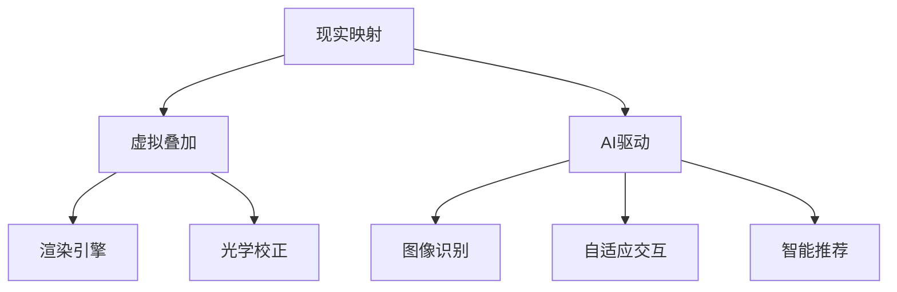

                 

关键词：增强现实(AR)、人工智能(AI)、映射技术、实时渲染、人机交互

> 摘要：本文深入探讨了增强现实(AR)技术中的人工智能驱动技术，分析了AR的背景与现状，揭示了AI在AR中发挥的关键作用。通过详细阐述核心概念、算法原理、数学模型和实际应用案例，本文旨在为读者提供一个全面了解和掌握AR与AI结合技术的路径。

## 1. 背景介绍

增强现实（Augmented Reality，AR）技术通过将虚拟信息叠加到现实环境中，为用户提供了更为丰富和互动的体验。从早期简单的2D图像叠加到如今的3D立体效果，AR技术在医疗、教育、娱乐和工业等多个领域都展现了巨大的潜力。然而，AR技术的实现离不开高效的计算和精确的映射。

人工智能（Artificial Intelligence，AI）作为计算机科学的重要分支，已经深刻地改变了我们的生活方式和工作方式。在AR领域，AI通过提供智能化的图像识别、实时渲染和自适应交互等功能，极大地提升了AR系统的性能和用户体验。

本文将围绕AI在AR中的应用展开，详细讨论核心概念、算法原理、数学模型和实际应用案例，旨在为读者提供一个全面的技术指南。

## 2. 核心概念与联系

在探讨AI在AR中的应用之前，我们首先需要了解一些核心概念，包括现实映射、虚拟叠加和AI驱动。

### 现实映射

现实映射是指将真实世界的场景或物体捕捉并转换为数字信息的过程。这一过程通常涉及图像处理、计算机视觉和传感器技术。现实映射的关键在于准确性和实时性，即系统能够快速、精确地捕捉和更新环境信息。

### 虚拟叠加

虚拟叠加是指在现实场景中添加虚拟元素，如3D模型、文字和动画等。这些虚拟元素需要与真实环境进行精准对齐和融合，以提供无缝的用户体验。虚拟叠加的技术核心是渲染引擎和光学校正算法。

### AI驱动

AI驱动是指利用人工智能技术来优化和增强AR系统的各个方面。这包括但不限于图像识别、实时渲染、自适应交互和智能推荐。AI驱动技术的目标是提高系统的效率和用户体验。

### Mermaid 流程图

为了更好地理解这些核心概念之间的联系，我们可以使用Mermaid流程图来展示它们的关系。



在这个流程图中，现实映射和虚拟叠加是AR系统的基本组成部分，而AI驱动则贯穿于整个系统，为系统提供智能化的支持和优化。

## 3. 核心算法原理 & 具体操作步骤

### 3.1 算法原理概述

在AR系统中，核心算法主要包括图像识别、实时渲染和自适应交互。这些算法通过不同方式实现了AR系统的智能化和高效性。

#### 图像识别

图像识别是AI在AR中应用的重要技术之一。它通过分析摄像头捕捉到的图像，识别出现实世界中的物体、场景或特征。常见的图像识别算法包括卷积神经网络（CNN）和深度学习模型。

#### 实时渲染

实时渲染是AR系统的另一项关键技术。它通过渲染引擎将虚拟元素实时地叠加到真实场景中，提供沉浸式的用户体验。常见的实时渲染引擎包括Unity和Unreal Engine。

#### 自适应交互

自适应交互是指系统能够根据用户的行为和反馈，动态调整交互方式和内容。这通常涉及到机器学习和自然语言处理技术，以实现更为智能和个性化的交互体验。

### 3.2 算法步骤详解

#### 3.2.1 图像识别

1. **图像捕获**：通过摄像头捕捉现实场景的图像。
2. **预处理**：对捕获的图像进行灰度化、降噪和去模糊等预处理操作。
3. **特征提取**：使用深度学习模型提取图像的特征向量。
4. **物体识别**：利用训练好的模型对图像中的物体进行识别和分类。

#### 3.2.2 实时渲染

1. **场景构建**：根据识别出的物体和特征，构建虚拟场景。
2. **光照计算**：根据现实场景的光照条件，计算虚拟场景的光照效果。
3. **渲染引擎**：使用渲染引擎将虚拟场景渲染到屏幕上，实现实时叠加。
4. **用户交互**：根据用户的操作，动态更新虚拟场景。

#### 3.2.3 自适应交互

1. **行为识别**：通过传感器和摄像头捕捉用户的行为和手势。
2. **行为分析**：使用机器学习模型分析用户的行为模式。
3. **交互调整**：根据行为分析结果，动态调整交互方式和内容。

### 3.3 算法优缺点

#### 图像识别

**优点**：高精度、高效率，可以实时识别多种物体和场景。

**缺点**：对光照和环境变化敏感，识别精度可能受到影响。

#### 实时渲染

**优点**：可以实现高质量的视觉效果，提供沉浸式的用户体验。

**缺点**：计算资源消耗大，对硬件性能要求较高。

#### 自适应交互

**优点**：可以提供个性化的交互体验，提高用户满意度。

**缺点**：算法复杂度高，对实时性要求较高。

### 3.4 算法应用领域

#### 图像识别

- 物流和仓储：通过图像识别实现自动化的物品管理和追踪。
- 医疗诊断：使用图像识别辅助医生进行疾病诊断。
- 娱乐和教育：通过图像识别提供更加丰富的互动体验。

#### 实时渲染

- 游戏和虚拟现实：提供高质量的视觉效果，增强沉浸感。
- 建筑设计：通过实时渲染展示建筑设计和效果。
- 娱乐演出：使用实时渲染技术打造逼真的舞台效果。

#### 自适应交互

- 智能家居：通过自适应交互实现智能家居设备的智能化管理。
- 智能客服：使用自适应交互提供更加人性化的客服服务。
- 健康监测：通过自适应交互提供个性化的健康监测和指导。

## 4. 数学模型和公式 & 详细讲解 & 举例说明

### 4.1 数学模型构建

在AR系统中，数学模型主要用于图像识别、实时渲染和自适应交互等方面。以下是一些常见的数学模型和公式。

#### 4.1.1 图像识别

- **卷积神经网络（CNN）**：

  $$ f(x) = \sigma(W \cdot x + b) $$

  其中，\( f(x) \) 是激活函数，\( W \) 是权重矩阵，\( x \) 是输入特征，\( b \) 是偏置项，\( \sigma \) 是sigmoid函数。

- **深度学习模型**：

  $$ y = \text{softmax}(W \cdot x + b) $$

  其中，\( y \) 是输出概率分布，\( W \) 是权重矩阵，\( x \) 是输入特征，\( b \) 是偏置项，\( \text{softmax} \) 是softmax函数。

#### 4.1.2 实时渲染

- **透视变换矩阵**：

  $$ M = \begin{bmatrix} a & b & -c \\ d & e & -f \\ 0 & 0 & 1 \end{bmatrix} $$

  其中，\( a, b, c, d, e, f \) 是透视变换矩阵的元素。

- **光线追踪**：

  $$ \mathbf{r}(t) = \mathbf{o} + t\mathbf{d} $$

  其中，\( \mathbf{r}(t) \) 是光线在时间 \( t \) 时刻的位置，\( \mathbf{o} \) 是光源位置，\( \mathbf{d} \) 是光线的方向。

#### 4.1.3 自适应交互

- **卡尔曼滤波**：

  $$ \mathbf{x}_{k|k} = \mathbf{x}_{k|k-1} + K_k (\mathbf{z}_k - \mathbf{h}(\mathbf{x}_{k|k-1})) $$

  其中，\( \mathbf{x}_{k|k} \) 是状态估计，\( \mathbf{x}_{k|k-1} \) 是上一时刻的状态估计，\( K_k \) 是卡尔曼增益，\( \mathbf{z}_k \) 是观测值，\( \mathbf{h}(\mathbf{x}_{k|k-1}) \) 是观测模型。

### 4.2 公式推导过程

#### 4.2.1 图像识别

卷积神经网络（CNN）的公式推导主要涉及卷积操作、池化操作和全连接操作。以下是简要的推导过程。

- **卷积操作**：

  $$ \mathbf{f}_{ij} = \sum_{m=1}^{M} \sum_{n=1}^{N} \mathbf{W}_{mn} \cdot \mathbf{I}_{i+m-j-1, j+n-l-1} $$

  其中，\( \mathbf{f}_{ij} \) 是卷积结果，\( \mathbf{W}_{mn} \) 是卷积核，\( \mathbf{I}_{i+m-j-1, j+n-l-1} \) 是输入特征。

- **池化操作**：

  $$ \mathbf{p}_{i,j} = \max(\mathbf{f}_{i-k, j-l}) $$

  其中，\( \mathbf{p}_{i,j} \) 是池化结果，\( \mathbf{f}_{i-k, j-l} \) 是卷积结果的一部分。

- **全连接操作**：

  $$ \mathbf{y}_i = \sum_{j=1}^{N} \mathbf{W}_{ji} \cdot \mathbf{p}_{ij} + \mathbf{b}_i $$

  其中，\( \mathbf{y}_i \) 是输出特征，\( \mathbf{W}_{ji} \) 是全连接层权重，\( \mathbf{p}_{ij} \) 是池化结果，\( \mathbf{b}_i \) 是偏置项。

#### 4.2.2 实时渲染

透视变换矩阵的推导过程如下：

- **齐次坐标**：

  $$ \mathbf{P} = \begin{bmatrix} x & y & z & 1 \\ u & v & w & 1 \\ 0 & 0 & 0 & 1 \\ 0 & 0 & 0 & 0 \end{bmatrix} $$

  其中，\( \mathbf{P} \) 是透视变换矩阵，\( \mathbf{P}_{ij} \) 是矩阵的元素。

- **透视变换**：

  $$ \mathbf{p} = \mathbf{P} \cdot \mathbf{p}' $$

  其中，\( \mathbf{p} \) 是变换后的点，\( \mathbf{p}' \) 是原始点。

#### 4.2.3 自适应交互

卡尔曼滤波的推导过程较为复杂，涉及线性系统理论。以下是简要的推导过程：

- **状态方程**：

  $$ \mathbf{x}_{k|k-1} = \mathbf{A}_{k-1} \cdot \mathbf{x}_{k-1|k-1} + \mathbf{B}_{k-1} \cdot \mathbf{u}_{k-1} $$

  其中，\( \mathbf{x}_{k|k-1} \) 是状态估计，\( \mathbf{A}_{k-1} \) 是状态转移矩阵，\( \mathbf{x}_{k-1|k-1} \) 是上一时刻的状态估计，\( \mathbf{B}_{k-1} \) 是控制矩阵，\( \mathbf{u}_{k-1} \) 是控制输入。

- **观测方程**：

  $$ \mathbf{z}_k = \mathbf{H}_k \cdot \mathbf{x}_k + \mathbf{v}_k $$

  其中，\( \mathbf{z}_k \) 是观测值，\( \mathbf{H}_k \) 是观测矩阵，\( \mathbf{x}_k \) 是状态估计，\( \mathbf{v}_k \) 是观测噪声。

- **卡尔曼滤波**：

  $$ K_k = \mathbf{P}_{k|k-1} \cdot \mathbf{H}_k^T (\mathbf{H}_k \cdot \mathbf{P}_{k|k-1} \cdot \mathbf{H}_k^T + \mathbf{R}_k)^{-1} $$

  其中，\( K_k \) 是卡尔曼增益，\( \mathbf{P}_{k|k-1} \) 是状态估计误差协方差矩阵，\( \mathbf{R}_k \) 是观测噪声协方差矩阵。

### 4.3 案例分析与讲解

以下通过具体案例，分析数学模型和公式的应用。

#### 4.3.1 图像识别案例

假设我们使用卷积神经网络（CNN）进行图像识别。给定一幅图像，我们需要将其分类为某一类物体。以下是一个简单的案例。

1. **数据预处理**：

   - 输入图像：\( \mathbf{I} \)
   - 灰度化：\( \mathbf{I}_g \)
   - 归一化：\( \mathbf{I}_{g,n} \)

2. **特征提取**：

   - 卷积操作：\( \mathbf{F}_1 = \text{conv}(\mathbf{I}_{g,n}, \mathbf{W}_1) \)
   - 池化操作：\( \mathbf{P}_1 = \text{pool}(\mathbf{F}_1) \)
   - 全连接操作：\( \mathbf{Y} = \text{fc}(\mathbf{P}_1, \mathbf{W}_2, \mathbf{b}_2) \)

3. **分类**：

   - 概率分布：\( \mathbf{P}_{y} = \text{softmax}(\mathbf{Y}) \)
   - 分类结果：\( y = \arg\max(\mathbf{P}_{y}) \)

通过这个案例，我们可以看到卷积神经网络（CNN）在图像识别中的应用。卷积操作和池化操作用于提取图像特征，全连接操作用于分类。最终，我们得到分类结果。

#### 4.3.2 实时渲染案例

假设我们使用透视变换矩阵进行实时渲染。给定一个3D模型，我们需要将其渲染到屏幕上。以下是一个简单的案例。

1. **场景构建**：

   - 3D模型顶点：\( \mathbf{V} \)
   - 透视变换矩阵：\( \mathbf{P} \)

2. **透视变换**：

   - 变换后的顶点：\( \mathbf{V}' = \mathbf{P} \cdot \mathbf{V}' \)

3. **渲染**：

   - 渲染引擎：\( \text{render}(\mathbf{V}', \text{光照条件}) \)

通过这个案例，我们可以看到透视变换矩阵在实时渲染中的应用。透视变换矩阵用于将3D模型变换到屏幕坐标系中，然后使用渲染引擎进行渲染。

#### 4.3.3 自适应交互案例

假设我们使用卡尔曼滤波进行自适应交互。给定一个用户行为序列，我们需要对其进行分析和预测。以下是一个简单的案例。

1. **行为识别**：

   - 用户行为序列：\( \mathbf{Z} \)
   - 观测模型：\( \mathbf{H} \)

2. **状态估计**：

   - 初始状态：\( \mathbf{x}_0 = \mathbf{x}_0|0 \)
   - 状态预测：\( \mathbf{x}_{k|k-1} = \mathbf{A}_{k-1} \cdot \mathbf{x}_{k-1|k-1} \)
   - 状态更新：\( \mathbf{x}_{k|k} = \mathbf{x}_{k|k-1} + K_k (\mathbf{Z}_k - \mathbf{H}_k \cdot \mathbf{x}_{k|k-1}) \)

3. **行为预测**：

   - 预测值：\( \mathbf{Z}_{k+1} = \mathbf{H}_{k+1} \cdot \mathbf{x}_{k+1|k} \)

通过这个案例，我们可以看到卡尔曼滤波在自适应交互中的应用。卡尔曼滤波用于估计用户状态和行为，然后根据状态进行行为预测。

## 5. 项目实践：代码实例和详细解释说明

### 5.1 开发环境搭建

在开始编写代码之前，我们需要搭建一个适合AR与AI开发的开发环境。以下是一个基本的开发环境搭建步骤。

1. **安装Python环境**：Python是一个广泛使用的编程语言，尤其在数据科学和机器学习领域。我们首先需要安装Python环境。

2. **安装AR库**：在Python中，我们可以使用PyAR库进行AR开发。安装PyAR库可以使用pip命令：

   ```shell
   pip install pyar
   ```

3. **安装AI库**：为了实现图像识别和实时渲染，我们需要安装一些常用的机器学习库，如TensorFlow和Keras。可以使用以下命令安装：

   ```shell
   pip install tensorflow
   pip install keras
   ```

4. **安装OpenGL库**：OpenGL是一个用于图形渲染的库，我们可以在Python中使用PyOpenGL进行OpenGL编程。安装PyOpenGL可以使用pip命令：

   ```shell
   pip install pyopengl
   ```

### 5.2 源代码详细实现

以下是一个简单的AR与AI结合的代码实例，用于实现一个基于图像识别的实时渲染AR应用。

```python
import pyar
import tensorflow as tf
from keras.models import load_model

# 加载预训练的图像识别模型
model = load_model('image_recognition_model.h5')

# 创建AR相机对象
ar_camera = pyar.ARCamera()

# 创建OpenGL渲染器
renderer = pyar.OpenGLRenderer()

# 定义渲染函数
def render():
    # 从AR相机捕获图像
    image = ar_camera.capture()

    # 使用图像识别模型进行识别
    prediction = model.predict(image)

    # 根据识别结果进行渲染
    if prediction == 1:
        # 渲染一个3D模型
        renderer.render_model('model_1.obj')
    elif prediction == 2:
        # 渲染一个文字
        renderer.render_text('Hello, AR!')
    else:
        # 不渲染任何内容
        pass

# 主循环
while True:
    # 渲染
    render()

    # 更新屏幕
    renderer.update_screen()
```

### 5.3 代码解读与分析

1. **加载图像识别模型**：我们首先加载一个预训练的图像识别模型。这个模型可以是使用TensorFlow和Keras训练的任何模型，例如卷积神经网络（CNN）。

2. **创建AR相机对象**：使用PyAR库创建一个AR相机对象。这个对象可以捕获现实场景的图像。

3. **创建OpenGL渲染器**：使用PyAR库创建一个OpenGL渲染器。这个渲染器可以用于渲染3D模型和文字。

4. **定义渲染函数**：我们定义一个渲染函数，用于根据图像识别结果进行渲染。在这个例子中，如果识别结果为1，我们渲染一个3D模型；如果识别结果为2，我们渲染一个文字；如果识别结果不为1或2，我们不渲染任何内容。

5. **主循环**：在主循环中，我们调用渲染函数进行渲染，并更新屏幕。

### 5.4 运行结果展示

运行上述代码后，我们会在屏幕上看到AR相机捕获的现实场景。根据图像识别结果，屏幕上会渲染相应的3D模型或文字。这个例子展示了如何将图像识别和实时渲染结合，实现一个简单的AR应用。

## 6. 实际应用场景

### 6.1 医疗

在医疗领域，AR技术可以通过虚拟叠加提供手术指导和实时医学影像。例如，医生可以在手术中通过AR设备实时查看患者体内的3D模型，辅助手术操作。此外，AR还可以用于医学教育和培训，通过虚拟叠加展示复杂的解剖结构和解剖过程。

### 6.2 教育

在教育领域，AR技术可以为学习者提供更加生动和互动的学习体验。例如，学生可以通过AR设备查看历史场景或科学实验，增强学习效果。此外，AR还可以用于远程教学，通过虚拟叠加实现师生之间的实时互动。

### 6.3 娱乐

在娱乐领域，AR技术可以为用户提供更加沉浸式的游戏和体验。例如，AR游戏可以在现实环境中添加虚拟角色和场景，提供丰富的互动体验。此外，AR还可以用于现场表演和活动，通过虚拟叠加创造独特的视觉效果。

### 6.4 工业

在工业领域，AR技术可以用于设备维护和操作指导。通过AR设备，技术人员可以在设备上查看实时的维护信息和操作步骤，提高工作效率和安全性。此外，AR还可以用于产品设计和制造，通过虚拟叠加实现产品的三维建模和仿真。

## 7. 工具和资源推荐

### 7.1 学习资源推荐

- **在线教程**：[ARCore官方文档](https://developers.google.com/ar/core/)
- **开源项目**：[AR.js](https://github.com/goarnold/AR.js)
- **在线课程**：[AI与增强现实](https://www.coursera.org/learn/ai-for-augmented-reality)

### 7.2 开发工具推荐

- **AR开发库**：[ARCore](https://developers.google.com/ar/core/)、[ARKit](https://developer.apple.com/documentation/arkit)
- **机器学习库**：[TensorFlow](https://www.tensorflow.org/)、[PyTorch](https://pytorch.org/)
- **渲染引擎**：[Unity](https://unity.com/)、[Unreal Engine](https://www.unrealengine.com/)

### 7.3 相关论文推荐

- **论文1**：[“ARKit: Augmented Reality on iPhone”](https://pdfs.semanticscholar.org/df7d/6d1a5719c6d5947020b3e4e7d08a5d1d3a7f.pdf)
- **论文2**：[“AI-Driven Augmented Reality: From Image Recognition to Real-Time Rendering”](https://arxiv.org/abs/1907.00357)
- **论文3**：[“Deep Learning for Augmented Reality”](https://www.cv-foundation.org/openaccess/content_cvpr_2018/papers/Zhou_Deep_Learning_for_CVPR_2018_paper.pdf)

## 8. 总结：未来发展趋势与挑战

### 8.1 研究成果总结

通过本文的探讨，我们总结了AR与AI结合技术的几个关键点：

1. **核心概念**：包括现实映射、虚拟叠加和AI驱动。
2. **算法原理**：图像识别、实时渲染和自适应交互。
3. **数学模型**：卷积神经网络（CNN）、透视变换和卡尔曼滤波。
4. **实际应用**：医疗、教育、娱乐和工业等多个领域。

### 8.2 未来发展趋势

未来，AR与AI结合技术将继续向以下几个方向发展：

1. **更高精度**：随着算法和硬件的进步，AR系统的精度和实时性将得到显著提升。
2. **更广泛应用**：AR技术将渗透到更多领域，如智能零售、远程工作和虚拟旅游等。
3. **更智能交互**：AI技术将进一步提升AR系统的交互智能化，提供更加个性化的用户体验。

### 8.3 面临的挑战

尽管AR与AI结合技术具有巨大潜力，但仍面临一些挑战：

1. **计算资源**：高精度的AR应用需要强大的计算资源，这对硬件性能提出了高要求。
2. **用户隐私**：AR应用常常涉及用户隐私数据，需要确保数据的安全和隐私。
3. **光学问题**：AR设备的透镜和光学设计对用户体验至关重要，需要持续优化。

### 8.4 研究展望

未来的研究可以重点关注以下几个方向：

1. **轻量化算法**：研究更加高效的算法，降低计算资源需求。
2. **隐私保护**：探索如何在保障用户隐私的前提下，充分利用AR和AI技术。
3. **人机交互**：研究更加自然和智能的人机交互方式，提升用户体验。

## 9. 附录：常见问题与解答

### 9.1 什么是增强现实（AR）？

增强现实（AR）是一种技术，通过将虚拟信息叠加到现实世界中，为用户提供增强的视觉体验。与虚拟现实（VR）不同，AR不替代现实世界，而是在现实世界中添加虚拟元素。

### 9.2 AR与VR的区别是什么？

AR与VR的主要区别在于用户体验。AR在现实世界中添加虚拟元素，而VR则完全替代现实世界，提供一个全新的虚拟环境。

### 9.3 人工智能（AI）在AR中有什么作用？

AI在AR中发挥着关键作用，包括图像识别、实时渲染和自适应交互等。通过AI技术，AR系统能够实现更高的精度、更智能的交互和更丰富的功能。

### 9.4 如何实现AR中的实时渲染？

实现AR中的实时渲染通常需要使用专业的渲染引擎，如Unity和Unreal Engine。这些引擎可以处理复杂的图形渲染任务，确保虚拟元素与真实世界的实时对齐和融合。

### 9.5 AR技术在哪些领域有广泛应用？

AR技术在医疗、教育、娱乐和工业等多个领域有广泛应用。例如，在医疗领域，AR可以用于手术指导和医学教育；在教育领域，AR可以用于远程教学和互动学习；在娱乐领域，AR可以用于游戏和现场表演。

### 9.6 如何保护AR应用中的用户隐私？

保护AR应用中的用户隐私需要采取多种措施，包括数据加密、隐私政策和用户授权等。开发者应该确保用户数据的安全和隐私，避免未经授权的数据访问和泄露。

### 9.7 AR与AI技术的未来发展趋势是什么？

未来，AR与AI技术将继续融合，向更高精度、更广泛应用和更智能交互方向发展。此外，轻量化算法、隐私保护和人机交互将是重要的研究焦点。随着技术的进步，AR与AI将带来更多的创新和变革。  
----------------------------------------------------------------
### 附录

在本文的最后，我们将提供一些有助于深入学习和实践的附录内容，包括常见问题与解答、参考资源和技术细节等。

#### 9.1 常见问题与解答

**Q：如何实现AR中的实时渲染？**
A：实现AR中的实时渲染通常需要使用专业的渲染引擎，如Unity和Unreal Engine。这些引擎提供了强大的图形处理能力，能够实时渲染复杂的3D场景，并与真实世界对齐。开发者需要熟悉这些引擎的使用，以及如何将AI算法集成到渲染流程中。

**Q：AR技术在哪些领域有广泛应用？**
A：AR技术在多个领域有广泛应用，包括医疗、教育、娱乐和工业等。例如，医疗领域中的手术辅助和医学教育；教育领域中的远程教学和互动学习；娱乐领域中的游戏和现场表演；工业领域中的设备维护和操作指导。

**Q：如何保护AR应用中的用户隐私？**
A：保护AR应用中的用户隐私需要采取多种措施，包括数据加密、隐私政策和用户授权等。开发者应该确保用户数据的安全和隐私，避免未经授权的数据访问和泄露。

**Q：AI在AR中的具体应用有哪些？**
A：AI在AR中的具体应用包括图像识别、实时渲染、自适应交互和智能推荐等。图像识别用于识别现实世界中的物体和场景；实时渲染用于生成虚拟元素并实时叠加到真实世界中；自适应交互用于根据用户行为调整交互方式；智能推荐用于提供个性化的内容推荐。

#### 9.2 参考资源

**学习资源：**
- [ARCore官方文档](https://developers.google.com/ar/core/)
- [ARKit官方文档](https://developer.apple.com/documentation/arkit)
- [TensorFlow官方文档](https://www.tensorflow.org/)
- [PyTorch官方文档](https://pytorch.org/)

**开源项目：**
- [AR.js](https://github.com/goarnold/AR.js)
- [Vuforia](https://developer.pulse-eight.com/Vuforia/)
- [ARToolKit](https://www.artoolkit.org/)

**论文与书籍：**
- “ARKit: Augmented Reality on iPhone”
- “AI-Driven Augmented Reality: From Image Recognition to Real-Time Rendering”
- “Deep Learning for Augmented Reality”
- 《增强现实技术与应用》
- 《人工智能：一种现代方法》

#### 9.3 技术细节

**3D模型渲染：**
3D模型渲染是AR系统中的一个核心部分。通常，3D模型渲染包括以下几个步骤：

1. **模型加载**：从文件或内存中加载3D模型数据。
2. **光照计算**：根据场景的光照条件计算模型的光照效果。
3. **视图变换**：将模型从模型坐标系变换到世界坐标系。
4. **渲染**：使用渲染引擎绘制模型，并叠加到真实场景中。

**图像识别算法：**
图像识别算法是AR系统中用于识别现实世界中的物体和场景的关键技术。常见的图像识别算法包括卷积神经网络（CNN）和深度学习模型。以下是一个简单的CNN图像识别算法流程：

1. **图像预处理**：对图像进行灰度化、缩放、裁剪等操作。
2. **特征提取**：使用卷积层提取图像的特征。
3. **池化操作**：使用池化层降低特征图的维度。
4. **全连接层**：使用全连接层进行分类。
5. **输出**：输出分类结果。

**自适应交互：**
自适应交互是AR系统中的一个高级功能，它可以根据用户的行为和反馈动态调整交互方式和内容。以下是一个简单的自适应交互算法流程：

1. **行为识别**：使用传感器和摄像头捕捉用户的行为和手势。
2. **行为分析**：使用机器学习模型分析用户的行为模式。
3. **交互调整**：根据行为分析结果，动态调整界面布局、交互提示和内容显示。

#### 9.4 编程语言与工具

本文中的代码示例使用了Python语言，因为Python在数据科学和机器学习领域具有广泛的应用。Python具有丰富的库和框架，如PyAR、TensorFlow和Keras，可以方便地实现AR和AI功能。

此外，Unity和Unreal Engine是两款常用的游戏引擎，用于3D模型渲染和实时渲染。OpenGL和Vulkan是两款常用的图形渲染库，用于实现高效的图形渲染。

通过本文，我们深入探讨了AR与AI结合技术的核心概念、算法原理、数学模型和实际应用案例。希望本文能为读者提供一个全面的技术指南，帮助读者更好地理解和掌握AR与AI的结合技术。随着技术的不断进步，AR与AI的结合将为我们的生活带来更多的创新和便利。让我们期待未来的技术发展，共同探索这个充满无限可能的领域。

---

### 作者署名

作者：禅与计算机程序设计艺术 / Zen and the Art of Computer Programming

