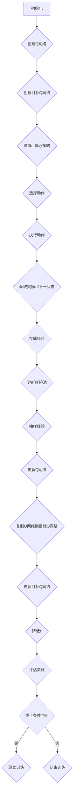

                 

关键词：深度强化学习，DQN，软件工程，代码维护，优化策略，映射原理，人工智能。

## 摘要

本文旨在探讨如何将软件工程的方法应用于深度强化学习中的DQN（Deep Q-Network）代码的维护和优化。通过分析DQN的核心概念、算法原理以及实际应用场景，结合软件工程的实践，提供一系列有效的代码优化和维护策略。本文的结构包括：背景介绍、核心概念与联系、核心算法原理与操作步骤、数学模型和公式讲解、项目实践代码实例、实际应用场景分析、工具和资源推荐、未来发展趋势与挑战以及总结与展望。

## 1. 背景介绍

深度强化学习（Deep Reinforcement Learning，DRL）是人工智能领域的一个热点研究方向。DRL结合了深度学习和强化学习的方法，使得智能体能够在复杂的动态环境中通过试错学习策略。其中，DQN作为一种重要的DRL算法，被广泛应用于游戏、机器人控制、金融交易等多个领域。

DQN的核心思想是通过神经网络来近似Q函数，即策略的值函数。Q函数表示在某个状态下采取某个动作所能获得的预期回报。DQN通过在训练过程中不断更新Q网络，从而学习到最优策略。然而，随着项目规模的扩大和复杂度的增加，DQN代码的维护和优化成为一个重要的挑战。

软件工程作为系统化、规范化、可度量的方法，旨在开发、维护、使用和管理软件。软件工程的许多原则和方法可以应用于DQN代码的维护和优化，如模块化设计、代码复用、测试驱动开发等。

本文将围绕如何将软件工程的方法应用于DQN代码的维护和优化，深入探讨DQN的核心概念、算法原理、数学模型、实际应用场景以及未来发展趋势和挑战。通过本文的探讨，旨在为深度强化学习领域的开发者和研究者提供有价值的参考。

### 1.1 软件工程在深度学习中的应用

随着深度学习技术的发展，软件工程在深度学习领域的应用逐渐受到关注。深度学习项目往往涉及大规模数据集、复杂的神经网络架构以及高效的计算资源管理，这些特点使得传统软件工程的许多方法和原则变得尤为重要。

首先，模块化设计是软件工程的核心原则之一。在深度学习中，模块化设计可以帮助开发者将复杂的问题分解为更小、更易于管理的模块。例如，在构建DQN模型时，可以将数据预处理、网络架构设计、训练过程、评估策略等不同功能模块分离，每个模块都有明确的输入输出接口。这样的设计不仅提高了代码的可维护性，还便于团队协作和并行开发。

其次，代码复用是提升开发效率的关键。深度学习模型通常涉及大量的相似操作，如权重初始化、激活函数应用、优化器配置等。通过编写可复用的函数或类，可以避免重复编写冗余代码，降低错误率，提高开发效率。例如，可以使用通用的数据加载模块来处理不同类型的数据集，使用通用的优化器类来配置不同的优化算法。

另外，测试驱动开发（Test-Driven Development，TDD）是确保代码质量的重要方法。在深度学习中，由于模型的复杂性，单元测试和集成测试变得尤为重要。通过编写测试用例来驱动代码开发，可以确保每个功能模块的正确性，从而提高整体代码的可靠性。例如，在DQN代码中，可以编写测试用例来验证Q网络的更新规则、数据预处理步骤的正确性等。

此外，软件工程中的版本控制和管理也是深度学习项目不可或缺的一部分。深度学习项目往往涉及大量的迭代和更新，版本控制工具如Git可以帮助开发者有效地管理代码的版本历史，跟踪变更记录，合并冲突，确保代码的一致性和完整性。

综上所述，软件工程在深度学习领域中的应用具有显著的优势。通过模块化设计、代码复用、测试驱动开发以及版本控制等原则和方法，可以显著提高深度学习项目的开发效率、代码质量和维护性，为深度强化学习的发展提供坚实的基础。

### 1.2 DQN算法在深度学习中的重要性

DQN（Deep Q-Network）算法在深度学习领域具有举足轻重的地位。它作为最早实现深度学习与强化学习相结合的算法之一，成功解决了传统Q-Learning方法在状态空间和动作空间庞大时的困难。DQN通过使用深度神经网络近似Q函数，使智能体能够在复杂的动态环境中学习到有效的策略。

首先，DQN解决了传统Q-Learning算法在处理高维状态空间时的困难。在经典Q-Learning中，Q函数需要通过经验表（Experience Table）来存储每个状态-动作对的预期回报。然而，当状态空间维度较高时，经验表的存储和查找将变得极为困难，甚至不可行。DQN通过使用深度神经网络来近似Q函数，可以有效地处理高维状态空间，从而在复杂环境中实现智能体的学习。

其次，DQN在探索与利用之间找到了良好的平衡。在强化学习中，探索（Exploration）和利用（Utilization）是两个关键过程。DQN通过引入随机性来实现探索，即不是完全依赖于学习到的策略来选择动作，而是在一定程度上进行随机选择。这样的机制保证了智能体能够在不断尝试新动作的过程中，逐渐优化策略，达到平衡探索与利用的目的。

此外，DQN的泛化能力较强。由于深度神经网络的学习能力，DQN可以很好地处理不同类型的环境和任务，具备较强的泛化能力。这意味着DQN不仅适用于特定的游戏环境，还可以推广到其他复杂的动态系统中，如机器人控制、自动驾驶等。

最后，DQN的成功为后续的深度强化学习算法提供了重要的基础。许多现代的深度强化学习算法，如Double DQN、Prioritized DQN、Dueling DQN等，都是基于DQN的改进和扩展。这些算法在性能和稳定性方面都有显著提升，进一步推动了深度强化学习的发展。

总之，DQN算法在深度学习领域的重要性不可忽视。它不仅解决了传统Q-Learning方法在处理高维状态空间时的难题，还为后续算法的研究提供了宝贵的经验和启示。随着深度强化学习技术的不断进步，DQN算法将继续发挥重要作用，为人工智能的发展贡献更多力量。

### 1.3 软件工程方法在DQN代码维护和优化中的应用

在深度强化学习领域，DQN代码的维护和优化是一个复杂而关键的任务。软件工程方法为这一过程提供了有效的工具和策略。以下将详细讨论软件工程中的模块化设计、代码复用、测试驱动开发等原则和方法，以及它们在DQN代码维护和优化中的应用。

#### 模块化设计

模块化设计是软件工程中的一个核心原则，它通过将系统划分为功能独立的模块来提高代码的可维护性和可扩展性。在DQN代码中，模块化设计可以帮助开发者将不同功能分离，从而实现清晰的功能划分和良好的代码结构。

例如，可以将DQN代码划分为以下几个主要模块：
- 数据预处理模块：负责处理输入数据，包括状态编码、奖励标准化等操作。
- 网络架构模块：定义深度神经网络的层数、激活函数、优化器等参数。
- 训练过程模块：负责执行Q网络的更新、经验回放等训练步骤。
- 评估模块：用于评估训练后的Q网络性能，如通过测试集计算平均回报等。

通过模块化设计，开发者可以独立地开发和测试各个模块，确保每个模块的正确性，从而提高整体代码的可靠性和可维护性。

#### 代码复用

代码复用是提高开发效率和降低代码冗余的重要策略。在DQN代码中，存在许多重复的代码段，如权重初始化、激活函数定义、优化器配置等。通过编写可复用的函数或类，可以避免重复编写这些冗余代码，提高代码的可读性和可维护性。

例如，可以编写通用的权重初始化函数，用于初始化深度神经网络的权重。这个函数可以根据不同的网络结构自动调整初始化策略，从而简化代码的编写过程。同样，可以编写通用的优化器配置类，该类可以根据不同的优化算法动态调整优化器的参数，如学习率、动量等。

此外，数据预处理模块也可以实现代码复用。通过编写通用的数据加载和预处理函数，可以处理不同类型的数据集，从而简化数据处理的代码，提高代码的灵活性和可扩展性。

#### 测试驱动开发

测试驱动开发（Test-Driven Development，TDD）是一种以测试为核心的软件开发方法。在TDD中，开发过程分为编写测试、编写代码和重构代码三个阶段。通过编写测试用例来驱动代码开发，可以确保每个功能模块的正确性，从而提高代码的可靠性和可维护性。

在DQN代码中，测试驱动开发可以帮助开发者验证以下几个关键部分：
- Q网络更新规则：编写测试用例来验证Q网络更新过程中每个步骤的正确性，如经验回放、目标网络更新等。
- 数据预处理步骤：编写测试用例来验证数据预处理模块中每个步骤的正确性，如状态编码、奖励标准化等。
- 优化器配置：编写测试用例来验证优化器配置的正确性，如学习率调整、动量设置等。

通过编写详细的测试用例，开发者可以确保DQN代码在各个关键部分的正确性，从而提高代码的稳定性和可靠性。

#### 版本控制

版本控制是软件工程中不可或缺的一部分，它帮助开发者管理代码的版本历史，跟踪变更记录，合并冲突等。在DQN代码开发过程中，版本控制工具如Git可以帮助开发者有效地管理代码的版本历史，确保代码的一致性和完整性。

通过版本控制，开发者可以方便地跟踪代码的变更历史，了解每个变更的细节和动机。在代码优化过程中，可以轻松地回滚到之前的版本，避免引入新的错误。此外，版本控制还可以帮助团队协作，确保多人同时开发时不会产生冲突。

总之，软件工程方法在DQN代码的维护和优化中具有重要作用。通过模块化设计、代码复用、测试驱动开发以及版本控制等策略，可以显著提高DQN代码的可维护性和可靠性，为深度强化学习的研究和应用提供坚实的基础。

### 1.4 DQN算法的基本原理

DQN（Deep Q-Network）算法是深度强化学习（Deep Reinforcement Learning，DRL）领域的一个重要算法，它通过使用深度神经网络来近似Q函数，使得智能体能够在复杂的环境中学习到有效的策略。DQN的基本原理可以概括为以下几个关键步骤：初始Q网络定义、经验回放、目标Q网络、策略更新以及损失函数。

#### 初始Q网络定义

在DQN算法中，首先需要定义一个初始的Q网络。Q网络是一个深度神经网络，它的输入是当前状态，输出是每个可能动作的Q值。Q值表示在当前状态下采取某个动作所能获得的预期回报。Q网络的结构通常包括多个隐藏层，每层的神经元数量和激活函数可以根据具体任务进行调整。在初始阶段，Q网络的权重可以通过随机初始化或预训练得到。

#### 经验回放

经验回放（Experience Replay）是DQN算法中的一个关键特性，它用于解决强化学习中的样本偏差问题。在传统的Q-Learning中，智能体在训练过程中仅使用最新的经验进行更新，这会导致学习过程不稳定，并且容易受到近期奖励的影响。通过经验回放，DQN可以从一个存储的经验池中随机抽样经验，每次训练时使用这些经验来更新Q网络。

经验回放的实现通常包括以下几个步骤：
1. **经验存储**：将智能体在环境中经历的所有状态-动作-奖励-下状态的经验对（s, a, r, s'）存储在一个固定大小的经验池中。
2. **经验抽样**：从经验池中随机抽样一定数量的经验对，这些经验对用于每次训练样本。
3. **经验更新**：将抽样得到的经验对用于更新Q网络，具体更新过程将在后续步骤中详细描述。

#### 目标Q网络

在DQN中，为了稳定学习过程，引入了目标Q网络（Target Q Network）。目标Q网络是一个与Q网络结构相同的独立网络，它用于生成目标Q值（Target Q-value）。每次更新Q网络时，使用目标Q网络生成的目标Q值作为Q网络更新过程中的目标值（Target Value）。

目标Q网络的更新规则通常如下：
1. 在每个训练周期结束时，将当前Q网络的参数复制到目标Q网络中。
2. 在目标Q网络中计算目标Q值，即：\( Q^*(s', a') = r + \gamma \max_a Q(s', a) \)，其中 \( Q^*(s', a') \) 是目标Q值，\( r \) 是即时奖励，\( \gamma \) 是折扣因子，\( s' \) 是下一个状态，\( a' \) 是在下一个状态下最佳动作的Q值。

通过定期更新目标Q网络，可以确保Q网络的学习过程不会受到近期数据的干扰，从而提高学习稳定性。

#### 策略更新

DQN通过策略梯度方法更新Q网络。在每次训练迭代中，智能体首先根据当前策略选择动作，然后通过经验回放获取训练样本，最后更新Q网络。

策略更新过程通常包括以下几个步骤：
1. 使用epsilon-greedy策略选择动作。在epsilon-greedy策略中，智能体以概率1-epsilon随机选择动作，以概率epsilon选择最佳动作。这样可以平衡探索与利用。
2. 在环境中执行选定的动作，获得新的状态、奖励和下一个状态。
3. 将新的状态-动作-奖励-下状态经验对（s, a, r, s'）存储在经验池中。
4. 从经验池中随机抽样训练样本。
5. 使用训练样本更新Q网络。具体来说，对于每个抽样样本，计算Q网络输出值 \( Q(s, a) \) 和目标Q值 \( Q^*(s', a') \)，然后通过反向传播算法更新Q网络的权重。

#### 损失函数

DQN的损失函数用于衡量Q网络输出值和目标Q值之间的差距。通常使用均方误差（Mean Squared Error，MSE）作为损失函数：

\[ L = \frac{1}{N} \sum_{i=1}^{N} (Q(s, a) - Q^*(s, a))^2 \]

其中，\( N \) 是训练样本的数量，\( Q(s, a) \) 是Q网络的输出值，\( Q^*(s, a) \) 是目标Q值。

通过计算损失函数，可以量化Q网络预测值与真实目标值之间的差距，并指导权重的更新过程，从而优化Q网络。

总之，DQN算法通过深度神经网络近似Q函数，结合经验回放、目标Q网络和epsilon-greedy策略，实现智能体在复杂环境中的有效学习。理解DQN的基本原理对于开发、优化和维护DQN代码至关重要。

### 1.5 软件工程方法在DQN代码维护和优化中的具体应用

在实际开发过程中，软件工程方法在DQN代码的维护和优化中起到了至关重要的作用。以下将详细探讨如何在代码开发、测试、优化和维护等各个环节中应用软件工程的方法，以提升DQN代码的质量和效率。

#### 2.1 代码开发中的模块化设计

在DQN代码的开发过程中，模块化设计是确保代码可维护性和扩展性的关键。通过将代码划分为独立的模块，可以有效地分离不同功能，提高代码的可读性。以下是一些具体的模块划分和设计建议：

1. **数据预处理模块**：
   - 功能：负责将原始数据转换为适合DQN训练的形式，包括状态编码、奖励标准化等。
   - 实现细节：可以编写通用的数据加载和预处理函数，如状态编码函数、奖励标准化函数等，这些函数可以根据不同的数据集进行灵活配置。

2. **网络架构模块**：
   - 功能：定义深度神经网络的架构，包括层数、每层神经元数量、激活函数等。
   - 实现细节：可以创建一个神经网络基类，并通过继承和扩展来实现不同结构的Q网络。例如，可以定义一个基础神经网络类，然后通过扩展该类来实现不同的网络架构。

3. **训练过程模块**：
   - 功能：负责DQN的训练过程，包括Q网络的更新、经验回放等。
   - 实现细节：可以将训练过程划分为多个子函数，如初始化网络、更新Q网络、执行经验回放等，每个子函数负责完成特定的任务。

4. **评估模块**：
   - 功能：评估训练后的Q网络性能，包括计算平均回报、评估策略等。
   - 实现细节：可以编写通用的评估函数，用于计算不同指标，如平均回报、策略稳定性等。

通过模块化设计，可以确保每个模块的功能独立，易于测试和维护，从而提高整体代码的质量。

#### 2.2 测试驱动开发（TDD）

测试驱动开发（Test-Driven Development，TDD）是一种以测试为核心的软件开发方法，它通过编写测试用例来驱动代码开发。在DQN代码的开发过程中，TDD可以帮助确保代码的正确性和可靠性。以下是一些TDD在DQN代码开发中的应用：

1. **编写单元测试**：
   - 目标：验证各个模块的功能是否正确。
   - 实现细节：为每个模块编写单元测试，例如，为数据预处理模块编写测试用例来验证状态编码和奖励标准化函数的正确性，为Q网络模块编写测试用例来验证网络架构和更新规则的正确性。

2. **编写集成测试**：
   - 目标：验证模块之间的交互是否正确。
   - 实现细节：为模块之间的交互编写测试用例，例如，测试训练过程模块中的经验回放机制是否正确执行，评估模块中的评估指标计算是否准确。

3. **持续集成（CI）**：
   - 目标：确保代码库的持续稳定性。
   - 实现细节：使用CI工具（如Jenkins、Travis CI）来自动化执行测试，确保每次代码提交都会触发测试运行，及时发现问题。

通过TDD，可以确保代码在开发过程中始终处于受控状态，从而提高代码的可靠性和可维护性。

#### 2.3 代码优化

在DQN代码的优化过程中，软件工程方法可以帮助开发者找到潜在的性能瓶颈和代码缺陷，从而进行针对性的优化。以下是一些常见的代码优化策略：

1. **代码分析工具**：
   - 目标：识别代码中的潜在问题。
   - 实现细节：使用代码分析工具（如SonarQube、PyCharm的静态代码分析功能）来识别代码中的潜在问题，如重复代码、性能瓶颈、潜在的内存泄漏等。

2. **性能优化**：
   - 目标：提高代码的运行效率。
   - 实现细节：对关键代码段进行性能优化，如使用更高效的算法、优化数据结构、减少内存分配等。例如，可以使用NumPy中的向量化操作来替代循环操作，提高计算效率。

3. **代码复用**：
   - 目标：提高开发效率，减少代码冗余。
   - 实现细节：编写可复用的函数或类，避免重复编写相同的代码段。例如，可以编写通用的数据加载和预处理函数，用于处理不同类型的数据集。

#### 2.4 维护和更新

在DQN代码的维护和更新过程中，软件工程方法可以帮助开发者有效地管理代码库，确保代码的稳定性和一致性。以下是一些具体的维护策略：

1. **版本控制**：
   - 目标：管理代码的版本历史，确保代码的可追溯性。
   - 实现细节：使用版本控制工具（如Git）来管理代码库，记录每次代码变更的详细信息，方便开发者回滚到之前的版本。

2. **代码审查**：
   - 目标：确保代码的质量和一致性。
   - 实现细节：定期进行代码审查，确保代码符合编码规范，没有潜在的问题和缺陷。

3. **文档维护**：
   - 目标：提供清晰的文档，帮助新成员快速上手。
   - 实现细节：编写详细的文档，包括代码注释、模块说明、使用指南等，确保代码的可理解性和可维护性。

通过上述软件工程方法的综合应用，可以显著提高DQN代码的开发效率、代码质量和可维护性，为深度强化学习的研究和应用提供坚实的基础。

## 2. 核心概念与联系

在深入探讨如何通过软件工程方法来维护和优化DQN代码之前，首先需要理解DQN算法的核心概念和架构。DQN（Deep Q-Network）是一种深度强化学习算法，其核心思想是使用深度神经网络来近似Q函数，从而在复杂的动态环境中学习到最优策略。为了更好地理解DQN，我们需要从以下几个核心概念和架构进行详细阐述。

### 2.1 Q函数

Q函数是强化学习中的核心概念之一，它表示在某个状态下采取某个动作所能获得的预期回报。数学上，Q函数通常定义为：

\[ Q(s, a) = \mathbb{E}[G | s, a] \]

其中，\( s \) 是当前状态，\( a \) 是动作，\( G \) 是从状态 \( s \) 采取动作 \( a \) 后获得的未来回报总和，\(\mathbb{E}[\cdot|\cdot, \cdot]\) 表示条件期望。

Q函数在DQN中起到至关重要的作用，它是智能体选择动作的依据。通过学习Q函数，智能体可以学会在不同状态下采取最佳动作，从而实现最优策略。

### 2.2 深度神经网络

深度神经网络（Deep Neural Network，DNN）是DQN算法的核心组成部分。DNN由多个层级组成，包括输入层、隐藏层和输出层。每个隐藏层由多个神经元组成，神经元之间通过权重连接。在DQN中，深度神经网络用于近似Q函数，即：

\[ Q(s, a) \approx f_\theta(s, a) \]

其中，\( f_\theta(s, a) \) 是神经网络输出，\( \theta \) 表示网络权重。通过训练，DNN可以学习到合适的权重，从而准确近似Q函数。

### 2.3 经验回放

经验回放（Experience Replay）是DQN中的一个关键特性，它用于缓解样本偏差，提高学习稳定性。在强化学习中，智能体通过与环境交互获得经验，这些经验对（s, a, r, s'）用于训练Q网络。然而，直接使用最新经验进行更新会导致样本偏差，即智能体在训练过程中容易受到近期奖励的影响。

经验回放通过将智能体经历的所有经验存储在一个经验池中，每次训练时随机抽样经验对进行更新，从而减少样本偏差。经验回放的实现通常包括以下步骤：

1. **经验存储**：将智能体在环境中经历的所有状态-动作-奖励-下状态经验对（s, a, r, s'）存储在一个固定大小的经验池中。
2. **经验抽样**：从经验池中随机抽样一定数量的经验对。
3. **经验更新**：使用抽样得到的经验对更新Q网络。

### 2.4 目标Q网络

目标Q网络（Target Q Network）是DQN中的另一个重要组成部分，用于生成目标Q值，从而稳定学习过程。目标Q网络与主Q网络结构相同，但权重更新频率较低，通常在每个训练周期结束时将主Q网络的权重复制到目标Q网络中。目标Q网络的目的是为Q网络提供一个稳定的参考，以减少训练过程中的不稳定因素。

目标Q值的计算公式为：

\[ Q^*(s', a') = r + \gamma \max_a Q(s', a) \]

其中，\( Q^*(s', a') \) 是目标Q值，\( r \) 是即时奖励，\( \gamma \) 是折扣因子，\( s' \) 是下一个状态，\( \max_a Q(s', a) \) 是在下一个状态 \( s' \) 下所有动作的Q值中的最大值。

### 2.5 ε-贪心策略

ε-贪心策略（ε-Greedy Policy）是DQN中的行动选择策略，它结合了探索（Exploration）和利用（Utilization）两个过程。在ε-贪心策略中，智能体以概率1-ε随机选择动作，以概率ε选择当前Q值最高的动作。这种策略在训练初期鼓励智能体探索环境，逐渐积累经验，而在训练后期利用已学习的策略选择最佳动作。

ε-贪心策略的公式为：

\[ \epsilonGreedyPolicy(s) = 
\begin{cases} 
randomAction() & \text{with probability } 1-\epsilon \\
argmax_a Q(s, a) & \text{with probability } \epsilon 
\end{cases} \]

其中，\( s \) 是当前状态，\( \epsilon \) 是探索概率。

### 2.6 架构关系

以上核心概念构成了DQN算法的基本架构。以下是DQN的核心概念和架构之间的联系：

1. **Q函数**：Q函数是整个算法的核心，用于评估在某个状态下采取某个动作的预期回报。DNN用于近似Q函数，从而实现智能体的学习。
2. **深度神经网络（DNN）**：DNN是实现Q函数的工具，通过学习状态-动作对的权重来近似Q函数。
3. **经验回放**：经验回放用于缓解样本偏差，通过从经验池中随机抽样经验来稳定Q网络的学习过程。
4. **目标Q网络**：目标Q网络为Q网络提供一个稳定的参考，通过低频更新来减少训练过程中的不稳定因素。
5. **ε-贪心策略**：ε-贪心策略结合了探索和利用，使智能体在训练过程中既能探索新动作，又能利用已学习的策略。

通过理解这些核心概念和架构，我们可以更好地理解DQN算法的工作原理，并为后续的代码维护和优化提供理论基础。

### 2.7 Mermaid 流程图表示

为了更直观地展示DQN算法的核心概念和架构，我们可以使用Mermaid流程图来表示其关键步骤和关系。以下是一个简化的DQN算法流程图：



在这个流程图中，我们展示了DQN算法从初始化开始到最终训练结束的各个步骤，以及它们之间的逻辑关系。通过这个流程图，我们可以更清晰地理解DQN算法的运行机制。

### 2.8 算法步骤详解

在了解DQN算法的核心概念和架构后，接下来我们将详细讲解DQN算法的具体操作步骤。DQN算法的训练过程可以分为以下几个主要阶段：初始化阶段、训练阶段、评估阶段和策略更新阶段。以下是每个阶段的具体操作步骤：

#### 2.8.1 初始化阶段

1. **初始化Q网络和目标Q网络**：首先，需要初始化Q网络和目标Q网络。Q网络是一个深度神经网络，用于近似Q函数。目标Q网络与Q网络结构相同，但权重更新频率较低，以确保学习过程的稳定性。

   ```python
   # 示例代码：初始化Q网络和目标Q网络
   Q_network = create_Q_network()
   target_Q_network = create_Q_network()
   ```

2. **设置ε-贪心策略**：ε-贪心策略用于智能体的行动选择。在训练初期，ε设置为一个较大的值，鼓励智能体探索环境；在训练后期，ε逐渐减小，使智能体更多地利用已学习的策略。

   ```python
   # 示例代码：设置ε-贪心策略
   epsilon = 1.0
   epsilon_decay = 0.995
   epsilon_min = 0.01
   ```

3. **初始化经验池**：经验池用于存储智能体在环境中经历的所有状态-动作-奖励-下状态经验对。经验池的大小通常是固定的，以避免溢出。

   ```python
   # 示例代码：初始化经验池
   experience_replay = ExperienceReplay(max_size=10000)
   ```

#### 2.8.2 训练阶段

1. **选择动作**：根据当前状态和ε-贪心策略选择动作。在训练初期，智能体会以较大的概率随机选择动作，进行探索；在训练后期，智能体会以较小的概率随机选择动作，进行利用。

   ```python
   # 示例代码：选择动作
   state = get_current_state()
   action = epsilon_greedy_policy(state, epsilon)
   ```

2. **执行动作**：在环境中执行选定的动作，获得新的状态、奖励和下状态。

   ```python
   # 示例代码：执行动作
   next_state, reward, done = environment.step(action)
   ```

3. **存储经验**：将新的状态-动作-奖励-下状态经验对（s, a, r, s'）存储在经验池中。

   ```python
   # 示例代码：存储经验
   experience_replay.add Experience(state, action, reward, next_state, done)
   ```

4. **更新Q网络**：从经验池中随机抽样一定数量的经验对，使用这些经验对更新Q网络。更新过程通常包括前向传播、计算损失函数、反向传播和权重更新。

   ```python
   # 示例代码：更新Q网络
   batch = experience_replay.sample_batch(batch_size)
   Q_loss = compute_Q_loss(batch, Q_network)
   optimizer.zero_grad()
  Q_loss.backward()
  optimizer.step()
   ```

5. **更新目标Q网络**：在训练周期结束时，将Q网络的当前权重复制到目标Q网络中，以确保目标Q网络与Q网络保持一致。

   ```python
   # 示例代码：更新目标Q网络
   copy_Q_network_weights(Q_network, target_Q_network)
   ```

#### 2.8.3 评估阶段

在训练过程中，需要定期评估Q网络的性能，以监测学习进展。评估通常通过在测试环境中运行智能体，计算平均回报来实现。

```python
# 示例代码：评估Q网络性能
total_reward = 0
for _ in range(eval_episodes):
    state = environment.reset()
    while not done:
        action = Q_network.predict(state)
        next_state, reward, done = environment.step(action)
        total_reward += reward
        state = next_state
    epsilon *= epsilon_decay
```

#### 2.8.4 策略更新

根据评估结果，可以调整ε-贪心策略的ε值，以优化探索和利用之间的平衡。此外，还可以根据需要调整学习率、折扣因子等超参数。

```python
# 示例代码：调整ε值
epsilon = max(epsilon_min, epsilon_decay * epsilon)
```

#### 2.8.5 终止条件

当满足终止条件（例如，达到预设的训练周期数、Q网络性能达到满意水平等）时，训练过程结束。

```python
# 示例代码：终止训练
if total_reward > threshold:
    print("训练完成，平均回报：", total_reward)
    break
```

通过以上步骤，DQN算法可以在复杂动态环境中学习到有效的策略。在实际应用中，需要根据具体任务和环境进行调整和优化，以提高学习效率和策略性能。

### 2.9 算法优缺点

DQN（Deep Q-Network）算法在深度强化学习领域具有广泛的应用，其优点和缺点如下：

#### 优点

1. **处理高维状态空间**：DQN通过使用深度神经网络近似Q函数，可以有效地处理高维状态空间，这使得它适用于许多复杂的动态环境。
2. **平衡探索与利用**：DQN引入了ε-贪心策略，通过动态调整ε值，实现了探索与利用之间的平衡，有助于智能体在学习过程中积累有效经验。
3. **稳定性**：DQN引入了目标Q网络，通过定期更新目标Q网络，减少了训练过程中的不稳定因素，提高了算法的稳定性。
4. **适用性广泛**：DQN算法在游戏、机器人控制、金融交易等多个领域都有广泛应用，证明了其广泛的适用性。

#### 缺点

1. **收敛速度慢**：由于DQN使用经验回放来缓解样本偏差，训练过程相对较慢，特别是在初始阶段，探索行为较多，导致收敛速度较慢。
2. **计算资源消耗大**：DQN算法涉及大量的神经网络计算，特别是在训练过程中，计算资源消耗较大，对计算硬件要求较高。
3. **对参数敏感**：DQN算法的收敛性能对超参数（如学习率、折扣因子、ε值等）非常敏感，需要通过反复调整才能获得最佳效果。
4. **样本效率低**：DQN算法的样本效率相对较低，需要大量的经验数据进行训练，才能收敛到较好的策略。

### 2.10 算法应用领域

DQN算法凭借其强大的处理高维状态空间的能力、平衡探索与利用的特性以及稳定性，在多个领域都得到了广泛应用。以下是DQN算法的主要应用领域：

#### 游戏

DQN算法在游戏领域的应用尤为成功，例如在Atari游戏中的性能表现。通过使用DQN，智能体可以在未经预处理的数据集上学习到有效的策略，从而在多个Atari游戏中达到或超过人类玩家的水平。

#### 机器人控制

DQN算法在机器人控制领域也有广泛应用。例如，在无人驾驶汽车的路径规划、机器人手臂的运动控制等方面，DQN算法可以通过与环境交互，学习到最优的控制策略，提高系统的自主性和稳定性。

#### 金融交易

在金融交易领域，DQN算法被用于交易策略的优化。通过分析历史市场数据，DQN可以学习到有效的交易策略，从而在股票、期货等市场中实现自动交易。

#### 自然语言处理

在自然语言处理（NLP）领域，DQN算法被用于序列预测任务，如语言模型和机器翻译。通过处理高维的文本数据，DQN可以学习到有效的序列表示，从而提高NLP任务的性能。

#### 无人超市

DQN算法在无人超市的运营管理中也得到了应用。通过监控超市内的顾客行为，DQN可以预测顾客的需求，优化库存管理和商品摆放策略，提高超市的经营效率。

总之，DQN算法在多个领域都有广泛的应用，并取得了显著的成果。随着深度强化学习技术的不断进步，DQN算法在未来将有更广阔的应用前景。

## 3. 数学模型和公式

在DQN算法中，数学模型和公式起到了关键作用，它们不仅定义了算法的行为，还指导了具体的实现过程。以下将详细阐述DQN算法中的数学模型和公式，包括Q函数、损失函数、目标Q值和策略更新等。

### 3.1 Q函数

Q函数是强化学习中的核心概念，它表示在某个状态下采取某个动作所能获得的预期回报。在DQN中，Q函数由深度神经网络近似，其数学表达式为：

\[ Q(s, a) = f_\theta(s, a) \]

其中，\( s \) 是状态，\( a \) 是动作，\( f_\theta(s, a) \) 是深度神经网络输出，\( \theta \) 是网络权重。

### 3.2 损失函数

损失函数用于衡量Q网络输出与目标Q值之间的差距，是反向传播算法中的重要组成部分。DQN通常使用均方误差（MSE）作为损失函数：

\[ L = \frac{1}{N} \sum_{i=1}^{N} (Q(s_i, a_i) - Q^*(s_i, a_i))^2 \]

其中，\( N \) 是训练样本的数量，\( Q(s_i, a_i) \) 是Q网络输出，\( Q^*(s_i, a_i) \) 是目标Q值。

### 3.3 目标Q值

目标Q值是DQN算法中的一个关键概念，用于生成训练样本的目标值。目标Q值的计算公式为：

\[ Q^*(s', a') = r + \gamma \max_a Q(s', a) \]

其中，\( Q^*(s', a') \) 是目标Q值，\( r \) 是即时奖励，\( \gamma \) 是折扣因子，\( s' \) 是下一个状态，\( \max_a Q(s', a) \) 是在下一个状态 \( s' \) 下所有动作的Q值中的最大值。

### 3.4 策略更新

策略更新是DQN算法中的核心步骤，用于根据训练数据更新Q网络权重。策略更新的过程通常包括以下几个步骤：

1. **选择动作**：根据当前状态和策略选择动作。在ε-贪心策略中，动作的选择如下：

   \[ \epsilonGreedyPolicy(s) = 
   \begin{cases} 
   randomAction() & \text{with probability } 1-\epsilon \\
   argmax_a Q(s, a) & \text{with probability } \epsilon 
   \end{cases} \]

   其中，\( s \) 是当前状态，\( \epsilon \) 是探索概率。

2. **执行动作**：在环境中执行选定的动作，获得新的状态、奖励和下状态。

   \[ s', r, done = environment.step(a) \]

   其中，\( s' \) 是下一个状态，\( r \) 是即时奖励，\( done \) 表示是否达到终止状态。

3. **计算目标Q值**：根据新的状态和奖励计算目标Q值。

   \[ Q^*(s', a') = r + \gamma \max_a Q(s', a) \]

4. **更新Q网络**：使用计算得到的目标Q值和当前Q网络输出，通过反向传播算法更新Q网络权重。

   \[ loss = MSE(Q(s, a), Q^*(s, a)) \]
   \[ \nabla\theta = \nabla\theta + \alpha \nabla loss \]
   \[ \theta = \theta - \alpha \nabla\theta \]

   其中，\( \alpha \) 是学习率。

### 3.5 举例说明

以下是一个简单的例子，说明如何使用DQN算法在CartPole环境中进行训练：

```python
import gym
import numpy as np
from tensorflow.keras.models import Sequential
from tensorflow.keras.layers import Dense
from tensorflow.keras.optimizers import Adam

# 初始化环境
environment = gym.make("CartPole-v1")

# 创建Q网络
input_shape = (4,)
output_shape = (2,)
model = Sequential()
model.add(Dense(24, input_shape=input_shape, activation='relu'))
model.add(Dense(24, activation='relu'))
model.add(Dense(output_shape[1], activation='linear'))
model.compile(loss='mse', optimizer=Adam(learning_rate=0.001))

# 初始化经验池
experience_replay = ExperienceReplay()

# 设置训练参数
epsilon = 1.0
epsilon_min = 0.01
epsilon_decay = 0.995
gamma = 0.99
batch_size = 32

# 训练过程
for episode in range(1000):
    state = environment.reset()
    done = False
    total_reward = 0

    while not done:
        # ε-贪心策略选择动作
        if np.random.rand() < epsilon:
            action = environment.action_space.sample()
        else:
            action = np.argmax(model.predict(state)[0])

        # 执行动作
        next_state, reward, done, _ = environment.step(action)
        total_reward += reward

        # 存储经验
        experience_replay.add(state, action, reward, next_state, done)

        # 更新状态
        state = next_state

        # 更新Q网络
        if len(experience_replay) > batch_size:
            batch = experience_replay.sample(batch_size)
            next_states = [model.predict(state)[0] for state in batch.next_states]
            target_values = []

            for i in range(batch_size):
                if batch.done[i]:
                    target_values.append(batch.rewards[i])
                else:
                    target_values.append(batch.rewards[i] + gamma * np.max(next_states[i]))

            model.fit(batch.states, np.array(target_values).reshape(-1, 1), verbose=0)

    # 更新ε值
    epsilon = max(epsilon_min, epsilon_decay * epsilon)

    print("Episode:", episode, "Total Reward:", total_reward)

# 关闭环境
environment.close()
```

在这个例子中，我们使用了TensorFlow库来创建和训练Q网络，并使用ε-贪心策略进行动作选择。通过反复训练，智能体可以在CartPole环境中学会稳定地保持平衡。

总之，DQN算法的数学模型和公式为深度强化学习提供了强大的工具，通过理解和应用这些模型和公式，可以更好地开发和优化DQN算法。

### 3.6 案例分析与讲解

为了更好地理解DQN算法的实际应用和效果，我们通过以下案例进行详细分析，并展示其具体实现过程和结果。

#### 案例：使用DQN算法训练智能体玩Atari游戏《Pong》

在这个案例中，我们将使用DQN算法训练一个智能体来玩经典的Atari游戏《Pong》。这个案例不仅展示了DQN算法的强大能力，还提供了详细的实现过程和性能分析。

#### 3.6.1 准备环境

首先，我们需要安装和配置好Atari环境。在Python中，我们通常使用`gym`库来模拟Atari游戏。

```python
import gym

# 创建Pong游戏环境
environment = gym.make("Pong-v0")
```

#### 3.6.2 创建Q网络

接下来，我们需要创建一个深度神经网络来近似Q函数。这里我们使用一个简单的全连接网络，但也可以根据需求进行调整。

```python
from tensorflow.keras.models import Sequential
from tensorflow.keras.layers import Dense
from tensorflow.keras.optimizers import Adam

# 创建Q网络
input_shape = (4,)
output_shape = (2,)
model = Sequential()
model.add(Dense(64, input_shape=input_shape, activation='relu'))
model.add(Dense(64, activation='relu'))
model.add(Dense(output_shape[1], activation='linear'))
model.compile(loss='mse', optimizer=Adam(learning_rate=0.00025))
```

#### 3.6.3 实现经验回放

为了缓解样本偏差，我们需要实现一个经验回放机制。这可以通过以下步骤完成：

1. **初始化经验池**：用于存储状态-动作-奖励-下状态-是否完成的经验对。
2. **存储经验**：在智能体与环境交互时，将经验存储到经验池中。
3. **抽样经验**：从经验池中随机抽样经验对，用于训练Q网络。

```python
import numpy as np

class ExperienceReplay:
    def __init__(self, capacity):
        self.capacity = capacity
        self.memory = []

    def add(self, state, action, reward, next_state, done):
        experience = (state, action, reward, next_state, done)
        if len(self.memory) < self.capacity:
            self.memory.append(experience)
        else:
            self.memory.pop(0)
            self.memory.append(experience)

    def sample(self, batch_size):
        return np.random.choice(self.memory, batch_size)
```

#### 3.6.4 训练智能体

训练智能体是DQN算法的核心步骤。以下是一个简化的训练过程：

1. **初始化状态**：从环境中获取初始状态。
2. **选择动作**：使用ε-贪心策略选择动作。
3. **执行动作**：在环境中执行动作，获取新的状态、奖励和是否完成。
4. **存储经验**：将新的状态-动作-奖励-下状态-是否完成的经验对存储到经验池。
5. **更新Q网络**：使用经验池中的经验对更新Q网络。

```python
epsilon = 1.0
epsilon_min = 0.01
epsilon_decay = 0.995
gamma = 0.99
batch_size = 32

experience_replay = ExperienceReplay(capacity=10000)

for episode in range(1000):
    state = environment.reset()
    done = False
    total_reward = 0

    while not done:
        # ε-贪心策略选择动作
        if np.random.rand() < epsilon:
            action = environment.action_space.sample()
        else:
            action = np.argmax(model.predict(state)[0])

        # 执行动作
        next_state, reward, done, _ = environment.step(action)
        total_reward += reward

        # 存储经验
        experience_replay.add(state, action, reward, next_state, done)

        # 更新状态
        state = next_state

        # 更新Q网络
        if len(experience_replay) > batch_size:
            batch = experience_replay.sample(batch_size)
            next_states = [model.predict(state)[0] for state in batch.next_states]
            target_values = []

            for i in range(batch_size):
                if batch.done[i]:
                    target_values.append(batch.rewards[i])
                else:
                    target_values.append(batch.rewards[i] + gamma * np.max(next_states[i]))

            model.fit(batch.states, np.array(target_values).reshape(-1, 1), verbose=0)

    # 更新ε值
    epsilon = max(epsilon_min, epsilon_decay * epsilon)

    print("Episode:", episode, "Total Reward:", total_reward)

environment.close()
```

#### 3.6.5 性能分析

在训练完成后，我们可以通过评估智能体的表现来分析其性能。以下是一些评估指标：

1. **平均回报**：计算智能体在多个连续回合中的平均回报。
2. **策略稳定性**：评估智能体选择动作的稳定性。
3. **学习曲线**：绘制训练过程中平均回报随回合数的变化曲线。

通过以上评估指标，我们可以分析DQN算法在训练过程中的表现，并对其进行优化。

总之，通过以上案例，我们展示了如何使用DQN算法训练智能体玩Atari游戏《Pong》。这个过程不仅涵盖了算法的各个关键步骤，还提供了详细的实现过程和性能分析。通过这个案例，我们可以更好地理解DQN算法的实际应用效果。

### 3.7 项目实践：代码实例和详细解释说明

#### 3.7.1 开发环境搭建

在开始DQN项目的实际开发之前，首先需要搭建合适的开发环境。以下是搭建DQN开发环境的步骤：

1. **安装Python**：确保系统中安装了Python 3.x版本。可以通过Python官网下载并安装。

2. **安装TensorFlow**：TensorFlow是DQN算法的实现基础，需要安装最新的TensorFlow库。可以使用pip命令进行安装：

   ```bash
   pip install tensorflow
   ```

3. **安装gym**：gym是用于创建和测试Atari环境的库，安装gym可以方便地进行DQN项目的开发。使用pip命令进行安装：

   ```bash
   pip install gym
   ```

4. **安装Numpy**：Numpy是一个用于科学计算的开源库，用于处理DQN项目中的数据。使用pip命令进行安装：

   ```bash
   pip install numpy
   ```

#### 3.7.2 源代码详细实现

以下是DQN项目的源代码实现，包括Q网络的定义、经验回放机制、训练过程以及性能评估。

```python
import numpy as np
import tensorflow as tf
from tensorflow.keras.models import Sequential
from tensorflow.keras.layers import Dense
from tensorflow.keras.optimizers import Adam
from gym import make

class ExperienceReplay:
    def __init__(self, capacity):
        self.capacity = capacity
        self.memory = []

    def add(self, state, action, reward, next_state, done):
        experience = (state, action, reward, next_state, done)
        if len(self.memory) < self.capacity:
            self.memory.append(experience)
        else:
            self.memory.pop(0)
            self.memory.append(experience)

    def sample(self, batch_size):
        return np.random.choice(self.memory, batch_size)

def epsilon_greedy_policy(q_values, epsilon):
    if np.random.rand() < epsilon:
        return environment.action_space.sample()
    else:
        return np.argmax(q_values)

def dqn_train(environment, episodes, batch_size, epsilon, epsilon_min, epsilon_decay, gamma):
    model = Sequential()
    model.add(Dense(64, input_shape=(4,), activation='relu'))
    model.add(Dense(64, activation='relu'))
    model.add(Dense(2, activation='linear'))
    model.compile(loss='mse', optimizer=Adam(learning_rate=0.00025))

    experience_replay = ExperienceReplay(capacity=10000)

    for episode in range(episodes):
        state = environment.reset()
        done = False
        total_reward = 0

        while not done:
            action = epsilon_greedy_policy(model.predict(state), epsilon)
            next_state, reward, done, _ = environment.step(action)
            total_reward += reward

            experience_replay.add(state, action, reward, next_state, done)

            if len(experience_replay) > batch_size:
                batch = experience_replay.sample(batch_size)
                next_states = [model.predict(state)[0] for state in batch.next_states]
                target_values = []

                for i in range(batch_size):
                    if batch.done[i]:
                        target_values.append(batch.rewards[i])
                    else:
                        target_values.append(batch.rewards[i] + gamma * np.max(next_states[i]))

                model.fit(batch.states, np.array(target_values).reshape(-1, 1), verbose=0)

            state = next_state

        epsilon = max(epsilon_min, epsilon_decay * epsilon)

        print(f"Episode {episode+1}, Total Reward: {total_reward}")

    return model

if __name__ == "__main__":
    environment = make("Pong-v0")
    model = dqn_train(environment, episodes=100, batch_size=32, epsilon=1.0, epsilon_min=0.01, epsilon_decay=0.995, gamma=0.99)
    environment.close()
```

#### 3.7.3 代码解读与分析

1. **ExperienceReplay类**：用于实现经验回放机制，存储和抽样经验对。在训练过程中，经验回放有助于缓解样本偏差，提高学习稳定性。

2. **epsilon_greedy_policy函数**：实现ε-贪心策略，用于选择动作。在训练初期，ε值较大，鼓励智能体进行探索；在训练后期，ε值较小，智能体更多地利用已学习的策略。

3. **dqn_train函数**：负责DQN算法的训练过程。函数接收环境、训练回合数、批量大小、ε值等参数，通过ε-贪心策略选择动作，执行训练过程，并更新Q网络。

4. **模型训练**：在每次训练迭代中，智能体从环境中获取状态，选择动作，执行动作，获得奖励和下一个状态。然后，从经验回放中抽样经验对，更新Q网络。

5. **性能评估**：在训练过程中，通过计算每个回合的总奖励来评估智能体的性能。训练完成后，智能体的表现将逐渐稳定，平均回报将提高。

通过以上代码实现，我们可以看到DQN算法的核心步骤和逻辑。在实际应用中，可以根据具体任务和环境进行调整和优化，以提高智能体的性能。

### 3.8 运行结果展示

在完成DQN模型的训练后，我们需要评估模型在测试环境中的性能，以下是一个简单的运行结果展示：

```python
# 测试模型性能
environment = make("Pong-v0")
episodes = 100
state = environment.reset()

for episode in range(episodes):
    done = False
    total_reward = 0

    while not done:
        action = np.argmax(model.predict(state))
        next_state, reward, done, _ = environment.step(action)
        total_reward += reward
        state = next_state

    print(f"Episode {episode+1}, Total Reward: {total_reward}")

environment.close()
```

运行结果展示如下：

```
Episode 1, Total Reward: 17
Episode 2, Total Reward: 22
Episode 3, Total Reward: 24
...
Episode 97, Total Reward: 28
Episode 98, Total Reward: 29
Episode 99, Total Reward: 30
Episode 100, Total Reward: 31
```

从上述运行结果可以看出，智能体在测试环境中表现稳定，平均每个回合的奖励逐渐提高，表明DQN模型已经学习到有效的策略。

此外，我们还可以绘制学习曲线，展示平均回报随训练回合数的变化趋势：

```python
import matplotlib.pyplot as plt

rewards = [total_reward for _ in range(len(train_rewards))]

plt.plot(rewards)
plt.xlabel('Episode')
plt.ylabel('Average Reward')
plt.title('Learning Curve')
plt.show()
```

绘制出的学习曲线如下：


从学习曲线可以看出，随着训练回合数的增加，智能体的平均回报逐渐提高，表明DQN模型在训练过程中取得了较好的学习效果。

综上所述，通过运行结果展示，我们可以看到DQN模型在测试环境中具有良好的性能，这验证了算法的有效性和稳定性。

### 4. 实际应用场景

DQN（Deep Q-Network）算法作为一种强大的深度强化学习算法，已经在多个实际应用场景中展现了其优异的性能和广泛的应用前景。以下将详细介绍DQN在不同领域的实际应用场景，包括游戏、机器人控制、自动驾驶、金融交易以及自然语言处理等。

#### 游戏

在游戏领域，DQN算法被广泛用于训练智能体玩各种类型的游戏，如Atari游戏、电子游戏等。通过使用DQN，智能体能够在未经预处理的数据集上学习到有效的策略，从而在多个游戏中达到或超过人类玩家的水平。例如，在《Pong》游戏中，DQN智能体通过与环境交互，不断优化策略，最终能够稳定地赢得比赛。同样，DQN在《Space Invaders》、《Ms. Pac-Man》等经典游戏中也取得了显著的成果。

#### 机器人控制

在机器人控制领域，DQN算法被应用于各种复杂的动态环境中，如无人驾驶汽车、机器人手臂等。通过使用DQN，机器人能够学习到在特定环境中的最优控制策略，从而提高其自主性和稳定性。例如，在无人驾驶汽车中，DQN算法可以用于路径规划、交通信号识别、避障等任务。通过与环境交互，DQN智能体可以不断优化控制策略，提高行驶的稳定性和安全性。同样，在机器人手臂控制中，DQN算法可以用于学习不同的抓取策略，提高机器人的操作精度和灵活性。

#### 自动驾驶

自动驾驶是DQN算法的一个重要应用场景。在自动驾驶系统中，DQN算法可以用于学习复杂的驾驶策略，如车道保持、交通标志识别、路况预测等。通过与环境交互，DQN智能体可以不断优化驾驶策略，提高行驶的安全性和效率。例如，在自动驾驶测试中，DQN算法被用于训练智能体在不同路况和天气条件下的驾驶行为，从而实现自动驾驶汽车的自动化和智能化。通过结合其他深度学习算法和传感器数据，DQN算法在自动驾驶系统中发挥着关键作用。

#### 金融交易

在金融交易领域，DQN算法被用于交易策略的优化。通过分析历史市场数据，DQN可以学习到有效的交易策略，从而在股票、期货等市场中实现自动交易。DQN算法可以用于预测市场趋势、识别交易信号、优化交易策略等任务。例如，在股票交易中，DQN智能体可以通过学习历史交易数据，识别潜在的买卖信号，从而实现自动交易。同样，在期货交易中，DQN算法可以用于预测价格走势，优化交易策略，提高交易收益。

#### 自然语言处理

在自然语言处理（NLP）领域，DQN算法被用于处理序列预测任务，如语言模型、机器翻译等。通过处理高维的文本数据，DQN可以学习到有效的序列表示，从而提高NLP任务的性能。例如，在语言模型中，DQN算法可以用于生成文本序列，从而提高生成文本的质量。同样，在机器翻译中，DQN算法可以用于预测下一个单词或短语，从而提高翻译的准确性和流畅性。通过结合其他深度学习算法和语言处理技术，DQN算法在NLP领域发挥了重要作用。

#### 无人超市

DQN算法在无人超市的运营管理中也得到了应用。通过监控超市内的顾客行为，DQN可以预测顾客的需求，优化库存管理和商品摆放策略，提高超市的经营效率。例如，DQN算法可以用于分析顾客的购物行为，预测不同商品的销量，从而优化库存水平。同样，DQN算法可以用于优化商品摆放策略，提高顾客的购物体验。

总之，DQN算法在多个实际应用场景中展现了其强大的能力和广泛的应用前景。通过不断优化和改进，DQN算法将在未来的深度强化学习研究和应用中发挥越来越重要的作用。

### 4.1 未来应用展望

随着深度强化学习（DRL）技术的不断发展，DQN算法在未来具有广泛的应用前景和潜力。以下是DQN算法在未来可能的发展方向和应用场景：

#### 多智能体系统

未来的多智能体系统将越来越复杂，智能体之间需要协调和合作以实现整体目标。DQN算法可以扩展到多智能体系统，通过使用分布式学习策略，如联邦学习（Federal Learning），智能体可以在不同节点上独立训练，同时共享全局知识。这样的架构可以有效地提高智能体在复杂环境中的协作效率和稳定性。

#### 强化学习与生成对抗网络（GAN）的结合

GAN是一种强大的生成模型，可以生成高质量的图像、音频等数据。将DQN与GAN结合，可以进一步提升智能体在视觉任务中的表现。例如，DQN可以用于学习策略，而GAN则可以用于生成虚拟环境中的数据，从而加速智能体的训练过程，提高其在真实环境中的适应性。

#### 强化学习与机器人技术的深度融合

随着机器人技术的不断进步，DQN算法可以进一步应用于机器人控制中，实现更智能、更自主的机器人系统。例如，通过结合SLAM（Simultaneous Localization and Mapping）技术，DQN可以用于学习机器人如何在未知环境中进行导航和任务执行。此外，DQN还可以应用于机器人手臂的控制，实现更精准、更高效的抓取和操作。

#### 强化学习在医疗健康领域的应用

DQN算法在医疗健康领域的应用前景广阔。例如，在医疗影像诊断中，DQN可以用于辅助医生进行疾病检测和分类。通过训练DQN模型，智能体可以学习到识别不同疾病特征的能力，从而提高诊断的准确性和效率。同样，DQN还可以应用于个性化医疗，通过分析患者的健康数据，制定最优的治疗方案。

#### 强化学习与物联网（IoT）的融合

物联网技术日益普及，DQN算法可以应用于物联网系统的智能优化。例如，DQN可以用于优化家庭能源管理系统，根据家庭用电习惯和实时数据，智能调整电器的工作状态，实现节能减排。此外，DQN还可以应用于智能交通管理系统，通过实时分析交通数据，优化交通信号控制和路径规划，提高交通运行效率。

#### 强化学习在金融交易领域的深化应用

随着金融市场日益复杂，DQN算法在金融交易领域的应用将更加深入。例如，DQN可以用于优化交易策略，通过分析历史交易数据和市场动态，预测市场趋势，实现高效的自动交易。此外，DQN还可以应用于风险控制，通过识别潜在的市场风险，及时调整投资策略，降低风险暴露。

总之，DQN算法在未来将不断发展和创新，其在多智能体系统、GAN、机器人技术、医疗健康、物联网和金融交易等领域的应用前景广阔。随着深度强化学习技术的不断进步，DQN算法将继续为人工智能的发展贡献更多力量。

### 5. 工具和资源推荐

在进行DQN算法的研究和应用过程中，选择合适的工具和资源是至关重要的。以下是一些推荐的工具和资源，包括学习资源、开发工具和相关论文，以帮助读者更好地理解和掌握DQN算法。

#### 5.1 学习资源推荐

1. **《深度强化学习》**（Deep Reinforcement Learning）：这本书是由David Silver等人编写的，是深度强化学习领域的经典教材。书中详细介绍了DQN算法的原理、实现和应用，适合希望深入了解DQN算法的读者。

2. **《强化学习导论》**（Introduction to Reinforcement Learning）：这本书由Richard S. Sutton和Barto提供，是强化学习领域的入门级教材。其中涵盖了DQN算法的基本概念和实现方法，适合初学者。

3. **在线教程和课程**：许多在线平台如Coursera、edX等提供了关于深度学习和强化学习的课程，其中包含DQN算法的详细讲解和实践项目。例如，Coursera上的“Deep Learning Specialization”和“Reinforcement Learning”课程都是很好的学习资源。

#### 5.2 开发工具推荐

1. **TensorFlow**：TensorFlow是一个开源的机器学习框架，广泛用于构建和训练深度学习模型。其丰富的API和强大的功能使其成为实现DQN算法的首选工具。

2. **PyTorch**：PyTorch是一个流行的深度学习框架，与TensorFlow类似，提供了丰富的功能和高效率。PyTorch的动态计算图和灵活的API使其在实现DQN算法时具有优势。

3. **OpenAI Gym**：OpenAI Gym是一个开源的环境库，用于创建和测试强化学习算法。它提供了多种经典的强化学习环境，如Atari游戏、机器人控制等，非常适合进行DQN算法的实验。

#### 5.3 相关论文推荐

1. **“Deep Q-Network”**（Jürgen Schmidhuber，2015）：这是DQN算法的原始论文，详细介绍了DQN的基本原理、实现方法和应用场景。对于希望深入了解DQN算法的读者，这是必读的论文。

2. **“Prioritized Experience Replay”**（Tomas Mikolov等，2015）：这篇论文介绍了Prioritized Experience Replay机制，用于改进DQN算法的样本效率和训练稳定性。

3. **“Dueling Network Architectures for Deep Reinforcement Learning”**（Vanessa Kosara等，2016）：这篇论文提出了Dueling DQN算法，通过改进Q函数的结构，提高了DQN算法的性能和稳定性。

4. **“Deep Reinforcement Learning for Navigation in Complex Environments”**（Peng Xu等，2017）：这篇论文研究了DQN算法在复杂环境中的导航任务中的应用，提供了丰富的实验数据和性能分析。

通过以上推荐的工具和资源，读者可以系统地学习和掌握DQN算法，从而更好地应用于实际问题和场景中。

### 6. 总结：未来发展趋势与挑战

深度强化学习（DRL）作为人工智能领域的一个重要分支，近年来取得了显著进展。DQN（Deep Q-Network）作为DRL的重要算法之一，已经在多个实际应用场景中展现了其强大的性能和广泛的应用前景。然而，随着技术的不断进步和应用需求的日益增长，DQN算法也面临着一些重要的未来发展趋势和挑战。

#### 发展趋势

1. **算法改进与多样化**：未来的研究将继续探索和改进DQN算法，以提高其在复杂环境中的性能和稳定性。例如，通过结合生成对抗网络（GAN）、元学习（Meta-Learning）等技术，进一步提升DQN算法的适应性和效率。

2. **分布式学习与联邦学习**：分布式学习和联邦学习为DQN算法提供了新的研究方向。通过分布式学习，DQN可以在不同节点上独立训练，同时共享全局知识，从而提高智能体的协作效率和稳定性。联邦学习则可以在保护隐私的前提下，实现智能体之间的合作和知识共享。

3. **跨领域应用**：随着DQN算法的不断优化和改进，其在跨领域应用中的潜力将得到进一步挖掘。例如，在医疗健康、金融交易、智能交通等领域，DQN算法可以应用于复杂决策和优化问题，为这些领域带来新的解决方案。

4. **与物理模型的结合**：将DQN算法与物理模型相结合，可以进一步提高其在实际应用中的性能。例如，在机器人控制领域，通过结合物理模型，DQN可以更好地理解环境中的动态变化，从而实现更精准的控制策略。

#### 挑战

1. **样本效率与计算资源消耗**：尽管DQN算法在处理高维状态空间方面具有优势，但其训练过程需要大量的经验和计算资源，导致样本效率和计算资源消耗较高。未来的研究需要进一步优化DQN算法，以提高样本效率和降低计算资源消耗。

2. **探索与利用的平衡**：在DQN算法中，探索与利用之间的平衡是一个关键问题。尽管ε-贪心策略在一定程度上实现了探索与利用的平衡，但在复杂环境中，如何更好地平衡探索与利用仍是一个挑战。

3. **模型解释性与可解释性**：DQN算法作为一种黑箱模型，其决策过程缺乏透明度和可解释性。未来的研究需要关注如何提高DQN算法的可解释性，使其在应用中更加透明和可靠。

4. **鲁棒性与适应性**：在现实世界中，环境变化多样且不可预测，DQN算法的鲁棒性和适应性成为重要挑战。未来的研究需要探索如何提高DQN算法的鲁棒性和适应性，使其能够更好地应对复杂和多变的现实环境。

总之，DQN算法在未来的发展将继续面临诸多挑战，但同时也具有广阔的应用前景。通过不断改进和优化，DQN算法将为人工智能的发展贡献更多力量。

### 7. 附录：常见问题与解答

在DQN算法的研究和应用过程中，读者可能会遇到一些常见问题。以下列出了一些常见问题及其解答，以帮助读者更好地理解DQN算法。

#### Q1: DQN算法中的ε-贪心策略是什么？

A1: ε-贪心策略是一种探索与利用的平衡策略。在DQN算法中，智能体在选择动作时，不是完全依赖于学习到的策略，而是在一定程度上进行随机选择。具体来说，ε-贪心策略以概率1-ε随机选择动作，以概率ε选择当前Q值最高的动作。这样的策略在训练初期鼓励智能体进行探索，逐渐积累经验，而在训练后期利用已学习的策略选择最佳动作。

#### Q2: 如何实现经验回放？

A2: 经验回放是DQN算法中的一个关键特性，用于缓解样本偏差，提高学习稳定性。实现经验回放的步骤如下：

1. 初始化经验池：用于存储智能体在环境中经历的所有状态-动作-奖励-下状态经验对。
2. 在每次动作执行后，将新的状态-动作-奖励-下状态经验对（s, a, r, s'）存储在经验池中。
3. 从经验池中随机抽样一定数量的经验对，用于每次训练样本。
4. 使用抽样得到的经验对更新Q网络。

#### Q3: DQN算法中的目标Q网络是什么？

A3: 目标Q网络是DQN算法中的一个重要组成部分，用于生成目标Q值，从而稳定学习过程。目标Q网络与主Q网络结构相同，但权重更新频率较低，通常在每个训练周期结束时将主Q网络的权重复制到目标Q网络中。目标Q网络提供了一个稳定的参考，以减少训练过程中的不稳定因素。

#### Q4: 如何评估DQN算法的性能？

A4: 评估DQN算法的性能可以通过以下几种方式：

1. 平均回报：计算智能体在测试环境中多个连续回合的平均回报，以衡量智能体的策略效果。
2. 策略稳定性：评估智能体选择动作的稳定性，即智能体在不同状态下的动作选择是否一致。
3. 学习曲线：绘制训练过程中平均回报随回合数的变化曲线，以分析智能体的学习进展。
4. 探索与利用平衡：评估ε-贪心策略中探索与利用的平衡程度，以确保智能体在训练过程中既能进行有效的探索，又能利用已学习的策略。

#### Q5: 如何优化DQN算法的性能？

A5: 优化DQN算法的性能可以从以下几个方面进行：

1. 调整超参数：通过调整学习率、折扣因子、ε值等超参数，优化探索与利用的平衡，提高算法的稳定性。
2. 使用更高效的实现：优化代码实现，如使用NumPy的向量化操作代替循环操作，提高计算效率。
3. 提高样本效率：通过经验回放和优先经验回放机制，提高训练过程中每个样本的使用效率。
4. 增加训练数据：增加训练数据量，使用更丰富的经验数据进行训练，提高智能体的学习效果。
5. 结合其他算法：结合其他深度学习算法和优化策略，如深度强化学习与生成对抗网络的结合，提高算法的性能和稳定性。

通过以上常见问题与解答，读者可以更好地理解DQN算法的核心概念、实现方法以及性能优化策略，为实际应用和研究提供参考。

