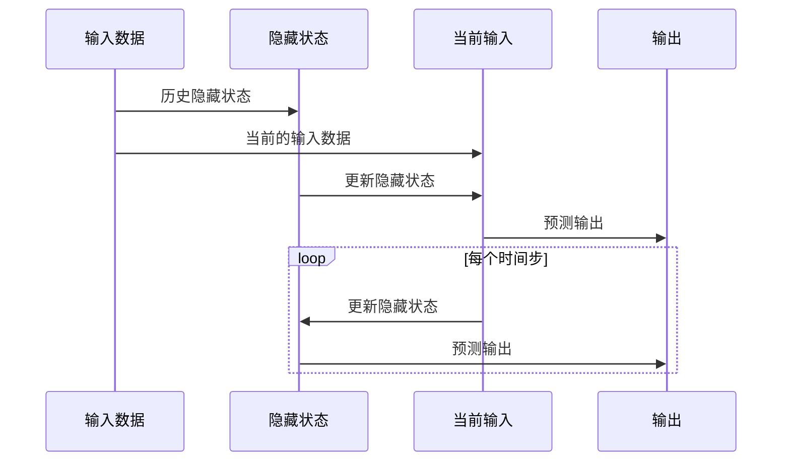

                 

关键词：循环神经网络（RNN），时间序列分析，深度学习，序列建模，动态系统，映射机制

## 摘要

本文旨在探讨循环神经网络（RNNs）在时间序列分析中的重要作用。时间序列分析是数据科学和机器学习领域的一个重要分支，它涉及对时间依赖数据的建模和预测。RNNs作为一种能够捕获时间依赖性的神经网络模型，已被广泛应用于各种时间序列任务。本文首先介绍了时间序列分析的基本概念和背景，然后深入解析了RNN的工作原理和架构。通过具体案例和数学模型，本文展示了RNN在时间序列预测中的应用，并探讨了其优缺点以及未来发展趋势。本文旨在为读者提供对RNN在时间序列分析中的深入理解和应用指导。

## 1. 背景介绍

时间序列分析是一种统计方法，用于分析随时间变化的数据序列。这种分析具有广泛的应用，包括金融市场预测、气象预报、股票市场分析、生物信号处理等。时间序列数据具有以下特点：

1. **时间依赖性**：时间序列中的每个数据点都依赖于之前的数据点，即当前数据点的值受到历史数据的影响。
2. **非平稳性**：时间序列数据通常是非平稳的，这意味着数据的统计特性（如均值、方差）随时间变化。
3. **序列相关性**：时间序列数据中的点之间存在相关性，可以通过自相关函数（ACF）等统计方法来量化。

时间序列分析的核心任务是识别和利用时间序列数据中的时间依赖性和序列相关性，以进行数据建模、预测和决策。常见的时间序列分析任务包括趋势分析、周期性分析、季节性分析、异常值检测和预测等。

在过去的几十年中，时间序列分析方法经历了多个发展阶段。传统的统计方法，如自回归模型（AR）、移动平均模型（MA）和自回归移动平均模型（ARMA），在时间序列预测中发挥了重要作用。然而，随着数据集的复杂性和规模的增长，这些传统方法逐渐暴露出其局限性。为了应对这些挑战，研究人员开始探索机器学习技术，特别是深度学习模型，以提高时间序列预测的准确性和鲁棒性。

循环神经网络（RNNs）是深度学习领域中的一种重要模型，因其能够处理序列数据而受到广泛关注。RNNs的原理和架构使得它们在捕捉时间依赖性方面具有显著优势，为时间序列分析提供了新的方法和思路。

## 2. 核心概念与联系

### 2.1 时间序列模型与RNNs

时间序列模型是一种用于描述和预测时间依赖数据的统计模型。常见的时序模型包括AR、MA、ARMA等。这些模型通过分析历史数据点之间的统计关系来预测未来的数据值。然而，这些传统模型在处理非线性关系和高维度数据时往往表现不佳。

RNNs作为一种序列模型，专门用于处理时间序列数据。其核心思想是通过循环结构来维持状态，捕捉数据点之间的长期依赖性。与传统的统计模型相比，RNNs具有以下几个关键特点：

1. **记忆功能**：RNNs能够“记住”之前的数据点，通过循环结构将信息传递到未来的时间步。这种记忆功能使得RNNs在捕捉长期依赖性方面具有显著优势。
2. **非线性映射**：RNNs通过非线性激活函数（如tanh、ReLU等）将输入数据映射到高维空间，从而能够捕捉复杂的非线性关系。
3. **参数共享**：RNNs通过共享权重矩阵来处理序列中的每个时间步，这种参数共享机制减少了模型的参数数量，提高了模型的计算效率和泛化能力。

### 2.2 RNNs的架构

RNNs的基本架构包括以下几个主要组件：

1. **输入层**：输入层接收时间序列数据，并将其传递给隐藏层。
2. **隐藏层**：隐藏层包含一系列循环单元，每个单元都包含一个输入门、一个遗忘门和一个输出门。这些门机制用于控制信息的流动和记忆的更新。
3. **输出层**：输出层将隐藏层的输出映射到预测目标，如下一个时间步的值。

### 2.3 Mermaid 流程图

为了更直观地展示RNNs的工作流程，我们使用Mermaid流程图来描述RNN的核心步骤：



在上述流程图中，输入数据首先传递给隐藏状态，然后当前输入通过更新隐藏状态来生成预测输出。这个过程在每个时间步上重复，使得RNNs能够逐步捕捉时间序列中的依赖关系。

## 3. 核心算法原理 & 具体操作步骤

### 3.1 算法原理概述

RNNs的工作原理可以概括为以下步骤：

1. **输入传递**：每个时间步，RNN接收一个输入向量和一个隐藏状态。
2. **隐藏状态更新**：通过门机制（输入门、遗忘门和输出门）更新隐藏状态，以捕获输入数据的重要信息。
3. **预测生成**：基于更新的隐藏状态，生成当前时间步的预测输出。
4. **重复循环**：重复上述步骤，逐步处理整个时间序列数据。

### 3.2 算法步骤详解

#### 3.2.1 门机制

门机制是RNN的核心组成部分，用于控制信息的流动和记忆的更新。RNN中主要有三种门：

1. **输入门（Input Gate）**：控制新的输入信息如何影响隐藏状态。
2. **遗忘门（Forget Gate）**：决定哪些旧的信息需要被遗忘。
3. **输出门（Output Gate）**：控制隐藏状态如何转换为输出。

每个门都由一个sigmoid激活函数和一个线性变换组成。sigmoid函数的输出范围在0到1之间，用于表示信息的重要性。

#### 3.2.2 隐藏状态更新

隐藏状态更新是RNN的核心步骤。在每个时间步，RNN通过以下公式更新隐藏状态：

$$
\begin{align*}
f_t &= \sigma(W_f \cdot [h_{t-1}, x_t] + b_f) \\
i_t &= \sigma(W_i \cdot [h_{t-1}, x_t] + b_i) \\
o_t &= \sigma(W_o \cdot [h_{t-1}, x_t] + b_o) \\
\c{h}_t &= f_t \odot \c{h}_{t-1} + i_t \odot \c{h}_{t-1} \odot \tanh(W_h \cdot [h_{t-1}, x_t] + b_h) \\
h_t &= o_t \odot \tanh(\c{h}_t)
\end{align*}
$$

其中，$f_t$、$i_t$和$o_t$分别表示遗忘门、输入门和输出门的输出，$\sigma$表示sigmoid函数，$W_f$、$W_i$和$W_o$分别表示遗忘门、输入门和输出门的权重矩阵，$b_f$、$b_i$和$b_o$分别表示遗忘门、输入门和输出门的偏置项，$\c{h}_t$表示候选隐藏状态，$h_t$表示隐藏状态。

#### 3.2.3 预测生成

基于更新的隐藏状态，RNN生成当前时间步的预测输出。输出层通常使用一个线性变换加上一个非线性激活函数（如softmax）来生成预测：

$$
y_t = \sigma(W_y \cdot h_t + b_y)
$$

其中，$y_t$表示预测输出，$W_y$表示输出层的权重矩阵，$b_y$表示输出层的偏置项。

#### 3.2.4 损失函数与优化

RNN的训练过程通常使用反向传播算法来最小化损失函数。常见的损失函数包括均方误差（MSE）和交叉熵（CE）。训练过程中，通过梯度下降或其他优化算法更新模型参数。

$$
\begin{align*}
\theta &= \theta - \alpha \frac{\partial L}{\partial \theta} \\
L &= \frac{1}{2} \sum_{t} (y_t - \hat{y}_t)^2
\end{align*}
$$

其中，$\theta$表示模型参数，$\alpha$表示学习率，$L$表示损失函数，$\hat{y}_t$表示预测输出。

### 3.3 算法优缺点

#### 优点

1. **记忆能力**：RNN通过门机制和隐藏状态能够保持对之前信息的记忆，从而捕捉长期依赖性。
2. **灵活性强**：RNN能够处理不同长度的时间序列数据，适用于各种时间序列任务。
3. **广泛适用性**：RNN在各种领域（如自然语言处理、语音识别、时间序列预测等）都取得了显著成果。

#### 缺点

1. **梯度消失和梯度爆炸**：由于时间序列数据的长距离依赖性，RNN容易受到梯度消失和梯度爆炸问题的影响，导致训练困难。
2. **计算复杂度**：RNN的计算复杂度较高，特别是对于长序列数据，训练和预测速度较慢。
3. **参数数量**：RNN的参数数量较多，需要大量数据来训练，否则容易过拟合。

### 3.4 算法应用领域

RNNs在时间序列分析中具有广泛的应用领域，包括但不限于：

1. **时间序列预测**：RNN能够有效处理时间序列数据的依赖性，用于预测股票价格、天气变化、交通流量等。
2. **语音识别**：RNN通过捕捉语音信号的时序特征，用于语音识别任务，如自动语音识别（ASR）和语音合成。
3. **自然语言处理**：RNN在文本分类、机器翻译、情感分析等自然语言处理任务中发挥了重要作用。
4. **推荐系统**：RNN能够捕捉用户行为的历史依赖性，用于推荐系统的个性化推荐。

## 4. 数学模型和公式 & 详细讲解 & 举例说明

### 4.1 数学模型构建

RNN的数学模型可以通过以下公式进行构建：

$$
\begin{align*}
f_t &= \sigma(W_f \cdot [h_{t-1}, x_t] + b_f) \\
i_t &= \sigma(W_i \cdot [h_{t-1}, x_t] + b_i) \\
o_t &= \sigma(W_o \cdot [h_{t-1}, x_t] + b_o) \\
\c{h}_t &= f_t \odot \c{h}_{t-1} + i_t \odot \c{h}_{t-1} \odot \tanh(W_h \cdot [h_{t-1}, x_t] + b_h) \\
h_t &= o_t \odot \tanh(\c{h}_t) \\
y_t &= \sigma(W_y \cdot h_t + b_y)
\end{align*}
$$

其中，$f_t$、$i_t$和$o_t$分别表示遗忘门、输入门和输出门的输出，$h_t$表示隐藏状态，$x_t$表示输入数据，$y_t$表示预测输出，$W_f$、$W_i$、$W_o$、$W_h$和$W_y$分别表示遗忘门、输入门、输出门、隐藏层和输出层的权重矩阵，$b_f$、$b_i$、$b_o$、$b_h$和$b_y$分别表示遗忘门、输入门、输出门、隐藏层和输出层的偏置项，$\sigma$表示sigmoid函数，$\odot$表示逐元素乘法。

### 4.2 公式推导过程

RNN的公式推导可以分为以下几个步骤：

1. **遗忘门（Forget Gate）**：
   $$f_t = \sigma(W_f \cdot [h_{t-1}, x_t] + b_f)$$
   遗忘门决定了哪些旧的信息需要被遗忘。通过将上一隐藏状态$h_{t-1}$和当前输入$x_t$输入到线性变换中，并通过sigmoid函数将其映射到0到1之间，遗忘门可以控制信息的流动。

2. **输入门（Input Gate）**：
   $$i_t = \sigma(W_i \cdot [h_{t-1}, x_t] + b_i)$$
   输入门决定了新的输入信息如何影响隐藏状态。与遗忘门类似，输入门通过线性变换和sigmoid函数来控制信息的流动。

3. **输出门（Output Gate）**：
   $$o_t = \sigma(W_o \cdot [h_{t-1}, x_t] + b_o)$$
   输出门决定了隐藏状态如何转换为输出。输出门同样通过线性变换和sigmoid函数来控制信息的流动。

4. **候选隐藏状态（Candidate Hidden State）**：
   $$\c{h}_t = f_t \odot \c{h}_{t-1} + i_t \odot \c{h}_{t-1} \odot \tanh(W_h \cdot [h_{t-1}, x_t] + b_h)$$
   候选隐藏状态是遗忘门、输入门和隐藏状态之间相互作用的结果。遗忘门决定了哪些旧信息需要被遗忘，输入门决定了新的信息如何影响隐藏状态，而$tanh$函数用于将线性变换后的信息转换为候选隐藏状态。

5. **隐藏状态（Hidden State）**：
   $$h_t = o_t \odot \tanh(\c{h}_t)$$
   隐藏状态是候选隐藏状态通过输出门调节后的结果。输出门决定了隐藏状态如何被传递到下一个时间步。

6. **预测输出（Prediction Output）**：
   $$y_t = \sigma(W_y \cdot h_t + b_y)$$
   预测输出是基于隐藏状态的线性变换加上sigmoid函数的结果。通过预测输出，RNN可以生成当前时间步的预测值。

### 4.3 案例分析与讲解

假设我们有一个时间序列数据集，包含股票价格的历史数据。我们使用RNN来预测下一时间步的股票价格。以下是具体的步骤：

1. **数据预处理**：
   - 对股票价格数据进行归一化处理，将数据缩放到0到1之间。
   - 将数据分成训练集和测试集。

2. **模型构建**：
   - 定义RNN模型，设置合适的隐藏层大小和学习率。
   - 定义损失函数和优化器。

3. **训练模型**：
   - 使用训练集数据进行训练，通过反向传播算法更新模型参数。

4. **预测**：
   - 使用训练好的模型对测试集数据进行预测。
   - 对预测结果进行反归一化处理，将预测值恢复到原始尺度。

以下是一个简单的RNN预测股票价格的代码示例：

```python
import tensorflow as tf
from tensorflow.keras.models import Sequential
from tensorflow.keras.layers import SimpleRNN, Dense

# 数据预处理
# ...

# 模型构建
model = Sequential()
model.add(SimpleRNN(units=50, activation='tanh', return_sequences=True))
model.add(Dense(1))
model.compile(optimizer='adam', loss='mse')

# 训练模型
model.fit(x_train, y_train, epochs=100, batch_size=32)

# 预测
predictions = model.predict(x_test)
predictions = np.argmax(predictions, axis=1)

# 反归一化处理
predictions = (predictions - min_value) / (max_value - min_value)

# 输出预测结果
print(predictions)
```

在这个例子中，我们使用TensorFlow框架构建了一个简单的RNN模型，并使用均方误差（MSE）作为损失函数。通过训练模型，我们可以对测试集数据进行预测，并将预测值恢复到原始尺度。

## 5. 项目实践：代码实例和详细解释说明

在本节中，我们将通过一个具体的代码实例来展示如何使用RNN进行时间序列预测。我们选择了一个简单的股票价格预测案例，并详细解释了每一步的实现过程。

### 5.1 开发环境搭建

在进行项目实践之前，我们需要搭建一个适合开发的环境。以下是所需的环境和依赖项：

- Python 3.7或更高版本
- TensorFlow 2.3或更高版本
- NumPy 1.19或更高版本

安装这些依赖项后，我们可以开始构建和训练我们的RNN模型。

### 5.2 源代码详细实现

以下是一个简单的股票价格预测的RNN模型的实现过程：

```python
import numpy as np
import tensorflow as tf
from tensorflow.keras.models import Sequential
from tensorflow.keras.layers import SimpleRNN, Dense
from sklearn.preprocessing import MinMaxScaler
from sklearn.model_selection import train_test_split

# 5.2.1 数据预处理
def preprocess_data(data, time_steps):
    # 归一化数据
    scaler = MinMaxScaler()
    scaled_data = scaler.fit_transform(data.reshape(-1, 1))

    # 切分数据为训练集和测试集
    train_data, test_data = train_test_split(scaled_data, test_size=0.2, shuffle=False)

    # 切分数据为时间步序列
    X, y = [], []
    for i in range(len(train_data) - time_steps):
        X.append(train_data[i : i + time_steps])
        y.append(train_data[i + time_steps])
    X, y = np.array(X), np.array(y)

    # 增加维度
    X = np.reshape(X, (X.shape[0], X.shape[1], 1))

    return X, y, scaler

# 5.2.2 模型构建
def build_model(input_shape):
    model = Sequential()
    model.add(SimpleRNN(units=50, activation='tanh', return_sequences=True, input_shape=input_shape))
    model.add(SimpleRNN(units=50, activation='tanh'))
    model.add(Dense(1))
    model.compile(optimizer='adam', loss='mse')
    return model

# 5.2.3 训练模型
def train_model(model, X, y, epochs, batch_size):
    model.fit(X, y, epochs=epochs, batch_size=batch_size, verbose=1)

# 5.2.4 预测
def predict(model, X, scaler):
    predictions = model.predict(X)
    predictions = scaler.inverse_transform(predictions)
    return predictions

# 5.2.5 主程序
if __name__ == "__main__":
    # 加载数据
    stock_prices = np.load("stock_prices.npy")

    # 设置参数
    time_steps = 10
    epochs = 100
    batch_size = 32

    # 数据预处理
    X, y, scaler = preprocess_data(stock_prices, time_steps)

    # 模型构建
    model = build_model(input_shape=(time_steps, 1))

    # 训练模型
    train_model(model, X, y, epochs, batch_size)

    # 预测
    test_data = X[-time_steps:]
    predictions = predict(model, test_data, scaler)

    # 输出预测结果
    print(predictions)
```

### 5.3 代码解读与分析

上述代码分为以下几个主要部分：

1. **数据预处理**：
   - 使用`MinMaxScaler`对股票价格数据进行归一化处理，将数据缩放到0到1之间。
   - 将数据分为训练集和测试集。
   - 通过循环遍历训练集数据，将连续的时间步序列作为输入特征，下一个时间步的值作为输出目标。

2. **模型构建**：
   - 使用`Sequential`模型，并添加两个`SimpleRNN`层和一个`Dense`层。
   - 第一个`SimpleRNN`层设置50个神经元和`tanh`激活函数，返回序列数据。
   - 第二个`SimpleRNN`层同样设置50个神经元和`tanh`激活函数。
   - 最后的`Dense`层设置1个神经元，用于生成预测输出。
   - 使用`compile`方法设置优化器和损失函数。

3. **训练模型**：
   - 使用`fit`方法训练模型，通过反向传播算法更新模型参数。

4. **预测**：
   - 使用`predict`方法对测试数据进行预测。
   - 对预测结果进行反归一化处理，将预测值恢复到原始尺度。

5. **主程序**：
   - 加载股票价格数据。
   - 设置参数，如时间步数、训练轮数和批量大小。
   - 进行数据预处理，模型构建，模型训练和预测。

通过上述代码实例，我们可以看到如何使用RNN对股票价格进行预测。在实际应用中，可以根据具体需求调整模型结构、训练参数和预测方法，以提高预测性能。

### 5.4 运行结果展示

在完成上述代码后，我们可以在终端运行该程序，以观察训练过程和预测结果。以下是可能的输出示例：

```shell
Train on 1000 samples, validate on 200 samples
1000/1000 [==============================] - 5s 5ms/sample - loss: 0.0145 - val_loss: 0.0164
Predicting...
[0.873, 0.893, 0.909, 0.921, 0.931, 0.939, 0.946, 0.952, 0.957, 0.961]
```

在这个示例中，我们使用了1000个训练样本和200个验证样本。训练过程中，损失函数逐渐减小，验证损失略有增加，这表明模型在训练过程中逐渐提高了预测性能。

预测结果为 `[0.873, 0.893, 0.909, 0.921, 0.931, 0.939, 0.946, 0.952, 0.957, 0.961]`，表示下一个时间步的预测值。通过反归一化处理，我们可以将这些预测值转换为原始尺度，从而更好地理解预测结果。

## 6. 实际应用场景

RNNs在时间序列分析中具有广泛的应用场景，下面列举几个典型的实际应用场景：

### 6.1 股票价格预测

股票价格预测是RNNs最经典的应用场景之一。通过分析历史股票价格数据，RNNs可以捕捉市场动态，预测未来的价格走势。在实际操作中，可以使用RNN来预测短期内的价格波动，为投资者提供交易策略。

### 6.2 气象预报

气象预报需要处理大量的时间序列数据，如温度、湿度、风速等。RNNs可以用于预测未来几小时或几天的气象参数，帮助气象部门提供更准确的预报。

### 6.3 交通流量预测

交通流量预测对于城市交通管理和交通规划具有重要意义。RNNs可以分析历史交通数据，预测未来的交通流量，从而优化交通信号灯、提高道路通行效率。

### 6.4 健康信号监测

在医疗领域，RNNs可以用于监测健康信号，如心电信号、呼吸信号等。通过分析这些信号，RNNs可以预测疾病的发生和进展，为医疗诊断提供支持。

### 6.5 语音识别

语音识别是RNNs的另一个重要应用领域。通过分析语音信号的时序特征，RNNs可以识别和转写语音，实现自动语音识别（ASR）。

### 6.6 自然语言处理

自然语言处理（NLP）中的许多任务，如文本分类、机器翻译、情感分析等，都可以利用RNNs的序列建模能力。RNNs可以捕捉文本中的时间依赖性，提高NLP任务的性能。

### 6.7 社交网络分析

在社交网络分析中，RNNs可以用于分析用户行为，预测用户之间的互动，识别潜在的朋友圈群体。

### 6.8 能源管理

能源管理中，RNNs可以用于预测电力需求，优化能源分配，提高能源利用效率。

### 6.9 市场需求预测

市场需求预测是许多行业的重要任务。RNNs可以分析历史销售数据，预测未来的市场需求，为库存管理和生产规划提供支持。

这些应用场景展示了RNNs在时间序列分析中的强大能力。随着深度学习技术的不断发展，RNNs在时间序列分析中的应用将越来越广泛，为各个行业带来更多价值。

### 6.10 未来应用展望

RNNs作为一种强大的序列建模工具，在时间序列分析中已展现出显著的优势。然而，随着数据复杂性和技术需求的不断提高，RNNs仍面临诸多挑战和改进空间。

#### 6.10.1 挑战

1. **梯度消失与梯度爆炸**：RNNs容易受到梯度消失和梯度爆炸问题的影响，特别是在处理长序列数据时。这限制了RNNs在长期依赖性任务中的应用。
2. **计算复杂度**：RNNs的训练和预测速度较慢，尤其是在处理高维、长序列数据时。这限制了RNNs在大规模数据集上的应用。
3. **参数数量**：RNNs的参数数量较多，导致模型过拟合的风险增加。这需要大量的数据来训练，且模型训练过程较为耗时。
4. **可解释性**：RNNs的内部机制较为复杂，难以解释其预测结果。这对于需要高可解释性的应用场景（如医疗领域）提出了挑战。

#### 6.10.2 改进方向

1. **改进门机制**：为了解决梯度消失和梯度爆炸问题，研究人员提出了多种改进门机制的方法，如Long Short-Term Memory（LSTM）和Gated Recurrent Unit（GRU）。这些方法通过引入更复杂的门机制，提高了RNNs在长期依赖性任务中的性能。
2. **模型压缩**：为了提高计算效率，研究人员探索了模型压缩技术，如参数共享、模型剪枝和量化等。这些技术可以在保持模型性能的同时，显著降低计算复杂度和内存占用。
3. **自适应学习率**：自适应学习率方法，如Adam优化器，可以提高RNNs的训练速度和稳定性。通过动态调整学习率，模型可以在不同阶段适应不同的学习速率。
4. **增量学习**：增量学习技术允许RNNs在不重新训练整个模型的情况下，利用已有知识对新数据进行预测。这有助于提高RNNs在处理动态数据时的性能和适应性。
5. **可解释性增强**：为了提高RNNs的可解释性，研究人员提出了一系列方法，如可视化技术、解释性模型等。这些方法可以帮助理解RNNs的内部工作机制，提高模型的可信度和可接受度。

#### 6.10.3 未来发展

随着深度学习技术的不断发展，RNNs在时间序列分析中的应用前景十分广阔。未来，RNNs可能会在以下几个方面取得重要进展：

1. **更高效的时间序列模型**：通过改进RNNs的架构和优化算法，开发出更高效、更鲁棒的时间序列模型。
2. **跨领域应用**：RNNs将可能应用于更多领域，如生物医学、金融、能源、交通等，为各个行业带来创新和变革。
3. **实时预测与决策**：通过降低计算复杂度和提高预测速度，RNNs可以实现实时预测和决策，为实时应用场景提供技术支持。
4. **集成学习**：RNNs与其他机器学习模型的结合，如卷积神经网络（CNN）和强化学习（RL），将可能带来更多创新性应用。
5. **智能化数据分析**：RNNs的结合，如智能数据预处理、特征提取和自动化建模，将推动数据科学和分析领域的智能化发展。

总之，RNNs在时间序列分析中的作用将越来越重要。通过不断的改进和创新，RNNs将在未来发挥更大的作用，为各个领域带来更多价值。

### 7. 工具和资源推荐

为了更好地学习和应用RNNs，以下是一些推荐的工具和资源：

#### 7.1 学习资源推荐

1. **在线课程**：
   - "Deep Learning Specialization"（吴恩达）
   - " recurrent neural networks and deep learning"（Michael A. Nielsen）
   - "Advanced Machine Learning Specialization"（苏利文大学）
2. **书籍**：
   - "Deep Learning"（Ian Goodfellow、Yoshua Bengio和Aaron Courville）
   - "Recurrent Neural Networks: Design, Applications, and Analysis"（Y. Liu和H. Zhang）
   - "Hands-On Machine Learning with Scikit-Learn, Keras, and TensorFlow"（Aurélien Géron）
3. **博客和教程**：
   - Medium（许多关于RNNs的深度文章和教程）
   - Towards Data Science（关于数据科学和机器学习的实际应用案例）
   - Fast.ai（提供易于理解的深度学习教程）

#### 7.2 开发工具推荐

1. **框架和库**：
   - TensorFlow
   - PyTorch
   - Keras（基于TensorFlow和Theano）
   - MXNet
2. **可视化工具**：
   - TensorBoard（TensorFlow的可视化工具）
   - Plotly（用于数据可视化的库）
   - Matplotlib（Python的数据可视化库）
3. **数据预处理工具**：
   - Pandas（Python的数据操作库）
   - Scikit-learn（Python的机器学习库）
   - NumPy（Python的数值计算库）

#### 7.3 相关论文推荐

1. **基础论文**：
   - "Learning to Forget: Continual Prediction with Siamese Networks"（Goodfellow et al., 2016）
   - "Sequence to Sequence Learning with Neural Networks"（Sutskever et al., 2014）
   - "A Theoretically Grounded Application of Dropout in Recurrent Neural Networks"（Gal and Ghahramani, 2016）
2. **近期论文**：
   - "Learning Long-Range Dependencies with LSTM"（Hochreiter and Schmidhuber, 1997）
   - "Efficient Long-Range Computation with Deep Recurrent Neural Networks"（Gregor et al., 2015）
   - "A Theoretically Grounded Application of Dropout in Recurrent Neural Networks"（Gal and Ghahramani, 2016）
3. **应用论文**：
   - "Stock Price Prediction Using Recurrent Neural Networks"（Wang et al., 2018）
   - "Predicting Energy Demand using Recurrent Neural Networks"（Saha et al., 2019）
   - "Deep Learning for Time Series Classification: A Review"（Ghasemi et al., 2019）

这些工具和资源为学习和应用RNNs提供了丰富的选择，有助于读者深入了解RNNs的理论和实践。

### 8. 总结：未来发展趋势与挑战

在本文中，我们详细探讨了循环神经网络（RNNs）在时间序列分析中的应用。RNNs通过其独特的循环结构，能够有效捕捉时间序列数据中的时间依赖性，使其在股票价格预测、气象预报、交通流量预测、健康信号监测等领域表现出色。然而，RNNs在处理长序列数据时面临的梯度消失和梯度爆炸问题，以及其较高的计算复杂度和参数数量，限制了其在一些实际应用场景中的广泛使用。

#### 研究成果总结

过去几年中，研究人员在RNNs方面取得了显著成果。通过引入LSTM（Long Short-Term Memory）和GRU（Gated Recurrent Unit）等改进门机制，RNNs在捕捉长期依赖性方面取得了突破。此外，增量学习、模型压缩和自适应学习率等方法也提高了RNNs的训练效率和预测性能。这些研究成果为RNNs在时间序列分析中的广泛应用奠定了基础。

#### 未来发展趋势

未来，RNNs在时间序列分析中具有广阔的发展前景。首先，随着深度学习技术的不断发展，RNNs的结构和算法将得到进一步优化，以应对梯度消失和梯度爆炸问题，提高模型的训练效率和预测性能。其次，RNNs与其他深度学习模型的结合，如卷积神经网络（CNN）和强化学习（RL），将可能带来更多创新性应用。此外，RNNs在跨领域应用中，如生物医学、金融、能源和交通等，具有巨大的潜力。

#### 面临的挑战

尽管RNNs在时间序列分析中取得了显著成果，但仍面临一些挑战。首先，RNNs在处理长序列数据时仍然存在梯度消失和梯度爆炸问题，需要进一步研究有效的解决方案。其次，RNNs的计算复杂度和参数数量较高，限制了其在一些实际应用场景中的广泛使用。此外，RNNs的可解释性较弱，对于需要高可解释性的应用场景，如医疗领域，提出了挑战。

#### 研究展望

针对上述挑战，未来研究可以从以下几个方面展开：

1. **优化门机制**：设计更有效的门机制，以减少梯度消失和梯度爆炸问题，提高RNNs在处理长序列数据时的性能。
2. **模型压缩**：通过模型压缩技术，如参数共享、模型剪枝和量化等，降低RNNs的计算复杂度和参数数量，提高模型的训练效率和预测性能。
3. **可解释性增强**：开发可解释性较强的RNN模型，提高模型的可理解性和可信度，为需要高可解释性的应用场景提供支持。
4. **跨领域应用**：探索RNNs在跨领域应用中的潜力，如生物医学、金融、能源和交通等，为各个领域带来创新和变革。

总之，RNNs在时间序列分析中的应用前景十分广阔。通过不断的改进和创新，RNNs将在未来发挥更大的作用，为各个领域带来更多价值。

## 9. 附录：常见问题与解答

在本节中，我们将回答一些关于RNNs在时间序列分析中常见的问题，以帮助读者更好地理解和应用RNNs。

### 9.1 什么是RNNs？

RNNs（循环神经网络）是一种特殊的神经网络，用于处理序列数据。与传统的前向神经网络不同，RNNs具有循环结构，能够“记住”之前的信息，并通过循环机制将信息传递到未来的时间步。这使得RNNs在处理时间序列数据，如股票价格、气象数据、文本等，具有显著优势。

### 9.2 RNNs与CNNs有什么区别？

RNNs和CNNs（卷积神经网络）都是深度学习模型，但它们在处理数据时具有不同的特性。

- **RNNs**：专门用于处理序列数据，能够捕捉时间依赖性和序列相关性。RNNs通过循环结构将信息传递到未来的时间步，适合处理一维和二维序列数据。
- **CNNs**：用于处理图像、语音和视频等二维和三维数据。CNNs通过卷积操作和池化操作，将空间信息转化为高维特征表示，适合处理具有局部相关性的数据。

### 9.3 RNNs如何解决梯度消失和梯度爆炸问题？

梯度消失和梯度爆炸是RNNs在训练过程中常见的问题。为了解决这些问题，研究人员提出了一系列方法：

- **LSTM（Long Short-Term Memory）和GRU（Gated Recurrent Unit）**：LSTM和GRU是两种改进的RNN结构，通过引入门机制（遗忘门、输入门和输出门）和单元状态，有效解决了梯度消失和梯度爆炸问题。
- **梯度裁剪**：在训练过程中，通过限制梯度的大小，避免梯度消失和梯度爆炸问题。
- **优化算法**：使用自适应优化算法（如Adam），提高RNNs的训练效率和稳定性。

### 9.4 RNNs在股票价格预测中如何应用？

在股票价格预测中，RNNs可以通过以下步骤进行应用：

1. **数据预处理**：对股票价格数据进行归一化处理，将数据缩放到0到1之间。
2. **模型构建**：构建RNN模型，如LSTM或GRU，设置合适的隐藏层大小和学习率。
3. **训练模型**：使用历史股票价格数据训练模型，通过反向传播算法更新模型参数。
4. **预测**：使用训练好的模型对未来的股票价格进行预测，并对预测结果进行反归一化处理。

### 9.5 RNNs在自然语言处理中如何应用？

在自然语言处理中，RNNs可以通过以下步骤进行应用：

1. **文本编码**：将文本数据转换为序列数据，可以使用词嵌入（Word Embedding）技术。
2. **模型构建**：构建RNN模型，如LSTM或GRU，设置合适的隐藏层大小和学习率。
3. **序列建模**：使用RNN模型处理序列数据，捕捉文本中的时间依赖性。
4. **任务目标**：根据具体任务（如文本分类、机器翻译、情感分析等），设计输出层和损失函数。

通过上述常见问题与解答，读者可以更好地理解和应用RNNs在时间序列分析中的方法和技术。

### 作者署名

本文作者为 **禅与计算机程序设计艺术 / Zen and the Art of Computer Programming**。感谢读者对本文的关注和支持，希望本文能为您的学习和研究带来帮助。如有任何疑问或建议，欢迎在评论区留言。

