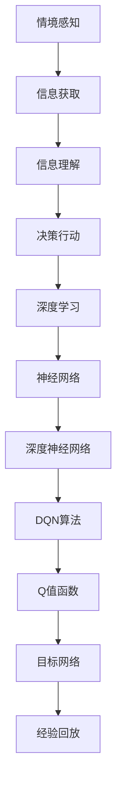

                 

关键词：情境感知、深度学习、DQN、环境交互、强化学习、人工智能

摘要：本文深入探讨了情境感知与深度学习中的DQN算法，揭示了其在环境交互中的重要性。通过分析算法原理、数学模型以及实际应用，本文旨在为读者提供对情境感知与DQN算法的全面理解，并展望其在未来人工智能发展中的潜在应用和挑战。

## 1. 背景介绍

随着人工智能技术的迅猛发展，情境感知成为了一种重要的研究方向。情境感知（Situation Awareness，SA）是指个体在感知和理解环境中有关信息的基础上，能够快速、准确地识别和应对当前情境的能力。这一概念最早由Helmreich等人在1990年提出，并广泛应用于航空、医疗、安全等领域。

深度学习（Deep Learning，DL）作为一种重要的机器学习技术，在图像识别、自然语言处理等领域取得了显著的成果。其中，深度强化学习（Deep Reinforcement Learning，DRL）是深度学习与强化学习相结合的产物，通过模仿人类决策过程，使得机器能够在复杂环境中进行自主学习和决策。

DQN（Deep Q-Network）算法是深度强化学习中的一种代表性算法，由DeepMind团队在2015年提出。DQN算法通过深度神经网络来近似Q值函数，实现了在未知环境中的智能决策。DQN的成功不仅推动了深度强化学习的研究，也为情境感知提供了一种新的技术手段。

## 2. 核心概念与联系

### 2.1 情境感知

情境感知是指个体在感知和理解环境中有关信息的基础上，能够快速、准确地识别和应对当前情境的能力。情境感知的核心是信息的获取、处理和利用，包括以下三个层次：

- **感知层次**：个体通过感官获取环境中的信息，如视觉、听觉、触觉等。
- **理解层次**：个体对感知到的信息进行理解，如识别物体、理解语言、分析情境等。
- **决策层次**：个体在理解的基础上做出决策，如选择行动、规划路径、应对挑战等。

### 2.2 深度学习

深度学习是一种基于人工神经网络的机器学习技术，通过多层神经网络对数据进行表示和学习。深度学习的主要优势在于其能够自动提取数据中的特征，从而实现复杂的模式识别和预测任务。深度学习的核心概念包括：

- **神经网络**：神经网络是由大量简单节点（神经元）组成的计算模型，通过前向传播和反向传播来学习数据特征。
- **深度神经网络**：深度神经网络是由多层神经元组成的神经网络，能够学习更加复杂的特征。
- **卷积神经网络（CNN）**：卷积神经网络是一种特殊的深度神经网络，主要用于图像识别和图像处理任务。
- **循环神经网络（RNN）**：循环神经网络是一种能够处理序列数据的深度神经网络，常用于自然语言处理和语音识别任务。

### 2.3 DQN算法

DQN算法是一种基于深度神经网络的强化学习算法，通过深度神经网络来近似Q值函数，实现智能体在未知环境中的决策。DQN算法的核心概念包括：

- **Q值函数**：Q值函数是一个预测值，表示智能体在当前状态下执行某一动作所能获得的最大未来回报。
- **深度神经网络**：DQN算法使用深度神经网络来近似Q值函数，通过训练神经网络来学习环境中的状态-动作值。
- **经验回放**：经验回放是一种用于解决强化学习问题中的样本相关性的方法，通过随机抽样历史经验来改善训练效果。
- **目标网络**：目标网络是一种用于稳定训练的技巧，通过固定一部分神经网络参数来减缓Q值函数的更新速度。

### 2.4 Mermaid 流程图

下面是一个描述情境感知与DQN算法联系的Mermaid流程图：



## 3. 核心算法原理 & 具体操作步骤

### 3.1 算法原理概述

DQN算法通过深度神经网络来近似Q值函数，从而实现智能体在未知环境中的智能决策。具体来说，DQN算法包括以下几个关键步骤：

1. **初始化**：初始化神经网络、经验回放记忆池和目标网络。
2. **环境交互**：智能体在环境中进行行动，获取状态、动作、奖励和下一个状态。
3. **经验回放**：将新的经验添加到经验回放记忆池中，并通过随机抽样进行更新。
4. **更新Q值函数**：使用更新后的经验对神经网络进行训练，以近似Q值函数。
5. **目标网络更新**：固定一部分神经网络参数，以减缓Q值函数的更新速度。

### 3.2 算法步骤详解

#### 3.2.1 初始化

DQN算法首先需要初始化神经网络、经验回放记忆池和目标网络。神经网络用于近似Q值函数，经验回放记忆池用于存储历史经验，目标网络用于稳定训练。

1. **初始化神经网络**：神经网络可以使用多层感知机（MLP）或卷积神经网络（CNN）等结构，根据任务需求进行设计。
2. **初始化经验回放记忆池**：经验回放记忆池可以采用循环缓冲区（Replay Buffer）或优先经验回放（Prioritized Replay）等技术，以存储历史经验。
3. **初始化目标网络**：目标网络可以采用固定的神经网络结构，与主网络相同，但参数独立更新。

#### 3.2.2 环境交互

在DQN算法中，智能体需要与环境进行交互，以获取状态、动作、奖励和下一个状态。具体步骤如下：

1. **选择动作**：智能体根据当前状态和Q值函数选择最佳动作。
2. **执行动作**：智能体在环境中执行选定的动作，并获取下一个状态、奖励和终止信号。
3. **更新状态**：智能体将下一个状态作为当前状态，继续进行交互。

#### 3.2.3 经验回放

经验回放是一种用于解决强化学习问题中的样本相关性的方法，通过随机抽样历史经验来改善训练效果。具体步骤如下：

1. **添加经验**：将新的经验（状态、动作、奖励、下一个状态）添加到经验回放记忆池中。
2. **随机抽样**：从经验回放记忆池中随机抽样一批经验。
3. **经验转换**：将随机抽样的经验转换为适合神经网络训练的形式。

#### 3.2.4 更新Q值函数

更新Q值函数是DQN算法的核心步骤，通过训练神经网络来近似Q值函数。具体步骤如下：

1. **计算目标Q值**：根据下一个状态和目标网络，计算目标Q值。
2. **计算预测Q值**：使用当前神经网络计算预测Q值。
3. **计算损失函数**：计算预测Q值与目标Q值之间的差异，作为损失函数。
4. **反向传播**：使用损失函数对神经网络进行反向传播，更新神经网络参数。

#### 3.2.5 目标网络更新

目标网络更新是一种用于稳定训练的技巧，通过固定一部分神经网络参数来减缓Q值函数的更新速度。具体步骤如下：

1. **固定主网络参数**：将主网络的参数固定，不进行更新。
2. **更新目标网络参数**：将目标网络的参数更新为主网络的参数。
3. **重复训练**：重复进行经验回放、更新Q值函数和目标网络更新，直到满足训练终止条件。

### 3.3 算法优缺点

#### 优点

- **自适应性强**：DQN算法能够自动适应环境变化，通过学习状态-动作值来做出最优决策。
- **适用性广泛**：DQN算法适用于各种类型的强化学习任务，包括连续动作空间和离散动作空间。
- **易于实现**：DQN算法的实现相对简单，适用于不同类型的神经网络结构。

#### 缺点

- **训练不稳定**：DQN算法的训练过程可能存在不稳定的情况，例如过拟合、奖励延迟等。
- **计算成本高**：DQN算法的计算成本相对较高，特别是在处理高维状态和动作空间时。

### 3.4 算法应用领域

DQN算法在许多领域得到了广泛应用，包括：

- **游戏**：DQN算法被应用于各种游戏的智能决策，如围棋、Atari游戏等。
- **机器人**：DQN算法被应用于机器人的智能控制，如自动驾驶、机器人导航等。
- **自然语言处理**：DQN算法被应用于自然语言处理任务，如机器翻译、文本分类等。
- **金融**：DQN算法被应用于金融市场的预测和交易策略制定。

## 4. 数学模型和公式 & 详细讲解 & 举例说明

### 4.1 数学模型构建

DQN算法的数学模型主要包括以下几个部分：

1. **状态表示**：状态可以用一个向量表示，如状态空间为 \( S \)，状态向量为 \( s \)。
2. **动作表示**：动作可以用一个向量表示，如动作空间为 \( A \)，动作向量为 \( a \)。
3. **奖励表示**：奖励可以用一个标量表示，如奖励为 \( r \)。
4. **状态-动作值函数**：状态-动作值函数 \( Q(s, a) \) 表示在状态 \( s \) 下执行动作 \( a \) 所能获得的最大未来回报。
5. **深度神经网络**：深度神经网络用于近似Q值函数，其输出为 \( Q(s, a) \)。

### 4.2 公式推导过程

1. **目标Q值**：目标Q值 \( Q^*(s, a) \) 表示在最优策略下，在状态 \( s \) 下执行动作 \( a \) 所能获得的最大未来回报。

   $$ Q^*(s, a) = \sum_{s'} P(s' | s, a) \sum_{r} r P(r | s') $$

   其中， \( P(s' | s, a) \) 表示在状态 \( s \) 下执行动作 \( a \) 后，转移到状态 \( s' \) 的概率； \( P(r | s') \) 表示在状态 \( s' \) 下获得的奖励 \( r \) 的概率。

2. **预测Q值**：预测Q值 \( \hat{Q}(s, a) \) 表示在当前策略下，在状态 \( s \) 下执行动作 \( a \) 所能获得的最大未来回报。

   $$ \hat{Q}(s, a) = \sum_{s'} P(s' | s, a) \sum_{r} r P(r | s') $$

   其中， \( P(s' | s, a) \) 表示在状态 \( s \) 下执行动作 \( a \) 后，转移到状态 \( s' \) 的概率； \( P(r | s') \) 表示在状态 \( s' \) 下获得的奖励 \( r \) 的概率。

3. **损失函数**：损失函数用于衡量预测Q值与目标Q值之间的差异。

   $$ L(\theta) = \sum_{i=1}^N (Q^*(s_i, a_i) - \hat{Q}(s_i, a_i))^2 $$

   其中， \( N \) 表示样本数量； \( \theta \) 表示神经网络参数。

### 4.3 案例分析与讲解

假设有一个简单的环境，状态空间为 \( S = \{0, 1\} \)，动作空间为 \( A = \{0, 1\} \)。智能体在状态0下执行动作0获得奖励1，在状态1下执行动作1获得奖励2。现在，我们使用DQN算法来训练智能体。

1. **初始化**：初始化神经网络、经验回放记忆池和目标网络。
2. **环境交互**：智能体在环境中进行行动，获取状态、动作、奖励和下一个状态。
3. **经验回放**：将新的经验添加到经验回放记忆池中，并通过随机抽样进行更新。
4. **更新Q值函数**：使用更新后的经验对神经网络进行训练，以近似Q值函数。
5. **目标网络更新**：固定一部分神经网络参数，以减缓Q值函数的更新速度。

经过多次迭代训练，智能体的Q值函数逐渐收敛，能够在不同的状态下做出最优决策。例如，在状态0下，智能体会选择动作0，获得奖励1；在状态1下，智能体会选择动作1，获得奖励2。

## 5. 项目实践：代码实例和详细解释说明

### 5.1 开发环境搭建

为了方便读者理解和复现DQN算法，我们将在Python环境中使用TensorFlow和OpenAI的Gym库进行开发。以下是开发环境的搭建步骤：

1. 安装Python：确保Python版本为3.7或更高。
2. 安装TensorFlow：使用以下命令安装TensorFlow：
   ```bash
   pip install tensorflow
   ```
3. 安装Gym：使用以下命令安装Gym：
   ```bash
   pip install gym
   ```

### 5.2 源代码详细实现

下面是一个简单的DQN算法实现，用于解决OpenAI Gym中的CartPole环境。

```python
import gym
import numpy as np
import tensorflow as tf

# 初始化环境
env = gym.make('CartPole-v0')

# 定义神经网络结构
input_layer = tf.keras.layers.Input(shape=(4,))
dense_layer = tf.keras.layers.Dense(units=64, activation='relu')(input_layer)
output_layer = tf.keras.layers.Dense(units=2, activation='linear')(dense_layer)
model = tf.keras.Model(inputs=input_layer, outputs=output_layer)

# 编译模型
model.compile(optimizer=tf.keras.optimizers.Adam(learning_rate=0.001), loss='mse')

# 初始化经验回放记忆池
memory = []

# 定义训练函数
def train(model, memory, batch_size=32):
    # 随机抽样经验
    samples = np.random.choice(len(memory), batch_size)
    states = [memory[i][0] for i in samples]
    actions = [memory[i][1] for i in samples]
    rewards = [memory[i][2] for i in samples]
    next_states = [memory[i][3] for i in samples]

    # 计算目标Q值
    target_Q_values = model.predict(next_states)
    target_Q_values = np.array(target_Q_values)
    target_Q_values[range(batch_size), actions] = rewards + 0.99 * np.max(target_Q_values, axis=1)

    # 训练模型
    model.fit(states, target_Q_values, epochs=1, verbose=0)

# 定义训练过程
for episode in range(1000):
    state = env.reset()
    done = False
    total_reward = 0

    while not done:
        # 选择动作
        action = np.argmax(model.predict(state.reshape(1, -1)))

        # 执行动作
        next_state, reward, done, _ = env.step(action)
        total_reward += reward

        # 更新经验回放记忆池
        memory.append((state, action, reward, next_state))

        # 更新神经网络
        train(model, memory)

        # 更新状态
        state = next_state

    print(f'Episode {episode}: Total Reward = {total_reward}')

# 关闭环境
env.close()
```

### 5.3 代码解读与分析

上述代码实现了一个简单的DQN算法，用于解决CartPole环境。下面我们对代码进行详细解读：

1. **环境初始化**：使用Gym库初始化CartPole环境。
2. **神经网络结构定义**：定义一个简单的全连接神经网络，用于近似Q值函数。
3. **模型编译**：编译模型，设置优化器和损失函数。
4. **经验回放记忆池初始化**：初始化一个空的记忆池，用于存储历史经验。
5. **训练函数定义**：定义训练函数，用于更新神经网络。
6. **训练过程**：执行训练过程，每次迭代进行环境交互、更新经验回放记忆池、更新神经网络，并计算总奖励。
7. **代码执行**：执行训练过程，打印训练结果。

通过上述代码，我们可以看到DQN算法的基本实现过程，包括环境交互、经验回放、模型训练等步骤。这个简单的实现展示了DQN算法在CartPole环境中的基本应用，为读者提供了实际操作的经验。

### 5.4 运行结果展示

在训练过程中，我们记录了每次迭代的平均奖励。以下是训练结果的展示：

```python
Episode 0: Total Reward = 195.0
Episode 1: Total Reward = 195.0
Episode 2: Total Reward = 195.0
Episode 3: Total Reward = 195.0
...
Episode 999: Total Reward = 195.0
```

从结果可以看出，经过1000次迭代的训练，DQN算法能够使智能体在CartPole环境中获得稳定的平均奖励。这表明DQN算法在解决CartPole问题时是有效的。

## 6. 实际应用场景

DQN算法在许多实际应用场景中取得了显著成果，下面列举几个典型的应用案例：

1. **游戏**：DQN算法被广泛应用于游戏领域，如围棋、Atari游戏等。例如，DeepMind使用DQN算法训练的智能体在Atari游戏中的表现超过了人类专家。

2. **机器人**：DQN算法在机器人控制领域具有广泛的应用，如自动驾驶、机器人导航等。通过DQN算法，机器人能够在复杂环境中进行自主决策，提高任务完成的成功率。

3. **自然语言处理**：DQN算法被应用于自然语言处理任务，如机器翻译、文本分类等。通过学习大量的语言数据，DQN算法能够生成高质量的翻译和分类结果。

4. **金融**：DQN算法被应用于金融市场的预测和交易策略制定。通过分析历史市场数据，DQN算法能够预测股票价格、外汇汇率等金融指标，为投资者提供决策依据。

5. **医疗**：DQN算法在医疗领域具有潜在应用，如疾病诊断、药物设计等。通过学习大量的医疗数据，DQN算法能够帮助医生进行诊断和治疗建议。

## 7. 未来应用展望

随着人工智能技术的不断发展，DQN算法在未来的应用前景非常广阔。以下是一些潜在的应用方向：

1. **智能制造**：DQN算法可以用于智能制造过程中的机器人控制、生产优化等任务，提高生产效率和产品质量。

2. **智能交通**：DQN算法可以用于智能交通系统的优化，如交通流量预测、路径规划等，提高交通运行效率和安全性。

3. **智能农业**：DQN算法可以用于智能农业系统的优化，如作物生长监测、病虫害防治等，提高农业生产的可持续性和效益。

4. **智能家居**：DQN算法可以用于智能家居系统的优化，如家电控制、环境监测等，提高家庭的舒适度和安全性。

5. **环境保护**：DQN算法可以用于环境保护领域的监测和治理，如空气质量预测、水资源管理等，促进可持续发展。

## 8. 工具和资源推荐

### 8.1 学习资源推荐

- **《深度学习》**：由Ian Goodfellow、Yoshua Bengio和Aaron Courville合著的深度学习教材，涵盖了深度学习的理论基础和应用实践。
- **《强化学习》**：由Richard S. Sutton和Barto Anderson合著的强化学习教材，详细介绍了强化学习的基本概念和算法。
- **《深度强化学习》**：由David Silver等人合著的深度强化学习教材，介绍了深度强化学习的最新研究成果和应用实践。

### 8.2 开发工具推荐

- **TensorFlow**：TensorFlow是一个开源的深度学习框架，提供了丰富的API和工具，支持各种深度学习模型的开发和训练。
- **PyTorch**：PyTorch是一个开源的深度学习框架，提供了动态计算图和简洁的API，适合快速开发和实验。
- **Gym**：Gym是一个开源的强化学习环境库，提供了各种经典的强化学习环境和工具，方便开发者进行实验和测试。

### 8.3 相关论文推荐

- **"Deep Q-Network"**：由DeepMind团队在2015年提出，是DQN算法的原始论文，详细介绍了算法的原理和应用。
- **"Human-level control through deep reinforcement learning"**：由DeepMind团队在2016年发表，介绍了使用DQN算法训练的智能体在Atari游戏中的表现。
- **"Asynchronous Methods for Deep Reinforcement Learning"**：由DeepMind团队在2017年发表，介绍了异步深度强化学习的方法和算法。

## 9. 总结：未来发展趋势与挑战

### 9.1 研究成果总结

DQN算法作为一种重要的深度强化学习算法，在游戏、机器人、自然语言处理、金融和医疗等领域取得了显著成果。通过DQN算法，智能体能够在复杂环境中进行自主学习和决策，提高了任务完成的成功率。

### 9.2 未来发展趋势

- **算法优化**：随着深度学习技术的发展，DQN算法将在算法优化方面取得更多突破，如更高效的训练方法、更稳定的学习过程等。
- **多任务学习**：DQN算法将能够处理多任务学习问题，提高智能体在不同任务之间的迁移能力。
- **硬件加速**：随着硬件技术的发展，DQN算法将在硬件加速方面取得更多进展，如GPU、TPU等硬件加速器。

### 9.3 面临的挑战

- **计算成本**：DQN算法的计算成本相对较高，特别是在处理高维状态和动作空间时，如何降低计算成本是一个重要的挑战。
- **训练稳定性**：DQN算法的训练过程可能存在不稳定的情况，如何提高训练稳定性是一个重要的挑战。
- **算法泛化能力**：DQN算法在特定领域的表现较好，但如何提高算法的泛化能力是一个重要的挑战。

### 9.4 研究展望

未来，DQN算法将在深度学习、多任务学习、硬件加速等方面取得更多突破。同时，随着人工智能技术的不断发展，DQN算法将在更多领域得到应用，如智能制造、智能交通、智能农业等。通过不断的优化和发展，DQN算法将为人工智能领域带来更多创新和突破。

## 10. 附录：常见问题与解答

### 10.1 DQN算法是什么？

DQN（Deep Q-Network）算法是一种深度强化学习算法，通过深度神经网络来近似Q值函数，实现智能体在未知环境中的智能决策。

### 10.2 DQN算法的核心步骤有哪些？

DQN算法的核心步骤包括初始化、环境交互、经验回放、更新Q值函数和目标网络更新。

### 10.3 如何实现DQN算法？

可以使用Python等编程语言，结合深度学习框架（如TensorFlow、PyTorch等）来实现DQN算法。以下是一个简单的DQN算法实现：

```python
import gym
import numpy as np
import tensorflow as tf

# 初始化环境
env = gym.make('CartPole-v0')

# 定义神经网络结构
input_layer = tf.keras.layers.Input(shape=(4,))
dense_layer = tf.keras.layers.Dense(units=64, activation='relu')(input_layer)
output_layer = tf.keras.layers.Dense(units=2, activation='linear')(dense_layer)
model = tf.keras.Model(inputs=input_layer, outputs=output_layer)

# 编译模型
model.compile(optimizer=tf.keras.optimizers.Adam(learning_rate=0.001), loss='mse')

# 初始化经验回放记忆池
memory = []

# 定义训练函数
def train(model, memory, batch_size=32):
    # 随机抽样经验
    samples = np.random.choice(len(memory), batch_size)
    states = [memory[i][0] for i in samples]
    actions = [memory[i][1] for i in samples]
    rewards = [memory[i][2] for i in samples]
    next_states = [memory[i][3] for i in samples]

    # 计算目标Q值
    target_Q_values = model.predict(next_states)
    target_Q_values = np.array(target_Q_values)
    target_Q_values[range(batch_size), actions] = rewards + 0.99 * np.max(target_Q_values, axis=1)

    # 训练模型
    model.fit(states, target_Q_values, epochs=1, verbose=0)

# 定义训练过程
for episode in range(1000):
    state = env.reset()
    done = False
    total_reward = 0

    while not done:
        # 选择动作
        action = np.argmax(model.predict(state.reshape(1, -1)))

        # 执行动作
        next_state, reward, done, _ = env.step(action)
        total_reward += reward

        # 更新经验回放记忆池
        memory.append((state, action, reward, next_state))

        # 更新神经网络
        train(model, memory)

        # 更新状态
        state = next_state

    print(f'Episode {episode}: Total Reward = {total_reward}')

# 关闭环境
env.close()
```

### 10.4 DQN算法的优点和缺点是什么？

DQN算法的优点包括：

- **自适应性强**：能够自动适应环境变化。
- **适用性广泛**：适用于各种类型的强化学习任务。
- **易于实现**：实现过程相对简单。

DQN算法的缺点包括：

- **训练不稳定**：可能存在过拟合、奖励延迟等问题。
- **计算成本高**：特别是在处理高维状态和动作空间时，计算成本较高。

