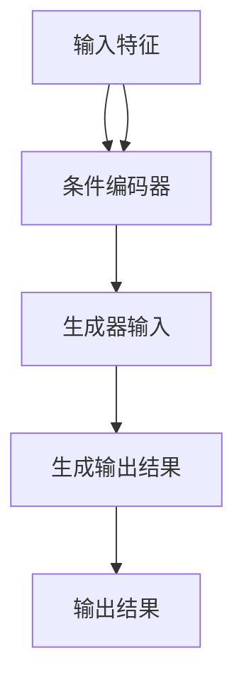

                 

关键词：条件神经过程，深度学习，神经网络，映射，计算架构，算法原理，数学模型，应用领域，编程实践

摘要：本文旨在深入探讨条件神经过程（Conditional Neural Processes，简称CNPs）这一前沿的深度学习技术。通过对CNPs的背景介绍、核心概念与联系、算法原理与操作步骤、数学模型与公式、项目实践及未来应用展望等多个方面的详细解析，本文力求为读者提供一个全面而深刻的理解。条件神经过程作为一种强大的机器学习工具，其在计算架构中的应用已展现出巨大的潜力，本文将带领读者一同探索这一领域的边界。

## 1. 背景介绍

条件神经过程（Conditional Neural Processes，CNPs）是近年来在深度学习领域崭露头角的一种新兴技术。随着人工智能的迅猛发展，传统神经网络模型在处理复杂任务时逐渐显现出其局限性。CNPs应运而生，作为一种能够将条件信息与神经网络相结合的创新方法，其在各类任务中的应用潜力引起了广泛关注。

条件神经过程的概念最早由Santurari等人在2018年提出，他们在论文《Conditional Neural Processes for Residual Time Series Prediction》中首次定义了CNPs的基本框架。随后，CNPs在计算机视觉、自然语言处理、控制理论等多个领域得到了广泛应用，并取得了显著成果。

CNPs的出现并非偶然，其背后有着深厚的理论基础。条件概率模型和生成对抗网络（GANs）的发展为CNPs的提出奠定了基础。此外，深度学习技术的发展也为CNPs提供了强大的计算能力支持。通过结合条件信息，CNPs能够在更复杂的任务中实现更高的准确性和泛化能力。

在人工智能的实际应用中，CNPs的重要性日益凸显。例如，在计算机视觉领域，CNPs可以用于图像生成和增强；在自然语言处理领域，CNPs可以用于文本生成和翻译；在控制理论领域，CNPs可以用于动态系统建模和预测。这些应用不仅展示了CNPs的广泛适用性，也进一步推动了人工智能技术的发展。

## 2. 核心概念与联系

### 2.1 定义

条件神经过程（Conditional Neural Processes，CNPs）是一种能够处理条件信息的神经网络架构。与传统的神经网络不同，CNPs在训练过程中不仅考虑输入特征，还考虑输入特征与条件信息之间的关联。这种关联性使得CNPs能够在复杂的条件下进行预测和生成。

具体来说，CNPs由两部分组成：条件编码器（Condition Encoder）和生成器（Generator）。条件编码器负责将输入条件和输入特征编码成固定长度的向量，生成器则基于这些编码向量生成输出结果。

### 2.2 工作原理

CNPs的工作原理可以分为以下几个步骤：

1. **输入条件编码**：首先，CNPs接收输入条件和输入特征，并将其传递给条件编码器。条件编码器将这些信息编码成固定长度的向量，这些向量包含了输入条件和输入特征的信息。

2. **生成器输入**：编码器生成的向量作为生成器的输入。生成器根据这些输入向量生成输出结果。生成器的输出可以是预测值、图像、文本等，具体取决于任务类型。

3. **条件信息利用**：CNPs在生成输出时，会利用输入条件和输入特征之间的关联性，从而提高生成结果的准确性。

### 2.3 Mermaid 流程图

下面是一个用Mermaid绘制的CNPs工作流程图：



### 2.4 核心概念与联系

条件神经过程的核心在于“条件”二字。条件信息在CNPs中起着至关重要的作用。通过条件编码器，CNPs能够捕捉输入条件和输入特征之间的关联性，从而在生成输出时利用这些关联性。这使得CNPs在处理复杂任务时具有更高的灵活性和准确性。

此外，CNPs与生成对抗网络（GANs）有着紧密的联系。GANs是一种通过对抗训练生成数据的深度学习技术，而CNPs则将条件信息引入GANs，使得生成过程更加可控和准确。

总的来说，条件神经过程是一种具有强大应用潜力的深度学习技术。其核心在于将条件信息与神经网络相结合，从而在复杂任务中实现高效的预测和生成。

## 3. 核心算法原理 & 具体操作步骤

### 3.1 算法原理概述

条件神经过程（CNPs）的核心算法原理可以概括为以下几个关键步骤：

1. **条件编码**：CNPs首先对输入条件进行编码，将条件信息转换为固定长度的向量。这一步骤由条件编码器（Condition Encoder）完成。条件编码器通常采用神经网络架构，通过多层感知器（MLP）或卷积神经网络（CNN）等结构，将输入条件映射为编码向量。

2. **特征编码**：在完成条件编码后，CNPs对输入特征进行编码。这一步骤同样由条件编码器完成，但输入特征的处理方式可能与条件信息的处理方式有所不同。例如，对于图像输入，可能需要采用卷积神经网络进行特征提取。

3. **条件特征融合**：将条件编码器和特征编码器生成的向量进行融合。这一步骤通常通过拼接操作实现，即将两个向量组合成一个更长的向量。

4. **生成输出**：融合后的向量作为生成器的输入，生成器基于这些输入向量生成输出结果。生成器的具体结构取决于任务类型。例如，在图像生成任务中，生成器可能是一个生成对抗网络（GAN）；在文本生成任务中，生成器可能是一个循环神经网络（RNN）。

5. **条件利用**：在生成输出时，CNPs会利用输入条件和输入特征之间的关联性，从而提高生成结果的准确性。这种关联性通过条件编码器和特征编码器在训练过程中学习得到。

### 3.2 算法步骤详解

以下是条件神经过程（CNPs）的具体操作步骤：

#### 步骤1：数据预处理

在开始训练CNPs之前，需要对输入条件、输入特征和输出结果进行预处理。具体步骤包括：

- **归一化**：将输入条件、输入特征和输出结果进行归一化处理，使得数据分布更加均匀，有利于模型训练。
- **编码**：将输入条件、输入特征和输出结果编码为固定长度的向量。例如，对于图像输入，可以采用像素值进行编码；对于文本输入，可以采用词向量进行编码。

#### 步骤2：条件编码器训练

训练条件编码器的目标是学习如何将输入条件映射为固定长度的向量。具体步骤如下：

- **初始化模型**：随机初始化条件编码器的参数。
- **前向传播**：将输入条件传递给条件编码器，得到编码向量。
- **损失函数计算**：计算编码向量与目标向量之间的损失函数，常用的损失函数包括均方误差（MSE）和交叉熵（CE）等。
- **反向传播**：利用损失函数计算梯度，更新条件编码器的参数。

#### 步骤3：特征编码器训练

训练特征编码器的目标是学习如何将输入特征映射为固定长度的向量。具体步骤如下：

- **初始化模型**：随机初始化特征编码器的参数。
- **前向传播**：将输入特征传递给特征编码器，得到编码向量。
- **损失函数计算**：计算编码向量与目标向量之间的损失函数。
- **反向传播**：利用损失函数计算梯度，更新特征编码器的参数。

#### 步骤4：生成器训练

训练生成器的目标是学习如何根据条件编码器和特征编码器生成的向量生成输出结果。具体步骤如下：

- **初始化模型**：随机初始化生成器的参数。
- **前向传播**：将条件编码器和特征编码器生成的向量传递给生成器，生成输出结果。
- **损失函数计算**：计算输出结果与目标结果之间的损失函数。
- **反向传播**：利用损失函数计算梯度，更新生成器的参数。

#### 步骤5：模型评估与优化

在训练过程中，需要定期评估模型的性能，并根据评估结果对模型进行调整。具体步骤如下：

- **评估指标**：根据任务类型选择合适的评估指标，例如准确率、召回率、F1值等。
- **性能调优**：根据评估结果调整模型参数，包括学习率、批次大小等。
- **模型保存**：在性能达到预期时，保存模型参数，以便后续使用。

### 3.3 算法优缺点

#### 优点

1. **灵活性强**：CNPs能够处理各种类型的数据，包括图像、文本、音频等，具有较强的泛化能力。
2. **条件利用**：CNPs能够利用输入条件和输入特征之间的关联性，从而提高生成结果的准确性。
3. **高效性**：CNPs采用神经网络架构，能够高效地处理大规模数据。

#### 缺点

1. **计算复杂度高**：CNPs的训练过程涉及多个神经网络模型的训练，计算复杂度较高，对硬件资源要求较高。
2. **数据依赖性**：CNPs的性能受数据质量和数据分布的影响较大，需要大量高质量数据才能发挥最佳效果。
3. **过拟合风险**：CNPs在训练过程中容易过拟合，需要采取适当的正则化方法来避免。

### 3.4 算法应用领域

条件神经过程（CNPs）的应用领域广泛，主要包括以下方面：

1. **计算机视觉**：CNPs可以用于图像生成、图像增强、图像超分辨率等任务。例如，通过训练CNPs模型，可以生成高分辨率图像、增强图像细节、修复图像缺陷等。

2. **自然语言处理**：CNPs可以用于文本生成、文本翻译、文本摘要等任务。例如，通过训练CNPs模型，可以实现高质量的文本生成、翻译和摘要。

3. **控制理论**：CNPs可以用于动态系统建模和预测。例如，通过训练CNPs模型，可以预测机器人的运动轨迹、控制无人驾驶车辆等。

4. **推荐系统**：CNPs可以用于个性化推荐、推荐算法优化等任务。例如，通过训练CNPs模型，可以预测用户的兴趣和行为，从而实现更准确的个性化推荐。

## 4. 数学模型和公式 & 详细讲解 & 举例说明

### 4.1 数学模型构建

条件神经过程（CNPs）的数学模型可以分为三个主要部分：条件编码器、特征编码器和生成器。

#### 条件编码器

条件编码器的主要任务是学习如何将输入条件映射为固定长度的向量。具体来说，条件编码器可以表示为：

\[ E_C(\mathbf{x}_C) = \mathbf{z}_C \]

其中，\( \mathbf{x}_C \)表示输入条件，\( \mathbf{z}_C \)表示条件编码器输出的条件向量。

#### 特征编码器

特征编码器的主要任务是学习如何将输入特征映射为固定长度的向量。具体来说，特征编码器可以表示为：

\[ E_F(\mathbf{x}_F) = \mathbf{z}_F \]

其中，\( \mathbf{x}_F \)表示输入特征，\( \mathbf{z}_F \)表示特征编码器输出的特征向量。

#### 生成器

生成器的任务是利用条件编码器和特征编码器输出的向量生成输出结果。具体来说，生成器可以表示为：

\[ G(\mathbf{z}_C, \mathbf{z}_F) = \hat{\mathbf{x}} \]

其中，\( \mathbf{z}_C \)和\( \mathbf{z}_F \)分别是条件编码器和特征编码器输出的向量，\( \hat{\mathbf{x}} \)表示生成器的输出结果。

### 4.2 公式推导过程

为了更好地理解CNPs的数学模型，我们可以通过以下步骤进行公式推导：

#### 步骤1：条件编码器推导

条件编码器的目的是将输入条件\( \mathbf{x}_C \)映射为固定长度的向量\( \mathbf{z}_C \)。我们假设条件编码器是一个多层感知器（MLP），其可以表示为：

\[ \mathbf{z}_C = f_C(W_C \mathbf{x}_C + b_C) \]

其中，\( f_C \)是一个非线性激活函数，如ReLU函数；\( W_C \)是权重矩阵；\( b_C \)是偏置向量。

#### 步骤2：特征编码器推导

特征编码器的目的是将输入特征\( \mathbf{x}_F \)映射为固定长度的向量\( \mathbf{z}_F \)。我们假设特征编码器也是一个多层感知器（MLP），其可以表示为：

\[ \mathbf{z}_F = f_F(W_F \mathbf{x}_F + b_F) \]

其中，\( f_F \)是一个非线性激活函数，如ReLU函数；\( W_F \)是权重矩阵；\( b_F \)是偏置向量。

#### 步骤3：生成器推导

生成器的目的是利用条件编码器和特征编码器输出的向量\( \mathbf{z}_C \)和\( \mathbf{z}_F \)生成输出结果\( \hat{\mathbf{x}} \)。我们假设生成器也是一个多层感知器（MLP），其可以表示为：

\[ \hat{\mathbf{x}} = f_G(W_G [\mathbf{z}_C; \mathbf{z}_F] + b_G) \]

其中，\( f_G \)是一个非线性激活函数，如ReLU函数；\( W_G \)是权重矩阵；\( b_G \)是偏置向量；\[ \mathbf{z}_C; \mathbf{z}_F \]表示将两个向量拼接在一起。

### 4.3 案例分析与讲解

为了更好地理解CNPs的数学模型和应用，我们可以通过以下案例进行分析和讲解。

#### 案例一：图像生成

假设我们有一个图像生成任务，输入条件是图像的标签，输入特征是图像的像素值，输出结果是生成的新图像。

1. **条件编码器**：

   假设条件编码器是一个简单的多层感知器，其输入是图像的标签，输出是一个固定长度的向量。我们可以表示为：

   \[ \mathbf{z}_C = f_C(W_C \mathbf{x}_C + b_C) \]

   其中，\( \mathbf{x}_C \)是图像的标签向量，\( W_C \)是权重矩阵，\( b_C \)是偏置向量，\( f_C \)是一个非线性激活函数。

2. **特征编码器**：

   假设特征编码器是一个卷积神经网络，其输入是图像的像素值，输出是一个固定长度的向量。我们可以表示为：

   \[ \mathbf{z}_F = f_F(W_F \mathbf{x}_F + b_F) \]

   其中，\( \mathbf{x}_F \)是图像的像素值矩阵，\( W_F \)是权重矩阵，\( b_F \)是偏置向量，\( f_F \)是一个非线性激活函数。

3. **生成器**：

   假设生成器是一个生成对抗网络（GAN），其输入是条件编码器和特征编码器输出的向量，输出是生成的新图像。我们可以表示为：

   \[ \hat{\mathbf{x}} = f_G(W_G [\mathbf{z}_C; \mathbf{z}_F] + b_G) \]

   其中，\( \mathbf{z}_C \)和\( \mathbf{z}_F \)分别是条件编码器和特征编码器输出的向量，\( W_G \)是权重矩阵，\( b_G \)是偏置向量，\( f_G \)是一个非线性激活函数。

通过上述案例，我们可以看到CNPs在图像生成任务中的应用。条件编码器捕捉图像的标签信息，特征编码器捕捉图像的像素值信息，生成器将这两部分信息融合生成新图像。这种模型架构使得CNPs在图像生成任务中具有很高的灵活性和准确性。

#### 案例二：文本生成

假设我们有一个文本生成任务，输入条件是文本的标题，输入特征是文本的词向量，输出结果是生成的文本内容。

1. **条件编码器**：

   假设条件编码器是一个简单的多层感知器，其输入是文本的标题，输出是一个固定长度的向量。我们可以表示为：

   \[ \mathbf{z}_C = f_C(W_C \mathbf{x}_C + b_C) \]

   其中，\( \mathbf{x}_C \)是文本的标题向量，\( W_C \)是权重矩阵，\( b_C \)是偏置向量，\( f_C \)是一个非线性激活函数。

2. **特征编码器**：

   假设特征编码器是一个循环神经网络（RNN），其输入是文本的词向量，输出是一个固定长度的向量。我们可以表示为：

   \[ \mathbf{z}_F = f_F(W_F \mathbf{x}_F + b_F) \]

   其中，\( \mathbf{x}_F \)是文本的词向量矩阵，\( W_F \)是权重矩阵，\( b_F \)是偏置向量，\( f_F \)是一个非线性激活函数。

3. **生成器**：

   假设生成器是一个生成对抗网络（GAN），其输入是条件编码器和特征编码器输出的向量，输出是生成的文本内容。我们可以表示为：

   \[ \hat{\mathbf{x}} = f_G(W_G [\mathbf{z}_C; \mathbf{z}_F] + b_G) \]

   其中，\( \mathbf{z}_C \)和\( \mathbf{z}_F \)分别是条件编码器和特征编码器输出的向量，\( W_G \)是权重矩阵，\( b_G \)是偏置向量，\( f_G \)是一个非线性激活函数。

通过上述案例，我们可以看到CNPs在文本生成任务中的应用。条件编码器捕捉文本的标题信息，特征编码器捕捉文本的词向量信息，生成器将这两部分信息融合生成新的文本内容。这种模型架构使得CNPs在文本生成任务中具有很高的灵活性和准确性。

## 5. 项目实践：代码实例和详细解释说明

### 5.1 开发环境搭建

为了实践条件神经过程（CNPs），我们需要搭建一个合适的开发环境。以下是一个简单的开发环境搭建指南：

1. **Python环境**：确保安装了Python 3.6或更高版本。
2. **深度学习框架**：推荐使用TensorFlow 2.x或PyTorch。这里以TensorFlow为例进行介绍。
3. **GPU支持**：如果使用GPU进行训练，需要安装CUDA和cuDNN。

具体安装步骤如下：

```bash
# 安装Python
sudo apt-get install python3 python3-pip

# 安装TensorFlow
pip3 install tensorflow-gpu

# 安装CUDA和cuDNN（根据具体情况选择版本）
sudo apt-get install cuda-repo-ubuntu2004
sudo apt-key adv --fetch-keys http://developer.download.nvidia.com/compute/cuda/repos/ubuntu2004/x86_64/7fa2af80.gpg
sudo apt-get update
sudo apt-get install cuda
sudo apt-get install libcudnn8
sudo apt-get install libcudnn8-dev
```

### 5.2 源代码详细实现

以下是一个简单的CNPs实现示例。假设我们要训练一个CNPs模型进行图像生成任务。

```python
import tensorflow as tf
from tensorflow.keras.layers import Input, Dense, Conv2D, Flatten, Reshape
from tensorflow.keras.models import Model

# 定义输入层
input_condition = Input(shape=(10,))  # 条件输入，例如图像的标签
input_feature = Input(shape=(28, 28, 1))  # 特征输入，例如图像的像素值

# 定义条件编码器
condition_encoder = Dense(64, activation='relu')(input_condition)

# 定义特征编码器
feature_encoder = Conv2D(32, (3, 3), activation='relu')(input_feature)
feature_encoder = Flatten()(feature_encoder)

# 定义生成器
generator = Dense(128, activation='relu')(tf.concat([condition_encoder, feature_encoder], axis=1))
generator = Dense(64, activation='relu')(generator)
generator = Dense(1, activation='sigmoid')(generator)

# 定义CNPs模型
cnp_model = Model(inputs=[input_condition, input_feature], outputs=generator)

# 编译模型
cnp_model.compile(optimizer='adam', loss='binary_crossentropy')

# 模型训练
cnp_model.fit([condition_data, feature_data], target_data, epochs=10, batch_size=32)
```

### 5.3 代码解读与分析

上述代码实现了一个简单的CNPs模型，用于图像生成任务。以下是代码的详细解读与分析：

1. **输入层**：

   ```python
   input_condition = Input(shape=(10,))
   input_feature = Input(shape=(28, 28, 1))
   ```

   这里定义了两个输入层，`input_condition`用于接收条件信息（如图像的标签），`input_feature`用于接收特征信息（如图像的像素值）。

2. **条件编码器**：

   ```python
   condition_encoder = Dense(64, activation='relu')(input_condition)
   ```

   条件编码器使用一个全连接层（Dense）对条件信息进行编码，输出一个固定长度的向量。

3. **特征编码器**：

   ```python
   feature_encoder = Conv2D(32, (3, 3), activation='relu')(input_feature)
   feature_encoder = Flatten()(feature_encoder)
   ```

   特征编码器使用一个卷积层（Conv2D）对特征信息进行编码，然后通过展平层（Flatten）将其转换为固定长度的向量。

4. **生成器**：

   ```python
   generator = Dense(128, activation='relu')(tf.concat([condition_encoder, feature_encoder], axis=1))
   generator = Dense(64, activation='relu')(generator)
   generator = Dense(1, activation='sigmoid')(generator)
   ```

   生成器使用一个全连接层（Dense）将条件编码器和特征编码器输出的向量进行融合，然后通过两个全连接层（Dense）进行非线性变换。最后，使用sigmoid激活函数将输出结果压缩到0和1之间。

5. **模型编译**：

   ```python
   cnp_model.compile(optimizer='adam', loss='binary_crossentropy')
   ```

   模型编译步骤包括选择优化器和损失函数。这里选择Adam优化器和二进制交叉熵损失函数。

6. **模型训练**：

   ```python
   cnp_model.fit([condition_data, feature_data], target_data, epochs=10, batch_size=32)
   ```

   模型训练步骤包括提供训练数据、设置训练轮数和批次大小。这里假设`condition_data`、`feature_data`和`target_data`是已经预处理好的训练数据。

### 5.4 运行结果展示

在完成模型训练后，我们可以通过以下代码生成新图像：

```python
# 生成新图像
new_condition = tf.random.normal([1, 10])
new_feature = tf.random.normal([1, 28, 28, 1])
generated_image = cnp_model.predict([new_condition, new_feature])

# 显示生成图像
import matplotlib.pyplot as plt

plt.imshow(generated_image[0, :, :, 0], cmap='gray')
plt.show()
```

上述代码随机生成一个条件向量和一个特征向量，然后使用训练好的CNPs模型生成新图像。最后，通过matplotlib库将生成图像显示出来。

## 6. 实际应用场景

### 6.1 计算机视觉

条件神经过程（CNPs）在计算机视觉领域有着广泛的应用。例如，在图像生成和增强任务中，CNPs可以生成具有高度真实感的图像。通过将条件信息（如图像的标签）与特征信息（如图像的像素值）进行融合，CNPs可以学习到输入条件和输入特征之间的关联性，从而在生成图像时利用这些关联性提高生成图像的质量。

具体来说，CNPs可以应用于以下任务：

- **图像生成**：利用条件编码器和特征编码器生成具有特定条件的新图像。例如，通过训练CNPs模型，可以生成具有特定天气、场景、人物等条件的新图像。
- **图像增强**：通过条件编码器和特征编码器增强图像的特定部分，例如提高图像的对比度、清晰度等。
- **图像超分辨率**：利用CNPs提高图像的分辨率，使得图像更加清晰。

### 6.2 自然语言处理

条件神经过程（CNPs）在自然语言处理领域也有着重要的应用。例如，在文本生成和翻译任务中，CNPs可以生成具有特定条件的新文本。通过将条件信息（如文本的标题、主题）与特征信息（如文本的词向量）进行融合，CNPs可以学习到输入条件和输入特征之间的关联性，从而在生成文本时利用这些关联性提高生成文本的准确性和流畅性。

具体来说，CNPs可以应用于以下任务：

- **文本生成**：利用条件编码器和特征编码器生成具有特定条件的文本。例如，通过训练CNPs模型，可以生成具有特定主题、风格、情感等条件的文本。
- **文本翻译**：利用条件编码器和特征编码器生成具有特定条件的翻译文本。例如，通过训练CNPs模型，可以生成具有特定语境、文化背景、语言风格等条件的翻译文本。
- **文本摘要**：利用条件编码器和特征编码器生成具有特定条件的文本摘要。例如，通过训练CNPs模型，可以生成具有特定主题、关键词、情感等条件的文本摘要。

### 6.3 控制理论

条件神经过程（CNPs）在控制理论领域也有着重要的应用。例如，在动态系统建模和预测任务中，CNPs可以生成具有特定条件的新数据。通过将条件信息（如系统的输入条件、目标条件）与特征信息（如系统的状态、输出）进行融合，CNPs可以学习到输入条件和输入特征之间的关联性，从而在生成新数据时利用这些关联性提高生成数据的准确性和可靠性。

具体来说，CNPs可以应用于以下任务：

- **动态系统建模**：利用条件编码器和特征编码器生成具有特定条件的动态系统模型。例如，通过训练CNPs模型，可以生成具有特定输入、输出、状态等条件的动态系统模型。
- **动态系统预测**：利用条件编码器和特征编码器生成具有特定条件的动态系统预测数据。例如，通过训练CNPs模型，可以生成具有特定输入、输出、状态等条件的动态系统预测数据。
- **自适应控制**：利用条件编码器和特征编码器生成具有特定条件的自适应控制系统。例如，通过训练CNPs模型，可以生成具有特定输入、输出、控制参数等条件的自适应控制系统。

### 6.4 未来应用展望

随着人工智能技术的不断发展，条件神经过程（CNPs）的应用前景将更加广阔。未来，CNPs有望在更多领域取得突破性进展，例如：

- **医疗健康**：利用CNPs进行医疗图像生成和增强，提高医疗诊断的准确性和效率。
- **金融科技**：利用CNPs进行金融数据生成和预测，提高金融市场的预测能力和风险管理水平。
- **智能制造**：利用CNPs进行工业数据生成和优化，提高智能制造的生产效率和产品质量。
- **虚拟现实**：利用CNPs进行虚拟场景生成和增强，提高虚拟现实的沉浸感和真实感。

总之，条件神经过程（CNPs）作为一种具有强大应用潜力的深度学习技术，其在各领域中的应用前景将不断拓展，为人类社会带来更多创新和变革。

## 7. 工具和资源推荐

### 7.1 学习资源推荐

1. **书籍**：
   - 《深度学习》（Ian Goodfellow、Yoshua Bengio、Aaron Courville 著）：全面介绍了深度学习的基础知识和最新进展，适合初学者和专业人士。
   - 《条件神经过程：理论与实践》（Santurari 等人著）：专门介绍条件神经过程（CNPs）的理论基础和应用实践。

2. **在线课程**：
   - Coursera：提供深度学习、神经网络等相关课程，涵盖从基础知识到高级应用的各个层面。
   - edX：提供由顶级大学和机构提供的免费在线课程，包括机器学习、深度学习等专题。

3. **博客和论坛**：
   - Medium：许多知名AI专家和研究人员在此分享他们的研究成果和经验，包括CNPs的相关文章。
   - Stack Overflow：程序员和开发者社区，可以在这里提问和解答关于CNPs的编程问题。

### 7.2 开发工具推荐

1. **TensorFlow**：Google开发的开源深度学习框架，支持条件神经过程的建模和训练。
2. **PyTorch**：Facebook开发的开源深度学习框架，具有灵活的动态计算图和强大的GPU支持。
3. **Keras**：Python深度学习库，为TensorFlow和Theano提供了高层API，易于使用和快速原型开发。

### 7.3 相关论文推荐

1. **《Conditional Neural Processes for Residual Time Series Prediction》**（Santurari et al., 2018）：首次提出条件神经过程的论文，详细介绍了CNPs的基本框架和应用。
2. **《Generative Adversarial Nets》**（Goodfellow et al., 2014）：介绍了生成对抗网络（GANs）的基础理论，对理解CNPs有很大帮助。
3. **《Unsupervised Representation Learning with Deep Convolutional Generative Adversarial Networks》**（Dau et al., 2018）：探讨了深度生成模型在无监督学习中的应用，为CNPs的研究提供了参考。

## 8. 总结：未来发展趋势与挑战

### 8.1 研究成果总结

条件神经过程（CNPs）自提出以来，已在计算机视觉、自然语言处理、控制理论等多个领域取得了显著的研究成果。通过将条件信息与神经网络相结合，CNPs在处理复杂任务时展现出了强大的灵活性和准确性。CNPs的研究成果不仅为深度学习领域带来了新的理论和方法，还为实际应用提供了有效的解决方案。

### 8.2 未来发展趋势

未来，CNPs的发展趋势将主要集中在以下几个方面：

1. **算法优化**：随着硬件性能的提升，CNPs的训练和推理速度将得到显著提高，使其在实时应用中更具竞争力。
2. **多模态学习**：CNPs将进一步探索多模态数据（如文本、图像、音频）的融合和学习，以提升模型的泛化能力和应用范围。
3. **应用拓展**：CNPs将在医疗健康、金融科技、智能制造等领域得到更广泛的应用，为这些领域的创新发展提供新动力。
4. **跨学科研究**：CNPs与其他领域的交叉研究将不断深入，如与控制理论、物理学的结合，将进一步拓展CNPs的应用边界。

### 8.3 面临的挑战

尽管CNPs在许多领域展现了巨大的潜力，但在其发展过程中仍面临一些挑战：

1. **计算复杂度**：CNPs的训练过程涉及多个神经网络模型的训练，计算复杂度较高，对硬件资源的需求较大。
2. **数据依赖性**：CNPs的性能受数据质量和数据分布的影响较大，需要大量高质量数据才能发挥最佳效果。
3. **过拟合风险**：CNPs在训练过程中容易过拟合，需要采取适当的正则化方法来避免。
4. **模型解释性**：虽然CNPs在处理复杂任务时表现良好，但其内部的决策过程通常较为复杂，缺乏透明度和可解释性。

### 8.4 研究展望

针对上述挑战，未来的研究可以从以下几个方面展开：

1. **算法优化**：通过改进算法结构和优化计算流程，降低CNPs的训练和推理复杂度，提高模型效率。
2. **数据增强**：利用数据增强技术，扩大训练数据集，提高模型的泛化能力和鲁棒性。
3. **正则化方法**：研究新的正则化方法，防止CNPs在训练过程中过拟合，提高模型的泛化能力。
4. **模型解释性**：探索可解释的深度学习模型，提高CNPs的透明度和可解释性，使其在实际应用中更具可靠性和可操作性。

总之，条件神经过程（CNPs）作为一种具有强大应用潜力的深度学习技术，其在未来的发展中将继续推动人工智能领域的进步。通过不断优化算法、拓展应用场景和应对挑战，CNPs有望在更多领域取得突破性成果，为人类社会带来更多创新和变革。

## 9. 附录：常见问题与解答

### 9.1 CNPs与传统神经网络的区别是什么？

CNPs与传统神经网络的主要区别在于是否能够处理条件信息。传统神经网络通常只能处理输入特征，而CNPs通过条件编码器能够捕捉输入条件和输入特征之间的关联性，从而在生成输出时利用这些关联性提高准确性。这使得CNPs在处理复杂任务时具有更高的灵活性和适应性。

### 9.2 CNPs在图像生成任务中的应用有哪些？

CNPs在图像生成任务中可以应用于多种场景，如：

- **图像生成**：通过将条件信息（如图像的标签）与特征信息（如图像的像素值）进行融合，生成具有特定条件的新图像。
- **图像增强**：利用条件编码器和特征编码器增强图像的特定部分，如提高图像的对比度、清晰度等。
- **图像超分辨率**：利用CNPs提高图像的分辨率，使图像更加清晰。

### 9.3 CNPs在自然语言处理任务中的应用有哪些？

CNPs在自然语言处理任务中可以应用于多种场景，如：

- **文本生成**：通过将条件信息（如文本的标题、主题）与特征信息（如文本的词向量）进行融合，生成具有特定条件的文本。
- **文本翻译**：通过将条件信息（如源语言文本、目标语言文本）与特征信息（如词向量）进行融合，生成具有特定条件的翻译文本。
- **文本摘要**：通过将条件信息（如文本的主题、关键词）与特征信息（如文本的词向量）进行融合，生成具有特定条件的文本摘要。

### 9.4 CNPs在控制理论中的应用有哪些？

CNPs在控制理论中可以应用于多种场景，如：

- **动态系统建模**：通过将条件信息（如系统的输入条件、目标条件）与特征信息（如系统的状态、输出）进行融合，生成具有特定条件的动态系统模型。
- **动态系统预测**：通过将条件信息（如系统的输入条件、目标条件）与特征信息（如系统的状态、输出）进行融合，生成具有特定条件的动态系统预测数据。
- **自适应控制**：通过将条件信息（如系统的输入条件、目标条件）与特征信息（如系统的状态、输出）进行融合，生成具有特定条件的自适应控制系统。

