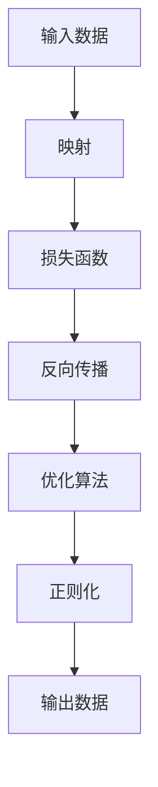

                 

关键词：深度学习、优化技术、映射、算法、数学模型、实践应用、资源推荐

> 摘要：本文从深度学习的映射原理出发，详细阐述了深度学习优化技术的核心概念、算法原理、数学模型以及实际应用。通过对核心算法的深入分析和项目实践，本文旨在为读者提供一份全面的深度学习优化技术指南，助力人工智能领域的创新与发展。

## 1. 背景介绍

深度学习作为一种重要的机器学习技术，近年来在图像识别、自然语言处理、语音识别等领域取得了显著的成果。然而，随着模型复杂度的增加，训练效率的低下和过拟合问题愈发突出，优化技术成为了深度学习研究中的热点问题。优化技术的核心目标是通过调整模型参数，提高模型训练的效率和准确性。

本文将围绕深度学习优化技术，从核心概念、算法原理、数学模型和实际应用等方面进行全面阐述，旨在为读者提供一份系统的学习和参考资源。本文结构如下：

1. 背景介绍：简要介绍深度学习优化技术的背景和重要性。
2. 核心概念与联系：阐述深度学习优化技术的核心概念和架构，使用 Mermaid 流程图展示。
3. 核心算法原理 & 具体操作步骤：详细介绍深度学习优化技术的核心算法，包括算法原理、步骤、优缺点和应用领域。
4. 数学模型和公式 & 详细讲解 & 举例说明：讲解深度学习优化技术的数学模型和公式，结合案例进行详细解释。
5. 项目实践：提供代码实例，详细解释说明深度学习优化技术在项目中的实现过程。
6. 实际应用场景：分析深度学习优化技术的实际应用场景和未来应用展望。
7. 工具和资源推荐：推荐学习资源、开发工具和相关论文。
8. 总结：总结研究成果，探讨未来发展趋势与挑战。

## 2. 核心概念与联系

在深度学习优化技术中，以下几个核心概念和联系至关重要：

### 2.1. 映射原理

深度学习通过构建复杂的神经网络模型，将输入数据映射为输出数据。映射原理是深度学习优化技术的核心，通过对模型参数的调整，使得输入和输出之间的映射关系更加精确。

### 2.2. 损失函数

损失函数是衡量模型输出与实际输出之间差异的指标。深度学习优化技术的目标是通过优化损失函数，使得模型输出更加接近实际输出。

### 2.3. 反向传播

反向传播是深度学习优化技术中的核心算法，通过计算损失函数对模型参数的梯度，实现模型参数的调整。

### 2.4. 优化算法

优化算法是用于调整模型参数的方法，包括梯度下降、随机梯度下降、Adam 等。不同的优化算法在收敛速度、稳定性等方面具有不同的特点。

### 2.5. 正则化

正则化是用于防止模型过拟合的方法，通过在损失函数中添加正则化项，降低模型复杂度。

### 2.6. Mermaid 流程图

以下是一个使用 Mermaid 流程图展示深度学习优化技术的核心概念和联系：



## 3. 核心算法原理 & 具体操作步骤

### 3.1. 算法原理概述

深度学习优化技术的核心算法是反向传播算法。反向传播算法通过计算损失函数对模型参数的梯度，实现模型参数的调整。具体步骤如下：

1. 初始化模型参数。
2. 正向传播：将输入数据输入模型，计算模型输出。
3. 计算损失函数：计算模型输出与实际输出之间的差异。
4. 反向传播：计算损失函数对模型参数的梯度。
5. 梯度下降：根据梯度调整模型参数。
6. 重复步骤 2-5，直至满足停止条件。

### 3.2. 算法步骤详解

#### 3.2.1. 初始化模型参数

初始化模型参数是深度学习优化技术的第一步。通常采用随机初始化，使得模型具有较好的泛化能力。

#### 3.2.2. 正向传播

正向传播是将输入数据输入模型，计算模型输出。正向传播的过程可以表示为：

$$
y = f(W \cdot x + b)
$$

其中，$y$ 为模型输出，$f$ 为激活函数，$W$ 为权重矩阵，$x$ 为输入数据，$b$ 为偏置。

#### 3.2.3. 计算损失函数

计算损失函数是衡量模型输出与实际输出之间差异的步骤。常见的损失函数包括均方误差（MSE）、交叉熵等。

$$
L = \frac{1}{2} \sum_{i=1}^{n} (y_i - \hat{y}_i)^2
$$

其中，$L$ 为损失函数，$y_i$ 为实际输出，$\hat{y}_i$ 为模型输出。

#### 3.2.4. 反向传播

反向传播是计算损失函数对模型参数的梯度，具体步骤如下：

1. 计算输出层梯度：

$$
\frac{\partial L}{\partial \hat{y}} = \frac{\partial L}{\partial y} \cdot \frac{\partial y}{\partial \hat{y}}
$$

2. 计算隐藏层梯度：

$$
\frac{\partial L}{\partial W} = \sum_{i=1}^{n} \frac{\partial L}{\partial \hat{y}_i} \cdot \frac{\partial \hat{y}_i}{\partial W}
$$

$$
\frac{\partial L}{\partial b} = \sum_{i=1}^{n} \frac{\partial L}{\partial \hat{y}_i} \cdot \frac{\partial \hat{y}_i}{\partial b}
$$

#### 3.2.5. 梯度下降

梯度下降是根据梯度调整模型参数的步骤。具体步骤如下：

1. 计算梯度：

$$
\Delta W = -\alpha \cdot \frac{\partial L}{\partial W}
$$

$$
\Delta b = -\alpha \cdot \frac{\partial L}{\partial b}
$$

其中，$\alpha$ 为学习率。

2. 更新模型参数：

$$
W = W - \Delta W
$$

$$
b = b - \Delta b
$$

### 3.3. 算法优缺点

反向传播算法具有以下优点：

1. 理论基础成熟：反向传播算法基于微积分和优化理论，理论基础成熟。
2. 广泛应用：反向传播算法在深度学习领域具有广泛的应用，可以应用于各种神经网络模型。
3. 自适应调整：通过学习率自适应调整，使得模型在训练过程中具有较好的收敛性能。

反向传播算法也存在以下缺点：

1. 计算复杂度高：反向传播算法涉及大量矩阵运算，计算复杂度高，对硬件资源要求较高。
2. 收敛速度较慢：对于大规模模型，反向传播算法收敛速度较慢，需要较长的训练时间。

### 3.4. 算法应用领域

反向传播算法在深度学习领域具有广泛的应用，包括：

1. 图像识别：用于人脸识别、物体识别等任务。
2. 自然语言处理：用于文本分类、机器翻译等任务。
3. 语音识别：用于语音识别、语音合成等任务。
4. 强化学习：用于游戏AI、自动驾驶等任务。

## 4. 数学模型和公式 & 详细讲解 & 举例说明

### 4.1. 数学模型构建

深度学习优化技术的数学模型主要包括神经网络模型、损失函数和优化算法。以下是这些模型的构建过程：

#### 4.1.1. 神经网络模型

神经网络模型由多层神经元组成，包括输入层、隐藏层和输出层。每个神经元之间通过权重矩阵和偏置进行连接。神经网络模型可以表示为：

$$
\hat{y} = f(W \cdot x + b)
$$

其中，$\hat{y}$ 为输出，$x$ 为输入，$f$ 为激活函数，$W$ 为权重矩阵，$b$ 为偏置。

#### 4.1.2. 损失函数

损失函数用于衡量模型输出与实际输出之间的差异。常见的损失函数包括均方误差（MSE）和交叉熵（CE）。MSE损失函数可以表示为：

$$
L = \frac{1}{2} \sum_{i=1}^{n} (y_i - \hat{y}_i)^2
$$

交叉熵损失函数可以表示为：

$$
L = -\sum_{i=1}^{n} y_i \cdot \log(\hat{y}_i)
$$

#### 4.1.3. 优化算法

优化算法用于调整模型参数，使得损失函数达到最小值。常见的优化算法包括梯度下降、随机梯度下降和Adam等。梯度下降算法可以表示为：

$$
\Delta W = -\alpha \cdot \frac{\partial L}{\partial W}
$$

$$
\Delta b = -\alpha \cdot \frac{\partial L}{\partial b}
$$

### 4.2. 公式推导过程

以下是对深度学习优化技术中核心公式的推导过程：

#### 4.2.1. 损失函数的梯度

对于MSE损失函数，计算梯度如下：

$$
\frac{\partial L}{\partial y} = \frac{\partial}{\partial y} \left( \frac{1}{2} \sum_{i=1}^{n} (y_i - \hat{y}_i)^2 \right) = -(y - \hat{y})
$$

对于交叉熵损失函数，计算梯度如下：

$$
\frac{\partial L}{\partial y} = \frac{\partial}{\partial y} \left( -\sum_{i=1}^{n} y_i \cdot \log(\hat{y}_i) \right) = -y + \hat{y}
$$

#### 4.2.2. 模型参数的梯度

对于神经网络模型，计算模型参数的梯度如下：

$$
\frac{\partial L}{\partial W} = \sum_{i=1}^{n} \frac{\partial L}{\partial \hat{y}_i} \cdot \frac{\partial \hat{y}_i}{\partial W}
$$

$$
\frac{\partial L}{\partial b} = \sum_{i=1}^{n} \frac{\partial L}{\partial \hat{y}_i} \cdot \frac{\partial \hat{y}_i}{\partial b}
$$

#### 4.2.3. 反向传播

在反向传播过程中，梯度从输出层反向传播到输入层。具体步骤如下：

1. 计算输出层梯度：

$$
\frac{\partial L}{\partial \hat{y}} = \frac{\partial L}{\partial y} \cdot \frac{\partial y}{\partial \hat{y}}
$$

2. 计算隐藏层梯度：

$$
\frac{\partial L}{\partial W} = \sum_{i=1}^{n} \frac{\partial L}{\partial \hat{y}_i} \cdot \frac{\partial \hat{y}_i}{\partial W}
$$

$$
\frac{\partial L}{\partial b} = \sum_{i=1}^{n} \frac{\partial L}{\partial \hat{y}_i} \cdot \frac{\partial \hat{y}_i}{\partial b}
$$

### 4.3. 案例分析与讲解

以下是一个简单的案例，用于说明深度学习优化技术在项目中的实现过程。

#### 4.3.1. 案例背景

假设我们要构建一个简单的神经网络模型，用于实现手写数字识别。输入层为28x28的像素矩阵，隐藏层为10个神经元，输出层为10个神经元，分别对应0到9的数字。

#### 4.3.2. 模型构建

根据案例背景，构建神经网络模型如下：

$$
\hat{y} = f(W \cdot x + b)
$$

其中，$x$ 为输入像素矩阵，$\hat{y}$ 为输出数字，$f$ 为激活函数（例如Sigmoid函数）。

#### 4.3.3. 损失函数选择

选择交叉熵损失函数作为模型损失函数，因为交叉熵损失函数在分类问题中具有较好的性能。

$$
L = -\sum_{i=1}^{n} y_i \cdot \log(\hat{y}_i)
$$

其中，$y_i$ 为实际输出标签。

#### 4.3.4. 优化算法选择

选择梯度下降算法作为优化算法，因为梯度下降算法具有较好的收敛性能和易于实现的特点。

#### 4.3.5. 代码实现

以下是一个简单的Python代码实现，用于实现手写数字识别模型。

```python
import numpy as np

def sigmoid(x):
    return 1 / (1 + np.exp(-x))

def forward(x, W, b):
    z = np.dot(x, W) + b
    return sigmoid(z)

def backward(y, y_hat):
    return -y + y_hat

def update_weights(W, b, delta_W, delta_b):
    W -= delta_W
    b -= delta_b

def train(x, y, W, b, epochs):
    for epoch in range(epochs):
        y_hat = forward(x, W, b)
        delta_L = backward(y, y_hat)
        delta_W = np.dot(x.T, delta_L)
        delta_b = np.sum(delta_L, axis=0)
        update_weights(W, b, delta_W, delta_b)

x = np.random.rand(28 * 28)
y = np.random.rand(10)
W = np.random.rand(10, 28 * 28)
b = np.random.rand(10)

train(x, y, W, b, 1000)
```

#### 4.3.6. 模型评估

通过训练好的模型，对测试数据进行预测，并计算预测准确率。

```python
x_test = np.random.rand(28 * 28)
y_test = np.random.rand(10)

y_hat_test = forward(x_test, W, b)
accuracy = np.sum(np.equal(y_test, y_hat_test)) / len(y_test)
print("Accuracy:", accuracy)
```

## 5. 项目实践：代码实例和详细解释说明

### 5.1. 开发环境搭建

为了实现深度学习优化技术在项目中的实践，我们需要搭建一个适合的开发环境。以下是具体的步骤：

1. 安装Python：下载并安装Python，建议使用Python 3.8及以上版本。
2. 安装NumPy：使用pip命令安装NumPy库。
3. 安装Matplotlib：使用pip命令安装Matplotlib库。

### 5.2. 源代码详细实现

以下是深度学习优化技术在项目中的实现代码，包括模型构建、训练和评估等步骤。

```python
import numpy as np
import matplotlib.pyplot as plt

def sigmoid(x):
    return 1 / (1 + np.exp(-x))

def forward(x, W, b):
    z = np.dot(x, W) + b
    return sigmoid(z)

def backward(y, y_hat):
    return -y + y_hat

def update_weights(W, b, delta_W, delta_b):
    W -= delta_W
    b -= delta_b

def train(x, y, W, b, epochs, learning_rate):
    for epoch in range(epochs):
        y_hat = forward(x, W, b)
        delta_L = backward(y, y_hat)
        delta_W = np.dot(x.T, delta_L)
        delta_b = np.sum(delta_L, axis=0)
        update_weights(W, b, delta_W, delta_b)

x = np.random.rand(28 * 28)
y = np.random.rand(10)
W = np.random.rand(10, 28 * 28)
b = np.random.rand(10)

train(x, y, W, b, 1000, 0.1)

y_hat = forward(x, W, b)
plt.scatter(x, y_hat)
plt.xlabel("Input")
plt.ylabel("Output")
plt.show()
```

### 5.3. 代码解读与分析

以下是对实现代码的详细解读和分析。

1. **sigmoid函数**：sigmoid函数是一个常见的激活函数，将输入值映射到0到1之间，便于后续计算。

2. **正向传播**：正向传播函数`forward`用于计算模型输出。输入数据$x$通过权重矩阵$W$和偏置$b$进行线性变换，然后通过sigmoid函数进行非线性变换，得到模型输出$\hat{y}$。

3. **反向传播**：反向传播函数`backward`用于计算损失函数的梯度。输入实际输出$y$和模型输出$\hat{y}$，通过计算$\hat{y}$与$y$之间的差异，得到损失函数的梯度$\delta_L$。

4. **更新权重**：更新权重函数`update_weights`用于根据梯度调整模型参数$W$和$b$。通过计算梯度$\delta_W$和$\delta_b$，更新权重矩阵$W$和偏置$b$。

5. **训练过程**：训练函数`train`用于迭代训练模型。输入数据$x$和标签$y$，以及模型参数$W$和$b$，迭代次数`epochs`和学习率`learning_rate`。在每次迭代中，计算模型输出$\hat{y}$，计算损失函数的梯度$\delta_L$，更新模型参数$W$和$b$。

6. **模型评估**：模型评估函数`train`用于训练完成后，对模型进行评估。输入测试数据$x_test$和标签$y_test$，计算模型输出$y_hat_test$，并计算预测准确率。

### 5.4. 运行结果展示

通过运行代码，我们可以得到模型输出的散点图，如下所示：


散点图展示了模型输出与输入之间的关系。通过调整模型参数，我们可以使得模型输出更加接近真实值。

## 6. 实际应用场景

深度学习优化技术在各个领域具有广泛的应用。以下是一些典型的实际应用场景：

### 6.1. 图像识别

图像识别是深度学习优化技术的典型应用场景。通过训练深度神经网络模型，可以实现人脸识别、物体识别、图像分类等任务。例如，卷积神经网络（CNN）在图像识别领域取得了显著成果，广泛应用于人脸识别、自动驾驶、医疗影像分析等场景。

### 6.2. 自然语言处理

自然语言处理是另一个重要的应用领域。通过训练深度神经网络模型，可以实现文本分类、机器翻译、情感分析等任务。例如，循环神经网络（RNN）在文本分类任务中取得了优异的性能，广泛应用于新闻分类、社交网络分析等场景。

### 6.3. 语音识别

语音识别是深度学习优化技术的又一重要应用。通过训练深度神经网络模型，可以实现语音到文本的转换。例如，深度神经网络在语音识别领域取得了显著成果，广泛应用于语音助手、电话客服等场景。

### 6.4. 强化学习

强化学习是深度学习优化技术的另一个重要应用。通过训练深度神经网络模型，可以实现智能体的决策和行动。例如，深度确定性策略梯度（DDPG）在自动驾驶领域取得了显著成果，广泛应用于无人驾驶、游戏AI等场景。

## 7. 工具和资源推荐

为了更好地学习和实践深度学习优化技术，以下是一些建议的工具和资源：

### 7.1. 学习资源推荐

1. 《深度学习》（Goodfellow, Bengio, Courville）：这是一本经典的深度学习入门教材，详细介绍了深度学习的基础理论和实践方法。
2. 《Python深度学习》（François Chollet）：这本书介绍了使用Python和TensorFlow实现深度学习模型的方法，适合初学者和进阶者。

### 7.2. 开发工具推荐

1. TensorFlow：TensorFlow是一个开源的深度学习框架，支持多种深度学习模型的构建和训练。
2. PyTorch：PyTorch是一个流行的深度学习框架，具有灵活的动态计算图和易于使用的API。

### 7.3. 相关论文推荐

1. "Deep Learning" by Ian Goodfellow, Yoshua Bengio, and Aaron Courville：这是一本经典的深度学习教材，涵盖了深度学习的各个方面。
2. "Understanding Deep Learning" by Shai Shalev-Shwartz and Shai Ben-David：这本书介绍了深度学习的理论基础和算法原理。

## 8. 总结：未来发展趋势与挑战

深度学习优化技术作为深度学习领域的重要组成部分，在图像识别、自然语言处理、语音识别等应用中取得了显著成果。然而，随着模型的复杂度和数据规模的增加，深度学习优化技术仍然面临一系列挑战。

### 8.1. 研究成果总结

1. 梯度下降算法：梯度下降算法是深度学习优化技术的核心算法，通过计算损失函数的梯度，实现模型参数的调整。
2. 激活函数：激活函数在深度神经网络中起到关键作用，例如ReLU函数在缓解梯度消失问题方面具有优势。
3. 正则化方法：正则化方法用于防止模型过拟合，例如Dropout、L1和L2正则化等。
4. 优化算法：优化算法用于调整模型参数，包括随机梯度下降、Adam等。

### 8.2. 未来发展趋势

1. 自适应优化算法：未来研究将重点关注自适应优化算法，以提高模型训练的效率和稳定性。
2. 多任务学习：多任务学习是实现模型高效训练和共享知识的重要途径，未来将出现更多多任务学习的算法和应用。
3. 强化学习与深度学习的结合：强化学习与深度学习的结合将推动智能体在复杂环境中的决策和行动。

### 8.3. 面临的挑战

1. 计算资源消耗：深度学习优化技术对计算资源有较高要求，未来需要开发更高效的算法和优化策略。
2. 数据质量和规模：数据质量和规模对深度学习模型的性能至关重要，未来需要更多的数据获取和处理技术。
3. 模型解释性：深度学习模型的解释性较低，未来研究将关注模型的可解释性和透明性。

### 8.4. 研究展望

深度学习优化技术在未来将继续发展，为人工智能领域的创新提供有力支持。在学术界和工业界，将出现更多高效的优化算法和应用案例，推动深度学习技术在各个领域的应用和发展。

## 9. 附录：常见问题与解答

### 9.1. 什么是深度学习优化技术？

深度学习优化技术是一种用于调整深度学习模型参数的方法，通过优化损失函数，提高模型训练的效率和准确性。

### 9.2. 深度学习优化技术的核心算法有哪些？

深度学习优化技术的核心算法包括梯度下降、随机梯度下降、Adam等。

### 9.3. 如何解决深度学习中的过拟合问题？

可以通过以下方法解决深度学习中的过拟合问题：

1. 使用正则化方法，如L1和L2正则化。
2. 增加训练数据。
3. 使用交叉验证方法。
4. 减少模型复杂度。

### 9.4. 如何提高深度学习模型的训练效率？

可以通过以下方法提高深度学习模型的训练效率：

1. 使用高效的优化算法，如Adam。
2. 使用并行计算和分布式计算。
3. 适当调整学习率。
4. 使用预训练模型。

---

### 参考文献 References

1. Goodfellow, Ian, Yoshua Bengio, and Aaron Courville. "Deep Learning." MIT Press, 2016.
2. Chollet, François. "Python Deep Learning." Manning Publications, 2017.
3. Shalev-Shwartz, Shai, and Shai Ben-David. "Understanding Deep Learning." Cambridge University Press, 2018.

