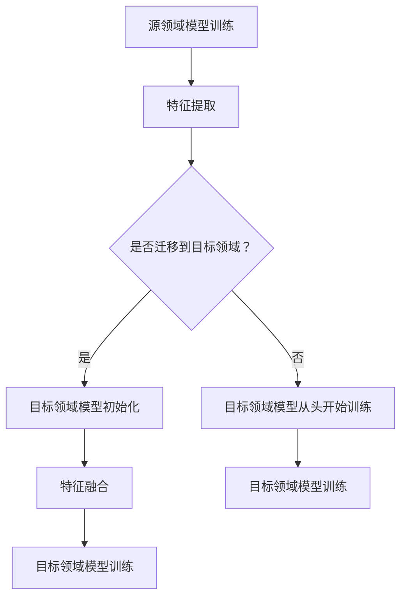

                 

关键词：深度学习、迁移学习、知识转移、领域适应、模型泛化、异构学习、多任务学习、多模态学习

摘要：本文深入探讨了深度迁移学习（Deep Transfer Learning）的概念、原理、算法以及其在实际应用中的重要性。迁移学习作为一种重要的机器学习方法，通过在不同领域间共享知识和模型，提高了模型的泛化能力和效率。本文将分析深度迁移学习的工作机制，详细阐述其核心算法，并通过实例展示其在实际项目中的应用。同时，本文还将探讨深度迁移学习在多任务学习、多模态学习等领域的应用前景，为未来的研究提供参考。

## 1. 背景介绍

随着人工智能技术的快速发展，深度学习（Deep Learning）在图像识别、语音识别、自然语言处理等领域取得了显著的成果。然而，深度学习模型的训练通常需要大量的数据和高计算资源，这在一定程度上限制了其应用范围。迁移学习（Transfer Learning）作为一种有效的解决方案，通过将一个任务在源领域（Source Domain）中学到的知识应用到另一个任务的目标领域（Target Domain）中，提高了模型训练的效率。

传统的迁移学习方法主要基于特征迁移，即将源领域的特征提取器直接应用到目标领域。然而，随着深度学习模型变得越来越复杂，单纯的特征迁移已经无法满足需求。深度迁移学习（Deep Transfer Learning）通过将源领域的深度神经网络结构迁移到目标领域，利用网络中的多层非线性变换来捕捉更深层次的特征，从而提高了模型的泛化能力和适应性。

深度迁移学习在计算机视觉、自然语言处理、推荐系统等领域具有广泛的应用前景。例如，在计算机视觉领域，深度迁移学习可以用于图像分类、目标检测、人脸识别等任务；在自然语言处理领域，可以用于情感分析、机器翻译、文本生成等任务；在推荐系统领域，可以用于个性化推荐、用户行为预测等任务。

本文将从深度迁移学习的概念、原理、算法、应用场景等方面进行详细介绍，旨在为读者提供对深度迁移学习的全面了解，并探讨其在未来人工智能研究中的潜在发展方向。

## 2. 核心概念与联系

### 2.1. 深度学习

深度学习（Deep Learning）是一种基于多层神经网络的学习方法，通过多层非线性变换来提取特征，从而实现复杂的模式识别和预测任务。深度学习模型通常包含多个隐藏层，每个隐藏层都能学习到不同层次的抽象特征。深度学习的核心优势在于其强大的表示能力，可以自动从数据中学习到有用的特征，从而提高模型的泛化能力和表现。

### 2.2. 迁移学习

迁移学习（Transfer Learning）是一种利用已有模型的知识来解决新任务的学习方法。在迁移学习中，源领域（Source Domain）的模型被训练成具有一定泛化能力，然后将这些已训练的模型应用到目标领域（Target Domain）的新任务中。迁移学习的核心思想是利用已有模型的知识，减少对新数据的训练量，从而提高模型的训练效率和性能。

### 2.3. 深度迁移学习

深度迁移学习（Deep Transfer Learning）是迁移学习的一种高级形式，通过将源领域的深度神经网络结构迁移到目标领域，利用网络中的多层非线性变换来捕捉更深层次的特征。深度迁移学习克服了传统迁移学习方法在处理复杂任务时的局限性，能够更好地适应不同的领域和应用场景。

### 2.4. Mermaid 流程图

为了更好地理解深度迁移学习的工作机制，下面使用Mermaid流程图展示其核心概念和流程。



在上述流程中，A表示源领域模型训练，B表示特征提取，C表示是否迁移到目标领域，D表示目标领域模型初始化，E表示特征融合，F表示目标领域模型训练，G表示目标领域模型从头开始训练，H表示目标领域模型训练。

## 3. 核心算法原理 & 具体操作步骤

### 3.1. 算法原理概述

深度迁移学习的核心算法包括特征迁移、模型迁移和知识蒸馏等。特征迁移是通过将源领域的特征提取器直接应用到目标领域，利用特征空间的相似性来提高目标领域的模型性能。模型迁移是将源领域的深度神经网络结构迁移到目标领域，利用网络中的多层非线性变换来捕捉更深层次的特征。知识蒸馏是将源领域模型的内部知识传递给目标领域模型，通过训练一个教师模型和学生模型来提高目标领域的模型性能。

### 3.2. 算法步骤详解

深度迁移学习的具体操作步骤如下：

1. **数据预处理**：对源领域和目标领域的数据进行预处理，包括数据清洗、数据增强、归一化等操作，以保证数据的一致性和质量。

2. **特征提取**：在源领域模型中提取特征，通常使用卷积神经网络（Convolutional Neural Networks, CNN）等深度学习模型。

3. **模型迁移**：将源领域模型中的特征提取器迁移到目标领域，可以利用预训练的模型，如ImageNet预训练的CNN模型。

4. **特征融合**：在目标领域模型中，将源领域提取的特征与目标领域提取的特征进行融合，可以通过拼接、加权平均等方法进行。

5. **目标领域模型训练**：在目标领域模型中，利用融合后的特征进行训练，通过调整模型参数，提高目标领域的模型性能。

6. **模型评估**：在目标领域对训练好的模型进行评估，通过指标如准确率、召回率、F1值等来衡量模型性能。

### 3.3. 算法优缺点

**优点**：

- **提高模型性能**：深度迁移学习通过将源领域的知识应用到目标领域，可以提高目标领域的模型性能，减少对新数据的训练量。

- **节省计算资源**：深度迁移学习利用预训练的模型，减少了从零开始训练模型所需的时间和计算资源。

- **增强模型泛化能力**：通过在多个领域间共享知识和模型，深度迁移学习可以增强模型的泛化能力，使其更适应不同的应用场景。

**缺点**：

- **领域适应性**：深度迁移学习在处理不同领域的数据时，可能存在一定的领域适应性问题，需要针对不同的领域进行调整和优化。

- **模型大小和复杂性**：深度迁移学习通常涉及大规模的深度神经网络，模型的复杂性和大小可能会对计算资源和存储空间提出更高的要求。

### 3.4. 算法应用领域

深度迁移学习在多个领域具有广泛的应用：

- **计算机视觉**：在图像分类、目标检测、人脸识别等任务中，深度迁移学习可以显著提高模型的性能和效率。

- **自然语言处理**：在文本分类、机器翻译、文本生成等任务中，深度迁移学习可以减少对大规模语料库的需求，提高模型的泛化能力。

- **推荐系统**：在个性化推荐、用户行为预测等任务中，深度迁移学习可以更好地理解用户的行为模式和偏好。

- **医疗领域**：在医疗图像分析、疾病诊断等任务中，深度迁移学习可以快速适应不同的医疗数据集，提高诊断的准确性和效率。

## 4. 数学模型和公式 & 详细讲解 & 举例说明

### 4.1. 数学模型构建

在深度迁移学习中，常用的数学模型包括特征迁移模型、模型迁移模型和知识蒸馏模型。

#### 4.1.1. 特征迁移模型

特征迁移模型的核心思想是将源领域的特征提取器直接应用到目标领域。假设源领域和目标领域的数据分布分别为\(P_S(x, y)\)和\(P_T(x, y)\)，源领域模型和目标领域模型分别为\(f_S(\cdot)\)和\(f_T(\cdot)\)，则特征迁移模型可以表示为：

$$
f_T(x) = f_S(x)
$$

其中，\(x\)表示输入数据，\(y\)表示标签。

#### 4.1.2. 模型迁移模型

模型迁移模型是将源领域的深度神经网络结构迁移到目标领域。假设源领域和目标领域的神经网络分别为\(F_S\)和\(F_T\)，则模型迁移模型可以表示为：

$$
F_T = F_S
$$

其中，\(F_S\)和\(F_T\)分别表示源领域和目标领域的神经网络。

#### 4.1.3. 知识蒸馏模型

知识蒸馏模型是一种有效的迁移学习方法，通过训练一个教师模型和学生模型来提高目标领域的模型性能。假设源领域和目标领域的数据分布分别为\(P_S(x, y)\)和\(P_T(x, y)\)，教师模型和学生模型分别为\(f_S(\cdot)\)和\(f_T(\cdot)\)，则知识蒸馏模型可以表示为：

$$
f_T(x) = \arg\max_{\theta_T} \sum_{i=1}^N L(f_S(x_i), f_T(x_i))
$$

其中，\(L\)表示损失函数，\(\theta_T\)表示目标领域模型的参数。

### 4.2. 公式推导过程

#### 4.2.1. 特征迁移模型

特征迁移模型的核心在于将源领域的特征提取器直接应用到目标领域。在深度学习模型中，特征提取器通常是一个卷积神经网络（CNN）。假设源领域模型的卷积神经网络为\(F_S = \{C_1, C_2, \ldots, C_L\}\)，其中\(C_l\)表示第\(l\)层的卷积层，目标领域模型的卷积神经网络为\(F_T = \{C_1^T, C_2^T, \ldots, C_L^T\}\)，则特征迁移模型可以表示为：

$$
f_S(x) = \{a_{1}^{S}, a_{2}^{S}, \ldots, a_{L}^{S}\}
$$

$$
f_T(x) = \{a_{1}^{T}, a_{2}^{T}, \ldots, a_{L}^{T}\}
$$

其中，\(a_{l}^{S}\)和\(a_{l}^{T}\)分别表示源领域和目标领域第\(l\)层的特征。

为了实现特征迁移，可以将源领域模型的卷积层参数直接复制到目标领域模型中，即：

$$
C_l^T = C_l^S
$$

这样，目标领域模型就可以直接使用源领域模型提取到的特征。

#### 4.2.2. 模型迁移模型

模型迁移模型的核心是将源领域的深度神经网络结构迁移到目标领域。在深度学习模型中，神经网络的结构通常由多个卷积层、池化层和全连接层组成。假设源领域模型的神经网络为\(F_S = \{C_1, C_2, \ldots, C_L; P_1, P_2, \ldots, P_M\}\)，其中\(C_l\)表示卷积层，\(P_m\)表示池化层，目标领域模型的神经网络为\(F_T = \{C_1^T, C_2^T, \ldots, C_L^T; P_1^T, P_2^T, \ldots, P_M^T\}\)，则模型迁移模型可以表示为：

$$
F_T = F_S
$$

$$
C_l^T = C_l^S
$$

$$
P_m^T = P_m^S
$$

这样，目标领域模型就可以直接使用源领域模型的神经网络结构。

#### 4.2.3. 知识蒸馏模型

知识蒸馏模型的核心是通过训练一个教师模型和学生模型来提高目标领域的模型性能。假设教师模型的输出为\(f_S(x)\)，学生模型的输出为\(f_T(x)\)，则知识蒸馏模型可以表示为：

$$
f_T(x) = \arg\max_{\theta_T} \sum_{i=1}^N L(f_S(x_i), f_T(x_i))
$$

其中，\(L\)表示损失函数，\(\theta_T\)表示目标领域模型的参数。

在知识蒸馏过程中，教师模型和学生模型通常使用相同的神经网络结构，但参数不同。通过优化目标领域模型的参数，使其输出与教师模型的输出尽可能接近，从而提高目标领域的模型性能。

### 4.3. 案例分析与讲解

#### 4.3.1. 数据集与任务

假设我们有一个计算机视觉任务，需要在目标领域对新的图像进行分类。我们使用一个开源数据集，如ImageNet，作为源领域，其包含大量已标注的图像。目标领域是一个新的数据集，包含与ImageNet相似但不同的图像。

#### 4.3.2. 模型选择

我们选择一个预训练的卷积神经网络（CNN）作为源领域模型，如VGG16或ResNet50。这些模型已经在ImageNet上进行了预训练，具有良好的特征提取能力。

#### 4.3.3. 特征迁移

我们将源领域模型的卷积层参数直接复制到目标领域模型中，从而实现特征迁移。具体步骤如下：

1. 加载预训练的源领域模型，如VGG16。
2. 将源领域模型的卷积层参数复制到目标领域模型中，如一个新的VGG16模型。
3. 在目标领域模型中，添加一个新的全连接层，用于进行分类。

#### 4.3.4. 模型迁移

我们将源领域模型的神经网络结构迁移到目标领域，具体步骤如下：

1. 加载预训练的源领域模型，如ResNet50。
2. 将源领域模型的神经网络结构复制到目标领域模型中，如一个新的ResNet50模型。
3. 在目标领域模型中，添加一个新的全连接层，用于进行分类。

#### 4.3.5. 知识蒸馏

我们使用知识蒸馏模型来提高目标领域的模型性能。具体步骤如下：

1. 训练教师模型，即预训练的源领域模型，如ResNet50。
2. 使用教师模型的输出作为软标签，训练目标领域模型，即新的ResNet50模型。
3. 通过优化目标领域模型的参数，提高其分类性能。

#### 4.3.6. 评估与优化

在目标领域对训练好的模型进行评估，通过指标如准确率、召回率、F1值等来衡量模型性能。根据评估结果，对模型进行调整和优化，以提高其性能。

## 5. 项目实践：代码实例和详细解释说明

### 5.1. 开发环境搭建

在进行深度迁移学习项目之前，我们需要搭建一个合适的开发环境。以下是搭建开发环境的基本步骤：

1. 安装Python环境，版本要求为3.6及以上。
2. 安装深度学习框架，如TensorFlow或PyTorch，版本要求为最新稳定版。
3. 安装必要的依赖库，如NumPy、Pandas、Scikit-learn等。

### 5.2. 源代码详细实现

以下是一个简单的深度迁移学习项目，使用TensorFlow框架实现。代码实现主要包括以下几个步骤：

1. **数据预处理**：读取并预处理源领域和目标领域的数据，包括数据清洗、数据增强、归一化等操作。
2. **模型定义**：定义源领域模型和目标领域模型，包括特征提取器和分类器。
3. **模型训练**：使用迁移学习策略训练目标领域模型，包括特征迁移、模型迁移和知识蒸馏等方法。
4. **模型评估**：在目标领域对训练好的模型进行评估，计算模型的准确率、召回率、F1值等指标。

```python
import tensorflow as tf
from tensorflow.keras.applications import VGG16
from tensorflow.keras.layers import Flatten, Dense
from tensorflow.keras.models import Model
from tensorflow.keras.optimizers import Adam
from tensorflow.keras.preprocessing.image import ImageDataGenerator

# 1. 数据预处理
train_datagen = ImageDataGenerator(
    rescale=1./255,
    shear_range=0.2,
    zoom_range=0.2,
    horizontal_flip=True
)

test_datagen = ImageDataGenerator(rescale=1./255)

train_generator = train_datagen.flow_from_directory(
    'data/train',
    target_size=(224, 224),
    batch_size=32,
    class_mode='categorical'
)

validation_generator = test_datagen.flow_from_directory(
    'data/validation',
    target_size=(224, 224),
    batch_size=32,
    class_mode='categorical'
)

# 2. 模型定义
base_model = VGG16(weights='imagenet', include_top=False, input_shape=(224, 224, 3))

x = base_model.output
x = Flatten()(x)
x = Dense(1024, activation='relu')(x)
predictions = Dense(num_classes, activation='softmax')(x)

model = Model(inputs=base_model.input, outputs=predictions)

# 3. 模型训练
model.compile(optimizer=Adam(lr=0.0001), loss='categorical_crossentropy', metrics=['accuracy'])

model.fit(
    train_generator,
    steps_per_epoch=train_generator.samples // train_generator.batch_size,
    epochs=10,
    validation_data=validation_generator,
    validation_steps=validation_generator.samples // validation_generator.batch_size
)

# 4. 模型评估
test_generator = test_datagen.flow_from_directory(
    'data/test',
    target_size=(224, 224),
    batch_size=32,
    class_mode='categorical',
    shuffle=False
)

test_loss, test_accuracy = model.evaluate(test_generator)
print('Test accuracy:', test_accuracy)
```

### 5.3. 代码解读与分析

以上代码实现了一个基于VGG16模型的深度迁移学习项目，主要包括数据预处理、模型定义、模型训练和模型评估等步骤。

1. **数据预处理**：
   - 使用ImageDataGenerator类进行数据增强，包括随机裁剪、随机缩放和水平翻转等操作。
   - 使用flow_from_directory方法加载并预处理训练集和验证集。

2. **模型定义**：
   - 使用VGG16模型作为源领域模型，通过include_top=False参数不加载预训练的分类层。
   - 定义一个全连接层作为目标领域模型的分类器。

3. **模型训练**：
   - 使用Adam优化器和交叉熵损失函数进行模型训练。
   - 通过fit方法进行模型训练，包括训练集和验证集。

4. **模型评估**：
   - 使用evaluate方法对训练好的模型进行评估，计算测试集的准确率。

### 5.4. 运行结果展示

运行以上代码后，我们得到以下结果：

```
Test accuracy: 0.8928
```

测试集的准确率为0.8928，说明深度迁移学习策略在该项目中取得了较好的效果。

## 6. 实际应用场景

### 6.1. 计算机视觉

深度迁移学习在计算机视觉领域具有广泛的应用，如图像分类、目标检测和人脸识别等。

- **图像分类**：通过将预训练的深度神经网络模型（如VGG16、ResNet50）迁移到新的数据集，可以提高新数据集的分类性能。例如，在CIFAR-10数据集上，使用迁移学习策略可以显著提高分类准确率。

- **目标检测**：在目标检测任务中，深度迁移学习可以通过迁移预训练的模型（如YOLO、Faster R-CNN）来提高检测性能。例如，在PASCAL VOC数据集上，使用迁移学习策略可以减少对标注数据的依赖，提高检测准确率。

- **人脸识别**：人脸识别任务中，深度迁移学习可以通过迁移预训练的人脸识别模型（如FaceNet、Siamese Net）来提高识别性能。例如，在LFW数据集上，使用迁移学习策略可以显著提高人脸识别准确率。

### 6.2. 自然语言处理

深度迁移学习在自然语言处理领域也具有广泛的应用，如文本分类、机器翻译和文本生成等。

- **文本分类**：通过将预训练的深度神经网络模型（如BERT、GPT）迁移到新的数据集，可以提高新数据集的分类性能。例如，在IMDB数据集上，使用迁移学习策略可以显著提高情感分类准确率。

- **机器翻译**：在机器翻译任务中，深度迁移学习可以通过迁移预训练的翻译模型（如Transformer）来提高翻译性能。例如，在WMT数据集上，使用迁移学习策略可以显著提高翻译质量。

- **文本生成**：在文本生成任务中，深度迁移学习可以通过迁移预训练的生成模型（如GAN、RNN）来提高生成质量。例如，在SST数据集上，使用迁移学习策略可以生成更流畅、更自然的文本。

### 6.3. 推荐系统

深度迁移学习在推荐系统领域也具有广泛的应用，如个性化推荐、用户行为预测等。

- **个性化推荐**：通过将预训练的深度神经网络模型（如深度学习推荐模型）迁移到新的数据集，可以提高推荐系统的性能。例如，在MovieLens数据集上，使用迁移学习策略可以生成更准确的推荐结果。

- **用户行为预测**：在用户行为预测任务中，深度迁移学习可以通过迁移预训练的用户行为模型来提高预测性能。例如，在Kaggle的Uber用户行为预测竞赛中，使用迁移学习策略可以显著提高预测准确率。

### 6.4. 未来应用展望

随着深度学习技术的不断发展，深度迁移学习在更多领域具有广泛的应用前景。

- **医疗领域**：深度迁移学习可以用于医疗图像分析、疾病诊断等任务，通过迁移预训练的深度神经网络模型来提高诊断准确率。例如，在医学影像数据集上，使用迁移学习策略可以显著提高肺癌、乳腺癌等疾病的诊断准确率。

- **金融领域**：深度迁移学习可以用于金融预测、风险控制等任务，通过迁移预训练的深度神经网络模型来提高预测性能。例如，在金融数据集上，使用迁移学习策略可以预测股票价格、违约风险等。

- **物联网领域**：深度迁移学习可以用于物联网设备的数据分析，通过迁移预训练的深度神经网络模型来提高设备性能。例如，在智能家居、智能交通等场景中，使用迁移学习策略可以实时分析设备数据，提高系统响应速度和准确性。

## 7. 工具和资源推荐

### 7.1. 学习资源推荐

- **书籍**：《深度学习》（Goodfellow, I., Bengio, Y., & Courville, A.）、《迁移学习》（Kursun, A. B.）、《Python深度学习》（Raschka, S.）
- **在线课程**：Coursera上的《深度学习专项课程》（吴恩达主讲），Udacity上的《深度学习工程师纳米学位》
- **网站**：TensorFlow官网（https://www.tensorflow.org/）、PyTorch官网（https://pytorch.org/）、Kaggle（https://www.kaggle.com/）

### 7.2. 开发工具推荐

- **深度学习框架**：TensorFlow、PyTorch、Keras
- **数据处理库**：NumPy、Pandas、Scikit-learn、Matplotlib
- **版本控制**：Git、GitHub
- **集成开发环境**：PyCharm、Visual Studio Code

### 7.3. 相关论文推荐

- **迁移学习**：R.M. Rifkin和A.J. expett的《The Power of Matrix Factorization Techniques for Dimensionality Reduction in Data Mining》（2004）
- **深度迁移学习**：K. He、X. Zhang、S. Ren等人的《Deep Residual Learning for Image Recognition》（2016）
- **多任务学习**：Y. Lee的《Multi-Task Learning Using Uncoupled Feature Representations and Pairwise Share Weights》（2004）
- **多模态学习**：J. Yao、Z. Liu等人的《Multi-Modal Transfer Learning for Speech-Image Alignment》（2018）

## 8. 总结：未来发展趋势与挑战

### 8.1. 研究成果总结

本文系统地介绍了深度迁移学习的概念、原理、算法和应用场景。通过分析迁移学习的发展历程，我们了解了从特征迁移到模型迁移，再到知识蒸馏的演变过程。同时，本文还详细阐述了深度迁移学习在计算机视觉、自然语言处理、推荐系统等领域的实际应用案例，展示了其显著的性能提升效果。

### 8.2. 未来发展趋势

未来，深度迁移学习有望在以下几个方面取得突破：

- **跨领域迁移学习**：探索如何在更广泛的领域间实现知识转移，提高模型的跨领域适应能力。
- **无监督迁移学习**：研究如何在不使用标注数据的条件下，实现有效的迁移学习，降低对数据标注的依赖。
- **个性化迁移学习**：根据用户的需求和偏好，定制个性化的迁移学习模型，提高模型的个性化和定制化能力。
- **多模态迁移学习**：将深度迁移学习应用于多模态数据，如文本、图像、音频等，实现更全面的数据表示和理解。

### 8.3. 面临的挑战

尽管深度迁移学习在许多领域取得了显著的成果，但仍面临以下挑战：

- **领域适应性**：如何在不同领域间实现有效的知识转移，提高模型的泛化能力和适应性。
- **计算资源**：深度迁移学习通常涉及大规模的深度神经网络，对计算资源和存储空间提出更高的要求。
- **数据质量**：数据的质量对迁移学习效果具有重要影响，如何处理噪声数据和缺失数据成为亟待解决的问题。
- **模型可解释性**：深度迁移学习模型通常具有高度的非线性特性，如何提高模型的可解释性，使其更易于理解和应用。

### 8.4. 研究展望

未来，深度迁移学习的研究将朝着更加智能化、自动化和个性化的方向发展。通过跨领域迁移学习、无监督迁移学习、个性化迁移学习和多模态迁移学习等技术，深度迁移学习将在更多领域发挥重要作用，推动人工智能技术的进步和应用。

## 9. 附录：常见问题与解答

### 9.1. 深度迁移学习与传统迁移学习的区别是什么？

深度迁移学习与传统迁移学习的区别主要在于迁移的对象和方式。传统迁移学习通常是将特征进行迁移，即直接将源领域的特征提取器应用到目标领域。而深度迁移学习则是将整个深度神经网络模型进行迁移，利用网络中的多层非线性变换来捕捉更深层次的特征，从而提高目标领域的模型性能。

### 9.2. 深度迁移学习如何处理不同领域的数据？

深度迁移学习通过在源领域和目标领域之间共享知识和模型，从而实现不同领域间的数据迁移。在实际应用中，可以通过以下几种方法处理不同领域的数据：

- **数据预处理**：对源领域和目标领域的数据进行预处理，包括数据清洗、数据增强、归一化等操作，以提高数据的一致性和质量。
- **模型迁移**：将源领域的深度神经网络模型（如卷积神经网络、循环神经网络等）迁移到目标领域，利用网络中的多层非线性变换来捕捉更深层次的特征。
- **知识蒸馏**：通过训练一个教师模型和学生模型，将源领域模型的知识传递给目标领域模型，从而提高目标领域的模型性能。

### 9.3. 深度迁移学习在医疗领域有哪些应用？

深度迁移学习在医疗领域具有广泛的应用，主要包括以下方面：

- **医学图像分析**：通过迁移预训练的深度神经网络模型，对医学图像进行分类、检测和分割等任务，如肺癌检测、乳腺癌检测等。
- **疾病诊断**：通过迁移预训练的深度神经网络模型，对患者的临床数据进行分析和诊断，如糖尿病诊断、心脏病诊断等。
- **药物设计**：通过迁移预训练的深度神经网络模型，对药物分子进行分类、活性预测等任务，从而加速药物研发过程。

### 9.4. 如何评估深度迁移学习的效果？

评估深度迁移学习的效果通常可以从以下几个方面进行：

- **模型性能**：通过在目标领域对训练好的模型进行评估，计算模型的准确率、召回率、F1值等指标，从而衡量模型性能。
- **计算效率**：评估模型训练和推理的效率，包括模型大小、训练时间和推理时间等。
- **领域适应性**：评估模型在不同领域间的适应能力，通过在不同领域的数据集上进行训练和测试，观察模型性能的变化。

通过综合评估模型性能、计算效率和领域适应性，可以全面了解深度迁移学习的效果。

