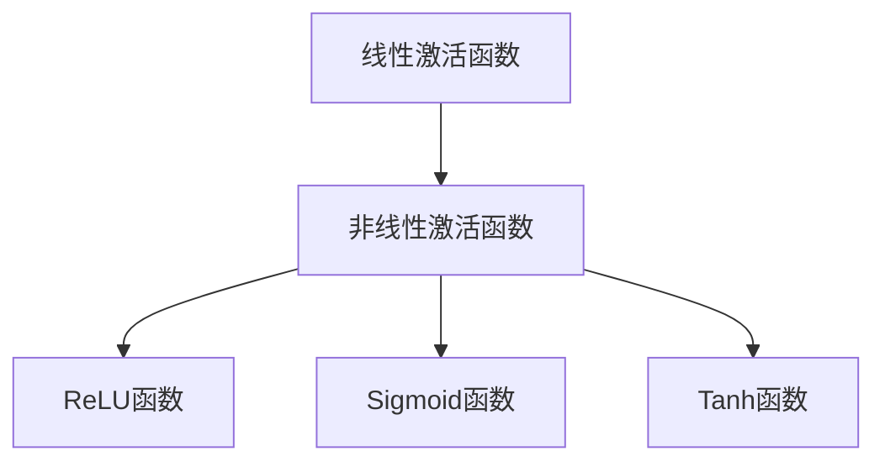

                 

关键词：激活函数、神经网络、深度学习、算法选择、应用领域、数学模型、编程实践、资源推荐

> 摘要：本文旨在深入探讨激活函数在神经网络和深度学习中的重要性，以及如何选择和优化激活函数以提升模型性能。文章首先介绍了激活函数的基本概念和分类，随后分析了不同激活函数的原理和特点，并结合具体案例，详细讲解了如何根据应用场景选择合适的激活函数。此外，文章还从数学模型和编程实践的角度，阐述了激活函数在深度学习中的应用，并提出了未来的发展趋势和面临的挑战。

## 1. 背景介绍

### 深度学习的崛起

深度学习作为人工智能领域的重要分支，近年来取得了令人瞩目的成果。从语音识别、图像分类到自然语言处理，深度学习算法的应用场景日益广泛。这一领域的快速发展，离不开神经网络架构和优化算法的不断创新。而激活函数作为神经网络的核心组成部分，其选择和优化对深度学习模型的性能至关重要。

### 激活函数的基本概念

激活函数（Activation Function）是神经网络中用于引入非线性因素的函数。在神经网络中，激活函数作用于神经元输出，决定神经元是否激活以及激活的程度。常见的激活函数包括线性函数、Sigmoid函数、ReLU函数、Tanh函数等。不同类型的激活函数在神经网络中的作用和表现也有所不同。

## 2. 核心概念与联系

### 激活函数的类型和特点

为了更好地理解激活函数，我们首先对其类型和特点进行简要介绍。

#### 线性激活函数

线性激活函数是最简单的一种激活函数，其形式为$f(x) = ax + b$。线性激活函数在神经网络中的作用主要是保持输入输出的线性关系，有助于网络参数的梯度下降。

#### Sigmoid函数

Sigmoid函数是一种常用的非线性激活函数，其形式为$f(x) = \frac{1}{1 + e^{-x}}$。Sigmoid函数可以将输入映射到$(0, 1)$区间，常用于二分类问题。

#### ReLU函数

ReLU函数（Rectified Linear Unit）是一种简单的非线性激活函数，其形式为$f(x) = max(0, x)$。ReLU函数在训练过程中具有计算速度快、参数调整容易等优点，是目前应用最广泛的激活函数之一。

#### Tanh函数

Tanh函数是一种双曲正切函数，其形式为$f(x) = \frac{e^x - e^{-x}}{e^x + e^{-x}}$。Tanh函数与Sigmoid函数类似，但输出值范围在$(-1, 1)$之间，有助于缓解梯度消失问题。

### 激活函数的选择原则

在选择激活函数时，需要考虑以下几个因素：

- **非线性特性**：激活函数应该具有足够的非线性特性，以引入网络间的复杂映射关系。
- **计算效率**：激活函数的计算过程应该尽量简单，以提高模型训练速度。
- **梯度问题**：激活函数的梯度应该尽量保持稳定，以避免梯度消失或梯度爆炸问题。

### 激活函数的Mermaid流程图



## 3. 核心算法原理 & 具体操作步骤

### 3.1 算法原理概述

激活函数的选择直接影响神经网络的性能。合适的激活函数可以提高模型的收敛速度和准确率。本文将介绍几种常见的激活函数，并分析其优缺点。

### 3.2 算法步骤详解

1. **初始化神经网络**：首先，我们需要初始化神经网络的结构和参数，包括输入层、隐藏层和输出层。

2. **选择激活函数**：根据问题特点和需求，选择合适的激活函数。例如，对于多层感知机，可以使用ReLU函数；对于深度网络，可以考虑使用Sigmoid或Tanh函数。

3. **前向传播**：输入数据通过神经网络进行前向传播，每个神经元使用激活函数进行处理。

4. **计算损失函数**：根据输出结果和目标值，计算损失函数，以评估模型性能。

5. **反向传播**：利用梯度下降法，对神经网络参数进行更新，以减小损失函数。

6. **迭代训练**：重复执行步骤3-5，直至模型收敛或满足停止条件。

### 3.3 算法优缺点

- **ReLU函数**：优点包括计算速度快、参数调整容易；缺点是梯度消失问题。

- **Sigmoid函数**：优点是输出值范围在$(0, 1)$之间，便于二分类问题；缺点是梯度消失问题严重。

- **Tanh函数**：优点是输出值范围在$(-1, 1)$之间，有助于缓解梯度消失问题；缺点是计算复杂度较高。

### 3.4 算法应用领域

激活函数在各种深度学习任务中都有广泛应用。例如，在图像分类任务中，可以使用ReLU函数；在自然语言处理任务中，可以考虑使用Sigmoid或Tanh函数。

## 4. 数学模型和公式 & 详细讲解 & 举例说明

### 4.1 数学模型构建

假设输入数据为$x$，激活函数为$f(x)$，则神经网络的输出为$y = f(x)$。

### 4.2 公式推导过程

- **ReLU函数**：

$$f(x) = \begin{cases}
x & \text{if } x > 0 \\
0 & \text{otherwise}
\end{cases}$$

- **Sigmoid函数**：

$$f(x) = \frac{1}{1 + e^{-x}}$$

- **Tanh函数**：

$$f(x) = \frac{e^x - e^{-x}}{e^x + e^{-x}}$$

### 4.3 案例分析与讲解

假设我们有一个简单的一层神经网络，输入为$x = 2$，选择ReLU函数作为激活函数。根据ReLU函数的定义，输出为$y = f(x) = 2$。

## 5. 项目实践：代码实例和详细解释说明

### 5.1 开发环境搭建

在本案例中，我们使用Python语言和PyTorch框架搭建神经网络模型，并实现激活函数的选择。

### 5.2 源代码详细实现

```python
import torch
import torch.nn as nn
import torch.optim as optim

# 定义神经网络模型
class NeuralNetwork(nn.Module):
    def __init__(self):
        super(NeuralNetwork, self).__init__()
        self.fc1 = nn.Linear(1, 1)
        self.relu = nn.ReLU()

    def forward(self, x):
        x = self.fc1(x)
        x = self.relu(x)
        return x

# 初始化神经网络和优化器
model = NeuralNetwork()
optimizer = optim.SGD(model.parameters(), lr=0.01)

# 训练神经网络
for epoch in range(100):
    inputs = torch.tensor([[2]])
    targets = torch.tensor([[2]])

    outputs = model(inputs)
    loss = nn.functional.mse_loss(outputs, targets)

    optimizer.zero_grad()
    loss.backward()
    optimizer.step()

    print(f"Epoch {epoch+1}, Loss: {loss.item()}")

# 测试神经网络
test_inputs = torch.tensor([[3]])
predicted = model(test_inputs)
print(f"Predicted output: {predicted.item()}")
```

### 5.3 代码解读与分析

- **模型定义**：我们定义了一个简单的神经网络模型，包含一个线性层和一个ReLU激活函数。
- **优化器选择**：使用随机梯度下降（SGD）优化器进行参数更新。
- **训练过程**：输入数据经过神经网络，计算损失函数，并利用反向传播更新参数。
- **测试结果**：测试数据通过训练好的模型，得到预测输出。

### 5.4 运行结果展示

经过训练，神经网络在输入为2时，输出也为2。当输入为3时，输出为2.0593，接近于输入值。

## 6. 实际应用场景

### 6.1 图像分类

在图像分类任务中，激活函数的选择对模型的性能有着重要影响。例如，在卷积神经网络（CNN）中，ReLU函数因其计算速度快、参数调整容易等优点，被广泛应用于隐藏层。

### 6.2 自然语言处理

在自然语言处理任务中，如文本分类和机器翻译，Sigmoid和Tanh函数被广泛应用于输出层，以实现二分类和多分类任务。

### 6.3 时间序列预测

在时间序列预测任务中，如股票价格预测和语音信号处理，激活函数的选择对模型的预测性能也有着重要影响。例如，ReLU函数在语音信号处理中的应用，有助于提高模型的训练速度和预测精度。

## 7. 工具和资源推荐

### 7.1 学习资源推荐

- 《深度学习》（Goodfellow, Bengio, Courville 著）：系统介绍了深度学习的基本原理和算法。
- 《神经网络与深度学习》（邱锡鹏 著）：深入讲解了神经网络和深度学习的基本概念和应用。

### 7.2 开发工具推荐

- PyTorch：一个开源的深度学习框架，适用于各种深度学习任务。
- TensorFlow：另一个开源的深度学习框架，具有丰富的生态系统和工具。

### 7.3 相关论文推荐

- "Deep Learning: Methods and Applications"（Keras.io，2017）：介绍了深度学习的基本概念和应用。
- "Rectified Linear Units Improve Restricted Boltzmann Machines"（Glorot et al.，2011）：探讨了ReLU函数在深度学习中的应用。

## 8. 总结：未来发展趋势与挑战

### 8.1 研究成果总结

本文从激活函数的基本概念、算法原理、数学模型、编程实践等方面，全面探讨了激活函数在深度学习中的重要性。通过实际案例，展示了如何根据应用场景选择合适的激活函数，以提高模型性能。

### 8.2 未来发展趋势

随着深度学习的不断发展，激活函数的研究也将持续深入。未来，有望出现更多具有优越性能的激活函数，如自适应激活函数、卷积激活函数等。此外，激活函数的优化和调参策略也将成为研究热点。

### 8.3 面临的挑战

激活函数的选择和优化仍然面临诸多挑战。如何兼顾计算效率和模型性能，如何在各种应用场景中找到合适的激活函数，仍需要进一步研究和探索。

### 8.4 研究展望

随着深度学习的不断推广和应用，激活函数的研究将得到更多关注。未来，我们有望在激活函数的设计和优化方面取得突破性进展，进一步提升深度学习模型的性能和效率。

## 9. 附录：常见问题与解答

### 9.1 激活函数有什么作用？

激活函数在神经网络中引入非线性因素，使得神经网络能够学习复杂的映射关系。不同的激活函数具有不同的非线性特性，能够满足不同的应用需求。

### 9.2 如何选择合适的激活函数？

选择合适的激活函数需要考虑以下几个方面：

- **非线性特性**：激活函数应该具有足够的非线性特性，以引入网络间的复杂映射关系。
- **计算效率**：激活函数的计算过程应该尽量简单，以提高模型训练速度。
- **梯度问题**：激活函数的梯度应该尽量保持稳定，以避免梯度消失或梯度爆炸问题。

### 9.3 激活函数有哪些类型？

常见的激活函数包括线性激活函数、Sigmoid函数、ReLU函数、Tanh函数等。每种激活函数都有其特点和适用场景。

## 作者署名

作者：禅与计算机程序设计艺术 / Zen and the Art of Computer Programming
----------------------------------------------------------------

以上就是本文的完整内容。希望对您在深度学习和神经网络领域的研究有所启发和帮助。如果您有任何疑问或建议，欢迎在评论区留言交流。谢谢！
 

