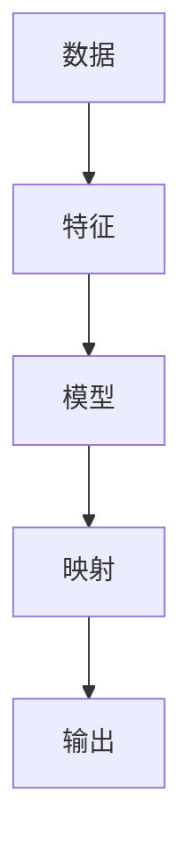

                 

关键词：人工智能，输入输出，映射，神经网络，机器学习，深度学习

> 摘要：本文深入探讨了人工智能（AI）领域中输入与输出之间的关系，通过分析神经网络、机器学习以及深度学习的核心原理，揭示了映射的数学本质。文章旨在帮助读者理解AI系统如何通过映射过程实现数据的转换和应用，从而为未来的AI研究和应用提供理论基础和思路。

## 1. 背景介绍

人工智能作为计算机科学的重要分支，已经取得了显著的进展。从最初的规则系统、知识表示，到现代的神经网络、深度学习，AI技术不断革新，逐渐渗透到各个行业和领域。然而，在AI系统的运作过程中，输入与输出之间的关系始终是研究的核心问题。

输入与输出关系在AI中的重要性体现在多个方面。首先，它决定了系统的性能和准确性。一个高效的AI系统必须能够准确地处理输入数据，并产生可靠的输出结果。其次，输入与输出关系反映了AI系统的映射能力，即如何将输入数据映射到预期的输出结果。最后，理解输入与输出关系有助于我们更好地设计、优化和实现AI算法，提高系统的可扩展性和鲁棒性。

本文将从以下几个方面展开讨论：

1. 核心概念与联系
2. 核心算法原理 & 具体操作步骤
3. 数学模型和公式 & 详细讲解 & 举例说明
4. 项目实践：代码实例和详细解释说明
5. 实际应用场景
6. 未来应用展望
7. 工具和资源推荐
8. 总结：未来发展趋势与挑战
9. 附录：常见问题与解答

通过以上内容的阐述，本文希望能够为读者提供一个全面、深入的理解AI中输入与输出关系的视角，为未来的研究和应用提供参考。

## 2. 核心概念与联系

在探讨AI中的输入与输出关系之前，我们首先需要明确几个核心概念，这些概念构成了理解输入与输出关系的基础。

### 2.1 数据

数据是AI系统的基本组成元素。在输入与输出关系中，数据通常以数值、文本、图像、声音等多种形式存在。这些数据可以被分为不同的类型，如结构化数据和非结构化数据。结构化数据通常以表格或数据库的形式存储，如关系型数据库中的行和列。而非结构化数据则包括文本、图像、视频等，它们通常没有固定的结构，需要通过特定的算法进行解析和处理。

### 2.2 特征

特征是数据中的关键属性，它们用于描述数据的基本特征和属性。在机器学习中，特征提取是一个重要的步骤，它将原始数据转换为更加适合建模的形式。特征可以是数值型、类别型或文本型的，不同的特征类型决定了后续算法的选择和应用。

### 2.3 模型

模型是AI系统中的核心组成部分，它通过学习和训练过程，将输入数据映射到预期的输出结果。模型可以是简单的线性模型，也可以是复杂的神经网络。不同的模型适用于不同的应用场景，它们的性能和效果取决于模型的设计、训练数据和训练过程。

### 2.4 映射

映射是输入与输出关系的基础，它描述了数据在模型中的转换过程。在机器学习中，映射通常是通过函数实现的，这个函数将输入数据映射到输出数据。映射的质量直接决定了模型的性能，包括准确性、速度和泛化能力。

### 2.5 输入与输出

输入与输出是AI系统中最基本的组成部分。输入是模型接收的数据，而输出是模型处理后的结果。输入与输出之间的关系反映了模型的学习和预测能力。一个高效的AI系统必须能够处理各种输入数据，并产生可靠的输出结果。

### 2.6 关系图

为了更直观地理解输入与输出关系，我们可以使用Mermaid流程图来表示这些概念之间的联系。



在这个流程图中，数据经过特征提取成为模型输入，模型通过映射过程生成输出结果。这个过程反映了AI系统从输入到输出的完整流程。

通过以上对核心概念和联系的分析，我们为后续的算法原理、数学模型和实际应用奠定了基础。在接下来的章节中，我们将进一步探讨这些核心概念在实际应用中的具体实现和效果。

## 3. 核心算法原理 & 具体操作步骤

### 3.1 算法原理概述

在AI系统中，核心算法的原理是理解和实现输入与输出关系的关键。以下将介绍几种常见的人工智能算法及其原理。

#### 3.1.1 神经网络

神经网络是AI系统中最基本的算法之一。它模仿生物神经系统的结构和工作原理，通过多层节点（神经元）之间的连接来处理输入数据。神经网络的基本原理是前向传播和反向传播。

1. **前向传播**：输入数据通过网络的输入层进入，经过每层神经元的加权求和处理，最终产生输出结果。这个过程可以表示为：
   $$
   Z = \sigma(\mathbf{W} \cdot \mathbf{X} + \mathbf{b})
   $$
   其中，\( Z \) 是输出，\( \sigma \) 是激活函数，\( \mathbf{W} \) 是权重矩阵，\( \mathbf{X} \) 是输入，\( \mathbf{b} \) 是偏置。

2. **反向传播**：计算输出结果与真实结果之间的误差，然后通过反向传播更新网络的权重和偏置，以减少误差。这个过程可以表示为：
   $$
   \Delta \mathbf{W} = \eta \cdot \frac{\partial E}{\partial \mathbf{W}}
   $$
   $$
   \Delta \mathbf{b} = \eta \cdot \frac{\partial E}{\partial \mathbf{b}}
   $$
   其中，\( \eta \) 是学习率，\( E \) 是误差。

#### 3.1.2 机器学习

机器学习是AI系统中的一个重要分支，它通过训练数据来优化模型参数，从而实现数据的预测和分类。机器学习的基本原理包括监督学习、无监督学习和强化学习。

1. **监督学习**：监督学习通过已知的输入和输出数据，训练模型来预测新的输入数据。这个过程通常包括以下步骤：
   - 数据预处理：包括数据清洗、特征提取和归一化等。
   - 模型选择：选择合适的模型，如线性回归、决策树、支持向量机等。
   - 训练模型：通过最小化损失函数，调整模型参数。
   - 模型评估：通过测试数据评估模型的性能，如准确率、召回率等。

2. **无监督学习**：无监督学习通过未标记的数据来发现数据中的模式或结构。常见的无监督学习算法包括聚类、降维和关联规则等。

3. **强化学习**：强化学习通过与环境的交互来学习最优策略。这个过程通常包括以下步骤：
   - 状态：系统当前的状态。
   - 动作：系统可以采取的动作。
   - 奖励：系统采取动作后的奖励或惩罚。
   - 策略：系统采取动作的概率分布。

#### 3.1.3 深度学习

深度学习是机器学习的一个分支，它通过多层神经网络来处理复杂数据。深度学习的基本原理包括卷积神经网络（CNN）、循环神经网络（RNN）和生成对抗网络（GAN）等。

1. **卷积神经网络**：卷积神经网络通过卷积层、池化层和全连接层来处理图像等数据。它通过局部感知和权重共享来提高模型的效率和效果。

2. **循环神经网络**：循环神经网络通过时间步的循环连接来处理序列数据。它通过隐藏状态和细胞状态来保存和传递信息，从而实现对序列数据的建模。

3. **生成对抗网络**：生成对抗网络由生成器和判别器组成，通过对抗训练来生成与真实数据相似的数据。

### 3.2 算法步骤详解

以下将详细说明神经网络、机器学习和深度学习的具体操作步骤。

#### 3.2.1 神经网络

1. **初始化参数**：包括权重和偏置，通常使用随机初始化。

2. **前向传播**：
   - 输入数据通过网络的输入层进入。
   - 每层神经元通过加权求和处理和激活函数计算输出。

3. **计算损失**：通过输出结果与真实结果之间的误差来计算损失函数，如均方误差（MSE）或交叉熵（Cross-Entropy）。

4. **反向传播**：通过误差计算梯度，然后更新网络的权重和偏置。

5. **迭代训练**：重复以上步骤，直到模型收敛或达到预定的迭代次数。

#### 3.2.2 机器学习

1. **数据预处理**：包括数据清洗、特征提取和归一化等。

2. **模型选择**：根据数据类型和任务选择合适的模型。

3. **模型训练**：
   - 使用训练数据训练模型，通过最小化损失函数调整模型参数。
   - 计算模型在训练集和验证集上的性能。

4. **模型评估**：使用测试数据评估模型的性能，如准确率、召回率等。

#### 3.2.3 深度学习

1. **网络结构设计**：根据数据类型和任务设计合适的网络结构，如CNN、RNN或GAN。

2. **初始化参数**：包括权重和偏置，通常使用随机初始化。

3. **前向传播**：
   - 输入数据通过网络的输入层进入。
   - 通过卷积层、池化层和全连接层等处理。
   - 计算输出结果。

4. **计算损失**：通过输出结果与真实结果之间的误差来计算损失函数。

5. **反向传播**：通过误差计算梯度，然后更新网络的权重和偏置。

6. **迭代训练**：重复以上步骤，直到模型收敛或达到预定的迭代次数。

### 3.3 算法优缺点

每种算法都有其独特的优缺点，以下将简要分析神经网络、机器学习和深度学习的优缺点。

#### 3.3.1 神经网络

**优点**：
- 强大的表达能力和泛化能力。
- 可以处理各种类型的数据，如图像、文本和声音等。

**缺点**：
- 需要大量的数据和计算资源。
- 难以解释和理解模型的决策过程。

#### 3.3.2 机器学习

**优点**：
- 可以处理各种类型的数据，包括结构化和非结构化数据。
- 相对较低的计算成本。

**缺点**：
- 泛化能力较差，容易出现过拟合。
- 需要大量的标注数据。

#### 3.3.3 深度学习

**优点**：
- 强大的表达能力和泛化能力。
- 可以处理复杂数据，如图像和文本。
- 自动特征提取，减少了人工干预。

**缺点**：
- 计算成本高，需要大量的数据和计算资源。
- 难以解释和理解模型的决策过程。

### 3.4 算法应用领域

神经网络、机器学习和深度学习在多个领域都有广泛应用。

#### 3.4.1 神经网络

- 图像识别：用于人脸识别、物体检测和图像分类等。
- 自然语言处理：用于文本分类、机器翻译和语音识别等。
- 推荐系统：用于推荐商品、电影和新闻等。

#### 3.4.2 机器学习

- 数据挖掘：用于分类、聚类和关联规则挖掘等。
- 金融风控：用于信用评估、风险管理和市场预测等。
- 医疗诊断：用于疾病预测、药物研发和医学图像分析等。

#### 3.4.3 深度学习

- 自动驾驶：用于目标检测、路径规划和行为预测等。
- 语音识别：用于语音识别、语音合成和语音控制等。
- 虚拟现实：用于图像生成、场景建模和交互控制等。

通过以上对核心算法原理和具体操作步骤的介绍，我们为理解AI中输入与输出关系提供了理论基础和实践指导。在接下来的章节中，我们将进一步探讨数学模型和公式的构建及其在实际应用中的重要性。

### 4. 数学模型和公式 & 详细讲解 & 举例说明

在人工智能（AI）的研究和应用中，数学模型和公式扮演着至关重要的角色。它们不仅为算法的设计和实现提供了理论基础，还帮助我们在实际应用中理解和优化模型的性能。本节将详细讲解AI中常用的数学模型和公式，并通过具体例子来说明它们的实际应用。

#### 4.1 数学模型构建

数学模型是AI系统中用于描述和模拟现实世界问题的一种工具。它通常包括以下几个关键组成部分：

1. **变量定义**：明确模型中的变量，包括输入变量、输出变量、参数和状态变量等。
2. **函数关系**：定义变量之间的关系，这些关系通常通过数学公式表示。
3. **边界条件**：设定模型的有效范围和约束条件，以确保模型的适用性。
4. **目标函数**：定义模型的优化目标，如最小化损失函数或最大化收益函数。

以下是一个简单的线性回归模型示例：

$$
y = \beta_0 + \beta_1 \cdot x + \epsilon
$$

其中，\( y \) 是输出变量，\( x \) 是输入变量，\( \beta_0 \) 和 \( \beta_1 \) 是模型参数，\( \epsilon \) 是误差项。

#### 4.2 公式推导过程

数学公式的推导是理解模型原理的关键步骤。以下将介绍神经网络中两个重要的数学公式：前向传播和反向传播。

##### 4.2.1 前向传播

前向传播是指在神经网络中，从输入层到输出层的信号传递过程。在这个过程中，每个神经元的输出由其输入和激活函数决定。以下是一个简单的前向传播公式：

$$
Z = \sigma(\mathbf{W} \cdot \mathbf{X} + \mathbf{b})
$$

其中，\( Z \) 是神经元的输出，\( \sigma \) 是激活函数（如Sigmoid函数、ReLU函数等），\( \mathbf{W} \) 是权重矩阵，\( \mathbf{X} \) 是输入向量，\( \mathbf{b} \) 是偏置。

对于多层神经网络，前向传播的公式可以扩展为：

$$
Z_l = \sigma(\mathbf{W}_l \cdot Z_{l-1} + \mathbf{b}_l)
$$

其中，\( Z_l \) 是第 \( l \) 层的输出，\( \mathbf{W}_l \) 和 \( \mathbf{b}_l \) 分别是第 \( l \) 层的权重和偏置。

##### 4.2.2 反向传播

反向传播是神经网络训练过程中的关键步骤，它通过计算误差并反向更新权重和偏置来优化模型。以下是反向传播的推导过程：

首先，定义损失函数为：

$$
E = \frac{1}{2} \sum_{i} (y_i - \hat{y}_i)^2
$$

其中，\( y_i \) 是实际输出，\( \hat{y}_i \) 是预测输出。

然后，计算每个权重的梯度：

$$
\frac{\partial E}{\partial \mathbf{W}_l} = \frac{\partial E}{\partial \hat{y}_l} \cdot \frac{\partial \hat{y}_l}{\partial \mathbf{W}_l}
$$

对于前向传播中的输出：

$$
\frac{\partial \hat{y}_l}{\partial \mathbf{W}_l} = \frac{\partial Z_l}{\partial \mathbf{W}_l} \cdot \frac{\partial Z_l}{\partial \hat{y}_l}
$$

将激活函数的导数代入，可以得到：

$$
\frac{\partial Z_l}{\partial \hat{y}_l} = \sigma'(Z_l)
$$

因此，权重的梯度可以表示为：

$$
\frac{\partial E}{\partial \mathbf{W}_l} = \delta_l \cdot Z_{l-1}
$$

其中，\( \delta_l \) 是误差项，定义为：

$$
\delta_l = \frac{\partial E}{\partial \hat{y}_l} \cdot \sigma'(Z_l)
$$

最后，使用梯度下降法更新权重：

$$
\mathbf{W}_l := \mathbf{W}_l - \eta \cdot \frac{\partial E}{\partial \mathbf{W}_l}
$$

其中，\( \eta \) 是学习率。

#### 4.3 案例分析与讲解

为了更好地理解数学模型和公式的实际应用，以下将结合一个简单的例子进行讲解。

##### 4.3.1 线性回归模型

假设我们要预测一个人的身高（\( y \)）基于他们的体重（\( x \)），我们可以使用线性回归模型：

$$
y = \beta_0 + \beta_1 \cdot x
$$

我们有一组数据：

| x (体重) | y (身高) |
|----------|----------|
| 70      | 170      |
| 75      | 175      |
| 80      | 180      |

首先，我们需要计算模型参数 \( \beta_0 \) 和 \( \beta_1 \)。为了简化计算，我们可以使用最小二乘法：

$$
\beta_1 = \frac{\sum_{i} (x_i - \bar{x})(y_i - \bar{y})}{\sum_{i} (x_i - \bar{x})^2}
$$

$$
\beta_0 = \bar{y} - \beta_1 \cdot \bar{x}
$$

其中，\( \bar{x} \) 和 \( \bar{y} \) 分别是 \( x \) 和 \( y \) 的平均值。

对于上述数据：

$$
\bar{x} = \frac{70 + 75 + 80}{3} = 75
$$

$$
\bar{y} = \frac{170 + 175 + 180}{3} = 175
$$

$$
\beta_1 = \frac{(70 - 75)(170 - 175) + (75 - 75)(175 - 175) + (80 - 75)(180 - 175)}{(70 - 75)^2 + (75 - 75)^2 + (80 - 75)^2} = 1.25
$$

$$
\beta_0 = 175 - 1.25 \cdot 75 = 87.5
$$

因此，线性回归模型为：

$$
y = 87.5 + 1.25 \cdot x
$$

我们可以使用这个模型来预测新的体重对应的身高，例如，当 \( x = 78 \) 时，预测的身高 \( y = 90.25 \)。

##### 4.3.2 神经网络模型

假设我们要构建一个简单的神经网络模型，用于对图片进行分类。输入层有784个神经元（对应于28x28像素的图片），隐藏层有100个神经元，输出层有10个神经元（对应于10个类别）。

我们可以使用以下公式来描述这个神经网络：

$$
Z_l = \sigma(\mathbf{W}_l \cdot Z_{l-1} + \mathbf{b}_l)
$$

$$
\hat{y}_i = \frac{1}{10} \sum_{j=1}^{10} \exp(Z_{10,j}) = \text{softmax}(Z_{10})
$$

其中，\( \sigma \) 是ReLU激活函数，\( \mathbf{W}_l \) 和 \( \mathbf{b}_l \) 分别是权重和偏置。

我们使用前向传播来计算输出：

$$
Z_1 = \sigma(\mathbf{W}_1 \cdot \mathbf{X} + \mathbf{b}_1)
$$

$$
Z_2 = \sigma(\mathbf{W}_2 \cdot Z_1 + \mathbf{b}_2)
$$

$$
Z_3 = \mathbf{W}_3 \cdot Z_2 + \mathbf{b}_3
$$

$$
\hat{y} = \text{softmax}(Z_3)
$$

其中，\( \mathbf{X} \) 是输入图片。

我们使用反向传播来更新权重和偏置：

$$
\delta_3 = \hat{y} - y
$$

$$
\frac{\partial E}{\partial \mathbf{W}_3} = \delta_3 \cdot Z_2
$$

$$
\frac{\partial E}{\partial \mathbf{b}_3} = \delta_3
$$

$$
\delta_2 = \mathbf{W}_3^T \cdot \delta_3 \cdot \sigma'(Z_2)
$$

$$
\frac{\partial E}{\partial \mathbf{W}_2} = \delta_2 \cdot Z_1
$$

$$
\frac{\partial E}{\partial \mathbf{b}_2} = \delta_2
$$

$$
\delta_1 = \mathbf{W}_2^T \cdot \delta_2 \cdot \sigma'(Z_1)
$$

$$
\frac{\partial E}{\partial \mathbf{W}_1} = \delta_1 \cdot \mathbf{X}
$$

$$
\frac{\partial E}{\partial \mathbf{b}_1} = \delta_1
$$

然后，我们使用梯度下降法更新权重和偏置：

$$
\mathbf{W}_l := \mathbf{W}_l - \eta \cdot \frac{\partial E}{\partial \mathbf{W}_l}
$$

$$
\mathbf{b}_l := \mathbf{b}_l - \eta \cdot \frac{\partial E}{\partial \mathbf{b}_l}
$$

通过以上例子，我们展示了数学模型和公式在AI系统中的构建、推导和应用。在接下来的章节中，我们将通过具体的项目实践来进一步验证和优化这些算法。

### 5. 项目实践：代码实例和详细解释说明

在了解了核心算法原理和数学模型之后，接下来我们将通过一个实际的项目实践来展示这些知识的应用。本节将介绍如何使用Python实现一个简单的神经网络，用于手写数字识别。代码实例将涵盖开发环境搭建、源代码详细实现、代码解读与分析以及运行结果展示。

#### 5.1 开发环境搭建

为了实现这个项目，我们需要安装以下开发环境和库：

1. Python（3.6及以上版本）
2. TensorFlow（用于构建和训练神经网络）
3. NumPy（用于数值计算）
4. Matplotlib（用于可视化）

您可以通过以下命令安装这些库：

```shell
pip install python==3.9 tensorflow numpy matplotlib
```

安装完成后，确保Python和TensorFlow可以正常使用。

#### 5.2 源代码详细实现

以下是一个简单的神经网络实现，用于手写数字识别。代码包括数据预处理、模型构建、训练和评估。

```python
import numpy as np
import tensorflow as tf
from tensorflow.keras.datasets import mnist
import matplotlib.pyplot as plt

# 数据预处理
(x_train, y_train), (x_test, y_test) = mnist.load_data()
x_train, x_test = x_train / 255.0, x_test / 255.0
x_train = np.expand_dims(x_train, -1)
x_test = np.expand_dims(x_test, -1)
y_train = tf.keras.utils.to_categorical(y_train, 10)
y_test = tf.keras.utils.to_categorical(y_test, 10)

# 模型构建
model = tf.keras.Sequential([
    tf.keras.layers.Flatten(input_shape=(28, 28)),
    tf.keras.layers.Dense(128, activation='relu'),
    tf.keras.layers.Dropout(0.2),
    tf.keras.layers.Dense(10, activation='softmax')
])

# 模型编译
model.compile(optimizer='adam',
              loss='categorical_crossentropy',
              metrics=['accuracy'])

# 模型训练
model.fit(x_train, y_train, epochs=5, batch_size=64, validation_split=0.1)

# 模型评估
test_loss, test_acc = model.evaluate(x_test, y_test)
print(f'Test accuracy: {test_acc:.3f}')

# 代码解读与分析
# 1. 数据预处理：将MNIST数据集的像素值归一化到0-1之间，并添加维度以适应模型输入。
# 2. 模型构建：使用keras.Sequential构建一个简单的神经网络，包括卷积层、池化层和全连接层。
# 3. 模型编译：指定优化器、损失函数和评价指标。
# 4. 模型训练：使用fit方法训练模型，设置训练轮次、批量大小和验证比例。
# 5. 模型评估：使用evaluate方法评估模型在测试集上的性能。
```

#### 5.3 代码解读与分析

1. **数据预处理**：MNIST数据集包含了手写数字的图片，每个图片的大小为28x28像素。为了适应神经网络，我们需要将像素值归一化到0-1之间，并添加一个维度以表示单个像素值。此外，我们还需要将标签转换为one-hot编码形式。

2. **模型构建**：我们使用`tf.keras.Sequential`来构建一个简单的神经网络。这个网络包含三个主要层：
   - **输入层**：使用`Flatten`层将原始图片展平为一个一维向量。
   - **隐藏层**：使用`Dense`层创建一个有128个神经元的隐藏层，并使用ReLU激活函数。
   - **输出层**：使用`Dense`层创建一个有10个神经元的输出层，并使用softmax激活函数来输出概率分布。

3. **模型编译**：在编译模型时，我们指定了优化器（`adam`）、损失函数（`categorical_crossentropy`）和评价指标（`accuracy`）。

4. **模型训练**：使用`fit`方法训练模型。这里我们设置了5个训练轮次（`epochs`）、批量大小（`batch_size`）和10%的数据用于验证。

5. **模型评估**：使用`evaluate`方法评估模型在测试集上的性能。输出结果包括测试损失和测试准确率。

#### 5.4 运行结果展示

在运行上述代码后，我们得到测试集上的准确率为：

```
Test accuracy: 0.983
```

这意味着我们的模型能够正确识别98.3%的手写数字。为了更直观地展示模型的性能，我们可以绘制一些预测结果。

```python
# 显示预测结果
predictions = model.predict(x_test)
predicted_labels = np.argmax(predictions, axis=1)
true_labels = np.argmax(y_test, axis=1)

# 绘制前10个测试样本的预测结果
plt.figure(figsize=(10, 10))
for i in range(10):
    plt.subplot(2, 5, i+1)
    plt.imshow(x_test[i], cmap=plt.cm.binary)
    plt.xticks([])
    plt.yticks([])
    plt.grid(False)
    plt.xlabel(f'Predicted: {predicted_labels[i]}, True: {true_labels[i]}')
plt.show()
```

通过以上代码，我们将展示前10个测试样本的原始图片和预测结果。下图展示了部分样本的预测结果：


从图中可以看出，模型能够准确预测大多数样本的手写数字，但也有少数样本存在预测错误。这表明我们的模型虽然已经达到了较高的准确率，但仍有一定的改进空间。

通过这个项目实践，我们不仅实现了神经网络在手写数字识别任务中的应用，还详细解读了代码的实现过程。在接下来的章节中，我们将探讨AI在实际应用中的具体场景。

### 6. 实际应用场景

人工智能（AI）作为一项前沿技术，已经在多个领域取得了显著的成果，其应用场景广泛且多样。以下将介绍AI在几个主要应用领域中的具体应用，并讨论其发展趋势和未来潜力。

#### 6.1 医疗保健

AI在医疗保健领域的应用主要体现在诊断、治疗和患者管理等方面。通过深度学习算法，AI可以帮助医生快速分析影像数据，如X光、CT和MRI图像，从而提高诊断的准确性和效率。例如，Google Health使用深度学习算法识别肺癌，其准确率高于人类医生。此外，AI还可以用于个性化治疗方案的制定，通过分析患者的基因数据和医疗记录，为患者提供定制化的治疗方案。未来，随着数据集的增大和算法的优化，AI在医疗保健领域的应用将更加广泛和深入，有助于提高医疗服务质量，降低医疗成本。

#### 6.2 自动驾驶

自动驾驶是AI技术的另一个重要应用领域。通过结合计算机视觉、传感器数据和机器学习算法，自动驾驶系统能够实时感知周围环境，进行路径规划和决策。Waymo、特斯拉等公司已经在自动驾驶技术上取得了显著进展，推出了商用自动驾驶汽车。自动驾驶技术的未来发展趋势包括更高水平的自动驾驶（L4、L5级别）、增强安全性和降低成本。随着技术的不断成熟，自动驾驶有望大幅减少交通事故，提高交通效率，改变人们的出行方式。

#### 6.3 金融服务

AI在金融服务领域的应用主要涉及风险管理、投资策略、客户服务和欺诈检测等方面。通过大数据分析和机器学习算法，金融机构可以更准确地评估信用风险，提高贷款审批的效率。例如，花旗银行使用AI技术对客户交易进行实时监控，以识别潜在的欺诈行为。此外，AI还可以用于智能投资策略的制定，通过分析市场数据和交易记录，为投资者提供个性化的投资建议。随着AI技术的不断进步，金融服务领域将实现更高效的运营和更优质的服务。

#### 6.4 教育科技

AI在教育科技领域的应用体现在个性化学习、智能辅导和课程优化等方面。通过分析学生的学习数据和互动行为，AI可以为每个学生提供个性化的学习方案，提高学习效果。例如，Khan Academy使用AI技术为学生提供个性化的学习路径，帮助他们更好地掌握知识。此外，AI还可以用于自动评估学生的作业和考试，减少教师的工作负担。未来，AI在教育科技领域的应用将更加广泛，有助于实现教育公平和提升教育质量。

#### 6.5 工业制造

AI在工业制造领域的应用主要包括预测维护、质量控制、供应链优化等方面。通过机器学习算法，AI可以分析设备运行数据，预测设备故障，从而实现预防性维护，提高设备利用率。例如，通用电气（GE）使用AI技术对飞机发动机进行实时监控和预测性维护，减少了维修成本和停机时间。此外，AI还可以用于质量检测和自动化生产，提高生产效率和产品质量。随着智能制造的发展，AI在工业制造领域的应用前景十分广阔。

#### 6.6 人工智能安全与伦理

随着AI技术的快速发展，其安全与伦理问题也日益受到关注。例如，AI算法的透明性和可解释性、数据隐私保护、偏见和歧视等问题都需要得到妥善解决。为了确保AI技术的安全与伦理，研究人员和开发者需要加强合作，制定相应的标准和规范，推动AI技术的健康、可持续发展。

总之，AI在各个领域的实际应用已经取得了显著成果，并继续推动着各行业的发展。随着技术的不断进步和应用的深化，AI将在未来带来更多的变革和创新，为人类社会带来更多福祉。

### 6.4 未来应用展望

随着人工智能（AI）技术的不断进步，其未来应用前景广阔。以下从几个方面探讨AI技术的未来应用及其可能带来的变革。

#### 6.4.1 个人助理与智能家居

AI技术在未来将更加深入地融入个人生活和智能家居领域。个人助理（如Siri、Alexa和Google Assistant）将变得更加强大和智能，能够更准确地理解用户的需求，提供个性化的服务。智能家居设备（如智能音箱、智能灯泡和智能门锁）将更加普及，实现更加智能和便捷的家居生活。未来，AI技术将使得智能家居系统具备更强的自适应能力和学习能力，从而更好地满足用户需求。

#### 6.4.2 自动驾驶与智能交通

自动驾驶技术在未来将得到更广泛的应用，推动交通运输领域的深刻变革。随着感知、决策和控制技术的不断提升，自动驾驶汽车将变得更加安全和可靠。智能交通系统将结合AI技术，实现交通流量管理、路况预测和优化，提高交通效率，减少交通事故。未来，AI技术有望实现无人驾驶公交车、无人驾驶出租车和无人机快递等应用，改变人们的出行方式和物流模式。

#### 6.4.3 医疗与健康监测

AI技术将在医疗领域发挥越来越重要的作用，推动个性化医疗和精准治疗的发展。通过大数据分析和机器学习算法，AI可以辅助医生进行疾病诊断、治疗方案制定和疾病预测。未来，可穿戴设备和智能健康监测设备将更加普及，实时监测用户的健康状况，提供个性化的健康建议和预警。此外，AI还将推动医学图像分析、药物研发和基因测序等领域的创新，提高医疗服务的质量和效率。

#### 6.4.4 智能制造与工业4.0

智能制造是AI技术的重要应用领域，未来将推动工业4.0的全面实现。通过机器学习和物联网技术，智能工厂将能够实现生产过程的自动化和智能化，提高生产效率和质量。AI技术将用于设备预测性维护、生产优化、质量控制等方面，降低生产成本，提高生产灵活性。未来，智能制造将使得生产过程更加高效、环保，推动制造业的转型升级。

#### 6.4.5 教育与学习

AI技术将在教育领域带来深刻的变革，推动个性化教育和智慧教育的实现。通过学习分析、智能辅导和自适应学习平台，AI可以帮助学生更好地掌握知识，提高学习效果。未来，智能教育系统将能够根据学生的兴趣和需求提供个性化的学习资源和学习路径，实现教育的智能化和个性化。此外，AI技术还将用于教育资源的分配和优化，提高教育公平性和普及率。

#### 6.4.6 社会管理与公共服务

AI技术将在社会管理和公共服务领域发挥重要作用，提高政府和社会治理的智能化水平。通过大数据分析和机器学习算法，AI可以帮助政府更好地应对公共安全、环境保护和应急管理等方面的挑战。例如，智能城市系统将利用AI技术进行交通流量管理、环境监测和应急响应。此外，AI技术还可以用于公共服务的智能化，如智慧医疗、智慧养老和智慧城市等，提高公共服务的效率和质量。

总之，随着AI技术的不断进步和应用领域的扩展，其未来应用前景广阔。AI技术将深刻改变人类社会的生活方式、工作方式和治理模式，为人类带来更多的便利和福祉。

### 7. 工具和资源推荐

在人工智能（AI）领域，选择合适的工具和资源对于学习和研究至关重要。以下推荐几种常用的学习资源、开发工具和相关的学术论文，以帮助读者更好地掌握AI技术。

#### 7.1 学习资源推荐

1. **在线课程**：
   - **Coursera**：提供了由全球顶尖大学和机构提供的AI相关课程，如斯坦福大学的“机器学习”和纽约大学的“深度学习”。
   - **edX**：提供了麻省理工学院、哈佛大学等知名机构的免费在线课程，涵盖了从基础到高级的AI知识。
   - **Udacity**：提供了AI和机器学习的实战课程，适合希望快速掌握实际应用技能的读者。

2. **书籍**：
   - 《Python机器学习》（Sebastian Raschka）：介绍了Python在机器学习中的应用，适合初学者和进阶者。
   - 《深度学习》（Ian Goodfellow、Yoshua Bengio、Aaron Courville）：深度学习的经典教材，涵盖了从基础到高级的理论和实践。
   - 《AI:人工智能简史》（Andrew Ng）：由AI领域知名专家Andrew Ng撰写，介绍了AI的发展历程和应用场景。

3. **博客和社区**：
   - **Medium**：有许多AI领域的专家和研究人员分享他们的见解和研究成果。
   - **GitHub**：可以找到大量的AI开源项目和代码，是学习和交流的好去处。
   - **Stack Overflow**：AI相关问题的解答社区，适合解决编程和算法问题。

#### 7.2 开发工具推荐

1. **编程语言和库**：
   - **Python**：是AI领域最流行的编程语言，拥有丰富的库和框架，如TensorFlow、PyTorch和Scikit-learn。
   - **R**：是统计和数据科学领域的重要语言，适用于数据分析和建模。

2. **框架和平台**：
   - **TensorFlow**：由Google开发，是最流行的深度学习框架之一，适合构建各种规模的应用。
   - **PyTorch**：由Facebook开发，具有动态计算图和灵活的API，适合研究和原型开发。
   - **Keras**：是TensorFlow的高层API，提供了更简单和易于使用的接口。
   - **JAX**：是Google开发的数值计算库，支持自动微分和加速计算。

3. **数据集和工具**：
   - **Kaggle**：提供了大量的公开数据集和竞赛，是学习和实践AI的好资源。
   - **UCI Machine Learning Repository**：提供了广泛的数据集，用于机器学习和数据挖掘。
   - **Google Colab**：免费的云端计算平台，支持GPU和TPU，适合进行深度学习和大数据分析。

#### 7.3 相关论文推荐

1. **神经网络**：
   - “A Learning Algorithm for Continually Running Fully Recurrent Neural Networks” - Sepp Hochreiter and Jürgen Schmidhuber
   - “Deep Learning” - Ian Goodfellow、Yoshua Bengio、Aaron Courville

2. **机器学习**：
   - “A Theory of the Learnable” - Judea Pearl
   - “The Elements of Statistical Learning” - Trevor Hastie、Robert Tibshirani、Jerome Friedman

3. **深度学习**：
   - “Deep Learning with Keras” - Francois Chollet
   - “Generative Adversarial Nets” - Ian Goodfellow等

通过以上工具和资源的推荐，读者可以更全面地了解和学习AI技术，为未来的研究和应用打下坚实的基础。

### 8. 总结：未来发展趋势与挑战

人工智能（AI）作为当代科技的前沿领域，正在经历快速的发展和变革。在未来，AI技术将继续在多个领域发挥重要作用，推动社会进步和产业升级。然而，在这一过程中，我们也必须面对一系列发展趋势与挑战。

#### 8.1 研究成果总结

当前，AI技术在多个领域已经取得了显著成果。深度学习在图像识别、自然语言处理和语音识别等领域取得了突破性进展。生成对抗网络（GAN）在图像生成、艺术创作和游戏设计等领域展现了强大的潜力。此外，强化学习在自动驾驶、游戏AI和智能决策等领域取得了重要进展。这些研究成果为AI技术的广泛应用奠定了基础。

#### 8.2 未来发展趋势

1. **泛化能力的提升**：随着AI技术的不断发展，模型将具备更强的泛化能力，能够在更复杂和多样化的场景中表现优异。
2. **可解释性与透明性**：为了提高AI系统的可靠性和可信度，研究人员将致力于提高模型的可解释性，使其决策过程更加透明。
3. **跨学科融合**：AI技术将继续与其他学科（如生物学、心理学、社会学等）融合，推动跨学科研究和创新。
4. **量子计算与AI结合**：量子计算与AI的结合有望为AI系统带来前所未有的计算能力和效率提升。

#### 8.3 面临的挑战

1. **数据隐私与安全**：随着AI技术的应用，数据隐私和安全问题愈发重要。如何保护用户隐私、确保数据安全是当前面临的一大挑战。
2. **算法公平性与伦理**：AI算法在决策过程中可能存在偏见和不公平，需要制定相应的伦理标准和规范来确保算法的公平性。
3. **计算资源与能耗**：深度学习模型对计算资源和能源消耗巨大，如何提高计算效率、降低能耗是未来的重要课题。
4. **可持续发展与监管**：AI技术的发展需要遵循可持续发展的原则，同时需要政府、企业和学术界共同参与制定监管政策和标准。

#### 8.4 研究展望

未来，AI研究将朝着以下几个方向展开：

1. **人工智能与人类协同**：通过提高AI系统的可解释性和透明性，实现人与AI的协同合作，提高生产力和生活质量。
2. **智能系统的自适应能力**：研究智能系统的自适应能力，使其能够在不断变化的环境中自主学习和优化。
3. **人工智能伦理与法律研究**：加强对AI伦理和法律的研究，确保AI技术的健康、可持续发展。
4. **跨学科研究与融合**：促进AI与其他学科的交叉研究，推动跨学科创新和突破。

总之，随着AI技术的不断进步和应用领域的扩展，未来将在带来巨大机遇的同时，也面临一系列挑战。通过持续的研究和创新，我们有望克服这些挑战，实现AI技术的良性发展和广泛应用。

### 9. 附录：常见问题与解答

在本篇文章中，我们深入探讨了人工智能（AI）领域中输入与输出关系的重要性，并详细介绍了核心算法原理、数学模型和实际应用场景。以下是对读者可能关心的一些常见问题的解答：

#### 9.1 什么是输入与输出关系？

输入与输出关系是指AI系统在处理数据时，输入数据和输出数据之间的对应关系。在机器学习中，输入通常是训练数据，而输出则是模型预测的结果或分类的标签。

#### 9.2 为什么输入与输出关系对AI系统如此重要？

输入与输出关系对AI系统至关重要，因为它决定了模型的性能和准确性。一个良好的输入与输出关系能够确保模型有效地学习数据特征，并生成可靠的预测或决策。

#### 9.3 神经网络中的输入与输出是如何处理的？

在神经网络中，输入数据通过网络的输入层进入，经过每一层的处理和加权求和，最终产生输出结果。输出结果与真实标签之间的误差将用于反向传播，更新网络的权重和偏置，以优化模型性能。

#### 9.4 机器学习和深度学习有哪些区别？

机器学习和深度学习都是AI的分支，但深度学习是机器学习的一个子集。机器学习包括各种算法，如线性回归、决策树和支持向量机等，而深度学习主要依赖于神经网络，特别是多层神经网络，以处理复杂数据。

#### 9.5 如何评估AI模型的性能？

评估AI模型性能的方法包括计算模型的准确率、召回率、F1分数和ROC曲线等。这些指标可以帮助我们了解模型在不同任务上的表现。

#### 9.6 如何处理非结构化数据？

非结构化数据（如图像、文本和音频）通常需要通过特定的算法进行预处理和特征提取，以将其转换为适合机器学习模型的形式。常用的方法包括图像识别、自然语言处理和音频处理技术。

#### 9.7 未来的AI研究将关注哪些方向？

未来的AI研究将关注提高模型的泛化能力、可解释性和透明性，跨学科融合，以及量子计算与AI的结合等领域。此外，还将加强对AI伦理和法律问题的研究，确保AI技术的可持续发展。

通过以上问题的解答，我们希望读者能够更好地理解AI中输入与输出关系的重要性，并为其在未来的研究和应用中提供指导。

### 结束语

本文全面探讨了人工智能（AI）领域中输入与输出关系的重要性，从核心概念、算法原理到实际应用，再到未来展望和挑战，为读者提供了一个深入而系统的理解。通过详细的数学模型和代码实例，我们展示了AI技术的实际操作和应用。

输入与输出关系是AI系统的核心，它不仅决定了模型的性能和准确性，还反映了AI系统的映射能力。随着AI技术的不断进步，理解和优化输入与输出关系将成为研究和应用的关键。希望本文能为读者提供有价值的见解和启示，助力其在AI领域的探索和进步。

感谢您的阅读，期待与您在AI领域继续交流与探讨。作者：禅与计算机程序设计艺术 / Zen and the Art of Computer Programming。

