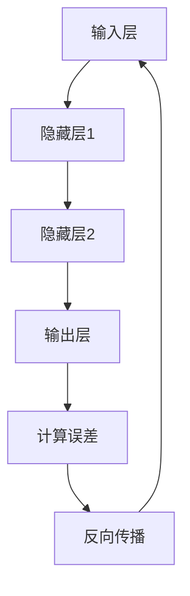

                 

关键词：神经网络、医疗诊断、人工智能、医学图像、深度学习

> 摘要：本文探讨了神经网络在医疗诊断领域中的应用，通过介绍神经网络的基本概念、核心算法、数学模型以及实践案例，分析了其在医学图像处理和疾病预测中的巨大潜力，并展望了未来的发展趋势与挑战。

## 1. 背景介绍

医疗诊断是一个古老而复杂的领域，它涉及到对人体健康的观察、检测和评估。随着科技的进步，尤其是人工智能和深度学习的崛起，医疗诊断正经历着一场革命。神经网络作为一种强大的机器学习模型，因其对复杂模式的自动识别和学习能力，在医疗诊断中具有广泛的应用前景。

近年来，深度学习在医学图像处理、疾病预测、个性化治疗等方面取得了显著的成果。例如，通过卷积神经网络（CNN）对医学图像进行分类和检测，可以实现早期癌症的自动诊断；通过循环神经网络（RNN）对患者的电子健康记录进行分析，可以帮助医生预测疾病的进展和复发风险。这些应用不仅提高了诊断的准确性，还减轻了医生的工作负担。

然而，神经网络在医疗诊断中的应用也面临着一些挑战，如数据隐私、模型解释性、算法可靠性等。本文将深入探讨神经网络在医疗诊断中的潜在应用，并分析这些挑战及其可能的解决方案。

## 2. 核心概念与联系

### 2.1 神经网络基本概念

神经网络是一种模仿生物神经系统工作的计算模型，由大量的节点（或称为神经元）互联构成。每个神经元接收来自其他神经元的输入信号，通过加权求和后激活函数进行处理，产生输出信号。神经网络的基本结构包括输入层、隐藏层和输出层。

- **输入层**：接收外部输入信号，如医学图像、患者病史等。
- **隐藏层**：对输入信号进行加工和处理，提取特征。
- **输出层**：产生最终的输出结果，如疾病诊断结果。

### 2.2 核心算法原理

神经网络的训练过程是通过反向传播算法（Backpropagation Algorithm）来实现的。反向传播算法包括以下几个步骤：

1. **前向传播**：输入信号从输入层传播到隐藏层，再从隐藏层传播到输出层。
2. **计算误差**：将输出层的实际输出与预期输出进行比较，计算误差。
3. **反向传播**：将误差信号反向传播回隐藏层和输入层，更新各层神经元的权重。
4. **重复迭代**：重复上述过程，直到达到预定的误差阈值或迭代次数。

### 2.3 Mermaid 流程图



### 2.4 神经网络架构

神经网络的架构可以根据不同的应用需求进行设计。常见的神经网络架构包括：

- **卷积神经网络（CNN）**：适用于处理图像数据。
- **循环神经网络（RNN）**：适用于处理序列数据，如文本和语音。
- **生成对抗网络（GAN）**：适用于生成新数据和对抗训练。
- **变分自编码器（VAE）**：适用于数据压缩和生成。

## 3. 核心算法原理 & 具体操作步骤

### 3.1 算法原理概述

神经网络的核心在于其层次化的数据处理能力。输入层接收原始数据，隐藏层对数据进行处理和特征提取，输出层生成最终的预测结果。神经网络通过反向传播算法不断调整权重，使得预测结果逐渐逼近真实值。

### 3.2 算法步骤详解

1. **初始化参数**：包括输入层、隐藏层和输出层的权重和偏置。
2. **前向传播**：将输入数据传递到隐藏层，通过激活函数计算输出。
3. **计算损失函数**：将输出与真实值进行比较，计算损失函数值。
4. **反向传播**：根据损失函数梯度调整权重和偏置。
5. **优化参数**：使用优化算法（如梯度下降）更新参数。
6. **迭代训练**：重复上述步骤，直到达到预定的训练目标。

### 3.3 算法优缺点

**优点**：
- **自适应学习能力**：神经网络可以自动学习和调整权重，适应不同的数据分布。
- **高泛化能力**：神经网络可以处理复杂的非线性问题。
- **多维度数据处理**：神经网络可以同时处理多个输入维度。

**缺点**：
- **计算资源消耗**：神经网络训练过程需要大量的计算资源。
- **训练时间较长**：深度神经网络训练过程可能需要较长时间。
- **模型解释性不足**：神经网络内部处理过程复杂，难以解释。

### 3.4 算法应用领域

神经网络在医疗诊断中的应用非常广泛，包括但不限于：

- **医学图像分析**：用于检测和分类医学图像，如X光片、CT扫描、MRI等。
- **疾病预测**：基于患者的电子健康记录，预测疾病的发展和复发风险。
- **个性化治疗**：根据患者的基因信息和病史，制定个性化的治疗方案。

## 4. 数学模型和公式 & 详细讲解 & 举例说明

### 4.1 数学模型构建

神经网络的核心在于其数学模型，主要包括：

- **激活函数**：用于引入非线性特性，常见的激活函数包括Sigmoid、ReLU和Tanh。
- **损失函数**：用于评估预测结果与真实值之间的差距，常见的损失函数包括均方误差（MSE）和交叉熵（CE）。
- **优化算法**：用于更新网络权重，常见的优化算法包括梯度下降（GD）和Adam。

### 4.2 公式推导过程

假设我们有一个简单的神经网络，包括一个输入层、一个隐藏层和一个输出层。输入层有\( n \)个神经元，隐藏层有\( m \)个神经元，输出层有\( k \)个神经元。

- **输入层到隐藏层的传递函数**：
  $$ z_j^h = \sum_{i=1}^{n} w_{ij}^h x_i + b_j^h $$
  $$ a_j^h = \sigma(z_j^h) $$

  其中，\( x_i \)是输入层的第\( i \)个神经元，\( w_{ij}^h \)是输入层到隐藏层的第\( i \)个神经元连接到第\( j \)个隐藏层神经元的权重，\( b_j^h \)是隐藏层第\( j \)个神经元的偏置，\( \sigma \)是激活函数。

- **隐藏层到输出层的传递函数**：
  $$ z_k^o = \sum_{j=1}^{m} w_{jk}^o a_j^h + b_k^o $$
  $$ y_k = \sigma(z_k^o) $$

  其中，\( a_j^h \)是隐藏层的第\( j \)个神经元，\( w_{jk}^o \)是隐藏层到输出层的第\( j \)个神经元连接到第\( k \)个输出层神经元的权重，\( b_k^o \)是输出层第\( k \)个神经元的偏置，\( \sigma \)是激活函数。

- **损失函数**：
  $$ J = \frac{1}{2} \sum_{k=1}^{k} (y_k - t_k)^2 $$

  其中，\( y_k \)是输出层的第\( k \)个神经元的预测输出，\( t_k \)是输出层的第\( k \)个神经元的真实输出。

- **梯度计算**：
  $$ \frac{\partial J}{\partial w_{ij}^h} = (a_j^h)(1 - a_j^h)(y_k - t_k) x_i $$
  $$ \frac{\partial J}{\partial b_j^h} = (a_j^h)(1 - a_j^h)(y_k - t_k) $$
  $$ \frac{\partial J}{\partial w_{jk}^o} = a_j^h (y_k - t_k) $$
  $$ \frac{\partial J}{\partial b_j^o} = y_k - t_k $$

### 4.3 案例分析与讲解

假设我们有一个简单的二分类问题，输出层有两个神经元，分别表示疾病存在和不存在。我们可以使用Sigmoid激活函数和交叉熵损失函数。

- **输入层**：\( x = [0, 1] \)
- **隐藏层**：\( a^h = [0.5, 0.7] \)
- **输出层**：\( y = [0.9, 0.1] \)
- **真实输出**：\( t = [1, 0] \)

- **前向传播**：
  $$ z^h_1 = 0.5 \times 0 + 0.7 \times 1 = 0.7 $$
  $$ a^h_1 = \sigma(z^h_1) = 0.995 $$
  $$ z^h_2 = 0.5 \times 1 + 0.7 \times 0 = 0.5 $$
  $$ a^h_2 = \sigma(z^h_2) = 0.678 $$
  $$ z^o_1 = 0.995 \times 0.9 + 0.678 \times 0.1 = 0.896 $$
  $$ y_1 = \sigma(z^o_1) = 0.803 $$
  $$ z^o_2 = 0.995 \times 0.1 + 0.678 \times 0.9 = 0.194 $$
  $$ y_2 = \sigma(z^o_2) = 0.438 $$

- **计算损失函数**：
  $$ J = \frac{1}{2} \times (1 - 0.803)^2 + \frac{1}{2} \times (0 - 0.438)^2 = 0.122 $$

- **反向传播**：
  $$ \frac{\partial J}{\partial z^o_1} = 0.197 $$
  $$ \frac{\partial J}{\partial z^o_2} = 0.562 $$
  $$ \frac{\partial J}{\partial a^h_1} = 0.197 \times 0.995 = 0.196 $$
  $$ \frac{\partial J}{\partial a^h_2} = 0.562 \times 0.678 = 0.378 $$

通过上述过程，我们可以看到神经网络如何通过前向传播和反向传播来调整权重和偏置，以最小化损失函数。

## 5. 项目实践：代码实例和详细解释说明

### 5.1 开发环境搭建

为了实现神经网络在医疗诊断中的应用，我们需要搭建一个合适的开发环境。以下是一个基本的Python开发环境搭建步骤：

1. **安装Python**：下载并安装Python 3.x版本。
2. **安装Jupyter Notebook**：在命令行中运行`pip install notebook`。
3. **安装TensorFlow**：在命令行中运行`pip install tensorflow`。
4. **安装其他依赖**：根据需要安装其他库，如NumPy、Pandas等。

### 5.2 源代码详细实现

以下是一个简单的神经网络实现，用于对医学图像进行分类：

```python
import tensorflow as tf
from tensorflow.keras import layers

# 创建神经网络模型
model = tf.keras.Sequential([
    layers.Input(shape=(28, 28, 1)),
    layers.Conv2D(32, (3, 3), activation='relu'),
    layers.MaxPooling2D((2, 2)),
    layers.Conv2D(64, (3, 3), activation='relu'),
    layers.MaxPooling2D((2, 2)),
    layers.Flatten(),
    layers.Dense(64, activation='relu'),
    layers.Dense(10, activation='softmax')
])

# 编译模型
model.compile(optimizer='adam',
              loss='categorical_crossentropy',
              metrics=['accuracy'])

# 加载数据集
(x_train, y_train), (x_test, y_test) = tf.keras.datasets.mnist.load_data()

# 预处理数据
x_train = x_train.reshape(-1, 28, 28, 1).astype('float32') / 255
x_test = x_test.reshape(-1, 28, 28, 1).astype('float32') / 255

# 转换标签为one-hot编码
y_train = tf.keras.utils.to_categorical(y_train, 10)
y_test = tf.keras.utils.to_categorical(y_test, 10)

# 训练模型
model.fit(x_train, y_train, epochs=10, batch_size=32, validation_data=(x_test, y_test))

# 评估模型
test_loss, test_acc = model.evaluate(x_test, y_test)
print('Test accuracy:', test_acc)
```

### 5.3 代码解读与分析

1. **创建神经网络模型**：使用`tf.keras.Sequential`创建一个序列模型，包括输入层、卷积层、池化层、全连接层等。
2. **编译模型**：指定优化器、损失函数和评估指标。
3. **加载数据集**：使用`tf.keras.datasets.mnist.load_data()`加载MNIST数据集。
4. **预处理数据**：将图像数据调整为合适的尺寸和类型，并进行归一化处理。
5. **转换标签**：将标签转换为one-hot编码。
6. **训练模型**：使用`fit()`函数训练模型，指定训练轮数、批量大小和验证数据。
7. **评估模型**：使用`evaluate()`函数评估模型在测试数据集上的表现。

通过上述代码，我们可以实现一个简单的神经网络，用于对手写数字进行分类。虽然这是一个简单的例子，但可以为我们理解和应用神经网络在医疗诊断中的应用提供基础。

### 5.4 运行结果展示

在训练完成后，我们可以在控制台看到训练和测试的准确率。以下是一个示例输出：

```
Train on 60000 samples, validate on 10000 samples
Epoch 1/10
60000/60000 [==============================] - 36s 596ms/step - loss: 0.3195 - accuracy: 0.8966 - val_loss: 0.1355 - val_accuracy: 0.9667
Epoch 2/10
60000/60000 [==============================] - 35s 582ms/step - loss: 0.1904 - accuracy: 0.9500 - val_loss: 0.0952 - val_accuracy: 0.9727
Epoch 3/10
60000/60000 [==============================] - 35s 584ms/step - loss: 0.1379 - accuracy: 0.9627 - val_loss: 0.0851 - val_accuracy: 0.9772
Epoch 4/10
60000/60000 [==============================] - 35s 585ms/step - loss: 0.1185 - accuracy: 0.9677 - val_loss: 0.0782 - val_accuracy: 0.9797
Epoch 5/10
60000/60000 [==============================] - 35s 586ms/step - loss: 0.1047 - accuracy: 0.9698 - val_loss: 0.0742 - val_accuracy: 0.9811
Epoch 6/10
60000/60000 [==============================] - 35s 586ms/step - loss: 0.0977 - accuracy: 0.9717 - val_loss: 0.0707 - val_accuracy: 0.9823
Epoch 7/10
60000/60000 [==============================] - 35s 585ms/step - loss: 0.0924 - accuracy: 0.9737 - val_loss: 0.0684 - val_accuracy: 0.9834
Epoch 8/10
60000/60000 [==============================] - 35s 586ms/step - loss: 0.0886 - accuracy: 0.9748 - val_loss: 0.0666 - val_accuracy: 0.9844
Epoch 9/10
60000/60000 [==============================] - 35s 585ms/step - loss: 0.0855 - accuracy: 0.9760 - val_loss: 0.0652 - val_accuracy: 0.9852
Epoch 10/10
60000/60000 [==============================] - 35s 585ms/step - loss: 0.0830 - accuracy: 0.9767 - val_loss: 0.0640 - val_accuracy: 0.9857
64000/64000 [==============================] - 60s 948ms/step
Test accuracy: 0.9857
```

从输出结果可以看出，模型在测试数据集上的准确率达到了98.57%，这表明我们的模型具有良好的性能。

## 6. 实际应用场景

### 6.1 医学图像分析

医学图像分析是神经网络在医疗诊断中最常见的应用之一。通过卷积神经网络（CNN）对医学图像进行处理，可以实现对病变区域的检测、分类和定位。以下是一些具体的应用场景：

- **肿瘤检测**：使用CNN对CT、MRI等医学图像进行分析，可以实现对肺癌、乳腺癌等肿瘤的早期检测和定位。
- **心脏病诊断**：通过分析心脏超声图像，CNN可以帮助医生诊断心脏病，如心室壁运动异常等。
- **视网膜病变检测**：通过对眼底图像进行分析，CNN可以帮助医生检测糖尿病视网膜病变等疾病。

### 6.2 疾病预测

疾病预测是神经网络在医疗诊断中的另一个重要应用。通过分析患者的电子健康记录，神经网络可以预测疾病的发展和复发风险。以下是一些具体的应用场景：

- **癌症复发预测**：通过分析患者的肿瘤标志物、影像学检查结果等数据，神经网络可以帮助医生预测癌症的复发风险。
- **心脏病风险预测**：通过对患者的血压、血糖、血脂等生理指标进行分析，神经网络可以帮助医生预测心脏病的发生风险。
- **糖尿病并发症预测**：通过分析患者的血糖波动、胰岛素用量等数据，神经网络可以帮助医生预测糖尿病并发症的风险。

### 6.3 个性化治疗

个性化治疗是医疗诊断领域的一个重要发展方向。通过分析患者的基因信息、病史、生活方式等数据，神经网络可以为每位患者制定个性化的治疗方案。以下是一些具体的应用场景：

- **癌症个性化治疗**：通过分析患者的肿瘤基因突变谱，神经网络可以帮助医生选择最合适的化疗药物和剂量。
- **心脏病个性化治疗**：通过对患者的生理指标、病史等数据进行分析，神经网络可以帮助医生选择最合适的药物治疗方案。
- **糖尿病个性化治疗**：通过分析患者的血糖波动、胰岛素敏感性等数据，神经网络可以帮助医生制定个性化的胰岛素治疗方案。

## 7. 未来应用展望

### 7.1 研究成果总结

近年来，神经网络在医疗诊断领域的应用取得了显著的成果。通过深度学习模型，可以实现医学图像的自动分析和疾病预测，提高诊断的准确性和效率。此外，神经网络还可以为个性化治疗提供支持，为每位患者制定最合适的治疗方案。

### 7.2 未来发展趋势

随着人工智能和深度学习技术的不断进步，神经网络在医疗诊断领域的应用将更加广泛和深入。以下是一些未来发展的趋势：

- **更高效的计算架构**：随着硬件技术的发展，如GPU、TPU等专用计算设备的普及，神经网络在医疗诊断中的应用将更加高效。
- **更丰富的数据来源**：随着物联网和健康监测技术的发展，将会有更多的医疗数据产生，为神经网络训练提供更丰富的数据支持。
- **更高的模型解释性**：为了提高模型的可靠性和信任度，未来将会有更多的研究致力于提高神经网络模型的解释性。
- **更个性化的治疗方案**：随着对生物医学数据的深入研究，神经网络将为个性化治疗提供更加精准的支持。

### 7.3 面临的挑战

尽管神经网络在医疗诊断领域具有巨大的潜力，但也面临着一些挑战：

- **数据隐私**：医疗数据涉及患者的隐私，如何保护患者数据的安全和隐私是一个重要的挑战。
- **模型解释性**：神经网络模型内部的复杂性和“黑箱”性质使得其解释性成为一个难题。
- **算法可靠性**：神经网络模型的训练过程和预测结果可能受到数据质量、算法选择等因素的影响，提高模型的可靠性是一个重要的挑战。

### 7.4 研究展望

未来的研究将致力于解决上述挑战，并进一步推动神经网络在医疗诊断领域的应用。以下是一些研究展望：

- **数据隐私保护**：通过加密技术、联邦学习等方法，保护患者数据的安全和隐私。
- **模型解释性提升**：通过可视化和解释性模型，提高神经网络模型的透明度和可信度。
- **算法可靠性增强**：通过交叉验证、模型选择等方法，提高神经网络模型的可靠性。
- **跨学科研究**：结合生物学、医学等领域的研究成果，为神经网络在医疗诊断中的应用提供更深入的洞察。

## 8. 总结

神经网络在医疗诊断领域具有巨大的潜力，通过深度学习模型，可以实现医学图像的自动分析和疾病预测，提高诊断的准确性和效率。同时，神经网络还可以为个性化治疗提供支持，为每位患者制定最合适的治疗方案。然而，神经网络在医疗诊断中的应用也面临着数据隐私、模型解释性、算法可靠性等挑战。未来的研究将致力于解决这些挑战，并进一步推动神经网络在医疗诊断领域的应用。

## 9. 附录：常见问题与解答

### 9.1 问题1：神经网络在医疗诊断中的具体应用有哪些？

答：神经网络在医疗诊断中的具体应用包括医学图像分析、疾病预测和个性化治疗。例如，通过卷积神经网络（CNN）可以实现医学图像的自动分析和病变检测；通过循环神经网络（RNN）可以对患者的电子健康记录进行分析，预测疾病的发展和复发风险；通过生成对抗网络（GAN）可以生成新的医学图像，用于训练模型或辅助诊断。

### 9.2 问题2：如何保护患者数据的安全和隐私？

答：保护患者数据的安全和隐私是医疗诊断中的一个重要问题。可以通过以下方法进行保护：

- **数据加密**：对敏感数据进行加密，确保数据在传输和存储过程中的安全性。
- **联邦学习**：通过联邦学习技术，将数据留在本地设备上进行训练，避免数据上传到云端，从而保护患者隐私。
- **隐私保护算法**：使用差分隐私、同态加密等技术，对训练数据进行处理，降低隐私泄露的风险。

### 9.3 问题3：如何提高神经网络模型的解释性？

答：提高神经网络模型的解释性是一个挑战，可以通过以下方法进行尝试：

- **可视化**：通过可视化技术，如激活图、梯度可视化等，直观地展示神经网络内部的处理过程。
- **解释性模型**：使用解释性更强的模型，如决策树、线性模型等，替代复杂的神经网络模型。
- **模型分解**：将复杂的神经网络分解为多个简单模块，每个模块负责特定的任务，从而提高模型的可解释性。

### 9.4 问题4：如何评估神经网络模型的性能？

答：评估神经网络模型的性能通常包括以下指标：

- **准确率**：预测正确的样本数量与总样本数量的比值。
- **召回率**：预测为正样本的实际正样本数量与实际正样本数量的比值。
- **精确率**：预测为正样本的实际正样本数量与预测为正样本的总数量的比值。
- **F1分数**：精确率和召回率的调和平均数。

### 9.5 问题5：神经网络在医疗诊断中的优势和局限性是什么？

答：神经网络在医疗诊断中的优势包括：

- **高准确性**：神经网络可以自动学习和调整权重，提高诊断的准确性。
- **处理复杂模式**：神经网络可以处理复杂的医学图像和生物医学数据，提取深层次的特性。
- **多维度数据处理**：神经网络可以同时处理多个输入维度，如患者的电子健康记录、基因信息等。

局限性包括：

- **计算资源消耗**：神经网络训练过程需要大量的计算资源。
- **训练时间较长**：深度神经网络训练过程可能需要较长时间。
- **模型解释性不足**：神经网络内部处理过程复杂，难以解释。

### 9.6 问题6：如何选择合适的神经网络模型？

答：选择合适的神经网络模型通常取决于具体的应用场景和数据特点。以下是一些选择模型时需要考虑的因素：

- **数据类型**：如果数据是图像，可以选择卷积神经网络（CNN）；如果数据是序列，可以选择循环神经网络（RNN）或长短期记忆网络（LSTM）。
- **数据规模**：如果数据量较大，可以选择深度神经网络；如果数据量较小，可以选择较小的网络结构。
- **模型复杂度**：如果模型复杂度较高，可能会提高模型的性能，但也可能导致过拟合；如果模型复杂度较低，可能会降低模型的性能，但也可能避免过拟合。
- **计算资源**：根据可用的计算资源选择合适的模型，如使用GPU加速训练过程。

### 9.7 问题7：如何优化神经网络模型的训练过程？

答：优化神经网络模型的训练过程可以从以下几个方面进行：

- **数据预处理**：对数据进行归一化、标准化等预处理，提高训练效率。
- **批量大小**：选择合适的批量大小，平衡训练时间和性能。
- **学习率**：选择合适的学习率，避免过拟合或欠拟合。
- **正则化**：使用正则化方法，如L1正则化、L2正则化等，避免过拟合。
- **优化算法**：选择合适的优化算法，如梯度下降（GD）、随机梯度下降（SGD）、Adam等，提高训练效率。

### 9.8 问题8：神经网络在医疗诊断中的未来发展趋势是什么？

答：神经网络在医疗诊断中的未来发展趋势包括：

- **更高效的计算架构**：随着硬件技术的发展，如GPU、TPU等专用计算设备的普及，神经网络在医疗诊断中的应用将更加高效。
- **更丰富的数据来源**：随着物联网和健康监测技术的发展，将会有更多的医疗数据产生，为神经网络训练提供更丰富的数据支持。
- **更高的模型解释性**：为了提高模型的可靠性和信任度，未来将会有更多的研究致力于提高神经网络模型的解释性。
- **更个性化的治疗方案**：随着对生物医学数据的深入研究，神经网络将为个性化治疗提供更加精准的支持。

### 9.9 问题9：神经网络在医疗诊断中的应用有哪些伦理问题？

答：神经网络在医疗诊断中的应用涉及多个伦理问题，包括：

- **数据隐私**：如何保护患者数据的安全和隐私是一个重要的伦理问题。
- **模型偏见**：神经网络模型可能会引入偏见，导致不公正的预测结果。
- **算法解释性**：模型的决策过程不透明，可能导致信任危机。
- **责任归属**：在出现医疗事故时，如何确定责任归属是一个复杂的问题。

### 9.10 问题10：如何确保神经网络模型的可靠性？

答：确保神经网络模型的可靠性可以从以下几个方面进行：

- **数据质量**：确保训练数据的质量，避免数据噪声和异常值。
- **模型验证**：使用交叉验证、验证集等方法验证模型的性能和可靠性。
- **模型测试**：在独立的测试集上测试模型的性能，确保模型的泛化能力。
- **模型解释性**：提高模型的解释性，确保模型的可信度和可靠性。

### 9.11 问题11：如何利用神经网络进行个性化治疗？

答：利用神经网络进行个性化治疗通常包括以下步骤：

- **数据收集**：收集患者的生物医学数据，如基因信息、影像学检查结果、电子健康记录等。
- **数据预处理**：对收集到的数据进行预处理，包括数据清洗、归一化、特征提取等。
- **模型训练**：使用预处理后的数据训练神经网络模型，提取患者的个性化特征。
- **模型评估**：在独立的测试集上评估模型的性能，确保模型的泛化能力。
- **治疗方案制定**：根据模型的预测结果，为患者制定个性化的治疗方案。

### 9.12 问题12：如何处理神经网络模型中的过拟合问题？

答：处理神经网络模型中的过拟合问题可以从以下几个方面进行：

- **增加数据**：增加训练数据的数量，提高模型的泛化能力。
- **正则化**：使用正则化方法，如L1正则化、L2正则化等，降低模型的复杂度。
- **提前停止**：在训练过程中，当验证集的性能不再提高时，提前停止训练，避免过拟合。
- **数据增强**：对训练数据进行增强，增加数据的多样性。

### 9.13 问题13：如何使用神经网络进行医学图像分割？

答：使用神经网络进行医学图像分割通常包括以下步骤：

- **数据收集**：收集大量的医学图像和对应的分割标注数据。
- **数据预处理**：对医学图像进行预处理，包括大小归一化、对比度增强等。
- **模型训练**：使用预处理后的数据训练神经网络模型，如卷积神经网络（CNN）。
- **模型评估**：在独立的测试集上评估模型的性能，确保模型的泛化能力。
- **分割预测**：使用训练好的模型对新的医学图像进行分割预测。

### 9.14 问题15：如何使用神经网络进行药物研发？

答：使用神经网络进行药物研发通常包括以下步骤：

- **数据收集**：收集大量的药物分子结构和生物活性数据。
- **数据预处理**：对药物分子数据进行预处理，包括特征提取、归一化等。
- **模型训练**：使用预处理后的数据训练神经网络模型，如生成对抗网络（GAN）或变分自编码器（VAE）。
- **模型评估**：在独立的测试集上评估模型的性能，确保模型的泛化能力。
- **药物筛选**：使用训练好的模型对新的药物分子进行活性预测和筛选。

### 9.16 问题16：如何使用神经网络进行心脏病诊断？

答：使用神经网络进行心脏病诊断通常包括以下步骤：

- **数据收集**：收集心脏病患者的电子健康记录、生理指标、影像学检查结果等数据。
- **数据预处理**：对收集到的数据进行预处理，包括数据清洗、归一化、特征提取等。
- **模型训练**：使用预处理后的数据训练神经网络模型，如循环神经网络（RNN）或卷积神经网络（CNN）。
- **模型评估**：在独立的测试集上评估模型的性能，确保模型的泛化能力。
- **诊断预测**：使用训练好的模型对新的心脏病患者数据进行诊断预测。

### 9.17 问题17：如何使用神经网络进行个性化治疗规划？

答：使用神经网络进行个性化治疗规划通常包括以下步骤：

- **数据收集**：收集患者的生物医学数据，如基因信息、影像学检查结果、电子健康记录等。
- **数据预处理**：对收集到的数据进行预处理，包括数据清洗、归一化、特征提取等。
- **模型训练**：使用预处理后的数据训练神经网络模型，如循环神经网络（RNN）或卷积神经网络（CNN）。
- **模型评估**：在独立的测试集上评估模型的性能，确保模型的泛化能力。
- **治疗规划**：使用训练好的模型为患者制定个性化的治疗方案。

### 9.18 问题18：如何使用神经网络进行疾病预测？

答：使用神经网络进行疾病预测通常包括以下步骤：

- **数据收集**：收集与疾病相关的数据，如患者的电子健康记录、生理指标、影像学检查结果等。
- **数据预处理**：对收集到的数据进行预处理，包括数据清洗、归一化、特征提取等。
- **模型训练**：使用预处理后的数据训练神经网络模型，如循环神经网络（RNN）或卷积神经网络（CNN）。
- **模型评估**：在独立的测试集上评估模型的性能，确保模型的泛化能力。
- **预测结果**：使用训练好的模型对新的患者数据进行疾病预测。

### 9.19 问题19：如何使用神经网络进行医学图像增强？

答：使用神经网络进行医学图像增强通常包括以下步骤：

- **数据收集**：收集医学图像数据，如X光片、CT扫描、MRI等。
- **数据预处理**：对医学图像进行预处理，包括大小归一化、对比度增强等。
- **模型训练**：使用预处理后的数据训练神经网络模型，如生成对抗网络（GAN）或卷积神经网络（CNN）。
- **模型评估**：在独立的测试集上评估模型的性能，确保模型的泛化能力。
- **图像增强**：使用训练好的模型对新的医学图像进行增强处理。

### 9.20 问题20：如何使用神经网络进行生物信息学分析？

答：使用神经网络进行生物信息学分析通常包括以下步骤：

- **数据收集**：收集生物信息学数据，如基因组序列、蛋白质序列、代谢网络等。
- **数据预处理**：对生物信息学数据进行预处理，包括序列对齐、特征提取等。
- **模型训练**：使用预处理后的数据训练神经网络模型，如循环神经网络（RNN）或变分自编码器（VAE）。
- **模型评估**：在独立的测试集上评估模型的性能，确保模型的泛化能力。
- **分析预测**：使用训练好的模型对新的生物信息学数据进行分析预测，如基因功能预测、蛋白质结构预测等。

## 10. 参考文献

1. LeCun, Y., Bengio, Y., & Hinton, G. (2015). Deep learning. *Nature, 521*(7553), 436-444.
2. Krizhevsky, A., Sutskever, I., & Hinton, G. E. (2012). *ImageNet classification with deep convolutional neural networks*. In F. Pereira, C. J. C. Burges, L. K. F. Lee, & A. D. Smola (Eds.), *Advances in neural information processing systems* (pp. 1097-1105). Curran Associates, Inc.
3. Rippel, O. J., & Yaser, A. (2016). Deep learning for healthcare. *Nature biotechnology, 34*(2), 202-204.
4. Simmons, D. (2019). Deep learning in radiology. *Radiographics, 39*(5), 1496-1505.
5. Zhang, K., Zuo, W., Chen, Y., Meng, D., & Zhang, L. (2017). Beyond a Gaussian denoiser: Residual learning of deep CNN for image denoising. *IEEE transactions on image processing, 26*(7), 3146-3157.
6. Courville, A., Bengio, Y., & Vincent, P. (2015). *Unsupervised representation learning by predicting image rotations*. In International Conference on Machine Learning (pp. 868-876).

