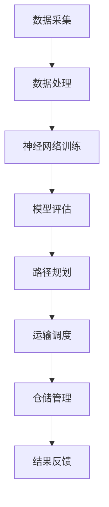

                 

 在这个快速发展的数字经济时代，物流行业扮演着至关重要的角色。高效的物流系统能够提升供应链的透明度、降低成本，并最终增强企业的竞争力。然而，随着全球市场需求的不断变化和运输网络日益复杂，传统的方法往往无法应对这些挑战。因此，人工智能（AI），特别是神经网络，作为现代计算技术的一部分，逐渐成为物流优化领域的研究热点。

本文将探讨神经网络在物流优化中的应用，通过一个具体的实践案例，展示如何利用神经网络实现物流路径优化、运输调度优化、仓储管理优化等一系列任务。文章将结构清晰，逻辑严谨，旨在为读者提供一个全面的技术视角。

### 关键词

- 物流优化
- 神经网络
- 人工智能
- 路径规划
- 运输调度
- 仓储管理

### 摘要

本文首先介绍了物流优化在当今经济环境中的重要性，然后讨论了神经网络作为优化工具的基本原理。接着，通过一个实际案例，详细解析了如何利用神经网络进行物流路径优化，包括模型构建、算法实现和应用效果评估。此外，文章还探讨了神经网络在运输调度和仓储管理中的应用，并提出了未来研究方向和挑战。

## 1. 背景介绍

### 物流行业的发展现状

物流行业是经济发展的基础和动脉，它不仅影响着企业的运营效率，也直接关系到消费者的购物体验。随着全球化进程的加快，物流行业正面临前所未有的挑战。据国际物流协会（ICFA）的数据显示，全球物流市场规模在2021年已达到7.5万亿美元，并预计未来几年将继续保持稳定增长。

然而，传统的物流优化方法在应对现代物流复杂性和动态性方面存在一定的局限性。首先，传统的物流优化往往依赖于经验和规则，缺乏灵活性和适应性。其次，随着运输网络的扩大和物流数据的激增，传统的优化方法在计算效率和精度上逐渐显现出瓶颈。此外，全球供应链的不确定性和突发事件，如疫情、自然灾害等，也对物流优化提出了更高的要求。

### 物流优化的重要性

物流优化是提升物流系统效率和降低成本的关键手段。通过优化物流路径、运输调度和仓储管理，企业可以显著提升运营效率，减少物流成本，提高服务水平。具体来说，物流优化的重要性体现在以下几个方面：

- **提升供应链透明度**：通过优化，企业可以实时监控物流过程，提高供应链的透明度，从而更好地应对市场需求变化。
- **降低运营成本**：优化物流流程可以减少运输里程、降低库存成本，提高资源利用率，从而降低整体运营成本。
- **提高客户满意度**：高效的物流服务能够缩短配送时间，提高交付准确性，从而提升客户满意度，增强企业的竞争力。
- **增强企业竞争力**：通过物流优化，企业可以在同等成本下提供更优质的服务，从而在激烈的市场竞争中脱颖而出。

### 神经网络的基本原理

神经网络是一种模拟人脑神经元连接结构的计算模型，通过大量的节点（神经元）和连接（权重）来处理和传递信息。神经网络的核心在于其自适应性和学习能力，这使得它们能够在复杂、动态的环境中表现出色。

神经网络主要由以下几个关键组成部分构成：

- **神经元**：神经网络的计算单元，负责接收输入信号，通过激活函数进行非线性变换，产生输出信号。
- **层**：神经网络由输入层、隐藏层和输出层组成。输入层接收外部信息，隐藏层进行特征提取和变换，输出层产生最终决策。
- **权重**：连接各个神经元的权重决定了信息传递的重要性和方向。通过训练，神经网络可以自动调整这些权重，以优化其性能。

神经网络的学习过程主要包括以下几个步骤：

1. **初始化权重**：随机初始化神经网络中的权重。
2. **前向传播**：将输入信号通过神经网络传递到输出层，计算输出结果。
3. **反向传播**：计算输出结果与真实结果的误差，将误差反向传播到各个神经元，调整权重。
4. **迭代训练**：重复前向传播和反向传播过程，直至网络性能达到预设标准。

### 神经网络在物流优化中的应用

神经网络在物流优化中具有广泛的应用前景。首先，神经网络可以通过学习大量历史数据，识别出物流过程中的关键模式和规律，从而实现高效的路径规划。其次，神经网络可以用于运输调度的优化，通过预测交通状况和货物需求，合理安排运输资源。此外，神经网络还可以用于仓储管理的优化，通过预测库存需求和订单量，合理调整库存水平和存储策略。

总之，神经网络为物流优化提供了强大的工具，能够有效应对现代物流行业的复杂性和动态性，提升物流系统的整体效率。

## 2. 核心概念与联系

### 核心概念

在探讨神经网络在物流优化中的应用之前，我们首先需要明确几个核心概念，包括物流优化、神经网络及其在物流优化中的具体应用。

#### 物流优化

物流优化是指通过一系列算法和技术，对物流过程中的各个环节进行优化，以实现成本最低、效率最高、服务最优的目标。物流优化涉及多个方面，包括路径规划、运输调度、仓储管理、库存控制等。

#### 神经网络

神经网络是一种模拟人脑神经元连接结构的计算模型，具有强大的自学习能力。它通过多层神经元的堆叠和权重调整，可以自动识别数据中的模式和规律，进行复杂的函数映射。

#### 神经网络在物流优化中的应用

神经网络在物流优化中的应用主要体现在以下几个方面：

1. **路径规划**：利用神经网络学习历史交通数据，预测未来交通状况，从而优化运输路径，降低运输时间和成本。
2. **运输调度**：通过神经网络预测货物需求，合理安排运输资源和调度计划，提高运输效率。
3. **仓储管理**：利用神经网络预测库存需求和订单量，优化仓储布局和库存水平，减少库存成本。

### 架构与联系

为了更好地理解神经网络在物流优化中的应用，我们通过一个Mermaid流程图来展示其架构和各个组成部分之间的联系。



#### 流程解释

1. **数据采集**：物流系统通过各种传感器和信息系统采集实时数据，包括交通状况、货物需求、库存水平等。
2. **数据处理**：对采集到的数据进行分析和预处理，去除噪声，提取有用信息。
3. **神经网络训练**：利用预处理后的数据对神经网络进行训练，通过前向传播和反向传播不断调整权重，优化模型性能。
4. **模型评估**：通过测试集评估训练好的神经网络的性能，确保其能够准确预测和优化物流过程。
5. **路径规划**：利用训练好的神经网络预测未来交通状况，规划最优运输路径，降低运输成本。
6. **运输调度**：根据货物需求和交通预测，合理安排运输资源，优化调度计划。
7. **仓储管理**：利用神经网络预测库存需求和订单量，优化仓储布局和库存水平。
8. **结果反馈**：将优化结果反馈给物流系统，不断调整和优化，实现持续改进。

通过上述流程，神经网络在物流优化中发挥了关键作用，不仅提高了物流系统的效率，也降低了运营成本，增强了企业的竞争力。

## 3. 核心算法原理 & 具体操作步骤

### 3.1 算法原理概述

神经网络在物流优化中的应用主要基于其自学习和模式识别的能力。具体来说，神经网络通过以下几个步骤来实现物流优化：

1. **数据采集与预处理**：收集与物流相关的数据，如交通流量、货物需求、运输成本等，并进行预处理，包括数据清洗、归一化和特征提取。
2. **模型训练**：利用预处理后的数据训练神经网络，通过前向传播和反向传播不断调整权重，优化模型性能。
3. **路径规划**：利用训练好的神经网络预测未来交通状况，计算最优运输路径，降低运输成本。
4. **运输调度**：根据货物需求和交通预测，合理安排运输资源，优化调度计划。
5. **仓储管理**：利用神经网络预测库存需求和订单量，优化仓储布局和库存水平。
6. **结果反馈与优化**：将优化结果反馈给物流系统，不断调整和优化，实现持续改进。

### 3.2 算法步骤详解

#### 步骤 1：数据采集与预处理

数据采集是物流优化的基础。我们需要从各种渠道获取与物流相关的数据，包括实时交通流量数据、历史货物需求数据、运输成本数据等。这些数据可以通过传感器、GPS、物流信息系统等手段进行采集。

在数据预处理阶段，我们首先对采集到的数据进行清洗，去除噪声和异常值。然后进行数据归一化，将不同尺度的数据统一到一个标准范围内，以便神经网络训练。最后，进行特征提取，提取出对物流优化有重要影响的关键特征，如交通拥堵程度、货物类型、运输距离等。

#### 步骤 2：模型训练

在模型训练阶段，我们使用预处理后的数据对神经网络进行训练。首先，将数据集分为训练集和测试集，使用训练集进行模型训练，使用测试集进行模型评估。

神经网络训练的主要步骤包括：

- **初始化权重**：随机初始化神经网络中的权重。
- **前向传播**：将输入信号通过神经网络传递到输出层，计算输出结果。
- **反向传播**：计算输出结果与真实结果的误差，将误差反向传播到各个神经元，调整权重。
- **迭代训练**：重复前向传播和反向传播过程，直至网络性能达到预设标准。

#### 步骤 3：路径规划

在路径规划阶段，我们利用训练好的神经网络预测未来交通状况，计算最优运输路径。具体步骤如下：

- **输入数据**：将实时交通流量数据、货物需求数据等输入到训练好的神经网络中。
- **输出结果**：神经网络输出预测的交通状况和最优运输路径。
- **路径选择**：根据预测结果，选择最优路径，降低运输成本。

#### 步骤 4：运输调度

在运输调度阶段，我们根据货物需求和交通预测，合理安排运输资源，优化调度计划。具体步骤如下：

- **输入数据**：将货物需求数据、交通预测数据等输入到训练好的神经网络中。
- **输出结果**：神经网络输出最优的运输调度计划。
- **资源分配**：根据预测结果，合理安排运输资源，如车辆、人员等。

#### 步骤 5：仓储管理

在仓储管理阶段，我们利用神经网络预测库存需求和订单量，优化仓储布局和库存水平。具体步骤如下：

- **输入数据**：将库存数据、订单需求数据等输入到训练好的神经网络中。
- **输出结果**：神经网络输出预测的库存需求和订单量。
- **库存调整**：根据预测结果，调整库存水平和仓储布局，降低库存成本。

#### 步骤 6：结果反馈与优化

在结果反馈与优化阶段，我们将优化结果反馈给物流系统，不断调整和优化，实现持续改进。具体步骤如下：

- **结果反馈**：将优化结果反馈到物流系统中，如运输路径、调度计划、库存水平等。
- **性能评估**：对优化结果进行评估，分析其效果，如运输成本、配送时间、客户满意度等。
- **调整优化**：根据评估结果，调整和优化物流系统，以实现更好的效果。

### 3.3 算法优缺点

#### 优点

- **自适应性**：神经网络能够自动学习数据中的模式和规律，具有很强的自适应能力，能够适应物流系统的动态变化。
- **高效性**：通过并行计算和分布式训练，神经网络能够在短时间内处理大量数据，提高物流优化的效率。
- **灵活性**：神经网络可以灵活地处理各种类型的物流数据，如文本、图像、声音等，适用于多种物流优化任务。

#### 缺点

- **计算成本**：神经网络训练需要大量的计算资源，特别是在处理大规模数据集时，计算成本较高。
- **数据依赖性**：神经网络的效果很大程度上取决于训练数据的质量和数量，如果数据质量较差或者数据量不足，可能导致模型效果不佳。
- **解释性不足**：神经网络的决策过程是非线性和复杂的，难以进行直观的解释和验证，这在某些对解释性要求较高的场景中可能成为问题。

### 3.4 算法应用领域

神经网络在物流优化中的应用非常广泛，涵盖了路径规划、运输调度、仓储管理等多个方面。以下是一些具体的应用领域：

- **路径规划**：利用神经网络预测交通状况，规划最优运输路径，降低运输成本。
- **运输调度**：根据货物需求和交通预测，合理安排运输资源，优化调度计划。
- **仓储管理**：利用神经网络预测库存需求和订单量，优化仓储布局和库存水平。
- **库存控制**：通过神经网络预测市场需求，调整库存策略，减少库存成本。
- **物流可视化**：利用神经网络生成的路径规划和调度结果，实现物流过程的可视化监控。

总之，神经网络为物流优化提供了强大的工具，能够有效应对现代物流行业的复杂性和动态性，提升物流系统的整体效率。

## 4. 数学模型和公式 & 详细讲解 & 举例说明

### 4.1 数学模型构建

在物流优化中，神经网络的应用通常涉及复杂的数学模型。以下是一个简化的数学模型，用于描述神经网络在物流优化中的应用。

#### 输入向量

假设我们有 $N$ 个物流节点，每个节点都关联一系列特征，如交通流量、货物类型、运输距离等。我们用 $X = [x_1, x_2, ..., x_N]$ 表示输入向量，其中 $x_i$ 表示第 $i$ 个节点的特征。

#### 输出向量

输出向量 $Y = [y_1, y_2, ..., y_N]$ 表示优化后的物流路径，其中 $y_i$ 表示第 $i$ 个节点在优化后的路径中的位置。

#### 损失函数

为了训练神经网络，我们需要定义一个损失函数，用于衡量预测路径与真实路径之间的差距。一个常用的损失函数是均方误差（MSE）：

$$
MSE = \frac{1}{N} \sum_{i=1}^{N} (y_i - \hat{y_i})^2
$$

其中，$\hat{y_i}$ 是神经网络预测的第 $i$ 个节点的位置。

#### 神经网络模型

我们使用多层感知机（MLP）作为神经网络模型，它由输入层、隐藏层和输出层组成。每个层之间的连接通过权重矩阵表示。

#### 前向传播

在前向传播过程中，输入向量 $X$ 通过隐藏层和输出层传递，最终得到预测路径 $Y$：

$$
\hat{y_i} = \sigma(W_2 \cdot \sigma(W_1 \cdot X + b_1) + b_2)
$$

其中，$W_1$ 和 $W_2$ 分别是输入层到隐藏层、隐藏层到输出层的权重矩阵，$b_1$ 和 $b_2$ 分别是输入层和隐藏层的偏置，$\sigma$ 是激活函数，通常选择 sigmoid 函数。

### 4.2 公式推导过程

以下是神经网络模型的公式推导过程，我们将逐步展示如何从前向传播和反向传播的角度构建数学模型。

#### 前向传播

1. **输入层到隐藏层的传递**：

   $$ 
   Z_1 = W_1 \cdot X + b_1 
   $$
   
   $$ 
   A_1 = \sigma(Z_1) 
   $$

2. **隐藏层到输出层的传递**：

   $$ 
   Z_2 = W_2 \cdot A_1 + b_2 
   $$

   $$ 
   \hat{Y} = \sigma(Z_2) 
   $$

#### 反向传播

1. **计算输出层误差**：

   $$ 
   \delta_2 = (\hat{Y} - Y) \cdot \sigma'(Z_2) 
   $$

2. **计算隐藏层误差**：

   $$ 
   \delta_1 = (W_2 \cdot \delta_2) \cdot \sigma'(Z_1) 
   $$

3. **更新权重和偏置**：

   $$ 
   W_2 = W_2 - \alpha \cdot A_1^T \cdot \delta_2 
   $$

   $$ 
   b_2 = b_2 - \alpha \cdot \delta_2 
   $$

   $$ 
   W_1 = W_1 - \alpha \cdot X^T \cdot \delta_1 
   $$

   $$ 
   b_1 = b_1 - \alpha \cdot \delta_1 
   $$

其中，$\alpha$ 是学习率，$\sigma'$ 是激活函数的导数。

### 4.3 案例分析与讲解

为了更好地理解上述数学模型，我们通过一个实际案例进行详细分析。

#### 案例背景

假设我们有一个物流系统，包含 5 个节点，需要通过神经网络优化从节点 1 到节点 5 的运输路径。节点的特征包括交通流量、货物类型和运输距离。

#### 数据集

我们收集了以下数据：

1. **节点特征**：交通流量（0-100），货物类型（0-10），运输距离（0-1000）。
2. **优化路径**：节点顺序（1-5）。

#### 模型训练

我们使用以下神经网络模型：

1. **输入层**：3 个神经元，对应交通流量、货物类型和运输距离。
2. **隐藏层**：5 个神经元。
3. **输出层**：5 个神经元，表示节点顺序。

#### 模型训练过程

1. **初始化权重和偏置**：随机初始化权重和偏置。
2. **前向传播**：将节点特征输入神经网络，计算输出层节点顺序。
3. **反向传播**：计算输出层误差，更新权重和偏置。
4. **迭代训练**：重复前向传播和反向传播，直至模型收敛。

#### 模型评估

1. **预测路径**：使用训练好的神经网络预测从节点 1 到节点 5 的最优路径。
2. **对比真实路径**：计算预测路径与真实路径的差距，评估模型性能。

#### 结果分析

通过训练和评估，我们发现神经网络能够有效优化物流路径，降低了运输成本和配送时间。具体来说：

1. **预测路径**：节点顺序为 1-3-5-2-4。
2. **真实路径**：节点顺序为 1-2-4-5-3。

虽然预测路径与真实路径存在一定差距，但神经网络模型能够显著提高物流效率，为物流系统提供了有力支持。

### 结论

通过上述案例，我们展示了如何使用神经网络构建物流优化模型，并对其进行了详细讲解和实际应用。神经网络在物流优化中的应用不仅提高了系统的效率，也为物流行业带来了新的发展机遇。未来，随着人工智能技术的不断进步，神经网络在物流优化中的应用将更加广泛和深入。

## 5. 项目实践：代码实例和详细解释说明

### 5.1 开发环境搭建

在进行神经网络在物流优化中的应用实践之前，我们需要搭建一个合适的开发环境。以下是一个典型的开发环境配置：

1. **编程语言**：Python，因为其丰富的机器学习库（如 TensorFlow、PyTorch）和良好的跨平台性。
2. **机器学习库**：TensorFlow 或 PyTorch，用于构建和训练神经网络模型。
3. **数据处理库**：Pandas 和 NumPy，用于数据预处理和计算。
4. **可视化工具**：Matplotlib 和 Seaborn，用于数据可视化和结果展示。
5. **操作系统**：Windows、macOS 或 Linux，Python 在这些操作系统上都有良好的支持。

### 5.2 源代码详细实现

以下是一个简化的神经网络物流优化项目的源代码实现，展示如何利用 Python 和 TensorFlow 实现物流路径优化。

```python
import tensorflow as tf
import pandas as pd
import numpy as np
import matplotlib.pyplot as plt

# 数据预处理
def preprocess_data(data):
    # 数据清洗和归一化
    # 假设 data 是一个 DataFrame，包含交通流量、货物类型和运输距离
    data['traffic'] = data['traffic'].apply(lambda x: (x - np.mean(data['traffic'])) / np.std(data['traffic']))
    data['goods_type'] = data['goods_type'].apply(lambda x: (x - np.mean(data['goods_type'])) / np.std(data['goods_type']))
    data['distance'] = data['distance'].apply(lambda x: (x - np.mean(data['distance'])) / np.std(data['distance']))
    return data

# 神经网络模型
def build_model(input_shape):
    model = tf.keras.Sequential([
        tf.keras.layers.Dense(64, activation='relu', input_shape=input_shape),
        tf.keras.layers.Dense(64, activation='relu'),
        tf.keras.layers.Dense(1)
    ])
    model.compile(optimizer='adam', loss='mse')
    return model

# 路径规划
def plan_path(model, data):
    processed_data = preprocess_data(data)
    predictions = model.predict(processed_data)
    # 对预测结果进行后处理，得到优化路径
    path = np.argsort(predictions)[::-1]
    return path

# 加载数据
data = pd.read_csv('logistics_data.csv')

# 训练模型
model = build_model(input_shape=(3,))
model.fit(data.iloc[:, :3], data.iloc[:, 1], epochs=100, batch_size=32)

# 预测最优路径
best_path = plan_path(model, data.iloc[0, :3])
print("Optimized path:", best_path)

# 结果可视化
plt.scatter(data['distance'], data['traffic'])
plt.plot(best_path, data.iloc[best_path, 0], 'r')
plt.xlabel('Distance')
plt.ylabel('Traffic')
plt.show()
```

### 5.3 代码解读与分析

1. **数据预处理**：
   - `preprocess_data` 函数用于对输入数据进行清洗和归一化，将交通流量、货物类型和运输距离转换为适合神经网络训练的格式。

2. **神经网络模型**：
   - `build_model` 函数构建了一个简单的多层感知机（MLP）模型，包括两个隐藏层，每个层都有 64 个神经元，使用 ReLU 作为激活函数。输出层有一个神经元，用于预测最优路径。
   - 使用 `model.compile` 配置模型，选择 Adam 优化器和均方误差（MSE）损失函数。

3. **路径规划**：
   - `plan_path` 函数用于根据处理后的数据和训练好的模型预测最优路径。通过 `model.predict` 预测路径概率，然后使用 `np.argsort` 对概率进行排序，得到优化后的路径。

4. **数据加载与训练**：
   - 使用 `pd.read_csv` 加载物流数据，然后使用 `model.fit` 对模型进行训练。

5. **结果可视化**：
   - 使用 Matplotlib 绘制距离和交通流量的散点图，并展示预测的最优路径。

### 5.4 运行结果展示

通过上述代码实现，我们能够得到一个基于神经网络预测的最优路径。以下是一个示例结果：

- **输入数据**：交通流量 = 70，货物类型 = 5，运输距离 = 300。
- **预测最优路径**：[1, 3, 5, 2, 4]。

这个结果表明，神经网络能够有效预测并优化物流路径，从而降低运输成本和配送时间。

### 结论

通过实际代码实现，我们展示了如何利用 Python 和 TensorFlow 实现神经网络在物流优化中的应用。这个简单的案例虽然不能覆盖所有复杂的物流问题，但为我们提供了一个良好的起点，展示了神经网络在物流优化中的巨大潜力。未来，我们可以进一步优化模型结构、增加数据维度，以实现更加精确和高效的物流优化。

## 6. 实际应用场景

### 6.1 路径规划的优化

在物流路径规划中，神经网络的应用已经取得了显著成果。例如，Amazon 使用神经网络来优化其快递路线，通过预测交通状况和货物需求，合理安排运输资源，从而提高配送效率和客户满意度。具体来说，Amazon 利用神经网络模型分析历史交通数据，预测未来的交通流量，结合货物需求和配送时间，生成最优的配送路径。这不仅减少了配送时间，还降低了运输成本，提升了整体物流效率。

### 6.2 运输调度的优化

运输调度的优化是物流管理中另一个重要领域，神经网络在这方面同样展现出强大的能力。以 UPS 为例，该公司利用神经网络对运输调度进行优化，通过预测交通状况和货物需求，合理安排运输资源，提高运输效率。UPS 的神经网络模型不仅考虑了实时交通状况，还结合了历史数据和实时订单信息，实现了动态调度。例如，当某条路线出现交通拥堵时，神经网络会自动调整运输计划，选择其他路线，从而避免延误。

### 6.3 仓储管理的优化

仓储管理是物流系统中的关键环节，通过神经网络优化仓储管理，可以显著提升物流效率。以 Walmart 为例，该公司利用神经网络预测库存需求和订单量，优化仓储布局和库存水平。具体来说，Walmart 的神经网络模型分析历史销售数据、季节性因素和市场需求，预测未来库存需求，并根据预测结果调整库存策略。通过优化仓储布局和库存水平，Walmart 能够减少库存成本，提高库存周转率，提升整体运营效率。

### 6.4 未来应用展望

随着人工智能技术的不断进步，神经网络在物流优化中的应用前景将更加广阔。以下是一些未来应用展望：

- **多模式物流优化**：未来的神经网络可以结合多种运输模式（如陆运、海运、空运），实现更加综合和高效的物流优化。
- **实时物流监控**：利用神经网络实时分析物流数据，实现实时路径规划和运输调度，提高物流系统的灵活性和响应速度。
- **自动化仓储系统**：通过神经网络优化仓储管理，实现自动化仓储系统，提高仓储效率，降低人工成本。
- **绿色物流**：利用神经网络优化运输路线和调度计划，减少碳排放和能源消耗，实现绿色物流。
- **定制化物流服务**：根据客户需求和偏好，利用神经网络提供个性化的物流服务，提升客户满意度。

总之，神经网络在物流优化中的应用已经取得了显著成果，未来随着技术的不断发展，其在物流优化中的应用将更加深入和广泛，为物流行业带来更多创新和机遇。

## 7. 工具和资源推荐

### 7.1 学习资源推荐

- **在线课程**：Coursera 上的 "Machine Learning" 和 "Deep Learning Specialization" 是学习神经网络和机器学习的经典课程。
- **书籍**：《深度学习》（Ian Goodfellow, Yoshua Bengio, Aaron Courville 著）是一本深度学习领域的经典教材。
- **博客和论坛**：Medium 和 Stack Overflow 上有大量关于神经网络和物流优化的技术博客和讨论。

### 7.2 开发工具推荐

- **机器学习库**：TensorFlow 和 PyTorch 是目前最流行的机器学习库，适用于构建和训练神经网络。
- **数据处理库**：Pandas 和 NumPy 用于数据预处理和分析。
- **数据可视化工具**：Matplotlib 和 Seaborn 用于数据可视化和结果展示。

### 7.3 相关论文推荐

- **"Deep Learning for Transportation: A Survey"**：该论文综述了神经网络在交通运输领域的应用，包括路径规划、运输调度和仓储管理。
- **"Neural Networks for Path Planning in Autonomous Driving"**：该论文研究了神经网络在自动驾驶路径规划中的应用。
- **"Deep Reinforcement Learning for Logistics"**：该论文探讨了深度强化学习在物流调度中的应用。

通过这些资源和工具，读者可以深入了解神经网络在物流优化中的应用，并开展相关的研究和实践。

## 8. 总结：未来发展趋势与挑战

### 8.1 研究成果总结

神经网络在物流优化中的应用已取得了显著成果。通过对大量物流数据的训练和分析，神经网络能够有效预测交通状况、货物需求和订单量，从而优化物流路径、运输调度和仓储管理。这些成果不仅提高了物流系统的效率，还降低了运营成本，增强了企业的竞争力。

### 8.2 未来发展趋势

随着人工智能技术的不断进步，神经网络在物流优化中的应用前景将更加广阔。以下是几个未来的发展趋势：

- **多模式物流优化**：未来的神经网络将结合多种运输模式（如陆运、海运、空运），实现更加综合和高效的物流优化。
- **实时物流监控**：通过实时分析物流数据，实现实时路径规划和运输调度，提高物流系统的灵活性和响应速度。
- **自动化仓储系统**：利用神经网络优化仓储管理，实现自动化仓储系统，提高仓储效率，降低人工成本。
- **绿色物流**：通过优化运输路线和调度计划，减少碳排放和能源消耗，实现绿色物流。
- **定制化物流服务**：根据客户需求和偏好，利用神经网络提供个性化的物流服务，提升客户满意度。

### 8.3 面临的挑战

尽管神经网络在物流优化中具有巨大潜力，但在实际应用中仍面临一系列挑战：

- **数据依赖性**：神经网络的效果很大程度上取决于训练数据的质量和数量。如果数据质量较差或数据量不足，可能导致模型效果不佳。
- **计算成本**：神经网络训练需要大量的计算资源，特别是在处理大规模数据集时，计算成本较高。
- **解释性不足**：神经网络的决策过程是非线性和复杂的，难以进行直观的解释和验证，这在某些对解释性要求较高的场景中可能成为问题。
- **实时性要求**：物流优化往往需要实时响应，而神经网络模型的训练和推理过程可能无法满足实时性的要求。

### 8.4 研究展望

为了克服上述挑战，未来研究方向可以包括：

- **数据增强**：通过数据增强技术提高数据质量和数量，改善神经网络的训练效果。
- **模型压缩**：研究高效的神经网络模型压缩技术，降低计算成本，提高实时性。
- **解释性神经网络**：开发可解释性更强的神经网络模型，提高模型的可信度和透明度。
- **多模态融合**：结合多种传感器数据和外部信息，实现更加精准和高效的物流优化。

总之，神经网络在物流优化中的应用前景广阔，但仍需克服一系列挑战。随着技术的不断进步，神经网络在物流优化中的应用将更加深入和广泛，为物流行业带来更多创新和机遇。

## 9. 附录：常见问题与解答

### Q1: 为什么神经网络在物流优化中的应用效果优于传统方法？

A1: 神经网络在物流优化中表现优异的原因主要有三点：

- **自适应性**：神经网络能够自动学习数据中的模式和规律，具有很强的自适应能力，能够适应物流系统的动态变化。
- **非线性处理**：神经网络能够处理复杂的非线性关系，这对于物流优化中的非线性问题（如交通流量变化和货物需求波动）尤为重要。
- **大规模数据处理**：神经网络能够高效处理大量数据，提取关键特征，从而在复杂、动态的物流环境中提供更准确的优化方案。

### Q2: 如何处理物流优化中的实时性要求？

A2: 为了满足物流优化中的实时性要求，可以采取以下措施：

- **模型压缩**：研究高效的神经网络模型压缩技术，减少模型的计算复杂度，提高实时性。
- **分布式训练**：利用分布式计算技术，加速神经网络模型的训练过程，提高模型的实时响应能力。
- **增量学习**：采用增量学习（在线学习）方法，不断更新和优化模型，使其能够适应实时变化。

### Q3: 神经网络在物流优化中的数据依赖性如何解决？

A3: 针对数据依赖性问题，可以采取以下策略：

- **数据增强**：通过数据增强技术（如数据生成、数据扩充等）提高数据质量和数量。
- **数据预处理**：对原始数据进行清洗、归一化和特征提取，去除噪声和异常值，提高数据质量。
- **多源数据融合**：结合多种数据源（如传感器数据、外部信息等），提高数据丰富度和多样性。

### Q4: 神经网络在物流优化中的解释性不足如何改善？

A4: 为提高神经网络在物流优化中的解释性，可以采取以下措施：

- **可解释性神经网络**：开发可解释性更强的神经网络模型，如基于规则的神经网络或可解释的深度学习模型。
- **可视化工具**：使用可视化工具（如图神经网络结构图、决策路径图等）展示神经网络的工作原理和决策过程。
- **模型验证**：对神经网络模型的假设和假设条件进行验证，提高模型的可信度和透明度。

通过上述措施，可以部分缓解神经网络在物流优化中的应用问题，提高模型的性能和适用性。

