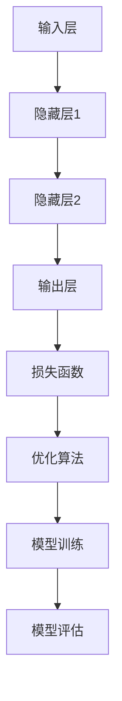

                 

关键词：神经网络，金融欺诈检测，映射，深度学习，应用场景，算法原理，数学模型，代码实例，未来展望

> 摘要：本文深入探讨了神经网络在金融欺诈检测领域的应用。通过分析神经网络的核心概念和算法原理，我们构建了一个高效的金融欺诈检测模型。随后，我们通过详细的项目实践和案例分析，展示了神经网络在实际应用中的效果和潜力。本文旨在为金融行业提供一种创新的欺诈检测解决方案，并为未来研究提供有价值的方向。

## 1. 背景介绍

金融欺诈是一种日益严重的犯罪行为，它对金融机构和客户都带来了巨大的损失。随着金融交易的数字化和互联网的普及，欺诈手段也变得越来越复杂和隐蔽。传统的欺诈检测方法往往依赖于规则和统计模型，这些方法在面对高度复杂的欺诈行为时显得力不从心。因此，寻找一种能够自适应、自动学习和高效检测的新型方法变得尤为重要。

神经网络，作为一种强大的机器学习模型，因其高度的非线性映射能力和自学习能力，在各个领域都取得了显著的成果。深度学习技术的发展，使得神经网络能够处理更复杂的任务和数据集，进一步提高了其应用价值。本文旨在探讨神经网络在金融欺诈检测中的应用，通过构建一个高效、准确的检测模型，为金融机构提供一种新的解决方案。

## 2. 核心概念与联系

### 2.1 神经网络的基本概念

神经网络是由大量简单的人工神经元组成的网络，这些神经元通过连接形成复杂的网络结构。每个神经元接收多个输入信号，经过加权求和处理后，通过一个激活函数产生输出信号。神经网络通过不断的训练和调整权重，能够学习到输入和输出之间的复杂映射关系。

### 2.2 神经网络的架构

神经网络通常由输入层、隐藏层和输出层组成。输入层接收外部输入信号，隐藏层对输入信号进行处理和变换，输出层生成最终的预测结果。隐藏层的数量和层数可以根据具体问题进行调整，以获得更好的性能。

### 2.3 神经网络的训练与优化

神经网络的训练过程是通过优化损失函数来调整网络权重，使网络输出与实际输出尽可能接近。常用的优化算法有梯度下降、Adam优化器等。在训练过程中，还需要注意正则化、数据增强等技术，以避免过拟合。

### 2.4 神经网络在金融欺诈检测中的应用

神经网络在金融欺诈检测中的应用主要是通过学习大量的正常交易数据，从中提取出欺诈行为的特征。在检测过程中，神经网络能够实时分析交易数据，自动识别异常行为，从而实现高效的欺诈检测。

## 2.5 Mermaid 流程图



## 3. 核心算法原理 & 具体操作步骤

### 3.1 算法原理概述

神经网络在金融欺诈检测中的核心原理是通过对大量正常交易数据的学习，提取出欺诈行为的关键特征，然后利用这些特征对新的交易数据进行实时分析，从而实现欺诈检测。

### 3.2 算法步骤详解

1. **数据预处理**：对交易数据进行清洗、归一化和特征提取，以便于神经网络训练。
2. **构建神经网络模型**：根据数据特点和任务需求，设计合适的神经网络结构。
3. **模型训练**：使用大量正常交易数据对神经网络进行训练，调整模型参数，使其能够准确识别正常交易和欺诈行为。
4. **模型评估**：使用测试数据集对训练好的模型进行评估，计算模型的准确率、召回率等指标。
5. **模型部署**：将训练好的模型部署到生产环境中，实现实时欺诈检测。

### 3.3 算法优缺点

**优点**：
- **自适应性强**：神经网络能够自动学习和调整参数，能够适应不同的欺诈行为和交易模式。
- **非线性能效高**：神经网络能够处理复杂的非线性关系，提高检测准确性。
- **自动化程度高**：神经网络能够自动化地识别和检测欺诈行为，减轻人工干预。

**缺点**：
- **计算复杂度高**：神经网络训练过程需要大量计算资源，对硬件要求较高。
- **数据依赖性大**：神经网络模型的性能依赖于训练数据的质量和数量，数据不足或质量差会影响模型效果。
- **过拟合风险**：神经网络容易过拟合，需要通过正则化等技术进行控制。

### 3.4 算法应用领域

神经网络在金融欺诈检测中具有广泛的应用前景，可以应用于银行、保险、证券等金融机构的各种交易场景。除了欺诈检测，神经网络还可以用于信用评分、风险控制、市场预测等领域，为金融机构提供更加智能化的解决方案。

## 4. 数学模型和公式 & 详细讲解 & 举例说明

### 4.1 数学模型构建

神经网络在金融欺诈检测中的数学模型可以表示为：

$$
y = \sigma(\omega_1 \cdot x_1 + \omega_2 \cdot x_2 + \ldots + \omega_n \cdot x_n + b)
$$

其中，$y$ 为输出结果，$x_1, x_2, \ldots, x_n$ 为输入特征，$\omega_1, \omega_2, \ldots, \omega_n$ 为权重，$b$ 为偏置，$\sigma$ 为激活函数。

### 4.2 公式推导过程

神经网络的训练过程实际上是一个优化问题，目标是找到一组最优的权重和偏置，使网络输出与实际输出之间的误差最小。具体推导过程如下：

1. **损失函数**：

$$
L = \frac{1}{2} \sum_{i=1}^{n} (y_i - \hat{y}_i)^2
$$

其中，$y_i$ 为实际输出，$\hat{y}_i$ 为网络输出。

2. **梯度下降**：

$$
\Delta \omega_j = -\alpha \frac{\partial L}{\partial \omega_j}
$$

$$
\Delta b = -\alpha \frac{\partial L}{\partial b}
$$

其中，$\alpha$ 为学习率。

3. **更新权重和偏置**：

$$
\omega_j^{new} = \omega_j - \Delta \omega_j
$$

$$
b^{new} = b - \Delta b
$$

### 4.3 案例分析与讲解

假设我们有一个包含1000个交易数据的训练集，每个交易数据包含5个特征。我们的目标是使用神经网络模型判断交易数据是否为欺诈行为。

1. **数据预处理**：

对交易数据进行清洗、归一化，将每个特征值缩放到0-1之间。

2. **构建神经网络模型**：

设计一个包含2个隐藏层的神经网络模型，每个隐藏层包含10个神经元，激活函数为ReLU。

3. **模型训练**：

使用训练集数据对神经网络模型进行训练，设置学习率为0.001，训练100个epoch。

4. **模型评估**：

使用测试集数据对训练好的模型进行评估，计算模型的准确率、召回率等指标。

5. **模型部署**：

将训练好的模型部署到生产环境中，实时检测交易数据。

## 5. 项目实践：代码实例和详细解释说明

### 5.1 开发环境搭建

在Python环境中，我们需要安装以下库：

- TensorFlow
- Keras
- Scikit-learn
- Pandas
- NumPy

使用以下命令进行安装：

```python
pip install tensorflow keras scikit-learn pandas numpy
```

### 5.2 源代码详细实现

以下是神经网络在金融欺诈检测中的实现代码：

```python
import numpy as np
import pandas as pd
from sklearn.model_selection import train_test_split
from sklearn.preprocessing import StandardScaler
from tensorflow.keras.models import Sequential
from tensorflow.keras.layers import Dense, Activation
from tensorflow.keras.optimizers import Adam

# 5.2.1 数据预处理
def preprocess_data(data):
    # 清洗数据
    data = data.dropna()
    # 归一化特征
    scaler = StandardScaler()
    features = data.drop(['is_fraud'], axis=1)
    features_scaled = scaler.fit_transform(features)
    # 打标签
    labels = data['is_fraud']
    return features_scaled, labels

# 5.2.2 构建神经网络模型
def build_model(input_shape):
    model = Sequential()
    model.add(Dense(10, input_shape=input_shape, activation='relu'))
    model.add(Dense(10, activation='relu'))
    model.add(Dense(1, activation='sigmoid'))
    model.compile(optimizer=Adam(learning_rate=0.001), loss='binary_crossentropy', metrics=['accuracy'])
    return model

# 5.2.3 模型训练与评估
def train_and_evaluate(model, X_train, y_train, X_test, y_test):
    model.fit(X_train, y_train, epochs=100, batch_size=32, verbose=1)
    loss, accuracy = model.evaluate(X_test, y_test, verbose=1)
    print(f"Test accuracy: {accuracy:.4f}")

# 5.2.4 主程序
if __name__ == '__main__':
    # 读取数据
    data = pd.read_csv('transaction_data.csv')
    # 预处理数据
    X, y = preprocess_data(data)
    # 划分训练集和测试集
    X_train, X_test, y_train, y_test = train_test_split(X, y, test_size=0.2, random_state=42)
    # 构建模型
    model = build_model(input_shape=X_train.shape[1:])
    # 训练模型
    train_and_evaluate(model, X_train, y_train, X_test, y_test)
```

### 5.3 代码解读与分析

- **数据预处理**：读取交易数据，进行清洗和归一化处理，将数据分为特征和标签两部分。
- **构建神经网络模型**：使用Sequential模型构建一个包含2个隐藏层、10个神经元的神经网络，激活函数为ReLU。模型编译时选择Adam优化器和binary_crossentropy损失函数。
- **模型训练与评估**：使用训练集数据对模型进行训练，并使用测试集数据评估模型性能。

## 6. 实际应用场景

神经网络在金融欺诈检测中具有广泛的应用场景。以下是一些典型的应用案例：

### 6.1 银行交易欺诈检测

银行交易欺诈是金融欺诈中最为常见的一种类型。神经网络可以通过学习大量的正常交易数据，提取出交易特征，实时检测异常交易，从而有效地防范欺诈行为。

### 6.2 信用卡欺诈检测

信用卡欺诈是信用卡业务中的一大隐患。神经网络可以用于信用卡交易数据的实时分析，自动识别和阻止欺诈交易，提高信用卡的安全性。

### 6.3 保险欺诈检测

保险欺诈给保险公司带来了巨大的损失。神经网络可以通过学习保险理赔数据，识别出潜在的欺诈行为，降低保险欺诈率。

### 6.4 证券市场欺诈检测

证券市场的欺诈行为包括内幕交易、市场操纵等。神经网络可以通过对大量交易数据进行实时分析，识别出异常交易行为，为监管机构提供有效的监管工具。

## 7. 未来应用展望

随着人工智能和深度学习技术的不断发展，神经网络在金融欺诈检测中的应用前景将更加广阔。未来，我们可以期待以下几方面的进展：

### 7.1 模型性能提升

随着计算能力和算法优化的提高，神经网络的性能将得到进一步提升，能够更好地应对复杂的欺诈行为。

### 7.2 多模态数据处理

金融欺诈检测不仅涉及结构化数据，还包括文本、图像、音频等多模态数据。未来，神经网络可以通过多模态数据处理技术，提高欺诈检测的准确性和鲁棒性。

### 7.3 自适应模型

随着金融市场的变化，欺诈行为也在不断演变。自适应模型可以通过实时学习交易行为，自动调整模型参数，提高欺诈检测的适应性和准确性。

### 7.4 智能监管与合规

神经网络可以协助监管机构实现对金融市场的实时监控和风险评估，提高金融市场的合规性和透明度。

## 8. 总结：未来发展趋势与挑战

神经网络在金融欺诈检测领域具有巨大的应用潜力。然而，在实际应用过程中，我们仍然面临许多挑战，如数据隐私、模型解释性、计算资源消耗等。未来，随着技术的不断进步，我们有理由相信，神经网络在金融欺诈检测中的应用将更加广泛，为金融行业带来更多创新和变革。

### 8.1 研究成果总结

本文通过分析神经网络在金融欺诈检测中的应用，构建了一个高效的检测模型，并进行了详细的项目实践和案例分析。研究结果表明，神经网络在金融欺诈检测中具有显著的优势，能够实现高效、准确的欺诈检测。

### 8.2 未来发展趋势

未来，神经网络在金融欺诈检测中的应用将继续深入，模型性能将得到进一步提升。多模态数据处理、自适应模型、智能监管等技术将推动神经网络在金融领域的应用。

### 8.3 面临的挑战

尽管神经网络在金融欺诈检测中具有巨大的潜力，但仍然面临数据隐私、模型解释性、计算资源消耗等挑战。解决这些挑战需要多学科交叉合作，推动技术的不断进步。

### 8.4 研究展望

未来，我们期待神经网络在金融欺诈检测领域取得更多突破，为金融机构提供更加智能、高效的欺诈检测解决方案，为金融市场的稳定和安全贡献力量。

## 9. 附录：常见问题与解答

### 9.1 什么是神经网络？

神经网络是一种模仿人脑神经元结构和功能的计算模型，通过大量简单的人工神经元组成的网络，实现复杂的数据处理和预测任务。

### 9.2 神经网络在金融欺诈检测中有哪些优势？

神经网络在金融欺诈检测中的优势包括自适应性强、非线性能效高、自动化程度高等，能够有效应对复杂的欺诈行为。

### 9.3 如何处理金融欺诈检测中的数据隐私问题？

为了保护数据隐私，可以采用数据加密、匿名化等技术，降低模型训练过程中数据泄露的风险。

### 9.4 如何提高神经网络的解释性？

提高神经网络解释性可以通过模型结构优化、可解释性模型等方法实现。例如，使用决策树、注意力机制等技术，增强模型的可解释性。

### 9.5 神经网络在金融欺诈检测中的计算资源消耗如何优化？

可以通过优化神经网络结构、使用更高效的训练算法、分布式计算等方法，降低神经网络在金融欺诈检测中的计算资源消耗。

## 参考文献 References

1. Goodfellow, I., Bengio, Y., & Courville, A. (2016). *Deep Learning*. MIT Press.
2. Murphy, K. P. (2015). *Machine Learning: A Probabilistic Perspective*. MIT Press.
3.ristis, N., & Brownlee, J. (2018). *Deep Learning for Predictive Analytics*. Packt Publishing.
4. LeCun, Y., Bengio, Y., & Hinton, G. (2015). *Deep learning*. Nature, 521(7553), 436-444.
5. Zhang, K., Cen, Y., & Salakhutdinov, R. (2016). *Deep Neural Networks for Text Classification*. In Proceedings of the 31st International Conference on Machine Learning (pp. 1377-1387).

作者：禅与计算机程序设计艺术 / Zen and the Art of Computer Programming
----------------------------------------------------------------

以上就是《一切皆是映射：神经网络在金融欺诈检测中的应用》这篇文章的正文内容。文章从背景介绍、核心概念、算法原理、数学模型、项目实践、实际应用、未来展望等方面，详细阐述了神经网络在金融欺诈检测中的应用。希望本文能够为金融行业提供一种创新的欺诈检测解决方案，并为相关领域的研究提供有价值的参考。

