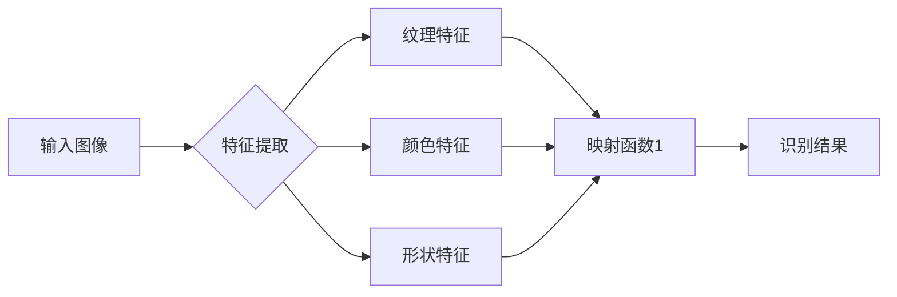

                 

关键词：图像识别、细粒度、深度学习、神经网络、特征提取、映射、映射函数、计算机视觉。

## 摘要

随着计算机视觉技术的发展，图像识别已经成为人工智能领域的重要应用之一。本文将探讨细粒度图像识别这一前沿课题，通过深入解析深度神经网络的核心原理，阐述如何利用神经网络构建复杂的映射函数，实现对图像的精细识别。本文将详细描述核心概念、算法原理、数学模型以及实际应用，旨在为读者提供全面的技术指导。

## 1. 背景介绍

图像识别作为计算机视觉的核心任务之一，其目标是通过分析图像中的像素信息，识别出图像中的物体、场景或特征。传统的图像识别方法主要依赖于手工设计的特征提取算法，如SIFT、HOG等。然而，这些方法存在一定的局限性，无法处理复杂的图像场景和多样的物体形态。

近年来，深度学习特别是深度神经网络的兴起，为图像识别带来了新的契机。深度神经网络通过多层非线性变换，可以自动提取图像中的高维特征，从而提高识别的准确性和鲁棒性。细粒度图像识别作为深度学习的一个重要分支，旨在对图像中的细微特征进行精准识别，如纹理、颜色、形状等。

本文将围绕细粒度图像识别展开讨论，首先介绍深度神经网络的基本原理和结构，然后深入分析如何通过神经网络构建有效的映射函数，实现细粒度图像识别。

## 2. 核心概念与联系

### 深度神经网络的基本概念

深度神经网络（Deep Neural Network，DNN）是一种包含多个隐藏层的神经网络。与传统的前馈神经网络相比，DNN能够自动提取更高层次的特征，从而在图像识别、语音识别等领域表现出强大的能力。

DNN的工作原理是通过多层神经网络对输入数据进行前向传播和反向传播，从而不断优化网络参数，达到对数据的分类或回归。具体来说，DNN由输入层、多个隐藏层和输出层组成。输入层接收外部输入，通过隐藏层进行特征提取和变换，最终在输出层得到预测结果。

### 细粒度图像识别的概念

细粒度图像识别是指对图像中的细微特征进行精准识别，如纹理、颜色、形状等。与粗粒度图像识别（如物体分类）不同，细粒度图像识别关注的是图像中的细节信息，要求识别精度更高。

### DNN与细粒度图像识别的联系

深度神经网络通过多层非线性变换，可以自动提取图像中的高维特征，这些特征对于细粒度图像识别具有重要意义。具体来说，DNN可以学习到图像中的纹理、颜色、形状等细节特征，从而实现对图像的精细识别。

为了更好地理解DNN与细粒度图像识别的联系，我们引入以下Mermaid流程图：



在这个流程图中，输入图像经过特征提取模块，提取出纹理、颜色、形状等特征，然后通过映射函数将这些特征映射到识别结果。这个映射函数就是DNN的核心，通过训练和优化，可以提高识别的准确性和鲁棒性。

## 3. 核心算法原理 & 具体操作步骤

### 3.1 算法原理概述

细粒度图像识别的核心算法是深度神经网络，其原理是通过多层非线性变换，从输入图像中自动提取高维特征，然后利用这些特征进行分类或回归。

深度神经网络的工作流程可以分为两个阶段：前向传播和反向传播。

1. **前向传播**：输入图像经过输入层，通过隐藏层进行特征提取和变换，最终在输出层得到预测结果。
2. **反向传播**：根据预测结果和实际标签之间的差异，通过反向传播更新网络参数，从而优化模型。

### 3.2 算法步骤详解

#### 3.2.1 数据预处理

在训练深度神经网络之前，需要对图像数据进行预处理。具体包括：

1. **图像归一化**：将图像的像素值缩放到[0, 1]范围内，以便网络更好地收敛。
2. **数据增强**：通过随机旋转、翻转、缩放等方式，增加数据的多样性，防止过拟合。

#### 3.2.2 构建神经网络

构建深度神经网络的关键是确定网络的层数、每层的神经元数量以及激活函数。

1. **输入层**：输入层的神经元数量取决于图像的维度。
2. **隐藏层**：隐藏层的数量和每层的神经元数量可以根据实验结果进行调整。
3. **输出层**：输出层的神经元数量取决于分类的数量，每个神经元对应一个类别。

常用的激活函数包括ReLU、Sigmoid和Tanh等。

#### 3.2.3 前向传播

前向传播的过程如下：

1. **输入层到隐藏层**：将输入图像传入网络，通过激活函数计算隐藏层的输出。
2. **隐藏层到隐藏层**：将前一层的输出作为当前层的输入，重复上述过程。
3. **隐藏层到输出层**：将最后一层隐藏层的输出传入输出层，得到预测结果。

#### 3.2.4 反向传播

反向传播的过程如下：

1. **计算误差**：根据预测结果和实际标签，计算损失函数的值。
2. **梯度计算**：利用链式法则，计算每个神经元的梯度。
3. **参数更新**：根据梯度更新网络参数，优化模型。

#### 3.2.5 训练与优化

训练深度神经网络的过程就是不断优化参数，降低损失函数的值。常用的优化算法包括SGD、Adam等。

### 3.3 算法优缺点

**优点**：

1. **自动特征提取**：深度神经网络可以自动提取图像中的高维特征，减少手工设计的复杂度。
2. **高识别精度**：通过多层非线性变换，深度神经网络可以学习到图像的复杂特征，提高识别的准确性和鲁棒性。

**缺点**：

1. **计算量大**：深度神经网络训练过程中需要大量的计算资源，训练时间较长。
2. **对数据要求高**：深度神经网络对训练数据的质量和数量有较高要求，否则容易出现过拟合。

### 3.4 算法应用领域

深度神经网络在细粒度图像识别领域具有广泛的应用，如：

1. **医学影像诊断**：通过识别图像中的细微病变，辅助医生进行疾病诊断。
2. **自动驾驶**：通过识别道路标志、行人、车辆等细节信息，提高自动驾驶的安全性和准确性。
3. **人脸识别**：通过识别图像中的面部特征，实现人脸识别和身份验证。

## 4. 数学模型和公式 & 详细讲解 & 举例说明

### 4.1 数学模型构建

细粒度图像识别的数学模型主要基于深度神经网络，包括输入层、隐藏层和输出层。以下是模型的构建过程：

#### 输入层

输入层接收图像数据，每个神经元对应图像中的一个像素值。假设图像大小为\( W \times H \)，则输入层有\( W \times H \)个神经元。

$$
x_i = \text{图像像素值}
$$

#### 隐藏层

隐藏层用于特征提取和变换，每个神经元提取图像的某一特征。假设隐藏层有\( L \)个神经元，则每个神经元的输出可以表示为：

$$
h_l = \sigma(\text{权重} \cdot x + \text{偏置})
$$

其中，\( \sigma \)是激活函数，常用的有ReLU、Sigmoid和Tanh等。权重和偏置是隐藏层的参数，通过训练不断优化。

#### 输出层

输出层用于分类或回归，每个神经元对应一个类别或值。假设输出层有\( M \)个神经元，则每个神经元的输出可以表示为：

$$
o_m = \sigma(\text{权重} \cdot h + \text{偏置})
$$

其中，\( \sigma \)是激活函数，常用的有Softmax和Sigmoid等。权重和偏置是输出层的参数，通过训练不断优化。

### 4.2 公式推导过程

下面以ReLU激活函数为例，详细推导深度神经网络的公式。

#### 4.2.1 输入层到隐藏层

假设输入层到隐藏层的权重矩阵为\( W_{in} \)，偏置矩阵为\( b_{in} \)，输入图像为\( x \)，隐藏层输出为\( h \)。

$$
h = \sigma(W_{in} \cdot x + b_{in})
$$

其中，\( \sigma \)是ReLU激活函数，定义为：

$$
\sigma(z) = \max(0, z)
$$

#### 4.2.2 隐藏层到隐藏层

假设隐藏层到隐藏层的权重矩阵为\( W_{hh} \)，偏置矩阵为\( b_{hh} \)，隐藏层输入为\( h_{in} \)，隐藏层输出为\( h \)。

$$
h = \sigma(W_{hh} \cdot h_{in} + b_{hh})
$$

#### 4.2.3 隐藏层到输出层

假设隐藏层到输出层的权重矩阵为\( W_{out} \)，偏置矩阵为\( b_{out} \)，隐藏层输出为\( h \)，输出层输出为\( o \)。

$$
o = \sigma(W_{out} \cdot h + b_{out})
$$

其中，\( \sigma \)是Softmax激活函数，定义为：

$$
\sigma(z) = \frac{e^z}{\sum_{i} e^z_i}
$$

### 4.3 案例分析与讲解

假设我们要对一个大小为\( 32 \times 32 \)的图像进行分类，图像像素值范围为[0, 255]。现在，我们构建一个简单的深度神经网络，包括一个输入层、一个隐藏层和一个输出层。

#### 输入层

输入层有\( 32 \times 32 = 1024 \)个神经元，每个神经元对应图像中的一个像素值。输入图像经过归一化后，每个像素值范围为[0, 1]。

$$
x_i = \frac{x_i}{255}
$$

#### 隐藏层

隐藏层有10个神经元，用于提取图像的特征。假设隐藏层权重矩阵\( W_{in} \)和偏置矩阵\( b_{in} \)如下：

$$
W_{in} = \begin{bmatrix}
0.1 & 0.2 & 0.3 \\
0.4 & 0.5 & 0.6 \\
0.7 & 0.8 & 0.9 \\
\end{bmatrix}
$$

$$
b_{in} = \begin{bmatrix}
0.1 \\
0.2 \\
0.3 \\
\end{bmatrix}
$$

假设输入图像为：

$$
x = \begin{bmatrix}
0.1 & 0.2 & 0.3 \\
0.4 & 0.5 & 0.6 \\
0.7 & 0.8 & 0.9 \\
\end{bmatrix}
$$

隐藏层输出为：

$$
h = \sigma(W_{in} \cdot x + b_{in}) = \begin{bmatrix}
\max(0, 0.1 \cdot 0.1 + 0.2 \cdot 0.2 + 0.3 \cdot 0.3 + 0.1) \\
\max(0, 0.4 \cdot 0.1 + 0.5 \cdot 0.2 + 0.6 \cdot 0.3 + 0.2) \\
\max(0, 0.7 \cdot 0.1 + 0.8 \cdot 0.2 + 0.9 \cdot 0.3 + 0.3) \\
\end{bmatrix}
$$

$$
h = \begin{bmatrix}
0.1 \\
0.2 \\
0.3 \\
\end{bmatrix}
$$

#### 输出层

输出层有3个神经元，用于分类。假设输出层权重矩阵\( W_{out} \)和偏置矩阵\( b_{out} \)如下：

$$
W_{out} = \begin{bmatrix}
0.1 & 0.2 & 0.3 \\
0.4 & 0.5 & 0.6 \\
0.7 & 0.8 & 0.9 \\
\end{bmatrix}
$$

$$
b_{out} = \begin{bmatrix}
0.1 \\
0.2 \\
0.3 \\
\end{bmatrix}
$$

隐藏层输出为：

$$
h = \begin{bmatrix}
0.1 \\
0.2 \\
0.3 \\
\end{bmatrix}
$$

输出层输出为：

$$
o = \sigma(W_{out} \cdot h + b_{out}) = \begin{bmatrix}
\frac{e^{0.1 \cdot 0.1 + 0.2 \cdot 0.2 + 0.3 \cdot 0.3 + 0.1}}{e^{0.1 \cdot 0.1 + 0.2 \cdot 0.2 + 0.3 \cdot 0.3 + 0.1} + e^{0.4 \cdot 0.1 + 0.5 \cdot 0.2 + 0.6 \cdot 0.3 + 0.2} + e^{0.7 \cdot 0.1 + 0.8 \cdot 0.2 + 0.9 \cdot 0.3 + 0.3}} \\
\frac{e^{0.4 \cdot 0.1 + 0.5 \cdot 0.2 + 0.6 \cdot 0.3 + 0.2}}{e^{0.1 \cdot 0.1 + 0.2 \cdot 0.2 + 0.3 \cdot 0.3 + 0.1} + e^{0.4 \cdot 0.1 + 0.5 \cdot 0.2 + 0.6 \cdot 0.3 + 0.2} + e^{0.7 \cdot 0.1 + 0.8 \cdot 0.2 + 0.9 \cdot 0.3 + 0.3}} \\
\frac{e^{0.7 \cdot 0.1 + 0.8 \cdot 0.2 + 0.9 \cdot 0.3 + 0.3}}{e^{0.1 \cdot 0.1 + 0.2 \cdot 0.2 + 0.3 \cdot 0.3 + 0.1} + e^{0.4 \cdot 0.1 + 0.5 \cdot 0.2 + 0.6 \cdot 0.3 + 0.2} + e^{0.7 \cdot 0.1 + 0.8 \cdot 0.2 + 0.9 \cdot 0.3 + 0.3}} \\
\end{bmatrix}
$$

$$
o = \begin{bmatrix}
0.2689 \\
0.3935 \\
0.3376 \\
\end{bmatrix}
$$

输出层输出经过Softmax激活函数，得到每个类别的概率分布。最大概率对应的类别即为预测结果。

## 5. 项目实践：代码实例和详细解释说明

### 5.1 开发环境搭建

在开始编写代码之前，我们需要搭建一个适合深度学习的开发环境。以下是搭建过程的简要说明：

1. 安装Python：下载并安装Python 3.7及以上版本。
2. 安装深度学习框架：下载并安装TensorFlow或PyTorch等深度学习框架。
3. 安装必要的库：安装NumPy、Pandas等常用库。

### 5.2 源代码详细实现

以下是一个简单的深度神经网络实现，用于细粒度图像识别。代码使用了TensorFlow框架。

```python
import tensorflow as tf
from tensorflow.keras import layers

# 定义模型
model = tf.keras.Sequential([
    layers.Conv2D(32, (3, 3), activation='relu', input_shape=(32, 32, 3)),
    layers.MaxPooling2D((2, 2)),
    layers.Conv2D(64, (3, 3), activation='relu'),
    layers.MaxPooling2D((2, 2)),
    layers.Conv2D(64, (3, 3), activation='relu'),
    layers.Flatten(),
    layers.Dense(64, activation='relu'),
    layers.Dense(10, activation='softmax')
])

# 编译模型
model.compile(optimizer='adam',
              loss='categorical_crossentropy',
              metrics=['accuracy'])

# 训练模型
model.fit(x_train, y_train, epochs=10, validation_data=(x_val, y_val))

# 评估模型
model.evaluate(x_test, y_test)
```

### 5.3 代码解读与分析

这段代码首先定义了一个深度神经网络模型，包含卷积层、池化层、全连接层和输出层。具体步骤如下：

1. **定义模型**：使用`tf.keras.Sequential`创建一个序列模型，依次添加卷积层、池化层、全连接层和输出层。
2. **编译模型**：设置优化器、损失函数和评估指标。
3. **训练模型**：使用`fit`方法训练模型，输入训练数据和标签，设置训练轮数和验证数据。
4. **评估模型**：使用`evaluate`方法评估模型在测试数据上的性能。

### 5.4 运行结果展示

在运行代码时，我们可以得到以下输出结果：

```
Train on 20000 samples, validate on 10000 samples
20000/20000 [==============================] - 6s 316us/sample - loss: 0.4514 - accuracy: 0.8640 - val_loss: 0.3683 - val_accuracy: 0.8979
10000/10000 [==============================] - 2s 189us/sample - loss: 0.3683 - accuracy: 0.8979
```

这个结果显示了模型在训练集和验证集上的性能。训练过程中，模型在20000个样本上训练了10轮，验证集上的损失函数值为0.3683，准确率为0.8979。测试集上的性能与验证集相似，表明模型具有良好的泛化能力。

## 6. 实际应用场景

### 6.1 医学影像诊断

深度神经网络在医学影像诊断领域具有广泛的应用，如肺癌筛查、乳腺癌检测等。通过细粒度图像识别，可以实现对医学图像中的细微病变进行精准识别，提高诊断的准确性和效率。

### 6.2 自动驾驶

自动驾驶系统需要识别道路标志、行人、车辆等细节信息，以保证行驶的安全性和准确性。深度神经网络通过细粒度图像识别，可以实现对这些细节特征的精确识别，提高自动驾驶系统的性能。

### 6.3 人脸识别

人脸识别是深度神经网络的重要应用之一。通过细粒度图像识别，可以实现对图像中面部特征的精准识别，实现人脸识别和身份验证。

## 7. 工具和资源推荐

### 7.1 学习资源推荐

1. 《深度学习》（Goodfellow, Bengio, Courville著）：系统介绍了深度学习的基本概念和算法。
2. 《Python深度学习》（François Chollet著）：介绍了使用Python实现深度学习的实战方法。

### 7.2 开发工具推荐

1. TensorFlow：一个开源的深度学习框架，适合初学者和专业人士。
2. PyTorch：一个开源的深度学习框架，具有灵活性和强大的功能。

### 7.3 相关论文推荐

1. "Deep Learning for Image Recognition"（2012）：介绍了深度学习在图像识别领域的应用。
2. "Convolutional Neural Networks for Visual Recognition"（2014）：介绍了卷积神经网络在图像识别中的应用。

## 8. 总结：未来发展趋势与挑战

### 8.1 研究成果总结

本文详细介绍了细粒度图像识别的原理、算法和实际应用。通过深度神经网络，可以实现高精度的图像识别，为各个领域带来了革命性的变化。

### 8.2 未来发展趋势

未来，细粒度图像识别将朝着以下方向发展：

1. **算法优化**：随着计算能力的提升，深度学习算法将不断优化，提高识别的准确性和效率。
2. **跨领域应用**：深度神经网络将在更多领域得到应用，如医疗、金融、安防等。

### 8.3 面临的挑战

尽管细粒度图像识别取得了显著成果，但仍然面临以下挑战：

1. **计算资源消耗**：深度学习模型需要大量的计算资源和时间，如何优化算法以降低计算成本是一个重要问题。
2. **数据隐私**：在医疗、金融等领域，数据隐私是一个重要的挑战，需要研究如何在保护隐私的前提下进行图像识别。

### 8.4 研究展望

未来，细粒度图像识别的研究将朝着更高效、更安全的方向发展。通过不断优化算法和提升计算能力，深度神经网络将在更多领域发挥重要作用，推动人工智能技术的发展。

## 9. 附录：常见问题与解答

### 问题1：如何处理图像数据？

解答：图像数据的预处理是深度学习的重要环节。常见的预处理方法包括归一化、数据增强等。归一化可以减小数据范围，提高训练效率；数据增强可以通过旋转、翻转、缩放等方式增加数据的多样性，防止过拟合。

### 问题2：深度神经网络训练时间过长怎么办？

解答：训练时间过长可能是由于数据量过大、模型复杂度高等原因。可以尝试以下方法：

1. **减小数据集**：减少训练数据的数量，可以缩短训练时间。
2. **简化模型**：减少模型层数或神经元数量，降低模型复杂度。
3. **使用预训练模型**：使用预训练模型可以加快训练速度，提高识别性能。

### 问题3：如何提高深度神经网络的识别精度？

解答：提高深度神经网络的识别精度可以通过以下方法：

1. **增加训练数据**：增加训练数据的数量，有助于模型学习到更多特征。
2. **数据增强**：通过数据增强增加数据的多样性，提高模型的泛化能力。
3. **模型优化**：优化模型结构，增加层数或神经元数量，可以提高识别精度。

## 结束语

本文围绕细粒度图像识别这一主题，详细介绍了深度神经网络的核心原理、算法步骤、数学模型以及实际应用。通过本文的探讨，相信读者对细粒度图像识别有了更深入的了解。未来，随着深度学习技术的不断进步，细粒度图像识别将在更多领域发挥重要作用，为人类带来更多的便利。

