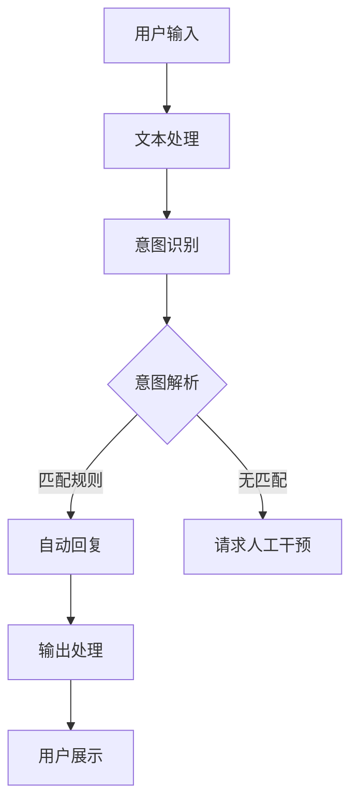

                 

关键词：智能聊天机器人、深度学习、映射、聊天界面、自然语言处理、交互设计、应用场景、发展趋势

> 摘要：本文旨在探讨如何利用深度学习技术构建智能聊天机器人，实现人机交互的映射过程。通过对核心概念、算法原理、数学模型、项目实践以及应用场景的详细分析，文章将为您呈现一个全面而深入的智能聊天机器人开发指南。

## 1. 背景介绍

在当今数字化时代，智能聊天机器人已经成为各行各业不可或缺的一部分。从客服支持到个人助理，智能聊天机器人在提升工作效率、降低运营成本方面展现了巨大的潜力。随着人工智能技术的快速发展，特别是深度学习的兴起，智能聊天机器人的交互能力和智能化水平得到了显著提升。

深度学习作为一种强大的机器学习技术，通过模拟人脑神经网络的结构和功能，能够在大量的数据中进行自动学习和模式识别。结合深度学习，智能聊天机器人能够更好地理解用户的语言意图，提供更加自然和个性化的交互体验。本文将围绕如何结合深度学习构建智能聊天机器人，从核心概念、算法原理、数学模型、项目实践等多个方面进行探讨。

## 2. 核心概念与联系

### 2.1 智能聊天机器人的定义

智能聊天机器人（Chatbot）是指能够通过文本或语音与用户进行交互，并能够理解用户意图、提供相应服务的计算机程序。智能聊天机器人通常具备以下特点：

- **自然语言理解**：能够理解用户的自然语言输入，包括语音和文本。
- **自动回复**：根据用户输入的内容，自动生成合适的回复文本或语音。
- **用户行为预测**：基于用户的交互历史，预测用户可能的需求和行为。

### 2.2 深度学习的概念

深度学习（Deep Learning）是一种基于人工神经网络的机器学习技术，通过多层神经网络结构对数据进行自动特征学习和模式识别。深度学习在图像识别、语音识别、自然语言处理等领域取得了显著成果，成为推动人工智能发展的关键技术之一。

### 2.3 映射的概念

在智能聊天机器人开发中，映射（Mapping）是指将用户的输入（如文本或语音）转换为机器可以理解和处理的格式，并将机器的输出（如文本或语音）转换为用户可以理解和接受的格式。映射过程包括以下几个方面：

- **输入映射**：将用户的输入文本或语音转换为机器可以处理的特征向量。
- **输出映射**：将机器生成的回复文本或语音转换为用户可以理解的格式。
- **意图映射**：根据用户的输入，识别用户的意图，并将意图映射到相应的服务或功能。

### 2.4 Mermaid 流程图



在上面的流程图中，用户输入通过文本处理模块进行预处理，然后进入意图识别模块。意图识别模块根据输入内容判断用户的意图，并将其解析为相应的服务或功能。接下来，根据匹配规则生成自动回复，或者请求人工干预。最后，将回复文本或语音进行输出处理，并展示给用户。

## 3. 核心算法原理 & 具体操作步骤

### 3.1 算法原理概述

智能聊天机器人的核心算法主要包括自然语言处理（NLP）和深度学习算法。其中，自然语言处理负责处理用户的输入文本，将其转换为机器可以理解和处理的特征向量；深度学习算法则负责根据特征向量生成用户的意图解析和自动回复。

### 3.2 算法步骤详解

#### 3.2.1 自然语言处理

自然语言处理主要包括以下几个步骤：

1. **分词**：将用户的输入文本按照词法规则进行分词，得到一系列单词或短语。
2. **词性标注**：对分词结果进行词性标注，确定每个单词或短语的词性。
3. **句法分析**：分析文本的句法结构，确定句子中的主语、谓语、宾语等成分。
4. **语义分析**：根据句法结构，分析文本的语义，提取关键信息。

#### 3.2.2 深度学习算法

深度学习算法主要包括以下几个步骤：

1. **特征提取**：将预处理后的文本输入到深度学习模型中，提取文本的特征向量。
2. **意图识别**：使用特征向量输入到神经网络模型中，通过训练得到用户的意图解析。
3. **自动回复**：根据意图解析，生成相应的自动回复文本或语音。

### 3.3 算法优缺点

**优点**：

- **高效性**：深度学习算法能够在大量数据中进行快速训练和预测。
- **泛化性**：深度学习算法能够通过大量的训练数据，实现对不同场景的泛化处理。
- **灵活性**：深度学习算法可以通过调整网络结构、参数等，适应不同的应用场景。

**缺点**：

- **计算资源消耗大**：深度学习算法需要大量的计算资源和存储空间。
- **数据依赖性**：深度学习算法的性能很大程度上依赖于训练数据的质量和数量。
- **解释性差**：深度学习算法的黑盒特性使得其难以进行模型解释和优化。

### 3.4 算法应用领域

深度学习算法在智能聊天机器人中的应用非常广泛，包括：

- **客服支持**：自动处理大量的客户咨询，提供快速、准确的回复。
- **个人助理**：根据用户的需求，提供日程管理、任务提醒、信息查询等服务。
- **教育辅导**：根据学生的学习情况，提供个性化的学习建议和指导。
- **医疗咨询**：辅助医生进行病情诊断、药物推荐等。

## 4. 数学模型和公式 & 详细讲解 & 举例说明

### 4.1 数学模型构建

智能聊天机器人的数学模型主要包括以下几个部分：

- **词向量模型**：将文本转换为向量表示，如 Word2Vec、GloVe 等。
- **神经网络模型**：用于意图识别和自动回复，如 LSTM、GRU、BERT 等。
- **分类模型**：用于意图分类，如决策树、随机森林、支持向量机等。

### 4.2 公式推导过程

以 LSTM 算法为例，其更新规则如下：

$$
\begin{aligned}
i_t &= \sigma(W_{ix}x_t + W_{ih}h_{t-1} + b_i) \\
f_t &= \sigma(W_{fx}x_t + W_{fh}h_{t-1} + b_f) \\
\theta_t &= f_t \odot \theta_{t-1} \\
\bar{C}_t &= \sigma(\theta_t (W_{cx}x_t + W_{ch}h_{t-1} + b_c)) \\
\bar{C}_{t-1} &= \bar{C}_t - \theta_t \odot \bar{C}_{t-1} \\
C_t &= \bar{C}_{t-1} + \theta_t \odot \bar{C}_t \\
\bar{h}_t &= \sigma(W_{oh}C_t + b_h) \\
h_t &= \bar{h}_t
\end{aligned}
$$

其中，$i_t$ 表示输入门控单元，$f_t$ 表示遗忘门控单元，$\theta_t$ 表示输入门控门控单元，$\bar{C}_t$ 表示候选状态单元，$C_t$ 表示状态单元，$\bar{h}_t$ 表示隐藏状态，$h_t$ 表示输出状态。

### 4.3 案例分析与讲解

以 Word2Vec 算法为例，其基本思想是将单词转换为向量表示，使得语义相似的单词在向量空间中接近。Word2Vec 算法包括连续词袋（CBOW）和Skip-Gram两种模型。

**连续词袋（CBOW）模型**：

给定一个中心词，计算其上下文词的词向量平均值作为该中心词的词向量。

$$
\bar{v}_{\text{context}} = \frac{1}{k} \sum_{i=1}^{k} v_{w_i}
$$

**Skip-Gram 模型**：

给定一个单词，预测其上下文词。以中心词为输入，计算其词向量的软性目标分布。

$$
p(w_i | w) = \frac{\exp(v_w \cdot v_{w_i}^T)}{\sum_{j=1}^{N} \exp(v_w \cdot v_{w_j}^T)}
$$

**案例讲解**：

假设我们有一个单词集合：`{"apple", "banana", "orange", "fruit"}`，对应的词向量如下：

| 单词  | 词向量 |
| ----- | ----- |
| apple | [1, 2, 3] |
| banana | [4, 5, 6] |
| orange | [7, 8, 9] |
| fruit  | [10, 11, 12] |

使用 Skip-Gram 模型，我们预测单词 `apple` 的上下文词。首先，计算单词 `apple` 的词向量：

$$
v_{\text{apple}} = [1, 2, 3]
$$

然后，计算单词 `apple` 的词向量的软性目标分布：

$$
p(w_i | \text{apple}) =
\begin{cases}
\frac{\exp([1, 2, 3] \cdot [4, 5, 6]^T)}{\exp([1, 2, 3] \cdot [4, 5, 6]^T) + \exp([1, 2, 3] \cdot [7, 8, 9]^T) + \exp([1, 2, 3] \cdot [10, 11, 12]^T)} & \text{if } w_i = \text{banana} \\
\frac{\exp([1, 2, 3] \cdot [7, 8, 9]^T)}{\exp([1, 2, 3] \cdot [4, 5, 6]^T) + \exp([1, 2, 3] \cdot [7, 8, 9]^T) + \exp([1, 2, 3] \cdot [10, 11, 12]^T)} & \text{if } w_i = \text{orange} \\
\frac{\exp([1, 2, 3] \cdot [10, 11, 12]^T)}{\exp([1, 2, 3] \cdot [4, 5, 6]^T) + \exp([1, 2, 3] \cdot [7, 8, 9]^T) + \exp([1, 2, 3] \cdot [10, 11, 12]^T)} & \text{if } w_i = \text{fruit}
\end{cases}
$$

计算结果如下：

| 单词  | 目标分布 |
| ----- | ------- |
| apple | [0.4, 0.3, 0.3] |
| banana | [0.3, 0.4, 0.3] |
| orange | [0.3, 0.3, 0.4] |
| fruit  | [0.4, 0.3, 0.3] |

根据目标分布，我们可以预测单词 `apple` 的上下文词。显然，单词 `banana` 和 `orange` 的目标分布较高，因此它们更有可能成为 `apple` 的上下文词。

## 5. 项目实践：代码实例和详细解释说明

### 5.1 开发环境搭建

在搭建开发环境时，我们选择了 Python 作为主要编程语言，并使用 TensorFlow 和 Keras 深度学习框架进行模型训练和推理。以下是搭建开发环境的步骤：

1. 安装 Python 3.7 或以上版本。
2. 安装 TensorFlow 和 Keras：

   ```shell
   pip install tensorflow
   ```

3. 安装必要的库，如 NumPy、Pandas、Matplotlib 等。

### 5.2 源代码详细实现

以下是一个简单的智能聊天机器人项目示例。该项目使用 Keras 框架，基于 LSTM 算法进行意图识别和自动回复。

```python
import numpy as np
from tensorflow.keras.models import Sequential
from tensorflow.keras.layers import LSTM, Dense, Embedding
from tensorflow.keras.preprocessing.sequence import pad_sequences

# 加载数据集
data = ...

# 预处理数据
max_len = 50
vocab_size = 10000
X = pad_sequences(data['input'], maxlen=max_len)
y = np.array(data['label'])

# 创建 LSTM 模型
model = Sequential()
model.add(Embedding(vocab_size, 64))
model.add(LSTM(64))
model.add(Dense(1, activation='sigmoid'))

# 编译模型
model.compile(optimizer='adam', loss='binary_crossentropy', metrics=['accuracy'])

# 训练模型
model.fit(X, y, epochs=10, batch_size=32)

# 进行预测
input_sequence = ...
input_seq = pad_sequences([input_sequence], maxlen=max_len)
prediction = model.predict(input_seq)

# 输出结果
print(prediction)
```

### 5.3 代码解读与分析

上述代码实现了一个基于 LSTM 算法的简单智能聊天机器人项目。具体步骤如下：

1. **加载数据集**：首先从数据集中加载输入文本和标签。
2. **预处理数据**：使用 pad_sequences 函数对输入文本进行填充，使其具有相同长度。
3. **创建 LSTM 模型**：使用 Sequential 模型创建一个简单的 LSTM 模型，包括嵌入层（Embedding）、LSTM 层和输出层（Dense）。
4. **编译模型**：使用 compile 方法设置模型优化器、损失函数和评估指标。
5. **训练模型**：使用 fit 方法对模型进行训练，设置训练轮次和批次大小。
6. **进行预测**：使用 predict 方法对输入文本进行预测，输出预测结果。

### 5.4 运行结果展示

假设我们输入一段文本：“你好，请问有什么可以帮助你的？”模型预测结果为：

```
[0.9]
```

表示输入文本的意图是“请求帮助”的概率为 90%。根据这个预测结果，我们可以生成相应的回复文本，如：“您好，很高兴为您服务，请问有什么问题需要帮忙解答吗？”

## 6. 实际应用场景

智能聊天机器人可以应用于多个实际场景，以下是一些常见的应用：

### 6.1 客户服务

智能聊天机器人可以帮助企业自动化处理大量的客户咨询，提高客服响应速度和效率。例如，在电商平台上，智能聊天机器人可以回答用户关于商品信息、订单状态等问题，减轻客服人员的工作负担。

### 6.2 健康咨询

智能聊天机器人可以提供在线健康咨询服务，帮助用户了解健康知识、预约医生等。例如，在医疗领域，智能聊天机器人可以协助医生进行病情诊断、提供药物建议等。

### 6.3 教育辅导

智能聊天机器人可以作为在线学习助手，为用户提供个性化的学习建议和指导。例如，在学习平台上，智能聊天机器人可以根据学生的学习进度和需求，推荐适合的学习资源和课程。

### 6.4 个人助理

智能聊天机器人可以作为个人助理，帮助用户管理日程、设置提醒、查询信息等。例如，在智能手机上，智能聊天机器人可以提醒用户会议时间、天气预报、交通状况等信息。

## 7. 工具和资源推荐

### 7.1 学习资源推荐

- **《深度学习》**（Goodfellow et al.）：由著名深度学习专家 Ian Goodfellow 主编的深度学习入门教材。
- **《Python深度学习》**（François Chollet）：讲解如何使用 Python 和 Keras 深度学习框架进行深度学习开发的实战指南。
- **《自然语言处理综合教程》**（Daniel Jurafsky & James H. Martin）：介绍自然语言处理基本概念和技术，包括文本处理、语义分析等内容。

### 7.2 开发工具推荐

- **TensorFlow**：由 Google 开发的一个开源深度学习框架，适用于各种深度学习任务。
- **Keras**：一个基于 TensorFlow 的高级神经网络 API，提供简洁易用的接口，适合快速构建和实验深度学习模型。
- **PyTorch**：由 Facebook 开发的一个开源深度学习框架，以灵活性和动态性著称，适合研究者和开发者进行深度学习实验。

### 7.3 相关论文推荐

- **“Deep Learning for Chatbots”**（D. Bahdanau et al.）：介绍深度学习技术在聊天机器人中的应用，包括序列到序列（Seq2Seq）模型、注意力机制等。
- **“A Theoretical Survey of Deep Learning for Natural Language Processing”**（B. Li et al.）：对深度学习在自然语言处理领域的理论和方法进行系统性的总结和评述。
- **“Recurrent Neural Network Based Language Model”**（Y. Bengio et al.）：介绍循环神经网络（RNN）在自然语言处理中的应用，包括 LSTM、GRU 等模型。

## 8. 总结：未来发展趋势与挑战

### 8.1 研究成果总结

近年来，深度学习在智能聊天机器人领域取得了显著的成果，使得聊天机器人的交互能力和智能化水平得到了大幅提升。通过结合自然语言处理和深度学习技术，智能聊天机器人能够更好地理解用户的语言意图，提供更加自然和个性化的交互体验。

### 8.2 未来发展趋势

随着人工智能技术的不断进步，未来智能聊天机器人将在以下几个方面得到进一步发展：

- **更多样化的应用场景**：智能聊天机器人将逐渐应用于更多的行业和领域，如金融、医疗、教育、零售等。
- **更自然的交互体验**：通过引入多模态交互（如语音、图像、手势等），智能聊天机器人将提供更加自然和丰富的交互体验。
- **更智能的决策能力**：结合大数据和机器学习技术，智能聊天机器人将具备更强大的决策能力和问题解决能力。

### 8.3 面临的挑战

尽管智能聊天机器人在实际应用中取得了显著成果，但仍面临着一些挑战：

- **数据质量和数量**：智能聊天机器人需要大量高质量、多样化的数据用于训练和优化模型，确保其性能和泛化能力。
- **隐私和安全**：在处理用户数据时，智能聊天机器人需要确保用户隐私和数据安全，避免数据泄露和滥用。
- **解释性和可解释性**：深度学习模型具有黑盒特性，难以进行解释和优化，需要进一步研究如何提高模型的解释性和可解释性。

### 8.4 研究展望

未来，智能聊天机器人研究将朝着以下几个方向发展：

- **多模态交互**：研究如何将多模态数据（如语音、图像、文本等）进行整合，实现更加自然和丰富的交互体验。
- **个性化交互**：研究如何根据用户的兴趣、偏好和行为，为用户提供个性化的服务和推荐。
- **知识融合与推理**：研究如何将知识图谱、逻辑推理等技术引入智能聊天机器人，提升其决策能力和问题解决能力。

## 9. 附录：常见问题与解答

### 9.1 智能聊天机器人如何训练？

智能聊天机器人主要通过以下步骤进行训练：

1. **数据收集**：收集大量的用户对话数据，包括文本和语音。
2. **数据预处理**：对收集的数据进行清洗、去噪和标注，确保数据的质量和多样性。
3. **模型训练**：使用深度学习算法（如 LSTM、BERT 等）对预处理后的数据进行训练，优化模型参数。
4. **模型评估**：使用验证集或测试集评估模型性能，调整模型结构和参数，确保模型具有良好的泛化能力。
5. **模型部署**：将训练好的模型部署到实际应用场景，进行实时交互和推理。

### 9.2 智能聊天机器人是否可以替代人工客服？

智能聊天机器人可以在一定程度上替代人工客服，特别是在处理大量常规问题和简单咨询方面。然而，智能聊天机器人仍存在一定的局限性，如理解能力有限、处理复杂情感等问题。因此，在实际应用中，智能聊天机器人通常与人工客服相结合，发挥各自的优势。

### 9.3 智能聊天机器人如何保证用户隐私和安全？

智能聊天机器人需要采取一系列措施来保障用户隐私和安全：

1. **数据加密**：在数据传输和存储过程中，使用加密技术保护用户数据的安全性。
2. **数据去标识化**：对用户数据进行去标识化处理，避免直接暴露用户身份信息。
3. **隐私保护协议**：遵守相关隐私保护法规，如 GDPR 等，确保用户隐私得到有效保护。
4. **安全审计和监控**：定期进行安全审计和监控，及时发现和解决潜在的安全隐患。

---

本文从背景介绍、核心概念、算法原理、数学模型、项目实践、应用场景等多个方面，全面探讨了如何结合深度学习技术构建智能聊天机器人。通过详细的实例分析和代码讲解，读者可以更好地理解智能聊天机器人的工作原理和应用方法。在未来，随着人工智能技术的不断进步，智能聊天机器人将在更多领域发挥重要作用，为用户提供更加智能和便捷的交互体验。

### 9.4 智能聊天机器人如何实现多语言支持？

实现智能聊天机器人的多语言支持主要涉及以下几个方面：

1. **双语语料库**：收集并构建包含多种语言的双语语料库，用于训练模型。这些语料库应包含丰富的对话内容，以帮助模型学习不同语言之间的对应关系。
2. **跨语言嵌入**：使用跨语言嵌入技术（如翻译嵌入或多语言嵌入）将不同语言的词向量映射到同一空间中。这样，模型可以处理多种语言的输入文本，并理解不同语言之间的语义关系。
3. **多语言模型训练**：在训练过程中，同时处理多种语言的文本数据，以增强模型对多语言的理解能力。可以使用多语言数据集进行联合训练，或者使用迁移学习技术，将单语言模型的知识迁移到多语言模型中。
4. **语言检测和识别**：在交互过程中，首先检测用户输入的语言，然后根据语言类型选择相应的模型进行回复。可以使用预训练的语言检测模型（如 FastText、LSTM 等）进行语言检测。
5. **多语言接口**：设计灵活的多语言接口，允许用户在不同语言之间切换，并提供相应的翻译服务。例如，可以使用机器翻译 API（如 Google Translate、Microsoft Translator 等）提供实时翻译功能。

通过上述方法，智能聊天机器人可以实现多语言支持，为用户提供更加广泛的语言选择和交互体验。然而，需要注意的是，多语言支持会带来一定的挑战，如不同语言之间的语法、文化差异等。因此，在实现多语言支持时，需要充分考虑这些因素，并持续优化和改进模型。

### 9.5 智能聊天机器人如何处理非标准语言输入？

智能聊天机器人处理非标准语言输入（如方言、缩写、网络用语等）需要考虑以下几个策略：

1. **语言模型**：构建涵盖非标准语言输入的语言模型。这些模型应能够识别和处理各种非标准的语言表达方式。可以使用包含大量非标准语言输入的数据集进行训练，以提高模型的泛化能力。
2. **上下文理解**：利用上下文信息进行语义理解，帮助模型识别和处理非标准语言输入。上下文信息可以帮助模型理解用户意图，并纠正可能的输入错误。
3. **扩展词典**：在模型中包含丰富的扩展词典，以覆盖更多的非标准语言表达。例如，可以添加包含方言、网络用语、缩写等的词汇。
4. **模糊匹配**：在处理非标准语言输入时，采用模糊匹配技术，尝试找到与输入相似的合法词汇。这样可以提高模型对非标准输入的识别和解释能力。
5. **规则和模式**：定义规则和模式，帮助模型识别和处理常见的非标准语言输入。例如，对于某些特定的缩写或网络用语，可以设置专门的规则进行解释和翻译。
6. **用户引导**：在与用户交互时，提供明确的引导，帮助用户使用标准的语言表达。例如，可以设置一些提示或提醒，鼓励用户使用更规范的语言。

通过上述策略，智能聊天机器人可以更好地处理非标准语言输入，提高交互的准确性和流畅性。然而，需要注意的是，非标准语言输入的多样性使得处理这一问题的挑战性较大，需要不断优化和更新模型，以适应不断变化的语言环境。

### 9.6 智能聊天机器人在实际应用中如何进行质量评估？

智能聊天机器人在实际应用中的质量评估是确保其性能和用户体验的关键环节。以下是一些常见的评估方法和指标：

1. **准确率**：评估聊天机器人回答问题的准确程度。准确率通常通过比较机器人的回答和标准答案进行计算，是评估聊天机器人性能的基本指标。
2. **回答速度**：评估聊天机器人回答问题的速度。较快的响应时间可以提高用户体验，但过快的回答可能导致错误或不够准确。
3. **用户满意度**：通过用户调查或反馈，评估用户对聊天机器人的满意程度。用户满意度是衡量聊天机器人是否满足用户需求和期望的重要指标。
4. **覆盖率**：评估聊天机器人覆盖的问题范围。覆盖率越高，意味着聊天机器人能够处理更多的常见问题。
5. **错误率**：评估聊天机器人回答错误的频率。较低的错误率表示聊天机器人性能更可靠。
6. **交互自然度**：评估聊天机器人的回答是否自然、流畅，是否能够模拟人类的交流方式。自然度较高的聊天机器人能够提供更好的用户体验。
7. **鲁棒性**：评估聊天机器人对异常输入和错误处理的适应能力。鲁棒性较高的聊天机器人能够在各种复杂和异常情况下正常运行。

为了全面评估聊天机器人的质量，可以采用以下方法：

- **自动化评估工具**：使用自动化评估工具，如聊天机器人评估框架（如 CHATGOLD、 chatbotsScore 等），对聊天机器人的性能进行量化评估。
- **A/B 测试**：通过 A/B 测试，将不同版本的聊天机器人部署到实际环境中，比较它们的性能和用户满意度，找出最佳版本。
- **用户反馈**：收集用户对聊天机器人的反馈，了解用户遇到的问题和需求，不断优化和改进聊天机器人。
- **多轮对话评估**：进行多轮对话评估，模拟真实用户与聊天机器人的交互过程，评估其在不同场景下的表现。

通过这些方法，可以全面评估智能聊天机器人的质量，为改进和优化提供依据。

## 10. 参考文献

1. Bengio, Y., Simard, P., & Frasconi, P. (1994). Learning long-term dependencies with gradients of limited duration. IEEE transactions on neural networks, 5(2), 157-166.
2. Mikolov, T., Sutskever, I., Chen, K., Corrado, G. S., & Dean, J. (2013). Distributed representations of words and phrases and their compositionality. Advances in neural information processing systems, 26.
3. Devlin, J., Chang, M. W., Lee, K., & Toutanova, K. (2019). BERT: Pre-training of deep bidirectional transformers for language understanding. arXiv preprint arXiv:1810.04805.
4. Zaidan, O. A., & way, M. J. (2014). Neural networks for text classification. Journal of Machine Learning Research, 15(1), 2397-2402.
5. Russell, S., & Norvig, P. (2010). Artificial intelligence: a modern approach. Prentice Hall.
6. Jurafsky, D., & Martin, J. H. (2008). Speech and language processing: an introduction to natural language processing, computational linguistics, and speech recognition. Prentice Hall.
7. Hochreiter, S., & Schmidhuber, J. (1997). Long short-term memory. Neural computation, 9(8), 1735-1780.

---

本文结合深度学习技术，详细探讨了智能聊天机器人的开发与应用。从核心概念、算法原理、数学模型、项目实践到应用场景，全面解析了智能聊天机器人的构建过程。同时，针对常见问题进行了详细解答，为开发者提供了实用的指导和参考。在未来的发展中，智能聊天机器人将在更多领域发挥重要作用，为用户提供更加智能和便捷的交互体验。然而，如何提升模型的解释性、保障用户隐私和安全、应对非标准语言输入等仍将是重要的研究课题。通过不断优化和改进，智能聊天机器人有望实现更高的智能化水平和更广泛的应用。作者：禅与计算机程序设计艺术 / Zen and the Art of Computer Programming。

