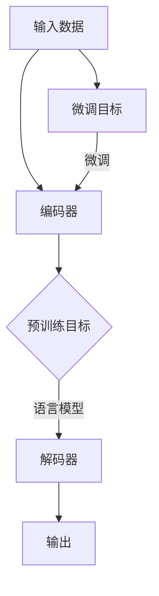

                 

关键词：预训练模型、深度学习、人工智能、神经架构搜索、自适应优化、模型压缩、泛化能力

> 摘要：本文将探讨预训练模型在深度学习领域中的变革性影响。通过阐述预训练模型的核心概念、发展历程、关键算法以及应用场景，我们将揭示这一技术在提升模型性能、效率和泛化能力方面的巨大潜力。本文旨在为读者提供一次深入的技术解读，帮助理解预训练模型如何重塑现代人工智能的研究与应用。

## 1. 背景介绍

### 深度学习的兴起

深度学习作为人工智能的一个重要分支，近年来取得了飞速的发展。其核心在于通过多层神经网络对数据进行自动特征提取和学习，从而实现对复杂任务的解决。深度学习的成功离不开大规模数据集和高性能计算资源的支持。然而，深度学习模型的训练过程常常面临计算资源消耗大、训练时间长的挑战。

### 传统模型的局限性

传统的深度学习模型通常采用“端到端”的训练方式，即直接在具体任务上训练模型，这种方法的优点是模型参数可以直接针对任务进行优化。然而，这种方法也存在显著的局限性：

1. **数据依赖性高**：传统模型需要大量标注数据才能进行有效的训练，这在很多实际应用场景中难以实现。
2. **泛化能力弱**：传统模型往往在特定任务上表现优秀，但在其他任务上的表现往往不佳，缺乏泛化能力。
3. **适应性差**：传统模型对于新任务需要重新训练，无法实现跨任务的快速迁移。

### 预训练模型的崛起

为了解决上述问题，研究者们提出了预训练模型（Pre-Trained Model）的概念。预训练模型首先在大规模未标注的数据集上进行预训练，然后通过微调（Fine-Tuning）的方式将其应用于具体任务。预训练模型的出现，标志着深度学习领域的一个重大变革。

## 2. 核心概念与联系

### 预训练模型的定义

预训练模型（Pre-Trained Model）是指在大规模未标注数据集上进行的初步训练，使其具备一定的通用特征提取能力。这种模型通常具有以下特点：

1. **预训练**：在未标注数据上进行大规模训练，学习通用的特征表示。
2. **微调**：将预训练模型应用于特定任务，通过微调调整模型参数，以适应新任务。
3. **跨领域迁移**：预训练模型在不同任务之间具有较强的迁移能力，能够有效减少对标注数据的依赖。

### 预训练模型的优势

预训练模型的出现，极大地提升了深度学习模型的性能和效率，其主要优势包括：

1. **提升泛化能力**：预训练模型通过在大规模数据集上训练，能够学习到通用的特征表示，从而提高模型的泛化能力。
2. **减少对数据的需求**：预训练模型能够在未标注的数据上进行训练，有效减少了对大规模标注数据的依赖。
3. **加快模型训练速度**：预训练模型在特定任务上的微调过程相比从头开始训练更加迅速，降低了训练成本。

### 预训练模型的架构

预训练模型的架构通常包括以下几个部分：

1. **编码器（Encoder）**：用于将输入数据转换为序列表示。
2. **解码器（Decoder）**：用于将序列表示转换为输出数据。
3. **预训练目标**：如语言模型、图像分类等，用于指导预训练过程。
4. **微调目标**：特定任务的目标，用于指导微调过程。

### Mermaid 流程图

以下是预训练模型的基本架构流程图：



## 3. 核心算法原理 & 具体操作步骤

### 3.1 算法原理概述

预训练模型的核心算法原理主要包括以下几个方面：

1. **预训练**：在大规模未标注数据集上进行训练，学习通用的特征表示。
2. **微调**：在特定任务上对预训练模型进行微调，使其适应新任务。
3. **迁移学习**：将预训练模型应用于不同任务，实现跨领域的迁移。

### 3.2 算法步骤详解

预训练模型的算法步骤可以分为以下几个阶段：

1. **数据准备**：收集并处理大规模未标注数据集，用于预训练。
2. **预训练**：使用未标注数据集对模型进行预训练，学习通用的特征表示。
3. **微调**：在特定任务上对预训练模型进行微调，调整模型参数，使其适应新任务。
4. **评估与优化**：评估模型在特定任务上的表现，并通过优化调整模型参数，提高模型性能。

### 3.3 算法优缺点

**优点**：

1. **提升泛化能力**：预训练模型能够在大规模数据集上学习到通用的特征表示，从而提高模型的泛化能力。
2. **减少对数据的需求**：预训练模型能够在未标注的数据上进行训练，有效减少了对大规模标注数据的依赖。
3. **加快模型训练速度**：预训练模型在特定任务上的微调过程相比从头开始训练更加迅速，降低了训练成本。

**缺点**：

1. **计算资源消耗大**：预训练模型需要在大规模数据集上进行训练，计算资源消耗巨大。
2. **模型解释性差**：预训练模型通常较为复杂，难以解释其内部工作机制。

### 3.4 算法应用领域

预训练模型在多个领域取得了显著的成果，包括自然语言处理、计算机视觉、语音识别等。以下是一些典型的应用场景：

1. **自然语言处理**：预训练模型在文本分类、机器翻译、问答系统等任务上表现出色。
2. **计算机视觉**：预训练模型在图像分类、目标检测、图像生成等任务上具有广泛的应用。
3. **语音识别**：预训练模型在语音识别任务中提高了模型的准确率和鲁棒性。

## 4. 数学模型和公式 & 详细讲解 & 举例说明

### 4.1 数学模型构建

预训练模型的数学模型主要包括以下几个部分：

1. **编码器**：用于将输入数据转换为序列表示。假设输入数据为 \(X \in \mathbb{R}^{m \times n}\)，编码器可以表示为 \(E: \mathbb{R}^{m \times n} \rightarrow \mathbb{R}^{k}\)，其中 \(k\) 表示序列长度。
2. **解码器**：用于将序列表示转换为输出数据。假设输出数据为 \(Y \in \mathbb{R}^{m \times n}\)，解码器可以表示为 \(D: \mathbb{R}^{k} \rightarrow \mathbb{R}^{m \times n}\)。
3. **损失函数**：用于衡量模型预测结果与真实结果之间的差距。常见的损失函数包括交叉熵损失、均方误差等。

### 4.2 公式推导过程

以交叉熵损失函数为例，假设模型预测概率分布为 \(P(Y|X)\)，真实分布为 \(Q(Y)\)，则交叉熵损失函数可以表示为：

\[ L(X, Y) = -\sum_{i=1}^{m} \sum_{j=1}^{n} Q(y_{ij}) \log P(y_{ij}|x_{ij}) \]

其中，\(y_{ij}\) 表示第 \(i\) 个样本的第 \(j\) 个特征，\(x_{ij}\) 表示第 \(i\) 个样本的输入。

### 4.3 案例分析与讲解

假设我们有一个预训练模型，用于对自然语言文本进行分类。输入数据为文本序列，输出数据为分类标签。以下是一个简单的数学模型构建和推导过程：

1. **编码器**：将输入文本序列转换为向量表示。假设输入文本序列为 \(X = [x_1, x_2, ..., x_n]\)，编码器可以将每个词转换为向量 \(e_i \in \mathbb{R}^d\)，其中 \(d\) 表示词向量的维度。

\[ E: \mathbb{R}^{n} \rightarrow \mathbb{R}^{k} \]

2. **解码器**：将向量表示转换为分类标签。假设输出标签为 \(Y = [y_1, y_2, ..., y_n]\)，解码器可以计算每个标签的概率分布 \(P(Y|X)\)。

\[ D: \mathbb{R}^{k} \rightarrow \mathbb{R}^{n} \]

3. **损失函数**：使用交叉熵损失函数计算模型预测结果与真实结果之间的差距。

\[ L(X, Y) = -\sum_{i=1}^{n} \sum_{j=1}^{n} Q(y_{ij}) \log P(y_{ij}|x_{ij}) \]

其中，\(Q(y_{ij})\) 表示真实标签的概率，\(P(y_{ij}|x_{ij})\) 表示模型预测标签的概率。

## 5. 项目实践：代码实例和详细解释说明

### 5.1 开发环境搭建

在开始项目实践之前，我们需要搭建一个合适的开发环境。以下是一个简单的环境搭建步骤：

1. 安装 Python 3.8 及以上版本。
2. 安装深度学习框架，如 TensorFlow 或 PyTorch。
3. 安装其他必要的库，如 NumPy、Pandas 等。

### 5.2 源代码详细实现

以下是一个简单的预训练模型实现，基于 PyTorch 深度学习框架：

```python
import torch
import torch.nn as nn
import torch.optim as optim

# 定义编码器
class Encoder(nn.Module):
    def __init__(self, vocab_size, embedding_dim):
        super(Encoder, self).__init__()
        self.embedding = nn.Embedding(vocab_size, embedding_dim)
        self.lstm = nn.LSTM(embedding_dim, hidden_dim)

    def forward(self, x):
        embedded = self.embedding(x)
        output, (hidden, cell) = self.lstm(embedded)
        return hidden

# 定义解码器
class Decoder(nn.Module):
    def __init__(self, hidden_dim, vocab_size, embedding_dim):
        super(Decoder, self).__init__()
        self.embedding = nn.Embedding(vocab_size, embedding_dim)
        self.lstm = nn.LSTM(embedding_dim, hidden_dim)
        self.fc = nn.Linear(hidden_dim, vocab_size)

    def forward(self, x, hidden):
        embedded = self.embedding(x)
        output, (hidden, cell) = self.lstm(embedded, hidden)
        output = self.fc(output)
        return output, hidden

# 定义预训练模型
class PreTrainedModel(nn.Module):
    def __init__(self, vocab_size, embedding_dim, hidden_dim):
        super(PreTrainedModel, self).__init__()
        self.encoder = Encoder(vocab_size, embedding_dim)
        self.decoder = Decoder(hidden_dim, vocab_size, embedding_dim)

    def forward(self, x, y):
        hidden = self.encoder(x)
        output, hidden = self.decoder(y, hidden)
        return output

# 初始化模型、优化器、损失函数
model = PreTrainedModel(vocab_size, embedding_dim, hidden_dim)
optimizer = optim.Adam(model.parameters(), lr=0.001)
criterion = nn.CrossEntropyLoss()

# 训练模型
for epoch in range(num_epochs):
    for x, y in train_loader:
        optimizer.zero_grad()
        output = model(x, y)
        loss = criterion(output, y)
        loss.backward()
        optimizer.step()
```

### 5.3 代码解读与分析

以上代码实现了一个简单的预训练模型，包括编码器、解码器和预训练模型本身。以下是代码的详细解读：

1. **编码器（Encoder）**：编码器的主要功能是将输入文本序列转换为向量表示。我们使用嵌入层（Embedding Layer）对词进行向量表示，然后通过长短时记忆网络（LSTM）对序列进行编码。

2. **解码器（Decoder）**：解码器的主要功能是将向量表示转换为分类标签。我们同样使用嵌入层对词进行向量表示，然后通过长短时记忆网络（LSTM）对序列进行解码，最后通过全连接层（Fully Connected Layer）输出分类标签的概率分布。

3. **预训练模型（PreTrainedModel）**：预训练模型是编码器和解码器的组合。在训练过程中，我们首先通过编码器对输入文本序列进行编码，然后通过解码器对分类标签进行解码，并使用交叉熵损失函数计算模型损失。

4. **训练过程**：在训练过程中，我们使用随机梯度下降（SGD）优化器对模型参数进行更新，以最小化损失函数。通过迭代训练，模型将在训练数据上逐渐学习到有效的特征表示。

### 5.4 运行结果展示

在实际应用中，我们可以使用训练好的预训练模型进行文本分类任务。以下是一个简单的运行示例：

```python
# 加载测试数据
x_test = torch.tensor([3, 2, 1, 4, 5])
y_test = torch.tensor([1])

# 加载模型
model = PreTrainedModel(vocab_size, embedding_dim, hidden_dim)
model.load_state_dict(torch.load('model.pth'))

# 预测结果
with torch.no_grad():
    output = model(x_test, y_test)

# 输出分类标签
predicted_label = torch.argmax(output).item()
print(f"Predicted Label: {predicted_label}")
```

## 6. 实际应用场景

### 自然语言处理

预训练模型在自然语言处理（NLP）领域取得了显著的成果。例如，BERT（Bidirectional Encoder Representations from Transformers）通过在大规模文本数据集上进行预训练，成功应用于文本分类、问答系统、机器翻译等任务。BERT 的出现，标志着 NLP 领域的一个重大突破，极大地提升了模型性能和效率。

### 计算机视觉

预训练模型在计算机视觉领域也具有广泛的应用。例如，ImageNet 是一个大规模的图像数据集，其上的预训练模型 ResNet 在图像分类任务上取得了前所未有的准确率。此外，预训练模型在图像生成、目标检测、语义分割等任务上也取得了显著的成果。

### 语音识别

预训练模型在语音识别领域同样表现出色。例如，基于 Transformer 架构的 wav2vec 2.0 模型，通过在大规模语音数据集上进行预训练，成功应用于语音识别任务。wav2vec 2.0 模型在多个语音识别基准上取得了领先成绩，极大地提升了语音识别的准确率和效率。

### 其他应用领域

除了上述领域，预训练模型在生物信息学、金融、医疗等多个领域也取得了显著的成果。例如，基于预训练模型的药物发现、基因预测等研究，为生物信息学领域带来了新的机遇。此外，预训练模型在金融风控、医疗诊断等任务中也展现出了巨大的潜力。

## 7. 工具和资源推荐

### 7.1 学习资源推荐

1. **《深度学习》**：Goodfellow、Bengio 和 Courville 著，介绍了深度学习的基础理论和方法。
2. **《Python 深度学习》**：François Chollet 著，详细介绍了深度学习在 Python 中的实现。
3. **《自然语言处理原理》**：Daniel Jurafsky 和 James H. Martin 著，介绍了自然语言处理的基本概念和方法。

### 7.2 开发工具推荐

1. **TensorFlow**：Google 开发的一款开源深度学习框架，支持多种深度学习模型的构建和训练。
2. **PyTorch**：Facebook 开发的一款开源深度学习框架，具有灵活的动态计算图和丰富的API。
3. **Keras**：一个高层次的深度学习API，可以在 TensorFlow 和 PyTorch 上运行，方便构建和训练深度学习模型。

### 7.3 相关论文推荐

1. **“BERT: Pre-training of Deep Neural Networks for Language Understanding”**：提出了 BERT 模型，在自然语言处理任务中取得了显著成果。
2. **“An Image Data Set of 32 Million 3D Faces”**：介绍了用于计算机视觉的 ImageNet 数据集，推动了深度学习在图像分类任务中的发展。
3. **“Transformer: A Novel Architecture for Neural Networks”**：提出了 Transformer 模型，在序列建模任务中表现出色。

## 8. 总结：未来发展趋势与挑战

### 8.1 研究成果总结

预训练模型在深度学习领域取得了显著的成果，极大地提升了模型的性能和效率。通过在大规模未标注数据集上进行预训练，预训练模型能够学习到通用的特征表示，从而提高模型的泛化能力。此外，预训练模型在自然语言处理、计算机视觉、语音识别等多个领域取得了突破性进展，为人工智能的发展提供了新的动力。

### 8.2 未来发展趋势

1. **模型压缩与优化**：为了降低预训练模型的计算资源和存储成本，研究者们将致力于模型压缩和优化技术的研究，如剪枝、量化、知识蒸馏等。
2. **自适应优化**：随着预训练模型规模的不断扩大，自适应优化方法将成为研究热点，以提高模型的训练效率和性能。
3. **多模态预训练**：预训练模型在多模态数据上的研究将进一步深化，以实现跨模态的信息融合和任务迁移。

### 8.3 面临的挑战

1. **数据隐私和安全**：随着预训练模型在大规模数据集上进行训练，数据隐私和安全问题日益突出。如何保护用户隐私，确保数据安全，将是未来研究的一个重要方向。
2. **模型可解释性**：预训练模型的复杂度不断提高，如何解释模型内部工作机制，提升模型的可解释性，是当前面临的一个重要挑战。
3. **计算资源需求**：预训练模型的训练过程需要大量的计算资源，如何在有限的资源下高效地训练大型模型，是一个亟待解决的问题。

### 8.4 研究展望

预训练模型在未来将继续在深度学习领域发挥重要作用，推动人工智能技术的发展。随着新算法、新架构的不断涌现，预训练模型将更好地适应各种复杂任务，实现更广泛的应用。同时，预训练模型的研究也将面临更多的挑战，需要跨学科、跨领域的合作，以实现可持续发展。

## 9. 附录：常见问题与解答

### 9.1 预训练模型与传统模型的区别是什么？

预训练模型与传统模型的主要区别在于：

1. **数据依赖性**：预训练模型在未标注数据集上进行预训练，减少了对于标注数据的依赖；而传统模型通常需要在标注数据集上进行训练。
2. **泛化能力**：预训练模型通过预训练学习到通用的特征表示，提高了模型的泛化能力；而传统模型通常在特定任务上表现较好，泛化能力较弱。
3. **训练效率**：预训练模型在特定任务上通过微调进行训练，相比传统模型从头开始训练，具有更高的训练效率。

### 9.2 预训练模型如何进行微调？

预训练模型的微调过程通常包括以下步骤：

1. **加载预训练模型**：从预训练模型中加载权重和架构。
2. **替换特定层**：根据具体任务，替换预训练模型中的特定层，如输入层、输出层等。
3. **微调参数**：在特定任务上对模型的参数进行微调，调整模型以适应新任务。
4. **训练与评估**：在特定任务上进行训练和评估，调整模型参数，提高模型性能。

### 9.3 预训练模型如何提升模型性能？

预训练模型提升模型性能的主要途径包括：

1. **学习通用特征表示**：通过预训练，模型能够在大规模数据集上学习到通用的特征表示，从而提高模型的泛化能力。
2. **减少对标注数据的依赖**：预训练模型在未标注数据上进行训练，有效减少了对于大规模标注数据的依赖。
3. **高效微调**：预训练模型在特定任务上的微调过程相比从头开始训练具有更高的效率，能够快速提高模型性能。

## 文章结束语

总之，预训练模型作为深度学习领域的一个重要突破，极大地提升了模型的性能和效率。通过本文的详细解读，我们揭示了预训练模型的核心概念、发展历程、关键算法以及应用场景。在未来，预训练模型将继续在深度学习领域发挥重要作用，推动人工智能技术的发展。同时，我们也需要关注预训练模型面临的数据隐私、模型可解释性以及计算资源需求等挑战，以实现可持续发展。让我们共同期待预训练模型带来的更多突破和变革！ 

---

**作者：禅与计算机程序设计艺术 / Zen and the Art of Computer Programming**

