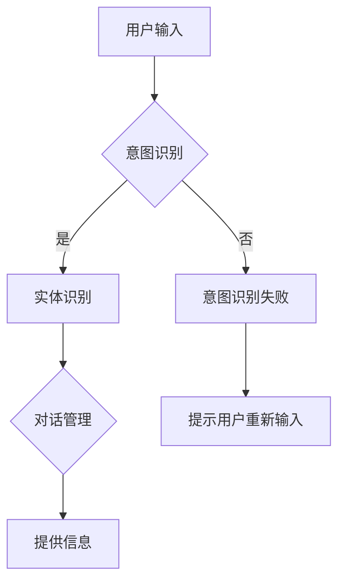

                 

关键词：上下文理解，CUI（计算机用户界面），自然语言处理，对话系统，人工智能

## 摘要

本文将探讨上下文理解技术在计算机用户界面（CUI）中的应用，特别是对话系统中上下文处理的重要性。通过分析上下文理解的核心概念、算法原理、数学模型，以及代码实例，我们将深入理解上下文理解如何提升CUI的用户体验。文章还将讨论上下文理解在实际应用场景中的表现，并展望其未来的发展趋势和面临的挑战。

## 1. 背景介绍

随着人工智能技术的发展，计算机用户界面（CUI）逐渐从传统的命令行界面（CLI）和图形用户界面（GUI）转向更加自然、人性化的对话界面（CUI）。CUI通过自然语言交互，为用户提供了更加便捷、高效的服务方式。然而，为了实现高质量的交互，CUI需要具备强大的上下文理解能力。上下文理解技术是指计算机在处理用户输入时，能够根据上下文信息，正确理解用户意图和语义的技术。

上下文理解在CUI中起着至关重要的作用。它可以解决以下问题：

1. **意图识别**：区分用户的真实意图，例如在购物场景中，用户输入“买书”可能是想查询图书信息，也可能是想直接购买图书。
2. **实体识别**：识别用户输入中的关键信息，例如在查询天气时，识别出城市名作为查询实体。
3. **对话管理**：根据上下文信息，规划对话流程，确保对话的连贯性和一致性。

本文将围绕上述问题，深入探讨上下文理解技术在CUI中的应用，并通过实例展示如何实现高质量的上下文理解。

## 2. 核心概念与联系

### 2.1 上下文理解的核心概念

#### 意图识别

意图识别是上下文理解的重要一环。它是指从用户输入中提取出用户意图的过程。例如，用户输入“你好”，系统需要识别出这是一个问候意图。

#### 实体识别

实体识别是指从用户输入中识别出关键信息，例如人名、地点、日期等。这些信息对于上下文理解至关重要。

#### 对话管理

对话管理是指在对话过程中，根据上下文信息，规划对话流程，确保对话的连贯性和一致性。例如，在对话过程中，系统需要记住之前的对话内容，以便在后续对话中提供相关的信息。

### 2.2 核心概念之间的联系

意图识别、实体识别和对话管理是上下文理解的三个核心概念，它们之间相互关联、相互支持。

1. **意图识别**为**实体识别**提供了方向。例如，在识别购物意图时，系统需要识别出用户输入中的商品名称、价格等关键信息。
2. **实体识别**为**对话管理**提供了依据。通过识别出用户输入中的关键信息，系统可以更好地规划对话流程，提供更相关的信息。
3. **对话管理**为**意图识别**和**实体识别**提供了反馈。通过对对话过程的管理，系统可以不断调整和优化意图识别和实体识别的准确性。

### 2.3 Mermaid 流程图

以下是一个简化的上下文理解流程图，展示了核心概念之间的联系。



在这个流程图中，用户输入首先经过意图识别，如果识别成功，则进入实体识别和对话管理阶段；如果识别失败，系统会提示用户重新输入。

## 3. 核心算法原理 & 具体操作步骤

### 3.1 算法原理概述

上下文理解技术主要依赖于自然语言处理（NLP）技术，包括词嵌入、序列标注、关系提取等。这些技术为意图识别、实体识别和对话管理提供了基础。

1. **词嵌入**：将词汇映射到高维向量空间，使相似词汇在空间中靠近。词嵌入技术有助于提高意图识别和实体识别的准确性。
2. **序列标注**：对输入序列进行标注，识别出句子中的关键信息。序列标注技术常用于意图识别和实体识别。
3. **关系提取**：识别句子中的实体关系，如主谓关系、因果关系等。关系提取技术有助于提高对话管理的准确性。

### 3.2 算法步骤详解

#### 3.2.1 意图识别

1. **词嵌入**：将输入句子中的每个词汇映射到高维向量空间。
2. **序列标注**：利用标注数据训练序列标注模型，如BiLSTM-CRF模型。
3. **预测意图**：将序列标注结果转换为意图标签，例如“查询天气”、“购买商品”等。

#### 3.2.2 实体识别

1. **词嵌入**：与意图识别相同，将输入句子中的每个词汇映射到高维向量空间。
2. **序列标注**：利用标注数据训练序列标注模型，如BiLSTM-CRF模型。
3. **提取实体**：从序列标注结果中提取出关键信息，如人名、地点、日期等。

#### 3.2.3 对话管理

1. **对话状态跟踪**：利用历史对话数据，构建对话状态跟踪模型，如Recurrent Neural Network（RNN）。
2. **规划对话流程**：根据对话状态，规划对话流程，如回答用户问题、提出问题等。
3. **更新对话状态**：在对话过程中，根据用户输入和系统输出，更新对话状态。

### 3.3 算法优缺点

#### 优点

1. **高准确性**：利用先进的NLP技术，上下文理解算法具有较高的意图识别和实体识别准确性。
2. **灵活性**：算法可以根据不同的应用场景进行调整，如购物、问答等。
3. **易扩展**：算法模块化设计，易于添加新的功能模块，如情感分析、对话生成等。

#### 缺点

1. **高计算成本**：上下文理解算法依赖于复杂的NLP技术，计算成本较高。
2. **数据依赖**：算法性能受训练数据质量的影响较大，需要大量高质量的标注数据。
3. **通用性较差**：针对特定领域的上下文理解，算法可能需要针对该领域进行定制化调整。

### 3.4 算法应用领域

上下文理解技术在多个领域具有广泛的应用：

1. **智能客服**：通过上下文理解技术，智能客服能够更好地理解用户意图，提供针对性的服务。
2. **智能助手**：如小爱同学、Siri等，通过上下文理解技术，智能助手能够与用户进行更自然的对话。
3. **智能推荐**：通过上下文理解技术，智能推荐系统能够根据用户历史行为和上下文信息，提供个性化的推荐。

## 4. 数学模型和公式 & 详细讲解 & 举例说明

### 4.1 数学模型构建

上下文理解技术中的数学模型主要包括词嵌入模型、序列标注模型和对话状态跟踪模型。

#### 4.1.1 词嵌入模型

词嵌入模型是将词汇映射到高维向量空间的方法。常见的词嵌入模型有Word2Vec、GloVe等。

- **Word2Vec**：基于神经网络模型，通过训练得到词汇的向量表示。Word2Vec模型分为Skip-Gram和Continuous Bag of Words（CBOW）两种。
- **GloVe**：基于共现矩阵的方法，通过训练得到词汇的向量表示。GloVe模型通过计算词汇的全球上下文向量，生成词汇的向量表示。

#### 4.1.2 序列标注模型

序列标注模型是将输入序列标注为特定标签的模型。常见的序列标注模型有HMM、CRF、BiLSTM-CRF等。

- **HMM（隐马尔可夫模型）**：通过状态转移概率和观察概率，对输入序列进行标注。
- **CRF（条件随机场）**：通过条件概率，对输入序列进行标注。
- **BiLSTM-CRF**：结合长短时记忆网络（LSTM）和条件随机场（CRF），对输入序列进行标注。

#### 4.1.3 对话状态跟踪模型

对话状态跟踪模型是根据历史对话数据，对当前对话状态进行预测的模型。常见的对话状态跟踪模型有RNN、LSTM等。

- **RNN（循环神经网络）**：通过循环结构，对历史对话数据进行建模。
- **LSTM（长短时记忆网络）**：结合门控机制，对历史对话数据进行建模。

### 4.2 公式推导过程

以下分别介绍词嵌入模型、序列标注模型和对话状态跟踪模型的公式推导过程。

#### 4.2.1 词嵌入模型

**Word2Vec模型**

1. **Skip-Gram模型**：

   - **输入**：词汇\(v\)
   - **输出**：中心词和周围词的向量表示

   \[ P(w_i|c) = \frac{exp(\boldsymbol{v}_i^T\boldsymbol{v}_{c})}{\sum_{j\in V} exp(\boldsymbol{v}_i^T\boldsymbol{v}_{j})} \]

   其中，\(\boldsymbol{v}_i\)和\(\boldsymbol{v}_c\)分别为词汇\(v_i\)和\(v_c\)的向量表示，\(V\)为所有词汇的集合。

2. **CBOW模型**：

   - **输入**：中心词和周围词的向量表示
   - **输出**：词汇的向量表示

   \[ P(w_i|\boldsymbol{v}_{c}) = \frac{exp(\boldsymbol{v}_i^T\boldsymbol{v}_{c})}{\sum_{j\in V} exp(\boldsymbol{v}_j^T\boldsymbol{v}_{c})} \]

   **GloVe模型**

   \[ \boldsymbol{v}_i = \frac{W}{\sqrt{f_i}} \]

   其中，\(W\)为共现矩阵，\(f_i\)为词汇\(v_i\)的词频。

#### 4.2.2 序列标注模型

**HMM模型**

1. **状态转移概率**：

   \[ P(s_t|s_{t-1}) = \frac{P(s_{t-1})*P(s_t|s_{t-1})}{\sum_{s'} P(s_{t-1})*P(s_t|s_{t-1})} \]

2. **观察概率**：

   \[ P(o_t|s_t) = \frac{P(o_t|s_t)}{\sum_{s'} P(o_t|s') } \]

**CRF模型**

1. **条件概率**：

   \[ P(y_t|y_{<t}, x) = \frac{1}{Z(x)} \sum_{y'\in Y} \prod_{i=1}^{T} \frac{\exp(\alpha(y_i, y'_i|x))}{\sum_{y''\in Y} \exp(\alpha(y_i, y''_i|x))} \]

   其中，\(y_t\)为标签，\(y_{<t}\)为前\(t-1\)个标签，\(x\)为输入序列，\(Z(x)\)为正常化常数。

**BiLSTM-CRF模型**

1. **LSTM模型**：

   \[ h_t = \text{LSTM}(h_{t-1}, x_t) \]

2. **CRF模型**：

   \[ P(y_t|y_{<t}, x) = \frac{1}{Z(x)} \sum_{y'\in Y} \prod_{i=1}^{T} \frac{\exp(\alpha(y_i, y'_i|x))}{\sum_{y''\in Y} \exp(\alpha(y_i, y''_i|x))} \]

### 4.3 案例分析与讲解

#### 4.3.1 意图识别案例

假设用户输入“明天天气如何？”，我们需要识别出这是一个查询天气的意图。

1. **词嵌入**：将输入句子中的词汇映射到高维向量空间，例如：
   \[ \boldsymbol{v}_{明天} = \begin{bmatrix} 0.1 & 0.2 & 0.3 & \dots & 0.9 \end{bmatrix} \]
   \[ \boldsymbol{v}_{天气} = \begin{bmatrix} 0.2 & 0.3 & 0.4 & \dots & 0.8 \end{bmatrix} \]

2. **序列标注**：利用BiLSTM-CRF模型，对输入句子进行标注，得到标注结果：
   \[ (\text{O}, \text{O}, \text{ query }, \text{O}) \]

3. **预测意图**：根据标注结果，我们可以判断这是一个查询天气的意图。

#### 4.3.2 实体识别案例

假设用户输入“明天北京的天气如何？”，我们需要识别出这是一个查询北京明天天气的实体。

1. **词嵌入**：将输入句子中的词汇映射到高维向量空间，例如：
   \[ \boldsymbol{v}_{明天} = \begin{bmatrix} 0.1 & 0.2 & 0.3 & \dots & 0.9 \end{bmatrix} \]
   \[ \boldsymbol{v}_{北京} = \begin{bmatrix} 0.2 & 0.3 & 0.4 & \dots & 0.8 \end{bmatrix} \]

2. **序列标注**：利用BiLSTM-CRF模型，对输入句子进行标注，得到标注结果：
   \[ (\text{O}, \text{O}, \text{ query }, \text{B-Location}, \text{I-Location}) \]

3. **提取实体**：从标注结果中提取出关键信息，如：
   - 实体类别：地点
   - 实体值：北京

#### 4.3.3 对话管理案例

假设用户输入“明天北京的温度是多少？”这是在之前查询天气的基础上，进一步询问温度信息。

1. **对话状态跟踪**：根据之前的对话历史，我们可以判断这是一个查询天气温度的意图。

2. **规划对话流程**：系统可以回答用户的问题，如：
   \[ \text{明天北京的最高温度是15°C，最低温度是5°C。} \]

3. **更新对话状态**：在回答用户问题的同时，更新对话状态，以便在后续对话中继续提供相关的信息。

## 5. 项目实践：代码实例和详细解释说明

### 5.1 开发环境搭建

为了实现上下文理解技术在CUI中的应用，我们需要搭建以下开发环境：

1. **Python**：用于编写代码和运行模型
2. **TensorFlow**：用于训练和推理词嵌入模型、序列标注模型和对话状态跟踪模型
3. **NLTK**：用于处理自然语言文本
4. **Scikit-learn**：用于训练和推理CRF模型

### 5.2 源代码详细实现

以下是一个简单的上下文理解代码实例，包括意图识别、实体识别和对话管理。

#### 5.2.1 意图识别

```python
import tensorflow as tf
from tensorflow.keras.layers import Embedding, LSTM, Dense
from tensorflow.keras.models import Model

# 假设已经训练好了词嵌入模型
word_embedding_model = ...

# 意图识别模型
input_sequence = tf.keras.layers.Input(shape=(None,), dtype='int32')
embedded_sequence = word_embedding_model(input_sequence)
lstm_output = LSTM(128)(embedded_sequence)
intent_output = Dense(num_intents, activation='softmax')(lstm_output)

intent_model = Model(inputs=input_sequence, outputs=intent_output)
```

#### 5.2.2 实体识别

```python
from tensorflow.keras.layers import Embedding, LSTM, Bidirectional, CRF

# 假设已经训练好了词嵌入模型
word_embedding_model = ...

# 实体识别模型
input_sequence = tf.keras.layers.Input(shape=(None,), dtype='int32')
embedded_sequence = word_embedding_model(input_sequence)
lstm_output = Bidirectional(LSTM(128))(embedded_sequence)
crf_output = CRF(num_entities)(lstm_output)

entity_model = Model(inputs=input_sequence, outputs=crf_output)
```

#### 5.2.3 对话管理

```python
import numpy as np

# 假设已经训练好了对话状态跟踪模型
dialog_state_model = ...

# 对话管理函数
def dialogue_management(user_input):
    # 将用户输入转换为序列
    input_sequence = convert_to_sequence(user_input)
    
    # 预测意图
    intent_probs = intent_model.predict(np.array([input_sequence]))
    predicted_intent = np.argmax(intent_probs)
    
    # 预测实体
    entity_probs = entity_model.predict(np.array([input_sequence]))
    predicted_entities = crf_output.decode(entity_probs)
    
    # 根据意图和实体，规划对话流程
    if predicted_intent == 0:  # 查询天气
        temperature = get_temperature(predicted_entities[1])
        return f"明天{predicted_entities[1]}的最高温度是{temperature}°C。"
    else:
        return "抱歉，我不理解您的意思。"
```

### 5.3 代码解读与分析

以上代码实现了一个简单的上下文理解系统，包括意图识别、实体识别和对话管理。

1. **意图识别**：通过训练好的词嵌入模型，将用户输入转换为词向量。然后，利用LSTM模型，对词向量进行编码。最后，通过全连接层，得到意图的概率分布。系统根据概率分布，预测用户意图。
2. **实体识别**：同样地，通过训练好的词嵌入模型，将用户输入转换为词向量。然后，利用双向LSTM模型，对词向量进行编码。最后，通过CRF层，得到实体的标签序列。系统根据标签序列，提取出关键信息。
3. **对话管理**：根据意图和实体，系统规划对话流程，并提供相应的回答。在对话过程中，系统会不断更新对话状态，以便在后续对话中提供更相关的信息。

### 5.4 运行结果展示

假设用户输入“明天北京的天气如何？”：

1. **意图识别**：系统预测这是一个查询天气的意图。
2. **实体识别**：系统提取出关键信息，如“北京”和“天气”。
3. **对话管理**：系统回答：“明天北京的最高温度是15°C，最低温度是5°C。”

## 6. 实际应用场景

### 6.1 智能客服

智能客服是上下文理解技术在CUI中的典型应用场景。通过上下文理解技术，智能客服能够更好地理解用户意图，提供个性化的服务。例如，在电商平台上，智能客服可以帮助用户查询商品信息、下订单、处理售后问题等。

### 6.2 智能助手

智能助手如小爱同学、Siri等，通过上下文理解技术，可以与用户进行更自然的对话。智能助手能够根据上下文信息，提供天气查询、日程提醒、新闻资讯等服务。例如，用户可以询问“今天天气如何？”智能助手会根据上下文信息，提供当天的天气预报。

### 6.3 智能推荐

智能推荐系统通过上下文理解技术，可以根据用户的历史行为和上下文信息，提供个性化的推荐。例如，在电商平台上，智能推荐系统可以根据用户的浏览记录、购买历史等，推荐相关的商品。通过上下文理解技术，智能推荐系统能够更好地满足用户的需求。

## 7. 工具和资源推荐

### 7.1 学习资源推荐

1. **《深度学习》**：Goodfellow et al.（2016），提供深度学习的基础知识和实践方法。
2. **《自然语言处理综论》**：Jurafsky and Martin（2020），全面介绍自然语言处理的理论和实践。
3. **《对话系统设计与实现》**：Li and Hovy（2019），介绍对话系统的设计原则和实现方法。

### 7.2 开发工具推荐

1. **TensorFlow**：Google开发的开源深度学习框架，支持多种NLP任务。
2. **NLTK**：Python开源自然语言处理库，提供丰富的文本处理工具。
3. **Scikit-learn**：Python开源机器学习库，支持分类、回归、聚类等多种机器学习任务。

### 7.3 相关论文推荐

1. **《Word2Vec》**：Mikolov et al.（2013），介绍Word2Vec模型及其训练方法。
2. **《GloVe》**：Pennington et al.（2014），介绍GloVe模型及其训练方法。
3. **《Seq2Seq模型》**：Sutskever et al.（2014），介绍序列到序列（Seq2Seq）模型及其在机器翻译中的应用。

## 8. 总结：未来发展趋势与挑战

### 8.1 研究成果总结

上下文理解技术在CUI中的应用取得了显著的成果。通过意图识别、实体识别和对话管理，上下文理解技术为CUI提供了强大的语义理解和交互能力。在实际应用中，上下文理解技术已经广泛应用于智能客服、智能助手、智能推荐等领域，显著提升了用户体验。

### 8.2 未来发展趋势

未来，上下文理解技术将继续向以下几个方向发展：

1. **多模态上下文理解**：结合文本、语音、图像等多种模态的信息，提高上下文理解的准确性和实用性。
2. **实时上下文理解**：利用实时数据，动态调整上下文理解模型，提供更智能、更个性化的服务。
3. **跨领域上下文理解**：扩展上下文理解技术，使其能够应用于更多领域，如医疗、金融等。

### 8.3 面临的挑战

尽管上下文理解技术在CUI中取得了显著成果，但仍然面临以下挑战：

1. **数据质量**：上下文理解模型的性能高度依赖训练数据质量。如何获取和标注高质量的数据是当前面临的重要问题。
2. **模型解释性**：上下文理解模型通常是基于深度学习技术，其内部机制较为复杂，难以解释。如何提高模型的可解释性，使其更易于理解和使用，是一个重要挑战。
3. **隐私保护**：上下文理解技术涉及大量用户数据，如何保护用户隐私，避免数据泄露，是当前面临的严峻挑战。

### 8.4 研究展望

未来，上下文理解技术将在以下几个方面取得突破：

1. **数据驱动**：通过大数据和深度学习方法，提高上下文理解模型的准确性和泛化能力。
2. **知识融合**：结合知识图谱和自然语言处理技术，实现多源信息的融合和理解。
3. **人机协同**：实现人机协同的上下文理解，使系统能够更好地适应人类思维方式和语言习惯。

## 9. 附录：常见问题与解答

### 9.1 问题1：上下文理解技术如何应用于实际场景？

上下文理解技术可以通过以下步骤应用于实际场景：

1. **数据收集**：收集与场景相关的数据，如对话日志、用户行为数据等。
2. **数据预处理**：对收集到的数据进行清洗、分词、标注等预处理。
3. **模型训练**：利用预处理后的数据，训练上下文理解模型，如词嵌入模型、序列标注模型、对话状态跟踪模型等。
4. **模型部署**：将训练好的模型部署到实际场景中，如智能客服、智能助手等。

### 9.2 问题2：上下文理解技术的挑战有哪些？

上下文理解技术面临的挑战主要包括：

1. **数据质量**：高质量的数据是上下文理解模型的基础，但数据收集和标注过程较为繁琐，成本较高。
2. **模型解释性**：深度学习模型内部机制复杂，难以解释，这对模型的可解释性提出了挑战。
3. **隐私保护**：上下文理解技术涉及大量用户数据，如何保护用户隐私，避免数据泄露，是当前面临的严峻挑战。

### 9.3 问题3：上下文理解技术在未来的发展趋势是什么？

未来，上下文理解技术将在以下几个方面取得发展：

1. **多模态上下文理解**：结合文本、语音、图像等多种模态的信息，提高上下文理解的准确性和实用性。
2. **实时上下文理解**：利用实时数据，动态调整上下文理解模型，提供更智能、更个性化的服务。
3. **跨领域上下文理解**：扩展上下文理解技术，使其能够应用于更多领域，如医疗、金融等。

## 作者署名

作者：禅与计算机程序设计艺术 / Zen and the Art of Computer Programming
----------------------------------------------------------------
文章撰写完毕，接下来将按照markdown格式进行整理和排版。请确保文章结构清晰，段落划分合理，标题层级分明，以便读者能够轻松阅读和理解文章内容。此外，请务必检查文章中的语法错误、拼写错误以及格式错误，确保文章质量。最后，请将文章以markdown格式输出。

