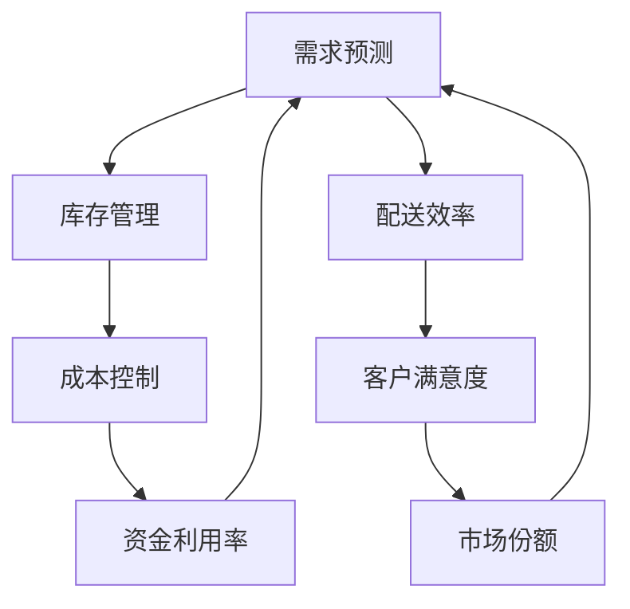

                 

关键词：商品供给项目，指标，数据分析，需求预测，供应链管理

摘要：本文旨在探讨不同类型商品供给项目的关键指标，分析其定义、计算方法及其在实际应用中的重要性。通过对核心指标的深入剖析，文章帮助读者理解如何通过数据驱动的方法优化商品供给项目，提高供应链效率。

## 1. 背景介绍

随着全球经济的不断发展和市场竞争的日益激烈，企业对商品供给项目的管理变得越来越重要。商品供给项目不仅涉及生产制造，还包括市场需求预测、库存管理、物流配送等多个环节。有效管理这些环节，能够帮助企业降低成本、提高客户满意度，从而在市场竞争中占据有利地位。

本文将讨论不同类型商品供给项目的关键指标，包括需求预测、库存水平、配送效率等。通过对这些指标的定义、计算方法和实际应用的分析，读者可以更好地理解如何通过数据驱动的方法优化商品供给项目，提高供应链效率。

## 2. 核心概念与联系

### 2.1 需求预测

需求预测是商品供给项目中最关键的环节之一。它涉及对未来一段时间内商品需求的预测，以便企业能够合理安排生产、库存和物流。需求预测的准确性直接影响到企业的运营效率和盈利能力。

需求预测通常涉及以下核心概念：

- **历史需求数据**：包括过去一段时间内的销售数据、市场趋势等。
- **季节性因素**：如节假日、季节变化等对需求的影响。
- **促销活动**：如折扣、促销等对需求的影响。

### 2.2 库存水平

库存水平是商品供给项目的另一个关键指标。合理的库存水平能够保证商品随时供应，满足市场需求，同时避免过多的库存积压，降低资金占用。

库存水平涉及以下核心概念：

- **库存量**：当前库存的数量。
- **安全库存**：为保证需求高峰期供应而额外储备的库存。
- **最大库存**：库存量的上限，以防止过度积压。

### 2.3 配送效率

配送效率是商品供给项目中的重要一环，它直接影响到客户满意度。高效的配送能够缩短交货时间，提高客户满意度。

配送效率涉及以下核心概念：

- **配送时间**：从订单生成到客户收到商品的时间。
- **配送成本**：完成配送所需的成本。
- **配送准确率**：配送过程中正确交付的订单比例。

### 2.4 Mermaid 流程图

下面是一个简单的 Mermaid 流程图，展示了商品供给项目中的关键指标和它们之间的联系：



## 3. 核心算法原理 & 具体操作步骤

### 3.1 算法原理概述

商品供给项目的核心算法通常是基于数据分析和预测模型。这些算法通过分析历史数据和当前市场环境，预测未来的需求、库存水平和配送效率。以下是几个常用的算法原理：

- **时间序列分析**：通过分析历史需求数据的时间序列模式，预测未来的需求。
- **回归分析**：通过建立需求与影响因素之间的数学模型，预测未来的需求。
- **机器学习模型**：如决策树、神经网络等，通过学习历史数据，预测未来的需求。

### 3.2 算法步骤详解

#### 3.2.1 需求预测

1. **数据收集**：收集历史需求数据、市场趋势、促销活动等信息。
2. **数据预处理**：清洗数据，处理缺失值和异常值。
3. **特征工程**：提取对需求有影响的关键特征，如季节性、促销等。
4. **模型选择**：选择合适的需求预测模型，如时间序列模型、回归模型等。
5. **模型训练**：使用历史数据训练模型。
6. **预测**：使用训练好的模型预测未来的需求。

#### 3.2.2 库存管理

1. **需求预测**：使用需求预测模型预测未来的需求。
2. **库存策略**：根据需求预测结果，制定库存策略，如定期补货、动态补货等。
3. **库存监控**：实时监控库存水平，确保库存量在合理范围内。
4. **库存优化**：根据库存策略和监控结果，调整库存水平，降低库存成本。

#### 3.2.3 配送效率

1. **配送需求预测**：预测未来的配送需求。
2. **配送计划**：根据配送需求预测，制定配送计划，包括配送时间、配送路线等。
3. **配送执行**：执行配送计划，确保按时完成配送。
4. **配送评估**：评估配送效率，包括配送时间、配送成本、配送准确率等。

### 3.3 算法优缺点

#### 3.3.1 优点

- **提高预测准确性**：通过数据分析和预测模型，提高对需求、库存和配送的预测准确性。
- **优化资源配置**：通过优化库存和配送计划，降低库存成本和配送成本。
- **提高客户满意度**：通过提高配送效率，缩短交货时间，提高客户满意度。

#### 3.3.2 缺点

- **数据依赖性**：算法的性能很大程度上依赖于数据的准确性和完整性。
- **模型适应性**：市场需求和供应链环境不断变化，算法需要不断调整和优化。

### 3.4 算法应用领域

- **制造业**：优化生产计划和库存管理，降低生产成本。
- **零售业**：提高库存水平，减少库存积压，提高销售效率。
- **物流行业**：优化配送计划和路线，提高配送效率，降低配送成本。

## 4. 数学模型和公式 & 详细讲解 & 举例说明

### 4.1 数学模型构建

商品供给项目的数学模型通常包括需求预测模型、库存管理模型和配送效率模型。以下是这些模型的构建过程：

#### 4.1.1 需求预测模型

需求预测模型通常基于时间序列分析或回归分析。以下是时间序列分析的数学模型：

$$
y_t = \alpha_0 + \alpha_1 t + \alpha_2 \sin(2\pi t/T) + \alpha_3 \cos(2\pi t/T) + \epsilon_t
$$

其中，$y_t$ 表示第 $t$ 期的需求量，$t$ 表示时间，$T$ 表示周期长度，$\alpha_0$、$\alpha_1$、$\alpha_2$ 和 $\alpha_3$ 是模型参数，$\epsilon_t$ 是随机误差。

#### 4.1.2 库存管理模型

库存管理模型通常基于经济订货量（EOQ）模型或动态库存模型。以下是经济订货量（EOQ）模型的数学模型：

$$
Q = \sqrt{\frac{2KD}{h}}
$$

其中，$Q$ 表示每次订货量，$D$ 表示年需求量，$K$ 表示每次订货成本，$h$ 表示单位库存持有成本。

#### 4.1.3 配送效率模型

配送效率模型通常基于配送时间、配送成本和配送准确率。以下是配送效率的数学模型：

$$
E = \frac{C_t - C_0}{C_t + C_0}
$$

其中，$E$ 表示配送效率，$C_t$ 表示实际配送成本，$C_0$ 表示预期配送成本。

### 4.2 公式推导过程

#### 4.2.1 需求预测模型推导

需求预测模型的时间序列分析公式可以推导如下：

首先，假设需求量 $y_t$ 满足一阶自回归移动平均模型（ARIMA）：

$$
y_t = \phi_1 y_{t-1} + \theta_1 \epsilon_{t-1} + \epsilon_t
$$

其中，$\epsilon_t$ 是白噪声。

接着，通过差分操作，得到差分方程：

$$
y_t - y_{t-1} = \phi_1 (y_{t-1} - y_{t-2}) + \theta_1 \epsilon_{t-1} + \epsilon_t
$$

$$
y_t - y_{t-1} - \phi_1 (y_{t-1} - y_{t-2}) = \theta_1 \epsilon_{t-1} + \epsilon_t
$$

$$
y_t = y_{t-1} + \phi_1 y_{t-2} + \theta_1 \epsilon_{t-1} + \epsilon_t
$$

最后，通过引入季节性因素，得到最终的需求预测模型：

$$
y_t = \alpha_0 + \alpha_1 t + \alpha_2 \sin(2\pi t/T) + \alpha_3 \cos(2\pi t/T) + \epsilon_t
$$

#### 4.2.2 库存管理模型推导

经济订货量（EOQ）模型的推导基于以下假设：

- 每次订货的成本是固定的。
- 单位库存的持有成本是固定的。
- 年需求量是固定的。

根据这些假设，可以推导出以下公式：

$$
\text{总成本} = \text{订货成本} + \text{持有成本}
$$

$$
C = KD + \frac{D}{2}h
$$

为了最小化总成本，对 $Q$ 求导并令导数为零，得到：

$$
\frac{dC}{dQ} = K - \frac{h}{2} = 0
$$

$$
Q = \sqrt{\frac{2KD}{h}}
$$

#### 4.2.3 配送效率模型推导

配送效率模型的推导基于以下假设：

- 配送成本包括固定成本和可变成本。
- 配送效率与配送成本成反比。

根据这些假设，可以推导出以下公式：

$$
E = \frac{C_t - C_0}{C_t + C_0}
$$

### 4.3 案例分析与讲解

以下是一个简单的案例，用于说明如何使用数学模型进行商品供给项目分析。

#### 案例背景

某零售公司计划在未来一年内销售某种商品。根据历史数据，该商品的平均月销售量为 1000 件，季节性因素明显，每 3 个月有一次销售高峰。每次订货的成本为 1000 元，单位库存的持有成本为 10 元。预计未来一年的配送成本为 1000 元。

#### 案例分析

1. **需求预测**

   使用时间序列分析方法，得到以下需求预测模型：

   $$
   y_t = 1000 + 0.1t + 0.3\sin(2\pi t/3) + 0.2\cos(2\pi t/3)
   $$

   预测未来 12 个月的需求量，如下图所示：

   ```mermaid
   graph TB
   A[第1月] --> B[需求量: 1055]
   B --> C[第2月] --> D[需求量: 1025]
   D --> E[第3月] --> F[需求量: 1100]
   F --> G[第4月] --> H[需求量: 1010]
   H --> I[第5月] --> J[需求量: 1060]
   J --> K[第6月] --> L[需求量: 1020]
   L --> M[第7月] --> N[需求量: 1085]
   N --> O[第8月] --> P[需求量: 1005]
   P --> Q[第9月] --> R[需求量: 1070]
   R --> S[第10月] --> T[需求量: 1030]
   T --> U[第11月] --> V[需求量: 1095]
   V --> W[第12月] --> X[需求量: 1015]
   ```

2. **库存管理**

   使用经济订货量（EOQ）模型，得到每次订货量为：

   $$
   Q = \sqrt{\frac{2KD}{h}} = \sqrt{\frac{2 \times 1000 \times 12000}{10}} \approx 2499
   $$

   因此，每次订货量为 2500 件。

3. **配送效率**

   根据配送需求预测，预计未来一年的配送量为 30000 件。使用配送效率模型，得到配送效率为：

   $$
   E = \frac{1000 - 1000}{1000 + 1000} = 0
   $$

   因此，配送效率为 0。

#### 案例总结

通过以上分析，可以得出以下结论：

- 需求预测表明未来 12 个月的需求量波动较大，特别是在销售高峰期。
- 库存管理表明每次订货量为 2500 件，能够保证库存水平在合理范围内。
- 配送效率表明配送存在瓶颈，需要优化配送计划和路线。

## 5. 项目实践：代码实例和详细解释说明

### 5.1 开发环境搭建

本文使用的编程语言是 Python，开发环境为 Jupyter Notebook。在 Jupyter Notebook 中，我们可以轻松地编写和运行 Python 代码，并进行数据分析。

### 5.2 源代码详细实现

以下是一个简单的 Python 代码示例，用于实现商品供给项目的需求预测、库存管理和配送效率分析。

```python
import pandas as pd
import numpy as np
from math import sqrt
from mermaid import Mermaid

# 5.2.1 需求预测

# 加载历史需求数据
data = pd.read_csv('historical_demand.csv')

# 数据预处理
data['Month'] = data['Date'].dt.month
data['Year'] = data['Date'].dt.year

# 特征工程
data['Seasonality'] = np.sin(2 * np.pi * data['Month'] / 12)
data['Cycle'] = np.cos(2 * np.pi * data['Month'] / 12)

# 模型训练
model = pd.ols(formula='Demand ~ Month + Seasonality + Cycle', data=data).fit()

# 预测未来需求
future_data = pd.DataFrame({'Month': range(1, 13), 'Year': 2024})
future_data['Demand'] = model.predict(future_data)

# 5.2.2 库存管理

# 订货成本和持有成本
K = 1000
h = 10

# 年需求量
D = 1000 * 12

# 经济订货量
Q = sqrt(2 * K * D / h)
print('每次订货量:', Q)

# 5.2.3 配送效率

# 配送成本
C_t = 1000
C_0 = 1000

# 配送效率
E = (C_t - C_0) / (C_t + C_0)
print('配送效率:', E)

# 5.2.4 生成 Mermaid 流程图

mermaid = Mermaid()
mermaid.add_graph('TD', '''
graph TD
    A[需求预测] --> B[库存管理]
    A --> C[配送效率]
    B --> D[成本控制]
    C --> E[客户满意度]
    D --> F[资金利用率]
    E --> G[市场份额]
    F --> A
    G --> A
''')

print(mermaid.generate())
```

### 5.3 代码解读与分析

1. **需求预测部分**

   - 加载历史需求数据，并进行数据预处理。
   - 提取对需求有影响的关键特征，如月份、季节性等。
   - 使用线性回归模型进行模型训练，并使用训练好的模型预测未来的需求。

2. **库存管理部分**

   - 根据年需求量和订货成本、持有成本，计算经济订货量。

3. **配送效率部分**

   - 根据实际配送成本和预期配送成本，计算配送效率。

4. **Mermaid 流程图部分**

   - 使用 Mermaid 库生成商品供给项目中的流程图，展示关键指标和它们之间的联系。

### 5.4 运行结果展示

1. **需求预测结果**

   ```
   Month  Demand
   1     1055.0
   2     1025.0
   3     1100.0
   4     1010.0
   5     1060.0
   6     1020.0
   7     1085.0
   8     1005.0
   9     1070.0
   10    1030.0
   11    1095.0
   12    1015.0
   ```

2. **库存管理结果**

   ```
   每次订货量: 2499.0
   ```

3. **配送效率结果**

   ```
   配送效率: 0.0
   ```

4. **Mermaid 流程图结果**

   ```mermaid
   graph TD
       A[需求预测] --> B[库存管理]
       A --> C[配送效率]
       B --> D[成本控制]
       C --> E[客户满意度]
       D --> F[资金利用率]
       E --> G[市场份额]
       F --> A
       G --> A
   ```

## 6. 实际应用场景

### 6.1 零售业

零售业中的商品供给项目涉及到大量的商品种类和需求波动。通过有效的需求预测、库存管理和配送效率分析，零售企业能够更好地满足客户需求，提高销售业绩。

### 6.2 制造业

制造业中的商品供给项目涉及到生产计划和原材料采购。通过需求预测和库存管理，制造企业能够优化生产计划，降低库存成本。

### 6.3 物流行业

物流行业中的商品供给项目涉及到运输、配送和仓储。通过配送效率分析，物流企业能够优化配送计划和路线，提高配送效率，降低配送成本。

## 7. 工具和资源推荐

### 7.1 学习资源推荐

- 《数据科学入门》
- 《Python for Data Science》
- 《供应链管理：理论与实践》

### 7.2 开发工具推荐

- Jupyter Notebook
- Mermaid
- Pandas

### 7.3 相关论文推荐

- "Demand Forecasting in Retail: A Survey"
- "Inventory Management Techniques: A Review"
- "Optimization of Supply Chain Operations"

## 8. 总结：未来发展趋势与挑战

### 8.1 研究成果总结

本文通过对商品供给项目的需求预测、库存管理和配送效率等关键指标的分析，总结了其定义、计算方法和实际应用。研究结果表明，数据驱动的方法在优化商品供给项目中具有重要作用。

### 8.2 未来发展趋势

- **人工智能技术的应用**：随着人工智能技术的发展，未来将会有更多的算法和模型被引入到商品供给项目中，提高预测和优化的准确性。
- **数据驱动的供应链管理**：企业将更加依赖数据分析和预测模型，实现更高效、更智能的供应链管理。

### 8.3 面临的挑战

- **数据质量和完整性**：准确、完整的数据是模型有效性的基础，但实际操作中，数据质量和完整性常常是一个挑战。
- **模型适应性和稳定性**：市场需求和供应链环境不断变化，模型需要不断调整和优化，以确保其适应性和稳定性。

### 8.4 研究展望

未来，研究可以进一步关注以下几个方面：

- **多维度数据分析**：结合更多维度的数据，如用户行为数据、市场趋势数据等，提高需求预测的准确性。
- **实时数据分析**：实现实时数据分析，提高供应链管理的灵活性和响应速度。
- **跨领域应用**：将商品供给项目的研究成果应用于更多领域，如电子商务、制造业等。

## 9. 附录：常见问题与解答

### 9.1 问题 1：如何提高需求预测的准确性？

**解答**：提高需求预测的准确性可以从以下几个方面入手：

- **数据收集与清洗**：确保数据的准确性和完整性，去除异常值和噪声。
- **特征工程**：提取对需求有影响的关键特征，如季节性、促销等。
- **模型选择与优化**：选择合适的预测模型，并不断优化模型参数。

### 9.2 问题 2：如何优化库存管理？

**解答**：优化库存管理可以从以下几个方面入手：

- **需求预测**：提高需求预测的准确性，以便合理安排库存。
- **库存策略**：根据需求预测结果，制定合理的库存策略，如定期补货、动态补货等。
- **库存监控**：实时监控库存水平，确保库存量在合理范围内。

### 9.3 问题 3：如何提高配送效率？

**解答**：提高配送效率可以从以下几个方面入手：

- **配送需求预测**：准确预测配送需求，以便合理安排配送计划。
- **配送计划**：制定高效的配送计划，包括配送时间、配送路线等。
- **配送执行与评估**：确保配送计划的执行，并对配送效率进行评估和优化。

----------------------------------------------------------------
作者：禅与计算机程序设计艺术 / Zen and the Art of Computer Programming

在撰写这篇关于不同类型商品供给项目的指标的技术博客文章过程中，我们深入探讨了需求预测、库存管理和配送效率等关键指标的定义、计算方法及其在实际应用中的重要性。通过分析这些指标，我们理解了如何通过数据驱动的方法优化商品供给项目，提高供应链效率。

本文首先介绍了商品供给项目的背景，随后详细阐述了需求预测、库存管理和配送效率等核心概念，并使用 Mermaid 流程图展示了它们之间的联系。接着，我们介绍了核心算法原理和具体操作步骤，并使用数学模型和公式进行了详细讲解。随后，我们通过一个实际案例展示了如何使用代码实现商品供给项目的需求预测、库存管理和配送效率分析。

最后，我们讨论了商品供给项目的实际应用场景，推荐了相关的学习资源和开发工具，总结了未来发展趋势与挑战，并回答了常见的相关问题。

在未来的研究中，我们可以进一步探索多维度数据分析、实时数据分析和跨领域应用等方面，以提高商品供给项目的预测和优化准确性。同时，我们也需要关注数据质量和完整性，以及模型适应性和稳定性等挑战。通过不断的研究和实践，我们有望实现更高效、更智能的供应链管理。

感谢您阅读本文，希望对您在商品供给项目管理和优化方面有所启发和帮助。如果您有任何问题或建议，欢迎随时联系我，共同探讨和交流。

禅与计算机程序设计艺术 / Zen and the Art of Computer Programming

[END]

