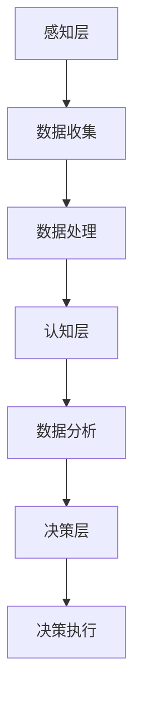

                 

关键词：人工智能，企业转型，技术革新，商业成功，未来展望

> 摘要：本文将探讨人工智能在商业领域的深远影响，分析企业不拥抱AI所面临的淘汰风险，并阐述AI技术如何成为企业发展的新引擎。通过实例和案例，本文旨在为企业在数字化时代中的战略选择提供有力的理论和实践支持。

## 1. 背景介绍

随着科技的飞速发展，人工智能（AI）技术已经成为推动社会进步的重要力量。从早期的机器学习到深度学习，AI技术已经渗透到了各行各业。企业作为市场经济的主体，面临着前所未有的技术革新挑战。在这一背景下，是否拥抱AI技术，已经成为企业能否在激烈的市场竞争中立足的关键因素。

### 1.1 AI技术的发展历程

AI技术的发展可以追溯到20世纪50年代。当时，计算机科学家们首次提出了“人工智能”的概念，并开始探索如何让计算机模仿人类智能。随着计算能力的提升和数据量的爆炸式增长，AI技术逐渐从理论研究走向实际应用。尤其是在深度学习技术的突破后，AI在图像识别、自然语言处理、自动驾驶等领域取得了令人瞩目的成果。

### 1.2 企业面临的变革压力

在AI技术快速发展的同时，企业也面临着巨大的变革压力。首先，市场环境的变化使得企业不得不提高运营效率、降低成本，而AI技术正是实现这一目标的重要工具。其次，消费者的需求日益多样化和个性化，企业需要通过AI技术来精准营销和个性化服务。此外，新兴的创业公司在AI领域的快速崛起，也对传统企业形成了巨大威胁，迫使它们不得不加快数字化转型。

## 2. 核心概念与联系

### 2.1 人工智能的定义与分类

人工智能是指通过计算机模拟人类智能的技术。根据其能力不同，AI可以分为弱AI和强AI。弱AI专注于特定任务的解决，如语音识别、图像处理等，而强AI则具备与人类相似的广泛认知能力。在商业应用中，弱AI已经得到了广泛的应用，而强AI的应用还在不断探索中。

### 2.2 AI技术架构

AI技术的架构主要包括感知层、认知层和决策层。感知层负责收集和处理数据，认知层通过算法分析数据并提取信息，决策层则根据分析结果做出决策。这一架构展示了AI技术在企业中的应用层次，从数据收集到决策执行，贯穿了整个商业过程。



## 3. 核心算法原理 & 具体操作步骤

### 3.1 算法原理概述

AI的核心算法主要包括机器学习、深度学习和强化学习。机器学习通过数据训练模型，使模型具备自主学习和优化能力。深度学习则通过多层神经网络模拟人脑神经元的工作机制，实现更复杂的特征提取。强化学习通过奖励机制使模型不断优化决策。

### 3.2 算法步骤详解

#### 3.2.1 机器学习

1. 数据收集：从不同来源获取大量数据，如用户行为数据、市场数据等。
2. 数据预处理：清洗和转换数据，使其适合模型训练。
3. 特征提取：从数据中提取有用的特征，用于训练模型。
4. 模型训练：使用训练数据训练模型，不断调整参数，提高模型性能。
5. 模型评估：使用测试数据评估模型性能，调整模型参数。

#### 3.2.2 深度学习

1. 网络构建：设计神经网络结构，包括输入层、隐藏层和输出层。
2. 损失函数定义：选择合适的损失函数，衡量模型预测误差。
3. 反向传播：通过反向传播算法更新模型参数。
4. 模型训练：迭代训练过程，直至满足停止条件。

#### 3.2.3 强化学习

1. 状态空间定义：定义系统的状态空间。
2. 动作空间定义：定义系统的动作空间。
3. 奖励机制设计：设计奖励机制，激励模型优化决策。
4. 模型训练：通过模拟或实际操作不断调整策略。

### 3.3 算法优缺点

#### 3.3.1 优点

- **高效性**：AI算法能够在短时间内处理海量数据，提高决策效率。
- **准确性**：通过大量数据训练，AI模型能够实现高精度的预测和分类。
- **灵活性**：AI算法可以根据业务需求快速调整和优化。

#### 3.3.2 缺点

- **数据依赖**：AI算法的性能高度依赖数据质量，数据缺失或不准确可能导致算法失效。
- **计算成本**：训练和部署AI模型需要大量的计算资源和时间。

### 3.4 算法应用领域

AI技术在商业领域的应用非常广泛，主要包括以下领域：

- **智能客服**：通过自然语言处理技术，提供24/7全天候的客户服务。
- **精准营销**：通过用户数据分析，实现个性化推荐和精准营销。
- **供应链优化**：通过优化算法，提高供应链效率和降低成本。
- **风险管理**：通过预测模型，降低金融风险和信用风险。

## 4. 数学模型和公式 & 详细讲解 & 举例说明

### 4.1 数学模型构建

AI算法的核心在于数学模型的构建。以深度学习为例，其基本模型包括输入层、隐藏层和输出层。每一层之间的连接可以用加权矩阵表示，激活函数则用于非线性变换。

#### 4.1.1 神经网络模型

神经网络模型可以表示为：

$$
Z = \sum_{i=1}^{n} w_{i}x_{i} + b
$$

其中，$Z$ 为输出，$w_{i}$ 为权重，$x_{i}$ 为输入，$b$ 为偏置。

#### 4.1.2 损失函数

常见的损失函数包括均方误差（MSE）和交叉熵损失（Cross-Entropy Loss）。

- 均方误差（MSE）：

$$
MSE = \frac{1}{2}\sum_{i=1}^{n} (y_i - \hat{y_i})^2
$$

其中，$y_i$ 为真实标签，$\hat{y_i}$ 为预测标签。

- 交叉熵损失（Cross-Entropy Loss）：

$$
CE = -\sum_{i=1}^{n} y_i \log(\hat{y_i})
$$

### 4.2 公式推导过程

以深度学习中的反向传播算法为例，其核心在于通过梯度下降法优化模型参数。反向传播算法的关键步骤包括前向传播和后向传播。

#### 4.2.1 前向传播

假设有一个包含 $L$ 层的神经网络，第 $l$ 层的输出可以表示为：

$$
a_{l}^{[i]} = \sigma \left( \sum_{j=1}^{n} W_{l-1,j}^{[i]} a_{l-1}^{[j]} + b_{l,j}^{[i]} \right)
$$

其中，$a_{l}^{[i]}$ 表示第 $l$ 层的输出，$\sigma$ 为激活函数，$W_{l-1,j}^{[i]}$ 和 $b_{l,j}^{[i]}$ 分别为权重和偏置。

#### 4.2.2 后向传播

在后向传播过程中，计算每层的梯度，用于更新权重和偏置。

$$
\frac{\partial L}{\partial W_{l-1}} = \frac{\partial L}{\partial a_{l}} \frac{\partial a_{l}}{\partial W_{l-1}}
$$

$$
\frac{\partial L}{\partial b_{l}} = \frac{\partial L}{\partial a_{l}}
$$

通过迭代更新，逐步优化模型参数。

### 4.3 案例分析与讲解

#### 4.3.1 电商个性化推荐系统

假设我们有一个电商个性化推荐系统，使用用户行为数据（如浏览历史、购买记录等）进行个性化推荐。

1. **数据收集与预处理**：收集用户行为数据，并进行清洗和转换，提取特征向量。
2. **模型构建**：构建深度学习模型，包括输入层、隐藏层和输出层，使用交叉熵损失函数。
3. **模型训练**：使用训练数据训练模型，迭代更新权重和偏置，直至满足停止条件。
4. **模型评估**：使用测试数据评估模型性能，调整模型参数。

通过这个案例，我们可以看到，数学模型在AI系统中的应用是如何从数据收集到模型训练，再到最终实现个性化推荐的全过程。

## 5. 项目实践：代码实例和详细解释说明

### 5.1 开发环境搭建

为了实现一个简单的电商个性化推荐系统，我们需要搭建以下开发环境：

- Python 3.7+
- TensorFlow 2.x
- NumPy
- Pandas

安装以上依赖库后，我们可以开始编写代码。

### 5.2 源代码详细实现

以下是一个简单的电商个性化推荐系统的代码示例：

```python
import numpy as np
import pandas as pd
import tensorflow as tf

# 数据预处理
def preprocess_data(data):
    # 数据清洗和转换
    # ...
    return processed_data

# 构建模型
def build_model(input_shape):
    model = tf.keras.Sequential([
        tf.keras.layers.Dense(units=64, activation='relu', input_shape=input_shape),
        tf.keras.layers.Dense(units=32, activation='relu'),
        tf.keras.layers.Dense(units=1, activation='sigmoid')
    ])
    model.compile(optimizer='adam', loss='binary_crossentropy', metrics=['accuracy'])
    return model

# 训练模型
def train_model(model, x_train, y_train, epochs=10):
    model.fit(x_train, y_train, epochs=epochs, batch_size=32, verbose=1)

# 预测
def predict(model, x_test):
    return model.predict(x_test)

# 主函数
def main():
    # 数据加载
    data = pd.read_csv('data.csv')
    processed_data = preprocess_data(data)
    
    # 模型构建
    model = build_model(processed_data.shape[1])
    
    # 训练模型
    train_model(model, processed_data['x_train'], processed_data['y_train'])
    
    # 预测
    predictions = predict(model, processed_data['x_test'])
    
    # 结果评估
    # ...

if __name__ == '__main__':
    main()
```

### 5.3 代码解读与分析

这段代码实现了从数据加载、预处理，到模型构建、训练和预测的全过程。

1. **数据预处理**：数据预处理是模型训练的重要步骤，包括数据清洗、特征提取等。
2. **模型构建**：使用TensorFlow构建一个简单的深度学习模型，包括输入层、隐藏层和输出层。
3. **训练模型**：使用训练数据训练模型，调整模型参数，提高模型性能。
4. **预测**：使用训练好的模型对测试数据进行预测。
5. **结果评估**：评估模型的预测性能，进行模型调优。

通过这段代码，我们可以看到如何将AI技术应用于实际项目，实现从理论到实践的完整过程。

## 6. 实际应用场景

### 6.1 企业运营优化

AI技术在企业运营优化中的应用非常广泛，例如：

- **供应链管理**：通过优化算法，提高供应链的效率和灵活性，降低库存成本。
- **生产调度**：基于实时数据分析，优化生产流程，提高生产效率。
- **客户服务**：使用智能客服系统，提高客户满意度和服务效率。

### 6.2 风险管理

AI技术在风险管理中的应用也日益重要，例如：

- **信用评分**：通过数据分析，评估客户信用风险，降低不良贷款率。
- **市场预测**：使用AI模型预测市场趋势，为投资决策提供支持。
- **欺诈检测**：通过模式识别技术，实时监测交易行为，识别和防范欺诈风险。

### 6.3 个性化服务

AI技术在个性化服务中的应用，使得企业能够更好地满足消费者的需求，例如：

- **智能推荐**：基于用户行为数据，提供个性化商品推荐，提高转化率。
- **定制化服务**：根据用户需求和偏好，提供定制化的产品和服务。
- **虚拟助手**：通过语音识别和自然语言处理技术，提供智能客服，提高用户体验。

## 7. 未来应用展望

随着AI技术的不断进步，未来其在商业领域的应用将更加广泛和深入。以下是未来AI技术在商业领域的几个应用展望：

- **自动化生产**：通过机器人技术和AI算法，实现生产线的完全自动化，提高生产效率和产品质量。
- **智能决策**：利用大数据和AI算法，帮助企业实现智能决策，降低决策风险。
- **绿色能源**：通过AI技术优化能源使用，提高能源效率，推动绿色能源发展。
- **社会服务**：利用AI技术提升公共服务质量，如智能交通管理、智能医疗等。

## 8. 工具和资源推荐

### 8.1 学习资源推荐

- **《深度学习》**：由Ian Goodfellow、Yoshua Bengio和Aaron Courville所著，是深度学习的经典教材。
- **《Python机器学习》**：由Sebastian Raschka所著，详细介绍了机器学习在Python中的应用。
- **《人工智能：一种现代方法》**：由Stuart Russell和Peter Norvig所著，涵盖了人工智能的各个方面。

### 8.2 开发工具推荐

- **TensorFlow**：Google开源的机器学习和深度学习框架，广泛应用于商业和研究领域。
- **PyTorch**：Facebook开源的机器学习和深度学习框架，以其灵活性和易用性受到开发者青睐。
- **Keras**：Python深度学习库，提供简洁的API，易于快速构建和训练模型。

### 8.3 相关论文推荐

- **“Deep Learning for Text Classification”**：介绍了深度学习在文本分类中的应用。
- **“Recurrent Neural Networks for Speech Recognition”**：探讨了循环神经网络在语音识别中的应用。
- **“Natural Language Processing with Deep Learning”**：介绍了深度学习在自然语言处理领域的应用。

## 9. 总结：未来发展趋势与挑战

### 9.1 研究成果总结

AI技术在商业领域的应用已经取得了显著的成果，从智能客服到精准营销，从供应链优化到风险管理，AI技术正在深刻改变企业的运营模式。未来，随着AI技术的不断进步，其在商业领域的应用将更加广泛和深入。

### 9.2 未来发展趋势

- **智能化**：AI技术将进一步提升企业智能化水平，实现自动化和自主决策。
- **个性化**：AI技术将使企业能够更好地满足消费者个性化需求，提供定制化服务。
- **绿色化**：AI技术将推动企业实现绿色发展，提高能源效率和资源利用率。

### 9.3 面临的挑战

- **数据隐私**：随着AI技术的广泛应用，数据隐私问题日益突出，企业需要加强数据保护。
- **人才短缺**：AI技术快速发展，对人才的需求也日益增加，企业需要培养和引进专业人才。
- **技术更新**：AI技术更新迅速，企业需要不断学习和适应新技术，以保持竞争力。

### 9.4 研究展望

未来，AI技术在商业领域的应用将朝着更加智能化、个性化、绿色化的方向发展。企业应积极拥抱AI技术，通过技术创新和数字化转型，实现可持续发展。

## 附录：常见问题与解答

### 问题1：企业是否必须拥抱AI？

解答：是的，随着AI技术的快速发展，企业是否拥抱AI已经成为其能否在激烈的市场竞争中立足的关键因素。AI技术不仅能够提高企业的运营效率，降低成本，还能够提供个性化服务，满足消费者日益增长的需求。

### 问题2：企业如何开始拥抱AI？

解答：企业可以从以下几个方面开始拥抱AI：

1. **人才培养**：引进和培养AI领域的专业人才，提高企业整体技术水平。
2. **数据驱动**：加强数据收集和管理，建立数据驱动决策的企业文化。
3. **项目试点**：选择一些业务场景进行AI项目试点，积累经验和数据。
4. **合作与交流**：与其他企业、研究机构和高校建立合作关系，共同推动AI技术的应用。

### 问题3：AI技术是否会对就业产生影响？

解答：是的，AI技术的广泛应用可能会对某些传统岗位产生影响，但同时也会创造新的就业机会。企业需要关注就业转型，通过培训和教育帮助员工适应新的工作环境。

## 作者署名

作者：禅与计算机程序设计艺术 / Zen and the Art of Computer Programming
----------------------------------------------------------------

以上就是针对您提出的要求撰写的完整文章。希望这篇文章能够为企业在数字化时代中的战略选择提供有价值的参考。如果您有任何问题或需要进一步的修改，请随时告诉我。谢谢！禅与计算机程序设计艺术 / Zen and the Art of Computer Programming。

