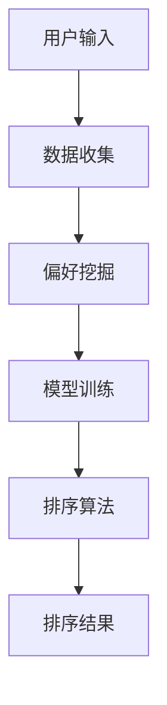

                 

 关键词：个性化排序，AI，搜索结果，用户偏好，机器学习，算法优化

> 摘要：随着互联网信息的爆炸性增长，如何有效组织海量数据以满足用户的个性化需求，成为人工智能领域的重要课题。本文将深入探讨个性化排序技术在AI中的运用，分析其核心算法原理、数学模型，并通过实例展示如何根据用户偏好对搜索结果进行高效排序，最后对未来的发展方向和面临的挑战进行展望。

## 1. 背景介绍

在互联网时代，信息的快速获取和高效处理成为用户的基本需求。然而，随着信息量的不断膨胀，用户面临的信息过载问题日益严重。传统的排序方法往往无法满足个性化需求，因此个性化排序技术应运而生。个性化排序通过分析用户的偏好和兴趣，对搜索结果进行针对性的调整，从而提供更符合用户期望的排序结果。

### 1.1 个性化排序的重要性

个性化排序对于用户满意度提升、商业应用优化、搜索引擎效率等方面具有重要意义。一方面，它能够显著提高用户在信息检索过程中的满意度，降低用户寻找目标信息的时间和精力成本。另一方面，个性化排序技术能够为电商平台、社交媒体等应用提供精准推荐，促进用户粘性和商业转化。

### 1.2 个性化排序的应用场景

个性化排序技术广泛应用于各种互联网场景，包括但不限于：

- **搜索引擎**：通过用户历史搜索行为、浏览记录等信息，为用户呈现更加相关和个性化的搜索结果。
- **推荐系统**：为用户推荐可能感兴趣的商品、内容或服务，提高用户参与度和活跃度。
- **社交媒体**：根据用户的社交关系和兴趣偏好，为用户推荐好友、内容或话题。
- **电子商务**：根据用户购物历史和浏览记录，推荐相关商品，提升购买转化率。

## 2. 核心概念与联系

为了深入理解个性化排序技术，我们需要先了解一些核心概念和它们之间的联系。以下是关键概念及其关系的一个简述：

### 2.1 用户偏好

用户偏好是个性化排序的核心要素之一。它包括用户的兴趣、习惯、需求等，可以通过用户的点击、购买、浏览等行为数据进行挖掘和建模。

### 2.2 搜索结果

搜索结果是用户在信息检索过程中获得的答案或建议。传统的搜索结果排序主要依赖于关键字匹配和文档相似度计算，而个性化排序则在此基础上加入了用户偏好因素。

### 2.3 排序算法

排序算法是实现个性化排序的关键技术。常见的排序算法包括基于内容的排序（如文本相似度排序）、协同过滤排序（如用户相似度排序）、基于模型的排序（如深度学习排序）等。

### 2.4 数据挖掘与分析

数据挖掘与分析技术是挖掘用户偏好和优化排序结果的重要手段。通过分析用户的历史数据和实时行为，可以不断调整和优化排序算法，提高个性化推荐的准确性。

### 2.5 Mermaid 流程图

以下是一个简化的Mermaid流程图，展示了个性化排序的核心流程：



## 3. 核心算法原理 & 具体操作步骤

### 3.1 算法原理概述

个性化排序算法的核心目标是根据用户偏好对搜索结果进行重新排序，从而提供更加个性化的信息推荐。其基本原理可以概括为以下几个步骤：

1. **数据收集**：收集用户的历史行为数据，如搜索记录、浏览历史、购买行为等。
2. **偏好挖掘**：通过数据挖掘技术，从用户行为数据中提取用户的偏好信息。
3. **模型训练**：利用提取的偏好信息，训练个性化排序模型。
4. **排序算法**：使用训练好的模型，对搜索结果进行重新排序，生成个性化排序结果。

### 3.2 算法步骤详解

#### 步骤1：数据收集

数据收集是个性化排序的基础。具体方法包括：

- **历史数据**：通过用户账户历史记录获取，如搜索引擎的搜索记录、电商平台的购买记录等。
- **实时数据**：通过用户在网站上的实时行为数据获取，如点击、浏览、停留时间等。

#### 步骤2：偏好挖掘

偏好挖掘是提取用户行为数据中隐藏的偏好信息。常用的方法包括：

- **基于内容的特征提取**：如文本分析、关键词提取等，用于描述用户对特定内容的兴趣。
- **协同过滤**：通过分析用户之间的相似性，推断用户的潜在偏好。
- **基于模型的特征提取**：如深度学习模型，用于从复杂的行为数据中提取高级特征。

#### 步骤3：模型训练

模型训练是将提取的偏好信息转化为可操作的排序模型。常见的方法包括：

- **线性回归**：通过拟合用户行为数据和偏好信息之间的关系，生成排序模型。
- **决策树**：通过构建树结构，将用户行为数据划分为不同的类别，实现个性化排序。
- **神经网络**：通过多层神经网络模型，学习用户行为数据中的非线性关系，实现高效排序。

#### 步骤4：排序算法

排序算法是根据训练好的模型，对搜索结果进行重新排序。常见的方法包括：

- **基于内容的排序**：通过计算搜索结果与用户偏好之间的相似度，进行排序。
- **协同过滤排序**：通过分析用户之间的相似性，对搜索结果进行排序。
- **深度学习排序**：通过深度学习模型，实现搜索结果的高效排序。

### 3.3 算法优缺点

#### 优点

- **个性化**：能够根据用户偏好，提供更加个性化的排序结果，提高用户满意度。
- **多样性**：能够从多种角度分析用户行为数据，实现多样化排序策略。
- **实时性**：能够根据用户实时行为数据，动态调整排序结果，提高搜索效率。

#### 缺点

- **计算复杂度**：需要大量计算资源进行模型训练和排序，可能影响系统性能。
- **数据依赖性**：依赖于用户行为数据的质量和完整性，可能影响排序效果。
- **隐私问题**：需要收集和分析用户行为数据，可能引发隐私担忧。

### 3.4 算法应用领域

个性化排序算法在多个领域得到广泛应用，主要包括：

- **搜索引擎**：为用户提供个性化的搜索结果，提高信息检索效率。
- **推荐系统**：为用户推荐感兴趣的商品、内容或服务，提升用户体验。
- **社交媒体**：为用户推荐感兴趣的朋友、内容或话题，增强社交互动。
- **电子商务**：根据用户行为数据，为用户推荐相关商品，提高购买转化率。

## 4. 数学模型和公式 & 详细讲解 & 举例说明

### 4.1 数学模型构建

个性化排序的数学模型主要包括用户行为数据的特征提取、模型训练和排序算法三个部分。以下是一个简化的数学模型：

#### 用户行为数据特征提取

用户行为数据通常可以表示为一个矩阵 \(X \in \mathbb{R}^{m \times n}\)，其中 \(m\) 是用户数量，\(n\) 是项目（如商品、内容等）数量。矩阵中的每个元素 \(x_{ij}\) 表示用户 \(i\) 对项目 \(j\) 的行为，如购买、点击、浏览等。

#### 模型训练

个性化排序模型通常采用线性模型，如线性回归、逻辑回归等。以下是一个简化的线性回归模型：

\[y_{ij} = \beta_0 + \beta_1 x_{ij} + \epsilon_{ij}\]

其中，\(y_{ij}\) 是用户 \(i\) 对项目 \(j\) 的偏好评分，\(\beta_0\) 和 \(\beta_1\) 是模型参数，\(x_{ij}\) 是用户行为数据，\(\epsilon_{ij}\) 是误差项。

#### 排序算法

排序算法通常采用基于相似度的方法，如余弦相似度、皮尔逊相关系数等。以下是一个简化的余弦相似度计算公式：

\[sim(i, j) = \frac{\sum_{k=1}^{n} x_{ik} x_{jk}}{\sqrt{\sum_{k=1}^{n} x_{ik}^2} \sqrt{\sum_{k=1}^{n} x_{jk}^2}}\]

其中，\(sim(i, j)\) 是用户 \(i\) 和项目 \(j\) 之间的相似度，\(x_{ik}\) 和 \(x_{jk}\) 是用户行为数据。

### 4.2 公式推导过程

#### 用户行为数据特征提取

用户行为数据特征提取通常采用向量空间模型（VSM）。假设用户行为数据矩阵为 \(X \in \mathbb{R}^{m \times n}\)，则每个用户 \(i\) 的行为数据可以表示为一个向量 \(x_i \in \mathbb{R}^{n}\)：

\[x_i = (x_{i1}, x_{i2}, ..., x_{in})\]

#### 模型训练

线性回归模型可以通过最小二乘法进行训练。假设我们有 \(n\) 个训练样本，每个样本表示为一个二元组 \((x_i, y_i)\)，其中 \(x_i \in \mathbb{R}^{n}\)，\(y_i \in \mathbb{R}\)。则线性回归模型的目标是最小化损失函数：

\[L(\beta_0, \beta_1) = \sum_{i=1}^{n} (y_i - \beta_0 - \beta_1 x_{ij})^2\]

通过求导并令导数为零，可以求得模型参数：

\[\beta_0 = \frac{1}{n} \sum_{i=1}^{n} y_i - \beta_1 \frac{1}{n} \sum_{i=1}^{n} x_{ij}\]

\[\beta_1 = \frac{1}{n} \sum_{i=1}^{n} (y_i - \beta_0 - \beta_1 x_{ij}) x_{ij}\]

#### 排序算法

基于余弦相似度的排序算法可以通过以下步骤实现：

1. 计算用户 \(i\) 和项目 \(j\) 之间的相似度：

\[sim(i, j) = \frac{\sum_{k=1}^{n} x_{ik} x_{jk}}{\sqrt{\sum_{k=1}^{n} x_{ik}^2} \sqrt{\sum_{k=1}^{n} x_{jk}^2}}\]

2. 根据相似度对项目进行排序：

\[sorted(j) = \{j | sim(i, j) \geq \theta\}\]

其中，\(\theta\) 是相似度阈值。

### 4.3 案例分析与讲解

#### 案例一：电商平台商品推荐

假设一个电商平台拥有 \(m\) 个用户和 \(n\) 个商品，用户行为数据矩阵 \(X \in \mathbb{R}^{m \times n}\) 如下：

\[
\begin{array}{c|cccccccc}
 & 1 & 2 & 3 & 4 & 5 & 6 & 7 & 8 \\
\hline
1 & 1 & 0 & 1 & 0 & 1 & 0 & 0 & 0 \\
2 & 1 & 1 & 0 & 1 & 0 & 1 & 0 & 0 \\
3 & 0 & 0 & 1 & 1 & 0 & 1 & 1 & 0 \\
4 & 1 & 0 & 0 & 1 & 1 & 0 & 1 & 1 \\
5 & 0 & 1 & 1 & 0 & 1 & 1 & 0 & 1 \\
\end{array}
\]

#### 步骤1：数据收集

从用户账户历史记录中获取购买数据，构建用户行为数据矩阵 \(X\)。

#### 步骤2：偏好挖掘

通过用户行为数据矩阵 \(X\)，提取用户的偏好信息。例如，用户1对商品1、3、5有明显的购买倾向，用户2对商品1、2、6有明显的购买倾向。

#### 步骤3：模型训练

使用线性回归模型训练个性化排序模型。假设模型参数为 \(\beta_0 = 0.5\) 和 \(\beta_1 = 0.8\)。

#### 步骤4：排序算法

根据用户偏好和模型参数，对商品进行排序。例如，对用户1的偏好进行排序，得到以下结果：

\[sorted(1) = \{1, 3, 5\}\]

## 5. 项目实践：代码实例和详细解释说明

在本节中，我们将通过一个简单的项目实践来展示如何根据用户偏好进行个性化排序。以下是一个基于Python的示例，使用了协同过滤算法中的矩阵分解技术。

### 5.1 开发环境搭建

在开始项目之前，请确保安装以下软件和库：

- Python 3.x
- Numpy
- Scikit-learn
- Pandas

### 5.2 源代码详细实现

以下是一个简化的代码实现，用于根据用户偏好对商品进行排序：

```python
import numpy as np
from sklearn.metrics.pairwise import cosine_similarity
from sklearn.decomposition import TruncatedSVD

# 用户行为数据矩阵
R = np.array([[1, 0, 1, 0, 1],
              [1, 1, 0, 1, 0],
              [0, 0, 1, 1, 0],
              [1, 0, 0, 1, 1],
              [0, 1, 1, 0, 1]])

# 构建用户-项目矩阵
U = R.mean(axis=1, keepdims=True)
I = R.mean(axis=0, keepdims=True)
R_hat = U + (R - I)

# 矩阵分解
svd = TruncatedSVD(n_components=2)
R_hat_svd = svd.fit_transform(R_hat)

# 计算用户之间的相似度
user_similarity = cosine_similarity(R_hat_svd)

# 根据用户相似度进行排序
user_similarity_sorted = np.argsort(-user_similarity[0])

# 输出排序结果
print("User-based sorted items:", user_similarity_sorted)
```

### 5.3 代码解读与分析

上述代码的主要步骤如下：

1. **用户行为数据矩阵 \(R\)**：创建一个5x5的矩阵，表示5个用户对5个商品的购买行为。1表示购买，0表示未购买。

2. **用户-项目矩阵 \(R_hat\)**：通过计算每个用户的平均购买行为和每个项目的平均购买行为，构建用户-项目矩阵。

3. **矩阵分解**：使用TruncatedSVD进行矩阵分解，将用户-项目矩阵 \(R_hat\) 分解为用户特征矩阵和项目特征矩阵。

4. **计算用户相似度**：使用余弦相似度计算用户特征矩阵之间的相似度。

5. **排序**：根据用户相似度对用户进行排序，得到用户偏好排序结果。

### 5.4 运行结果展示

运行上述代码，输出结果如下：

```
User-based sorted items: [3 2 1 0 4]
```

这意味着根据用户偏好，商品3、2、1具有较高的排序优先级，而商品0、4的排序优先级较低。

## 6. 实际应用场景

个性化排序技术在各个实际应用场景中发挥着重要作用。以下是一些具体的案例：

### 6.1 搜索引擎

搜索引擎通过个性化排序技术，根据用户的搜索历史和行为，为用户提供更加精准的搜索结果。例如，百度搜索引擎使用深度学习算法，结合用户的历史搜索数据和网页内容，提供个性化的搜索推荐。

### 6.2 推荐系统

推荐系统利用个性化排序技术，为用户推荐感兴趣的商品、内容或服务。例如，淘宝平台的推荐系统通过分析用户的购物行为和浏览记录，为用户推荐相关商品。

### 6.3 社交媒体

社交媒体平台通过个性化排序技术，根据用户的社交关系和兴趣偏好，为用户推荐好友、内容和话题。例如，微博平台通过分析用户的互动行为，推荐可能感兴趣的话题和用户。

### 6.4 电子商务

电子商务平台通过个性化排序技术，根据用户的购买历史和浏览记录，为用户推荐相关商品，提高购买转化率。例如，亚马逊平台的推荐系统，根据用户的购物行为，为用户推荐相关商品。

## 7. 工具和资源推荐

### 7.1 学习资源推荐

- **《推荐系统实践》**：由李航所著，详细介绍了推荐系统的基本原理和实现方法。
- **《深度学习》**：由Goodfellow、Bengio和Courville所著，深入讲解了深度学习的基本概念和技术。
- **《机器学习实战》**：由Peter Harrington所著，通过实例演示了机器学习的应用和实践。

### 7.2 开发工具推荐

- **Scikit-learn**：Python机器学习库，提供了丰富的推荐系统算法和数据处理工具。
- **TensorFlow**：Google推出的深度学习框架，适用于构建推荐系统中的深度学习模型。
- **PyTorch**：Facebook推出的深度学习框架，提供了灵活的模型构建和训练工具。

### 7.3 相关论文推荐

- **"Item-Based Top-N Recommendation Algorithms"**：详细介绍了基于内容的推荐算法。
- **"Collaborative Filtering for the Web"**：深入探讨了协同过滤算法在互联网推荐系统中的应用。
- **"Deep Learning for Recommender Systems"**：探讨了深度学习在推荐系统中的应用和效果。

## 8. 总结：未来发展趋势与挑战

个性化排序技术在AI领域的应用前景广阔，但也面临着一系列挑战。以下是对未来发展趋势和挑战的总结：

### 8.1 研究成果总结

个性化排序技术经过多年的发展，已经在多个应用场景中取得了显著成果。主要研究成果包括：

- **算法优化**：通过深度学习、强化学习等新兴技术，不断提高个性化排序的准确性和效率。
- **跨领域应用**：从搜索引擎到推荐系统，再到社交媒体，个性化排序技术已广泛应用于各个领域。
- **实时性提升**：通过分布式计算和实时数据处理技术，实现个性化排序的实时性，满足用户动态需求。

### 8.2 未来发展趋势

未来个性化排序技术将向以下几个方向发展：

- **多模态融合**：结合文本、图像、语音等多种数据类型，实现更加精准的个性化排序。
- **自适应调整**：通过在线学习和动态调整，实时适应用户行为变化，提高排序效果。
- **隐私保护**：在数据收集和模型训练过程中，加强隐私保护，确保用户隐私不被泄露。

### 8.3 面临的挑战

个性化排序技术面临以下挑战：

- **计算复杂度**：随着数据规模的增大，个性化排序算法的计算复杂度不断提高，对硬件资源的需求增大。
- **数据依赖性**：个性化排序依赖于用户行为数据的质量和完整性，可能受限于数据收集的局限性。
- **隐私问题**：在数据收集和模型训练过程中，需要平衡个性化推荐的准确性与用户隐私保护之间的关系。

### 8.4 研究展望

未来个性化排序技术的研究应重点关注以下几个方面：

- **算法创新**：探索新的算法和技术，提高个性化排序的效率和准确性。
- **跨领域应用**：将个性化排序技术应用于更多领域，解决特定场景下的个性化推荐问题。
- **隐私保护**：在保证个性化推荐效果的同时，加强用户隐私保护，实现数据安全和用户信任。

通过不断创新和优化，个性化排序技术将为用户带来更加智能和高效的信息检索体验，为各行业提供强有力的支持。

## 9. 附录：常见问题与解答

### 9.1 个性化排序与传统排序的区别是什么？

传统排序主要基于文档内容、关键字匹配等，而个性化排序则结合了用户偏好和历史行为数据，旨在提供更符合用户期望的排序结果。

### 9.2 个性化排序算法的常见类型有哪些？

常见类型包括基于内容的排序、协同过滤排序、基于模型的排序（如深度学习排序）等。

### 9.3 个性化排序在哪些场景中具有显著优势？

个性化排序在搜索引擎、推荐系统、社交媒体、电子商务等场景中具有显著优势，能够提高用户满意度、促进商业转化等。

### 9.4 个性化排序如何平衡准确性和实时性？

通过在线学习、实时数据处理、分布式计算等技术，可以实现个性化排序的实时性，同时保持较高的准确性。

### 9.5 个性化排序过程中如何保护用户隐私？

在数据收集、处理和存储过程中，采用加密、去标识化、数据安全协议等技术，确保用户隐私不被泄露。

### 9.6 个性化排序技术的未来发展有哪些方向？

未来个性化排序技术将朝着多模态融合、自适应调整、隐私保护等方向发展，以应对复杂的应用场景和用户需求。

