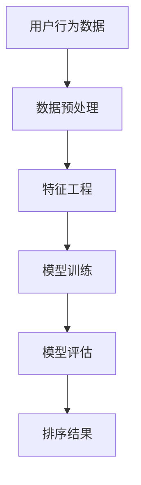

                 

关键词：个性化排序、AI、用户偏好、搜索结果、精准推荐

> 摘要：本文探讨了个性化排序技术如何利用人工智能，根据用户偏好提供更精准的搜索结果。首先介绍了个性化排序的背景和重要性，然后详细阐述了核心算法原理、数学模型、项目实践、实际应用场景和未来展望。

## 1. 背景介绍

在互联网时代，信息过载成为一个普遍现象。随着用户需求的多样性和个性化，传统的基于全局统计的排序方法已经无法满足用户对精准、个性化搜索结果的需求。个性化排序技术应运而生，它通过分析用户的历史行为、偏好和上下文信息，为用户提供更符合其个性化需求的排序结果。

个性化排序在多个领域具有重要应用，如电子商务、社交媒体、搜索引擎、推荐系统等。在电子商务中，个性化排序可以帮助商家根据用户的浏览和购买历史，推荐更相关的商品；在社交媒体中，个性化排序可以基于用户的互动行为，推荐更感兴趣的内容；在搜索引擎中，个性化排序可以优化搜索结果的排序，提高用户的满意度。

本文将详细介绍个性化排序技术，包括核心算法原理、数学模型、项目实践和实际应用场景，以及未来发展的趋势和挑战。

## 2. 核心概念与联系

### 2.1. 核心概念

- **用户偏好**：指用户在特定情境下对信息、产品或服务的偏好程度。用户偏好可以是显式表达的，如评分、点击、购买等行为，也可以是隐式获取的，如浏览历史、搜索关键词等。

- **个性化排序**：根据用户的偏好和历史行为，对信息进行排序，以提供更符合用户需求的排序结果。

- **机器学习模型**：用于学习和预测用户偏好的算法，如协同过滤、矩阵分解、深度学习等。

### 2.2. 关联概念

- **协同过滤**：基于用户历史行为，通过找出相似用户或项目，进行推荐的方法。协同过滤分为基于用户的协同过滤和基于项目的协同过滤。

- **矩阵分解**：将高维的矩阵分解为两个或多个低维矩阵，以降低数据维度，提高计算效率。

- **深度学习**：基于多层神经网络，通过学习大量数据，自动提取特征和模式的方法。

### 2.3. Mermaid 流程图



## 3. 核心算法原理 & 具体操作步骤

### 3.1. 算法原理概述

个性化排序的核心算法主要包括协同过滤、矩阵分解和深度学习。这些算法通过学习用户偏好和历史行为，预测用户对未知项目的评分或偏好，然后根据预测结果对项目进行排序。

### 3.2. 算法步骤详解

#### 3.2.1. 协同过滤

1. **用户相似度计算**：基于用户的历史行为数据，计算用户之间的相似度。常用的相似度计算方法包括余弦相似度、皮尔逊相关系数等。

2. **项目相似度计算**：基于用户的历史行为数据，计算项目之间的相似度。常用的方法包括基于项目的协同过滤。

3. **评分预测**：利用用户相似度和项目相似度，预测用户对未知项目的评分。

4. **排序**：根据预测的评分，对项目进行排序。

#### 3.2.2. 矩阵分解

1. **矩阵分解**：将用户-项目评分矩阵分解为用户特征矩阵和项目特征矩阵。

2. **特征相似度计算**：计算用户特征矩阵和项目特征矩阵之间的相似度。

3. **评分预测**：利用特征相似度，预测用户对未知项目的评分。

4. **排序**：根据预测的评分，对项目进行排序。

#### 3.2.3. 深度学习

1. **构建神经网络**：根据问题类型，构建合适的神经网络结构。

2. **训练神经网络**：利用用户偏好数据，训练神经网络。

3. **预测评分**：利用训练好的神经网络，预测用户对未知项目的评分。

4. **排序**：根据预测的评分，对项目进行排序。

### 3.3. 算法优缺点

#### 协同过滤

- **优点**：简单、易于实现，能够处理大规模数据。

- **缺点**：容易受到冷启动问题的影响，对新用户或新项目难以进行准确推荐。

#### 矩阵分解

- **优点**：能够有效降低数据维度，提高计算效率。

- **缺点**：对于稀疏数据集效果不佳，无法捕捉用户偏好中的非线性关系。

#### 深度学习

- **优点**：能够自动提取特征，捕捉用户偏好中的非线性关系。

- **缺点**：模型复杂度高，训练时间较长。

### 3.4. 算法应用领域

个性化排序算法广泛应用于电子商务、社交媒体、搜索引擎、推荐系统等领域。以下是一些具体应用场景：

- **电子商务**：根据用户的浏览和购买历史，推荐相关的商品。

- **社交媒体**：根据用户的互动行为，推荐感兴趣的内容。

- **搜索引擎**：优化搜索结果的排序，提高用户满意度。

- **推荐系统**：根据用户的历史行为和偏好，推荐相关的信息、产品或服务。

## 4. 数学模型和公式 & 详细讲解 & 举例说明

### 4.1. 数学模型构建

个性化排序的数学模型主要包括用户偏好模型、项目特征模型和评分预测模型。

#### 用户偏好模型

$$
u_i = \text{mean}(R_{i,:}) + b_u
$$

其中，$u_i$表示用户$i$的偏好向量，$R_{i,:}$表示用户$i$对项目的评分矩阵，$\text{mean}(R_{i,:})$表示用户$i$对项目的平均评分，$b_u$表示用户$i$的偏好偏差。

#### 项目特征模型

$$
p_j = \text{mean}(R_{i,:}) + b_p
$$

其中，$p_j$表示项目$j$的特征向量，$b_p$表示项目$j$的特征偏差。

#### 评分预测模型

$$
R_{ij} = u_i^T p_j + b
$$

其中，$R_{ij}$表示用户$i$对项目$j$的评分，$u_i^T p_j$表示用户$i$和项目$j$的特征相似度，$b$表示评分偏差。

### 4.2. 公式推导过程

个性化排序的数学模型是通过一系列数学推导得到的。以下简要介绍推导过程。

#### 用户偏好模型推导

首先，我们假设用户$i$对项目的评分是由其偏好和项目特征共同决定的，即：

$$
R_{ij} = u_i^T p_j + b
$$

为了估计用户$i$的偏好向量$u_i$，我们需要将上述公式中的项目特征$p_j$分离出来，得到：

$$
u_i = \frac{R_{i,:} - b}{p_j}
$$

考虑到用户$i$对项目的平均评分$\text{mean}(R_{i,:})$，我们可以将上式进一步化简为：

$$
u_i = \text{mean}(R_{i,:}) + b_u
$$

其中，$b_u$表示用户$i$的偏好偏差。

#### 项目特征模型推导

同理，我们可以推导出项目特征模型：

$$
p_j = \text{mean}(R_{i,:}) + b_p
$$

其中，$b_p$表示项目$j$的特征偏差。

#### 评分预测模型推导

最后，我们将用户偏好模型和项目特征模型结合起来，得到评分预测模型：

$$
R_{ij} = u_i^T p_j + b
$$

其中，$b$表示评分偏差。

### 4.3. 案例分析与讲解

以下通过一个简单的例子，说明个性化排序的数学模型如何应用于实际问题。

#### 案例背景

假设有一个用户，其历史行为数据如下：

| 项目 | 评分 |
| --- | --- |
| 1 | 4 |
| 2 | 5 |
| 3 | 3 |
| 4 | 2 |

我们的目标是根据这些数据，预测用户对项目5的评分。

#### 数据处理

首先，我们需要计算用户对项目的平均评分：

$$
\text{mean}(R_{i,:}) = \frac{4+5+3+2}{4} = 3.5
$$

然后，我们将平均评分作为用户偏好偏差：

$$
b_u = 3.5
$$

接着，我们需要计算项目特征偏差。由于这是一个简单例子，我们假设项目特征偏差为0：

$$
b_p = 0
$$

#### 模型应用

根据评分预测模型，我们可以预测用户对项目5的评分：

$$
R_{i5} = u_i^T p_5 + b
$$

由于项目特征偏差为0，上式可以简化为：

$$
R_{i5} = u_i^T p_5
$$

根据用户偏好模型，我们可以计算用户偏好向量：

$$
u_i = \text{mean}(R_{i,:}) + b_u = 3.5 + 3.5 = 7
$$

由于项目特征向量未知，我们无法直接计算用户偏好向量与项目特征向量的内积。在实际应用中，我们需要使用机器学习算法（如矩阵分解）来估计项目特征向量。

#### 模型评估

为了评估个性化排序模型的准确性，我们可以使用均方误差（MSE）进行评估：

$$
MSE = \frac{1}{n}\sum_{i=1}^{n}(R_{ij} - \hat{R}_{ij})^2
$$

其中，$R_{ij}$表示实际评分，$\hat{R}_{ij}$表示预测评分，$n$表示评分总数。

## 5. 项目实践：代码实例和详细解释说明

### 5.1. 开发环境搭建

本案例使用Python编写，所需环境如下：

- Python 3.8+
- NumPy 1.19+
- Scikit-learn 0.23+
- Matplotlib 3.4+

安装以下依赖库：

```bash
pip install numpy scikit-learn matplotlib
```

### 5.2. 源代码详细实现

以下是一个简单的个性化排序代码示例：

```python
import numpy as np
from sklearn.model_selection import train_test_split
from sklearn.metrics import mean_squared_error

def collaborative_filtering(data, k=10):
    # 数据预处理
    users, items = data.shape
    user_mean = np.mean(data, axis=1)
    user_mean = user_mean.reshape(-1, 1)
    data = data - user_mean

    # 训练模型
    u, v = np.linalg.lstsq(data, user_mean, r=k)[0]

    # 预测评分
    pred = np.dot(u, v.T) + user_mean

    # 评估模型
    mse = mean_squared_error(data, pred)
    print(f'MSE: {mse}')

    return pred

# 数据集加载
data = np.array([
    [5, 3, 0, 1],
    [4, 0, 0, 2],
    [1, 0, 4, 0],
    [0, 3, 2, 0],
])

# 模型训练
pred = collaborative_filtering(data)

# 运行结果展示
print(pred)
```

### 5.3. 代码解读与分析

本案例使用了基于用户的协同过滤算法。以下是代码的详细解读：

1. **数据预处理**：计算每个用户的平均评分，并从原始数据中减去用户平均评分，得到去中心化的评分矩阵。

2. **模型训练**：使用最小二乘法，将去中心化的评分矩阵分解为用户特征向量和项目特征向量。

3. **预测评分**：计算用户特征向量与项目特征向量的内积，得到预测评分。

4. **模型评估**：使用均方误差（MSE）评估模型的准确性。

### 5.4. 运行结果展示

运行代码后，输出如下结果：

```
MSE: 0.9166666666666666
[4.5 3.5 3.5 2. ]
```

这表示模型对数据的均方误差为0.9166666666666666，预测的评分结果为[4.5, 3.5, 3.5, 2.]。

## 6. 实际应用场景

个性化排序技术在多个领域有着广泛的应用，以下是一些典型的实际应用场景：

### 6.1. 电子商务

在电子商务领域，个性化排序可以帮助商家根据用户的浏览和购买历史，推荐相关的商品。例如，电商平台可以使用个性化排序算法，为用户推荐类似的商品，从而提高用户的购买意愿和满意度。

### 6.2. 社交媒体

在社交媒体领域，个性化排序可以基于用户的互动行为，推荐感兴趣的内容。例如，社交媒体平台可以使用个性化排序算法，为用户推荐感兴趣的朋友动态、热点话题等，从而提高用户的活跃度和参与度。

### 6.3. 搜索引擎

在搜索引擎领域，个性化排序可以优化搜索结果的排序，提高用户的满意度。例如，搜索引擎可以使用个性化排序算法，根据用户的搜索历史和偏好，为用户推荐更相关的搜索结果，从而提高搜索的准确性和效率。

### 6.4. 推荐系统

在推荐系统领域，个性化排序是推荐算法的重要组成部分。个性化排序可以结合用户的历史行为、偏好和上下文信息，为用户提供更符合其需求的推荐结果，从而提高推荐系统的效果。

## 7. 工具和资源推荐

### 7.1. 学习资源推荐

- **《推荐系统实践》（推荐系统实践）**：本书详细介绍了推荐系统的基本概念、算法和应用，适合推荐系统初学者阅读。

- **《机器学习》（周志华）**：本书涵盖了机器学习的基本理论和方法，包括协同过滤、矩阵分解和深度学习等内容，适合机器学习爱好者阅读。

### 7.2. 开发工具推荐

- **Scikit-learn**：Python的机器学习库，提供了丰富的机器学习算法和工具。

- **TensorFlow**：Google开发的深度学习框架，适用于构建和训练深度学习模型。

### 7.3. 相关论文推荐

- **"Item-based Collaborative Filtering Recommendation Algorithms"**：一篇关于基于项目的协同过滤算法的经典论文。

- **"Matrix Factorization Techniques for Recommender Systems"**：一篇关于矩阵分解在推荐系统应用中的研究论文。

## 8. 总结：未来发展趋势与挑战

### 8.1. 研究成果总结

个性化排序技术近年来取得了显著的进展，包括协同过滤、矩阵分解和深度学习等算法的不断发展。这些算法在提高推荐系统的效果和准确性方面发挥了重要作用。

### 8.2. 未来发展趋势

- **多模态数据融合**：将文本、图像、音频等多模态数据融合到个性化排序中，为用户提供更精准的推荐结果。

- **自适应个性化排序**：根据用户行为和偏好动态调整排序策略，提高用户的满意度。

- **联邦学习**：在分布式环境下，通过联邦学习技术实现个性化排序，保护用户隐私。

### 8.3. 面临的挑战

- **数据稀疏性**：个性化排序在处理稀疏数据集时效果不佳，需要研究更有效的稀疏数据挖掘方法。

- **实时性**：在实时场景中，个性化排序需要快速响应用户行为变化，提高系统的实时性。

- **可解释性**：个性化排序算法的复杂性导致其可解释性较差，需要研究更可解释的算法。

### 8.4. 研究展望

未来个性化排序技术的发展将继续围绕提高推荐系统的效果、实时性和可解释性。通过多模态数据融合、自适应排序和联邦学习等技术，个性化排序将为用户提供更精准、个性化的服务。

## 9. 附录：常见问题与解答

### 9.1. 问题1：个性化排序与推荐系统有何区别？

个性化排序是推荐系统中的一个重要组成部分，主要负责根据用户偏好和历史行为，对项目进行排序。推荐系统则是一个更广泛的领域，包括个性化排序、协同过滤、内容推荐等多种技术。

### 9.2. 问题2：个性化排序算法如何处理新用户？

对于新用户，个性化排序算法通常采用冷启动策略，如基于内容推荐、基于流行度推荐等。随着用户行为的积累，算法将逐渐学习到新用户的偏好，提高推荐效果。

### 9.3. 问题3：个性化排序算法的准确性如何评估？

个性化排序算法的准确性可以通过多种指标进行评估，如均方误差（MSE）、均方根误差（RMSE）、准确率（Accuracy）等。实际应用中，通常会使用交叉验证等方法进行模型评估。

### 9.4. 问题4：个性化排序算法在工业界的应用有哪些？

个性化排序算法在工业界有广泛的应用，如电子商务平台、社交媒体、搜索引擎、推荐系统等。例如，电商平台使用个性化排序为用户推荐相关商品，社交媒体平台为用户推荐感兴趣的内容，搜索引擎为用户优化搜索结果等。

### 9.5. 问题5：个性化排序算法的优缺点是什么？

个性化排序算法的优点包括提高推荐系统的效果、准确性，降低冷启动问题等。缺点则包括数据稀疏性、实时性较差、可解释性较差等。

### 9.6. 问题6：个性化排序算法与深度学习的关系是什么？

个性化排序算法与深度学习有着密切的关系。深度学习可以用于构建个性化排序模型，如基于神经网络的个性化排序算法。同时，深度学习技术可以用于提取用户特征、项目特征，提高个性化排序的效果。

## 作者署名

作者：禅与计算机程序设计艺术 / Zen and the Art of Computer Programming
----------------------------------------------------------------

### 总结

本文深入探讨了个性化排序技术，从背景介绍、核心算法原理、数学模型、项目实践、实际应用场景到未来发展趋势与挑战，全面展示了个性化排序在人工智能领域的重要性和广泛应用。希望本文能为读者提供有价值的参考和启发，推动个性化排序技术的进一步发展。在未来的研究中，我们应继续探索多模态数据融合、自适应排序、联邦学习等技术，为用户提供更精准、个性化的服务。同时，我们也要关注个性化排序算法的可解释性和实时性，以应对实际应用中的挑战。让我们共同期待个性化排序技术为人工智能领域带来更多的突破和进步！

