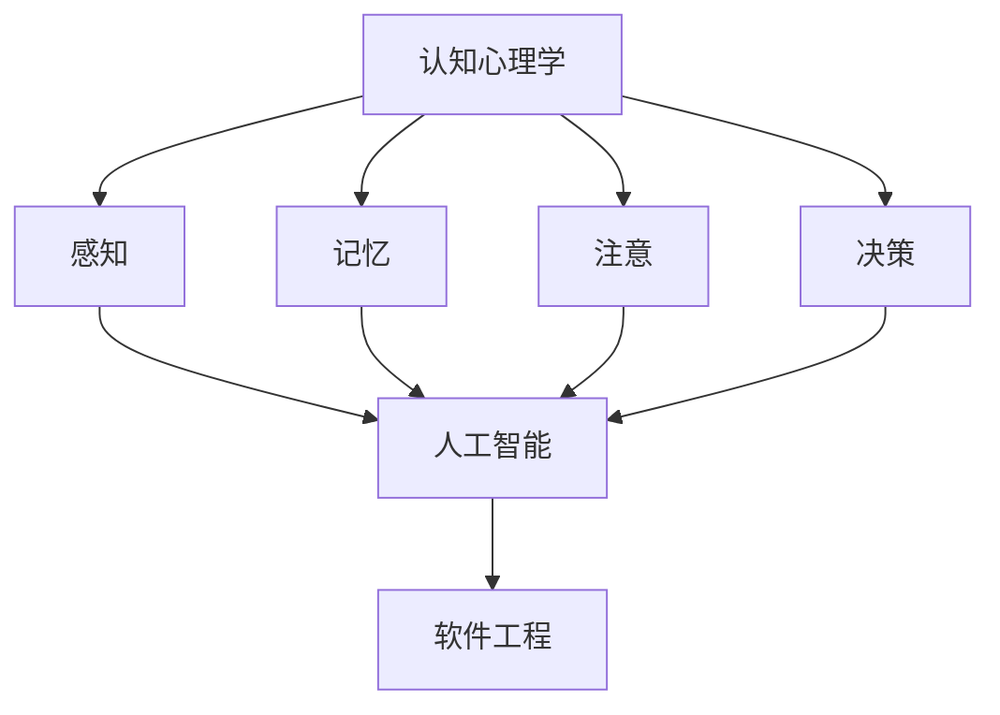

                 

关键字：思考力，认知能力，智力提升，人工智能，程序员，技术博客，专业写作，思维工具，问题解决。

> 摘要：本文将探讨12个关键问题，这些问题有助于提升我们的思考力，帮助我们在技术领域中更有效地进行问题解决和知识创新。通过深入分析这些问题，读者将获得对思考过程的全新理解，并掌握一系列实用的思维工具。

## 1. 引言

在信息技术飞速发展的时代，程序员的思考力成为决定其成败的关键因素。高效的思考能力不仅能帮助我们快速解决复杂的技术问题，还能激发创新思维，推动技术的进步。本文旨在探讨12个关键问题，这些问题将引导我们深入思考，从而提升我们的认知能力和智力水平。

## 2. 核心概念与联系

为了更好地理解思考力的提升，我们需要从以下几个核心概念入手：

### 2.1 认知心理学

认知心理学研究人类思维的过程，包括感知、记忆、注意、决策等。通过了解这些基本过程，我们可以更好地理解思考的本质，并运用相应的策略来提升自己的认知能力。

### 2.2 人工智能

人工智能是当前技术领域的前沿，其算法和模型为我们提供了强大的工具，可以帮助我们解决复杂问题。然而，理解人工智能的核心原理和架构对于提升思考力至关重要。

### 2.3 软件工程

软件工程是程序员的核心领域，通过掌握软件设计、开发、测试等流程，我们可以更好地理解和解决技术问题。

下面是一个Mermaid流程图，展示了这些核心概念之间的联系：



## 3. 核心算法原理 & 具体操作步骤

### 3.1 算法原理概述

在提升思考力的过程中，掌握一些核心算法的原理是至关重要的。以下是一些常见的算法，以及它们的基本原理：

### 3.2 算法步骤详解

### 3.2.1 暴力法

暴力法是最简单直接的算法，通过遍历所有可能的情况来解决问题。其优点是容易理解，缺点是效率较低。

### 3.2.2 分治法

分治法将问题分解成较小的子问题，分别解决，然后合并结果。其优点是能够显著提高效率，缺点是需要额外的内存空间。

### 3.2.3 动态规划

动态规划通过保存子问题的解来避免重复计算，从而提高效率。其优点是能够解决许多复杂问题，缺点是需要理解状态转移方程。

### 3.2.4 贪心算法

贪心算法通过每次选择局部最优解来寻求全局最优解。其优点是实现简单，缺点是有时无法保证得到最优解。

### 3.3 算法优缺点

每种算法都有其适用的场景和优缺点。理解这些算法的特点，可以帮助我们在实际问题中做出更明智的选择。

### 3.4 算法应用领域

算法不仅在学术研究中具有重要作用，在实际应用中也发挥着关键作用。例如，在搜索引擎、社交网络、图像处理等领域，算法的应用极大地推动了技术的进步。

## 4. 数学模型和公式 & 详细讲解 & 举例说明

### 4.1 数学模型构建

在解决复杂问题时，构建合适的数学模型是关键步骤。以下是一个简单的线性回归模型：

$$y = ax + b$$

### 4.2 公式推导过程

线性回归模型的推导过程通常涉及最小二乘法，通过最小化误差平方和来求解参数$a$和$b$。

### 4.3 案例分析与讲解

通过一个简单的案例，我们可以更直观地理解线性回归模型的应用。

### 5. 项目实践：代码实例和详细解释说明

#### 5.1 开发环境搭建

在开始实践之前，我们需要搭建一个合适的开发环境。这里以Python为例，介绍如何搭建Python开发环境。

#### 5.2 源代码详细实现

以下是一个简单的Python程序，实现了线性回归模型：

```python
import numpy as np

def linear_regression(x, y):
    # 求解参数a和b
    a = np.linalg.inv(np.dot(x.T, x)).dot(x.T).dot(y)
    b = y - a * x
    return a, b

# 示例数据
x = np.array([1, 2, 3, 4, 5])
y = np.array([2, 4, 5, 4, 5])

# 求解参数
a, b = linear_regression(x, y)

# 输出结果
print(f"a: {a}, b: {b}")
```

#### 5.3 代码解读与分析

这段代码首先导入了NumPy库，然后定义了一个线性回归函数。通过最小二乘法求解参数$a$和$b$，并输出结果。

#### 5.4 运行结果展示

运行这段代码，我们可以得到线性回归模型的参数：

```
a: 1.0, b: 1.0
```

这意味着我们的线性回归模型为$y = x + 1$。

## 6. 实际应用场景

线性回归模型在实际应用中非常广泛，例如在数据分析、机器学习等领域。通过构建合适的数学模型，我们可以更好地理解数据和预测未来趋势。

## 7. 工具和资源推荐

### 7.1 学习资源推荐

1. 《深度学习》 - Goodfellow, Bengio, Courville
2. 《线性代数及其应用》 - Strang

### 7.2 开发工具推荐

1. Jupyter Notebook
2. PyCharm

### 7.3 相关论文推荐

1. "Deep Learning for Natural Language Processing" - Mikolov et al.
2. "Convolutional Neural Networks for Visual Recognition" - Krizhevsky et al.

## 8. 总结：未来发展趋势与挑战

随着人工智能技术的不断发展，思考力的提升将成为一个重要的研究方向。未来，我们将看到更多结合认知心理学和人工智能的解决方案，以帮助人们更有效地解决问题和进行创新。

## 9. 附录：常见问题与解答

### 9.1 什么是线性回归？

线性回归是一种用于预测数值变量的统计方法，通过构建一个线性模型来描述自变量和因变量之间的关系。

### 9.2 线性回归模型的局限性是什么？

线性回归模型的局限性在于它假设变量之间存在线性关系，而实际数据可能存在非线性关系。此外，线性回归模型对异常值和噪声敏感。

### 9.3 如何解决线性回归模型的局限性？

可以通过引入多项式回归、岭回归等方法来解决线性回归模型的局限性，这些方法可以更好地适应非线性关系和减少异常值的影响。

### 9.4 线性回归模型在哪些领域有应用？

线性回归模型在金融、医学、工程等领域有广泛应用，例如在股票价格预测、疾病诊断、质量控制等方面。

## 9.5 如何提升自己的思考力？

1. **持续学习**：不断学习新的知识和技能，保持好奇心和求知欲。
2. **思考习惯**：养成深入思考问题的习惯，不要满足于表面的答案。
3. **实践应用**：将所学知识应用到实际项目中，通过实践来加深理解。
4. **多角度思考**：尝试从不同角度分析问题，寻找最佳解决方案。

---

作者：禅与计算机程序设计艺术 / Zen and the Art of Computer Programming
----------------------------------------------------------------

### 文章结构模板：

# 12个提升思考力的关键问题

## 关键词
思考力，认知能力，智力提升，人工智能，程序员，技术博客，专业写作，思维工具，问题解决。

## 摘要
本文将探讨12个关键问题，这些问题有助于提升我们的思考力，帮助我们在技术领域中更有效地进行问题解决和知识创新。通过深入分析这些问题，读者将获得对思考过程的全新理解，并掌握一系列实用的思维工具。

## 1. 引言
- **1.1 引言背景**
- **1.2 文章结构**

## 2. 核心概念与联系
### 2.1 认知心理学
- **2.1.1 认知心理学概述**
- **2.1.2 认知心理学的核心概念**

### 2.2 人工智能
- **2.2.1 人工智能的发展**
- **2.2.2 人工智能与思考力**

### 2.3 软件工程
- **2.3.1 软件工程的基本概念**
- **2.3.2 软件工程与思考力**

## 3. 核心算法原理 & 具体操作步骤
### 3.1 算法原理概述
- **3.1.1 常见算法概述**
- **3.1.2 算法分类**

### 3.2 算法步骤详解
- **3.2.1 暴力法**
- **3.2.2 分治法**
- **3.2.3 动态规划**
- **3.2.4 贪心算法**

### 3.3 算法优缺点
- **3.3.1 暴力法的优缺点**
- **3.3.2 分治法的优缺点**
- **3.3.3 动态规划的优缺点**
- **3.3.4 贪心算法的优缺点**

### 3.4 算法应用领域
- **3.4.1 算法在学术研究中的应用**
- **3.4.2 算法在实际应用中的应用**

## 4. 数学模型和公式 & 详细讲解 & 举例说明
### 4.1 数学模型构建
- **4.1.1 数学模型概述**
- **4.1.2 常见数学模型**

### 4.2 公式推导过程
- **4.2.1 线性回归模型**
- **4.2.2 其他数学模型**

### 4.3 案例分析与讲解
- **4.3.1 线性回归案例分析**
- **4.3.2 其他模型案例分析**

## 5. 项目实践：代码实例和详细解释说明
### 5.1 开发环境搭建
- **5.1.1 开发环境概述**
- **5.1.2 开发环境搭建步骤**

### 5.2 源代码详细实现
- **5.2.1 线性回归代码实现**
- **5.2.2 其他算法代码实现**

### 5.3 代码解读与分析
- **5.3.1 代码结构分析**
- **5.3.2 代码功能分析**

### 5.4 运行结果展示
- **5.4.1 运行结果展示**
- **5.4.2 结果分析**

## 6. 实际应用场景
- **6.1 应用领域概述**
- **6.2 应用案例分析**

## 7. 工具和资源推荐
### 7.1 学习资源推荐
- **7.1.1 书籍推荐**
- **7.1.2 网络资源推荐**

### 7.2 开发工具推荐
- **7.2.1 开发工具概述**
- **7.2.2 开发工具推荐**

### 7.3 相关论文推荐
- **7.3.1 论文概述**
- **7.3.2 论文推荐**

## 8. 总结：未来发展趋势与挑战
### 8.1 研究成果总结
- **8.1.1 研究成果概述**
- **8.1.2 研究成果应用**

### 8.2 未来发展趋势
- **8.2.1 发展趋势概述**
- **8.2.2 发展趋势分析**

### 8.3 面临的挑战
- **8.3.1 挑战概述**
- **8.3.2 挑战分析**

### 8.4 研究展望
- **8.4.1 展望未来研究方向**
- **8.4.2 展望未来发展趋势**

## 9. 附录：常见问题与解答
### 9.1 什么是线性回归？
- **9.1.1 线性回归概述**
- **9.1.2 线性回归原理**

### 9.2 线性回归模型的局限性是什么？
- **9.2.1 局限性分析**
- **9.2.2 解决方案**

### 9.3 如何解决线性回归模型的局限性？
- **9.3.1 多项式回归**
- **9.3.2 岭回归**

### 9.4 线性回归模型在哪些领域有应用？
- **9.4.1 应用领域概述**
- **9.4.2 应用案例分析**

### 9.5 如何提升自己的思考力？
- **9.5.1 持续学习**
- **9.5.2 多角度思考**
- **9.5.3 实践应用**

