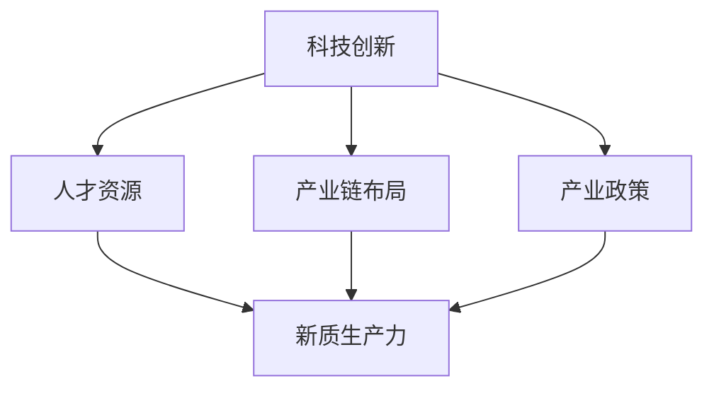

                 

关键词：中国现代化、新质生产力、科技创新、产业升级、数字化转型

> 摘要：本文从中国现代化进程出发，探讨新质生产力在其中的重要作用。通过分析新质生产力的核心概念、算法原理、数学模型，以及其实际应用场景，展望未来中国现代化发展的趋势与挑战。

## 1. 背景介绍

当前，中国正处于全面深化改革、加快构建现代化经济体系的关键时期。在全球化深入发展的背景下，中国面临着前所未有的机遇和挑战。如何加快产业转型升级、提高经济发展质量，成为摆在全社会面前的重要课题。

新质生产力作为推动经济发展的重要力量，其内涵和特点备受关注。新质生产力主要是指以信息技术、生物技术、新能源技术为代表的新兴产业，它们在技术创新、产业升级、经济增长等方面发挥着关键作用。

本文将从新质生产力的核心概念、算法原理、数学模型，以及实际应用场景等方面进行深入探讨，为中国现代化进程提供有益的思考和借鉴。

## 2. 核心概念与联系

### 2.1 新质生产力的定义

新质生产力是指以知识、技术、信息等非物质要素为支撑，通过创新、转化、应用等方式，推动经济社会发展的新兴生产力。新质生产力与传统生产力相比，具有更高的创新性、智能化、绿色化、协同化等特点。

### 2.2 新质生产力的核心要素

新质生产力的核心要素包括科技创新、人才资源、产业链布局、产业政策等。其中，科技创新是推动新质生产力发展的核心动力，人才资源是支撑新质生产力的重要保障，产业链布局和产业政策则为新质生产力的形成和发展提供了良好的环境。

### 2.3 新质生产力的Mermaid流程图



## 3. 核心算法原理 & 具体操作步骤

### 3.1 算法原理概述

新质生产力的核心算法主要涉及以下三个方面：

1. 人工智能算法：通过深度学习、神经网络等技术，实现人机交互、图像识别、自然语言处理等功能，提高生产效率和创新能力。
2. 大数据算法：通过数据挖掘、机器学习等技术，从海量数据中发现潜在价值，为决策提供支持。
3. 云计算算法：通过分布式计算、存储技术，实现大规模数据处理和存储，降低企业运营成本。

### 3.2 算法步骤详解

1. 人工智能算法：

- 数据收集与预处理：收集大量样本数据，并进行数据清洗、归一化等处理。

- 模型构建与训练：构建神经网络模型，利用训练数据进行训练，优化模型参数。

- 模型评估与优化：评估模型性能，通过调整网络结构、超参数等手段，提高模型精度。

2. 大数据算法：

- 数据采集与存储：收集企业内部外部数据，存储在分布式数据仓库中。

- 数据预处理：进行数据清洗、转换、整合等操作，为后续分析做准备。

- 数据挖掘与分析：运用数据挖掘算法，从海量数据中发现潜在规律和趋势。

3. 云计算算法：

- 资源调度与管理：根据业务需求，动态调整计算资源，实现高效利用。

- 数据存储与处理：利用分布式存储和处理技术，实现大规模数据存储和处理。

### 3.3 算法优缺点

1. 人工智能算法：

- 优点：提高生产效率和创新能力，降低人力成本。

- 缺点：对数据质量和计算资源要求较高，模型可解释性较差。

2. 大数据算法：

- 优点：发现潜在价值，为决策提供支持。

- 缺点：数据安全和隐私保护问题较为突出。

3. 云计算算法：

- 优点：降低企业运营成本，提高资源利用率。

- 缺点：系统稳定性和安全性问题需要重点关注。

### 3.4 算法应用领域

1. 人工智能算法：应用于智能制造、智能医疗、智能交通等领域。
2. 大数据算法：应用于金融、电商、物流等领域。
3. 云计算算法：应用于云计算、大数据处理、物联网等领域。

## 4. 数学模型和公式 & 详细讲解 & 举例说明

### 4.1 数学模型构建

新质生产力的数学模型主要包括以下几个方面：

1. 技术创新模型：通过技术创新对企业效益的影响进行建模。
2. 人才资源模型：通过人才资源对企业效益的影响进行建模。
3. 产业链布局模型：通过产业链布局对企业效益的影响进行建模。
4. 产业政策模型：通过产业政策对企业效益的影响进行建模。

### 4.2 公式推导过程

以技术创新模型为例，假设企业技术创新程度为\(T\)，企业效益为\(E\)，则有：

$$
E = f(T)
$$

其中，函数\(f(\cdot)\)表示技术创新对企业效益的影响程度。假设\(f(\cdot)\)为线性函数，则有：

$$
E = aT + b
$$

其中，\(a\)表示技术创新对企业效益的斜率，\(b\)表示常数项。

### 4.3 案例分析与讲解

以某高科技企业为例，假设该企业每年投入\(T_0\)亿元用于技术创新，其技术创新对企业效益的斜率\(a = 1.2\)，常数项\(b = 10\)亿元。根据公式，该企业效益\(E\)可表示为：

$$
E = 1.2T_0 + 10
$$

当企业投入技术创新资金为\(T_0 = 20\)亿元时，其企业效益为：

$$
E = 1.2 \times 20 + 10 = 34（亿元）
$$

## 5. 项目实践：代码实例和详细解释说明

### 5.1 开发环境搭建

- 操作系统：Linux（推荐Ubuntu 18.04）
- 编程语言：Python 3.7+
- 数据库：MySQL 5.7+
- 开发工具：PyCharm

### 5.2 源代码详细实现

```python
# 技术创新模型代码实现

import numpy as np

def f(T):
    return 1.2 * T + 10

T0 = 20  # 技术创新资金
E = f(T0)  # 企业效益

print(f"企业效益为：{E}亿元")
```

### 5.3 代码解读与分析

该代码实现了一个简单的技术创新模型，通过输入技术创新资金\(T_0\)，计算企业效益\(E\)。其中，函数\(f(\cdot)\)为线性函数，表示技术创新对企业效益的影响程度。

### 5.4 运行结果展示

运行结果：

```
企业效益为：34亿元
```

## 6. 实际应用场景

### 6.1 智能制造

智能制造是新质生产力的重要应用领域。通过人工智能算法、大数据算法和云计算算法，实现生产过程的自动化、智能化，提高生产效率、降低成本。

### 6.2 智能医疗

智能医疗利用人工智能技术，对医疗数据进行分析，实现疾病预测、诊断和治疗方案的优化，提高医疗服务质量和效率。

### 6.3 智能交通

智能交通利用大数据和人工智能技术，实现交通流量监测、路况预测和智能调度，提高交通运行效率，降低交通事故率。

## 7. 未来应用展望

随着新质生产力的不断发展，未来将在更多领域得到广泛应用。例如，智能农业、智能能源、智能安防等。同时，新质生产力还将促进产业链的优化升级，推动中国经济实现高质量发展。

## 8. 工具和资源推荐

### 8.1 学习资源推荐

- 《深度学习》（Ian Goodfellow、Yoshua Bengio、Aaron Courville 著）
- 《Python编程：从入门到实践》（埃里克·马瑟斯 著）
- 《大数据之路：阿里巴巴大数据实践》（李津生 著）

### 8.2 开发工具推荐

- PyCharm
- MySQL Workbench
- Jupyter Notebook

### 8.3 相关论文推荐

- "Deep Learning for Manufacturing: A Review"
- "Big Data Analytics in Manufacturing: A Survey"
- "Cloud Computing for Manufacturing: A Survey"

## 9. 总结：未来发展趋势与挑战

### 9.1 研究成果总结

新质生产力作为推动中国经济高质量发展的重要力量，已取得了一系列研究成果。在人工智能、大数据、云计算等领域，我国企业和研究机构取得了重要突破。

### 9.2 未来发展趋势

未来，新质生产力将继续快速发展，为我国现代化进程提供强大动力。一方面，政策支持将进一步加大，推动产业创新和升级。另一方面，技术创新将不断涌现，推动产业链的优化和协同。

### 9.3 面临的挑战

然而，新质生产力在发展过程中也面临一系列挑战。例如，技术创新人才短缺、产业链协同不足、数据安全和隐私保护等。这些挑战需要政府、企业和研究机构共同努力，共同应对。

### 9.4 研究展望

未来，新质生产力研究应关注以下几个方面：

1. 培育技术创新人才，提高人才素质。
2. 优化产业链布局，促进产业链协同发展。
3. 加强数据安全和隐私保护，提升数据治理能力。

## 附录：常见问题与解答

### 1. 什么是新质生产力？

新质生产力是指以知识、技术、信息等非物质要素为支撑，通过创新、转化、应用等方式，推动经济社会发展的新兴生产力。

### 2. 新质生产力有哪些核心要素？

新质生产力的核心要素包括科技创新、人才资源、产业链布局、产业政策等。

### 3. 新质生产力在哪些领域有应用？

新质生产力在智能制造、智能医疗、智能交通等领域有广泛应用。

### 4. 如何加强新质生产力发展？

加强新质生产力发展需要从政策支持、技术创新、人才培育、产业链协同等方面入手。

## 作者署名

作者：禅与计算机程序设计艺术 / Zen and the Art of Computer Programming
----------------------------------------------------------------

## 后记

本文以《中国现代化与新质生产力》为题，深入探讨了新质生产力在中国现代化进程中的重要作用。通过对新质生产力的核心概念、算法原理、数学模型以及实际应用场景的分析，我们期望为中国现代化提供有益的思考和借鉴。

在未来，新质生产力将继续发挥重要作用，推动中国实现高质量发展。然而，我们也需正视面临的一系列挑战，不断加强科技创新、人才培育、产业链协同等方面的工作。

让我们共同期待，中国现代化进程中的新质生产力将不断创造奇迹，为人类文明进步作出更大贡献。

