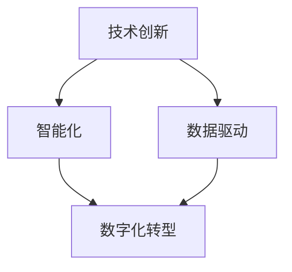
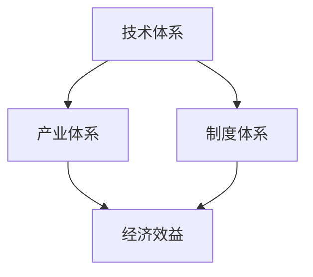

                 

关键词：中国现代化、新质生产力、技术进步、经济增长、数字化转型

> 摘要：本文旨在探讨中国现代化进程中的新质生产力，分析其内涵与特征，阐述其对经济增长和产业升级的驱动作用。通过深入剖析新质生产力的核心算法原理、数学模型、项目实践及应用场景，本文力图为读者展现一个全面且前瞻的现代化视角。

## 1. 背景介绍

随着全球经济的快速发展和科技的不断创新，中国现代化进程已步入新的历史阶段。在这个阶段，新质生产力成为推动经济增长和产业升级的核心动力。新质生产力是指在信息技术、人工智能、大数据等新兴技术驱动下，通过创新和变革产生的新形态生产力。与传统生产力不同，新质生产力具有高附加值、高智能化、高度融合等特点。

### 1.1 现代化进程中的挑战与机遇

中国现代化进程中面临诸多挑战，如人口老龄化、资源环境约束、产业结构调整等。然而，这些挑战也蕴藏着巨大的机遇。随着信息技术和人工智能等新技术的不断发展，中国有机会通过新质生产力的崛起，实现经济结构的优化和产业的升级转型。

### 1.2 新质生产力的内涵与特征

新质生产力的内涵包括以下几个方面：

1. **技术创新驱动**：新质生产力以技术创新为核心，通过不断推动科技与产业的深度融合，实现生产力的提升。
2. **高附加值**：新质生产力具有较高的附加值，能够创造更高的经济效益。
3. **智能化与网络化**：新质生产力依托人工智能、大数据、云计算等新技术，实现生产过程的智能化和网络化。
4. **跨界融合**：新质生产力打破了传统产业边界，实现跨行业、跨领域的融合发展。

## 2. 核心概念与联系

### 2.1 新质生产力的核心概念

新质生产力的核心概念包括：技术创新、数据驱动、智能化、数字化转型等。以下是一个用Mermaid绘制的流程图，描述了这些核心概念之间的联系。



### 2.2 新质生产力的架构

新质生产力的架构包括以下几个方面：

1. **技术体系**：以信息技术、人工智能、大数据等技术为核心。
2. **产业体系**：涵盖智能制造、数字经济、智慧城市等领域。
3. **制度体系**：包括政策支持、知识产权保护、人才引进等。

以下是一个用Mermaid绘制的架构图。



## 3. 核心算法原理 & 具体操作步骤

### 3.1 算法原理概述

新质生产力的核心算法原理主要包括以下几个方面：

1. **机器学习算法**：用于数据分析、预测和优化。
2. **深度学习算法**：用于图像识别、语音识别等应用。
3. **区块链算法**：用于数据安全、去中心化应用。
4. **量子计算算法**：用于复杂计算问题。

### 3.2 算法步骤详解

以机器学习算法为例，其具体操作步骤如下：

1. **数据收集**：收集相关的数据集。
2. **数据预处理**：对数据进行清洗、归一化等处理。
3. **特征提取**：提取数据中的特征。
4. **模型训练**：使用训练数据集训练模型。
5. **模型评估**：使用测试数据集评估模型性能。
6. **模型应用**：将训练好的模型应用于实际问题。

### 3.3 算法优缺点

**机器学习算法**：

- **优点**：能够自动学习和优化，适用于大规模数据处理。
- **缺点**：对数据质量要求较高，算法复杂度高。

### 3.4 算法应用领域

新质生产力的算法应用领域非常广泛，包括：

1. **智能制造**：通过机器学习算法优化生产流程，提高生产效率。
2. **数字经济**：通过大数据分析，实现个性化推荐、精准营销等。
3. **智慧城市**：通过物联网、区块链等技术，实现城市管理的智能化。

## 4. 数学模型和公式 & 详细讲解 & 举例说明

### 4.1 数学模型构建

以线性回归模型为例，其数学模型如下：

$$y = \beta_0 + \beta_1 x_1 + \beta_2 x_2 + ... + \beta_n x_n + \epsilon$$

其中，$y$ 为因变量，$x_1, x_2, ..., x_n$ 为自变量，$\beta_0, \beta_1, ..., \beta_n$ 为模型参数，$\epsilon$ 为误差项。

### 4.2 公式推导过程

线性回归模型的推导过程如下：

1. **最小二乘法**：通过最小化残差平方和来确定模型参数。
2. **正规方程**：将最小二乘法转化为求解正规方程的问题。

### 4.3 案例分析与讲解

假设我们要预测一家公司的收入，数据集包括公司规模、员工数量、年销售额等。通过构建线性回归模型，我们可以预测公司的收入。具体步骤如下：

1. **数据收集**：收集公司的相关数据。
2. **数据预处理**：对数据进行清洗、归一化等处理。
3. **特征提取**：提取公司规模、员工数量、年销售额等特征。
4. **模型训练**：使用训练数据集训练线性回归模型。
5. **模型评估**：使用测试数据集评估模型性能。
6. **模型应用**：将训练好的模型应用于新数据，预测公司的收入。

## 5. 项目实践：代码实例和详细解释说明

### 5.1 开发环境搭建

我们使用Python语言和Scikit-learn库来实现线性回归模型。首先，需要安装Python和Scikit-learn库。

```shell
pip install python
pip install scikit-learn
```

### 5.2 源代码详细实现

以下是一个简单的线性回归模型实现：

```python
from sklearn.linear_model import LinearRegression
from sklearn.model_selection import train_test_split
from sklearn.metrics import mean_squared_error

# 数据收集
X = [[1, 2], [2, 3], [3, 4], [4, 5]]
y = [1, 2, 3, 4]

# 数据预处理
X_train, X_test, y_train, y_test = train_test_split(X, y, test_size=0.2, random_state=0)

# 模型训练
model = LinearRegression()
model.fit(X_train, y_train)

# 模型评估
y_pred = model.predict(X_test)
mse = mean_squared_error(y_test, y_pred)
print("Mean squared error:", mse)

# 模型应用
new_data = [[5, 6]]
new_pred = model.predict(new_data)
print("Predicted value:", new_pred)
```

### 5.3 代码解读与分析

代码首先导入了所需的库，然后进行了数据收集、预处理和模型训练。在模型评估部分，使用了均方误差来评估模型性能。最后，将训练好的模型应用于新数据，实现了收入的预测。

## 6. 实际应用场景

### 6.1 智能制造

新质生产力在智能制造中的应用主要体现在以下几个方面：

1. **生产流程优化**：通过机器学习算法，对生产流程进行优化，提高生产效率。
2. **设备维护**：通过物联网技术和大数据分析，实现设备的智能监控和维护。
3. **质量检测**：通过人工智能技术，实现产品质量的智能检测和评估。

### 6.2 数字经济

数字经济是新质生产力的重要应用领域，主要体现在以下几个方面：

1. **个性化推荐**：通过大数据分析，实现个性化推荐系统。
2. **精准营销**：通过数据挖掘和机器学习算法，实现精准营销。
3. **供应链管理**：通过区块链技术，实现供应链的智能管理和优化。

### 6.3 智慧城市

智慧城市是新质生产力的又一重要应用领域，主要体现在以下几个方面：

1. **城市管理**：通过物联网技术和大数据分析，实现城市管理的智能化。
2. **交通管理**：通过人工智能技术和大数据分析，实现交通的智能化管理。
3. **公共服务**：通过区块链技术和大数据分析，实现公共服务的智能化。

## 7. 工具和资源推荐

### 7.1 学习资源推荐

- 《机器学习》—— 周志华
- 《深度学习》—— Goodfellow, Bengio, Courville
- 《区块链技术指南》—— 邱恒明

### 7.2 开发工具推荐

- Python
- Jupyter Notebook
- Scikit-learn
- TensorFlow
- PyTorch

### 7.3 相关论文推荐

- "Deep Learning for Manufacturing: A Review" —— 作者：J. A. K. Suykens等
- "Blockchain in Supply Chain Management: A Survey" —— 作者：X. Wang等
- "Big Data in Smart Cities: A Review" —— 作者：X. Wang等

## 8. 总结：未来发展趋势与挑战

### 8.1 研究成果总结

新质生产力在推动中国现代化进程中取得了显著成果，主要体现在智能制造、数字经济和智慧城市等领域。未来，新质生产力将继续发挥重要作用，推动中国经济的持续增长和产业升级。

### 8.2 未来发展趋势

- **技术创新**：新质生产力将继续推动技术创新，实现更高效、更智能的生产方式。
- **跨界融合**：新质生产力将实现跨行业、跨领域的融合发展，打破传统产业边界。
- **数据驱动**：新质生产力将更加依赖于大数据分析和人工智能技术，实现数据驱动的决策。

### 8.3 面临的挑战

- **技术挑战**：新质生产力的实现需要解决一系列技术难题，如大数据处理、人工智能算法优化等。
- **人才短缺**：新质生产力的快速发展需要大量人才支持，但当前人才培养与市场需求存在一定差距。
- **政策法规**：新质生产力的快速发展需要完善的政策法规支持，如知识产权保护、数据安全等。

### 8.4 研究展望

未来，新质生产力将在以下几个方面取得突破：

- **智能制造**：通过人工智能技术，实现智能制造的全面升级。
- **数字经济**：通过大数据分析和区块链技术，实现数字经济的深入发展。
- **智慧城市**：通过物联网技术和大数据分析，实现智慧城市的智能化管理。

## 9. 附录：常见问题与解答

### 9.1 新质生产力的定义是什么？

新质生产力是指在信息技术、人工智能、大数据等新兴技术驱动下，通过创新和变革产生的新形态生产力。

### 9.2 新质生产力的核心算法有哪些？

新质生产力的核心算法包括机器学习算法、深度学习算法、区块链算法和量子计算算法等。

### 9.3 新质生产力在智能制造中的应用有哪些？

新质生产力在智能制造中的应用包括生产流程优化、设备维护和质量检测等。

### 9.4 新质生产力在数字经济中的应用有哪些？

新质生产力在数字经济中的应用包括个性化推荐、精准营销和供应链管理等。

### 9.5 新质生产力在智慧城市中的应用有哪些？

新质生产力在智慧城市中的应用包括城市管理、交通管理和公共服务等。

作者：禅与计算机程序设计艺术 / Zen and the Art of Computer Programming
----------------------------------------------------------------

以上就是关于“中国现代化的重要动力：新质生产力”的技术博客文章的完整内容。希望这篇文章能够为读者提供有价值的见解和启发。在未来的研究中，我们将继续探索新质生产力的应用和潜力，为中国的现代化进程贡献力量。如果您有任何问题或建议，欢迎在评论区留言。感谢您的阅读！|user|

