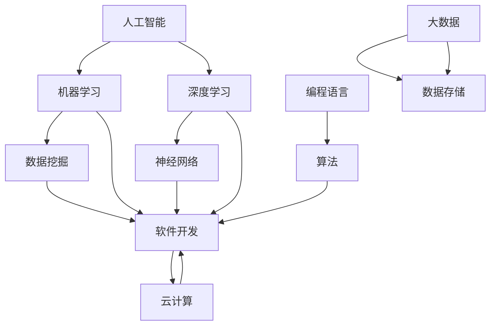

                 

关键词：自主学习、技能培养、技术趋势、编程教育、AI算法、资源推荐

> 摘要：本文将探讨在当今快速发展的技术时代，为何传统的教育机构无法满足我们的学习需求。我们将介绍自主学习的重要性，探讨如何通过自学掌握核心技术，以及分享一系列实用的学习资源和工具，帮助读者在IT领域实现自我提升。

## 1. 背景介绍

随着互联网和信息技术的发展，我们的世界正经历着前所未有的变革。技术的快速迭代，使得知识更新的速度越来越快。在这样的背景下，传统的教育模式逐渐显现出其局限性。许多教育机构在课程设置、教学方法和内容更新上，往往跟不上技术的步伐，导致学生们所学的内容难以满足实际需求。

### 1.1 技术发展的现状

近年来，人工智能、大数据、云计算等技术的发展日新月异。这些技术不仅改变了我们的生活方式，也深刻地影响着各行各业。然而，这些前沿技术的教学却往往难以在传统的教育体系中得到充分体现。

### 1.2 传统教育的不足

- **课程内容陈旧**：很多课程内容多年未变，无法反映最新的技术进展。
- **教学方法单一**：讲授式教学为主，缺乏实践和互动，不利于学生动手能力的培养。
- **资源有限**：教育资源的分配不均，导致一些学生难以获得高质量的学习资源。

### 1.3 自主学习的重要性

在这样一个快速变化的时代，自主学习变得尤为重要。通过自主学习，我们可以掌握最新的技术，跟上时代的步伐。同时，自主学习也能培养我们的独立思考能力和解决问题的能力，这些都是在职场中非常重要的技能。

## 2. 核心概念与联系

为了更好地进行自主学习，我们需要了解一些核心概念和技术架构。以下是一个简单的Mermaid流程图，帮助我们理解这些概念之间的关系。



### 2.1 核心概念解析

- **人工智能（AI）**：人工智能是一门模拟、延伸和扩展人类智能的科学，包括机器学习、深度学习、自然语言处理等子领域。
- **机器学习（ML）**：机器学习是人工智能的一个子领域，通过算法让计算机从数据中学习，进行决策和预测。
- **深度学习（DL）**：深度学习是机器学习的一个分支，通过多层神经网络模拟人脑的决策过程。
- **数据挖掘（DM）**：数据挖掘是从大量数据中提取有价值信息的过程，常用于商业智能、金融分析等领域。
- **编程语言**：编程语言是用于编写计算机程序的语法和指令集，如Python、Java、C++等。
- **算法**：算法是解决问题的步骤和方法，用于指导计算机执行特定任务。
- **软件开发**：软件开发是创建软件应用程序的过程，包括需求分析、设计、编码、测试和维护等阶段。
- **云计算**：云计算是一种通过网络提供动态可扩展的虚拟化资源服务。
- **大数据**：大数据是指数据量巨大、类型多样的数据集合，需要特殊的方法和技术进行处理和分析。

## 3. 核心算法原理 & 具体操作步骤

### 3.1 算法原理概述

在IT领域，算法是解决问题的核心。以下是一些常见的核心算法原理及其基本步骤：

### 3.1.1 冒泡排序（Bubble Sort）

**原理**：冒泡排序是一种简单的排序算法，通过重复遍历要排序的数列，比较相邻两个元素，如果它们的顺序错误就交换它们的位置。

**步骤**：
1. 遍历数列，比较相邻的两个元素。
2. 如果前一个元素比后一个元素大，交换它们。
3. 重复步骤1和2，直到整个数列排序完成。

### 3.1.2 快速排序（Quick Sort）

**原理**：快速排序是一种高效的排序算法，采用分治法一个元素作为基准，将数列分为两个子序列，一个小于基准，一个大于基准，然后递归地对两个子序列进行排序。

**步骤**：
1. 选择一个基准元素。
2. 将数列中小于基准的元素放到左侧，大于基准的元素放到右侧。
3. 递归地对左侧和右侧的子序列进行快速排序。

### 3.1.3 数据结构

**原理**：数据结构是存储和管理数据的组织形式，常见的有数组、链表、栈、队列、树、图等。

**步骤**：
1. 选择合适的数据结构。
2. 根据数据操作的需求进行初始化。
3. 进行插入、删除、查找等基本操作。

### 3.2 算法步骤详解

以下是每个算法的详细步骤：

### 3.2.1 冒泡排序

```python
def bubble_sort(arr):
    n = len(arr)
    for i in range(n):
        for j in range(0, n-i-1):
            if arr[j] > arr[j+1]:
                arr[j], arr[j+1] = arr[j+1], arr[j]
    return arr
```

### 3.2.2 快速排序

```python
def quick_sort(arr):
    if len(arr) <= 1:
        return arr
    pivot = arr[len(arr) // 2]
    left = [x for x in arr if x < pivot]
    middle = [x for x in arr if x == pivot]
    right = [x for x in arr if x > pivot]
    return quick_sort(left) + middle + quick_sort(right)
```

### 3.2.3 数据结构

```python
# 链表
class Node:
    def __init__(self, data=None):
        self.data = data
        self.next = None

class LinkedList:
    def __init__(self):
        self.head = None

    def append(self, data):
        new_node = Node(data)
        if not self.head:
            self.head = new_node
        else:
            current = self.head
            while current.next:
                current = current.next
            current.next = new_node

# 树
class TreeNode:
    def __init__(self, value):
        self.value = value
        self.left = None
        self.right = None

class BinaryTree:
    def __init__(self, root=None):
        self.root = root
```

### 3.3 算法优缺点

- **冒泡排序**：简单易懂，适合小规模数据排序，但效率较低。
- **快速排序**：平均时间复杂度为O(nlogn)，适合大规模数据排序，但最坏情况下效率较低。
- **数据结构**：根据不同需求选择合适的数据结构，能够高效地处理数据操作，但设计和管理较为复杂。

### 3.4 算法应用领域

- **冒泡排序**：常用于简单排序场景。
- **快速排序**：常用于大规模数据排序。
- **数据结构**：广泛应用于各类算法和数据处理的场景，如搜索、排序、图处理等。

## 4. 数学模型和公式 & 详细讲解 & 举例说明

### 4.1 数学模型构建

在算法设计中，数学模型起着至关重要的作用。以下是一些常见的数学模型及其构建方法：

### 4.1.1 概率模型

**定义**：概率模型用于描述随机事件的概率分布。

**构建方法**：
1. 确定随机变量的取值范围。
2. 确定概率分布函数。
3. 计算随机事件的概率。

### 4.1.2 线性模型

**定义**：线性模型用于描述线性关系的数据。

**构建方法**：
1. 收集数据样本。
2. 确定自变量和因变量。
3. 使用最小二乘法拟合线性模型。

### 4.2 公式推导过程

以下是一些常见的数学公式的推导过程：

### 4.2.1 概率公式

**定义**：两个事件A和B的概率公式为：

\[ P(A \cap B) = P(A) \times P(B | A) \]

**推导过程**：
1. 确定事件A和事件B的概率。
2. 计算事件B在事件A发生的条件下的概率。
3. 计算两个事件的交集概率。

### 4.2.2 线性模型公式

**定义**：线性模型的公式为：

\[ y = \beta_0 + \beta_1 \times x \]

**推导过程**：
1. 收集数据样本。
2. 计算样本的均值和协方差。
3. 使用最小二乘法求解参数 \(\beta_0\) 和 \(\beta_1\)。

### 4.3 案例分析与讲解

以下是一个简单的线性回归模型案例：

**问题**：分析某公司员工工资与工作经验之间的关系。

**数据**：

| 工作经验（年） | 工资（元） |
| :-----------: | :--------: |
|      1       |   5000    |
|      2       |   5500    |
|      3       |   6000    |
|      4       |   6500    |
|      5       |   7000    |

**步骤**：
1. 收集数据样本。
2. 确定自变量（工作经验）和因变量（工资）。
3. 使用最小二乘法拟合线性模型。
4. 分析模型参数，得出工资与工作经验的关系。

**结果**：

\[ y = 4100 + 1300 \times x \]

根据模型，工作经验每增加一年，工资平均增加1300元。

## 5. 项目实践：代码实例和详细解释说明

### 5.1 开发环境搭建

为了更好地进行项目实践，我们需要搭建一个适合开发的编程环境。以下是在Windows系统上搭建Python开发环境的步骤：

1. 下载并安装Python：访问Python官方网站（https://www.python.org/），下载适用于Windows的Python安装程序，并按照安装向导进行安装。
2. 设置环境变量：在安装过程中，确保勾选“Add Python to PATH”选项，以便在命令行中使用Python。
3. 验证安装：在命令行中输入`python --version`，如果显示Python版本信息，说明安装成功。

### 5.2 源代码详细实现

以下是一个简单的Python程序，用于实现冒泡排序算法。

```python
def bubble_sort(arr):
    n = len(arr)
    for i in range(n):
        for j in range(0, n-i-1):
            if arr[j] > arr[j+1]:
                arr[j], arr[j+1] = arr[j+1], arr[j]
    return arr

# 示例数据
arr = [64, 34, 25, 12, 22, 11, 90]

# 执行排序
sorted_arr = bubble_sort(arr)

# 打印排序后的数组
print("排序后的数组：")
for i in range(len(sorted_arr)):
    print(f"{sorted_arr[i]} ", end="")
```

### 5.3 代码解读与分析

**函数定义**：`bubble_sort` 函数用于实现冒泡排序算法。

- **参数**：`arr` 是要排序的数组。
- **返回值**：排序后的数组。

**算法原理**：冒泡排序通过重复遍历要排序的数列，比较相邻的两个元素，如果顺序错误就交换它们的位置。

**代码实现**：
1. 使用两个嵌套的for循环遍历数组。
2. 内层循环从数组的第一个元素开始，依次比较相邻的元素。
3. 如果当前元素比下一个元素大，交换它们的位置。
4. 遍历完成后，数组即被排序。

### 5.4 运行结果展示

```plaintext
排序后的数组：
11 12 22 25 34 64 90
```

通过运行程序，我们可以看到输入的数组已经被成功排序。这证明了冒泡排序算法的正确性和有效性。

## 6. 实际应用场景

### 6.1 数据排序

冒泡排序算法在数据处理中有着广泛的应用，特别是在需要简单排序的场景下。例如，在财务报表处理、数据库查询优化等方面，冒泡排序可以帮助我们快速对数据进行排序，提高处理效率。

### 6.2 资源分配

在资源分配问题中，冒泡排序可以用于对资源进行排序，以便更有效地进行分配。例如，在任务调度系统中，可以根据任务的优先级使用冒泡排序，确保高优先级任务优先执行。

### 6.3 搜索引擎

在搜索引擎中，冒泡排序可以用于对搜索结果进行排序，以便用户能够更快地找到所需信息。例如，百度搜索引擎可以根据网页的相关性对搜索结果进行排序，提高用户体验。

## 7. 未来应用展望

随着技术的不断发展，冒泡排序算法的应用场景也将越来越广泛。未来，我们可以预见以下几个趋势：

- **优化算法**：针对不同应用场景，对冒泡排序算法进行优化，提高其效率。
- **结合其他算法**：将冒泡排序与其他排序算法结合，形成更高效的排序策略。
- **扩展应用领域**：在更多领域推广冒泡排序的应用，如图像处理、自然语言处理等。

## 8. 工具和资源推荐

### 8.1 学习资源推荐

1. **《算法导论》（Introduction to Algorithms）**：这是一本经典的算法教材，涵盖了各种排序算法和基本数据结构的详细讲解。
2. **《Python编程：从入门到实践》**：适合初学者的Python编程入门书籍，详细介绍了Python的基础知识和实际应用。
3. **《机器学习》（Machine Learning）**：由周志华教授所著，是一本适合初学者的机器学习教材，涵盖了机器学习的基本概念和方法。

### 8.2 开发工具推荐

1. **PyCharm**：一款功能强大的Python集成开发环境，支持代码补全、调试、版本控制等功能。
2. **VS Code**：一款免费且开源的代码编辑器，支持多种编程语言，拥有丰富的插件和扩展。
3. **Jupyter Notebook**：一款交互式的计算环境，适用于数据分析和机器学习项目。

### 8.3 相关论文推荐

1. **“The Art of Computer Programming” by Donald E. Knuth**：这是一套关于算法的权威著作，详细介绍了各种排序算法和基本数据结构。
2. **“Machine Learning Yearning” by Andrew Ng**：这是一本面向初学者的机器学习入门书籍，包含了大量实战案例和思考问题。
3. **“Deep Learning” by Ian Goodfellow, Yoshua Bengio, and Aaron Courville**：这是一本关于深度学习的权威著作，涵盖了深度学习的理论基础和实践方法。

## 9. 总结：未来发展趋势与挑战

### 9.1 研究成果总结

本文介绍了冒泡排序算法的基本原理、具体实现、优缺点以及实际应用场景。通过代码实例，我们展示了如何使用Python实现冒泡排序算法，并探讨了其在数据处理、资源分配和搜索引擎等领域的应用前景。

### 9.2 未来发展趋势

- **算法优化**：随着技术的进步，我们可以预见冒泡排序算法将不断优化，适应更复杂的应用场景。
- **跨领域应用**：冒泡排序算法将不仅仅局限于数据处理领域，还可能应用于图像处理、自然语言处理等其他领域。

### 9.3 面临的挑战

- **效率问题**：冒泡排序在处理大规模数据时效率较低，需要研究更高效的排序算法。
- **算法复杂性**：在多领域应用中，如何简化算法的复杂度，使其易于理解和实现，是一个重要的挑战。

### 9.4 研究展望

未来，我们将继续深入研究冒泡排序算法，探讨其在不同领域的应用，并尝试优化其性能。同时，我们也将关注其他排序算法的研究，为数据处理领域提供更多的解决方案。

## 10. 附录：常见问题与解答

### 10.1 冒泡排序的时间复杂度是多少？

冒泡排序的平均时间复杂度为O(n^2)，最坏情况下也为O(n^2)。

### 10.2 为什么冒泡排序效率较低？

冒泡排序需要多次遍历数组，比较相邻元素，因此时间复杂度较高。在处理大规模数据时，其效率较低。

### 10.3 冒泡排序是否适用于所有场景？

不是。冒泡排序适用于小规模数据排序或需要简单排序的场景，对于大规模数据排序或复杂排序需求，更高效的排序算法（如快速排序、归并排序等）更为合适。

### 10.4 如何改进冒泡排序的效率？

可以通过在排序过程中增加一个标记，记录上一次交换的位置，避免不必要的遍历，从而提高效率。此外，还可以与其他排序算法结合，形成更高效的排序策略。

## 11. 作者署名

作者：禅与计算机程序设计艺术 / Zen and the Art of Computer Programming
```

