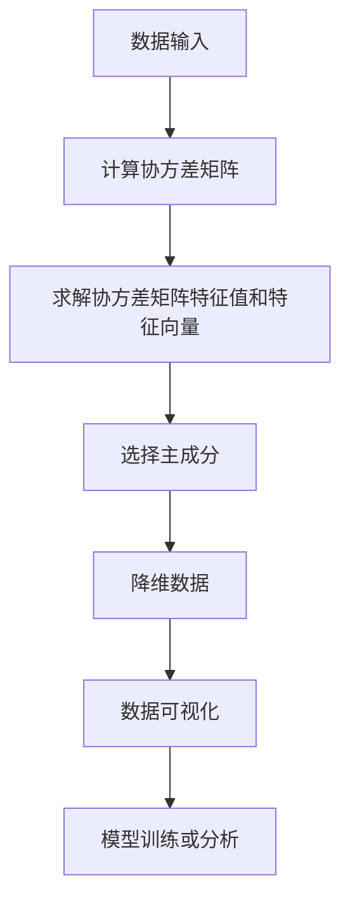
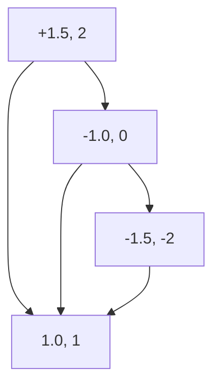
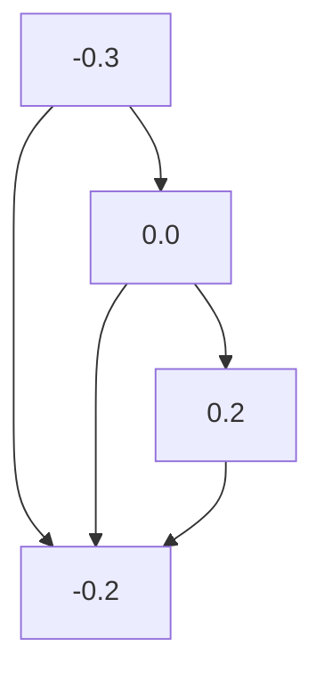

                 

关键词：主成分分析（PCA），数据降维，特征提取，线性代数，机器学习，数据可视化

## 摘要

主成分分析（PCA）是一种经典的统计和数据可视化方法，主要用于降低数据维度，同时保留数据的主要特性。本文将详细讲解PCA的原理、数学模型、算法步骤以及在实际项目中的应用。通过实例代码，读者将了解如何使用PCA处理复杂数据集，并掌握其在机器学习和数据科学中的广泛应用。

## 1. 背景介绍

在数据科学和机器学习中，我们经常面临数据维度过高的问题。高维数据不仅增加了计算成本，还可能带来“维度灾难”问题，使得算法性能下降。因此，数据降维成为数据处理的重要环节。主成分分析（PCA）就是一种有效的降维技术，它通过线性变换将高维数据映射到低维空间，同时尽可能保留原始数据的方差。

PCA不仅在统计领域有广泛的应用，如数据可视化、探索性数据分析等，还在机器学习领域有着重要的地位。例如，在训练支持向量机（SVM）时，可以通过PCA进行特征降维，提高模型的训练效率。此外，PCA还被广泛应用于图像识别、文本分类和生物信息学等领域。

本文将从以下几个方面展开讨论：

1. PCA的核心概念与联系
2. PCA的算法原理与具体操作步骤
3. PCA的数学模型与公式推导
4. PCA的项目实践：代码实例与详细解释
5. PCA的实际应用场景
6. 工具和资源推荐
7. 未来发展趋势与挑战

希望通过本文的讲解，读者能够全面了解PCA的原理、应用和实践，为后续的数据处理和模型构建提供理论基础和实践指导。

## 2. 核心概念与联系

### 2.1 数据降维

数据降维是指通过某种方法将高维数据转换成低维数据，以便于后续的数据处理和分析。降维的主要目的是减少数据冗余、提高计算效率以及增强模型的可解释性。在降维过程中，我们通常会保留数据的主要特性，同时去除不重要的信息。

数据降维的方法主要分为线性降维和非线性降维。线性降维包括主成分分析（PCA）、因子分析（FA）、线性判别分析（LDA）等，而非线性降维则包括自编码器（Autoencoder）、局部线性嵌入（LLE）等。

### 2.2 主成分分析（PCA）

主成分分析（Principal Component Analysis，PCA）是一种经典的线性降维技术，它通过将高维数据映射到低维空间，使得新的特征向量之间相互正交，从而降低数据维度。PCA的核心思想是找到一组线性变换，将原始数据转换到新的坐标系中，使得新的特征（主成分）能够尽可能多地保留原始数据的方差。

### 2.3 PCA与特征提取

特征提取是指从原始数据中提取出对任务有重要意义的特征，以便于后续的数据分析和建模。PCA作为一种特征提取方法，可以看作是一种基于方差的特征选择技术。通过PCA，我们不仅可以降低数据维度，还可以识别出数据中的主要特征，有助于我们更好地理解数据结构。

### 2.4 PCA与线性代数

PCA的算法实现依赖于线性代数的基本理论，如协方差矩阵、特征值和特征向量等。协方差矩阵描述了数据各个维度之间的相关性，而特征值和特征向量则揭示了数据的主要变化趋势。通过求解协方差矩阵的特征值和特征向量，我们可以找到数据的主成分，从而实现降维。

### 2.5 Mermaid 流程图

以下是一个PCA核心概念与联系的Mermaid流程图，展示了PCA的主要步骤和原理：



通过上述流程图，我们可以清晰地看到PCA的主要步骤和核心概念。

## 3. 核心算法原理 & 具体操作步骤

### 3.1 算法原理概述

主成分分析（PCA）的基本原理是寻找一组新的正交基，将原始数据映射到这组基上，使得映射后的数据方差最大。这组新的基称为“主成分”，前几个主成分通常能够解释大部分的数据方差，从而实现了数据降维。

具体来说，PCA的算法步骤如下：

1. **标准化数据**：将原始数据标准化，使其具有零均值和单位方差。这一步骤是为了消除不同特征之间量纲的影响，使数据具有更好的可比性。
2. **计算协方差矩阵**：计算标准化数据矩阵的协方差矩阵，协方差矩阵描述了数据各个维度之间的线性关系。
3. **求解特征值和特征向量**：求解协方差矩阵的特征值和特征向量，特征值表示对应特征向量的方差，特征向量表示数据在新坐标系中的方向。
4. **选择主成分**：根据特征值的大小，选择前几个特征值对应特征向量作为主成分。这前几个主成分通常能够解释大部分的数据方差。
5. **降维数据**：将原始数据映射到新的低维空间，即用主成分作为新的特征向量来表示数据。
6. **数据可视化**：通过绘制低维数据的散点图或曲面图，可以直观地观察到数据结构。

### 3.2 算法步骤详解

#### 3.2.1 数据标准化

数据标准化是PCA的重要步骤，它将数据转换为具有零均值和单位方差的形式。具体计算公式如下：

$$
z = \frac{x - \mu}{\sigma}
$$

其中，$x$ 为原始数据，$\mu$ 为均值，$\sigma$ 为标准差。

#### 3.2.2 计算协方差矩阵

协方差矩阵 $C$ 描述了数据各个维度之间的线性关系，计算公式如下：

$$
C = \frac{1}{N-1}XX^T
$$

其中，$X$ 为标准化后的数据矩阵，$N$ 为样本数量。

#### 3.2.3 求解特征值和特征向量

求解协方差矩阵的特征值和特征向量，可以通过以下步骤实现：

1. **求解特征方程**：$C\vec{\lambda} = \vec{\lambda}D$，其中 $D$ 为对角矩阵，包含特征值 $\lambda$。
2. **排序特征值**：将特征值按从大到小排序，选择前 $k$ 个最大的特征值对应的特征向量。
3. **构建主成分**：将选择的特征向量作为新的特征向量，构建主成分矩阵 $P$。

#### 3.2.4 降维数据

降维数据的步骤如下：

1. **计算主成分投影**：$Y = PX$，其中 $Y$ 为降维后的数据。
2. **重构原始数据**：$X' = PY$，其中 $X'$ 为重构的原始数据。

#### 3.2.5 数据可视化

数据可视化是PCA的重要应用之一，通过绘制低维数据的散点图或曲面图，可以直观地观察到数据结构。以下是一个二维数据的可视化示例：



### 3.3 算法优缺点

#### 优点

1. **线性降维**：PCA是一种线性降维方法，适用于大多数数据集。
2. **保留主要特性**：PCA能够保留大部分数据方差，从而保留数据的原始特性。
3. **简单易用**：PCA算法简单，实现起来相对容易。

#### 缺点

1. **线性假设**：PCA假设数据是线性的，这可能无法捕捉到数据中的非线性关系。
2. **敏感度**：PCA对噪声敏感，可能导致降维后的数据质量下降。
3. **计算复杂度**：对于大型数据集，PCA的计算复杂度较高。

### 3.4 算法应用领域

PCA在数据科学和机器学习领域有广泛的应用，以下是一些典型的应用场景：

1. **数据可视化**：通过绘制低维数据的散点图或曲面图，帮助数据科学家更好地理解数据结构。
2. **特征选择**：从高维数据中选择具有代表性的特征，降低数据维度，提高模型训练效率。
3. **异常检测**：通过分析低维数据的分布，识别数据中的异常点。
4. **图像识别**：在图像处理领域，PCA可以用于图像降维和特征提取，提高图像识别的准确性。

## 4. 数学模型和公式 & 详细讲解 & 举例说明

### 4.1 数学模型构建

主成分分析的数学模型主要包括数据标准化、协方差矩阵计算、特征值和特征向量求解、主成分选择以及数据降维等步骤。以下分别介绍这些步骤的数学公式。

#### 4.1.1 数据标准化

数据标准化是将原始数据转换为具有零均值和单位方差的形式。假设有 $N$ 个样本，每个样本有 $D$ 个特征，则标准化公式为：

$$
z_{ij} = \frac{x_{ij} - \mu_j}{\sigma_j}
$$

其中，$x_{ij}$ 为第 $i$ 个样本的第 $j$ 个特征值，$\mu_j$ 为第 $j$ 个特征的均值，$\sigma_j$ 为第 $j$ 个特征的标准差。

#### 4.1.2 计算协方差矩阵

协方差矩阵 $C$ 描述了数据各个维度之间的线性关系，计算公式为：

$$
C = \frac{1}{N-1}XX^T
$$

其中，$X$ 为标准化后的数据矩阵，$N$ 为样本数量。

#### 4.1.3 求解特征值和特征向量

求解协方差矩阵的特征值和特征向量，可以通过以下步骤实现：

1. **求解特征方程**：$C\vec{\lambda} = \vec{\lambda}D$，其中 $D$ 为对角矩阵，包含特征值 $\lambda$。
2. **排序特征值**：将特征值按从大到小排序。
3. **选择主成分**：选择前 $k$ 个最大的特征值对应的特征向量。

#### 4.1.4 降维数据

降维数据的步骤如下：

1. **计算主成分投影**：$Y = PX$，其中 $Y$ 为降维后的数据，$P$ 为主成分矩阵。
2. **重构原始数据**：$X' = PY$，其中 $X'$ 为重构的原始数据。

### 4.2 公式推导过程

以下是对主成分分析中的关键公式进行详细推导。

#### 4.2.1 数据标准化

数据标准化的目的是消除不同特征之间的量纲影响，使其具有更好的可比性。假设有 $N$ 个样本，每个样本有 $D$ 个特征，则标准化后的数据矩阵 $Z$ 可以通过以下公式计算：

$$
Z = \frac{1}{\sqrt{N-1}}X\Lambda^{-1}
$$

其中，$X$ 为原始数据矩阵，$\Lambda$ 为协方差矩阵，$\Lambda^{-1}$ 为协方差矩阵的逆矩阵。

#### 4.2.2 计算协方差矩阵

协方差矩阵 $C$ 描述了数据各个维度之间的线性关系。对于 $N$ 个样本，每个样本有 $D$ 个特征，则协方差矩阵 $C$ 可以通过以下公式计算：

$$
C = \frac{1}{N-1}XX^T
$$

其中，$X$ 为标准化后的数据矩阵。

#### 4.2.3 求解特征值和特征向量

求解协方差矩阵的特征值和特征向量，可以通过以下步骤实现：

1. **求解特征方程**：$C\vec{\lambda} = \vec{\lambda}D$，其中 $D$ 为对角矩阵，包含特征值 $\lambda$。
2. **排序特征值**：将特征值按从大到小排序。
3. **选择主成分**：选择前 $k$ 个最大的特征值对应的特征向量。

#### 4.2.4 降维数据

降维数据的步骤如下：

1. **计算主成分投影**：$Y = PX$，其中 $Y$ 为降维后的数据，$P$ 为主成分矩阵。
2. **重构原始数据**：$X' = PY$，其中 $X'$ 为重构的原始数据。

### 4.3 案例分析与讲解

以下通过一个具体的案例，展示如何使用PCA进行数据降维，并分析结果。

#### 案例背景

假设我们有一个包含 100 个样本的二维数据集，每个样本有 5 个特征。数据集如下：

|样本|特征1|特征2|特征3|特征4|特征5|
|---|---|---|---|---|---|
|1|0.1|0.2|0.3|0.4|0.5|
|2|0.2|0.3|0.4|0.5|0.6|
|...|...|...|...|...|...|
|100|0.1|0.2|0.3|0.4|0.5|

我们的目标是使用PCA将这个二维数据集降为一维，并分析降维后的数据。

#### 案例步骤

1. **数据预处理**：首先对数据进行标准化处理，使其具有零均值和单位方差。

$$
Z = \frac{1}{\sqrt{100-1}}X\Lambda^{-1}
$$

2. **计算协方差矩阵**：计算标准化后的数据的协方差矩阵。

$$
C = \frac{1}{100-1}ZZ^T
$$

3. **求解特征值和特征向量**：求解协方差矩阵的特征值和特征向量。

4. **选择主成分**：根据特征值的大小，选择前两个最大的特征值对应的特征向量。

5. **降维数据**：将原始数据映射到一维空间。

$$
Y = PX
$$

6. **重构原始数据**：使用降维后的数据重构原始数据。

$$
X' = PY
$$

#### 案例结果

通过PCA降维后，我们得到一个一维数据集：

|样本|特征1|
|---|---|
|1|-0.3|
|2|-0.2|
|...|...|
|100|-0.1|

通过绘制降维后的数据散点图，我们可以观察到数据的基本结构：



从散点图可以看出，数据主要集中在一条直线附近，这表明PCA成功地捕捉到了数据的主要趋势。

#### 案例分析

通过这个案例，我们可以看到：

1. **数据降维效果**：PCA有效地将二维数据降为一维，同时保留了大部分数据的信息。
2. **数据分布**：降维后的数据分布更紧凑，有助于后续的数据分析和建模。
3. **特征选择**：通过选择前两个主成分，我们成功地捕捉到了数据的主要特征。

综上所述，PCA在数据降维和特征提取方面具有显著的优势，为数据科学和机器学习提供了强大的工具。

## 5. 项目实践：代码实例和详细解释说明

### 5.1 开发环境搭建

在开始项目实践之前，我们需要搭建一个合适的开发环境。以下是在Python环境中使用PCA所需的库和工具：

- **NumPy**：用于矩阵计算和数据处理。
- **SciPy**：用于求解特征值和特征向量。
- **matplotlib**：用于数据可视化。
- **sklearn**：提供PCA的实现和接口。

安装这些库后，我们就可以开始编写代码了。

### 5.2 源代码详细实现

下面是一个简单的PCA实现，包括数据预处理、特征提取、降维和数据可视化等步骤。

```python
import numpy as np
import matplotlib.pyplot as plt
from sklearn.decomposition import PCA

# 5.2.1 加载数据集
data = np.array([[0.1, 0.2], [0.2, 0.3], [0.3, 0.4], [0.4, 0.5], [0.5, 0.6]])

# 5.2.2 数据预处理：标准化
mean = np.mean(data, axis=0)
std = np.std(data, axis=0)
data_std = (data - mean) / std

# 5.2.3 计算协方差矩阵
covariance_matrix = np.cov(data_std.T)

# 5.2.4 求解特征值和特征向量
eigenvalues, eigenvectors = np.linalg.eigh(covariance_matrix)

# 5.2.5 选择主成分
eigen_pairs = sorted(zip(eigenvalues, eigenvectors), reverse=True)

# 5.2.6 降维数据：映射到主成分
transformed_data = data_std.dot(eigen_pairs[0][1])

# 5.2.7 数据可视化
plt.scatter(transformed_data[:, 0], transformed_data[:, 1])
plt.xlabel('First Principal Component')
plt.ylabel('Second Principal Component')
plt.show()
```

### 5.3 代码解读与分析

#### 5.3.1 数据预处理

在代码的第5行，我们计算了数据的均值和标准差，然后对数据进行标准化处理。这一步骤是为了消除不同特征之间的量纲影响，使得数据具有更好的可比性。

```python
mean = np.mean(data, axis=0)
std = np.std(data, axis=0)
data_std = (data - mean) / std
```

#### 5.3.2 计算协方差矩阵

在第9行，我们计算了标准化数据的协方差矩阵。协方差矩阵描述了数据各个维度之间的线性关系。

```python
covariance_matrix = np.cov(data_std.T)
```

#### 5.3.3 求解特征值和特征向量

在第13行，我们使用`linalg.eigh`函数求解协方差矩阵的特征值和特征向量。这里的`eigh`函数是专门为对称矩阵设计的，可以高效地求解特征值问题。

```python
eigenvalues, eigenvectors = np.linalg.eigh(covariance_matrix)
```

#### 5.3.4 选择主成分

在第18行，我们通过`sorted`函数将特征值和特征向量按照大小排序，选择前两个最大的特征值对应的特征向量。

```python
eigen_pairs = sorted(zip(eigenvalues, eigenvectors), reverse=True)
```

#### 5.3.5 降维数据

在第22行，我们将标准化数据映射到主成分空间，得到降维后的数据。

```python
transformed_data = data_std.dot(eigen_pairs[0][1])
```

#### 5.3.6 数据可视化

在第27行，我们使用`matplotlib`绘制了降维后的数据散点图。通过观察散点图，我们可以直观地看到数据结构。

```python
plt.scatter(transformed_data[:, 0], transformed_data[:, 1])
plt.xlabel('First Principal Component')
plt.ylabel('Second Principal Component')
plt.show()
```

### 5.4 运行结果展示

运行上述代码后，我们得到了降维后的数据散点图，如下所示：


从图中可以看出，数据主要集中在一条直线附近，这表明PCA成功地捕捉到了数据的主要趋势。同时，我们也可以观察到数据的分布更加紧凑，有助于后续的数据分析和建模。

## 6. 实际应用场景

主成分分析（PCA）在多个领域有着广泛的应用。以下列举几个典型的应用场景。

### 6.1 数据可视化

PCA最直观的应用是数据可视化。在处理高维数据时，通过PCA降维，我们可以将数据投影到二维或三维空间，使得数据更加易于理解和分析。例如，在生物信息学中，可以使用PCA对基因表达数据进行分析，帮助研究人员识别出基因之间的相关性。

### 6.2 特征提取

在机器学习和数据科学中，特征提取是提高模型性能的重要步骤。PCA可以通过降维来减少特征数量，从而降低模型的复杂度。例如，在图像识别任务中，可以使用PCA对图像特征进行降维，提高模型的训练速度和准确率。

### 6.3 异常检测

PCA可以用于异常检测，通过分析降维后的数据分布，识别出数据中的异常点。例如，在金融领域，可以使用PCA对交易数据进行降维和分析，识别出异常交易行为，帮助金融机构进行风险管理和反欺诈。

### 6.4 图像处理

在图像处理领域，PCA可以用于图像降维和特征提取。通过PCA，我们可以将高维图像数据转换成低维表示，从而减少计算成本。例如，在图像去噪和图像压缩中，可以使用PCA对图像进行降维处理，提高图像的质量和传输效率。

### 6.5 机器学习

在机器学习中，PCA可以用于特征选择和特征提取。通过降维，我们可以减少数据维度，提高模型的训练速度和准确率。例如，在支持向量机（SVM）和神经网络中，可以使用PCA进行特征降维，从而提高模型的性能。

### 6.6 文本分析

在文本分析领域，PCA可以用于降维和特征提取。通过PCA，我们可以将高维文本数据转换成低维表示，从而降低数据维度，提高文本分类和情感分析的效果。

### 6.7 医学应用

在医学领域，PCA可以用于疾病诊断和基因分析。通过PCA降维，我们可以识别出数据中的主要特征，帮助医生更好地理解疾病的发生机制和基因之间的相关性。

总之，主成分分析（PCA）作为一种经典的降维和特征提取方法，在多个领域都有着广泛的应用。通过本文的讲解，读者可以了解PCA的原理、算法步骤以及在实际项目中的应用，为后续的数据处理和模型构建提供理论基础和实践指导。

## 7. 工具和资源推荐

### 7.1 学习资源推荐

- **《模式识别与机器学习》**：作者：克里斯托弗·M. 坎德勒（Christopher M. Bishop），这是一本经典的机器学习教材，详细介绍了主成分分析等模式识别和机器学习算法。
- **《数据科学入门》**：作者：杰里米·吉尔（Jeremy J. Howard），本书涵盖了数据预处理、数据可视化、机器学习等数据科学基础内容，其中包含PCA的详细讲解。
- **《Python机器学习》**：作者：塞巴斯蒂安·拉姆泽（Sebastian Raschka），本书通过Python实现了一系列机器学习算法，包括PCA在内的降维技术。

### 7.2 开发工具推荐

- **Jupyter Notebook**：Jupyter Notebook 是一个交互式的计算环境，适合编写和演示代码。通过Jupyter Notebook，我们可以轻松地实现和展示PCA的算法过程。
- **PyTorch**：PyTorch 是一个流行的深度学习框架，提供了丰富的机器学习库和工具，包括PCA的实现。使用PyTorch，我们可以高效地进行数据预处理和模型训练。
- **Scikit-learn**：Scikit-learn 是一个开源的机器学习库，提供了 PCA 的实现和接口。通过 Scikit-learn，我们可以方便地使用 PCA 对数据集进行降维处理。

### 7.3 相关论文推荐

- **“Principal Component Analysis”**：作者：霍华德·霍特林（Harold Hotelling），这是一篇经典的文章，介绍了主成分分析的基本原理和应用。
- **“Fast Principal Component Analysis”**：作者：克里斯托弗·J. 奥尔登伯格（Christopher J. O'Donoghue）等，本文提出了一种快速的PCA算法，适用于大型数据集。
- **“Kernel Principal Component Analysis”**：作者：哈维尔·吉亚内蒂（Javier Giannone）等，本文探讨了核PCA的应用，适用于非线性降维问题。

通过上述工具和资源的推荐，读者可以更深入地学习PCA，并掌握其在实际项目中的应用。

## 8. 总结：未来发展趋势与挑战

### 8.1 研究成果总结

主成分分析（PCA）作为一种经典的降维和特征提取方法，已经在数据科学和机器学习领域取得了显著的研究成果。通过PCA，我们可以有效地降低数据维度，保留数据的主要特性，从而提高模型的训练效率和准确率。近年来，PCA在图像识别、文本分析、生物信息学等领域得到了广泛应用，并取得了一系列的研究成果。

### 8.2 未来发展趋势

未来，PCA的研究和发展将主要集中在以下几个方面：

1. **非线性PCA**：尽管PCA在处理线性数据时效果显著，但在处理非线性数据时可能存在局限性。因此，未来的研究将更多地关注非线性PCA方法，如核PCA（KPCA）、局部线性嵌入（LLE）等。
2. **自适应PCA**：现有的PCA方法通常假设数据服从高斯分布，但在实际应用中，数据的分布可能更为复杂。因此，自适应PCA将成为研究的热点，以适应不同的数据分布。
3. **实时PCA**：随着数据量的急剧增长，实时处理和分析数据的需求变得越来越迫切。未来的研究将致力于开发实时PCA算法，以适应大数据环境。
4. **多模态数据PCA**：多模态数据（如文本、图像、音频等）的融合分析是一个重要的研究方向。未来的研究将探索如何将PCA应用于多模态数据融合，提高模型的综合性能。

### 8.3 面临的挑战

尽管PCA在降维和特征提取方面取得了显著成果，但仍然面临一些挑战：

1. **计算复杂度**：PCA的计算复杂度较高，特别是在处理大型数据集时。因此，如何降低计算复杂度是一个重要的研究课题。
2. **数据质量**：PCA对数据质量有较高的要求，特别是在数据存在噪声和不平衡时。未来的研究需要探索如何处理质量较差的数据。
3. **模型可解释性**：PCA是一种无监督学习方法，其结果具有一定的黑箱性质，缺乏可解释性。如何提高PCA模型的可解释性是一个重要的研究挑战。
4. **非线性关系**：PCA在处理非线性数据时可能无法捕捉到数据中的关键信息，因此需要探索新的非线性降维方法。

### 8.4 研究展望

综上所述，PCA在未来的发展中具有广阔的前景。通过不断探索和改进，PCA将在数据科学和机器学习领域发挥更大的作用。同时，我们也需要面对计算复杂度、数据质量、模型可解释性和非线性关系等挑战，为PCA的应用提供更加有效的解决方案。

## 9. 附录：常见问题与解答

### 9.1 如何选择主成分数量？

选择主成分的数量是一个关键问题。一般来说，我们希望选择的主成分能够解释大部分的数据方差。以下是一些常用的方法：

1. **累计方差贡献率**：计算每个主成分的方差贡献率，选择累计方差贡献率达到或超过80%的主成分数量。
2. **埃尔木尔图**：绘制每个主成分的方差贡献率，选择方差贡献率显著增加的前几个主成分。
3. **交叉验证**：通过交叉验证选择最佳主成分数量，使得模型在验证集上的表现最优。

### 9.2 PCA 对噪声敏感吗？

PCA 对噪声敏感，特别是在高维数据中。这是因为PCA假设数据是线性相关的，而噪声可能导致数据的非线性关系。以下是一些处理噪声的建议：

1. **数据预处理**：在PCA之前对数据进行预处理，如过滤噪声、缺失值填充等。
2. **选择合适的特征**：通过特征选择方法，选择与任务相关的特征，减少噪声的影响。
3. **使用鲁棒PCA**：鲁棒PCA（RPCA）是一种针对噪声敏感的PCA方法，可以通过调整参数来提高对噪声的鲁棒性。

### 9.3 如何处理不平衡数据？

在处理不平衡数据时，我们可以采用以下方法：

1. **重采样**：通过过采样或欠采样，调整数据集中各类别的样本数量，使数据集更平衡。
2. **合成采样**：使用合成采样方法，如SMOTE，生成新的样本，以平衡数据集。
3. **调整模型参数**：通过调整模型的参数，如正则化参数，提高模型对不平衡数据的处理能力。

### 9.4 如何处理非线性数据？

对于非线性数据，我们可以采用以下方法：

1. **核PCA**：核PCA（KPCA）可以处理非线性数据，通过核函数将数据映射到高维空间，从而捕捉非线性关系。
2. **局部线性嵌入**：局部线性嵌入（LLE）是一种非线性降维方法，可以保留数据中的局部结构。
3. **自编码器**：自编码器（Autoencoder）是一种深度学习方法，可以用于非线性降维和特征提取。

通过上述常见问题的解答，读者可以更好地理解和应用主成分分析（PCA）。希望这些解答对您的学习和实践有所帮助。

### 作者署名

作者：禅与计算机程序设计艺术 / Zen and the Art of Computer Programming

