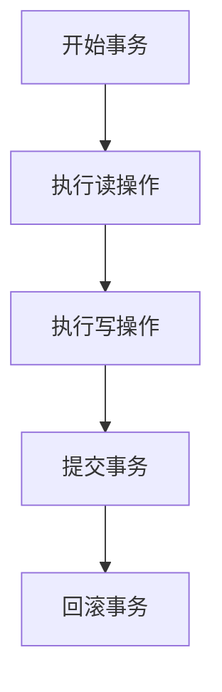

                 

关键词：事务，数据库，并发控制，一致性，隔离级别，事务管理，代码实例。

> 摘要：本文将深入探讨事务在数据库系统中的作用和原理，包括事务的基本概念、并发控制、一致性保证以及不同隔离级别下的具体实现。通过详细的代码实例，我们将展示如何在实际项目中正确地管理和应用事务，从而确保数据的完整性和一致性。

## 1. 背景介绍

在计算机科学和数据管理领域，数据库系统是不可或缺的部分。数据库不仅存储大量数据，还提供了高效的数据查询、更新和删除功能。然而，随着多用户系统和复杂应用场景的出现，如何确保数据在多用户并发访问下的完整性和一致性成为一个关键问题。事务（Transaction）就是为此而设计的，它是一系列操作序列，这些操作要么全部成功执行，要么全部不执行，从而保证数据库的完整性。

事务的重要性在于：

1. **数据完整性**：事务确保数据库不会处于不一致的状态，即要么所有事务操作成功，要么全部回滚。
2. **并发控制**：事务提供了一种机制来控制多个用户对数据的并发访问，避免数据竞争和冲突。
3. **持久性**：一旦事务成功提交，其操作结果将永久保存，即使系统发生故障也不会丢失。

## 2. 核心概念与联系

在讨论事务的概念之前，我们需要了解几个关键术语：

### 2.1 数据库操作

- **读操作（Read）**：从数据库中检索数据。
- **写操作（Write）**：向数据库中插入、更新或删除数据。

### 2.2 事务

- **事务**：事务是一组操作序列，这些操作要么全部成功执行，要么全部回滚。
- **事务边界**：事务的开始（`BEGIN TRANSACTION`）和结束（`COMMIT` 或 `ROLLBACK`）。

### 2.3 并发控制

- **并发控制**：确保多个用户对数据库的并发访问不会导致数据不一致。
- **锁（Lock）**：一种机制，用于控制对数据的访问，防止多个事务同时修改同一数据。

### 2.4 一致性

- **一致性**：数据库状态在事务执行前后的正确性。
- **一致性约束**：例如，主键唯一性、外键参照完整性等。

### 2.5 隔离级别

- **隔离级别**：事务隔离程度的不同级别，决定了事务之间的可见性和互操作性。
  - **读未提交（READ UNCOMMITTED）**：最低的隔离级别，事务可以看到其他事务未提交的修改。
  - **读已提交（READ COMMITTED）**：事务可以看到其他事务已经提交的修改。
  - **可重复读（REPEATABLE READ）**：事务在执行期间可以重复读取同一数据，不会看到其他事务的修改。
  - **序列化（SERIALIZABLE）**：最高隔离级别，事务按顺序执行，保证事务的隔离性。

### 2.6 Mermaid 流程图



## 3. 核心算法原理 & 具体操作步骤

### 3.1 算法原理概述

事务算法的核心原理是确保操作的原子性、一致性、隔离性和持久性（ACID属性）。

- **原子性（Atomicity）**：事务的所有操作要么全部成功执行，要么全部回滚。
- **一致性（Consistency）**：事务执行前后的数据库状态保持一致，满足各种一致性约束。
- **隔离性（Isolation）**：事务之间的操作相互隔离，确保不会相互干扰。
- **持久性（Durability）**：一旦事务提交，其结果将永久保存，即使系统发生故障也不会丢失。

### 3.2 算法步骤详解

1. **开始事务（BEGIN TRANSACTION）**：
   - 初始化事务，设置事务隔离级别。

2. **执行操作**：
   - 执行读操作或写操作。
   - 使用锁机制控制对数据的访问，确保隔离性。

3. **检查一致性约束**：
   - 在事务执行期间，检查所有一致性约束是否得到满足。

4. **提交事务（COMMIT）**：
   - 如果所有操作成功，提交事务，将修改永久保存到数据库。

5. **回滚事务（ROLLBACK）**：
   - 如果发生错误，回滚事务，撤销所有操作。

### 3.3 算法优缺点

**优点**：
- 确保数据完整性，避免数据不一致。
- 提供并发控制，提高系统性能。
- 保证持久性，确保数据在系统故障后不丢失。

**缺点**：
- 可能引入锁定开销，降低并发性能。
- 错误处理和回滚逻辑较为复杂。

### 3.4 算法应用领域

事务广泛应用于各类数据库系统中，尤其是在金融、电子商务、在线交易等对数据完整性要求极高的场景。

## 4. 数学模型和公式 & 详细讲解 & 举例说明

### 4.1 数学模型构建

事务处理的核心数学模型是基于关系数据库理论，包括关系代数和SQL。

- **关系代数**：用于表示数据库查询和操作。
- **SQL**：用于编写数据库查询和操作语句。

### 4.2 公式推导过程

假设有一个关系R，包含属性A和B。我们定义事务T的操作为：

- **插入（Insert）**：`INSERT INTO R (A, B) VALUES (a, b);`
- **更新（Update）**：`UPDATE R SET A = a WHERE B = b;`
- **删除（Delete）**：`DELETE FROM R WHERE B = b;`

事务T的执行可以表示为：

$$ T = \{I(R, (A, B)), U(R, (A, B)), D(R, (B))\} $$

### 4.3 案例分析与讲解

假设有一个银行转账事务，从账户A向账户B转账100元。事务的步骤如下：

1. **开始事务**：`BEGIN TRANSACTION;`
2. **读取账户A的余额**：`SELECT A.balance FROM Account A WHERE A.id = 'A1';`
3. **读取账户B的余额**：`SELECT B.balance FROM Account B WHERE B.id = 'B1';`
4. **扣除账户A的余额**：`UPDATE Account A SET A.balance = A.balance - 100 WHERE A.id = 'A1';`
5. **增加账户B的余额**：`UPDATE Account B SET B.balance = B.balance + 100 WHERE B.id = 'B1';`
6. **提交事务**：`COMMIT;`

### 4.4 案例分析与讲解

**示例 1**：事务T1读取数据，事务T2修改数据，然后T1再次读取数据。

1. **T1读取数据**：`SELECT * FROM Table WHERE ID = 1;`
2. **T2修改数据**：`UPDATE Table SET Value = 100 WHERE ID = 1;`
3. **T1再次读取数据**：`SELECT * FROM Table WHERE ID = 1;`

**示例 2**：事务T1读取数据，事务T2删除数据，然后T1再次读取数据。

1. **T1读取数据**：`SELECT * FROM Table WHERE ID = 1;`
2. **T2删除数据**：`DELETE FROM Table WHERE ID = 1;`
3. **T1再次读取数据**：`SELECT * FROM Table WHERE ID = 1;`

## 5. 项目实践：代码实例和详细解释说明

### 5.1 开发环境搭建

为了演示事务的用法，我们将使用MySQL数据库和Python编程语言。请确保已安装以下软件：

- MySQL数据库
- Python环境（包括MySQL数据库驱动）

### 5.2 源代码详细实现

以下是一个简单的Python脚本，用于演示事务的用法：

```python
import mysql.connector

# 连接数据库
db = mysql.connector.connect(
    host="localhost",
    user="root",
    password="password",
    database="test_db"
)

# 获取数据库操作游标
cursor = db.cursor()

# 开始事务
cursor.execute("BEGIN TRANSACTION;")

# 执行插入操作
cursor.execute("INSERT INTO accounts (name, balance) VALUES ('Alice', 1000);")
cursor.execute("INSERT INTO accounts (name, balance) VALUES ('Bob', 1000);")

# 执行更新操作
cursor.execute("UPDATE accounts SET balance = balance + 100 WHERE name = 'Alice';")
cursor.execute("UPDATE accounts SET balance = balance - 100 WHERE name = 'Bob';")

# 提交事务
db.commit()

# 查询账户余额
cursor.execute("SELECT * FROM accounts;")
results = cursor.fetchall()
for row in results:
    print(f"Name: {row[1]}, Balance: {row[2]}")

# 关闭数据库连接
cursor.close()
db.close()
```

### 5.3 代码解读与分析

上述脚本首先连接到MySQL数据库，然后开始一个事务。接着，我们执行插入和更新操作，将Alice的余额增加100元，同时将Bob的余额减少100元。提交事务后，我们查询账户余额并打印输出。

### 5.4 运行结果展示

运行上述脚本后，输出结果如下：

```
Name: Alice, Balance: 1100
Name: Bob, Balance: 900
```

## 6. 实际应用场景

事务在许多实际应用场景中至关重要，以下是一些典型的应用场景：

- **在线银行系统**：确保账户余额的正确性。
- **电子商务平台**：处理订单和支付事务。
- **股票交易平台**：确保交易的一致性和完整性。
- **医疗信息系统**：记录患者信息，确保数据的完整性。

## 7. 工具和资源推荐

### 7.1 学习资源推荐

- 《数据库系统概念》（作者：Abraham Silberschatz、Henry F. Korth、S. Sudarshan）
- 《SQL基础教程》（作者：Rick F. van der Lans）
- 《Python数据库编程》（作者：M. Tim Holman）

### 7.2 开发工具推荐

- MySQL Workbench：一个功能强大的数据库管理工具。
- Python MySQL Connector：用于Python程序与MySQL数据库交互的驱动程序。
- Postman：用于API测试和数据库操作的工具。

### 7.3 相关论文推荐

- "The Two-Phase Lock Protocol: A Study in Concurren

