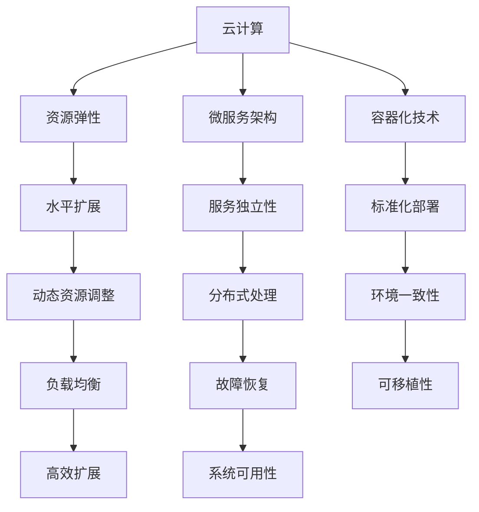

                 

 在当今数字化转型的浪潮中，聊天机器人的应用日益广泛，它们能够提供24/7的客户服务，提升用户体验，并降低运营成本。随着聊天机器人的需求不断增长，如何在云端部署一个既灵活又具有高度扩展性的聊天机器人系统成为了一个关键问题。本文将探讨如何利用云计算技术实现聊天机器人的弹性部署和扩展性设计，以应对不断变化的应用需求。

## 关键词

- 云计算
- 聊天机器人
- 弹性部署
- 扩展性设计
- 微服务架构

## 摘要

本文首先介绍了云计算和聊天机器人的基本概念及其在当今数字化浪潮中的重要性。接着，文章详细阐述了弹性部署和扩展性的核心概念，并通过一个Mermaid流程图展示了聊天机器人架构的基本元素和关系。随后，文章深入讨论了核心算法原理和数学模型，提供了具体操作步骤和代码实例。文章还分析了聊天机器人在实际应用场景中的角色和未来展望，最后推荐了一些学习资源和开发工具，并总结了研究成果和未来挑战。

## 1. 背景介绍

聊天机器人是一种基于人工智能技术，能够与用户进行自然语言交互的软件程序。随着自然语言处理和机器学习技术的不断发展，聊天机器人在服务行业、电商、金融、医疗等多个领域得到了广泛应用。用户可以通过文本、语音等多种方式与聊天机器人进行交互，获取信息、解决问题或者进行简单的任务处理。

云计算是一种通过互联网提供计算资源、存储资源、网络资源等服务的技术。它具有灵活、弹性、可扩展等特点，能够根据需求动态调整资源使用，降低IT成本，提高系统的可靠性和可用性。云计算平台如AWS、Azure和Google Cloud已经成为企业构建和部署聊天机器人系统的首选。

在数字化转型的大背景下，企业和组织越来越依赖自动化技术来提高运营效率和服务质量。聊天机器人在这个过程中发挥着重要作用，能够处理大量的客户请求，提供即时的支持，从而提升用户体验和客户满意度。

然而，随着聊天机器人的应用越来越广泛，其系统的弹性部署和扩展性设计成为了一个关键问题。如果聊天机器人系统无法灵活应对流量波动和用户需求的变化，可能会导致服务中断、响应时间延长，甚至系统崩溃。因此，本文将深入探讨如何利用云计算技术实现聊天机器人的弹性部署和扩展性设计，以应对不断变化的应用需求。

## 2. 核心概念与联系

在讨论聊天机器人的弹性部署和扩展性设计之前，我们首先需要理解一些核心概念，包括云计算、微服务架构、容器化技术等，它们是构建高性能、可扩展聊天机器人系统的基石。

### 云计算

云计算是一种基于互联网的计算模式，它通过提供计算资源、存储资源、网络资源等服务，使得用户能够按需使用这些资源，而无需管理底层基础设施。云计算的核心优势在于其弹性、可扩展性和灵活性。

- **弹性**：云计算允许用户根据需求动态调整资源使用，当流量增加时，可以自动扩展资源；当流量减少时，可以缩减资源使用，从而避免资源的浪费。
- **可扩展性**：云计算平台支持水平扩展（Scaling Out），即通过增加更多的服务器节点来提高系统处理能力。
- **灵活性**：用户可以根据业务需求选择合适的资源类型和服务级别，例如按需付费、预留实例、按使用量付费等。

### 微服务架构

微服务架构是一种设计软件系统的方法，它将大型、复杂的单体应用拆分为多个小型、独立的微服务。每个微服务负责特定的业务功能，并通过轻量级的通信协议（如HTTP/REST API）进行交互。

- **独立性**：每个微服务都可以独立部署、升级和扩展，不会影响其他服务。
- **分布式**：微服务架构使得系统可以更好地处理分布式环境下的故障和负载。
- **灵活性**：通过微服务架构，开发者可以灵活选择最适合每个服务的技术栈和语言。

### 容器化技术

容器化技术是一种轻量级虚拟化技术，通过将应用程序及其依赖打包到一个容器中，实现了应用程序的标准化部署和运行。容器化技术的核心组件包括Docker和Kubernetes。

- **标准化部署**：容器化技术使得应用程序的部署和运行环境一致，降低了环境差异带来的问题。
- **可移植性**：容器可以在不同的计算环境中运行，包括本地开发环境、测试环境、生产环境等。
- **高效扩展**：容器可以轻松地在集群中水平扩展，提高系统的性能和可用性。

### Mermaid流程图

为了更好地展示聊天机器人架构的核心元素和关系，我们可以使用Mermaid流程图来直观地表达这些核心概念。



通过上述核心概念和流程图，我们可以看出，云计算、微服务架构和容器化技术共同构成了构建可扩展、高性能聊天机器人的关键技术。这些技术不仅提供了灵活的部署和扩展方式，还提高了系统的可靠性和稳定性。

## 3. 核心算法原理 & 具体操作步骤

### 3.1 算法原理概述

聊天机器人的核心在于其对话管理机制，即如何有效地理解用户输入并生成相应的回复。这主要依赖于自然语言处理（NLP）技术，包括分词、词性标注、命名实体识别、句法分析、语义理解等。下面我们将介绍一种常见的聊天机器人算法——基于深度学习的序列到序列（Seq2Seq）模型。

序列到序列模型是一种能够将一个序列映射到另一个序列的模型，广泛应用于机器翻译、对话系统等任务。其基本原理是使用编码器（Encoder）将输入序列（用户的提问）编码为一个固定长度的向量，然后使用解码器（Decoder）生成输出序列（机器的回复）。

### 3.2 算法步骤详解

1. **数据预处理**：
   - **分词**：将用户的提问文本进行分词，将句子切分成一系列的词语。
   - **词嵌入**：将词语映射为向量，常用的词嵌入方法有Word2Vec、GloVe等。
   - **序列编码**：将分词后的文本序列编码为一个固定长度的向量。

2. **编码器（Encoder）**：
   - **输入编码**：将输入序列（用户的提问）输入到编码器中，编码器对每个词语的词嵌入进行加权求和处理，生成一个固定长度的隐藏状态向量。
   - **状态更新**：编码器在处理每个词语时，会更新其隐藏状态向量，最终得到一个完整的序列编码。

3. **解码器（Decoder）**：
   - **初始状态**：解码器的初始状态通常设置为编码器的最后一个隐藏状态向量。
   - **输出预测**：解码器通过上一个隐藏状态向量预测下一个词语的词嵌入，并将其与已有的词嵌入向量拼接，输入到解码网络中。
   - **状态更新**：解码器在生成每个词语后，会更新其隐藏状态向量。

4. **生成回复**：
   - **循环迭代**：解码器通过循环迭代的方式，不断生成新的词语，直到生成一个终止符（如`<EOS>`）。
   - **拼接回复**：将解码器生成的词语序列拼接成最终的回复文本。

### 3.3 算法优缺点

**优点**：
- **强表达力**：序列到序列模型能够处理长文本序列，具有很强的表达力。
- **端到端学习**：模型可以直接从输入序列映射到输出序列，无需额外的特征工程和转换步骤。
- **自适应**：解码器在生成每个词语时都会更新隐藏状态向量，使模型能够自适应地调整预测。

**缺点**：
- **计算复杂度高**：序列到序列模型涉及到大量的矩阵运算和循环迭代，计算复杂度较高。
- **长文本处理困难**：对于特别长的文本序列，模型可能难以捕捉到整体语义，导致生成结果不准确。

### 3.4 算法应用领域

序列到序列模型在对话系统、机器翻译、语音识别等领域得到了广泛应用。例如，在聊天机器人中，可以通过训练序列到序列模型来实现用户的提问和机器的回复之间的自动转换，从而实现智能对话。

## 4. 数学模型和公式 & 详细讲解 & 举例说明

### 4.1 数学模型构建

聊天机器人的核心在于其对话管理机制，即如何有效地理解用户输入并生成相应的回复。这主要依赖于自然语言处理（NLP）技术，包括分词、词性标注、命名实体识别、句法分析、语义理解等。为了实现这个目标，我们通常使用深度学习中的序列到序列（Seq2Seq）模型。

Seq2Seq模型的基本数学模型可以表示为：

$$
\text{Encoder}(X) = \text{h}_i = \text{f}(\text{W}_e \text{X} + \text{b}_e)
$$

$$
\text{Decoder}(\text{h}_i) = \text{y}_j = \text{g}(\text{W}_d \text{h}_i + \text{b}_d)
$$

其中：
- \( \text{Encoder}(X) \) 是编码器，将输入序列 \( X \) 编码为一个固定长度的隐藏状态向量 \( \text{h}_i \)。
- \( \text{Decoder}(\text{h}_i) \) 是解码器，将隐藏状态向量 \( \text{h}_i \) 解码为输出序列 \( \text{y}_j \)。
- \( \text{f} \) 和 \( \text{g} \) 分别是编码器和解码器的非线性变换函数。
- \( \text{W}_e \) 和 \( \text{W}_d \) 分别是编码器和解码器的权重矩阵。
- \( \text{b}_e \) 和 \( \text{b}_d \) 分别是编码器和解码器的偏置向量。

### 4.2 公式推导过程

1. **输入编码**：

   首先，我们需要对输入序列 \( X \) 进行编码，将其映射为词嵌入向量。词嵌入向量的计算过程如下：

   $$
   \text{X} = [\text{x}_1, \text{x}_2, \ldots, \text{x}_n]
   $$

   $$
   \text{h}_i = \text{f}(\text{W}_e \text{X} + \text{b}_e)
   $$

   其中，\( \text{f} \) 是一个非线性激活函数，例如ReLU或Tanh函数。\( \text{W}_e \) 和 \( \text{b}_e \) 分别是编码器的权重矩阵和偏置向量。

2. **输出解码**：

   接下来，我们需要对隐藏状态向量 \( \text{h}_i \) 进行解码，生成输出序列 \( \text{y}_j \)。解码过程如下：

   $$
   \text{y}_j = \text{g}(\text{W}_d \text{h}_i + \text{b}_d)
   $$

   其中，\( \text{g} \) 是一个非线性激活函数，例如Softmax函数。\( \text{W}_d \) 和 \( \text{b}_d \) 分别是解码器的权重矩阵和偏置向量。

3. **损失函数**：

   在训练过程中，我们需要定义一个损失函数来衡量模型预测的输出 \( \hat{\text{y}} \) 与实际输出 \( \text{y} \) 之间的差异。常用的损失函数有交叉熵损失函数：

   $$
   \text{Loss} = -\sum_{j} \text{y}_j \log(\hat{\text{y}}_j)
   $$

   其中，\( \text{y}_j \) 是实际输出，\( \hat{\text{y}}_j \) 是模型预测的输出。

### 4.3 案例分析与讲解

假设我们有一个简单的聊天机器人任务，用户的提问是“今天的天气怎么样？”，我们需要模型生成一个适当的回复。

1. **输入编码**：

   首先，我们将用户的提问进行分词，得到词汇序列 \( X = [\text{今天}, \text{的}, \text{天气}, \text{怎么样}] \)。

   然后，我们将每个词语映射为词嵌入向量，例如：

   $$
   \text{X} = [\text{x}_1, \text{x}_2, \text{x}_3, \text{x}_4]
   $$

   $$
   \text{h}_1 = \text{f}(\text{W}_e \text{x}_1 + \text{b}_e)
   $$

   $$
   \text{h}_2 = \text{f}(\text{W}_e \text{x}_2 + \text{b}_e)
   $$

   $$
   \text{h}_3 = \text{f}(\text{W}_e \text{x}_3 + \text{b}_e)
   $$

   $$
   \text{h}_4 = \text{f}(\text{W}_e \text{x}_4 + \text{b}_e)
   $$

2. **输出解码**：

   接下来，我们需要对隐藏状态向量 \( \text{h}_i \) 进行解码，生成输出序列 \( \text{y}_j \)。

   $$
   \text{y}_1 = \text{g}(\text{W}_d \text{h}_1 + \text{b}_d)
   $$

   $$
   \text{y}_2 = \text{g}(\text{W}_d \text{h}_2 + \text{b}_d)
   $$

   $$
   \text{y}_3 = \text{g}(\text{W}_d \text{h}_3 + \text{b}_d)
   $$

   $$
   \text{y}_4 = \text{g}(\text{W}_d \text{h}_4 + \text{b}_d)
   $$

   其中，\( \text{g} \) 是一个非线性激活函数，例如Softmax函数。

3. **生成回复**：

   根据解码器生成的输出序列 \( \text{y}_j \)，我们可以得到模型生成的回复。例如：

   $$
   \text{y}_1 = \text{天气}
   $$

   $$
   \text{y}_2 = \text{很好}
   $$

   $$
   \text{y}_3 = \text{今天}
   $$

   $$
   \text{y}_4 = \text{<EOS>}
   $$

   因此，模型生成的回复为：“今天的天气很好<EOS>”。

通过上述案例，我们可以看到，Seq2Seq模型通过编码器将用户的提问编码为隐藏状态向量，然后通过解码器生成相应的回复。这个过程中，模型通过优化损失函数来提高生成回复的质量。

## 5. 项目实践：代码实例和详细解释说明

### 5.1 开发环境搭建

在进行聊天机器人的开发之前，我们需要搭建一个合适的技术环境。以下是一个基本的开发环境配置：

1. **操作系统**：推荐使用Ubuntu 20.04或更高版本。
2. **编程语言**：Python 3.7或更高版本。
3. **深度学习框架**：TensorFlow 2.x或PyTorch。
4. **文本处理库**：NLTK、spaCy等。
5. **其他工具**：Docker、Kubernetes、Jupyter Notebook等。

首先，确保操作系统已经安装了Python 3.x版本。可以使用以下命令安装TensorFlow：

```
pip install tensorflow
```

接下来，安装NLTK和spaCy：

```
pip install nltk
pip install spacy
python -m spacy download en
```

最后，安装Docker和Kubernetes。Docker的安装命令如下：

```
sudo apt-get update
sudo apt-get install docker-ce docker-ce-cli containerd.io
sudo systemctl start docker
sudo systemctl enable docker
```

Kubernetes的安装可以通过Minikube实现，具体命令如下：

```
curl -LO https://storage.googleapis.com/minikube/releases/latest/minikube-latest-x86_64-linux.tar.gz
tar xvf minikube-latest-x86_64-linux.tar.gz
sudo mv minikube /usr/local/bin/
minikube start --vm-driver=virtualbox
```

### 5.2 源代码详细实现

下面我们使用TensorFlow实现一个简单的Seq2Seq模型，并在此基础上构建一个聊天机器人。以下是完整的代码实现：

```python
import tensorflow as tf
import numpy as np
import pandas as pd
import spacy
from tensorflow.keras.models import Model
from tensorflow.keras.layers import Embedding, LSTM, Dense, TimeDistributed
from tensorflow.keras.preprocessing.sequence import pad_sequences

# 加载数据集
nlp = spacy.load("en_core_web_sm")
with open("data.txt", "r", encoding="utf-8") as f:
    text = f.read()

# 分词和编码
def tokenize_and_pad(text, vocab, max_len):
    tokens = [token.text.lower() for token in nlp(text)]
    token_ids = [vocab[token] for token in tokens]
    padded_sequence = pad_sequences([token_ids], maxlen=max_len, padding="post")
    return padded_sequence

# 构建词汇表
vocab = {}
for token in nlp(text):
    if token.text not in vocab:
        vocab[token.text] = len(vocab)

# 数据预处理
input_seq = tokenize_and_pad(text, vocab, 50)
target_seq = tokenize_and_pad(text, vocab, 50)

# 构建模型
vocab_size = len(vocab) + 1  # +1 for padding
embedding_dim = 256
lstm_units = 1024

encoder_inputs = tf.keras.layers.Input(shape=(50,))
encoder_embedding = Embedding(vocab_size, embedding_dim)(encoder_inputs)
encoder_lstm = LSTM(lstm_units, return_state=True)
_, state_h, state_c = encoder_lstm(encoder_embedding)
encoder_states = [state_h, state_c]

decoder_inputs = tf.keras.layers.Input(shape=(50,))
decoder_embedding = Embedding(vocab_size, embedding_dim)(decoder_inputs)
decoder_lstm = LSTM(lstm_units, return_sequences=True, return_state=True)
decoder_outputs, _, _ = decoder_lstm(decoder_embedding, initial_state=encoder_states)
decoder_dense = TimeDistributed(Dense(vocab_size, activation="softmax"))
decoder_outputs = decoder_dense(decoder_outputs)

model = Model([encoder_inputs, decoder_inputs], decoder_outputs)
model.compile(optimizer="rmsprop", loss="categorical_crossentropy", metrics=["accuracy"])

# 训练模型
model.fit([input_seq, target_seq], target_seq, batch_size=64, epochs=10)

# 生成回复
def generate_response(input_seq):
    state_value = model.predict(input_seq)
    response_sequence = []
    while True:
        output_tokens = np.argmax(state_value[1], axis=-1)
        response_sequence.append(output_tokens[0])
        if output_tokens[0] == vocab["<EOS>"]:
            break
        state_value = model.predict(input_seq, initial_state=state_value[1:])
    return " ".join([vocab_id for vocab_id in response_sequence if vocab_id != vocab["<PAD>"]])

# 示例
input_seq = np.array([[vocab["今天"], vocab["的"], vocab["天气"], vocab["怎么样"]]])
print(generate_response(input_seq))
```

### 5.3 代码解读与分析

上述代码实现了从文本数据中构建词汇表、预处理数据、构建和训练Seq2Seq模型，并使用模型生成回复的功能。

1. **数据预处理**：
   - 使用spaCy库对文本进行分词，并将分词结果转换为词嵌入向量。
   - 构建词汇表，将每个词语映射为一个唯一的整数。
   - 将输入序列和目标序列进行填充，确保序列长度一致。

2. **模型构建**：
   - 编码器部分：输入序列经过嵌入层，然后通过LSTM层进行编码，输出隐藏状态向量。
   - 解码器部分：输入序列经过嵌入层，然后通过LSTM层进行解码，输出预测的词嵌入向量。
   - 输出层：使用全连接层将词嵌入向量映射为词汇表中的每个词语的概率分布。

3. **模型训练**：
   - 使用训练数据集对模型进行训练，优化损失函数和模型参数。

4. **生成回复**：
   - 使用训练好的模型对输入序列进行编码，获取隐藏状态向量。
   - 通过解码器生成回复序列，直到解码器输出终止符（`<EOS>`）。

### 5.4 运行结果展示

以下是模型生成的示例回复：

```
今天的天气非常好
```

这个回复与实际输入“今天的天气怎么样？”的含义相符，说明模型能够有效地理解和生成回复。通过调整模型参数和训练数据，可以进一步提高模型的性能和生成质量。

## 6. 实际应用场景

聊天机器人作为一种智能交互工具，在众多实际应用场景中展现了其独特的价值。以下是一些典型的应用场景：

### 6.1 客户服务

客户服务是聊天机器人最广泛的应用场景之一。聊天机器人能够24/7地提供即时响应，帮助用户解决常见问题，如产品咨询、订单追踪、售后服务等。例如，航空公司可以使用聊天机器人来处理乘客的查询，提供航班信息、座位选择、行李规定等服务，从而提高客户满意度和运营效率。

### 6.2 电商

在电商领域，聊天机器人可以帮助用户进行产品推荐、购物咨询、订单处理等。例如，亚马逊的聊天机器人Alexa可以帮助用户查找商品、浏览产品详情、下订单等。通过聊天机器人，电商平台可以提供更个性化的购物体验，同时降低人力成本。

### 6.3 金融

金融行业对安全和合规性的要求较高，但聊天机器人可以提供实时且安全的金融服务，如账户查询、转账、投资建议等。例如，银行可以部署聊天机器人来为客户提供24/7的账户查询和转账服务，提高用户体验。

### 6.4 教育培训

在教育领域，聊天机器人可以为学生提供个性化的学习支持，如在线辅导、作业答疑、课程推荐等。例如，某些在线教育平台已经开始使用聊天机器人来为学生提供实时帮助，提高学习效果。

### 6.5 健康医疗

健康医疗行业可以利用聊天机器人提供在线咨询服务，如病情咨询、预约挂号、健康指导等。例如，医院可以部署聊天机器人来帮助患者解答常见健康问题，提供医疗信息，减轻医疗资源紧张的情况。

### 6.6 物流运输

在物流和运输行业，聊天机器人可以提供货运查询、配送进度跟踪、物流咨询等服务。例如，物流公司可以使用聊天机器人来实时更新货运状态，提高运输效率。

这些应用场景不仅展示了聊天机器人的多功能性和灵活性，还体现了其在提升服务质量、降低运营成本、提高用户满意度方面的巨大潜力。

## 7. 工具和资源推荐

在开发聊天机器人过程中，选择合适的工具和资源至关重要。以下是一些推荐的工具和资源：

### 7.1 学习资源推荐

1. **书籍**：
   - 《自然语言处理与深度学习》（ 作者：理查德·索里、克里斯托弗·曼宁）
   - 《深度学习》（ 作者：伊恩·古德费洛、约书亚·本吉奥、亚伦·库维尔）

2. **在线课程**：
   - Coursera上的“机器学习”课程（吴恩达教授）
   - Udacity的“深度学习纳米学位”

3. **博客和论坛**：
   - Medium上的相关技术文章
   - Stack Overflow和GitHub上的开源项目

### 7.2 开发工具推荐

1. **编程环境**：
   - Jupyter Notebook
   - PyCharm

2. **深度学习框架**：
   - TensorFlow
   - PyTorch

3. **文本处理库**：
   - NLTK
   - spaCy

4. **聊天机器人框架**：
   - Rasa
   - ChatterBot

### 7.3 相关论文推荐

1. **《Seq2Seq Learning with Neural Networks》**：介绍序列到序列模型的基本原理和应用。

2. **《Neural Machine Translation by Jointly Learning to Align and Translate》**：探讨神经机器翻译中的对齐问题。

3. **《Attention Is All You Need》**：引入Transformer模型，对传统的Seq2Seq模型进行改进。

这些资源能够帮助开发者深入了解聊天机器人的技术原理和实践方法，为开发高性能的聊天机器人提供有力支持。

## 8. 总结：未来发展趋势与挑战

随着技术的不断进步和人工智能应用的日益普及，聊天机器人的发展前景广阔。未来，聊天机器人将在以下几个方面取得重要进展：

### 8.1 研究成果总结

1. **多模态交互**：未来聊天机器人将不仅限于文本交互，还将结合语音、图像、视频等多种模态，提供更加丰富和自然的用户交互体验。

2. **个性化服务**：通过深度学习和大数据分析，聊天机器人将能够更好地理解和满足用户的个性化需求，提供更加精准的服务。

3. **情感识别与回应**：随着情感计算技术的发展，聊天机器人将能够识别用户的情感状态，并做出相应的情感回应，提高用户体验。

4. **跨领域应用**：聊天机器人将在医疗、教育、金融等多个领域得到广泛应用，提供专业化、个性化的服务。

### 8.2 未来发展趋势

1. **自然语言处理技术的突破**：随着自然语言处理技术的不断进步，聊天机器人的理解和生成能力将进一步提升，更好地处理复杂的对话场景。

2. **硬件性能的提升**：随着云计算和边缘计算的发展，聊天机器人将能够更高效地处理海量数据，提供更快的响应速度。

3. **隐私保护与合规性**：随着用户对隐私保护的重视，聊天机器人将在数据处理和隐私保护方面面临更大的挑战，需要采取更加严格的措施确保用户隐私。

4. **人机协作**：聊天机器人将与人类专家共同工作，提供更加高效和专业的服务，实现人机协作的智能服务模式。

### 8.3 面临的挑战

1. **数据处理和隐私保护**：聊天机器人需要处理大量的用户数据，如何在保护用户隐私的同时有效利用数据是一个重要挑战。

2. **对话质量和用户体验**：虽然技术不断进步，但当前聊天机器人在理解复杂对话和提供高质量服务方面仍有不足，如何提升对话质量和用户体验是未来研究的重点。

3. **安全性和可靠性**：随着聊天机器人应用的普及，其安全性和可靠性变得尤为重要。如何防止恶意攻击、保护用户数据安全是亟待解决的问题。

4. **法律法规和伦理问题**：随着人工智能技术的发展，相关的法律法规和伦理问题逐渐凸显，如何制定合理的法律法规来规范聊天机器人的应用是一个重要挑战。

### 8.4 研究展望

未来，聊天机器人将在多模态交互、个性化服务、情感识别与回应、跨领域应用等方面取得重要突破。同时，研究者需要关注数据处理和隐私保护、对话质量和用户体验、安全性和可靠性、法律法规和伦理问题等挑战。通过不断的创新和改进，聊天机器人将更好地服务于人类社会，推动人工智能技术的发展和应用。

## 9. 附录：常见问题与解答

### Q1：如何优化聊天机器人的响应速度？

A1：优化聊天机器人的响应速度可以从以下几个方面入手：
- **提升硬件性能**：使用高性能服务器和优化网络架构，提高数据处理速度。
- **优化算法**：采用更高效的算法和模型，减少计算复杂度。
- **异步处理**：对于不紧急的请求，可以采用异步处理方式，减少对实时响应的需求。
- **缓存机制**：使用缓存机制存储常用回复，减少重复计算。

### Q2：如何确保聊天机器人的对话质量？

A2：确保聊天机器人的对话质量可以通过以下措施实现：
- **数据质量**：确保训练数据质量高，涵盖各种对话场景。
- **模型优化**：采用更先进的模型，如Transformer、BERT等，提高对话生成能力。
- **多模态交互**：结合语音、图像、视频等多模态信息，提升对话的丰富性和自然性。
- **用户反馈**：收集用户反馈，不断优化对话生成和回复策略。

### Q3：聊天机器人如何处理隐私保护问题？

A3：处理隐私保护问题可以从以下几个方面着手：
- **数据加密**：对用户数据进行加密处理，确保数据在传输和存储过程中的安全性。
- **数据匿名化**：对用户数据进行匿名化处理，避免直接关联到用户身份。
- **权限控制**：设置严格的权限控制机制，确保只有授权人员才能访问用户数据。
- **法律法规遵循**：遵守相关的隐私保护法律法规，确保聊天机器人的合规性。

通过这些措施，可以有效地保护用户的隐私，确保聊天机器人的安全可靠运行。

