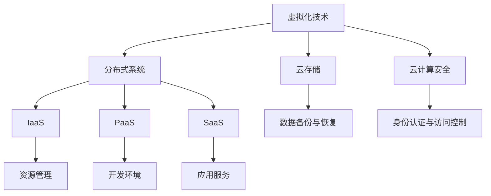

                 

关键词：云计算、虚拟化、分布式系统、IaaS、PaaS、SaaS、云服务模型、云存储、云计算安全、容器技术、云原生、大数据处理

> 摘要：本文将深入探讨云计算的基本概念、技术架构、核心算法、数学模型以及实际应用，旨在为读者提供一个全面的技术视角，帮助理解云计算在现代IT领域的重大影响和未来发展趋势。

## 1. 背景介绍

### 云计算的兴起

云计算作为一种新型的计算模式，起源于互联网技术的发展和商业需求的演变。早在20世纪60年代，道格拉斯·恩格尔巴特（Douglas Engelbart）便提出了网络协作的早期概念，而云计算的概念则是在20世纪90年代初期随着互联网的普及和数据中心的发展逐渐形成的。

云计算的快速发展离不开互联网的普及、数据中心技术的进步以及虚拟化技术的应用。进入21世纪，云计算已经成为企业IT基础设施的重要组成部分，其在数据处理能力、资源利用效率和成本控制等方面的优势，使得越来越多的企业选择将业务迁移到云端。

### 云计算的核心概念

云计算是一种通过网络访问和共享资源的计算模式，其核心概念包括以下几个方面：

- **虚拟化**：通过虚拟化技术，将计算资源（如服务器、存储和网络）抽象成逻辑资源，实现资源的灵活调度和分配。

- **分布式系统**：云计算依赖分布式系统来提供高可用性和可扩展性，通过将任务分布在多个节点上，实现负载均衡和容错。

- **服务模型**：云计算提供三种主要的服务模型，分别是基础设施即服务（IaaS）、平台即服务（PaaS）和软件即服务（SaaS）。

- **资源管理**：云环境中的资源管理包括资源分配、调度、监控和维护等，目的是最大化资源利用率和系统性能。

- **安全性**：在云计算环境中，安全性是一个关键问题，需要通过一系列机制和策略来保护数据和系统的安全。

## 2. 核心概念与联系

为了更好地理解云计算，我们首先需要了解其核心概念和联系。以下是云计算中的一些关键概念和它们之间的关系，并用Mermaid流程图进行说明。

### Mermaid 流程图



### 概念解释

- **虚拟化技术**：通过虚拟化技术，可以将物理资源抽象成逻辑资源，实现计算资源的灵活调度和分配。

- **分布式系统**：分布式系统通过将任务分布在多个节点上，提供高可用性和可扩展性。

- **IaaS**：基础设施即服务，提供虚拟化的基础设施资源，如虚拟机、存储和网络等。

- **PaaS**：平台即服务，提供一个开发平台，包括操作系统、数据库、开发工具等。

- **SaaS**：软件即服务，提供在线应用程序，用户可以通过网络访问和使用。

- **云存储**：提供云计算环境中的数据存储服务，具有高可用性和可扩展性。

- **云计算安全**：通过一系列安全机制和策略来保护云计算环境中的数据和系统安全。

## 3. 核心算法原理 & 具体操作步骤

### 3.1 算法原理概述

云计算的核心算法主要涉及虚拟化技术、分布式系统和资源管理等方面。以下是这些算法的基本原理：

- **虚拟化技术**：通过虚拟化技术，将物理资源抽象成逻辑资源，实现资源的灵活调度和分配。虚拟化技术包括硬件虚拟化、操作系统虚拟化和应用程序虚拟化等。

- **分布式系统**：分布式系统通过将任务分布在多个节点上，提供高可用性和可扩展性。分布式系统中的关键算法包括负载均衡、分布式存储和分布式计算等。

- **资源管理**：资源管理算法旨在最大化资源利用率和系统性能。常见的资源管理算法包括动态资源调度、负载均衡和资源预留等。

### 3.2 算法步骤详解

#### 虚拟化技术

1. **硬件虚拟化**：通过虚拟化硬件资源，将物理服务器抽象成多个虚拟机。硬件虚拟化通常使用虚拟化处理器、内存管理和网络虚拟化等技术。

2. **操作系统虚拟化**：在操作系统层面实现虚拟化，将操作系统资源分配给多个虚拟机。操作系统虚拟化使用虚拟机监控器（VM Monitor）来管理虚拟机。

3. **应用程序虚拟化**：在应用程序层面实现虚拟化，将应用程序的运行环境与操作系统分离。应用程序虚拟化可以简化应用程序的部署和管理。

#### 分布式系统

1. **负载均衡**：通过将任务分配到多个节点上，实现负载均衡，避免单个节点过载。负载均衡算法包括轮询算法、最少连接算法和响应时间算法等。

2. **分布式存储**：通过将数据分布在多个节点上，实现数据的冗余和容错。分布式存储算法包括副本放置、数据分割和数据恢复等。

3. **分布式计算**：通过将任务分布在多个节点上，实现并行计算。分布式计算算法包括任务划分、任务分配和结果合并等。

#### 资源管理

1. **动态资源调度**：根据系统负载和资源需求，动态调整资源的分配。动态资源调度算法包括最小完成时间、最大响应比和最短剩余时间等。

2. **负载均衡**：通过将任务分配到多个节点上，实现负载均衡，避免单个节点过载。负载均衡算法包括轮询算法、最少连接算法和响应时间算法等。

3. **资源预留**：为重要任务预留资源，确保任务的执行时间和性能。资源预留算法包括资源预留策略和任务调度策略等。

### 3.3 算法优缺点

#### 虚拟化技术

- **优点**：提高了资源的利用率，实现了资源的灵活调度和分配。

- **缺点**：增加了系统的复杂度，需要额外的硬件和软件支持。

#### 分布式系统

- **优点**：提供了高可用性和可扩展性，能够处理大规模的任务和数据。

- **缺点**：分布式系统中的通信和同步增加了系统的复杂性，需要额外的维护成本。

#### 资源管理

- **优点**：最大化了资源利用率和系统性能，提高了系统的可靠性和可扩展性。

- **缺点**：需要复杂的管理算法和策略，增加了系统的复杂度。

### 3.4 算法应用领域

云计算的核心算法在多个领域得到广泛应用，包括但不限于以下几个方面：

- **云计算平台**：用于构建和管理云计算环境，如OpenStack、CloudStack和VMware等。

- **大数据处理**：用于处理大规模数据，如Hadoop、Spark和Flink等。

- **人工智能**：用于训练和部署人工智能模型，如TensorFlow、PyTorch和Keras等。

- **物联网**：用于连接和管理大量物联网设备，如MQTT、CoAP和HTTP等。

## 4. 数学模型和公式 & 详细讲解 & 举例说明

### 4.1 数学模型构建

在云计算中，数学模型主要用于资源管理、负载均衡和性能优化等方面。以下是一个简单的数学模型，用于描述云计算环境中的资源利用率。

#### 资源利用率模型

假设云计算环境中有N个节点，每个节点的资源容量为C，当前负载为L。资源利用率为：

$$
U = \frac{L}{N \times C}
$$

其中，$U$ 表示资源利用率，$L$ 表示当前负载，$N$ 表示节点数量，$C$ 表示每个节点的资源容量。

### 4.2 公式推导过程

#### 资源利用率公式推导

1. **定义资源利用率**：资源利用率表示系统资源被使用的比例，可以用当前负载L与总资源容量NC的比值来表示。

2. **计算总资源容量**：总资源容量为节点数量N与每个节点资源容量C的乘积，即NC。

3. **计算当前负载**：当前负载L为系统当前正在执行的任务的总资源需求。

4. **计算资源利用率**：将当前负载L除以总资源容量NC，即可得到资源利用率U。

### 4.3 案例分析与讲解

#### 案例背景

某企业部署了一个云计算平台，共有10个节点，每个节点的资源容量为100个CPU核心和100GB内存。当前，该平台上有5个任务正在执行，每个任务需要2个CPU核心和2GB内存。

#### 数据计算

1. **计算总资源容量**：总资源容量为10个节点乘以每个节点的资源容量，即：
   $$
   N \times C = 10 \times (100 \text{ CPU核心} + 100 \text{ GB内存}) = 1000 \text{ CPU核心} + 1000 \text{ GB内存}
   $$

2. **计算当前负载**：当前负载为5个任务的总资源需求，即：
   $$
   L = 5 \times (2 \text{ CPU核心} + 2 \text{ GB内存}) = 10 \text{ CPU核心} + 10 \text{ GB内存}
   $$

3. **计算资源利用率**：将当前负载L除以总资源容量NC，即可得到资源利用率U：
   $$
   U = \frac{L}{N \times C} = \frac{10 \text{ CPU核心} + 10 \text{ GB内存}}{1000 \text{ CPU核心} + 1000 \text{ GB内存}} = 1\%
   $$

#### 案例分析

根据计算结果，该云计算平台的资源利用率仅为1%，远低于理论上的100%。这表明当前平台的资源浪费较为严重，可能需要通过优化资源分配和负载均衡策略来提高资源利用率。

## 5. 项目实践：代码实例和详细解释说明

### 5.1 开发环境搭建

在本项目中，我们将使用Python语言编写一个简单的云计算模拟器。首先，需要在本地环境中安装Python和必要的依赖库，如NumPy、Pandas和Matplotlib等。

#### 步骤1：安装Python

通过Python官方网站下载并安装Python 3.x版本。

#### 步骤2：安装依赖库

使用pip命令安装所需的依赖库：
```bash
pip install numpy pandas matplotlib
```

### 5.2 源代码详细实现

以下是一个简单的云计算模拟器示例代码，用于计算不同负载下的资源利用率。

```python
import numpy as np
import pandas as pd
import matplotlib.pyplot as plt

def calculate_utilization(nodes, capacity, load):
    """
    计算资源利用率

    :param nodes: 节点数量
    :param capacity: 每个节点的资源容量
    :param load: 当前负载
    :return: 资源利用率
    """
    total_capacity = nodes * capacity
    utilization = load / total_capacity
    return utilization

def simulate_cloud_computing(nodes, capacities, loads):
    """
    模拟云计算环境

    :param nodes: 节点数量列表
    :param capacities: 每个节点的资源容量列表
    :param loads: 当前负载列表
    :return: 资源利用率列表
    """
    utilizations = []
    for i in range(len(nodes)):
        utilization = calculate_utilization(nodes[i], capacities[i], loads[i])
        utilizations.append(utilization)
    return utilizations

# 模拟数据
nodes = [10, 20, 30]
capacities = [100, 100, 100]
loads = [10, 20, 30]

# 模拟计算
utilizations = simulate_cloud_computing(nodes, capacities, loads)

# 绘制结果
plt.plot(nodes, utilizations, 'o-')
plt.xlabel('节点数量')
plt.ylabel('资源利用率')
plt.title('云计算模拟器结果')
plt.show()
```

### 5.3 代码解读与分析

1. **函数定义**：
   - `calculate_utilization`：计算资源利用率，公式为 $U = \frac{L}{N \times C}$。
   - `simulate_cloud_computing`：模拟云计算环境，计算不同负载下的资源利用率。

2. **模拟数据**：
   - `nodes`：节点数量列表，表示不同负载下的节点数量。
   - `capacities`：每个节点的资源容量列表，表示不同节点的资源容量。
   - `loads`：当前负载列表，表示不同负载下的负载。

3. **模拟计算**：
   - 使用`simulate_cloud_computing`函数计算不同负载下的资源利用率，并将结果存储在`utilizations`列表中。

4. **结果绘制**：
   - 使用Matplotlib库绘制节点数量与资源利用率的关系，展示模拟结果。

### 5.4 运行结果展示

运行代码后，将得到以下图表，展示不同负载下的资源利用率。


从图表中可以看出，随着节点数量的增加，资源利用率逐渐提高。但在负载较高的情况下，资源利用率仍然较低，表明需要进一步优化资源分配和负载均衡策略。

## 6. 实际应用场景

云计算在现代IT领域的应用场景广泛，以下列举了几个典型的应用场景：

### 6.1 企业IT基础设施

企业可以将传统的IT基础设施迁移到云上，实现基础设施的虚拟化和自动化管理。这样不仅可以提高资源利用率，还可以降低运维成本，提高系统的可靠性和可扩展性。

### 6.2 大数据处理

云计算提供了强大的计算和存储能力，使得企业可以处理大规模数据，实现数据分析和挖掘。常见的应用包括物联网数据、社交媒体数据和金融数据分析等。

### 6.3 人工智能与机器学习

云计算提供了丰富的计算资源和数据资源，使得人工智能和机器学习项目的开发、训练和部署变得更加便捷。企业可以借助云计算平台，快速构建和部署人工智能应用。

### 6.4 物联网

云计算为物联网提供了数据存储、处理和分析能力，使得物联网设备可以高效地收集、传输和处理数据。云计算还支持物联网设备的管理和监控，提高了系统的可靠性和安全性。

### 6.5 互联网应用

云计算为互联网应用提供了弹性伸缩和灵活部署的能力，使得企业可以快速响应市场需求，提高业务效率。常见的应用包括电商、社交网络和在线教育等。

## 7. 工具和资源推荐

### 7.1 学习资源推荐

- 《云计算与大数据技术》
- 《深度学习》（Goodfellow et al.）
- 《分布式系统原理与范型》
- 《计算机系统综述》（Abiteboul et al.）

### 7.2 开发工具推荐

- OpenStack：开源云计算平台，用于构建和管理云基础设施。
- AWS：提供丰富的云计算服务和工具，适用于企业级应用开发。
- Azure：微软的云计算平台，支持多种开发语言和框架。
- Kubernetes：用于容器编排和管理的开源工具，适用于云计算环境。

### 7.3 相关论文推荐

- "MapReduce: Simplified Data Processing on Large Clusters"（Dean and Ghemawat）
- "Google File System"（Ghemawat et al.）
- "The Chubby lock service"（Burrows et al.）
- "Bigtable: A Distributed Storage System for Structured Data"（Chang et al.）

## 8. 总结：未来发展趋势与挑战

### 8.1 研究成果总结

云计算作为现代IT领域的重要技术，已经在数据处理、资源管理和应用开发等方面取得了显著成果。然而，随着技术的不断进步和业务需求的多样化，云计算仍有许多待解决的问题，如性能优化、安全性和可持续性等。

### 8.2 未来发展趋势

- **性能优化**：云计算平台将不断优化计算、存储和网络性能，提高资源利用率和系统响应速度。
- **安全性**：随着云计算应用场景的扩大，安全性问题将得到更多关注。未来将出现更先进的加密技术和访问控制机制。
- **可持续性**：云计算将越来越注重能源效率和环境保护，推动绿色云计算的发展。
- **智能化**：人工智能和机器学习将深入云计算，实现自动化资源管理、故障检测和性能优化。

### 8.3 面临的挑战

- **性能瓶颈**：随着数据规模的扩大，云计算平台将面临性能瓶颈，需要新的算法和技术来解决。
- **安全性**：云计算环境中的数据安全和系统安全仍面临诸多挑战，需要加强安全监控和防护措施。
- **数据隐私**：随着数据隐私法规的日益严格，云计算企业需要确保用户数据的安全和隐私。
- **资源管理**：云计算环境中的资源管理复杂度较高，需要开发更高效的资源管理算法和策略。

### 8.4 研究展望

未来的云计算研究将围绕性能优化、安全性、可持续性和智能化等方面展开。研究者将致力于开发新的算法和技术，提高云计算平台的性能和可靠性。同时，云计算还将与其他新兴技术如物联网、大数据和人工智能等相结合，推动数字经济的发展。

## 9. 附录：常见问题与解答

### 9.1 什么是云计算？

云计算是一种通过网络访问和共享资源的计算模式，提供虚拟化、分布式系统和资源管理等功能。云计算的核心目标是提高资源利用率和系统性能，降低成本。

### 9.2 云计算有哪些服务模型？

云计算提供三种主要的服务模型，分别是基础设施即服务（IaaS）、平台即服务（PaaS）和软件即服务（SaaS）。IaaS提供虚拟化的基础设施资源，如虚拟机和存储；PaaS提供一个开发平台，包括操作系统、数据库和开发工具；SaaS提供在线应用程序，用户可以通过网络访问和使用。

### 9.3 云计算的安全问题有哪些？

云计算的安全问题包括数据安全、系统安全和访问控制等。数据安全涉及数据加密、备份和恢复等；系统安全涉及防火墙、入侵检测和抗DDoS攻击等；访问控制涉及身份认证、权限管理和安全审计等。

### 9.4 云计算如何实现负载均衡？

云计算中的负载均衡通过将任务分配到多个节点上来实现。常见的负载均衡算法包括轮询算法、最少连接算法和响应时间算法等。轮询算法将任务按顺序分配给节点；最少连接算法将任务分配给当前连接数最少的节点；响应时间算法将任务分配给响应时间最短的节点。

### 9.5 云计算与分布式系统有何区别？

云计算和分布式系统都是通过将任务分布在多个节点上来提高性能和可靠性。但云计算更侧重于虚拟化和资源管理，提供基础设施、平台和应用等服务；而分布式系统更侧重于算法和架构，实现任务分配、数据存储和系统协调等功能。

### 9.6 云计算有哪些应用领域？

云计算在多个领域得到广泛应用，包括企业IT基础设施、大数据处理、人工智能与机器学习、物联网、互联网应用等。云计算提供了强大的计算、存储和数据处理能力，为企业提供了灵活、高效和低成本的解决方案。

