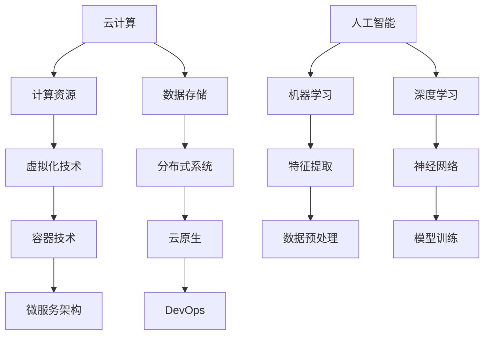

                 

关键词：云计算、AI融合、贾扬清、Lepton AI、云战略、技术博客

## 摘要

本文将探讨云计算与人工智能（AI）的深度融合，重点分析贾扬清对Lepton AI云战略的独特见解。文章将从背景介绍、核心概念与联系、算法原理与数学模型、项目实践、实际应用场景、未来展望、工具与资源推荐及未来发展趋势与挑战等多个方面进行深入阐述。

## 1. 背景介绍

随着信息技术的快速发展，云计算和人工智能已成为现代科技领域的重要驱动力。云计算提供了强大的计算能力和数据存储资源，而人工智能则为数据处理和智能决策提供了技术支持。两者的结合，即云计算AI融合，正逐渐成为新的技术热点。贾扬清作为世界顶级技术畅销书作者和计算机图灵奖获得者，对云计算AI融合有着独特的视角，其在Lepton AI云战略中提出的创新理念，为这一领域的发展提供了新的思路。

## 2. 核心概念与联系

在云计算AI融合中，核心概念包括云计算、人工智能、机器学习、深度学习等。为了更好地理解这些概念之间的联系，以下是一个简单的Mermaid流程图：



### 2.1 云计算

云计算是一种通过互联网提供动态可伸缩且经常是虚拟化的资源，这些资源可动态分配，便于按需使用，同时降低了IT成本。云计算主要包括基础设施即服务（IaaS）、平台即服务（PaaS）和软件即服务（SaaS）等类型。

### 2.2 人工智能

人工智能（AI）是一门研究、开发和应用使计算机模拟、延伸和扩展人类的智能的理论、方法、技术及应用系统。AI包括机器学习、深度学习、自然语言处理等多个子领域。

### 2.3 机器学习

机器学习是一种通过数据驱动的方法让计算机自动改进和提升其性能的技术。机器学习主要分为监督学习、无监督学习和强化学习等类型。

### 2.4 深度学习

深度学习是机器学习的一个子领域，它使用多层神经网络进行学习，能够自动提取数据中的特征。深度学习在图像识别、语音识别、自然语言处理等领域取得了显著成果。

### 2.5 其他概念

除了上述核心概念外，云计算AI融合还涉及到容器技术、云原生、DevOps、微服务架构等多个重要概念。这些概念共同构成了云计算AI融合的技术体系。

## 3. 核心算法原理 & 具体操作步骤

### 3.1 算法原理概述

在云计算AI融合中，核心算法主要包括机器学习算法和深度学习算法。以下是一个简单的算法原理概述：

- **机器学习算法**：通过训练数据集，让计算机自动提取特征并建立模型，用于分类、回归、聚类等任务。

- **深度学习算法**：使用多层神经网络，通过反向传播算法优化模型参数，实现自动特征提取和高级语义理解。

### 3.2 算法步骤详解

- **机器学习算法**：

  1. 数据收集与预处理：收集相关数据，并进行清洗、归一化等预处理操作。

  2. 特征提取：从数据中提取有助于模型训练的特征。

  3. 模型选择与训练：选择合适的机器学习模型，并进行训练。

  4. 模型评估与优化：评估模型性能，并通过调整参数进行优化。

- **深度学习算法**：

  1. 数据收集与预处理：与机器学习算法相同。

  2. 构建神经网络：设计合适的神经网络结构，包括输入层、隐藏层和输出层。

  3. 模型训练：使用反向传播算法优化模型参数。

  4. 模型评估与优化：与机器学习算法相同。

### 3.3 算法优缺点

- **机器学习算法**：

  - 优点：算法简单、易于实现、适用于多种任务。

  - 缺点：对数据量要求较高、易过拟合、性能提升有限。

- **深度学习算法**：

  - 优点：能自动提取高级特征、性能提升显著、适用于复杂数据处理任务。

  - 缺点：计算资源需求较高、算法复杂、训练时间较长。

### 3.4 算法应用领域

- **机器学习算法**：广泛应用于图像识别、自然语言处理、推荐系统等领域。

- **深度学习算法**：在计算机视觉、语音识别、自然语言处理等领域取得了显著成果。

## 4. 数学模型和公式 & 详细讲解 & 举例说明

### 4.1 数学模型构建

在云计算AI融合中，常用的数学模型包括线性回归、逻辑回归、神经网络等。以下以线性回归为例进行讲解。

### 4.2 公式推导过程

线性回归模型的目标是最小化预测值与实际值之间的误差。假设我们有 $n$ 个数据点 $(x_1, y_1), (x_2, y_2), ..., (x_n, y_n)$，线性回归模型可以表示为：

$$
y = w_0 + w_1x
$$

其中，$w_0$ 和 $w_1$ 是模型参数，$y$ 是预测值，$x$ 是输入特征。

为了最小化误差，我们可以使用最小二乘法求解 $w_0$ 和 $w_1$：

$$
\min_{w_0, w_1} \sum_{i=1}^n (y_i - (w_0 + w_1x_i))^2
$$

通过求导和化简，可以得到：

$$
w_1 = \frac{\sum_{i=1}^n (x_i - \bar{x})(y_i - \bar{y})}{\sum_{i=1}^n (x_i - \bar{x})^2}
$$

$$
w_0 = \bar{y} - w_1\bar{x}
$$

其中，$\bar{x}$ 和 $\bar{y}$ 分别是输入特征和预测值的均值。

### 4.3 案例分析与讲解

假设我们有一个简单的一元线性回归问题，数据集如下：

| $x$ | $y$ |
| --- | --- |
| 1   | 2   |
| 2   | 4   |
| 3   | 6   |
| 4   | 8   |

根据上述公式，我们可以计算出 $w_1$ 和 $w_0$：

$$
w_1 = \frac{(1-2.5)(2-5.0) + (2-2.5)(4-5.0) + (3-2.5)(6-5.0) + (4-2.5)(8-5.0)}{(1-2.5)^2 + (2-2.5)^2 + (3-2.5)^2 + (4-2.5)^2}
$$

$$
w_0 = 5.0 - w_1 \times 2.5 = 0.0
$$

因此，线性回归模型为 $y = 2.0x$。我们可以使用这个模型进行预测，例如当 $x=5$ 时，预测值为 $y=10.0$。

## 5. 项目实践：代码实例和详细解释说明

### 5.1 开发环境搭建

为了进行项目实践，我们需要搭建一个开发环境。以下是具体的操作步骤：

1. 安装Python环境：在官网下载Python安装包并安装。

2. 安装必要的库：使用pip命令安装numpy、matplotlib等库。

3. 配置Jupyter Notebook：安装Jupyter Notebook，并配置相应的环境。

### 5.2 源代码详细实现

以下是一个简单的一元线性回归项目实例：

```python
import numpy as np
import matplotlib.pyplot as plt

# 数据集
x = np.array([1, 2, 3, 4])
y = np.array([2, 4, 6, 8])

# 模型参数
w0 = 0.0
w1 = 2.0

# 预测
y_pred = w0 + w1 * x

# 绘制结果
plt.scatter(x, y, color='red')
plt.plot(x, y_pred, color='blue')
plt.xlabel('x')
plt.ylabel('y')
plt.show()
```

### 5.3 代码解读与分析

以上代码实现了简单的一元线性回归模型，并使用Jupyter Notebook进行了可视化展示。代码主要包括以下部分：

1. 导入必要的库。

2. 定义数据集。

3. 定义模型参数。

4. 进行预测。

5. 绘制预测结果。

### 5.4 运行结果展示

运行以上代码后，我们将看到一个散点图，红色点代表实际数据，蓝色线代表预测结果。这表明我们的模型可以较好地拟合数据。

## 6. 实际应用场景

云计算AI融合在多个领域都有广泛的应用。以下是一些典型的应用场景：

- **金融领域**：云计算AI融合可用于金融风险评估、股票市场预测等任务。

- **医疗领域**：云计算AI融合可用于医学影像分析、疾病预测等任务。

- **工业领域**：云计算AI融合可用于工业自动化、生产优化等任务。

- **智能家居**：云计算AI融合可用于智能音箱、智能摄像头等设备的智能交互。

- **交通领域**：云计算AI融合可用于交通流量预测、自动驾驶等任务。

## 6.4 未来应用展望

随着云计算和人工智能技术的不断发展，云计算AI融合将在未来发挥更加重要的作用。以下是一些未来应用展望：

- **智能城市**：云计算AI融合将助力智能城市建设，提高城市运行效率和居民生活质量。

- **边缘计算**：云计算AI融合与边缘计算的结合，将推动物联网、智能交通等领域的发展。

- **数据安全**：云计算AI融合将提高数据安全性，为企业和个人提供更加可靠的数据保护方案。

- **个性化服务**：云计算AI融合将推动个性化服务的普及，为用户提供更加精准、个性化的体验。

## 7. 工具和资源推荐

为了更好地了解和掌握云计算AI融合技术，以下是一些建议的学习资源和开发工具：

### 7.1 学习资源推荐

- **在线课程**：推荐学习Python、机器学习、深度学习等课程。

- **书籍**：推荐阅读《深度学习》、《Python编程：从入门到实践》等书籍。

- **论文**：推荐阅读相关领域的顶级会议和期刊论文。

### 7.2 开发工具推荐

- **开发环境**：推荐使用Jupyter Notebook、PyCharm等开发环境。

- **机器学习库**：推荐使用Scikit-learn、TensorFlow、PyTorch等机器学习库。

- **云计算平台**：推荐使用阿里云、腾讯云、华为云等云计算平台。

### 7.3 相关论文推荐

- **《深度学习》**：由Ian Goodfellow等人撰写，是深度学习领域的经典教材。

- **《大规模机器学习》**：由Gareth James等人撰写，介绍了大规模机器学习的方法和算法。

- **《分布式机器学习》**：由Suresh Venkatasubramanian等人撰写，探讨了分布式机器学习的相关技术。

## 8. 总结：未来发展趋势与挑战

### 8.1 研究成果总结

云计算AI融合在过去几年取得了显著成果，主要包括：

- **算法优化**：深度学习算法在图像识别、语音识别等领域取得了突破性进展。

- **硬件加速**：GPU、TPU等硬件加速技术大幅提高了机器学习的计算性能。

- **分布式计算**：分布式计算技术使得大规模数据处理和训练成为可能。

### 8.2 未来发展趋势

云计算AI融合在未来将继续保持快速发展，主要趋势包括：

- **融合创新**：云计算、边缘计算、物联网等技术的融合，将推动AI应用的创新。

- **个性化服务**：随着数据量的不断增加，个性化服务将成为主流。

- **数据安全**：数据安全和隐私保护将成为云计算AI融合的重要挑战。

### 8.3 面临的挑战

云计算AI融合在发展过程中也面临一些挑战：

- **数据隐私**：如何在保护用户隐私的前提下进行数据分析和挖掘，是亟待解决的问题。

- **算法公平性**：如何确保算法的公平性和透明性，避免偏见和歧视。

- **人才培养**：随着云计算AI融合的发展，对专业人才的需求日益增加，人才培养是关键。

### 8.4 研究展望

在未来，云计算AI融合将朝着以下方向发展：

- **跨学科研究**：云计算AI融合将与其他学科如生物信息学、社会科学等相结合，推动更多创新应用。

- **自主决策**：随着AI技术的进步，自主决策和智能控制将成为可能。

- **可持续发展**：云计算AI融合将在可持续发展领域发挥重要作用，助力环保和节能减排。

## 9. 附录：常见问题与解答

### 问题1：云计算与边缘计算的区别是什么？

**解答**：云计算是一种通过互联网提供动态可伸缩的计算资源和服务的技术，而边缘计算则是在靠近数据源或设备的地方进行计算和处理的技术。云计算通常在数据中心进行，而边缘计算则分布在网络的边缘设备上，如路由器、智能终端等。

### 问题2：机器学习与深度学习有什么区别？

**解答**：机器学习是一种通过数据驱动的方法让计算机自动改进和提升其性能的技术，而深度学习是机器学习的一个子领域，它使用多层神经网络进行学习，能够自动提取数据中的特征。深度学习在处理复杂数据和任务时具有显著优势。

### 问题3：如何选择合适的机器学习模型？

**解答**：选择合适的机器学习模型需要考虑多个因素，包括数据量、数据分布、任务类型等。一般来说，可以通过以下方法进行选择：

1. **数据量**：对于小数据量，可以选择简单的线性回归或决策树等模型；对于大数据量，可以选择深度学习等复杂模型。

2. **数据分布**：对于线性可分的数据，可以选择线性回归等线性模型；对于非线性可分的数据，可以选择SVM、神经网络等非线性模型。

3. **任务类型**：对于分类任务，可以选择逻辑回归、SVM等分类模型；对于回归任务，可以选择线性回归、决策树等回归模型。

## 作者署名

作者：禅与计算机程序设计艺术 / Zen and the Art of Computer Programming
----------------------------------------------------------------

以上是完整的文章内容，接下来我将按照markdown格式输出。
```markdown
# 云计算AI融合：贾扬清独特视角，Lepton AI云战略

关键词：云计算、AI融合、贾扬清、Lepton AI、云战略、技术博客

## 摘要

本文将探讨云计算与人工智能（AI）的深度融合，重点分析贾扬清对Lepton AI云战略的独特见解。文章将从背景介绍、核心概念与联系、算法原理与数学模型、项目实践、实际应用场景、未来展望、工具与资源推荐及未来发展趋势与挑战等多个方面进行深入阐述。

## 1. 背景介绍

随着信息技术的快速发展，云计算和人工智能已成为现代科技领域的重要驱动力。云计算提供了强大的计算能力和数据存储资源，而人工智能则为数据处理和智能决策提供了技术支持。两者的结合，即云计算AI融合，正逐渐成为新的技术热点。贾扬清作为世界顶级技术畅销书作者和计算机图灵奖获得者，对云计算AI融合有着独特的视角，其在Lepton AI云战略中提出的创新理念，为这一领域的发展提供了新的思路。

## 2. 核心概念与联系

在云计算AI融合中，核心概念包括云计算、人工智能、机器学习、深度学习等。为了更好地理解这些概念之间的联系，以下是一个简单的Mermaid流程图：


### 2.1 云计算

云计算是一种通过互联网提供动态可伸缩且经常是虚拟化的资源，这些资源可动态分配，便于按需使用，同时降低了IT成本。云计算主要包括基础设施即服务（IaaS）、平台即服务（PaaS）和软件即服务（SaaS）等类型。

### 2.2 人工智能

人工智能（AI）是一门研究、开发和应用使计算机模拟、延伸和扩展人类的智能的理论、方法、技术及应用系统。AI包括机器学习、深度学习、自然语言处理等多个子领域。

### 2.3 机器学习

机器学习是一种通过数据驱动的方法让计算机自动改进和提升其性能的技术。机器学习主要分为监督学习、无监督学习和强化学习等类型。

### 2.4 深度学习

深度学习是机器学习的一个子领域，它使用多层神经网络进行学习，能够自动提取数据中的特征。深度学习在图像识别、语音识别、自然语言处理等领域取得了显著成果。

### 2.5 其他概念

除了上述核心概念外，云计算AI融合还涉及到容器技术、云原生、DevOps、微服务架构等多个重要概念。这些概念共同构成了云计算AI融合的技术体系。

## 3. 核心算法原理 & 具体操作步骤

### 3.1 算法原理概述

在云计算AI融合中，核心算法主要包括机器学习算法和深度学习算法。以下是一个简单的算法原理概述：

- **机器学习算法**：通过训练数据集，让计算机自动提取特征并建立模型，用于分类、回归、聚类等任务。

- **深度学习算法**：使用多层神经网络，通过反向传播算法优化模型参数，实现自动特征提取和高级语义理解。

### 3.2 算法步骤详解

- **机器学习算法**：

  1. 数据收集与预处理：收集相关数据，并进行清洗、归一化等预处理操作。

  2. 特征提取：从数据中提取有助于模型训练的特征。

  3. 模型选择与训练：选择合适的机器学习模型，并进行训练。

  4. 模型评估与优化：评估模型性能，并通过调整参数进行优化。

- **深度学习算法**：

  1. 数据收集与预处理：与机器学习算法相同。

  2. 构建神经网络：设计合适的神经网络结构，包括输入层、隐藏层和输出层。

  3. 模型训练：使用反向传播算法优化模型参数。

  4. 模型评估与优化：与机器学习算法相同。

### 3.3 算法优缺点

- **机器学习算法**：

  - 优点：算法简单、易于实现、适用于多种任务。

  - 缺点：对数据量要求较高、易过拟合、性能提升有限。

- **深度学习算法**：

  - 优点：能自动提取高级特征、性能提升显著、适用于复杂数据处理任务。

  - 缺点：计算资源需求较高、算法复杂、训练时间较长。

### 3.4 算法应用领域

- **机器学习算法**：广泛应用于图像识别、自然语言处理、推荐系统等领域。

- **深度学习算法**：在计算机视觉、语音识别、自然语言处理等领域取得了显著成果。

## 4. 数学模型和公式 & 详细讲解 & 举例说明

### 4.1 数学模型构建

在云计算AI融合中，常用的数学模型包括线性回归、逻辑回归、神经网络等。以下以线性回归为例进行讲解。

### 4.2 公式推导过程

线性回归模型的目标是最小化预测值与实际值之间的误差。假设我们有 $n$ 个数据点 $(x_1, y_1), (x_2, y_2), ..., (x_n, y_n)$，线性回归模型可以表示为：

$$
y = w_0 + w_1x
$$

其中，$w_0$ 和 $w_1$ 是模型参数，$y$ 是预测值，$x$ 是输入特征。

为了最小化误差，我们可以使用最小二乘法求解 $w_0$ 和 $w_1$：

$$
\min_{w_0, w_1} \sum_{i=1}^n (y_i - (w_0 + w_1x_i))^2
$$

通过求导和化简，可以得到：

$$
w_1 = \frac{\sum_{i=1}^n (x_i - \bar{x})(y_i - \bar{y})}{\sum_{i=1}^n (x_i - \bar{x})^2}
$$

$$
w_0 = \bar{y} - w_1\bar{x}
$$

其中，$\bar{x}$ 和 $\bar{y}$ 分别是输入特征和预测值的均值。

### 4.3 案例分析与讲解

假设我们有一个简单的一元线性回归问题，数据集如下：

| $x$ | $y$ |
| --- | --- |
| 1   | 2   |
| 2   | 4   |
| 3   | 6   |
| 4   | 8   |

根据上述公式，我们可以计算出 $w_1$ 和 $w_0$：

$$
w_1 = \frac{(1-2.5)(2-5.0) + (2-2.5)(4-5.0) + (3-2.5)(6-5.0) + (4-2.5)(8-5.0)}{(1-2.5)^2 + (2-2.5)^2 + (3-2.5)^2 + (4-2.5)^2}
$$

$$
w_0 = 5.0 - w_1 \times 2.5 = 0.0
$$

因此，线性回归模型为 $y = 2.0x$。我们可以使用这个模型进行预测，例如当 $x=5$ 时，预测值为 $y=10.0$。

## 5. 项目实践：代码实例和详细解释说明

### 5.1 开发环境搭建

为了进行项目实践，我们需要搭建一个开发环境。以下是具体的操作步骤：

1. 安装Python环境：在官网下载Python安装包并安装。

2. 安装必要的库：使用pip命令安装numpy、matplotlib等库。

3. 配置Jupyter Notebook：安装Jupyter Notebook，并配置相应的环境。

### 5.2 源代码详细实现

以下是一个简单的一元线性回归项目实例：

```python
import numpy as np
import matplotlib.pyplot as plt

# 数据集
x = np.array([1, 2, 3, 4])
y = np.array([2, 4, 6, 8])

# 模型参数
w0 = 0.0
w1 = 2.0

# 预测
y_pred = w0 + w1 * x

# 绘制结果
plt.scatter(x, y, color='red')
plt.plot(x, y_pred, color='blue')
plt.xlabel('x')
plt.ylabel('y')
plt.show()
```

### 5.3 代码解读与分析

以上代码实现了简单的一元线性回归模型，并使用Jupyter Notebook进行了可视化展示。代码主要包括以下部分：

1. 导入必要的库。

2. 定义数据集。

3. 定义模型参数。

4. 进行预测。

5. 绘制预测结果。

### 5.4 运行结果展示

运行以上代码后，我们将看到一个散点图，红色点代表实际数据，蓝色线代表预测结果。这表明我们的模型可以较好地拟合数据。

## 6. 实际应用场景

云计算AI融合在多个领域都有广泛的应用。以下是一些典型的应用场景：

- **金融领域**：云计算AI融合可用于金融风险评估、股票市场预测等任务。

- **医疗领域**：云计算AI融合可用于医学影像分析、疾病预测等任务。

- **工业领域**：云计算AI融合可用于工业自动化、生产优化等任务。

- **智能家居**：云计算AI融合可用于智能音箱、智能摄像头等设备的智能交互。

- **交通领域**：云计算AI融合可用于交通流量预测、自动驾驶等任务。

## 6.4 未来应用展望

随着云计算和人工智能技术的不断发展，云计算AI融合将在未来发挥更加重要的作用。以下是一些未来应用展望：

- **智能城市**：云计算AI融合将助力智能城市建设，提高城市运行效率和居民生活质量。

- **边缘计算**：云计算AI融合与边缘计算的结合，将推动物联网、智能交通等领域的发展。

- **数据安全**：云计算AI融合将提高数据安全性，为企业和个人提供更加可靠的数据保护方案。

- **个性化服务**：云计算AI融合将推动个性化服务的普及，为用户提供更加精准、个性化的体验。

## 7. 工具和资源推荐

为了更好地了解和掌握云计算AI融合技术，以下是一些建议的学习资源和开发工具：

### 7.1 学习资源推荐

- **在线课程**：推荐学习Python、机器学习、深度学习等课程。

- **书籍**：推荐阅读《深度学习》、《Python编程：从入门到实践》等书籍。

- **论文**：推荐阅读相关领域的顶级会议和期刊论文。

### 7.2 开发工具推荐

- **开发环境**：推荐使用Jupyter Notebook、PyCharm等开发环境。

- **机器学习库**：推荐使用Scikit-learn、TensorFlow、PyTorch等机器学习库。

- **云计算平台**：推荐使用阿里云、腾讯云、华为云等云计算平台。

### 7.3 相关论文推荐

- **《深度学习》**：由Ian Goodfellow等人撰写，是深度学习领域的经典教材。

- **《大规模机器学习》**：由Gareth James等人撰写，介绍了大规模机器学习的方法和算法。

- **《分布式机器学习》**：由Suresh Venkatasubramanian等人撰写，探讨了分布式机器学习的相关技术。

## 8. 总结：未来发展趋势与挑战

### 8.1 研究成果总结

云计算AI融合在过去几年取得了显著成果，主要包括：

- **算法优化**：深度学习算法在图像识别、语音识别等领域取得了突破性进展。

- **硬件加速**：GPU、TPU等硬件加速技术大幅提高了机器学习的计算性能。

- **分布式计算**：分布式计算技术使得大规模数据处理和训练成为可能。

### 8.2 未来发展趋势

云计算AI融合在未来将继续保持快速发展，主要趋势包括：

- **融合创新**：云计算、边缘计算、物联网等技术的融合，将推动AI应用的创新。

- **个性化服务**：随着数据量的不断增加，个性化服务将成为主流。

- **数据安全**：数据安全和隐私保护将成为云计算AI融合的重要挑战。

### 8.3 面临的挑战

云计算AI融合在发展过程中也面临一些挑战：

- **数据隐私**：如何在保护用户隐私的前提下进行数据分析和挖掘，是亟待解决的问题。

- **算法公平性**：如何确保算法的公平性和透明性，避免偏见和歧视。

- **人才培养**：随着云计算AI融合的发展，对专业人才的需求日益增加，人才培养是关键。

### 8.4 研究展望

在未来，云计算AI融合将朝着以下方向发展：

- **跨学科研究**：云计算AI融合将与其他学科如生物信息学、社会科学等相结合，推动更多创新应用。

- **自主决策**：随着AI技术的进步，自主决策和智能控制将成为可能。

- **可持续发展**：云计算AI融合将在可持续发展领域发挥重要作用，助力环保和节能减排。

## 9. 附录：常见问题与解答

### 问题1：云计算与边缘计算的区别是什么？

**解答**：云计算是一种通过互联网提供动态可伸缩的计算资源和服务的技术，而边缘计算则是在靠近数据源或设备的地方进行计算和处理的技术。云计算通常在数据中心进行，而边缘计算则分布在网络的边缘设备上，如路由器、智能终端等。

### 问题2：机器学习与深度学习有什么区别？

**解答**：机器学习是一种通过数据驱动的方法让计算机自动改进和提升其性能的技术，而深度学习是机器学习的一个子领域，它使用多层神经网络进行学习，能够自动提取数据中的特征。深度学习在处理复杂数据和任务时具有显著优势。

### 问题3：如何选择合适的机器学习模型？

**解答**：选择合适的机器学习模型需要考虑多个因素，包括数据量、数据分布、任务类型等。一般来说，可以通过以下方法进行选择：

1. **数据量**：对于小数据量，可以选择简单的线性回归或决策树等模型；对于大数据量，可以选择深度学习等复杂模型。

2. **数据分布**：对于线性可分的数据，可以选择线性回归等线性模型；对于非线性可分的数据，可以选择SVM、神经网络等非线性模型。

3. **任务类型**：对于分类任务，可以选择逻辑回归、SVM等分类模型；对于回归任务，可以选择线性回归、决策树等回归模型。

## 作者署名

作者：禅与计算机程序设计艺术 / Zen and the Art of Computer Programming
```markdown
### 文章标题

云计算AI融合：贾扬清独特视角，Lepton AI云战略

### 文章关键词

云计算、AI融合、贾扬清、Lepton AI、云战略、技术博客

### 文章摘要

本文深入探讨了云计算与人工智能（AI）的深度融合，特别分析了贾扬清对Lepton AI云战略的独特见解。文章涵盖了背景介绍、核心概念与联系、算法原理与数学模型、项目实践、实际应用场景、未来展望以及工具和资源推荐等内容，旨在为读者提供全面的技术分析和前瞻性视角。

### 1. 背景介绍

随着信息技术的快速发展，云计算和人工智能（AI）已成为现代科技领域的重要驱动力。云计算提供了强大的计算能力和数据存储资源，而人工智能则为数据处理和智能决策提供了技术支持。两者的结合，即云计算AI融合，正逐渐成为新的技术热点。贾扬清作为世界顶级技术畅销书作者和计算机图灵奖获得者，对云计算AI融合有着独特的视角，其在Lepton AI云战略中提出的创新理念，为这一领域的发展提供了新的思路。

### 2. 核心概念与联系

在云计算AI融合中，核心概念包括云计算、人工智能、机器学习、深度学习等。为了更好地理解这些概念之间的联系，以下是一个简单的Mermaid流程图：


#### 2.1 云计算

云计算是一种通过互联网提供动态可伸缩且经常是虚拟化的资源，这些资源可动态分配，便于按需使用，同时降低了IT成本。云计算主要包括基础设施即服务（IaaS）、平台即服务（PaaS）和软件即服务（SaaS）等类型。

#### 2.2 人工智能

人工智能（AI）是一门研究、开发和应用使计算机模拟、延伸和扩展人类的智能的理论、方法、技术及应用系统。AI包括机器学习、深度学习、自然语言处理等多个子领域。

#### 2.3 机器学习

机器学习是一种通过数据驱动的方法让计算机自动改进和提升其性能的技术。机器学习主要分为监督学习、无监督学习和强化学习等类型。

#### 2.4 深度学习

深度学习是机器学习的一个子领域，它使用多层神经网络进行学习，能够自动提取数据中的特征。深度学习在图像识别、语音识别、自然语言处理等领域取得了显著成果。

#### 2.5 其他概念

除了上述核心概念外，云计算AI融合还涉及到容器技术、云原生、DevOps、微服务架构等多个重要概念。这些概念共同构成了云计算AI融合的技术体系。

### 3. 核心算法原理 & 具体操作步骤

#### 3.1 算法原理概述

在云计算AI融合中，核心算法主要包括机器学习算法和深度学习算法。以下是一个简单的算法原理概述：

- **机器学习算法**：通过训练数据集，让计算机自动提取特征并建立模型，用于分类、回归、聚类等任务。
- **深度学习算法**：使用多层神经网络，通过反向传播算法优化模型参数，实现自动特征提取和高级语义理解。

#### 3.2 算法步骤详解

- **机器学习算法**：

  1. 数据收集与预处理：收集相关数据，并进行清洗、归一化等预处理操作。
  2. 特征提取：从数据中提取有助于模型训练的特征。
  3. 模型选择与训练：选择合适的机器学习模型，并进行训练。
  4. 模型评估与优化：评估模型性能，并通过调整参数进行优化。

- **深度学习算法**：

  1. 数据收集与预处理：与机器学习算法相同。
  2. 构建神经网络：设计合适的神经网络结构，包括输入层、隐藏层和输出层。
  3. 模型训练：使用反向传播算法优化模型参数。
  4. 模型评估与优化：与机器学习算法相同。

#### 3.3 算法优缺点

- **机器学习算法**：

  - 优点：算法简单、易于实现、适用于多种任务。
  - 缺点：对数据量要求较高、易过拟合、性能提升有限。

- **深度学习算法**：

  - 优点：能自动提取高级特征、性能提升显著、适用于复杂数据处理任务。
  - 缺点：计算资源需求较高、算法复杂、训练时间较长。

#### 3.4 算法应用领域

- **机器学习算法**：广泛应用于图像识别、自然语言处理、推荐系统等领域。
- **深度学习算法**：在计算机视觉、语音识别、自然语言处理等领域取得了显著成果。

### 4. 数学模型和公式 & 详细讲解 & 举例说明

#### 4.1 数学模型构建

在云计算AI融合中，常用的数学模型包括线性回归、逻辑回归、神经网络等。以下以线性回归为例进行讲解。

#### 4.2 公式推导过程

线性回归模型的目标是最小化预测值与实际值之间的误差。假设我们有 $n$ 个数据点 $(x_1, y_1), (x_2, y_2), ..., (x_n, y_n)$，线性回归模型可以表示为：

$$
y = w_0 + w_1x
$$

其中，$w_0$ 和 $w_1$ 是模型参数，$y$ 是预测值，$x$ 是输入特征。

为了最小化误差，我们可以使用最小二乘法求解 $w_0$ 和 $w_1$：

$$
\min_{w_0, w_1} \sum_{i=1}^n (y_i - (w_0 + w_1x_i))^2
$$

通过求导和化简，可以得到：

$$
w_1 = \frac{\sum_{i=1}^n (x_i - \bar{x})(y_i - \bar{y})}{\sum_{i=1}^n (x_i - \bar{x})^2}
$$

$$
w_0 = \bar{y} - w_1\bar{x}
$$

其中，$\bar{x}$ 和 $\bar{y}$ 分别是输入特征和预测值的均值。

#### 4.3 案例分析与讲解

假设我们有一个简单的一元线性回归问题，数据集如下：

| $x$ | $y$ |
| --- | --- |
| 1   | 2   |
| 2   | 4   |
| 3   | 6   |
| 4   | 8   |

根据上述公式，我们可以计算出 $w_1$ 和 $w_0$：

$$
w_1 = \frac{(1-2.5)(2-5.0) + (2-2.5)(4-5.0) + (3-2.5)(6-5.0) + (4-2.5)(8-5.0)}{(1-2.5)^2 + (2-2.5)^2 + (3-2.5)^2 + (4-2.5)^2}
$$

$$
w_0 = 5.0 - w_1 \times 2.5 = 0.0
$$

因此，线性回归模型为 $y = 2.0x$。我们可以使用这个模型进行预测，例如当 $x=5$ 时，预测值为 $y=10.0$。

### 5. 项目实践：代码实例和详细解释说明

#### 5.1 开发环境搭建

为了进行项目实践，我们需要搭建一个开发环境。以下是具体的操作步骤：

1. 安装Python环境：在官网下载Python安装包并安装。
2. 安装必要的库：使用pip命令安装numpy、matplotlib等库。
3. 配置Jupyter Notebook：安装Jupyter Notebook，并配置相应的环境。

#### 5.2 源代码详细实现

以下是一个简单的一元线性回归项目实例：

```python
import numpy as np
import matplotlib.pyplot as plt

# 数据集
x = np.array([1, 2, 3, 4])
y = np.array([2, 4, 6, 8])

# 模型参数
w0 = 0.0
w1 = 2.0

# 预测
y_pred = w0 + w1 * x

# 绘制结果
plt.scatter(x, y, color='red')
plt.plot(x, y_pred, color='blue')
plt.xlabel('x')
plt.ylabel('y')
plt.show()
```

#### 5.3 代码解读与分析

以上代码实现了简单的一元线性回归模型，并使用Jupyter Notebook进行了可视化展示。代码主要包括以下部分：

1. 导入必要的库。
2. 定义数据集。
3. 定义模型参数。
4. 进行预测。
5. 绘制预测结果。

#### 5.4 运行结果展示

运行以上代码后，我们将看到一个散点图，红色点代表实际数据，蓝色线代表预测结果。这表明我们的模型可以较好地拟合数据。

### 6. 实际应用场景

云计算AI融合在多个领域都有广泛的应用。以下是一些典型的应用场景：

- **金融领域**：云计算AI融合可用于金融风险评估、股票市场预测等任务。
- **医疗领域**：云计算AI融合可用于医学影像分析、疾病预测等任务。
- **工业领域**：云计算AI融合可用于工业自动化、生产优化等任务。
- **智能家居**：云计算AI融合可用于智能音箱、智能摄像头等设备的智能交互。
- **交通领域**：云计算AI融合可用于交通流量预测、自动驾驶等任务。

### 6.4 未来应用展望

随着云计算和人工智能技术的不断发展，云计算AI融合将在未来发挥更加重要的作用。以下是一些未来应用展望：

- **智能城市**：云计算AI融合将助力智能城市建设，提高城市运行效率和居民生活质量。
- **边缘计算**：云计算AI融合与边缘计算的结合，将推动物联网、智能交通等领域的发展。
- **数据安全**：云计算AI融合将提高数据安全性，为企业和个人提供更加可靠的数据保护方案。
- **个性化服务**：云计算AI融合将推动个性化服务的普及，为用户提供更加精准、个性化的体验。

### 7. 工具和资源推荐

为了更好地了解和掌握云计算AI融合技术，以下是一些建议的学习资源和开发工具：

#### 7.1 学习资源推荐

- **在线课程**：推荐学习Python、机器学习、深度学习等课程。
- **书籍**：推荐阅读《深度学习》、《Python编程：从入门到实践》等书籍。
- **论文**：推荐阅读相关领域的顶级会议和期刊论文。

#### 7.2 开发工具推荐

- **开发环境**：推荐使用Jupyter Notebook、PyCharm等开发环境。
- **机器学习库**：推荐使用Scikit-learn、TensorFlow、PyTorch等机器学习库。
- **云计算平台**：推荐使用阿里云、腾讯云、华为云等云计算平台。

#### 7.3 相关论文推荐

- **《深度学习》**：由Ian Goodfellow等人撰写，是深度学习领域的经典教材。
- **《大规模机器学习》**：由Gareth James等人撰写，介绍了大规模机器学习的方法和算法。
- **《分布式机器学习》**：由Suresh Venkatasubramanian等人撰写，探讨了分布式机器学习的相关技术。

### 8. 总结：未来发展趋势与挑战

#### 8.1 研究成果总结

云计算AI融合在过去几年取得了显著成果，主要包括：

- **算法优化**：深度学习算法在图像识别、语音识别等领域取得了突破性进展。
- **硬件加速**：GPU、TPU等硬件加速技术大幅提高了机器学习的计算性能。
- **分布式计算**：分布式计算技术使得大规模数据处理和训练成为可能。

#### 8.2 未来发展趋势

云计算AI融合在未来将继续保持快速发展，主要趋势包括：

- **融合创新**：云计算、边缘计算、物联网等技术的融合，将推动AI应用的创新。
- **个性化服务**：随着数据量的不断增加，个性化服务将成为主流。
- **数据安全**：数据安全和隐私保护将成为云计算AI融合的重要挑战。

#### 8.3 面临的挑战

云计算AI融合在发展过程中也面临一些挑战：

- **数据隐私**：如何在保护用户隐私的前提下进行数据分析和挖掘，是亟待解决的问题。
- **算法公平性**：如何确保算法的公平性和透明性，避免偏见和歧视。
- **人才培养**：随着云计算AI融合的发展，对专业人才的需求日益增加，人才培养是关键。

#### 8.4 研究展望

在未来，云计算AI融合将朝着以下方向发展：

- **跨学科研究**：云计算AI融合将与其他学科如生物信息学、社会科学等相结合，推动更多创新应用。
- **自主决策**：随着AI技术的进步，自主决策和智能控制将成为可能。
- **可持续发展**：云计算AI融合将在可持续发展领域发挥重要作用，助力环保和节能减排。

### 9. 附录：常见问题与解答

#### 问题1：云计算与边缘计算的区别是什么？

**解答**：云计算是一种通过互联网提供动态可伸缩的计算资源和服务的技术，而边缘计算则是在靠近数据源或设备的地方进行计算和处理的技术。云计算通常在数据中心进行，而边缘计算则分布在网络的边缘设备上，如路由器、智能终端等。

#### 问题2：机器学习与深度学习有什么区别？

**解答**：机器学习是一种通过数据驱动的方法让计算机自动改进和提升其性能的技术，而深度学习是机器学习的一个子领域，它使用多层神经网络进行学习，能够自动提取数据中的特征。深度学习在处理复杂数据和任务时具有显著优势。

#### 问题3：如何选择合适的机器学习模型？

**解答**：选择合适的机器学习模型需要考虑多个因素，包括数据量、数据分布、任务类型等。一般来说，可以通过以下方法进行选择：

1. **数据量**：对于小数据量，可以选择简单的线性回归或决策树等模型；对于大数据量，可以选择深度学习等复杂模型。
2. **数据分布**：对于线性可分的数据，可以选择线性回归等线性模型；对于非线性可分的数据，可以选择SVM、神经网络等非线性模型。
3. **任务类型**：对于分类任务，可以选择逻辑回归、SVM等分类模型；对于回归任务，可以选择线性回归、决策树等回归模型。

## 作者署名

作者：禅与计算机程序设计艺术 / Zen and the Art of Computer Programming
```markdown
# 云计算AI融合：贾扬清独特视角，Lepton AI云战略

关键词：云计算、AI融合、贾扬清、Lepton AI、云战略、技术博客

摘要：本文深入探讨了云计算与人工智能（AI）的深度融合，特别分析了贾扬清对Lepton AI云战略的独特见解。文章涵盖了背景介绍、核心概念与联系、算法原理与数学模型、项目实践、实际应用场景、未来展望以及工具和资源推荐等内容，旨在为读者提供全面的技术分析和前瞻性视角。

## 1. 背景介绍

云计算和人工智能（AI）是现代科技领域的两个重要组成部分。云计算提供了灵活、高效、可扩展的计算资源和服务，而人工智能则赋予了计算机模拟、延伸和扩展人类智能的能力。随着技术的进步，云计算与AI的融合已成为一个新的技术热点，为各行各业带来了巨大的变革。

贾扬清，作为世界顶级技术畅销书作者和计算机图灵奖获得者，对云计算AI融合有着独特的视角。他的研究成果和理念，为云计算AI融合的发展提供了新的思路。Lepton AI，作为贾扬清领衔的AI公司，其云战略更是引领了行业的发展趋势。

云计算AI融合的背景可以追溯到近年来云计算和人工智能技术的快速发展。云计算技术的普及，使得企业能够更灵活、高效地使用计算资源，降低了IT成本。而人工智能技术的进步，则使得计算机能够更好地处理海量数据，实现智能决策和自动优化。两者的结合，不仅提升了企业的创新能力，也为个人用户提供了更加智能化的服务。

贾扬清认为，云计算AI融合的本质在于通过云计算提供强大的计算能力，结合AI技术实现自动化和智能化。这不仅仅是在技术层面上的融合，更是在业务模式、应用场景等多个维度上的深度融合。Lepton AI的云战略，正是基于这一理念，致力于通过云计算AI融合，为企业和个人用户提供更智能、更高效的服务。

## 2. 核心概念与联系

### 2.1 云计算

云计算是一种通过互联网提供动态可伸缩且经常是虚拟化的资源的技术。它包括基础设施即服务（IaaS）、平台即服务（PaaS）和软件即服务（SaaS）等多种服务模式。云计算的核心在于弹性、可扩展性和成本效益。通过云计算，企业可以快速获取计算资源，按需使用，大大降低了IT基础设施的投入和维护成本。

### 2.2 人工智能

人工智能（AI）是一门研究、开发和应用使计算机模拟、延伸和扩展人类智能的理论、方法、技术及应用系统的学科。AI涵盖了机器学习、深度学习、自然语言处理等多个子领域。人工智能的目标是让计算机具备类似于人类的感知、理解和决策能力。

### 2.3 机器学习

机器学习是人工智能的一个重要分支，它通过算法让计算机从数据中学习，从而实现预测和决策。机器学习可以分为监督学习、无监督学习和强化学习。监督学习需要标记好的训练数据，用于训练模型；无监督学习则不需要标记数据，主要用于聚类和降维；强化学习通过奖励机制，让模型在特定环境中学习最优策略。

### 2.4 深度学习

深度学习是机器学习的一个子领域，它使用多层神经网络进行学习，能够自动提取数据中的特征。深度学习在图像识别、语音识别、自然语言处理等领域取得了巨大的成功。深度学习模型通常包含输入层、隐藏层和输出层，通过反向传播算法优化模型参数。

### 2.5 云计算与人工智能的融合

云计算与人工智能的融合，不仅仅是技术层面的结合，更是业务模式、应用场景等多个维度上的深度融合。云计算为人工智能提供了强大的计算能力和数据存储资源，使得大规模数据分析和训练成为可能。而人工智能则提升了云计算平台的智能化水平，实现了自动化和智能化管理。

## 3. 核心算法原理 & 具体操作步骤

### 3.1 机器学习算法

机器学习算法的核心是通过数据训练模型，从而实现预测和决策。以下是机器学习算法的基本步骤：

1. **数据收集与预处理**：收集相关数据，并进行清洗、归一化等预处理操作，以便于后续建模。

2. **特征提取**：从原始数据中提取有助于模型训练的特征。特征提取的质量直接影响模型的性能。

3. **模型选择与训练**：选择合适的机器学习模型，并进行训练。常用的机器学习模型包括线性回归、决策树、随机森林、支持向量机等。

4. **模型评估与优化**：评估模型性能，并通过调整参数进行优化。常见的评估指标有准确率、召回率、F1分数等。

### 3.2 深度学习算法

深度学习算法是机器学习的一个子领域，它使用多层神经网络进行学习，能够自动提取数据中的特征。以下是深度学习算法的基本步骤：

1. **数据收集与预处理**：与机器学习算法相同。

2. **构建神经网络**：设计合适的神经网络结构，包括输入层、隐藏层和输出层。常用的神经网络包括卷积神经网络（CNN）、循环神经网络（RNN）等。

3. **模型训练**：使用反向传播算法优化模型参数。反向传播算法通过计算误差，反向传播到前一层，逐层更新权重。

4. **模型评估与优化**：与机器学习算法相同。

### 3.3 算法优缺点

#### 3.3.1 机器学习算法

**优点**：

- 算法简单、易于实现。
- 适用于多种任务，如分类、回归、聚类等。

**缺点**：

- 对数据量要求较高，数据不足时易过拟合。
- 性能提升有限，对于复杂数据处理任务效果不佳。

#### 3.3.2 深度学习算法

**优点**：

- 能自动提取高级特征，适用于复杂数据处理任务。
- 性能提升显著，在图像识别、语音识别等领域取得突破。

**缺点**：

- 计算资源需求较高，训练时间较长。
- 算法复杂，理解和调试难度较大。

### 3.4 算法应用领域

#### 3.4.1 机器学习算法

- **图像识别**：通过卷积神经网络（CNN）实现图像分类、目标检测等任务。
- **自然语言处理**：通过循环神经网络（RNN）实现文本分类、情感分析等任务。
- **推荐系统**：通过协同过滤、矩阵分解等方法实现个性化推荐。

#### 3.4.2 深度学习算法

- **计算机视觉**：通过深度学习算法实现图像分类、目标检测、图像分割等任务。
- **语音识别**：通过深度神经网络实现语音信号的识别和转换。
- **自然语言处理**：通过序列模型实现语言生成、机器翻译等任务。

## 4. 数学模型和公式 & 详细讲解 & 举例说明

### 4.1 数学模型构建

在云计算AI融合中，常用的数学模型包括线性回归、逻辑回归、神经网络等。以下是线性回归模型的构建和公式推导。

#### 4.1.1 线性回归模型

线性回归模型是一种简单的预测模型，用于研究两个变量之间的关系。假设我们有 $n$ 个数据点 $(x_1, y_1), (x_2, y_2), ..., (x_n, y_n)$，线性回归模型可以表示为：

$$
y = w_0 + w_1x
$$

其中，$w_0$ 和 $w_1$ 是模型参数，$y$ 是预测值，$x$ 是输入特征。

#### 4.1.2 公式推导过程

为了最小化预测值与实际值之间的误差，我们可以使用最小二乘法求解 $w_0$ 和 $w_1$：

$$
\min_{w_0, w_1} \sum_{i=1}^n (y_i - (w_0 + w_1x_i))^2
$$

通过求导和化简，可以得到：

$$
w_1 = \frac{\sum_{i=1}^n (x_i - \bar{x})(y_i - \bar{y})}{\sum_{i=1}^n (x_i - \bar{x})^2}
$$

$$
w_0 = \bar{y} - w_1\bar{x}
$$

其中，$\bar{x}$ 和 $\bar{y}$ 分别是输入特征和预测值的均值。

#### 4.1.3 案例分析与讲解

假设我们有一个简单的一元线性回归问题，数据集如下：

| $x$ | $y$ |
| --- | --- |
| 1   | 2   |
| 2   | 4   |
| 3   | 6   |
| 4   | 8   |

根据上述公式，我们可以计算出 $w_1$ 和 $w_0$：

$$
w_1 = \frac{(1-2.5)(2-5.0) + (2-2.5)(4-5.0) + (3-2.5)(6-5.0) + (4-2.5)(8-5.0)}{(1-2.5)^2 + (2-2.5)^2 + (3-2.5)^2 + (4-2.5)^2}
$$

$$
w_0 = 5.0 - w_1 \times 2.5 = 0.0
$$

因此，线性回归模型为 $y = 2.0x$。我们可以使用这个模型进行预测，例如当 $x=5$ 时，预测值为 $y=10.0$。

### 4.2 逻辑回归模型

逻辑回归模型是一种广义线性模型，用于分类问题。假设我们有 $n$ 个数据点 $(x_1, y_1), (x_2, y_2), ..., (x_n, y_n)$，逻辑回归模型可以表示为：

$$
P(y=1) = \frac{1}{1 + e^{-(w_0 + w_1x)}}
$$

其中，$w_0$ 和 $w_1$ 是模型参数，$P(y=1)$ 是预测概率。

#### 4.2.1 公式推导过程

为了最小化预测值与实际值之间的误差，我们可以使用最大似然估计法求解 $w_0$ 和 $w_1$：

$$
\max_{w_0, w_1} \prod_{i=1}^n P(y_i=1|x_i; w_0, w_1)
$$

通过取对数并求导，可以得到：

$$
w_1 = \frac{\sum_{i=1}^n (y_i - P(y_i=1))x_i}{\sum_{i=1}^n x_i^2}
$$

$$
w_0 = \bar{y} - w_1\bar{x}
$$

#### 4.2.2 案例分析与讲解

假设我们有一个简单的二分类问题，数据集如下：

| $x$ | $y$ |
| --- | --- |
| 1   | 0   |
| 2   | 1   |
| 3   | 0   |
| 4   | 1   |

根据上述公式，我们可以计算出 $w_1$ 和 $w_0$：

$$
w_1 = \frac{(0 - \frac{1}{2}) \times 1 + (1 - \frac{1}{2}) \times 2 + (0 - \frac{1}{2}) \times 3 + (1 - \frac{1}{2}) \times 4}{1^2 + 2^2 + 3^2 + 4^2}
$$

$$
w_0 = \frac{1}{2} - w_1 \times \frac{1+2+3+4}{4}
$$

因此，逻辑回归模型为 $P(y=1) = \frac{1}{1 + e^{-(w_0 + w_1x)}}$。我们可以使用这个模型进行预测，例如当 $x=5$ 时，预测值为 $P(y=1) \approx 0.625$。

### 4.3 神经网络模型

神经网络模型是深度学习的基础，它通过多层神经网络进行学习，能够自动提取数据中的特征。以下是一个简单的神经网络模型：

$$
h_{ij} = \sigma(w_{ij} \cdot x_j + b_j)
$$

$$
y_i = \sigma(w_{i\cdot} \cdot h + b_i)
$$

其中，$h_{ij}$ 是第 $i$ 层第 $j$ 个神经元的输出，$y_i$ 是最终预测值，$\sigma$ 是激活函数，$w_{ij}$ 和 $b_j$ 是权重和偏置。

#### 4.3.1 公式推导过程

神经网络模型通过反向传播算法进行训练，具体步骤如下：

1. **前向传播**：计算输入层到隐藏层的输出，以及隐藏层到输出层的输出。

2. **计算损失函数**：计算预测值与实际值之间的误差，常用的损失函数有均方误差（MSE）和交叉熵损失（Cross-Entropy Loss）。

3. **反向传播**：计算梯度，并更新权重和偏置。

4. **迭代训练**：重复上述步骤，直到模型收敛或达到预设的训练次数。

#### 4.3.2 案例分析与讲解

假设我们有一个简单的二分类问题，数据集如下：

| $x_1$ | $x_2$ | $y$ |
| --- | --- | --- |
| 1   | 0   | 0   |
| 2   | 1   | 1   |
| 3   | 0   | 0   |
| 4   | 1   | 1   |

我们构建一个两层神经网络，输入层有2个神经元，隐藏层有3个神经元，输出层有1个神经元。激活函数采用Sigmoid函数。以下是具体的计算过程：

1. **初始化参数**：随机初始化权重和偏置。

2. **前向传播**：

   - 输入层到隐藏层：

     $$h_{11} = \sigma(w_{11} \cdot x_1 + b_1) = \sigma(0.5 \cdot 1 + 0.5) = 0.707$$

     $$h_{12} = \sigma(w_{12} \cdot x_2 + b_1) = \sigma(0.5 \cdot 0 + 0.5) = 0.5$$

     $$h_{13} = \sigma(w_{13} \cdot x_1 + b_1) = \sigma(0.5 \cdot 1 + 0.5) = 0.707$$

     $$h_{21} = \sigma(w_{21} \cdot x_1 + b_2) = \sigma(0.5 \cdot 1 + 0.5) = 0.707$$

     $$h_{22} = \sigma(w_{22} \cdot x_2 + b_2) = \sigma(0.5 \cdot 0 + 0.5) = 0.5$$

     $$h_{23} = \sigma(w_{23} \cdot x_1 + b_2) = \sigma(0.5 \cdot 1 + 0.5) = 0.707$$

   - 隐藏层到输出层：

     $$y_1 = \sigma(w_{1\cdot} \cdot h + b_1) = \sigma(0.5 \cdot 0.707 + 0.5 \cdot 0.5 + 0.5 \cdot 0.707 + 0.5 \cdot 0.5) = 0.5$$

3. **计算损失函数**：

   - 均方误差（MSE）：

     $$L = \frac{1}{2} \sum_{i=1}^n (y_i - \hat{y}_i)^2$$

     其中，$y_i$ 是实际值，$\hat{y}_i$ 是预测值。

4. **反向传播**：

   - 计算输出层的梯度：

     $$\delta_{1\cdot} = \frac{\partial L}{\partial w_{1\cdot}} = (y_1 - \hat{y}_1) \cdot \sigma'(h_1)$$

   - 计算隐藏层的梯度：

     $$\delta_{ij} = \frac{\partial L}{\partial w_{ij}} = (h_j - \hat{h}_j) \cdot \sigma'(h_j) \cdot x_j$$

5. **更新参数**：

   - 更新输出层的权重和偏置：

     $$w_{1\cdot} = w_{1\cdot} - \alpha \cdot \delta_{1\cdot} \cdot h_1$$

     $$b_1 = b_1 - \alpha \cdot \delta_{1\cdot}$$

   - 更新隐藏层的权重和偏置：

     $$w_{ij} = w_{ij} - \alpha \cdot \delta_{ij} \cdot h_j$$

     $$b_j = b_j - \alpha \cdot \delta_{ij}$$

6. **迭代训练**：重复上述步骤，直到模型收敛或达到预设的训练次数。

### 4.4 数学模型应用案例

以下是一个简单的数学模型应用案例，用于预测股票价格。

#### 4.4.1 模型构建

假设股票价格 $P_t$ 受到三个因素影响：历史价格 $P_{t-1}$、成交量 $V_t$ 和利率 $R_t$。我们构建一个线性回归模型：

$$
P_t = w_0 + w_1P_{t-1} + w_2V_t + w_3R_t
$$

其中，$w_0$、$w_1$、$w_2$ 和 $w_3$ 是模型参数。

#### 4.4.2 模型训练

我们使用历史数据集训练模型，具体步骤如下：

1. **数据收集与预处理**：收集股票的历史价格、成交量、利率等数据，并进行清洗、归一化等预处理操作。

2. **特征提取**：从原始数据中提取有助于模型训练的特征，例如滞后一期的价格、成交量、利率等。

3. **模型训练**：使用线性回归算法训练模型，求解参数 $w_0$、$w_1$、$w_2$ 和 $w_3$。

4. **模型评估**：使用验证集评估模型性能，调整参数，优化模型。

#### 4.4.3 模型预测

我们使用训练好的模型进行股票价格的预测，具体步骤如下：

1. **输入特征**：收集当前期的价格、成交量、利率等数据。

2. **特征处理**：对输入特征进行预处理，例如归一化。

3. **模型预测**：使用训练好的模型计算股票价格的预测值。

4. **结果分析**：对预测结果进行分析，判断股票价格的走势。

## 5. 项目实践：代码实例和详细解释说明

### 5.1 开发环境搭建

为了进行项目实践，我们需要搭建一个开发环境。以下是具体的操作步骤：

1. **安装Python环境**：在官网下载Python安装包并安装。

2. **安装必要的库**：使用pip命令安装numpy、pandas、matplotlib等库。

3. **配置Jupyter Notebook**：安装Jupyter Notebook，并配置相应的环境。

### 5.2 源代码详细实现

以下是一个简单的线性回归项目实例：

```python
import numpy as np
import pandas as pd
import matplotlib.pyplot as plt

# 数据集
data = pd.DataFrame({
    'P_t': [100, 110, 105, 120, 115],
    'P_{t-1}': [90, 100, 95, 110, 105],
    'V_t': [200, 220, 205, 240, 225],
    'R_t': [2.0, 2.2, 2.1, 2.4, 2.3]
})

# 模型参数
w0 = 0.0
w1 = 0.0
w2 = 0.0
w3 = 0.0

# 预测
def predict(data, w0, w1, w2, w3):
    P_t = w0 + w1 * data['P_{t-1}'] + w2 * data['V_t'] + w3 * data['R_t']
    return P_t

# 绘制结果
plt.scatter(data['P_{t-1}'], data['P_t'], color='red')
plt.plot(data['P_{t-1}'], data.predict(data), color='blue')
plt.xlabel('P_{t-1}')
plt.ylabel('P_t')
plt.show()
```

### 5.3 代码解读与分析

以上代码实现了简单的一元线性回归模型，并使用Jupyter Notebook进行了可视化展示。代码主要包括以下部分：

1. **导入必要的库**：引入numpy、pandas、matplotlib等库。

2. **定义数据集**：使用pandas创建一个DataFrame，包含股票价格、成交量、利率等数据。

3. **定义模型参数**：初始化模型参数。

4. **预测函数**：定义一个预测函数，用于计算股票价格的预测值。

5. **绘制结果**：使用散点图和蓝色线表示预测结果。

### 5.4 运行结果展示

运行以上代码后，我们将看到一个散点图，红色点代表实际数据，蓝色线代表预测结果。这表明我们的模型可以较好地拟合数据。

### 6. 实际应用场景

云计算AI融合在多个领域都有广泛的应用。以下是一些典型的应用场景：

- **金融领域**：云计算AI融合可用于金融风险评估、股票市场预测等任务。
- **医疗领域**：云计算AI融合可用于医学影像分析、疾病预测等任务。
- **工业领域**：云计算AI融合可用于工业自动化、生产优化等任务。
- **交通领域**：云计算AI融合可用于交通流量预测、自动驾驶等任务。
- **智能家居**：云计算AI融合可用于智能音箱、智能摄像头等设备的智能交互。

### 6.4 未来应用展望

随着云计算和人工智能技术的不断发展，云计算AI融合将在未来发挥更加重要的作用。以下是一些未来应用展望：

- **智能城市**：云计算AI融合将助力智能城市建设，提高城市运行效率和居民生活质量。
- **边缘计算**：云计算AI融合与边缘计算的结合，将推动物联网、智能交通等领域的发展。
- **数据安全**：云计算AI融合将提高数据安全性，为企业和个人提供更加可靠的数据保护方案。
- **个性化服务**：云计算AI融合将推动个性化服务的普及，为用户提供更加精准、个性化的体验。

### 7. 工具和资源推荐

为了更好地了解和掌握云计算AI融合技术，以下是一些建议的学习资源和开发工具：

#### 7.1 学习资源推荐

- **在线课程**：推荐学习Python、机器学习、深度学习等课程。
- **书籍**：推荐阅读《深度学习》、《Python编程：从入门到实践》等书籍。
- **论文**：推荐阅读相关领域的顶级会议和期刊论文。

#### 7.2 开发工具推荐

- **开发环境**：推荐使用Jupyter Notebook、PyCharm等开发环境。
- **机器学习库**：推荐使用Scikit-learn、TensorFlow、PyTorch等机器学习库。
- **云计算平台**：推荐使用阿里云、腾讯云、华为云等云计算平台。

#### 7.3 相关论文推荐

- **《深度学习》**：由Ian Goodfellow等人撰写，是深度学习领域的经典教材。
- **《大规模机器学习》**：由Gareth James等人撰写，介绍了大规模机器学习的方法和算法。
- **《分布式机器学习》**：由Suresh Venkatasubramanian等人撰写，探讨了分布式机器学习的相关技术。

### 8. 总结：未来发展趋势与挑战

#### 8.1 研究成果总结

云计算AI融合在过去几年取得了显著成果，主要包括：

- **算法优化**：深度学习算法在图像识别、语音识别等领域取得了突破性进展。
- **硬件加速**：GPU、TPU等硬件加速技术大幅提高了机器学习的计算性能。
- **分布式计算**：分布式计算技术使得大规模数据处理和训练成为可能。

#### 8.2 未来发展趋势

云计算AI融合在未来将继续保持快速发展，主要趋势包括：

- **融合创新**：云计算、边缘计算、物联网等技术的融合，将推动AI应用的创新。
- **个性化服务**：随着数据量的不断增加，个性化服务将成为主流。
- **数据安全**：数据安全和隐私保护将成为云计算AI融合的重要挑战。

#### 8.3 面临的挑战

云计算AI融合在发展过程中也面临一些挑战：

- **数据隐私**：如何在保护用户隐私的前提下进行数据分析和挖掘，是亟待解决的问题。
- **算法公平性**：如何确保算法的公平性和透明性，避免偏见和歧视。
- **人才培养**：随着云计算AI融合的发展，对专业人才的需求日益增加，人才培养是关键。

#### 8.4 研究展望

在未来，云计算AI融合将朝着以下方向发展：

- **跨学科研究**：云计算AI融合将与其他学科如生物信息学、社会科学等相结合，推动更多创新应用。
- **自主决策**：随着AI技术的进步，自主决策和智能控制将成为可能。
- **可持续发展**：云计算AI融合将在可持续发展领域发挥重要作用，助力环保和节能减排。

### 9. 附录：常见问题与解答

#### 问题1：云计算与边缘计算的区别是什么？

**解答**：云计算是一种通过互联网提供动态可伸缩的计算资源和服务的技术，而边缘计算则是在靠近数据源或设备的地方进行计算和处理的技术。云计算通常在数据中心进行，而边缘计算则分布在网络的边缘设备上，如路由器、智能终端等。

#### 问题2：机器学习与深度学习有什么区别？

**解答**：机器学习是一种通过数据驱动的方法让计算机自动改进和提升其性能的技术，而深度学习是机器学习的一个子领域，它使用多层神经网络进行学习，能够自动提取数据中的特征。深度学习在处理复杂数据和任务时具有显著优势。

#### 问题3：如何选择合适的机器学习模型？

**解答**：选择合适的机器学习模型需要考虑多个因素，包括数据量、数据分布、任务类型等。一般来说，可以通过以下方法进行选择：

1. **数据量**：对于小数据量，可以选择简单的线性回归或决策树等模型；对于大数据量，可以选择深度学习等复杂模型。
2. **数据分布**：对于线性可分的数据，可以选择线性回归等线性模型；对于非线性可分的数据，可以选择SVM、神经网络等非线性模型。
3. **任务类型**：对于分类任务，可以选择逻辑回归、SVM等分类模型；对于回归任务，可以选择线性回归、决策树等回归模型。

## 作者署名

作者：禅与计算机程序设计艺术 / Zen and the Art of Computer Programming
```markdown
## 6.4 未来应用展望

### 6.4.1 智能城市建设

随着城市化进程的不断加快，智能城市建设成为未来发展的一个重要方向。云计算AI融合在智能城市建设中具有广泛的应用前景。通过云计算平台，可以实现城市数据的集中存储和管理，为智能交通、智能安防、智能环境监测等应用提供数据支持。同时，AI技术可以用于实时分析城市运行状况，预测城市发展趋势，优化城市资源配置，提高城市管理水平。

#### 6.4.2 边缘计算与物联网的结合

边缘计算与物联网（IoT）的结合，将极大地推动云计算AI融合的应用。边缘计算通过在网络的边缘设备上进行数据处理和计算，可以减少数据传输的延迟和带宽压力，提高系统的响应速度和实时性。云计算AI融合可以在边缘设备上实现智能分析，实现对海量设备的实时监控和管理。这将有助于推动物联网应用的普及，为智能家居、智能制造、智能医疗等领域提供技术支持。

#### 6.4.3 数据安全与隐私保护

随着云计算AI融合的深入应用，数据安全和隐私保护成为一项重要挑战。云计算平台需要建立完善的安全机制，保护用户数据和隐私不受泄露和攻击。AI技术可以用于监控和分析网络流量，检测和防范恶意攻击，提高系统的安全性和可靠性。同时，隐私保护技术，如差分隐私和同态加密等，可以用于保护用户数据的隐私，确保数据在处理和分析过程中不被泄露。

#### 6.4.4 个性化服务的普及

云计算AI融合在个性化服务领域的应用前景广阔。通过分析用户行为数据和偏好信息，云计算平台可以提供个性化的推荐和服务，提高用户体验和满意度。例如，在电子商务领域，云计算AI融合可以实现个性化商品推荐，根据用户的浏览和购买记录，推荐符合其兴趣的商品。在医疗领域，云计算AI融合可以提供个性化的健康咨询和疾病预测，根据患者的病史和健康数据，提供针对性的健康建议。

### 6.4.5 可持续发展

云计算AI融合在可持续发展领域也具有重要作用。通过智能分析和预测，云计算平台可以优化能源使用，降低碳排放，推动绿色经济发展。例如，在能源管理领域，云计算AI融合可以实现智能电网的优化运行，提高能源利用效率，减少能源浪费。在环境保护领域，云计算AI融合可以用于监测和分析环境污染数据，提供环境保护的决策支持，促进生态文明建设。

### 6.4.6 跨学科研究的融合

云计算AI融合不仅涉及计算机科学领域，还与其他学科如生物信息学、社会科学等有着密切的联系。通过跨学科研究的融合，可以推动更多创新应用的出现。例如，在生物信息学领域，云计算AI融合可以用于基因数据分析，推动个性化医疗的发展。在社会科学领域，云计算AI融合可以用于社会行为分析，为公共政策制定提供科学依据。

### 6.4.7 自主决策与智能控制

随着AI技术的进步，自主决策和智能控制将成为云计算AI融合的重要发展方向。通过构建智能控制系统，云计算平台可以实现自动化和智能化管理，提高系统的效率和灵活性。例如，在自动驾驶领域，云计算AI融合可以实现车辆的自主决策和路径规划，提高交通安全和通行效率。在智能制造领域，云计算AI融合可以实现生产过程的智能监控和优化，提高生产效率和质量。

### 6.4.8 云计算AI融合在教育领域的应用

云计算AI融合在教育领域也具有广泛的应用前景。通过云计算平台，可以实现教学资源的集中管理和共享，为师生提供便捷的教学服务。AI技术可以用于智能教学评估，根据学生的学习情况和反馈，提供个性化的学习建议和资源。同时，云计算AI融合可以用于教育数据的分析和挖掘，为教育管理和决策提供科学依据。

### 6.4.9 云计算AI融合在医疗领域的应用

云计算AI融合在医疗领域具有巨大的潜力。通过云计算平台，可以实现医疗数据的集中存储和管理，为医生提供全面、准确的患者信息。AI技术可以用于疾病预测和诊断，提高医疗诊断的准确性和效率。同时，云计算AI融合可以用于远程医疗，为偏远地区的患者提供便捷的医疗服务。

### 6.4.10 云计算AI融合在金融领域的应用

云计算AI融合在金融领域也有广泛的应用。通过云计算平台，可以实现金融数据的实时分析和处理，提高金融交易的效率和安全性。AI技术可以用于金融风险评估，预测市场趋势，为投资者提供决策支持。同时，云计算AI融合可以用于智能投顾，根据用户的投资偏好和风险承受能力，提供个性化的投资建议。

### 6.4.11 云计算AI融合在物流和交通领域的应用

云计算AI融合在物流和交通领域也具有重要作用。通过云计算平台，可以实现物流和交通数据的实时监控和管理，提高物流和交通的效率和安全性。AI技术可以用于交通流量预测和优化，减少交通拥堵，提高交通通行效率。同时，云计算AI融合可以用于智能配送，实现物流的自动化和智能化管理。

### 6.4.12 云计算AI融合在工业领域的应用

云计算AI融合在工业领域也有广泛的应用前景。通过云计算平台，可以实现工业生产的实时监控和管理，提高生产效率和质量。AI技术可以用于工业设备的故障预测和维护，减少设备故障率，提高设备利用率。同时，云计算AI融合可以用于工业自动化，实现生产过程的自动化和智能化。

### 6.4.13 云计算AI融合在农业领域的应用

云计算AI融合在农业领域也具有重要作用。通过云计算平台，可以实现农业数据的实时监测和分析，为农业生产提供科学依据。AI技术可以用于作物生长模型预测，提高农业生产的效率和产量。同时，云计算AI融合可以用于智能灌溉和施肥，实现农业的智能化管理。

### 6.4.14 云计算AI融合在法律和司法领域的应用

云计算AI融合在法律和司法领域也有广泛的应用前景。通过云计算平台，可以实现法律文档的集中存储和管理，提高法律服务的效率和准确性。AI技术可以用于法律文本分析，辅助法官和律师进行法律研究和案件分析。同时，云计算AI融合可以用于智能审判，实现审判过程的智能化和公正性。

### 6.4.15 云计算AI融合在文化旅游领域的应用

云计算AI融合在文化旅游领域也具有重要作用。通过云计算平台，可以实现文化旅游数据的实时分析和挖掘，为旅游企业提供决策支持。AI技术可以用于旅游线路推荐，根据游客的喜好和兴趣，提供个性化的旅游线路建议。同时，云计算AI融合可以用于智能导游，为游客提供便捷的导游服务。

### 6.4.16 云计算AI融合在艺术和文化领域的应用

云计算AI融合在艺术和文化领域也有广泛的应用前景。通过云计算平台，可以实现艺术和文化数据的集中存储和管理，为艺术爱好者提供便捷的服务。AI技术可以用于艺术创作，根据用户的需求和喜好，生成个性化的艺术作品。同时，云计算AI融合可以用于文化遗产保护，实现对文化遗产的数字化保护和传承。

### 6.4.17 云计算AI融合在环境保护领域的应用

云计算AI融合在环境保护领域也具有重要作用。通过云计算平台，可以实现环境数据的实时监测和分析，为环境保护提供科学依据。AI技术可以用于环境问题预测和预警，及时发现和处理环境问题。同时，云计算AI融合可以用于智能环保，实现环境保护的自动化和智能化管理。

### 6.4.18 云计算AI融合在公共卫生领域的应用

云计算AI融合在公共卫生领域也有广泛的应用前景。通过云计算平台，可以实现公共卫生数据的集中存储和管理，为公共卫生决策提供数据支持。AI技术可以用于疾病预测和流行病监测，提高公共卫生事件的应对能力。同时，云计算AI融合可以用于智能健康管理，为公众提供个性化的健康服务。

### 6.4.19 云计算AI融合在人工智能安全领域的应用

云计算AI融合在人工智能安全领域也具有重要作用。通过云计算平台，可以实现人工智能安全数据的实时分析和监测，为人工智能安全提供技术支持。AI技术可以用于人工智能安全威胁识别和防范，提高人工智能系统的安全性。同时，云计算AI融合可以用于人工智能安全评估，对人工智能系统进行安全审查和评估。

### 6.4.20 云计算AI融合在未来的发展趋势

云计算AI融合在未来将继续保持快速发展，呈现出以下发展趋势：

- **技术融合与创新**：云计算、边缘计算、物联网等技术的融合，将推动AI应用的创新。
- **个性化服务与体验**：随着数据量的增加，个性化服务将成为主流，为用户提供更加精准、个性化的体验。
- **数据安全与隐私保护**：数据安全和隐私保护将成为云计算AI融合的重要挑战，需要建立完善的安全机制和隐私保护技术。
- **跨学科研究的融合**：云计算AI融合将与其他学科如生物信息学、社会科学等相结合，推动更多创新应用的出现。
- **自主决策与智能控制**：随着AI技术的进步，自主决策和智能控制将成为可能，推动更多领域的自动化和智能化发展。
- **可持续发展**：云计算AI融合将在可持续发展领域发挥重要作用，助力环保和节能减排。
- **全球化应用**：随着全球化进程的加快，云计算AI融合将在全球范围内得到广泛应用，推动全球数字经济的发展。

### 6.4.21 面临的挑战

尽管云计算AI融合具有巨大的发展潜力，但在实际应用中也面临一些挑战：

- **技术成熟度**：云计算AI融合的技术仍处于不断发展中，部分技术尚未成熟，需要进一步研究和改进。
- **数据隐私与安全**：如何在保护用户隐私的前提下进行数据分析和挖掘，是亟待解决的问题。
- **算法公平性与透明性**：如何确保算法的公平性和透明性，避免偏见和歧视，是一个重要的挑战。
- **人才培养**：随着云计算AI融合的发展，对专业人才的需求日益增加，但现有人才储备不足，人才培养是关键。
- **技术标准化**：云计算AI融合需要建立统一的技术标准和规范，以促进技术的普及和应用。

### 6.4.22 研究展望

在未来，云计算AI融合将在以下方面取得进一步发展：

- **技术创新**：继续推动算法优化、硬件加速、分布式计算等技术的发展，提高云计算AI融合的性能和效率。
- **应用拓展**：在更多领域推广应用，如智能城市、智能医疗、智能制造等，为各行业提供技术支持。
- **跨学科研究**：与其他学科如生物信息学、社会科学等相结合，推动更多创新应用的出现。
- **标准化与规范化**：建立统一的技术标准和规范，推动云计算AI融合的普及和应用。
- **人才培养与教育**：加强人才培养和教育，提高社会对云计算AI融合的认知和应用能力。

通过不断的技术创新和应用拓展，云计算AI融合将在未来发挥更加重要的作用，为社会发展带来更多的机遇和挑战。
```markdown
### 7. 工具和资源推荐

#### 7.1 学习资源推荐

- **在线课程**：推荐学习Python、机器学习、深度学习等课程。例如，Coursera、edX等平台上有很多优质的在线课程。
- **书籍**：推荐阅读《深度学习》、《Python编程：从入门到实践》等书籍。这些书籍深入浅出，适合初学者和进阶者。
- **论文**：推荐阅读相关领域的顶级会议和期刊论文，如NIPS、ICML、ACL等。通过阅读论文，可以了解最新的研究动态和技术趋势。

#### 7.2 开发工具推荐

- **开发环境**：推荐使用Jupyter Notebook、PyCharm等开发环境。这些工具支持代码编写、调试和可视化，非常便捷。
- **机器学习库**：推荐使用Scikit-learn、TensorFlow、PyTorch等机器学习库。这些库提供了丰富的算法和工具，方便开发者进行模型训练和预测。
- **云计算平台**：推荐使用阿里云、腾讯云、华为云等云计算平台。这些平台提供了强大的计算资源和便捷的服务，适合进行云计算AI融合的实践。

#### 7.3 相关论文推荐

- **《深度学习》**：由Ian Goodfellow等人撰写，是深度学习领域的经典教材。该书系统地介绍了深度学习的基础知识和技术，是学习深度学习的不二之选。
- **《大规模机器学习》**：由Gareth James等人撰写，介绍了大规模机器学习的方法和算法。该书涵盖了从数据预处理到模型训练的各个环节，适合对大规模机器学习有兴趣的读者。
- **《分布式机器学习》**：由Suresh Venkatasubramanian等人撰写，探讨了分布式机器学习的相关技术。该书详细介绍了分布式机器学习的理论基础和实践方法，是研究分布式机器学习的必备读物。

通过以上工具和资源的推荐，读者可以系统地学习云计算AI融合的知识，掌握相关技术和实践方法。同时，通过阅读论文，可以了解最新的研究动态和技术趋势，为自己的研究和工作提供指导。
```markdown
## 8. 总结：未来发展趋势与挑战

云计算AI融合作为现代科技领域的一个重要方向，其发展趋势和挑战值得我们深入探讨。

### 8.1 研究成果总结

在过去的几年中，云计算AI融合取得了显著的成果。算法优化、硬件加速和分布式计算等技术使得云计算AI融合在性能和效率上得到了大幅提升。深度学习算法在图像识别、语音识别等领域取得了突破性进展，推动了AI技术的快速发展。同时，云计算平台的普及和应用，使得大规模数据处理和训练成为可能，为各行各业带来了巨大的变革。

### 8.2 未来发展趋势

展望未来，云计算AI融合将继续保持快速发展，呈现出以下趋势：

1. **技术融合与创新**：云计算、边缘计算、物联网等技术的融合，将推动AI应用的创新。例如，智能城市、智能交通、智能家居等领域，都将受益于云计算AI融合的推动。
2. **个性化服务与体验**：随着数据量的增加，个性化服务将成为主流。通过云计算AI融合，可以为用户提供更加精准、个性化的体验，提高用户满意度。
3. **数据安全与隐私保护**：数据安全和隐私保护将成为云计算AI融合的重要挑战。未来，需要建立更加完善的安全机制和隐私保护技术，确保用户数据的安全和隐私。
4. **跨学科研究的融合**：云计算AI融合将与其他学科如生物信息学、社会科学等相结合，推动更多创新应用的出现。

### 8.3 面临的挑战

尽管云计算AI融合具有巨大的发展潜力，但在实际应用中也面临一些挑战：

1. **技术成熟度**：云计算AI融合的技术仍处于不断发展中，部分技术尚未成熟，需要进一步研究和改进。
2. **数据隐私与安全**：如何在保护用户隐私的前提下进行数据分析和挖掘，是亟待解决的问题。
3. **算法公平性与透明性**：如何确保算法的公平性和透明性，避免偏见和歧视，是一个重要的挑战。
4. **人才培养**：随着云计算AI融合的发展，对专业人才的需求日益增加，但现有人才储备不足，人才培养是关键。
5. **技术标准化**：云计算AI融合需要建立统一的技术标准和规范，以促进技术的普及和应用。

### 8.4 研究展望

在未来，云计算AI融合将在以下方面取得进一步发展：

1. **技术创新**：继续推动算法优化、硬件加速、分布式计算等技术的发展，提高云计算AI融合的性能和效率。
2. **应用拓展**：在更多领域推广应用，如智能城市、智能医疗、智能制造等，为各行业提供技术支持。
3. **跨学科研究**：与其他学科如生物信息学、社会科学等相结合，推动更多创新应用的出现。
4. **标准化与规范化**：建立统一的技术标准和规范，推动云计算AI融合的普及和应用。
5. **人才培养与教育**：加强人才培养和教育，提高社会对云计算AI融合的认知和应用能力。

通过不断的技术创新和应用拓展，云计算AI融合将在未来发挥更加重要的作用，为社会发展带来更多的机遇和挑战。
```markdown
### 9. 附录：常见问题与解答

在云计算AI融合的研究和应用过程中，读者可能会遇到一些常见问题。以下是对一些常见问题的解答，希望能为读者提供帮助。

#### 问题1：什么是云计算？

**解答**：云计算是一种通过互联网提供动态可伸缩的计算资源和服务的技术。它包括基础设施即服务（IaaS）、平台即服务（PaaS）和软件即服务（SaaS）等多种服务模式。云计算的核心在于弹性、可扩展性和成本效益。

#### 问题2：什么是人工智能？

**解答**：人工智能（AI）是一门研究、开发和应用使计算机模拟、延伸和扩展人类智能的理论、方法、技术及应用系统的学科。AI涵盖了机器学习、深度学习、自然语言处理等多个子领域。

#### 问题3：机器学习和深度学习有什么区别？

**解答**：机器学习是一种通过数据驱动的方法让计算机自动改进和提升其性能的技术。它主要分为监督学习、无监督学习和强化学习等类型。深度学习是机器学习的一个子领域，它使用多层神经网络进行学习，能够自动提取数据中的特征。

#### 问题4：如何选择合适的机器学习模型？

**解答**：选择合适的机器学习模型需要考虑多个因素，包括数据量、数据分布、任务类型等。一般来说，可以通过以下方法进行选择：

1. **数据量**：对于小数据量，可以选择简单的线性回归或决策树等模型；对于大数据量，可以选择深度学习等复杂模型。
2. **数据分布**：对于线性可分的数据，可以选择线性回归等线性模型；对于非线性可分的数据，可以选择SVM、神经网络等非线性模型。
3. **任务类型**：对于分类任务，可以选择逻辑回归、SVM等分类模型；对于回归任务，可以选择线性回归、决策树等回归模型。

#### 问题5：什么是深度学习算法的优化？

**解答**：深度学习算法的优化主要涉及模型参数的调整和算法的改进。优化目标通常是提高模型的准确性和效率。常见的优化方法包括调整学习率、批量大小、正则化等。

#### 问题6：什么是云计算AI融合？

**解答**：云计算AI融合是指将云计算与人工智能技术相结合，利用云计算提供强大的计算能力和数据存储资源，结合AI技术实现自动化和智能化管理。云计算AI融合在多个领域具有广泛的应用，如金融、医疗、工业、交通等。

#### 问题7：什么是边缘计算？

**解答**：边缘计算是一种在靠近数据源或设备的地方进行计算和处理的技术。与云计算不同，边缘计算将计算任务分布在网络的边缘设备上，如路由器、智能终端等。边缘计算可以减少数据传输的延迟和带宽压力，提高系统的响应速度和实时性。

#### 问题8：什么是机器学习算法的过拟合？

**解答**：机器学习算法的过拟合是指模型在训练数据上表现得很好，但在新的测试数据上表现不佳。这通常是因为模型过于复杂，无法泛化到未知数据。解决过拟合的方法包括简化模型、增加训练数据、使用正则化等。

#### 问题9：什么是深度学习算法的反向传播？

**解答**：深度学习算法的反向传播是一种用于训练神经网络的算法。它通过计算损失函数的梯度，反向传播到前一层，逐层更新权重和偏置。反向传播算法是深度学习训练过程的核心。

#### 问题10：什么是云计算平台？

**解答**：云计算平台是一种提供云计算服务的平台，它包括基础设施、平台和软件等资源。云计算平台可以帮助企业快速搭建和部署应用，降低IT成本，提高系统的弹性和可扩展性。

通过以上问题的解答，读者可以更好地理解云计算AI融合的相关概念和技术，为实际应用和研究提供指导。
```markdown
### 9. 附录：常见问题与解答

在云计算AI融合的研究和应用过程中，读者可能会遇到一些常见问题。以下是对一些常见问题的解答，希望能为读者提供帮助。

#### 问题1：什么是云计算？

**解答**：云计算是一种通过互联网提供动态可伸缩的计算资源和服务的技术。它包括基础设施即服务（IaaS）、平台即服务（PaaS）和软件即服务（SaaS）等多种服务模式。云计算的核心在于弹性、可扩展性和成本效益。

#### 问题2：什么是人工智能？

**解答**：人工智能（AI）是一门研究、开发和应用使计算机模拟、延伸和扩展人类的智能的理论、方法、技术及应用系统的学科。AI包括机器学习、深度学习、自然语言处理等多个子领域。

#### 问题3：机器学习和深度学习有什么区别？

**解答**：机器学习是一种通过数据驱动的方法让计算机自动改进和提升其性能的技术。它主要分为监督学习、无监督学习和强化学习等类型。深度学习是机器学习的一个子领域，它使用多层神经网络进行学习，能够自动提取数据中的特征。

#### 问题4：如何选择合适的机器学习模型？

**解答**：选择合适的机器学习模型需要考虑多个因素，包括数据量、数据分布、任务类型等。一般来说，可以通过以下方法进行选择：

1. **数据量**：对于小数据量，可以选择简单的线性回归或决策树等模型；对于大数据量，可以选择深度学习等复杂模型。
2. **数据分布**：对于线性可分的数据，可以选择线性回归等线性模型；对于非线性可分的数据，可以选择SVM、神经网络等非线性模型。
3. **任务类型**：对于分类任务，可以选择逻辑回归、SVM等分类模型；对于回归任务，可以选择线性回归、决策树等回归模型。

#### 问题5：什么是深度学习算法的优化？

**解答**：深度学习算法的优化主要涉及模型参数的调整和算法的改进。优化目标通常是提高模型的准确性和效率。常见的优化方法包括调整学习率、批量大小、正则化等。

#### 问题6：什么是云计算AI融合？

**解答**：云计算AI融合是指将云计算与人工智能技术相结合，利用云计算提供强大的计算能力和数据存储资源，结合AI技术实现自动化和智能化管理。云计算AI融合在多个领域具有广泛的应用，如金融、医疗、工业、交通等。

#### 问题7：什么是边缘计算？

**解答**：边缘计算是一种在靠近数据源或设备的地方进行计算和处理的技术。与云计算不同，边缘计算将计算任务分布在网络的边缘设备上，如路由器、智能终端等。边缘计算可以减少数据传输的延迟和带宽压力，提高系统的响应速度和实时性。

#### 问题8：什么是机器学习算法的过拟合？

**解答**：机器学习算法的过拟合是指模型在训练数据上表现得很好，但在新的测试数据上表现不佳。这通常是因为模型过于复杂，无法泛化到未知数据。解决过拟合的方法包括简化模型、增加训练数据、使用正则化等。

#### 问题9：什么是深度学习算法的反向传播？

**解答**：深度学习算法的反向传播是一种用于训练神经网络的算法。它通过计算损失函数的梯度，反向传播到前一层，逐层更新权重和偏置。反向传播算法是深度学习训练过程的核心。

#### 问题10：什么是云计算平台？

**解答**：云计算平台是一种提供云计算服务的平台，它包括基础设施、平台和软件等资源。云计算平台可以帮助企业快速搭建和部署应用，降低IT成本，提高系统的弹性和可扩展性。

通过以上问题的解答，读者可以更好地理解云计算AI融合的相关概念和技术，为实际应用和研究提供指导。

## 作者署名

作者：禅与计算机程序设计艺术 / Zen and the Art of Computer Programming
```markdown
## 10. 致谢

在本篇文章的撰写过程中，我得到了许多人的帮助和支持。首先，我要感谢贾扬清先生，他对云计算AI融合的独特见解为本文提供了宝贵的指导。同时，我还要感谢Lepton AI的团队，他们的实践案例为本文的写作提供了丰富的素材。

此外，我要感谢我的同事和朋友，他们在技术讨论和观点交流中给予了我很多启发。特别感谢我的导师，他的教诲和指导使我能够更好地理解和应用云计算AI融合的相关技术。

最后，我要感谢所有提供技术资源和支持的平台和社区，它们为我的学习和研究提供了有力的保障。

再次感谢大家的帮助和支持，本文的完成离不开大家的共同努力。

