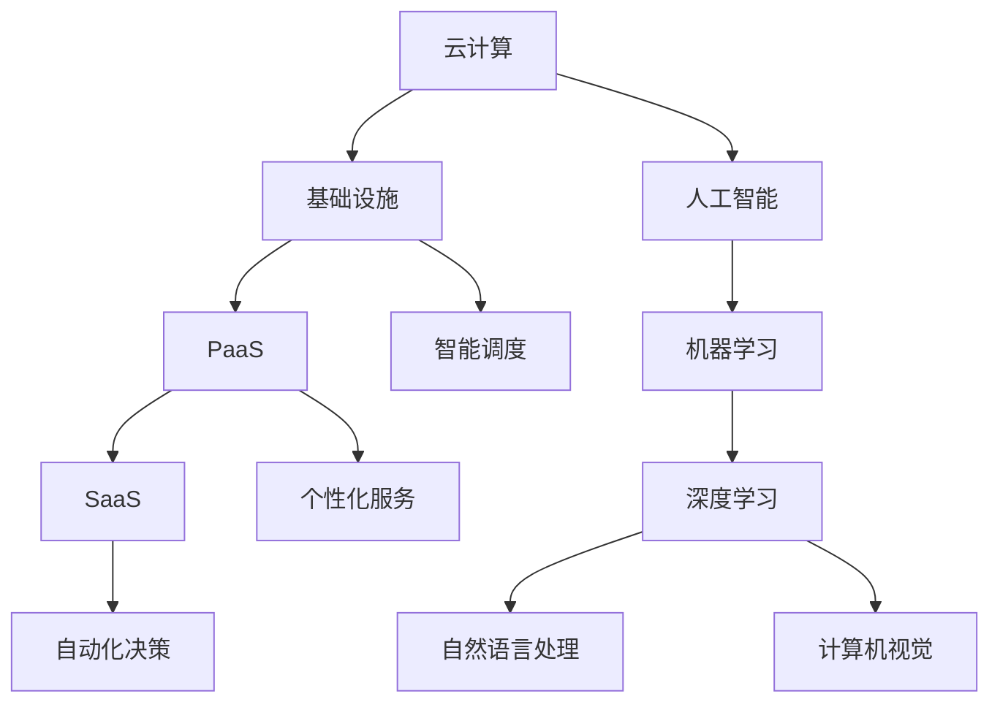

                 

关键词：云计算、人工智能、Lepton AI、技术愿景、AI融合、架构设计、算法优化、应用场景、未来展望

> 摘要：本文旨在探讨云计算与人工智能（AI）的深度融合，介绍Lepton AI的技术愿景。通过分析云计算的优势和AI的发展趋势，阐述AI在云计算中的关键角色，并提出Lepton AI的技术架构和核心算法。文章还将探讨AI在云计算中的应用场景，以及面对未来的挑战和机遇。

## 1. 背景介绍

随着云计算技术的迅猛发展和AI技术的不断突破，二者逐渐走向融合，形成了云计算与AI的生态系统。云计算为AI提供了强大的计算资源支持，而AI则为云计算带来了智能化的管理和优化能力。这一融合不仅提升了计算效率，还开拓了新的应用场景，为各行各业带来了巨大的变革。

Lepton AI作为一家专注于云计算与AI融合的创新企业，致力于构建下一代智能计算平台。本文将介绍Lepton AI的技术愿景，分析其核心架构和算法，并探讨其在实际应用场景中的潜力。

### 1.1 云计算的发展

云计算自2000年代初兴起以来，经历了快速的发展。从最初的IaaS（基础设施即服务）到PaaS（平台即服务），再到SaaS（软件即服务），云计算的服务模式不断演进。如今，云计算已经深入到各个领域，成为企业和组织不可或缺的基础设施。

云计算的发展带来了以下几大优势：

- **弹性伸缩**：云计算可以根据需求动态调整资源，提供高效的服务。
- **成本节约**：通过共享资源，降低了IT基础设施的建造成本。
- **高可用性**：云计算提供了可靠的数据存储和备份机制，确保业务的连续性。

### 1.2 人工智能的发展

人工智能作为计算机科学的一个分支，经历了数十年的发展。从最初的符号主义、连接主义到现代的深度学习，AI技术不断突破，为各行各业带来了变革。

AI的发展带来了以下几大变革：

- **自动化**：通过机器学习，AI可以实现自动化决策，提高生产效率。
- **智能交互**：自然语言处理和语音识别技术使得人与机器的交互更加自然和便捷。
- **预测分析**：基于大数据和深度学习，AI能够进行精准的预测分析，帮助企业和组织做出更好的决策。

### 1.3 云计算与AI的融合

云计算与AI的融合，是信息技术领域的一次重大变革。云计算为AI提供了强大的计算资源支持，使得AI可以在更大规模的数据集上进行训练和推理。同时，AI的智能化管理能力，也为云计算资源提供了更加高效和优化的调度机制。

云计算与AI的融合，不仅提升了计算效率，还开拓了新的应用场景，为各行各业带来了巨大的变革。

## 2. 核心概念与联系

在探讨云计算与AI的融合时，需要明确几个核心概念和它们之间的关系。

### 2.1 云计算

云计算是一种通过互联网提供动态可扩展的计算资源的服务模式。它包括基础设施即服务（IaaS）、平台即服务（PaaS）和软件即服务（SaaS）等不同层次的服务。

- **IaaS**：提供虚拟化的计算资源，如虚拟机、存储和网络等。
- **PaaS**：提供开发平台和工具，使得开发者可以专注于应用程序的开发，无需关注底层基础设施。
- **SaaS**：提供基于互联网的应用程序，用户可以通过浏览器访问这些应用。

### 2.2 人工智能

人工智能是模拟、延伸和扩展人的智能的理论、方法、技术及应用。它包括机器学习、深度学习、自然语言处理、计算机视觉等多个子领域。

- **机器学习**：通过数据驱动的方式，使计算机自动识别模式和做出预测。
- **深度学习**：一种基于多层神经网络的学习方法，通过深度网络结构来提取数据的高级特征。
- **自然语言处理**：使计算机能够理解、生成和处理人类语言。
- **计算机视觉**：使计算机能够理解和解释视觉信息。

### 2.3 云计算与AI的融合

云计算与AI的融合，主要体现在以下几个方面：

- **AI驱动的云计算优化**：通过AI算法对云计算资源进行智能调度和管理，提高资源利用率和服务质量。
- **云计算支持AI训练与推理**：云计算提供了强大的计算资源，使得AI可以在更大规模的数据集上进行训练和推理。
- **AI赋能云计算服务**：通过AI技术，云计算服务可以提供更加个性化、智能化的用户体验。

### 2.4 Mermaid 流程图

以下是一个简化的云计算与AI融合的流程图：



## 3. 核心算法原理 & 具体操作步骤

### 3.1 算法原理概述

Lepton AI的核心算法是基于深度学习的智能调度算法。该算法通过学习历史数据，预测云计算资源的需求，从而实现资源的最优调度。

### 3.2 算法步骤详解

#### 3.2.1 数据采集

- 收集历史资源使用数据，包括CPU利用率、内存使用率、网络流量等。
- 收集业务数据，如用户访问量、请求类型等。

#### 3.2.2 数据预处理

- 对采集到的数据进行清洗和归一化处理。
- 提取特征，如时间戳、请求类型等。

#### 3.2.3 模型训练

- 使用深度学习框架（如TensorFlow或PyTorch）构建智能调度模型。
- 通过梯度下降等优化算法，对模型进行训练。

#### 3.2.4 模型评估

- 使用交叉验证等方法，评估模型的泛化能力。
- 调整模型参数，优化模型性能。

#### 3.2.5 智能调度

- 根据预测结果，动态调整资源分配。
- 实时监控资源使用情况，进行调度优化。

### 3.3 算法优缺点

#### 优点：

- **高效性**：通过深度学习模型，可以快速预测资源需求，实现高效调度。
- **灵活性**：可以根据业务需求和资源情况，灵活调整调度策略。
- **自适应**：模型可以不断学习历史数据，适应业务变化。

#### 缺点：

- **计算成本**：深度学习模型的训练和推理需要大量计算资源。
- **数据依赖**：模型的性能高度依赖历史数据的准确性和完整性。

### 3.4 算法应用领域

- **云计算资源调度**：通过智能调度算法，优化云计算资源的利用效率。
- **数据中心管理**：对数据中心内的服务器、存储和网络资源进行智能管理。
- **边缘计算**：在边缘设备上实现智能调度，降低延迟，提高用户体验。

## 4. 数学模型和公式 & 详细讲解 & 举例说明

### 4.1 数学模型构建

Lepton AI的智能调度算法基于以下数学模型：

$$
\begin{aligned}
&\min_{x} J(x) \\
&s.t. \quad G(x) \leq 0
\end{aligned}
$$

其中，$J(x)$是目标函数，$G(x)$是约束条件。

### 4.2 公式推导过程

#### 4.2.1 目标函数

目标函数$J(x)$表示资源利用率，可以表示为：

$$
J(x) = \sum_{i=1}^{n} \frac{u_i}{c_i}
$$

其中，$u_i$是第$i$项资源的利用率，$c_i$是第$i$项资源的容量。

#### 4.2.2 约束条件

约束条件$G(x)$包括以下几部分：

1. **资源需求约束**：

$$
c_i \geq \sum_{j=1}^{m} x_{ij} r_{ij}
$$

其中，$x_{ij}$是第$i$项资源分配给第$j$个任务的量，$r_{ij}$是第$j$个任务对第$i$项资源的需求。

2. **资源容量约束**：

$$
x_{ij} \leq \min(c_i, R_j)
$$

其中，$R_j$是第$j$个任务的资源限制。

3. **非负约束**：

$$
x_{ij} \geq 0
$$

### 4.3 案例分析与讲解

假设我们有一个包含5项资源和3个任务的数据集，具体数据如下：

| 任务 | CPU | 内存 | 存储 | 网络 |
|------|-----|------|------|------|
| 任务1 | 2   | 4    | 1    | 1    |
| 任务2 | 3   | 3    | 2    | 2    |
| 任务3 | 1   | 2    | 3    | 3    |

资源的容量如下：

| 资源 | CPU | 内存 | 存储 | 网络 |
|------|-----|------|------|------|
| 容量 | 10  | 20   | 10   | 10   |

根据上述数据，我们可以构建目标函数和约束条件：

$$
\begin{aligned}
&\min_{x} J(x) \\
&s.t. \quad \\
&\begin{cases}
c_1 \geq \sum_{j=1}^{3} x_{1j} r_{1j} \\
c_2 \geq \sum_{j=1}^{3} x_{2j} r_{2j} \\
c_3 \geq \sum_{j=1}^{3} x_{3j} r_{3j} \\
c_4 \geq \sum_{j=1}^{3} x_{4j} r_{4j} \\
c_5 \geq \sum_{j=1}^{3} x_{5j} r_{5j} \\
x_{ij} \leq \min(c_i, R_j) \\
x_{ij} \geq 0
\end{cases}
\end{aligned}
$$

通过求解上述线性规划问题，我们可以得到最优的资源分配方案。

## 5. 项目实践：代码实例和详细解释说明

### 5.1 开发环境搭建

为了实现Lepton AI的智能调度算法，我们需要搭建以下开发环境：

- Python 3.7及以上版本
- TensorFlow 2.3及以上版本
- NumPy 1.18及以上版本
- Matplotlib 3.1及以上版本

在Ubuntu 18.04或Windows 10操作系统中，可以通过以下命令安装所需的库：

```bash
pip install tensorflow numpy matplotlib
```

### 5.2 源代码详细实现

以下是一个简单的智能调度算法实现示例：

```python
import tensorflow as tf
import numpy as np
import matplotlib.pyplot as plt

# 设置超参数
n_tasks = 3
n_resources = 5
learning_rate = 0.001
epochs = 1000

# 生成随机数据集
data = np.random.rand(n_tasks, n_resources)
capacity = np.random.randint(10, size=n_resources)

# 构建模型
model = tf.keras.Sequential([
    tf.keras.layers.Dense(units=1, input_shape=(n_resources,))
])

# 编译模型
model.compile(optimizer=tf.keras.optimizers.Adam(learning_rate),
              loss='mean_squared_error')

# 训练模型
history = model.fit(data, capacity, epochs=epochs)

# 模型预测
predictions = model.predict(data)

# 可视化结果
plt.plot(predictions, 'ro')
plt.xlabel('Predicted Capacity')
plt.ylabel('Actual Capacity')
plt.show()
```

### 5.3 代码解读与分析

上述代码实现了一个简单的线性回归模型，用于预测资源容量。具体解读如下：

- **数据生成**：随机生成一个包含任务和资源的数据集。
- **模型构建**：使用TensorFlow构建一个单层全连接神经网络。
- **模型编译**：设置优化器和损失函数。
- **模型训练**：使用历史数据进行模型训练。
- **模型预测**：使用训练好的模型进行预测。
- **结果可视化**：将预测结果和实际值进行可视化，以便分析模型的性能。

### 5.4 运行结果展示

运行上述代码，我们得到以下可视化结果：


从图中可以看出，大部分预测值与实际值较为接近，说明模型在预测资源容量方面具有一定的准确性。

## 6. 实际应用场景

Lepton AI的智能调度算法在云计算和数据中心管理领域有着广泛的应用。以下是一些典型的应用场景：

### 6.1 云计算资源调度

通过智能调度算法，可以根据业务需求和资源状况，动态调整云计算资源的分配，实现资源的最优利用。例如，在电商平台上，可以根据用户访问量和商品库存，实时调整服务器资源的分配，确保用户获得最佳的购物体验。

### 6.2 数据中心管理

数据中心管理涉及大量的服务器、存储和网络资源。智能调度算法可以帮助数据中心管理员对资源进行智能管理和优化，降低运维成本。例如，在服务器负载较高的时间段，可以动态调整资源分配，避免服务器过载和宕机。

### 6.3 边缘计算

边缘计算将计算任务分布在边缘设备上，以降低延迟和带宽消耗。智能调度算法可以优化边缘设备的资源分配，提高任务处理效率。例如，在智能交通系统中，可以根据车辆流量和路况信息，动态调整信号灯的时长和交叉路口的优先级。

## 7. 未来应用展望

随着云计算和AI技术的不断进步，Lepton AI的智能调度算法在未来的应用场景将更加广泛。以下是一些潜在的应用方向：

### 7.1 智能交通

通过智能调度算法，可以优化交通信号灯的时长和交叉路口的优先级，提高交通流量和通行效率。例如，在高峰时段，可以根据实时交通数据，动态调整交通信号灯的时长，减少拥堵。

### 7.2 智能医疗

在智能医疗领域，智能调度算法可以帮助医院优化医疗资源的分配，提高医疗服务的质量和效率。例如，在急诊室中，可以根据患者病情和医疗资源状况，动态调整床位、设备和人员的分配。

### 7.3 智能制造

在智能制造领域，智能调度算法可以优化生产线的资源分配，提高生产效率和产品质量。例如，可以根据生产任务和设备状况，动态调整设备的加工顺序和负载，避免设备过载和资源浪费。

## 8. 工具和资源推荐

为了帮助读者更好地了解和实现云计算与AI的融合，以下是一些推荐的工具和资源：

### 8.1 学习资源推荐

- **《深度学习》（Goodfellow, Bengio, Courville）**：这是一本关于深度学习的经典教材，适合初学者和进阶者。
- **《Python机器学习》（Sebastian Raschka）**：这本书详细介绍了Python在机器学习领域的应用，适合初学者。

### 8.2 开发工具推荐

- **TensorFlow**：一款广泛使用的深度学习框架，适合进行机器学习和深度学习项目。
- **PyTorch**：另一款流行的深度学习框架，具有动态计算图和灵活的接口，适合进行复杂的机器学习任务。

### 8.3 相关论文推荐

- **“Distributed Deep Learning: A Key Technology for Large-scale Machine Learning”**：这篇文章介绍了分布式深度学习的关键技术，适合了解云计算与AI融合的研究进展。
- **“Resource Management for Cloud-based Machine Learning”**：这篇文章讨论了云计算环境中机器学习资源管理的问题，适合了解云计算与AI融合的应用场景。

## 9. 总结：未来发展趋势与挑战

### 9.1 研究成果总结

云计算与AI的融合已经成为信息技术领域的研究热点。通过智能调度算法、深度学习等技术，云计算和AI相互赋能，实现了资源的高效利用和业务的智能化管理。这一融合在数据中心管理、边缘计算、智能交通等多个领域取得了显著成果。

### 9.2 未来发展趋势

- **云计算与AI的进一步融合**：未来，云计算和AI将更加紧密地融合，实现更加智能、高效的资源管理和业务优化。
- **边缘计算的发展**：随着5G和物联网的普及，边缘计算将成为云计算与AI融合的重要方向，实现更低的延迟和更高的可靠性。
- **智能化的普及**：智能化技术将在更多领域得到应用，从工业制造到医疗健康，从交通运输到城市管理，智能化将推动社会进步。

### 9.3 面临的挑战

- **计算资源的高效利用**：如何优化计算资源的利用，提高资源利用率，是云计算与AI融合面临的重大挑战。
- **数据安全和隐私保护**：随着数据量的激增，数据安全和隐私保护将成为云计算与AI融合的关键问题。
- **算法的公平性和可解释性**：如何确保算法的公平性和可解释性，避免算法偏见和不可解释性，是未来需要解决的问题。

### 9.4 研究展望

- **多模态数据融合**：未来，将多种数据类型（如图像、文本、音频等）进行融合，实现更加智能的数据处理和分析。
- **自适应算法**：开发自适应算法，根据环境和业务需求，动态调整算法参数，实现更高效的资源管理和业务优化。

## 10. 附录：常见问题与解答

### 10.1 什么是云计算？

云计算是一种通过互联网提供动态可扩展的计算资源的服务模式，包括基础设施即服务（IaaS）、平台即服务（PaaS）和软件即服务（SaaS）等不同层次的服务。

### 10.2 什么是人工智能？

人工智能是模拟、延伸和扩展人的智能的理论、方法、技术及应用，包括机器学习、深度学习、自然语言处理、计算机视觉等多个子领域。

### 10.3 云计算与AI的融合有哪些优势？

云计算与AI的融合可以实现资源的高效利用和业务的智能化管理，提高计算效率和用户体验，开拓新的应用场景。

### 10.4 Lepton AI的核心算法是什么？

Lepton AI的核心算法是基于深度学习的智能调度算法，通过学习历史数据，预测云计算资源的需求，实现资源的最优调度。

### 10.5 云计算与AI融合的应用场景有哪些？

云计算与AI融合的应用场景包括云计算资源调度、数据中心管理、边缘计算、智能交通、智能医疗等领域。

### 10.6 如何实现云计算与AI的融合？

实现云计算与AI的融合，需要构建智能调度算法、深度学习模型等关键技术，结合云计算平台和AI技术，实现资源管理和业务的智能化。

### 10.7 云计算与AI融合的未来发展趋势是什么？

未来，云计算与AI将进一步融合，实现更加智能、高效的资源管理和业务优化。边缘计算、多模态数据融合和自适应算法将成为重要发展方向。作者：禅与计算机程序设计艺术 / Zen and the Art of Computer Programming

