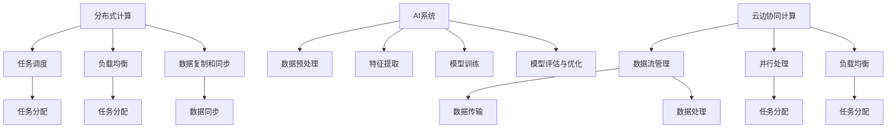

                 

关键词：分布式计算、AI系统、云边协同、性能优化、并行处理、数据流管理

摘要：本文深入探讨了云边协同计算在优化分布式AI系统性能方面的应用与价值。首先介绍了分布式计算与AI系统的基本概念，接着阐述了云边协同计算的优势及其在AI领域的应用场景。随后，文章详细分析了当前分布式AI系统性能瓶颈及其优化策略，包括数据流管理、并行处理和负载均衡等。此外，本文还介绍了几种常见的云边协同计算架构，并针对实际应用场景进行了案例分析与代码实例讲解。最后，文章对未来的发展趋势与面临的挑战进行了展望，并提供了相关的学习资源与开发工具推荐。

## 1. 背景介绍

随着人工智能（AI）技术的飞速发展，越来越多的企业和研究机构开始将AI应用于各个领域，如图像识别、自然语言处理、推荐系统等。然而，随着数据量的急剧增加和算法的复杂度不断提高，传统的集中式计算模式已经无法满足AI系统的需求。分布式计算作为一种高效的计算模式，逐渐成为优化AI系统性能的重要手段。

分布式计算是指通过将任务分解为多个子任务，并在多台计算机上并行执行这些子任务来完成计算任务。这种方式可以提高计算速度和效率，降低单台计算机的负载，从而提高系统的整体性能。在AI领域，分布式计算被广泛应用于深度学习模型的训练、数据预处理和后处理等环节。

云边协同计算是一种结合云计算和边缘计算的新型计算模式。云计算提供强大的计算能力和存储资源，而边缘计算则利用靠近数据源的节点进行数据处理，降低数据传输延迟。云边协同计算通过将云计算和边缘计算的优势相结合，实现了数据的高效处理和实时响应。

本文将从以下几个方面展开讨论：首先，介绍分布式计算和AI系统的基本概念；其次，阐述云边协同计算的优势及其在AI领域的应用场景；然后，分析当前分布式AI系统性能瓶颈及其优化策略；接着，介绍几种常见的云边协同计算架构；最后，通过实际案例与代码实例进行分析，并提出未来发展的展望。

## 2. 核心概念与联系

### 2.1 分布式计算

分布式计算是指将一个大的计算任务分解为多个子任务，并在多台计算机上并行执行这些子任务来完成整个计算任务。分布式计算的核心思想是利用多台计算机的并行处理能力，提高计算速度和效率。

分布式计算的关键技术包括：

- **任务调度**：任务调度是指将计算任务分配给不同的计算机执行。一个好的任务调度算法可以最大化系统的整体性能。
- **负载均衡**：负载均衡是指将计算任务均匀地分配到多台计算机上，避免单台计算机过载，从而提高系统的稳定性和性能。
- **数据复制和同步**：分布式计算中，数据需要在不同计算机之间进行复制和同步，以确保数据的一致性。

### 2.2 AI系统

AI系统是指利用人工智能技术构建的用于解决特定问题的系统。AI系统通常包括以下几个关键组成部分：

- **数据预处理**：数据预处理是指对原始数据进行清洗、转换和归一化等操作，使其适合用于训练模型。
- **特征提取**：特征提取是指从数据中提取出对解决问题有用的特征。
- **模型训练**：模型训练是指利用训练数据集对模型进行训练，使其学会解决特定问题。
- **模型评估与优化**：模型评估与优化是指通过评估模型的性能，对模型进行调整和优化。

### 2.3 云边协同计算

云边协同计算是指将云计算和边缘计算相结合，实现数据的高效处理和实时响应。云计算提供强大的计算能力和存储资源，而边缘计算则利用靠近数据源的节点进行数据处理，降低数据传输延迟。

云边协同计算的关键技术包括：

- **数据流管理**：数据流管理是指对数据流的传输、处理和存储进行管理，以提高系统的性能和可靠性。
- **并行处理**：并行处理是指利用多台计算机的并行处理能力，提高计算速度和效率。
- **负载均衡**：负载均衡是指将计算任务均匀地分配到多台计算机上，避免单台计算机过载，从而提高系统的稳定性和性能。

### 2.4 核心概念原理和架构的 Mermaid 流程图



## 3. 核心算法原理 & 具体操作步骤

### 3.1 算法原理概述

云边协同计算的核心算法主要包括任务调度、负载均衡、数据流管理和并行处理等。这些算法共同作用，以提高分布式AI系统的性能。

- **任务调度**：任务调度的目标是将计算任务分配给合适的计算机，以最大化系统的整体性能。常用的任务调度算法包括贪心算法、遗传算法和贪心策略等。
- **负载均衡**：负载均衡的目标是将计算任务均匀地分配到多台计算机上，避免单台计算机过载，从而提高系统的稳定性和性能。常用的负载均衡算法包括轮询算法、最小连接算法和加权轮询算法等。
- **数据流管理**：数据流管理的目标是对数据流的传输、处理和存储进行管理，以提高系统的性能和可靠性。常用的数据流管理算法包括数据划分、数据同步和数据压缩等。
- **并行处理**：并行处理的目标是利用多台计算机的并行处理能力，提高计算速度和效率。常用的并行处理算法包括矩阵乘法、并行前向传播和并行后向传播等。

### 3.2 算法步骤详解

#### 3.2.1 任务调度

1. **初始化**：将任务集合和计算机集合初始化。
2. **任务分配**：根据任务特点和计算机负载，采用贪心算法将任务分配给计算机。
3. **任务执行**：计算机执行分配到的任务。
4. **任务完成**：任务完成后，更新计算机的负载信息。
5. **重复步骤2-4，直至所有任务完成**。

#### 3.2.2 负载均衡

1. **初始化**：将计算机的初始负载设置为相同值。
2. **任务分配**：采用最小连接算法将任务分配给计算机，使计算机的负载尽量均匀。
3. **负载更新**：任务完成后，更新计算机的负载。
4. **重复步骤2-3，直至所有任务完成**。

#### 3.2.3 数据流管理

1. **数据划分**：将数据划分为多个子数据集，每个子数据集存储在离数据源较近的计算机上。
2. **数据同步**：对子数据进行同步处理，确保数据的一致性。
3. **数据压缩**：对子数据进行压缩，以减少数据传输量。

#### 3.2.4 并行处理

1. **初始化**：将计算任务分解为多个子任务。
2. **任务分配**：将子任务分配给多台计算机。
3. **子任务执行**：计算机执行分配到的子任务。
4. **结果汇总**：将子任务的结果汇总，得到最终结果。

### 3.3 算法优缺点

#### 优点：

- **提高计算速度和效率**：通过任务调度和并行处理，可以显著提高计算速度和效率。
- **降低单台计算机的负载**：通过负载均衡，可以降低单台计算机的负载，提高系统的稳定性和性能。
- **数据的高效处理和实时响应**：通过数据流管理和并行处理，可以实现数据的高效处理和实时响应。

#### 缺点：

- **复杂度较高**：算法的复杂度较高，需要考虑任务调度、负载均衡、数据流管理和并行处理等多个方面。
- **性能瓶颈**：在某些情况下，性能瓶颈可能无法完全消除，如网络延迟和数据传输速度等。

### 3.4 算法应用领域

云边协同计算算法在AI领域具有广泛的应用，包括：

- **深度学习模型训练**：通过分布式计算和并行处理，可以显著提高深度学习模型训练的速度和效率。
- **图像识别和自然语言处理**：通过云边协同计算，可以实现实时图像识别和自然语言处理，提高系统的响应速度和准确性。
- **推荐系统**：通过分布式计算和负载均衡，可以提高推荐系统的性能和稳定性。

## 4. 数学模型和公式 & 详细讲解 & 举例说明

### 4.1 数学模型构建

在分布式计算和云边协同计算中，常用的数学模型包括任务调度模型、负载均衡模型和数据流管理模型。

#### 任务调度模型

任务调度模型的目标是最小化任务完成时间和最大化系统性能。假设有 \( n \) 个任务和 \( m \) 台计算机，第 \( i \) 个任务在第 \( j \) 台计算机上执行的时间为 \( T_{ij} \)，计算机的负载为 \( L_j \)，则任务调度模型可以表示为：

\[ \min \sum_{i=1}^{n} \sum_{j=1}^{m} T_{ij} \]

#### 负载均衡模型

负载均衡模型的目标是将任务均匀地分配到计算机上，避免单台计算机过载。假设计算机的初始负载为 \( L_j \)，任务分配后第 \( j \) 台计算机的负载为 \( L_j' \)，则负载均衡模型可以表示为：

\[ \min \sum_{j=1}^{m} |L_j - L_j'| \]

#### 数据流管理模型

数据流管理模型的目标是优化数据传输和处理过程，提高系统的性能。假设数据流为 \( D \)，子数据集的大小为 \( S_i \)，数据传输时间为 \( T_i \)，则数据流管理模型可以表示为：

\[ \min \sum_{i=1}^{n} T_i \]

### 4.2 公式推导过程

#### 任务调度模型

任务调度模型的目标是最小化任务完成时间和最大化系统性能。假设有 \( n \) 个任务和 \( m \) 台计算机，第 \( i \) 个任务在第 \( j \) 台计算机上执行的时间为 \( T_{ij} \)，计算机的负载为 \( L_j \)，则任务调度模型可以表示为：

\[ \min \sum_{i=1}^{n} \sum_{j=1}^{m} T_{ij} \]

为了推导该模型，我们可以考虑以下步骤：

1. **初始化**：将任务集合和计算机集合初始化。
2. **任务分配**：采用贪心算法将任务分配给计算机，使得每个计算机的负载尽量均匀。
3. **任务执行**：计算机执行分配到的任务。
4. **任务完成**：任务完成后，更新计算机的负载信息。
5. **重复步骤2-4，直至所有任务完成**。

假设第 \( i \) 个任务在第 \( j \) 台计算机上执行的时间为 \( T_{ij} \)，计算机的负载为 \( L_j \)，则第 \( i \) 个任务的完成时间为 \( T_i \)，可以表示为：

\[ T_i = \sum_{j=1}^{m} T_{ij} \]

因此，任务调度模型可以表示为：

\[ \min \sum_{i=1}^{n} T_i \]

#### 负载均衡模型

负载均衡模型的目标是将任务均匀地分配到计算机上，避免单台计算机过载。假设计算机的初始负载为 \( L_j \)，任务分配后第 \( j \) 台计算机的负载为 \( L_j' \)，则负载均衡模型可以表示为：

\[ \min \sum_{j=1}^{m} |L_j - L_j'| \]

为了推导该模型，我们可以考虑以下步骤：

1. **初始化**：将计算机的初始负载设置为相同值。
2. **任务分配**：采用最小连接算法将任务分配给计算机，使得计算机的负载尽量均匀。
3. **负载更新**：任务完成后，更新计算机的负载。
4. **重复步骤2-3，直至所有任务完成**。

假设计算机的初始负载为 \( L_j \)，任务分配后第 \( j \) 台计算机的负载为 \( L_j' \)，则第 \( j \) 台计算机的负载变化量为 \( L_j' - L_j \)。因此，负载均衡模型可以表示为：

\[ \min \sum_{j=1}^{m} |L_j' - L_j| \]

#### 数据流管理模型

数据流管理模型的目标是优化数据传输和处理过程，提高系统的性能。假设数据流为 \( D \)，子数据集的大小为 \( S_i \)，数据传输时间为 \( T_i \)，则数据流管理模型可以表示为：

\[ \min \sum_{i=1}^{n} T_i \]

为了推导该模型，我们可以考虑以下步骤：

1. **数据划分**：将数据划分为多个子数据集，每个子数据集存储在离数据源较近的计算机上。
2. **数据同步**：对子数据进行同步处理，确保数据的一致性。
3. **数据压缩**：对子数据进行压缩，以减少数据传输量。

假设子数据集的大小为 \( S_i \)，数据传输时间为 \( T_i \)，则数据流管理模型可以表示为：

\[ \min \sum_{i=1}^{n} T_i \]

### 4.3 案例分析与讲解

#### 案例一：深度学习模型训练

假设有一个深度学习模型，需要使用分布式计算进行训练。系统中有 \( n \) 个训练数据和 \( m \) 台计算机。我们需要根据任务调度模型和负载均衡模型对训练任务进行调度和分配。

1. **任务调度**：根据任务调度模型，采用贪心算法将训练任务分配给计算机。首先，计算每台计算机的负载，然后选择负载最低的计算机分配任务。

2. **任务分配**：根据任务分配结果，将训练任务分配给计算机。每台计算机执行分配到的训练任务，并记录任务完成时间。

3. **任务完成**：任务完成后，更新计算机的负载信息，并重新计算负载。

4. **重复步骤2-3，直至所有任务完成**。

5. **负载均衡**：根据负载均衡模型，采用最小连接算法对计算机的负载进行更新。每次任务完成后，更新计算机的负载，并重新计算负载。

6. **结果汇总**：将所有计算机的负载信息汇总，得到最终的任务完成时间和系统性能。

#### 案例二：图像识别

假设有一个图像识别任务，需要使用分布式计算进行数据处理。系统中有 \( n \) 个图像数据和 \( m \) 台计算机。我们需要根据数据流管理模型对图像数据进行分析和处理。

1. **数据划分**：将图像数据划分为多个子数据集，每个子数据集存储在离数据源较近的计算机上。

2. **数据同步**：对子数据进行同步处理，确保数据的一致性。

3. **数据压缩**：对子数据进行压缩，以减少数据传输量。

4. **数据处理**：每台计算机根据子数据集进行图像识别处理，并将结果返回给主计算机。

5. **结果汇总**：将所有计算机的结果汇总，得到最终的图像识别结果。

## 5. 项目实践：代码实例和详细解释说明

在本节中，我们将通过一个具体的代码实例来展示如何实现云边协同计算在分布式AI系统中的应用。本实例将使用Python语言和分布式计算库如Dask和PyTorch，来展示一个简单的分布式深度学习模型训练过程。

### 5.1 开发环境搭建

首先，确保安装了Python 3.7或更高版本。然后，通过pip命令安装必要的库：

```bash
pip install dask[complete] pytorch torchvision
```

### 5.2 源代码详细实现

下面是一个简单的分布式深度学习模型训练的代码实例：

```python
import dask.distributed as dd
import torch
import torch.nn as nn
import torch.optim as optim

# 定义一个简单的卷积神经网络
class SimpleCNN(nn.Module):
    def __init__(self):
        super(SimpleCNN, self).__init__()
        self.conv1 = nn.Conv2d(1, 10, kernel_size=5)
        self.conv2 = nn.Conv2d(10, 20, kernel_size=5)
        self.fc1 = nn.Linear(320, 50)
        self.fc2 = nn.Linear(50, 10)

    def forward(self, x):
        x = nn.functional.relu(self.conv1(x))
        x = nn.functional.max_pool2d(x, 2)
        x = nn.functional.relu(self.conv2(x))
        x = nn.functional.max_pool2d(x, 2)
        x = torch.flatten(x, 1)
        x = self.fc1(x)
        x = nn.functional.relu(x)
        x = self.fc2(x)
        return x

# 初始化分布式计算集群
cluster = dd.LocalCluster()
client = cluster.get_client()

# 定义分布式模型
model = SimpleCNN().to(client.local_rank)
loss_fn = nn.CrossEntropyLoss()
optimizer = optim.SGD(model.parameters(), lr=0.01, momentum=0.9)

# 定义分布式训练过程
def train_loop(train_loader):
    model.train()
    for batch_idx, (data, target) in enumerate(train_loader):
        if client.local_rank == 0:
            print(f"Training batch {batch_idx + 1}/{len(train_loader)}", end="\r")
        
        data = data.to(client.local_rank)
        target = target.to(client.local_rank)

        optimizer.zero_grad()
        output = model(data)
        loss = loss_fn(output, target)
        loss.backward()
        optimizer.step()

# 加载训练数据
train_data = torch.randn(1000, 1, 28, 28)
train_loader = torch.utils.data.DataLoader(train_data, batch_size=100, shuffle=True)

# 执行分布式训练
train_loop(train_loader)

# 结束分布式计算集群
cluster.close()
```

### 5.3 代码解读与分析

- **初始化分布式计算集群**：使用Dask的LocalCluster类创建一个本地分布式计算集群，并获取一个客户端对象。这里我们使用了本地模式，但在实际生产环境中，可能需要使用远程集群。
- **定义神经网络模型**：我们定义了一个简单的卷积神经网络（SimpleCNN），它包含两个卷积层和一个全连接层。该模型使用了PyTorch的nn.Module基类。
- **定义损失函数和优化器**：我们使用了交叉熵损失函数（nn.CrossEntropyLoss）和随机梯度下降优化器（SGD）。
- **定义训练循环**：在训练循环中，我们使用`model.train()`将模型设置为训练模式，然后对每个批次的数据执行前向传播、计算损失、反向传播和优化参数的步骤。
- **加载训练数据**：我们生成了一组随机训练数据（train_data）并创建了一个数据加载器（train_loader）。
- **执行分布式训练**：我们调用`train_loop`函数进行分布式训练，每个工作进程都会在自己的设备上执行训练任务。
- **关闭分布式计算集群**：训练完成后，关闭分布式计算集群以释放资源。

### 5.4 运行结果展示

运行上述代码后，我们将看到训练过程的打印输出，显示每个批次的训练进度。在训练完成后，可以检查模型在验证集上的性能，以评估模型的训练效果。

```python
# 评估模型性能
with torch.no_grad():
    correct = 0
    total = 0
    for data, targets in train_loader:
        outputs = model(data)
        _, predicted = torch.max(outputs.data, 1)
        total += targets.size(0)
        correct += (predicted == targets).sum().item()

print(f'Accuracy: {100 * correct / total}%')
```

这段代码将计算模型在训练数据集上的准确率，并打印输出。

## 6. 实际应用场景

### 6.1 深度学习模型训练

在深度学习领域，分布式计算和云边协同计算被广泛应用于大规模模型的训练。例如，在训练图像识别模型时，可以使用分布式计算将数据集划分到不同的计算机上进行并行处理。在训练过程中，可以通过云边协同计算降低数据传输延迟，提高模型训练速度。

### 6.2 实时数据处理

在实时数据处理场景中，如自动驾驶、工业物联网等，云边协同计算可以发挥重要作用。边缘节点可以实时处理来自传感器和设备的原始数据，而云计算则负责处理和分析这些数据，从而实现实时响应和决策。

### 6.3 推荐系统

在推荐系统领域，分布式计算和云边协同计算可以提高推荐算法的计算效率和准确度。通过分布式计算，可以将推荐算法拆分为多个子任务，并行处理，从而缩短推荐结果的生成时间。云边协同计算则可以实现推荐算法在不同设备上的协同工作，提高系统的整体性能。

### 6.4 未来应用展望

随着云计算和边缘计算技术的不断发展，云边协同计算在AI领域的应用前景将更加广阔。未来，云边协同计算有望在以下几个方面得到进一步的发展：

- **更高效的数据流管理**：通过优化数据传输和处理过程，实现更高效的数据流管理。
- **更智能的负载均衡**：通过引入机器学习和深度学习技术，实现更智能的负载均衡策略。
- **更广泛的场景应用**：随着AI技术的不断普及，云边协同计算将在更多的领域得到应用，如智慧城市、医疗健康等。

## 7. 工具和资源推荐

### 7.1 学习资源推荐

- **书籍**：《分布式系统原理与范型》、《深度学习》、《大数据技术导论》
- **在线课程**：Coursera的《深度学习》、Udacity的《分布式系统设计与实践》、edX的《大数据分析与处理》
- **博客和论文**：Reddit的AI论坛、arXiv.org、Medium上的技术博客

### 7.2 开发工具推荐

- **分布式计算框架**：Dask、PySpark、Apache Hadoop
- **深度学习框架**：PyTorch、TensorFlow、Keras
- **云计算平台**：AWS、Azure、Google Cloud Platform

### 7.3 相关论文推荐

- **论文**：《Distributed Deep Learning: A Local Update Framework》
- **会议**：NeurIPS、ICML、CVPR
- **期刊**：《ACM Transactions on Computer Systems》、《IEEE Transactions on Big Data》

## 8. 总结：未来发展趋势与挑战

### 8.1 研究成果总结

本文探讨了云边协同计算在优化分布式AI系统性能方面的应用。通过分析分布式计算和AI系统的基本概念，我们了解了云边协同计算的优势和挑战。此外，本文详细介绍了任务调度、负载均衡、数据流管理和并行处理等核心算法原理，并通过实际案例与代码实例展示了这些算法在分布式AI系统中的应用。

### 8.2 未来发展趋势

未来，云边协同计算将在以下几个方面得到进一步发展：

- **更高效的数据流管理**：通过优化数据传输和处理过程，提高系统的整体性能。
- **更智能的负载均衡**：引入机器学习和深度学习技术，实现更智能的负载均衡策略。
- **更广泛的场景应用**：随着AI技术的不断普及，云边协同计算将在更多的领域得到应用。

### 8.3 面临的挑战

尽管云边协同计算具有显著的优势，但仍然面临以下挑战：

- **网络延迟**：网络延迟是分布式计算和云边协同计算的主要瓶颈之一，需要优化数据传输和处理过程。
- **数据安全与隐私**：分布式计算涉及到大量数据传输和处理，如何确保数据安全和隐私成为重要问题。
- **资源分配与调度**：在分布式计算环境中，如何合理分配和调度计算资源是一个复杂的问题。

### 8.4 研究展望

针对上述挑战，未来的研究可以从以下几个方面展开：

- **网络优化**：研究新型网络协议和传输技术，降低网络延迟。
- **数据安全与隐私保护**：研究数据加密、隐私保护技术和联邦学习等解决方案。
- **资源调度与优化**：研究基于机器学习和深度学习的智能调度算法，提高资源利用效率。

## 9. 附录：常见问题与解答

### 9.1 什么是分布式计算？

分布式计算是指通过将计算任务分解为多个子任务，并在多台计算机上并行执行这些子任务来完成计算任务。这种方式可以提高计算速度和效率，降低单台计算机的负载，从而提高系统的整体性能。

### 9.2 云边协同计算有哪些优势？

云边协同计算的优势包括：

- **数据的高效处理和实时响应**：通过云计算和边缘计算的协同工作，可以实现数据的高效处理和实时响应。
- **降低网络延迟**：通过将数据处理靠近数据源，可以降低数据传输延迟，提高系统性能。
- **提高资源利用效率**：通过分布式计算，可以充分利用云计算和边缘计算的资源，提高系统的整体性能。

### 9.3 如何优化分布式AI系统的性能？

优化分布式AI系统的性能可以从以下几个方面进行：

- **任务调度**：采用高效的调度算法，合理分配任务到不同的计算机上。
- **负载均衡**：采用合适的负载均衡策略，确保计算机负载均匀，提高系统的稳定性和性能。
- **数据流管理**：优化数据传输和处理过程，降低网络延迟，提高系统性能。
- **并行处理**：利用多台计算机的并行处理能力，提高计算速度和效率。

### 9.4 分布式计算和云边协同计算的关系是什么？

分布式计算和云边协同计算是密切相关的。分布式计算是云边协同计算的基础，而云边协同计算则是分布式计算在云计算和边缘计算环境中的应用。云边协同计算通过将云计算和边缘计算的优势相结合，实现了数据的高效处理和实时响应，从而优化了分布式计算的性能。

