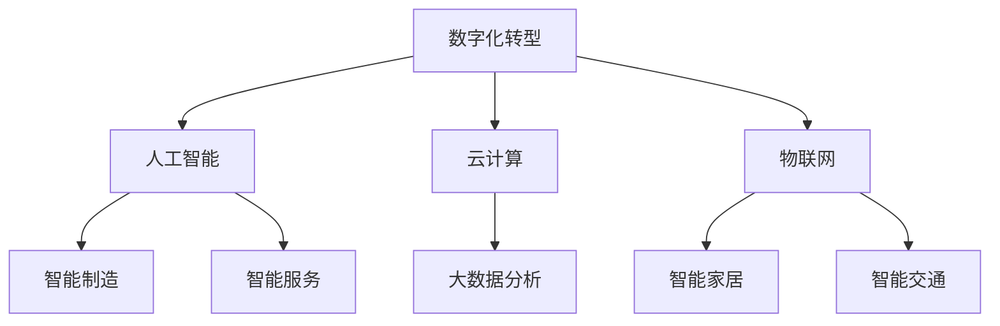

                 

 > 关键词：产业转型升级、新质生产力、技术创新、数字化转型、智能制造、人工智能、云计算、物联网、可持续发展、智能制造、数字孪生

> 摘要：本文旨在探讨产业转型升级与新质生产力的关系，分析新质生产力在推动产业升级、提高生产效率、促进可持续发展等方面的作用。通过对核心技术、数学模型和项目实践的详细讲解，本文提出了新质生产力在未来产业中的发展展望，以及面临的挑战和应对策略。

## 1. 背景介绍

随着全球经济的不断发展，传统产业面临着资源枯竭、环境污染、产能过剩等诸多问题。为了实现可持续发展，各国纷纷将目光投向产业转型升级，通过引入新技术、新模式，提升产业竞争力。新质生产力作为一种推动产业升级的重要力量，正逐渐成为研究热点。

### 1.1 产业转型升级的概念与意义

产业转型升级是指通过技术创新、结构调整、产业整合等手段，推动传统产业向高附加值、高技术含量、高效益的产业转变。其意义在于：

- 提高产业附加值，促进经济增长。
- 优化产业结构，提升国家竞争力。
- 实现资源节约和环境保护，促进可持续发展。

### 1.2 新质生产力的定义与特征

新质生产力是指以数字化、网络化、智能化为主要特征，通过信息技术、人工智能、物联网等技术的创新应用，推动产业升级和生产效率提升的新兴生产力。其特征包括：

- 数字化：将传统产业中的信息转化为数字形式，实现数据的收集、存储、处理和分析。
- 网络化：通过互联网、物联网等技术实现各产业环节的互联互通，提升协同效率。
- 智能化：引入人工智能、机器学习等算法，实现自动化、智能化的生产和管理。

## 2. 核心概念与联系

为了更好地理解新质生产力的作用，我们需要了解以下几个核心概念及其相互关系。

### 2.1 数字化转型

数字化转型是指利用数字技术优化业务流程、重构商业模式，实现企业全业务、全流程的数字化。数字化转型是推动新质生产力发展的关键环节。

### 2.2 人工智能

人工智能（AI）是模拟、延伸和扩展人的智能的理论、方法、技术及应用。人工智能在智能制造、智能服务、智能决策等方面具有重要应用价值。

### 2.3 云计算

云计算是一种通过互联网提供动态可伸缩的虚拟化资源的计算模式。云计算为新质生产力提供了强大的计算能力和数据存储能力。

### 2.4 物联网

物联网是通过传感器、网络等手段实现物体互联互通的生态系统。物联网为新质生产力提供了海量数据来源和智能控制能力。

### 2.5 Mermaid 流程图

以下是新质生产力核心概念及其相互关系的 Mermaid 流程图：



## 3. 核心算法原理 & 具体操作步骤

### 3.1 算法原理概述

新质生产力的核心在于技术创新，其中人工智能、大数据、云计算等技术发挥着关键作用。以下简要介绍几种核心技术及其算法原理。

### 3.2 算法步骤详解

#### 3.2.1 人工智能算法

1. 数据采集与预处理：收集相关数据，并进行清洗、去重、归一化等处理。
2. 模型选择与训练：根据应用场景选择合适的模型，利用训练数据进行模型训练。
3. 模型评估与优化：评估模型性能，通过调整超参数、增加数据等手段优化模型。
4. 应用部署：将训练好的模型部署到生产环境中，实现自动化、智能化应用。

#### 3.2.2 大数据算法

1. 数据存储与管理：利用分布式存储系统（如Hadoop、Spark）对海量数据进行存储和管理。
2. 数据预处理：对原始数据进行清洗、转换、归一化等处理。
3. 数据挖掘与分析：利用机器学习、深度学习等方法对数据进行分析和挖掘。
4. 结果可视化与展示：将分析结果以图表、报告等形式展示。

#### 3.2.3 云计算算法

1. 资源调度与分配：根据用户需求，动态调整计算资源，实现资源优化利用。
2. 负载均衡与容错：通过负载均衡技术，实现系统的高可用性和高性能。
3. 弹性伸缩：根据业务需求，自动调整计算资源，实现系统的弹性伸缩。
4. 云服务安全：确保云服务的安全性和可靠性，防范数据泄露、攻击等风险。

### 3.3 算法优缺点

#### 3.3.1 人工智能算法

优点：

- 自动化程度高，节省人力成本。
- 能处理大规模、复杂的数据。

缺点：

- 需要大量训练数据，数据质量对模型性能影响大。
- 模型可解释性差，难以理解决策过程。

#### 3.3.2 大数据算法

优点：

- 能处理海量数据，发现潜在价值。
- 提高决策效率，优化业务流程。

缺点：

- 需要大量计算资源和存储空间。
- 数据隐私和安全问题。

#### 3.3.3 云计算算法

优点：

- 资源弹性伸缩，降低运维成本。
- 高可用性，确保业务连续性。

缺点：

- 需要高昂的云服务费用。
- 存在数据传输、存储安全风险。

### 3.4 算法应用领域

新质生产力的核心技术广泛应用于各个领域，如：

- 智能制造：通过人工智能、物联网等技术，实现生产过程的自动化、智能化。
- 智能服务：利用大数据分析、人工智能等技术，提供个性化、智能化的服务。
- 智能交通：通过物联网、人工智能等技术，实现交通管理的智能化、高效化。
- 智能医疗：利用人工智能、大数据等技术，提升医疗服务的质量和效率。

## 4. 数学模型和公式 & 详细讲解 & 举例说明

### 4.1 数学模型构建

新质生产力的核心技术依赖于一系列数学模型，如：

- 监督学习模型：用于预测和分类。
- 无监督学习模型：用于数据降维和聚类。
- 强化学习模型：用于决策和优化。

以下是监督学习模型（如线性回归）的基本公式：

$$
y = \beta_0 + \beta_1x_1 + \beta_2x_2 + \cdots + \beta_nx_n
$$

其中，$y$ 为目标变量，$x_1, x_2, \cdots, x_n$ 为输入变量，$\beta_0, \beta_1, \beta_2, \cdots, \beta_n$ 为模型参数。

### 4.2 公式推导过程

以线性回归为例，推导过程如下：

1. 假设目标变量 $y$ 与输入变量 $x_1, x_2, \cdots, x_n$ 之间存在线性关系。
2. 建立线性回归模型，表示为 $y = \beta_0 + \beta_1x_1 + \beta_2x_2 + \cdots + \beta_nx_n$。
3. 使用最小二乘法求解模型参数，使模型预测值与实际值之间的误差最小。

### 4.3 案例分析与讲解

以房价预测为例，分析线性回归模型在应用中的效果。

1. 数据收集：收集某地区不同区域、不同类型的房屋价格数据。
2. 数据预处理：对数据进行清洗、归一化等处理。
3. 模型训练：使用线性回归模型训练数据集，求解模型参数。
4. 模型评估：使用验证集评估模型性能，调整模型参数。
5. 应用部署：将训练好的模型应用于实际场景，预测房屋价格。

通过实际案例，可以看出线性回归模型在房价预测中的应用效果。然而，线性回归模型在处理非线性关系时效果不佳，需要引入更复杂的模型（如深度学习模型）。

## 5. 项目实践：代码实例和详细解释说明

### 5.1 开发环境搭建

以房价预测项目为例，首先需要搭建以下开发环境：

- Python 3.8+
- Jupyter Notebook
- NumPy
- Pandas
- Scikit-learn

安装步骤如下：

```bash
pip install numpy pandas scikit-learn
```

### 5.2 源代码详细实现

以下是房价预测项目的代码实现：

```python
import numpy as np
import pandas as pd
from sklearn.linear_model import LinearRegression
from sklearn.model_selection import train_test_split
from sklearn.metrics import mean_squared_error

# 读取数据
data = pd.read_csv('house_prices.csv')

# 数据预处理
X = data[['area', 'bedrooms', 'age']]
y = data['price']
X_train, X_test, y_train, y_test = train_test_split(X, y, test_size=0.2, random_state=42)

# 模型训练
model = LinearRegression()
model.fit(X_train, y_train)

# 模型评估
y_pred = model.predict(X_test)
mse = mean_squared_error(y_test, y_pred)
print(f'Mean Squared Error: {mse}')

# 模型应用
new_data = pd.DataFrame({
    'area': [1000],
    'bedrooms': [3],
    'age': [10]
})
predicted_price = model.predict(new_data)
print(f'Predicted Price: {predicted_price[0]}')
```

### 5.3 代码解读与分析

1. 导入相关库：`numpy`、`pandas`、`sklearn.linear_model`、`sklearn.model_selection`、`sklearn.metrics`。
2. 读取数据：使用 `pandas` 读取 CSV 文件。
3. 数据预处理：将数据分为输入变量和目标变量，并使用 `train_test_split` 划分训练集和测试集。
4. 模型训练：使用 `LinearRegression` 类创建线性回归模型，并使用 `fit` 方法进行训练。
5. 模型评估：使用 `mean_squared_error` 函数计算模型在测试集上的均方误差。
6. 模型应用：将训练好的模型应用于新数据，预测房屋价格。

通过该项目实践，可以看出线性回归模型在房价预测中的应用效果。然而，实际应用中可能面临数据质量、模型选择等问题，需要进一步优化和改进。

## 6. 实际应用场景

新质生产力在各个领域具有广泛的应用价值，以下列举几个实际应用场景。

### 6.1 智能制造

智能制造是制造业转型升级的重要方向，通过引入人工智能、物联网等技术，实现生产过程的自动化、智能化。例如，通过机器视觉技术实现生产线自动化检测，通过物联网技术实现设备联网监控，通过人工智能技术实现生产计划的智能调度。

### 6.2 智能服务

智能服务是服务业发展的重要方向，通过大数据分析、人工智能等技术，提供个性化、智能化的服务。例如，通过智能客服系统实现自动问答，通过推荐系统实现个性化推荐，通过自然语言处理技术实现智能语音交互。

### 6.3 智能交通

智能交通是交通运输领域的发展趋势，通过物联网、人工智能等技术，实现交通管理的智能化、高效化。例如，通过智能交通信号控制系统实现交通流量优化，通过智能停车系统实现停车资源共享，通过车联网技术实现自动驾驶。

### 6.4 未来应用展望

随着新质生产力的发展，未来将在更多领域实现应用。例如，智能医疗、智能教育、智能农业等。这些应用将进一步提升生产效率，改善人民生活质量，促进社会可持续发展。

## 7. 工具和资源推荐

为了更好地学习和实践新质生产力，以下推荐一些工具和资源。

### 7.1 学习资源推荐

- 《深度学习》（Goodfellow, Bengio, Courville）：介绍深度学习的基础知识和技术。
- 《Python机器学习》（Sebastian Raschka）：涵盖机器学习的基本算法和应用。
- 《Hadoop权威指南》（Tom White）：介绍大数据处理技术。

### 7.2 开发工具推荐

- Jupyter Notebook：适用于数据分析和机器学习的交互式开发环境。
- TensorFlow：一款开源的机器学习框架，适用于深度学习和神经网络。
- PyTorch：一款开源的机器学习框架，支持动态图计算。

### 7.3 相关论文推荐

- "Deep Learning for Manufacturing: A Review"（2019）
- "Internet of Things in Manufacturing: A Survey"（2018）
- "Artificial Intelligence for Manufacturing: A Perspective"（2017）

## 8. 总结：未来发展趋势与挑战

### 8.1 研究成果总结

新质生产力在推动产业升级、提高生产效率、促进可持续发展等方面取得了显著成果。通过数字化转型、人工智能、云计算、物联网等技术的创新应用，实现了传统产业的升级换代。

### 8.2 未来发展趋势

未来，新质生产力将在更多领域实现应用，如智能医疗、智能教育、智能农业等。同时，随着5G、边缘计算等新技术的快速发展，新质生产力的应用场景将更加丰富。

### 8.3 面临的挑战

尽管新质生产力具有广阔的应用前景，但仍面临一些挑战：

- 技术挑战：如算法性能、数据质量、系统稳定性等。
- 安全挑战：如数据隐私、网络安全等。
- 法规挑战：如数据监管、知识产权保护等。

### 8.4 研究展望

为应对挑战，未来研究应重点关注以下几个方面：

- 提高算法性能，降低计算成本。
- 加强数据安全保护，防范数据泄露。
- 构建完善的法规体系，规范产业发展。
- 推动产学研合作，促进技术创新。

## 9. 附录：常见问题与解答

### 9.1 新质生产力的定义是什么？

新质生产力是指以数字化、网络化、智能化为主要特征，通过信息技术、人工智能、物联网等技术的创新应用，推动产业升级和生产效率提升的新兴生产力。

### 9.2 新质生产力的核心技术有哪些？

新质生产力的核心技术包括人工智能、大数据、云计算、物联网等。

### 9.3 新质生产力的应用领域有哪些？

新质生产力的应用领域广泛，包括智能制造、智能服务、智能交通、智能医疗等。

### 9.4 如何实现数字化转型？

实现数字化转型需要从以下几个方面入手：

- 顶层设计：明确数字化转型的目标、战略和路径。
- 技术创新：引入先进的技术，如人工智能、大数据等。
- 业务重构：重构业务流程，提高业务效率。
- 数据治理：确保数据质量，构建数据驱动决策体系。

---

作者：禅与计算机程序设计艺术 / Zen and the Art of Computer Programming
------------------------------------------------------------------------

