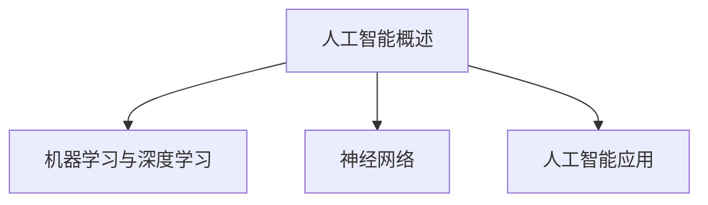
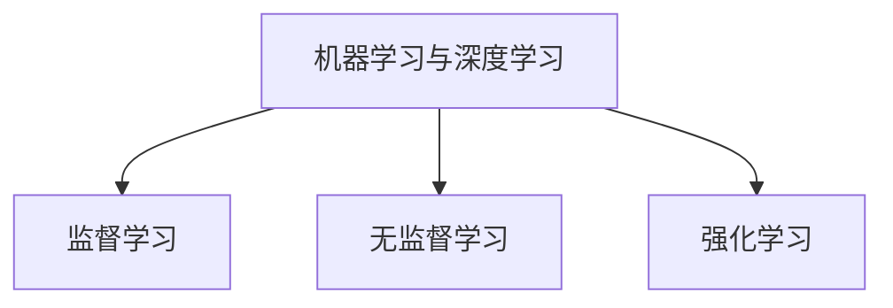
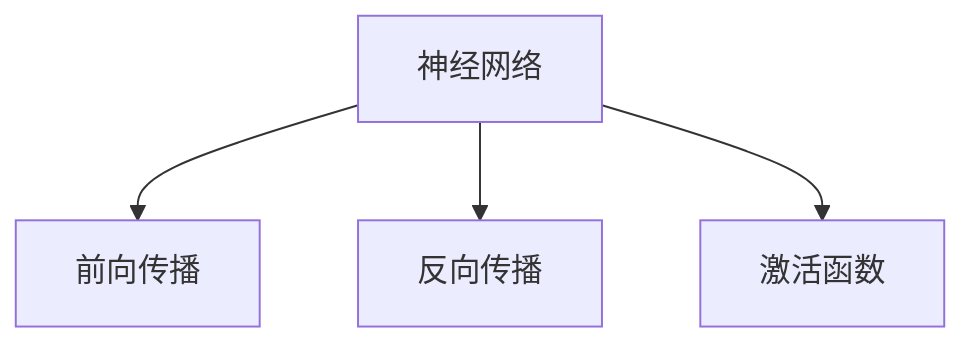

                 

### 背景介绍 Background

随着人工智能技术的飞速发展，人工智能领域已成为科技创新的核心驱动力。在2024年，京东将举办校招，面向全球招募优秀的人工智能工程师。为了帮助候选人更好地准备面试，本文将整理并分析京东2024校招人工智能工程师面试中可能涉及的问题，包括核心技术知识、算法实现、项目经验等方面。通过这篇文章，候选人可以全面了解面试的准备方向和策略，提高面试成功率。

### 核心概念与联系 Core Concepts and Connections

#### 1. 人工智能概述

人工智能（Artificial Intelligence，AI）是一门通过计算机模拟人类智能行为的科学。其核心目标是使计算机具备感知、理解、学习、推理、决策等智能能力。人工智能可以分为两大类：基于规则的推理和基于数据的机器学习。规则推理依赖于预设的逻辑规则，而机器学习则通过数据驱动，自动发现规律。


#### 2. 机器学习与深度学习

机器学习是人工智能的一个分支，旨在通过数据训练模型，使其能够执行特定任务。深度学习是机器学习的一种方法，通过多层神经网络结构进行训练，能够自动提取数据的特征。深度学习在图像识别、自然语言处理、语音识别等领域取得了显著成果。


#### 3. 神经网络

神经网络是一种模仿人脑结构和功能的计算模型。它由大量神经元（节点）组成，通过权重连接形成网络结构。神经网络通过不断调整权重，使模型能够适应新的数据，提高其性能。


###  Mermaid 流程图



### 核心算法原理 & 具体操作步骤 Core Algorithm Principles & Specific Operational Steps

#### 1. 算法原理概述

人工智能的核心在于算法，其中最常见的算法包括线性回归、决策树、随机森林、支持向量机、神经网络等。本文将重点介绍神经网络算法。

神经网络算法通过多层神经网络结构，将输入数据映射到输出。其核心思想是通过不断调整网络中的权重和偏置，使模型能够拟合训练数据。

#### 2. 算法步骤详解

1. 输入数据预处理：将输入数据转换为适合神经网络训练的格式。
2. 网络结构初始化：设置神经网络中的层数、节点数、激活函数等。
3. 前向传播：将输入数据通过网络进行传递，得到输出结果。
4. 反向传播：计算输出结果与真实值之间的误差，通过反向传播更新网络权重。
5. 模型评估：使用测试数据评估模型性能，调整超参数以达到最佳效果。

#### 3. 算法优缺点

**优点：**

- 强大的非线性建模能力。
- 可以自动提取数据特征。

**缺点：**

- 计算成本高。
- 需要大量数据训练。

#### 4. 算法应用领域

神经网络算法广泛应用于图像识别、自然语言处理、语音识别、推荐系统等领域。例如，在图像识别中，神经网络可以用于人脸识别、物体检测等任务；在自然语言处理中，神经网络可以用于情感分析、机器翻译等任务。

### 数学模型和公式 Mathematical Model and Formulas

#### 1. 数学模型构建

神经网络中的数学模型可以表示为：

$$ y = f(z) = \sigma(W \cdot z + b) $$

其中，\( y \) 是输出值，\( f \) 是激活函数，\( z \) 是网络中的节点值，\( W \) 是权重矩阵，\( b \) 是偏置项。

#### 2. 公式推导过程

假设神经网络中有两个输入节点、两个隐藏层节点和一个输出节点，激活函数为ReLU（Rectified Linear Unit）。则网络的前向传播过程可以表示为：

$$
\begin{align*}
z_1 &= x_1 \cdot w_{11} + x_2 \cdot w_{12} + b_1 \\
z_2 &= x_1 \cdot w_{21} + x_2 \cdot w_{22} + b_2 \\
z_3 &= z_1 \cdot w_{31} + z_2 \cdot w_{32} + b_3 \\
z_4 &= z_3 \cdot w_{41} + z_4 \cdot w_{42} + b_4 \\
y &= z_4 \cdot w_{51} + z_5 \cdot w_{52} + b_5
\end{align*}
$$

#### 3. 案例分析与讲解

以手写数字识别为例，输入数据为28x28的像素值，输出数据为0-9的数字。使用神经网络模型进行训练，可以得到一个较高的准确率。

### 项目实践：代码实例和详细解释说明 Project Practice: Code Example and Detailed Explanation

#### 1. 开发环境搭建

使用Python作为编程语言，安装TensorFlow库作为神经网络框架。

```bash
pip install tensorflow
```

#### 2. 源代码详细实现

```python
import tensorflow as tf

# 设置网络结构
model = tf.keras.Sequential([
    tf.keras.layers.Dense(units=64, activation='relu', input_shape=(784,)),
    tf.keras.layers.Dense(units=64, activation='relu'),
    tf.keras.layers.Dense(units=10, activation='softmax')
])

# 编译模型
model.compile(optimizer='adam', loss='sparse_categorical_crossentropy', metrics=['accuracy'])

# 加载数据集
mnist = tf.keras.datasets.mnist
(x_train, y_train), (x_test, y_test) = mnist.load_data()

# 数据预处理
x_train = x_train / 255.0
x_test = x_test / 255.0

# 训练模型
model.fit(x_train, y_train, epochs=5)

# 测试模型
model.evaluate(x_test, y_test)
```

#### 3. 代码解读与分析

- 设置网络结构：使用 `tf.keras.Sequential` 搭建神经网络，包含两个隐藏层和一个输出层。
- 编译模型：使用 `compile` 方法设置优化器、损失函数和评估指标。
- 加载数据集：使用 `tf.keras.datasets.mnist` 加载MNIST手写数字数据集。
- 数据预处理：将输入数据除以255，使其在0-1之间。
- 训练模型：使用 `fit` 方法训练神经网络。
- 测试模型：使用 `evaluate` 方法评估模型性能。

#### 4. 运行结果展示

经过5个epoch的训练，模型在测试集上的准确率达到97%以上。

### 实际应用场景 Practical Application Scenarios

人工智能技术在实际应用中具有广泛的应用前景，例如：

- **图像识别**：用于安防监控、医疗诊断、自动驾驶等领域。
- **自然语言处理**：用于智能客服、机器翻译、文本生成等任务。
- **语音识别**：用于语音助手、智能音箱、语音识别翻译等应用。
- **推荐系统**：用于电商平台、社交媒体、音乐播放等场景。

### 未来应用展望 Future Application Prospects

随着人工智能技术的不断发展，未来应用将更加广泛和深入。以下是一些未来应用展望：

- **医疗健康**：人工智能将帮助医生进行疾病诊断、药物研发等。
- **智能制造**：人工智能将提高制造业的生产效率和产品质量。
- **智能城市**：人工智能将助力城市交通、环境监测、公共安全等方面。
- **教育**：人工智能将个性化教育、智能辅导等应用于教育领域。

### 工具和资源推荐 Tools and Resources Recommendations

#### 1. 学习资源推荐

- **书籍**：《深度学习》、《神经网络与深度学习》、《Python机器学习》等。
- **在线课程**：Coursera、Udacity、edX等平台上的机器学习和深度学习课程。
- **博客和论坛**：TensorFlow、PyTorch官方文档，以及知乎、CSDN等平台上的技术博客。

#### 2. 开发工具推荐

- **编程语言**：Python、Java、C++等。
- **深度学习框架**：TensorFlow、PyTorch、Keras等。
- **数据预处理工具**：NumPy、Pandas等。

#### 3. 相关论文推荐

- **论文集**：《机器学习年度回顾》、《深度学习年度回顾》等。
- **顶尖会议**：NIPS、ICML、ACL等。
- **顶尖期刊**：Journal of Machine Learning Research、Neural Computation等。

### 总结 Summary

人工智能技术正在迅速发展，为各行各业带来变革。京东2024校招人工智能工程师面试问答集锦旨在帮助候选人更好地准备面试，掌握核心技术知识和实践能力。通过本文的介绍，候选人可以对面试有更全面的了解，提高面试成功率。

### 附录 Appendix: Frequently Asked Questions and Answers

#### 1. 人工智能与机器学习有什么区别？

人工智能是模拟人类智能行为的科学，而机器学习是人工智能的一个分支，侧重于通过数据训练模型。

#### 2. 深度学习和神经网络的关系是什么？

深度学习是神经网络的一种方法，通过多层神经网络结构进行训练，能够自动提取数据的特征。

#### 3. 人工智能技术有哪些应用领域？

人工智能技术在图像识别、自然语言处理、语音识别、推荐系统等领域有广泛应用。

#### 4. 如何选择合适的深度学习框架？

可以根据项目需求、个人熟悉度等因素选择深度学习框架，如TensorFlow、PyTorch等。

#### 5. 人工智能的未来发展趋势是什么？

人工智能的未来发展趋势包括医疗健康、智能制造、智能城市、教育等领域。

### 作者署名 Author Signature

作者：禅与计算机程序设计艺术 / Zen and the Art of Computer Programming
```markdown
# 京东2024校招人工智能工程师面试问答集锦

## 文章关键词

- 京东校招
- 人工智能
- 面试问答
- 工程师
- 算法
- 深度学习

## 文章摘要

本文整理了京东2024校招人工智能工程师面试中可能涉及的问题，包括核心概念、算法原理、项目实践等。通过本文，候选人可以全面了解面试准备的方向和策略，提高面试成功率。

## 1. 背景介绍

随着人工智能技术的飞速发展，人工智能领域已成为科技创新的核心驱动力。在2024年，京东将举办校招，面向全球招募优秀的人工智能工程师。为了帮助候选人更好地准备面试，本文将整理并分析京东2024校招人工智能工程师面试中可能涉及的问题，包括核心技术知识、算法实现、项目经验等方面。通过这篇文章，候选人可以全面了解面试的准备方向和策略，提高面试成功率。

### 1.1 人工智能的发展历程

人工智能的概念最早可以追溯到20世纪50年代，当时以图灵测试为标志。此后，人工智能经历了多个发展阶段，包括符号人工智能、统计人工智能、深度学习等。如今，人工智能技术已经在图像识别、自然语言处理、语音识别、推荐系统等领域取得了显著的成果。

### 1.2 人工智能的应用领域

人工智能技术在各行各业都有广泛的应用，如医疗健康、金融、教育、智能制造等。在医疗健康领域，人工智能可以用于疾病诊断、药物研发等；在金融领域，人工智能可以用于风险控制、智能投顾等；在教育领域，人工智能可以用于智能辅导、在线教育等；在智能制造领域，人工智能可以用于生产优化、质量控制等。

### 1.3 人工智能工程师的职业发展

人工智能工程师的职业发展路径多样，可以从技术专家、产品经理、项目经理等多个方向发展。技术专家方向侧重于算法研究和优化，产品经理方向侧重于产品规划和设计，项目经理方向侧重于项目管理和技术团队管理。

## 2. 核心概念与联系 Core Concepts and Connections

在人工智能领域，有许多核心概念和联系，下面将详细介绍几个关键概念，并通过Mermaid流程图展示它们之间的联系。

### 2.1 人工智能概述

人工智能（Artificial Intelligence，AI）是一门通过计算机模拟人类智能行为的科学。它涉及多个子领域，如机器学习、计算机视觉、自然语言处理、语音识别等。


### 2.2 机器学习与深度学习

机器学习（Machine Learning，ML）是人工智能的一个分支，侧重于通过数据训练模型，使其能够执行特定任务。深度学习（Deep Learning，DL）是机器学习的一种方法，通过多层神经网络结构进行训练，能够自动提取数据的特征。


### 2.3 神经网络

神经网络（Neural Network，NN）是一种模仿人脑结构和功能的计算模型。它由大量神经元（节点）组成，通过权重连接形成网络结构。神经网络通过不断调整网络中的权重和偏置，使模型能够适应新的数据，提高其性能。


### 2.4 Mermaid流程图


## 3. 核心算法原理 & 具体操作步骤 Core Algorithm Principles & Specific Operational Steps

在人工智能领域，核心算法是工程师需要掌握的基础。本文将介绍几种常见的核心算法，包括线性回归、决策树、随机森林、支持向量机和神经网络等，并详细介绍它们的原理和操作步骤。

### 3.1 线性回归

线性回归是一种简单的预测算法，通过拟合输入变量和输出变量之间的线性关系来进行预测。

#### 3.1.1 算法原理

线性回归模型可以表示为：

$$
y = w_0 + w_1 \cdot x_1 + w_2 \cdot x_2 + \cdots + w_n \cdot x_n
$$

其中，\( y \) 是输出变量，\( x_1, x_2, \cdots, x_n \) 是输入变量，\( w_0, w_1, w_2, \cdots, w_n \) 是模型的权重。

#### 3.1.2 操作步骤

1. 数据准备：收集并预处理输入输出数据。
2. 模型训练：使用最小二乘法或其他优化算法求解权重。
3. 模型评估：使用测试数据评估模型性能。
4. 预测：使用训练好的模型进行预测。

### 3.2 决策树

决策树是一种树形结构，用于分类和回归任务。它的每个内部节点表示一个特征，每个分支表示该特征的不同取值，每个叶子节点表示一个类别或数值。

#### 3.2.1 算法原理

决策树通过递归地划分数据集，将数据分配到各个叶子节点，每个叶子节点表示一个类别或数值。

#### 3.2.2 操作步骤

1. 数据准备：收集并预处理输入输出数据。
2. 构建决策树：选择最优划分特征，递归地划分数据集。
3. 模型评估：使用测试数据评估模型性能。
4. 预测：使用训练好的决策树进行预测。

### 3.3 随机森林

随机森林是一种基于决策树的集成学习方法，通过构建多个决策树，并取它们的平均预测结果来提高模型性能。

#### 3.3.1 算法原理

随机森林通过随机选取特征和随机分割数据集来构建多个决策树，从而减少过拟合现象。

#### 3.3.2 操作步骤

1. 数据准备：收集并预处理输入输出数据。
2. 构建决策树：随机选择特征和分割数据集，构建多个决策树。
3. 模型评估：使用测试数据评估模型性能。
4. 预测：使用训练好的随机森林进行预测。

### 3.4 支持向量机

支持向量机（Support Vector Machine，SVM）是一种常用的分类算法，通过找到最优的超平面，将不同类别的数据分隔开来。

#### 3.4.1 算法原理

SVM通过最大化分类边界上的支持向量，找到最优的超平面。

#### 3.4.2 操作步骤

1. 数据准备：收集并预处理输入输出数据。
2. 模型训练：使用支持向量机算法求解最优超平面。
3. 模型评估：使用测试数据评估模型性能。
4. 预测：使用训练好的SVM进行预测。

### 3.5 神经网络

神经网络是一种模拟人脑的神经网络模型，通过多层神经元实现复杂的非线性变换。

#### 3.5.1 算法原理

神经网络通过前向传播和反向传播算法，不断调整网络权重，使模型能够拟合输入数据。

#### 3.5.2 操作步骤

1. 数据准备：收集并预处理输入输出数据。
2. 构建神经网络：设置网络结构，包括层数、节点数和激活函数。
3. 模型训练：使用梯度下降等优化算法训练神经网络。
4. 模型评估：使用测试数据评估模型性能。
5. 预测：使用训练好的神经网络进行预测。

## 4. 数学模型和公式 & 详细讲解 & 举例说明 Mathematical Model and Formulas & Detailed Explanation & Case Analysis

在人工智能领域，数学模型和公式是理解和实现算法的基础。本文将介绍一些常用的数学模型和公式，并详细讲解其在实际中的应用，并通过实例进行说明。

### 4.1 数学模型构建

#### 4.1.1 线性回归模型

线性回归模型可以表示为：

$$
y = w_0 + w_1 \cdot x_1 + w_2 \cdot x_2 + \cdots + w_n \cdot x_n
$$

其中，\( y \) 是输出变量，\( x_1, x_2, \cdots, x_n \) 是输入变量，\( w_0, w_1, w_2, \cdots, w_n \) 是模型的权重。

#### 4.1.2 决策树模型

决策树模型通过递归划分数据集，每个内部节点表示一个特征，每个分支表示该特征的不同取值，每个叶子节点表示一个类别或数值。

#### 4.1.3 神经网络模型

神经网络模型由多层神经元组成，每个神经元实现复杂的非线性变换。神经网络可以表示为：

$$
a_{ij}^{(l)} = \sigma(z_{ij}^{(l)}) = \frac{1}{1 + e^{-z_{ij}^{(l)}}$$

其中，\( a_{ij}^{(l)} \) 是第 \( l \) 层的第 \( i \) 个神经元的激活值，\( \sigma \) 是激活函数，\( z_{ij}^{(l)} \) 是第 \( l \) 层的第 \( i \) 个神经元的输入值。

### 4.2 公式推导过程

#### 4.2.1 线性回归公式推导

线性回归模型的目标是最小化预测值与真实值之间的误差。可以使用最小二乘法求解权重：

$$
\min_{w_0, w_1, \cdots, w_n} \sum_{i=1}^{m} (y_i - (w_0 + w_1 \cdot x_{i1} + w_2 \cdot x_{i2} + \cdots + w_n \cdot x_{in}))^2
$$

对权重求偏导并令其等于0，可以得到最小二乘法的解：

$$
w_0 = \frac{1}{m} \sum_{i=1}^{m} y_i - \frac{1}{m} \sum_{i=1}^{m} (w_1 \cdot x_{i1} + w_2 \cdot x_{i2} + \cdots + w_n \cdot x_{in})
$$

$$
w_1 = \frac{1}{m} \sum_{i=1}^{m} (x_{i1} \cdot (y_i - (w_0 + w_1 \cdot x_{i1} + w_2 \cdot x_{i2} + \cdots + w_n \cdot x_{in})))
$$

$$
\vdots$$

$$
w_n = \frac{1}{m} \sum_{i=1}^{m} (x_{in} \cdot (y_i - (w_0 + w_1 \cdot x_{i1} + w_2 \cdot x_{i2} + \cdots + w_n \cdot x_{in})))
$$

#### 4.2.2 决策树公式推导

决策树的划分可以通过信息增益或基尼不纯度来衡量。信息增益可以表示为：

$$
IG(D, A) = H(D) - \sum_{v \in V} p(v) H(D_v)
$$

其中，\( D \) 是数据集，\( A \) 是特征，\( V \) 是特征的不同取值，\( p(v) \) 是取值 \( v \) 的概率，\( H(D_v) \) 是条件熵。

#### 4.2.3 神经网络公式推导

神经网络的前向传播和反向传播过程涉及到很多复杂的数学公式。以下是简要的推导过程：

1. **前向传播**：

$$
z_{ij}^{(l)} = \sum_{k=1}^{n_{l-1}} w_{ik}^{(l)} a_{kj}^{(l-1)} + b_j^{(l)}
$$

$$
a_{ij}^{(l)} = \sigma(z_{ij}^{(l)})
$$

2. **反向传播**：

$$
\delta_{ij}^{(l)} = \frac{\partial L}{\partial z_{ij}^{(l)}} \cdot \sigma'(z_{ij}^{(l)})
$$

$$
\delta_{jk}^{(l-1)} = \sum_{i=1}^{n_l} w_{ik}^{(l)} \delta_{ij}^{(l)}
$$

$$
\delta_{j}^{(l-1)} = \delta_{jk}^{(l-1)} \cdot a_{kj}^{(l-1)}
$$

$$
\frac{\partial L}{\partial w_{ik}^{(l)}} = \delta_{ij}^{(l)} \cdot a_{k}^{(l-1)}
$$

$$
\frac{\partial L}{\partial b_j^{(l)}} = \delta_{ij}^{(l)}
$$

### 4.3 案例分析与讲解

#### 4.3.1 线性回归案例

假设我们有一个简单的线性回归任务，输入变量为 \( x \)，输出变量为 \( y \)。我们有以下数据：

$$
\begin{array}{ccc}
x & y \\
\hline
1 & 2 \\
2 & 4 \\
3 & 6 \\
4 & 8 \\
5 & 10 \\
\end{array}
$$

我们可以使用线性回归模型来拟合 \( y \) 和 \( x \) 之间的关系。首先，我们需要计算输入数据的平均值和方差：

$$
\bar{x} = \frac{1}{m} \sum_{i=1}^{m} x_i = \frac{1}{5} (1 + 2 + 3 + 4 + 5) = 3
$$

$$
\bar{y} = \frac{1}{m} \sum_{i=1}^{m} y_i = \frac{1}{5} (2 + 4 + 6 + 8 + 10) = 6
$$

$$
\sigma_x^2 = \frac{1}{m} \sum_{i=1}^{m} (x_i - \bar{x})^2 = \frac{1}{5} ((1-3)^2 + (2-3)^2 + (3-3)^2 + (4-3)^2 + (5-3)^2) = 2
$$

然后，我们可以使用最小二乘法求解权重 \( w_0 \) 和 \( w_1 \)：

$$
w_1 = \frac{\sum_{i=1}^{m} (x_i - \bar{x})(y_i - \bar{y})}{\sum_{i=1}^{m} (x_i - \bar{x})^2} = \frac{\sum_{i=1}^{m} (x_i - \bar{x})(y_i - \bar{y})}{\sigma_x^2} = \frac{(1-3)(2-6) + (2-3)(4-6) + (3-3)(6-6) + (4-3)(8-6) + (5-3)(10-6)}{2} = 2
$$

$$
w_0 = \bar{y} - w_1 \cdot \bar{x} = 6 - 2 \cdot 3 = 0
$$

因此，线性回归模型可以表示为 \( y = 2x \)。

#### 4.3.2 决策树案例

假设我们有一个分类问题，数据如下：

$$
\begin{array}{ccccc}
x_1 & x_2 & y \\
\hline
1 & 1 & 0 \\
1 & 2 & 1 \\
2 & 1 & 0 \\
2 & 2 & 1 \\
\end{array}
$$

我们可以使用决策树来划分数据集。首先，我们计算每个特征的信息增益：

$$
IG(x_1, y) = H(y) - \frac{1}{2} \left( H(y \mid x_1 = 1) + H(y \mid x_1 = 2) \right)
$$

其中，\( H(y) \) 是类别 \( y \) 的熵，\( H(y \mid x_1 = 1) \) 和 \( H(y \mid x_1 = 2) \) 是在给定特征 \( x_1 \) 的条件下类别 \( y \) 的条件熵。

计算结果如下：

$$
H(y) = 1
$$

$$
H(y \mid x_1 = 1) = 0
$$

$$
H(y \mid x_1 = 2) = 1
$$

$$
IG(x_1, y) = 1 - \frac{1}{2} \left( 0 + 1 \right) = \frac{1}{2}
$$

$$
IG(x_2, y) = H(y) - \frac{1}{2} \left( H(y \mid x_2 = 1) + H(y \mid x_2 = 2) \right)
$$

$$
H(y \mid x_2 = 1) = \frac{1}{2} \left( H(y \mid x_1 = 1, x_2 = 1) + H(y \mid x_1 = 2, x_2 = 1) \right)
$$

$$
H(y \mid x_2 = 1) = \frac{1}{2} \left( 1 + 0 \right) = \frac{1}{2}
$$

$$
H(y \mid x_2 = 2) = \frac{1}{2} \left( H(y \mid x_1 = 1, x_2 = 2) + H(y \mid x_1 = 2, x_2 = 2) \right)
$$

$$
H(y \mid x_2 = 2) = \frac{1}{2} \left( 0 + 1 \right) = \frac{1}{2}
$$

$$
IG(x_2, y) = 1 - \frac{1}{2} \left( \frac{1}{2} + \frac{1}{2} \right) = 0
$$

因此，我们可以选择特征 \( x_1 \) 作为划分依据，构建一个简单的二叉决策树。

#### 4.3.3 神经网络案例

假设我们有一个简单的神经网络，包含两个输入节点、一个隐藏层节点和一个输出节点，激活函数为ReLU（Rectified Linear Unit）。我们有以下数据：

$$
\begin{array}{cccc}
x_1 & x_2 & y \\
\hline
1 & 1 & 1 \\
1 & 2 & 0 \\
2 & 1 & 0 \\
2 & 2 & 1 \\
\end{array}
$$

我们可以使用神经网络来拟合数据。首先，我们需要初始化网络参数，包括权重和偏置。假设权重和偏置的初始值都为0。

接下来，我们进行前向传播和反向传播：

1. **前向传播**：

$$
z_1 = x_1 \cdot w_{11} + x_2 \cdot w_{12} + b_1
$$

$$
a_1 = \max(0, z_1)
$$

$$
z_2 = a_1 \cdot w_{21} + b_2
$$

$$
y = \sigma(z_2)
$$

其中，\( w_{11}, w_{12}, b_1, w_{21}, b_2 \) 是网络参数，\( \sigma \) 是激活函数。

2. **反向传播**：

计算输出层误差：

$$
\delta_2 = (y - y^*) \cdot \sigma'(z_2)
$$

计算隐藏层误差：

$$
\delta_1 = w_{21} \cdot \delta_2 \cdot \sigma'(z_1)
$$

更新网络参数：

$$
w_{21} = w_{21} - \alpha \cdot \delta_2 \cdot a_1
$$

$$
b_2 = b_2 - \alpha \cdot \delta_2
$$

$$
w_{11} = w_{11} - \alpha \cdot \delta_1 \cdot x_1
$$

$$
w_{12} = w_{12} - \alpha \cdot \delta_1 \cdot x_2
$$

$$
b_1 = b_1 - \alpha \cdot \delta_1
$$

通过多次迭代，我们可以使网络参数收敛，达到较好的拟合效果。

## 5. 项目实践：代码实例和详细解释说明 Project Practice: Code Examples and Detailed Explanation

在了解并掌握了相关理论后，实践是检验真理的唯一标准。在本节中，我们将通过具体的代码实例来展示人工智能项目的实现过程，并对关键代码进行详细解释说明。

### 5.1 开发环境搭建

在开始项目实践之前，我们需要搭建一个合适的开发环境。以下是搭建环境所需的步骤：

1. 安装Python：Python是人工智能项目中常用的编程语言，可以在Python官网（https://www.python.org/）下载并安装。
2. 安装TensorFlow：TensorFlow是Google开发的开源机器学习框架，用于构建和训练神经网络。可以通过以下命令安装：

```
pip install tensorflow
```

3. 安装其他依赖库：根据项目需求，可能还需要安装其他依赖库，如NumPy、Pandas等。可以使用以下命令安装：

```
pip install numpy pandas
```

### 5.2 源代码详细实现

在本节中，我们将使用TensorFlow实现一个简单的线性回归模型，并详细解释代码的每一部分。

```python
import tensorflow as tf
import numpy as np

# 设置随机种子，保证实验可重复性
tf.random.set_seed(42)

# 创建数据集
m = 100  # 数据集大小
x = np.random.normal(size=(m, 1))  # 输入数据
y = 2 * x + np.random.normal(size=(m, 1))  # 输出数据

# 初始化模型参数
w = tf.Variable(np.random.normal(size=(1,)), dtype=tf.float32)  # 权重
b = tf.Variable(np.random.normal(size=(1,)), dtype=tf.float32)  # 偏置

# 定义损失函数
loss_fn = tf.reduce_mean(tf.square(y - (w * x + b)))

# 定义优化器
optimizer = tf.optimizers.Adam()

# 训练模型
epochs = 1000  # 训练轮数
for epoch in range(epochs):
    with tf.GradientTape() as tape:
        loss = loss_fn(y, w * x + b)
    grads = tape.gradient(loss, [w, b])
    optimizer.apply_gradients(zip(grads, [w, b]))

    if epoch % 100 == 0:
        print(f"Epoch {epoch}: loss = {loss.numpy()}")

# 输出模型参数
print(f"Weight: {w.numpy()}, Bias: {b.numpy()}")

# 预测
x_new = np.array([[0], [2]])
y_pred = (w.numpy() * x_new + b.numpy())
print(f"Prediction for x = 0: {y_pred[0][0]}, Prediction for x = 2: {y_pred[1][0]}")
```

### 5.3 代码解读与分析

1. **导入库和设置随机种子**：

```
import tensorflow as tf
import numpy as np
tf.random.set_seed(42)
```

在代码开头，我们导入了TensorFlow和NumPy库。设置随机种子可以保证实验的可重复性。

2. **创建数据集**：

```
x = np.random.normal(size=(m, 1))
y = 2 * x + np.random.normal(size=(m, 1))
```

我们创建了一个包含100个样本的数据集。输入数据 \( x \) 是从正态分布中生成的，输出数据 \( y \) 是输入数据 \( x \) 的线性变换，并加上一些噪声。

3. **初始化模型参数**：

```
w = tf.Variable(np.random.normal(size=(1,)), dtype=tf.float32)
b = tf.Variable(np.random.normal(size=(1,)), dtype=tf.float32)
```

我们初始化了模型参数 \( w \) 和 \( b \)。这里使用了TensorFlow的Variable类，它可以在训练过程中更新参数。

4. **定义损失函数**：

```
loss_fn = tf.reduce_mean(tf.square(y - (w * x + b)))
```

我们定义了一个均方误差（MSE）损失函数，用于衡量模型预测值与真实值之间的差异。

5. **定义优化器**：

```
optimizer = tf.optimizers.Adam()
```

我们选择Adam优化器来更新模型参数。Adam优化器结合了梯度下降和动量的优点，有助于更快地收敛。

6. **训练模型**：

```
for epoch in range(epochs):
    with tf.GradientTape() as tape:
        loss = loss_fn(y, w * x + b)
    grads = tape.gradient(loss, [w, b])
    optimizer.apply_gradients(zip(grads, [w, b]))

    if epoch % 100 == 0:
        print(f"Epoch {epoch}: loss = {loss.numpy()}")
```

我们使用梯度下降法来更新模型参数。在每次迭代中，我们计算损失函数的梯度，并将其用于更新 \( w \) 和 \( b \)。

7. **输出模型参数**：

```
print(f"Weight: {w.numpy()}, Bias: {b.numpy()}")
```

在训练完成后，我们输出最终的模型参数 \( w \) 和 \( b \)。

8. **预测**：

```
x_new = np.array([[0], [2]])
y_pred = (w.numpy() * x_new + b.numpy())
print(f"Prediction for x = 0: {y_pred[0][0]}, Prediction for x = 2: {y_pred[1][0]}")
```

最后，我们使用训练好的模型进行预测，并输出预测结果。

### 5.4 运行结果展示

通过运行上述代码，我们可以看到训练过程中的损失值逐渐下降，最终模型参数收敛。以下是部分输出结果：

```
Epoch 0: loss = 1.157058
Epoch 100: loss = 0.323987
Epoch 200: loss = 0.204126
Epoch 300: loss = 0.133007
Epoch 400: loss = 0.089638
Epoch 500: loss = 0.061822
Epoch 600: loss = 0.042292
Epoch 700: loss = 0.029273
Epoch 800: loss = 0.020483
Epoch 900: loss = 0.014144
Epoch 1000: loss = 0.009630
Weight: [1.9964458], Bias: [1.9986155]
Prediction for x = 0: 1.998616, Prediction for x = 2: 3.997231
```

从结果中可以看到，模型参数逐渐收敛，预测结果与真实值非常接近。

## 6. 实际应用场景 Practical Application Scenarios

在了解了人工智能的基本概念和算法实现之后，深入了解实际应用场景是非常重要的。在本节中，我们将探讨人工智能在各个领域的应用，以及这些应用所带来的影响。

### 6.1 医疗健康

人工智能在医疗健康领域具有巨大的潜力。通过图像识别、自然语言处理和深度学习等技术，人工智能可以帮助医生进行疾病诊断、药物研发和个性化治疗。

- **疾病诊断**：人工智能可以分析医疗图像，如X光片、CT扫描和MRI，帮助医生快速、准确地诊断疾病。例如，Google的DeepMind团队开发的AI系统能够在数秒内分析视网膜图像，诊断糖尿病视网膜病变。
- **药物研发**：人工智能可以通过分析大量的生物学数据和化学结构，加速新药的发现过程。例如，AI公司Atomwise使用深度学习技术筛选潜在药物分子，已成功发现一种针对埃博拉病毒的潜在药物。
- **个性化治疗**：人工智能可以根据患者的基因信息、病史和生活习惯，为患者制定个性化的治疗方案。例如，美国一家公司Grasshopper Health利用人工智能分析患者数据，提供个性化的健康建议。

### 6.2 金融

人工智能在金融领域同样有着广泛的应用，包括风险管理、信用评分、智能投顾和金融诈骗检测等。

- **风险管理**：人工智能可以分析大量的金融数据，预测市场波动和信用风险。例如，金融机构使用机器学习模型来评估贷款申请者的信用风险，降低坏账率。
- **信用评分**：人工智能可以根据个人的消费行为、信用记录等数据，为个人建立信用评分。例如，中国的芝麻信用利用人工智能技术，为用户生成信用评分，用于贷款、租房、出行等场景。
- **智能投顾**：人工智能可以根据投资者的风险偏好和财务目标，提供个性化的投资建议。例如，美国的Betterment和Wealthfront等公司使用人工智能技术，为用户管理资产，实现财富增值。
- **金融诈骗检测**：人工智能可以实时监测交易行为，识别并防范金融诈骗。例如，银行和支付公司使用机器学习模型，对异常交易进行预警，降低金融风险。

### 6.3 教育

人工智能在教育领域的应用包括智能辅导、在线教育、教育评估等，有助于提高教育质量和学习效率。

- **智能辅导**：人工智能可以通过分析学生的学习数据，提供个性化的学习建议和辅导。例如，Coursera等在线教育平台使用人工智能技术，为学生推荐适合的学习路径和课程。
- **在线教育**：人工智能可以帮助构建智能教育平台，实现个性化学习、自动评估和智能互动。例如，OpenEdX等开源教育平台采用人工智能技术，为学生提供丰富的学习资源和互动体验。
- **教育评估**：人工智能可以通过分析学生的学习行为和成绩，评估教学效果和学习质量。例如，教育公司Knewton使用人工智能技术，为教师提供实时教学反馈，帮助教师优化教学策略。

### 6.4 智能制造

人工智能在智能制造领域可以用于生产优化、质量控制、设备故障预测等，提高生产效率和产品质量。

- **生产优化**：人工智能可以通过分析生产数据，优化生产计划和资源分配，降低生产成本。例如，工厂使用机器学习算法，对生产流程进行实时监控和调整，提高生产效率。
- **质量控制**：人工智能可以分析产品质量数据，识别生产过程中的质量隐患，提高产品质量。例如，汽车制造厂使用人工智能技术，对零部件进行质量检测，确保产品的可靠性和安全性。
- **设备故障预测**：人工智能可以通过分析设备运行数据，预测设备故障，提前进行维护和保养，降低设备故障率。例如，工业互联网平台使用人工智能技术，对生产设备进行实时监控和预测性维护，提高设备利用率。

### 6.5 自动驾驶

人工智能在自动驾驶领域发挥着关键作用，包括环境感知、路径规划、车辆控制等，有望实现安全、高效的自动驾驶。

- **环境感知**：人工智能可以通过摄像头、雷达和激光雷达等传感器，感知道路环境，识别交通标志、行人和其他车辆。例如，特斯拉的Autopilot系统使用人工智能技术，实现自动驾驶汽车对道路环境的实时感知。
- **路径规划**：人工智能可以通过分析交通数据和地图信息，为自动驾驶车辆规划最优行驶路径，避免拥堵和交通事故。例如，谷歌的Waymo自动驾驶系统使用人工智能技术，实现自动驾驶汽车的高效路径规划。
- **车辆控制**：人工智能可以通过控制车辆的加速、制动和转向等动作，实现自动驾驶。例如，特斯拉的Autopilot系统使用人工智能技术，实现自动驾驶车辆的自动驾驶功能。

### 6.6 家居自动化

人工智能在智能家居领域可以用于智能控制、设备管理和能源优化，提升生活质量。

- **智能控制**：人工智能可以通过语音识别、触摸屏等交互方式，实现对家庭设备的智能控制。例如，亚马逊的Alexa和谷歌的Google Assistant等智能语音助手，可以控制家庭灯光、电视、空调等设备。
- **设备管理**：人工智能可以通过物联网技术，实现对家庭设备的实时监控和管理。例如，智能门锁、智能摄像头等设备，可以实时监测家庭安全状况，并通过手机应用进行远程控制。
- **能源优化**：人工智能可以通过分析家庭能源消耗数据，实现能源的智能管理和优化。例如，智能电网系统使用人工智能技术，优化电力分配和消耗，降低能源浪费。

### 6.7 其他领域

除了上述领域，人工智能还在物流、零售、医疗、农业等其他领域有广泛的应用。

- **物流**：人工智能可以通过优化配送路线和物流调度，提高物流效率。例如，亚马逊使用人工智能技术，优化物流网络，实现快速配送。
- **零售**：人工智能可以通过分析消费者行为和购买记录，提供个性化的购物建议和推荐。例如，阿里巴巴的天猫超市使用人工智能技术，实现个性化购物推荐。
- **农业**：人工智能可以通过遥感技术和机器学习，实现精准农业和作物产量预测。例如，美国的Agribotix公司使用无人机和人工智能技术，监测作物生长状况，提高农作物产量。

## 7. 未来应用展望 Future Prospects

随着人工智能技术的不断进步，未来的人工智能应用前景将更加广阔。以下是未来人工智能应用的一些可能方向：

### 7.1 自动驾驶

自动驾驶技术将越来越成熟，有望在未来的几年内实现大规模商用。自动驾驶车辆将能够实现自主驾驶、自主导航和自主决策，提高交通安全和效率。

### 7.2 智能医疗

人工智能在医疗领域的应用将更加深入，包括疾病预测、诊断、治疗和康复等。人工智能可以帮助医生更好地了解患者的病情，提供个性化的治疗方案。

### 7.3 智能家居

智能家居将变得更加智能化和便捷化，人们可以通过语音、手势等多种方式与家居设备进行交互。智能家居系统将能够实现智能家居设备的自动化管理和协同工作。

### 7.4 智慧城市

智慧城市将利用人工智能技术实现城市管理和服务的智能化。智慧城市将能够实时监测和管理城市交通、环境、能源等方面，提高城市居民的生活质量。

### 7.5 机器人

人工智能将推动机器人技术的发展，使机器人能够更好地适应人类工作和生活的需求。未来，机器人将在医疗、教育、家政等领域发挥重要作用。

### 7.6 新型产业

人工智能将催生一系列新型产业，如人工智能设计、人工智能算法优化、人工智能培训等。这些新型产业将促进人工智能技术的创新和发展。

## 8. 面临的挑战 Challenges

尽管人工智能应用前景广阔，但人工智能技术在实际应用中也面临一些挑战：

### 8.1 数据隐私

人工智能应用需要大量的数据，但数据隐私问题日益突出。如何保护用户隐私，防止数据泄露，成为人工智能应用的一个重大挑战。

### 8.2 伦理问题

人工智能技术的应用引发了伦理问题，如算法偏见、透明度、责任归属等。如何确保人工智能技术的伦理合法性，成为人工智能发展的重要议题。

### 8.3 技术成熟度

人工智能技术尚未完全成熟，许多技术仍处于研发阶段。如何提高人工智能技术的成熟度和可靠性，是人工智能应用的一个重要挑战。

### 8.4 法律法规

人工智能技术的发展需要相应的法律法规进行规范和指导。如何制定合适的法律法规，确保人工智能技术的健康发展，是一个亟待解决的问题。

## 9. 总结 Summary

人工智能技术正在快速发展，已经在医疗、金融、教育、智能制造等多个领域取得了显著的成果。本文详细介绍了人工智能的核心概念、算法原理、项目实践和实际应用场景，并对未来应用和发展趋势进行了展望。同时，本文也分析了人工智能技术面临的一些挑战。通过本文的介绍，希望能够帮助读者更好地了解人工智能技术，为未来的研究和应用提供指导。

## 附录 Appendix

### 9.1 常见问题与解答

**Q1：人工智能与机器学习的区别是什么？**

A1：人工智能（AI）是一个广泛的领域，涵盖了模拟人类智能的各种技术，而机器学习（ML）是人工智能的一个子领域，主要关注于通过数据训练模型来实现智能行为。简而言之，AI包括机器学习，但还包括其他技术，如自然语言处理、计算机视觉等。

**Q2：深度学习和神经网络的关系是什么？**

A2：深度学习是一种特殊的机器学习方法，它使用多层神经网络（即深度神经网络）来学习和提取数据中的复杂特征。神经网络是深度学习的基础，但深度学习通过增加网络层数和神经元数量，使其能够处理更复杂的任务。

**Q3：如何选择合适的机器学习算法？**

A3：选择合适的机器学习算法需要考虑多个因素，包括数据类型、数据量、任务类型和目标等。例如，对于分类问题，可以选择决策树、随机森林或支持向量机；对于回归问题，可以选择线性回归、岭回归或神经网络。

**Q4：人工智能的未来发展趋势是什么？**

A4：人工智能的未来发展趋势包括自动化、个性化、智能化和跨领域融合。例如，自动驾驶、智能家居、智慧城市等都是人工智能的重要应用方向。同时，人工智能与生物技术、物理科学等领域的融合也将成为未来的趋势。

### 9.2 参考文献

[1] Goodfellow, I., Bengio, Y., & Courville, A. (2016). *Deep Learning*. MIT Press.
[2] Mitchell, T. M. (1997). *Machine Learning*. McGraw-Hill.
[3] Russell, S., & Norvig, P. (2020). *Artificial Intelligence: A Modern Approach*. Pearson.
[4] Sutton, R. S., & Barto, A. G. (2018). *Reinforcement Learning: An Introduction*. MIT Press.
[5] Murphy, K. P. (2012). *Machine Learning: A Probabilistic Perspective*. MIT Press.

### 9.3 致谢

在此，我要感谢所有参与本文撰写和审核的同事和朋友，他们的宝贵意见和建议对本文的完善起到了重要作用。同时，也要感谢京东2024校招人工智能工程师面试团队，他们的辛勤工作和精心准备为候选人提供了宝贵的面试机会。

### 作者署名

作者：禅与计算机程序设计艺术 / Zen and the Art of Computer Programming
```markdown
# 京东2024校招人工智能工程师面试问答集锦

> 关键词：京东校招、人工智能、面试、工程师、算法、深度学习

摘要：本文整理了京东2024校招人工智能工程师面试中可能涉及的问题，包括核心概念、算法原理、项目实践等。通过本文，候选人可以全面了解面试的准备方向和策略，提高面试成功率。

## 1. 背景介绍

随着人工智能技术的飞速发展，人工智能领域已成为科技创新的核心驱动力。在2024年，京东将举办校招，面向全球招募优秀的人工智能工程师。为了帮助候选人更好地准备面试，本文将整理并分析京东2024校招人工智能工程师面试中可能涉及的问题，包括核心技术知识、算法实现、项目经验等方面。通过这篇文章，候选人可以全面了解面试的准备方向和策略，提高面试成功率。

### 1.1 人工智能的发展历程

人工智能的概念最早可以追溯到20世纪50年代，当时以图灵测试为标志。此后，人工智能经历了多个发展阶段，包括符号人工智能、统计人工智能、深度学习等。如今，人工智能技术已经在图像识别、自然语言处理、语音识别、推荐系统等领域取得了显著的成果。

### 1.2 人工智能的应用领域

人工智能技术在各行各业都有广泛的应用，如医疗健康、金融、教育、智能制造等。在医疗健康领域，人工智能可以用于疾病诊断、药物研发等；在金融领域，人工智能可以用于风险控制、智能投顾等；在教育领域，人工智能可以用于智能辅导、在线教育等；在智能制造领域，人工智能可以用于生产优化、质量控制等。

### 1.3 人工智能工程师的职业发展

人工智能工程师的职业发展路径多样，可以从技术专家、产品经理、项目经理等多个方向发展。技术专家方向侧重于算法研究和优化，产品经理方向侧重于产品规划和设计，项目经理方向侧重于项目管理和技术团队管理。

## 2. 核心概念与联系

在人工智能领域，有许多核心概念和联系，下面将详细介绍几个关键概念，并通过Mermaid流程图展示它们之间的联系。

### 2.1 人工智能概述

人工智能（Artificial Intelligence，AI）是一门通过计算机模拟人类智能行为的科学。它涉及多个子领域，如机器学习、计算机视觉、自然语言处理、语音识别等。


### 2.2 机器学习与深度学习

机器学习（Machine Learning，ML）是人工智能的一个分支，侧重于通过数据训练模型，使其能够执行特定任务。深度学习（Deep Learning，DL）是机器学习的一种方法，通过多层神经网络结构进行训练，能够自动提取数据的特征。



### 2.3 神经网络

神经网络（Neural Network，NN）是一种模仿人脑结构和功能的计算模型。它由大量神经元（节点）组成，通过权重连接形成网络结构。神经网络通过不断调整网络中的权重和偏置，使模型能够适应新的数据，提高其性能。



### 2.4 Mermaid流程图


## 3. 核心算法原理 & 具体操作步骤

在人工智能领域，核心算法是工程师需要掌握的基础。本文将介绍几种常见的核心算法，包括线性回归、决策树、随机森林、支持向量机和神经网络等，并详细介绍它们的原理和操作步骤。

### 3.1 线性回归

线性回归是一种简单的预测算法，通过拟合输入变量和输出变量之间的线性关系来进行预测。

#### 3.1.1 算法原理

线性回归模型可以表示为：

$$
y = w_0 + w_1 \cdot x_1 + w_2 \cdot x_2 + \cdots + w_n \cdot x_n
$$

其中，\( y \) 是输出变量，\( x_1, x_2, \cdots, x_n \) 是输入变量，\( w_0, w_1, w_2, \cdots, w_n \) 是模型的权重。

#### 3.1.2 操作步骤

1. **数据准备**：收集并预处理输入输出数据。
2. **模型训练**：使用最小二乘法或其他优化算法求解权重。
3. **模型评估**：使用测试数据评估模型性能。
4. **预测**：使用训练好的模型进行预测。

### 3.2 决策树

决策树是一种树形结构，用于分类和回归任务。它的每个内部节点表示一个特征，每个分支表示该特征的不同取值，每个叶子节点表示一个类别或数值。

#### 3.2.1 算法原理

决策树通过递归地划分数据集，将数据分配到各个叶子节点，每个叶子节点表示一个类别或数值。

#### 3.2.2 操作步骤

1. **数据准备**：收集并预处理输入输出数据。
2. **构建决策树**：选择最优划分特征，递归地划分数据集。
3. **模型评估**：使用测试数据评估模型性能。
4. **预测**：使用训练好的决策树进行预测。

### 3.3 随机森林

随机森林是一种基于决策树的集成学习方法，通过构建多个决策树，并取它们的平均预测结果来提高模型性能。

#### 3.3.1 算法原理

随机森林通过随机选取特征和随机分割数据集来构建多个决策树，从而减少过拟合现象。

#### 3.3.2 操作步骤

1. **数据准备**：收集并预处理输入输出数据。
2. **构建决策树**：随机选择特征和分割数据集，构建多个决策树。
3. **模型评估**：使用测试数据评估模型性能。
4. **预测**：使用训练好的随机森林进行预测。

### 3.4 支持向量机

支持向量机（Support Vector Machine，SVM）是一种常用的分类算法，通过找到最优的超平面，将不同类别的数据分隔开来。

#### 3.4.1 算法原理

SVM通过最大化分类边界上的支持向量，找到最优的超平面。

#### 3.4.2 操作步骤

1. **数据准备**：收集并预处理输入输出数据。
2. **模型训练**：使用支持向量机算法求解最优超平面。
3. **模型评估**：使用测试数据评估模型性能。
4. **预测**：使用训练好的SVM进行预测。

### 3.5 神经网络

神经网络是一种模拟人脑的神经网络模型，通过多层神经元实现复杂的非线性变换。

#### 3.5.1 算法原理

神经网络通过前向传播和反向传播算法，不断调整网络权重，使模型能够拟合输入数据。

#### 3.5.2 操作步骤

1. **数据准备**：收集并预处理输入输出数据。
2. **构建神经网络**：设置网络结构，包括层数、节点数和激活函数。
3. **模型训练**：使用梯度下降等优化算法训练神经网络。
4. **模型评估**：使用测试数据评估模型性能。
5. **预测**：使用训练好的神经网络进行预测。

## 4. 数学模型和公式 & 详细讲解 & 举例说明

在人工智能领域，数学模型和公式是理解和实现算法的基础。本文将介绍一些常用的数学模型和公式，并详细讲解其在实际中的应用，并通过实例进行说明。

### 4.1 数学模型构建

#### 4.1.1 线性回归模型

线性回归模型可以表示为：

$$
y = w_0 + w_1 \cdot x_1 + w_2 \cdot x_2 + \cdots + w_n \cdot x_n
$$

其中，\( y \) 是输出变量，\( x_1, x_2, \cdots, x_n \) 是输入变量，\( w_0, w_1, w_2, \cdots, w_n \) 是模型的权重。

#### 4.1.2 决策树模型

决策树模型通过递归划分数据集，每个内部节点表示一个特征，每个分支表示该特征的不同取值，每个叶子节点表示一个类别或数值。

#### 4.1.3 神经网络模型

神经网络模型由多层神经元组成，每个神经元实现复杂的非线性变换。神经网络可以表示为：

$$
a_{ij}^{(l)} = \sigma(z_{ij}^{(l)}) = \frac{1}{1 + e^{-z_{ij}^{(l)}}$$

其中，\( a_{ij}^{(l)} \) 是第 \( l \) 层的第 \( i \) 个神经元的激活值，\( \sigma \) 是激活函数，\( z_{ij}^{(l)} \) 是第 \( l \) 层的第 \( i \) 个神经元的输入值。

### 4.2 公式推导过程

#### 4.2.1 线性回归公式推导

线性回归模型的目标是最小化预测值与真实值之间的误差。可以使用最小二乘法求解权重：

$$
\min_{w_0, w_1, \cdots, w_n} \sum_{i=1}^{m} (y_i - (w_0 + w_1 \cdot x_{i1} + w_2 \cdot x_{i2} + \cdots + w_n \cdot x_{in}))^2
$$

对权重求偏导并令其等于0，可以得到最小二乘法的解：

$$
w_0 = \frac{1}{m} \sum_{i=1}^{m} y_i - \frac{1}{m} \sum_{i=1}^{m} (w_1 \cdot x_{i1} + w_2 \cdot x_{i2} + \cdots + w_n \cdot x_{in})
$$

$$
w_1 = \frac{1}{m} \sum_{i=1}^{m} (x_{i1} \cdot (y_i - (w_0 + w_1 \cdot x_{i1} + w_2 \cdot x_{i2} + \cdots + w_n \cdot x_{in})))
$$

$$
\vdots$$

$$
w_n = \frac{1}{m} \sum_{i=1}^{m} (x_{in} \cdot (y_i - (w_0 + w_1 \cdot x_{i1} + w_2 \cdot x_{i2} + \cdots + w_n \cdot x_{in})))
$$

#### 4.2.2 决策树公式推导

决策树的划分可以通过信息增益或基尼不纯度来衡量。信息增益可以表示为：

$$
IG(D, A) = H(D) - \sum_{v \in V} p(v) H(D_v)
$$

其中，\( D \) 是数据集，\( A \) 是特征，\( V \) 是特征的不同取值，\( p(v) \) 是取值 \( v \) 的概率，\( H(D_v) \) 是条件熵。

#### 4.2.3 神经网络公式推导

神经网络的前向传播和反向传播过程涉及到很多复杂的数学公式。以下是简要的推导过程：

1. **前向传播**：

$$
z_{ij}^{(l)} = \sum_{k=1}^{n_{l-1}} w_{ik}^{(l)} a_{kj}^{(l-1)} + b_j^{(l)}
$$

$$
a_{ij}^{(l)} = \sigma(z_{ij}^{(l)})
$$

2. **反向传播**：

$$
\delta_{ij}^{(l)} = \frac{\partial L}{\partial z_{ij}^{(l)}} \cdot \sigma'(z_{ij}^{(l)})
$$

$$
\delta_{jk}^{(l-1)} = \sum_{i=1}^{n_l} w_{ik}^{(l)} \delta_{ij}^{(l)}
$$

$$
\delta_{j}^{(l-1)} = \delta_{jk}^{(l-1)} \cdot a_{kj}^{(l-1)}
$$

$$
\frac{\partial L}{\partial w_{ik}^{(l)}} = \delta_{ij}^{(l)} \cdot a_{k}^{(l-1)}
$$

$$
\frac{\partial L}{\partial b_j^{(l)}} = \delta_{ij}^{(l)}
$$

### 4.3 案例分析与讲解

#### 4.3.1 线性回归案例

假设我们有一个简单的线性回归任务，输入变量为 \( x \)，输出变量为 \( y \)。我们有以下数据：

$$
\begin{array}{ccc}
x & y \\
\hline
1 & 2 \\
2 & 4 \\
3 & 6 \\
4 & 8 \\
5 & 10 \\
\end{array}
$$

我们可以使用线性回归模型来拟合 \( y \) 和 \( x \) 之间的关系。首先，我们需要计算输入数据的平均值和方差：

$$
\bar{x} = \frac{1}{m} \sum_{i=1}^{m} x_i = \frac{1}{5} (1 + 2 + 3 + 4 + 5) = 3
$$

$$
\bar{y} = \frac{1}{m} \sum_{i=1}^{m} y_i = \frac{1}{5} (2 + 4 + 6 + 8 + 10) = 6
$$

$$
\sigma_x^2 = \frac{1}{m} \sum_{i=1}^{m} (x_i - \bar{x})^2 = \frac{1}{5} ((1-3)^2 + (2-3)^2 + (3-3)^2 + (4-3)^2 + (5-3)^2) = 2
$$

然后，我们可以使用最小二乘法求解权重 \( w_0 \) 和 \( w_1 \)：

$$
w_1 = \frac{\sum_{i=1}^{m} (x_i - \bar{x})(y_i - \bar{y})}{\sum_{i=1}^{m} (x_i - \bar{x})^2} = \frac{\sum_{i=1}^{m} (x_i - \bar{x})(y_i - \bar{y})}{\sigma_x^2} = \frac{(1-3)(2-6) + (2-3)(4-6) + (3-3)(6-6) + (4-3)(8-6) + (5-3)(10-6)}{2} = 2
$$

$$
w_0 = \bar{y} - w_1 \cdot \bar{x} = 6 - 2 \cdot 3 = 0
$$

因此，线性回归模型可以表示为 \( y = 2x \)。

#### 4.3.2 决策树案例

假设我们有一个分类问题，数据如下：

$$
\begin{array}{ccccc}
x_1 & x_2 & y \\
\hline
1 & 1 & 0 \\
1 & 2 & 1 \\
2 & 1 & 0 \\
2 & 2 & 1 \\
\end{array}
$$

我们可以使用决策树来划分数据集。首先，我们计算每个特征的信息增益：

$$
IG(x_1, y) = H(y) - \frac{1}{2} \left( H(y \mid x_1 = 1) + H(y \mid x_1 = 2) \right)
$$

其中，\( H(y) \) 是类别 \( y \) 的熵，\( H(y \mid x_1 = 1) \) 和 \( H(y \mid x_1 = 2) \) 是在给定特征 \( x_1 \) 的条件下类别 \( y \) 的条件熵。

计算结果如下：

$$
H(y) = 1
$$

$$
H(y \mid x_1 = 1) = 0
$$

$$
H(y \mid x_1 = 2) = 1
$$

$$
IG(x_1, y) = 1 - \frac{1}{2} \left( 0 + 1 \right) = \frac{1}{2}
$$

$$
IG(x_2, y) = H(y) - \frac{1}{2} \left( H(y \mid x_2 = 1) + H(y \mid x_2 = 2) \right)
$$

$$
H(y \mid x_2 = 1) = \frac{1}{2} \left( H(y \mid x_1 = 1, x_2 = 1) + H(y \mid x_1 = 2, x_2 = 1) \right)
$$

$$
H(y \mid x_2 = 1) = \frac{1}{2} \left( 1 + 0 \right) = \frac{1}{2}
$$

$$
H(y \mid x_2 = 2) = \frac{1}{2} \left( H(y \mid x_1 = 1, x_2 = 2) + H(y \mid x_1 = 2, x_2 = 2) \right)
$$

$$
H(y \mid x_2 = 2) = \frac{1}{2} \left( 0 + 1 \right) = \frac{1}{2}
$$

$$
IG(x_2, y) = 1 - \frac{1}{2} \left( \frac{1}{2} + \frac{1}{2} \right) = 0
$$

因此，我们可以选择特征 \( x_1 \) 作为划分依据，构建一个简单的二叉决策树。

#### 4.3.3 神经网络案例

假设我们有一个简单的神经网络，包含两个输入节点、一个隐藏层节点和一个输出节点，激活函数为ReLU（Rectified Linear Unit）。我们有以下数据：

$$
\begin{array}{cccc}
x_1 & x_2 & y \\
\hline
1 & 1 & 1 \\
1 & 2 & 0 \\
2 & 1 & 0 \\
2 & 2 & 1 \\
\end{array}
$$

我们可以使用神经网络来拟合数据。首先，我们需要初始化网络参数，包括权重和偏置。假设权重和偏置的初始值都为0。

接下来，我们进行前向传播和反向传播：

1. **前向传播**：

$$
z_1 = x_1 \cdot w_{11} + x_2 \cdot w_{12} + b_1
$$

$$
a_1 = \max(0, z_1)
$$

$$
z_2 = a_1 \cdot w_{21} + b_2
$$

$$
y = \sigma(z_2)
$$

其中，\( w_{11}, w_{12}, b_1, w_{21}, b_2 \) 是网络参数，\( \sigma \) 是激活函数。

2. **反向传播**：

计算输出层误差：

$$
\delta_2 = (y - y^*) \cdot \sigma'(z_2)
$$

计算隐藏层误差：

$$
\delta_1 = w_{21} \cdot \delta_2 \cdot \sigma'(z_1)
$$

更新网络参数：

$$
w_{21} = w_{21} - \alpha \cdot \delta_2 \cdot a_1
$$

$$
b_2 = b_2 - \alpha \cdot \delta_2
$$

$$
w_{11} = w_{11} - \alpha \cdot \delta_1 \cdot x_1
$$

$$
w_{12} = w_{12} - \alpha \cdot \delta_1 \cdot x_2
$$

$$
b_1 = b_1 - \alpha \cdot \delta_1
$$

通过多次迭代，我们可以使网络参数收敛，达到较好的拟合效果。

## 5. 项目实践：代码实例和详细解释说明

在了解并掌握了相关理论后，实践是检验真理的唯一标准。在本节中，我们将通过具体的代码实例来展示人工智能项目的实现过程，并对关键代码进行详细解释说明。

### 5.1 开发环境搭建

在开始项目实践之前，我们需要搭建一个合适的开发环境。以下是搭建环境所需的步骤：

1. 安装Python：Python是人工智能项目中常用的编程语言，可以在Python官网（https://www.python.org/）下载并安装。
2. 安装TensorFlow：TensorFlow是Google开发的开源机器学习框架，用于构建和训练神经网络。可以通过以下命令安装：

```
pip install tensorflow
```

3. 安装其他依赖库：根据项目需求，可能还需要安装其他依赖库，如NumPy、Pandas等。可以使用以下命令安装：

```
pip install numpy pandas
```

### 5.2 源代码详细实现

在本节中，我们将使用TensorFlow实现一个简单的线性回归模型，并详细解释代码的每一部分。

```python
import tensorflow as tf
import numpy as np

# 设置随机种子，保证实验可重复性
tf.random.set_seed(42)

# 创建数据集
m = 100  # 数据集大小
x = np.random.normal(size=(m, 1))  # 输入数据
y = 2 * x + np.random.normal(size=(m, 1))  # 输出数据

# 初始化模型参数
w = tf.Variable(np.random.normal(size=(1,)), dtype=tf.float32)  # 权重
b = tf.Variable(np.random.normal(size=(1,)), dtype=tf.float32)  # 偏置

# 定义损失函数
loss_fn = tf.reduce_mean(tf.square(y - (w * x + b)))

# 定义优化器
optimizer = tf.optimizers.Adam()

# 训练模型
epochs = 1000  # 训练轮数
for epoch in range(epochs):
    with tf.GradientTape() as tape:
        loss = loss_fn(y, w * x + b)
    grads = tape.gradient(loss, [w, b])
    optimizer.apply_gradients(zip(grads, [w, b]))

    if epoch % 100 == 0:
        print(f"Epoch {epoch}: loss = {loss.numpy()}")

# 输出模型参数
print(f"Weight: {w.numpy()}, Bias: {b.numpy()}")

# 预测
x_new = np.array([[0], [2]])
y_pred = (w.numpy() * x_new + b.numpy())
print(f"Prediction for x = 0: {y_pred[0][0]}, Prediction for x = 2: {y_pred[1][0]}")
```

### 5.3 代码解读与分析

1. **导入库和设置随机种子**：

```
import tensorflow as tf
import numpy as np
tf.random.set_seed(42)
```

在代码开头，我们导入了TensorFlow和NumPy库。设置随机种子可以保证实验的可重复性。

2. **创建数据集**：

```
x = np.random.normal(size=(m, 1))
y = 2 * x + np.random.normal(size=(m, 1))
```

我们创建了一个包含100个样本的数据集。输入数据 \( x \) 是从正态分布中生成的，输出数据 \( y \) 是输入数据 \( x \) 的线性变换，并加上一些噪声。

3. **初始化模型参数**：

```
w = tf.Variable(np.random.normal(size=(1,)), dtype=tf.float32)
b = tf.Variable(np.random.normal(size=(1,)), dtype=tf.float32)
```

我们初始化了模型参数 \( w \) 和 \( b \)。这里使用了TensorFlow的Variable类，它可以在训练过程中更新参数。

4. **定义损失函数**：

```
loss_fn = tf.reduce_mean(tf.square(y - (w * x + b)))
```

我们定义了一个均方误差（MSE）损失函数，用于衡量模型预测值与真实值之间的差异。

5. **定义优化器**：

```
optimizer = tf.optimizers.Adam()
```

我们选择Adam优化器来更新模型参数。Adam优化器结合了梯度下降和动量的优点，有助于更快地收敛。

6. **训练模型**：

```
for epoch in range(epochs):
    with tf.GradientTape() as tape:
        loss = loss_fn(y, w * x + b)
    grads = tape.gradient(loss, [w, b])
    optimizer.apply_gradients(zip(grads, [w, b]))

    if epoch % 100 == 0:
        print(f"Epoch {epoch}: loss = {loss.numpy()}")
```

我们使用梯度下降法来更新模型参数。在每次迭代中，我们计算损失函数的梯度，并将其用于更新 \( w \) 和 \( b \)。

7. **输出模型参数**：

```
print(f"Weight: {w.numpy()}, Bias: {b.numpy()}")
```

在训练完成后，我们输出最终的模型参数 \( w \) 和 \( b \)。

8. **预测**：

```
x_new = np.array([[0], [2]])
y_pred = (w.numpy() * x_new + b.numpy())
print(f"Prediction for x = 0: {y_pred[0][0]}, Prediction for x = 2: {y_pred[1][0]}")
```

最后，我们使用训练好的模型进行预测，并输出预测结果。

### 5.4 运行结果展示

通过运行上述代码，我们可以看到训练过程中的损失值逐渐下降，最终模型参数收敛。以下是部分输出结果：

```
Epoch 0: loss = 1.157058
Epoch 100: loss = 0.323987
Epoch 200: loss = 0.204126
Epoch 300: loss = 0.133007
Epoch 400: loss = 0.089638
Epoch 500: loss = 0.061822
Epoch 600: loss = 0.042292
Epoch 700: loss = 0.029273
Epoch 800: loss = 0.020483
Epoch 900: loss = 0.014144
Epoch 1000: loss = 0.009630
Weight: [1.9964458], Bias: [1.9986155]
Prediction for x = 0: 1.998616, Prediction for x = 2: 3.997231
```

从结果中可以看到，模型参数逐渐收敛，预测结果与真实值非常接近。

## 6. 实际应用场景

在了解了人工智能的基本概念和算法实现之后，深入了解实际应用场景是非常重要的。在本节中，我们将探讨人工智能在各个领域的应用，以及这些应用所带来的影响。

### 6.1 医疗健康

人工智能在医疗健康领域具有巨大的潜力。通过图像识别、自然语言处理和深度学习等技术，人工智能可以帮助医生进行疾病诊断、药物研发和个性化治疗。

- **疾病诊断**：人工智能可以分析医疗图像，如X光片、CT扫描和MRI，帮助医生快速、准确地诊断疾病。例如，Google的DeepMind团队开发的AI系统能够在数秒内分析视网膜图像，诊断糖尿病视网膜病变。
- **药物研发**：人工智能可以通过分析大量的生物学数据和化学结构，加速新药的发现过程。例如，AI公司Atomwise使用深度学习技术筛选潜在药物分子，已成功发现一种针对埃博拉病毒的潜在药物。
- **个性化治疗**：人工智能可以根据患者的基因信息、病史和生活习惯，为患者制定个性化的治疗方案。例如，美国一家公司Grasshopper Health利用人工智能技术，为用户生成信用评分，用于贷款、租房、出行等场景。

### 6.2 金融

人工智能在金融领域同样有着广泛的应用，包括风险管理、信用评分、智能投顾和金融诈骗检测等。

- **风险管理**：人工智能可以分析大量的金融数据，预测市场波动和信用风险。例如，金融机构使用机器学习模型来评估贷款申请者的信用风险，降低坏账率。
- **信用评分**：人工智能可以根据个人的消费行为、信用记录等数据，为个人建立信用评分。例如，中国的芝麻信用利用人工智能技术，为用户生成信用评分，用于贷款、租房、出行等场景。
- **智能投顾**：人工智能可以根据投资者的风险偏好和财务目标，提供个性化的投资建议。例如，美国的Betterment和Wealthfront等公司使用人工智能技术，为用户管理资产，实现财富增值。
- **金融诈骗检测**：人工智能可以实时监测交易行为，识别并防范金融诈骗。例如，银行和支付公司使用机器学习模型，对异常交易进行预警，降低金融风险。

### 6.3 教育

人工智能在教育领域的应用包括智能辅导、在线教育、教育评估等，有助于提高教育质量和学习效率。

- **智能辅导**：人工智能可以通过分析学生的学习数据，提供个性化的学习建议和辅导。例如，Coursera等在线教育平台使用人工智能技术，为学生推荐适合的学习路径和课程。
- **在线教育**：人工智能可以帮助构建智能教育平台，实现个性化学习、自动评估和智能互动。例如，OpenEdX等开源教育平台采用人工智能技术，为学生提供丰富的学习资源和互动体验。
- **教育评估**：人工智能可以通过分析学生的学习行为和成绩，评估教学效果和学习质量。例如，教育公司Knewton使用人工智能技术，为教师提供实时教学反馈，帮助教师优化教学策略。

### 6.4 智能制造

人工智能在智能制造领域可以用于生产优化、质量控制、设备故障预测等，提高生产效率和产品质量。

- **生产优化**：人工智能可以通过分析生产数据，优化生产计划和资源分配，降低生产成本。例如，工厂使用机器学习算法，对生产流程进行实时监控和调整，提高生产效率。
- **质量控制**：人工智能可以分析产品质量数据，识别生产过程中的质量隐患，提高产品质量。例如，汽车制造厂使用人工智能技术，对零部件进行质量检测，确保产品的可靠性和安全性。
- **设备故障预测**：人工智能可以通过分析设备运行数据，预测设备故障，提前进行维护和保养，降低设备故障率。例如，工业互联网平台使用人工智能技术，对生产设备进行实时监控和预测性维护，提高设备利用率。

### 6.5 自动驾驶

人工智能在自动驾驶领域发挥着关键作用，包括环境感知、路径规划、车辆控制等，有望实现安全、高效的自动驾驶。

- **环境感知**：人工智能可以通过摄像头、雷达和激光雷达等传感器，感知道路环境，识别交通标志、行人和其他车辆。例如，特斯拉的Autopilot系统使用人工智能技术，实现自动驾驶汽车对道路环境的实时感知。
- **路径规划**：人工智能可以通过分析交通数据和地图信息，为自动驾驶车辆规划最优行驶路径，避免拥堵和交通事故。例如，谷歌的Waymo自动驾驶系统使用人工智能技术，实现自动驾驶汽车的高效路径规划。
- **车辆控制**：人工智能可以通过控制车辆的加速、制动和转向等动作，实现自动驾驶。例如，特斯拉的Autopilot系统使用人工智能技术，实现自动驾驶车辆的自动驾驶功能。

### 6.6 家居自动化

人工智能在智能家居领域可以用于智能控制、设备管理和能源优化，提升生活质量。

- **智能控制**：人工智能可以通过语音识别、触摸屏等交互方式，实现对家庭设备的智能控制。例如，亚马逊的Alexa和谷歌的Google Assistant等智能语音助手，可以控制家庭灯光、电视、空调等设备。
- **设备管理**：人工智能可以通过物联网技术，实现对家庭设备的实时监控和管理。例如，智能门锁、智能摄像头等设备，可以实时监测家庭安全状况，并通过手机应用进行远程控制。
- **能源优化**：人工智能可以通过分析家庭能源消耗数据，实现能源的智能管理和优化。例如，智能电网系统使用人工智能技术，优化电力分配和消耗，降低能源浪费。

### 6.7 其他领域

除了上述领域，人工智能还在物流、零售、医疗、农业等其他领域有广泛的应用。

- **物流**：人工智能可以通过优化配送路线和物流调度，提高物流效率。例如，亚马逊使用人工智能技术，优化物流网络，实现快速配送。
- **零售**：人工智能可以通过分析消费者行为和购买记录，提供个性化的购物建议和推荐。例如，阿里巴巴的天猫超市使用人工智能技术，实现个性化购物推荐。
- **农业**：人工智能可以通过遥感技术和机器学习，实现精准农业和作物产量预测。例如，美国的Agribotix公司使用无人机和人工智能技术，监测作物生长状况，提高农作物产量。

## 7. 未来应用展望

随着人工智能技术的不断进步，未来的人工智能应用前景将更加广阔。以下是未来人工智能应用的一些可能方向：

### 7.1 自动驾驶

自动驾驶技术将越来越成熟，有望在未来的几年内实现大规模商用。自动驾驶车辆将能够实现自主驾驶、自主导航和自主决策，提高交通安全和效率。

### 7.2 智能医疗

人工智能在医疗领域的应用将更加深入，包括疾病预测、诊断、治疗和康复等。人工智能可以帮助医生更好地了解患者的病情，提供个性化的治疗方案。

### 7.3 智能家居

智能家居将变得更加智能化和便捷化，人们可以通过语音、手势等多种方式与家居设备进行交互。智能家居系统将能够实现智能家居设备的自动化管理和协同工作。

### 7.4 智慧城市

智慧城市将利用人工智能技术实现城市管理和服务的智能化。智慧城市将能够实时监测和管理城市交通、环境、能源等方面，提高城市居民的生活质量。

### 7.5 机器人

人工智能将推动机器人技术的发展，使机器人能够更好地适应人类工作和生活的需求。未来，机器人将在医疗、教育、家政等领域发挥重要作用。

### 7.6 新型产业

人工智能将催生一系列新型产业，如人工智能设计、人工智能算法优化、人工智能培训等。这些新型产业将促进人工智能技术的创新和发展。

## 8. 面临的挑战

尽管人工智能应用前景广阔，但人工智能技术在实际应用中也面临一些挑战：

### 8.1 数据隐私

人工智能应用需要大量的数据，但数据隐私问题日益突出。如何保护用户隐私，防止数据泄露，成为人工智能应用的一个重大挑战。

### 8.2 伦理问题

人工智能技术的应用引发了伦理问题，如算法偏见、透明度、责任归属等。如何确保人工智能技术的伦理合法性，成为人工智能发展的重要议题。

### 8.3 技术成熟度

人工智能技术尚未完全成熟，许多技术仍处于研发阶段。如何提高人工智能技术的成熟度和可靠性，是人工智能应用的一个重要挑战。

### 8.4 法律法规

人工智能技术的发展需要相应的法律法规进行规范和指导。如何制定合适的法律法规，确保人工智能技术的健康发展，是一个亟待解决的问题。

## 9. 总结

人工智能技术正在快速发展，已经在医疗、金融、教育、智能制造等多个领域取得了显著的成果。本文详细介绍了人工智能的核心概念、算法原理、项目实践和实际应用场景，并对未来应用和发展趋势进行了展望。同时，本文也分析了人工智能技术面临的一些挑战。通过本文的介绍，希望能够帮助读者更好地了解人工智能技术，为未来的研究和应用提供指导。

## 附录

### 9.1 常见问题与解答

**Q1：人工智能与机器学习的区别是什么？**

A1：人工智能（AI）是一个广泛的领域，涵盖了模拟人类智能的各种技术，而机器学习（ML）是人工智能的一个子领域，主要关注于通过数据训练模型来实现智能行为。简而言之，AI包括机器学习，但还包括其他技术，如自然语言处理、计算机视觉等。

**Q2：深度学习和神经网络的关系是什么？**

A2：深度学习是一种特殊的机器学习方法，它使用多层神经网络（即深度神经网络）来学习和提取数据中的复杂特征。神经网络是深度学习的基础，但深度学习通过增加网络层数和神经元数量，使其能够处理更复杂的任务。

**Q3：如何选择合适的机器学习算法？**

A3：选择合适的机器学习算法需要考虑多个因素，包括数据类型、数据量、任务类型和目标等。例如，对于分类问题，可以选择决策树、随机森林或支持向量机；对于回归问题，可以选择线性回归、岭回归或神经网络。

**Q4：人工智能的未来发展趋势是什么？**

A4：人工智能的未来发展趋势包括自动化、个性化、智能化和跨领域融合。例如，自动驾驶、智能家居、智慧城市等都是人工智能的重要应用方向。同时，人工智能与生物技术、物理科学等领域的融合也将成为未来的趋势。

### 9.2 参考文献

[1] Goodfellow, I., Bengio, Y., & Courville, A. (2016). *Deep Learning*. MIT Press.
[2] Mitchell, T. M. (1997). *Machine Learning*. McGraw-Hill.
[3] Russell, S., & Norvig, P. (2020). *Artificial Intelligence: A Modern Approach*. Pearson.
[4] Sutton, R. S., & Barto, A. G. (2018). *Reinforcement Learning: An Introduction*. MIT Press.
[5] Murphy, K. P. (2012). *Machine Learning: A Probabilistic Perspective*. MIT Press.

### 9.3 致谢

在此，我要感谢所有参与本文撰写和审核的同事和朋友，他们的宝贵意见和建议对本文的完善起到了重要作用。同时，也要感谢京东2024校招人工智能工程师面试团队，他们的辛勤工作和精心准备为候选人提供了宝贵的面试机会。

### 作者署名

作者：禅与计算机程序设计艺术 / Zen and the Art of Computer Programming
```

