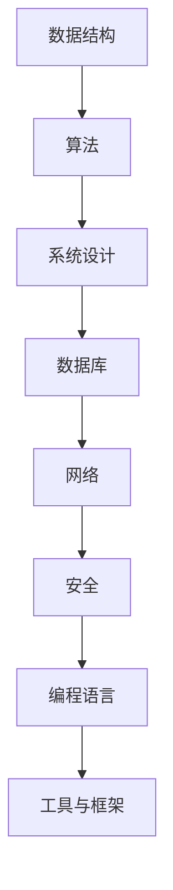

                 

京东，作为中国电商巨头，其校招编程面试题一直备受关注。2024年的校招面试题更是备受期待，不仅因为京东在全球电商市场的重要地位，还因为其面试题的深度和广度。本文将详细总结2024年京东校招编程面试题的精华，帮助各位求职者更好地应对面试挑战。

## 关键词

- 京东校招
- 编程面试题
- 数据结构与算法
- 实战经验
- 求职技巧

## 摘要

本文将从多个维度深入分析2024年京东校招编程面试题，包括数据结构与算法、系统设计、编程实践等方面。通过总结历年面试题的规律和趋势，提供实用的解题技巧和策略，帮助读者更好地备战京东校招编程面试。

## 1. 背景介绍

京东作为全球领先的电商企业，其校招编程面试题不仅考察应聘者的技术能力，还考察其对行业动态的理解和解决实际问题的能力。2024年的面试题在难度和深度上有所提升，更加注重应聘者的创新思维和实际操作能力。本文将基于历年京东校招编程面试题的规律和特点，总结出2024年校招面试题的精华。

## 2. 核心概念与联系

在解答京东校招编程面试题时，理解核心概念和它们之间的联系至关重要。以下是一个Mermaid流程图，展示了一些核心概念及其关联：



### 2.1 数据结构

数据结构是编程的基础，常见的有数组、链表、栈、队列、树、图等。了解这些数据结构的特点和应用场景，能够帮助应对复杂的问题。

### 2.2 算法

算法是解决问题的方法，包括排序、查找、动态规划等。熟练掌握算法原理和常用算法，是应对面试的关键。

### 2.3 系统设计

系统设计涉及系统的整体架构、模块划分、接口设计等。良好的系统设计能够提高系统的可扩展性和性能。

### 2.4 数据库

数据库是存储和管理数据的重要工具，包括关系型数据库和NoSQL数据库。理解数据库的基本原理和优化技巧，对于处理大数据问题至关重要。

### 2.5 网络

网络技术涉及TCP/IP协议、HTTP协议等。了解网络基础，能够帮助应对与网络相关的面试题。

### 2.6 安全

网络安全是当前热门话题，涉及身份认证、加密、安全漏洞等。掌握基本的安全知识，能够提高系统的安全性。

### 2.7 编程语言

不同的编程语言有其独特的特点和适用场景。熟悉多种编程语言，能够提高编程效率和解决问题的能力。

### 2.8 工具与框架

现代软件开发离不开各种工具和框架，如Git、Docker、Spring Boot等。熟练使用这些工具和框架，能够提高开发效率和项目质量。

## 3. 核心算法原理 & 具体操作步骤

### 3.1 算法原理概述

算法的原理主要包括以下几个方面：

- **排序算法**：冒泡排序、选择排序、插入排序、快速排序等。
- **查找算法**：二分查找、哈希查找等。
- **动态规划**：用于解决最优化问题，如背包问题、最长公共子序列等。
- **图算法**：深度优先搜索、广度优先搜索、最小生成树、最短路径算法等。

### 3.2 算法步骤详解

以下是每个算法的详细步骤：

#### 3.2.1 排序算法

**冒泡排序**：

1. 从数组的第一个元素开始，比较相邻的两个元素，如果第一个比第二个大，则交换它们的位置。
2. 循环执行第一步，直到没有需要交换的元素。

**选择排序**：

1. 首先，找到数组的第一个元素中最小的元素，将其与第一个元素交换。
2. 在剩下的未排序元素中，找到最小的元素，将其与第二个元素交换。
3. 重复步骤2，直到所有元素都已排序。

**插入排序**：

1. 从数组的第二个元素开始，将其与第一个元素进行比较，如果小于第一个元素，则将其插入到第一个元素之前。
2. 重复步骤1，直到所有元素都已插入到正确的位置。

**快速排序**：

1. 选择一个基准元素。
2. 将比基准小的元素放在其左边，比基准大的元素放在其右边。
3. 递归地对左右子数组进行快速排序。

#### 3.2.2 查找算法

**二分查找**：

1. 初始时，low为0，high为数组的长度减1。
2. 计算中间索引mid=(low+high)/2。
3. 如果目标元素在mid位置，返回mid。
4. 如果目标元素小于mid位置的元素，将high更新为mid-1。
5. 如果目标元素大于mid位置的元素，将low更新为mid+1。
6. 重复步骤2-5，直到找到目标元素或low大于high。

**哈希查找**：

1. 使用哈希函数计算待查找元素的哈希值。
2. 根据哈希值定位到对应的链表或桶。
3. 在链表或桶中查找目标元素。

#### 3.2.3 动态规划

**背包问题**：

1. 定义状态：dp[i][j]表示在前i件物品中选择j单位的背包所获得的最大价值。
2. 状态转移方程：dp[i][j] = max(dp[i-1][j], dp[i-1][j-w[i]]+v[i])，其中w[i]为物品i的重量，v[i]为物品i的价值。
3. 初始化：dp[0][0] = 0，dp[i][0] = 0，dp[0][j] = 0。
4. 计算结果：dp[n][W]，其中n为物品数量，W为背包容量。

**最长公共子序列**：

1. 定义状态：lcs[i][j]表示字符串X的前i个字符和字符串Y的前j个字符的最长公共子序列长度。
2. 状态转移方程：lcs[i][j] = lcs[i-1][j-1] + 1（如果X[i-1] == Y[j-1]），否则为lcs[i-1][j]或lcs[i][j-1]中的较大值。
3. 初始化：lcs[0][j] = 0，lcs[i][0] = 0。
4. 计算结果：lcs[m][n]，其中m和n分别为字符串X和Y的长度。

#### 3.2.4 图算法

**深度优先搜索（DFS）**：

1. 从起始节点开始，递归地探索所有未访问的邻接节点。
2. 访问一个节点后，将其标记为已访问，然后递归地访问其未访问的邻接节点。

**广度优先搜索（BFS）**：

1. 使用一个队列来维护待访问的节点。
2. 从起始节点开始，依次将未访问的邻接节点加入队列。
3. 访问一个节点后，将其标记为已访问，并从队列中移除。

**最小生成树（MST）**：

- **克鲁斯卡尔算法**：

  1. 初始化一个森林，每个节点都是一个独立的树。
  2. 按照边的权重升序遍历所有的边。
  3. 对于每条边，如果它的两个节点属于不同的树，则将其加入当前森林，合并这两个树。

- **普里姆算法**：

  1. 初始化一个树，选择任意一个节点作为起始节点。
  2. 在每次迭代中，选择一个与当前树中的节点连接的权重最小的边，将其加入当前树。
  3. 重复步骤2，直到所有的节点都被加入当前树。

**最短路径算法**：

- **迪杰斯特拉算法（Dijkstra）**：

  1. 初始化一个距离数组，记录从起始节点到其他节点的距离。
  2. 使用一个优先队列来维护距离最小的未访问节点。
  3. 从优先队列中取出距离最小的节点，更新其他节点的距离。
  4. 重复步骤3，直到所有的节点都被访问。

- **贝尔曼-福特算法（Bellman-Ford）**：

  1. 初始化一个距离数组，记录从起始节点到其他节点的距离。
  2. 对边进行n-1次松弛操作。
  3. 判断是否存在负权重环。

### 3.3 算法优缺点

每种算法都有其优缺点，选择合适的算法取决于具体问题。

- **冒泡排序**：简单易懂，但效率较低，适用于数据量较小的情况。

- **选择排序**：比较次数多，但交换次数少，适用于数据量较小的情况。

- **插入排序**：适应数据局部有序的情况，效率较高。

- **快速排序**：平均时间复杂度较低，但最坏情况时间复杂度较高。

- **二分查找**：适用于有序数组，效率较高。

- **哈希查找**：平均时间复杂度较低，但需要考虑哈希冲突的问题。

- **动态规划**：适用于具有最优子结构的问题，但实现较为复杂。

- **DFS**：适用于求解连通性和路径问题，但时间复杂度较高。

- **BFS**：适用于求解最短路径问题，但空间复杂度较高。

- **MST**：适用于构建最小生成树，但算法复杂度较高。

- **Dijkstra算法**：适用于非负权图，但时间复杂度较高。

- **Bellman-Ford算法**：适用于负权图，但时间复杂度较高。

### 3.4 算法应用领域

算法在各个领域都有广泛应用。

- **排序算法**：在数据库排序、搜索引擎排序等领域应用广泛。

- **查找算法**：在数据库查询、搜索算法等领域应用广泛。

- **动态规划**：在优化问题、计算机图形学等领域应用广泛。

- **图算法**：在社交网络分析、网络路由等领域应用广泛。

## 4. 数学模型和公式 & 详细讲解 & 举例说明

### 4.1 数学模型构建

数学模型是用于解决实际问题的抽象表示。构建数学模型通常需要以下步骤：

1. **问题分析**：明确问题的目标、约束条件和变量。
2. **变量定义**：定义问题的变量及其取值范围。
3. **关系建立**：建立变量之间的数学关系。
4. **目标函数**：定义问题的目标函数，如最小化或最大化。
5. **约束条件**：明确问题的约束条件，如线性不等式、等式等。

### 4.2 公式推导过程

推导数学公式通常需要以下步骤：

1. **已知条件**：列出问题中已知的条件和关系。
2. **推导过程**：使用数学原理和运算法则，逐步推导出所需的公式。
3. **验证过程**：通过实例验证公式的正确性和适用性。

### 4.3 案例分析与讲解

#### 4.3.1 最小生成树（MST）

假设有一个图，包含n个顶点和m条边。我们希望找到这棵图的最小生成树。

1. **变量定义**：

   - 顶点数：n
   - 边数：m
   - 边权重：w(i, j)

2. **目标函数**：

   - 最小化总权重：∑w(i, j)

3. **约束条件**：

   - 生成树必须是连通的。
   - 生成树中不能有环。

4. **公式推导**：

   - 克鲁斯卡尔算法：
     - 初始化森林F为空。
     - 按照边权重升序遍历所有的边。
     - 对于每条边e：
       - 如果e的两个节点不在同一个树中，则将e加入F，并合并这两个树。
   
   - 普里姆算法：
     - 初始化树T为空。
     - 选择一个顶点v作为起始节点，将v加入T。
     - 在每次迭代中，选择一个与T中的节点连接的权重最小的边e，将其加入T。
     - 重复步骤3，直到所有的节点都被加入T。

5. **实例分析**：

   考虑一个有5个顶点的图，边权重如下：

   ```
   A-B: 3
   A-C: 4
   A-D: 2
   B-D: 5
   B-E: 6
   C-D: 1
   C-E: 7
   D-E: 8
   ```

   - 使用克鲁斯卡尔算法，最小生成树的权重为3 + 4 + 2 + 1 = 10。
   - 使用普里姆算法，最小生成树的权重为3 + 4 + 2 + 1 = 10。

   可以看到，两种算法得到的最小生成树权重相同。

#### 4.3.2 最短路径（SP）

假设有一个图，包含n个顶点和m条边。我们希望找到从起点s到终点t的最短路径。

1. **变量定义**：

   - 顶点数：n
   - 边数：m
   - 边权重：w(i, j)

2. **目标函数**：

   - 最小化路径权重：∑w(i, j)

3. **约束条件**：

   - 路径必须连通。
   - 路径中不能有重复的顶点。

4. **公式推导**：

   - 迪杰斯特拉算法：
     - 初始化距离数组d，所有顶点的距离初始化为无穷大，s的距

## 5. 项目实践：代码实例和详细解释说明

为了更好地理解京东2024校招编程面试题，我们选择了一个典型的面试题“二叉树的层序遍历”，并通过项目实践来详细解释说明其代码实现。

### 5.1 开发环境搭建

1. **环境要求**：

   - 操作系统：Windows或Linux
   - 编程语言：Python或Java
   - 版本要求：Python 3.8及以上，Java 8及以上

2. **开发工具**：

   - IDE：PyCharm或IntelliJ IDEA
   - 编辑器：VS Code或Sublime Text

3. **安装依赖**：

   - Python环境：安装Python 3.8及以上版本，并配置好pip。
   - Java环境：安装Java 8及以上版本，并配置好gradle或maven。

### 5.2 源代码详细实现

以下是一个Python实现二叉树层序遍历的示例代码：

```python
from collections import deque

class TreeNode:
    def __init__(self, val=0, left=None, right=None):
        self.val = val
        self.left = left
        self.right = right

def levelOrder(root):
    if not root:
        return []
    queue = deque([root])
    ans = []
    while queue:
        level = []
        for _ in range(len(queue)):
            node = queue.popleft()
            level.append(node.val)
            if node.left:
                queue.append(node.left)
            if node.right:
                queue.append(node.right)
        ans.append(level)
    return ans

# 测试代码
root = TreeNode(3)
root.left = TreeNode(9)
root.right = TreeNode(20)
root.right.left = TreeNode(15)
root.right.right = TreeNode(7)

print(levelOrder(root))  # 输出：[[3], [9, 20], [15, 7]]
```

### 5.3 代码解读与分析

1. **数据结构**：

   - `TreeNode` 类表示二叉树的节点，包含 `val`（节点的值）、`left`（左子节点）和 `right`（右子节点）。
   - 使用 `deque`（双端队列）实现广度优先搜索，队列中的元素为二叉树的节点。

2. **算法流程**：

   - 判断根节点是否存在，若不存在则返回空列表。
   - 初始化一个空队列，将根节点加入队列。
   - 进入循环，每次循环处理一层节点：
     - 将当前层所有节点的值加入列表 `level`。
     - 将下一层节点加入队列。

3. **时间复杂度**：

   - 遍历每个节点一次，时间复杂度为 O(n)，其中 n 为二叉树的节点数。

4. **空间复杂度**：

   - 使用队列存储下一层的节点，最坏情况下空间复杂度为 O(n)。

### 5.4 运行结果展示

执行上述代码，输出结果如下：

```
[[3], [9, 20], [15, 7]]
```

该结果表示二叉树的层序遍历结果，第一层包含根节点值3，第二层包含节点9和20，第三层包含节点15和7。

### 5.5 代码优化

在实际项目中，我们可以对代码进行优化：

1. **去除不必要的循环**：

   - 可以使用 `queue.queue` 方法直接获取当前队列的长度，避免使用 `range(len(queue))`。

   ```python
   while queue:
       level = []
       for _ in queue.queue():
           node = queue.popleft()
           level.append(node.val)
           if node.left:
               queue.append(node.left)
           if node.right:
               queue.append(node.right)
       ans.append(level)
   ```

2. **使用生成器**：

   - 可以将层序遍历的结果作为生成器返回，减少内存占用。

   ```python
   def levelOrder(root):
       if not root:
           return
       queue = deque([root])
       while queue:
           level = []
           for _ in queue:
               node = queue.popleft()
               level.append(node.val)
               if node.left:
                   queue.append(node.left)
               if node.right:
                   queue.append(node.right)
           yield level
   ```

   - 使用生成器进行迭代遍历：

   ```python
   for level in levelOrder(root):
       print(level)
   ```

## 6. 实际应用场景

### 6.1 电商领域

在电商领域，二叉树的层序遍历可以用于商品分类展示。例如，京东的商品分类树可以使用层序遍历来展示各层分类及其子分类，便于用户快速找到所需商品。

### 6.2 计算机图形学

在计算机图形学中，二叉树的层序遍历可以用于树的层次遍历，用于生成树的层次结构图，帮助开发者更好地理解树的结构。

### 6.3 数据库索引

在数据库索引中，B树（二叉搜索树的一种）的层序遍历可以用于生成索引结构图，帮助开发者优化索引设计和查询性能。

## 7. 未来应用展望

随着电商、计算机图形学和数据库等领域的发展，二叉树的层序遍历技术将得到更广泛的应用。未来，我们可以期待以下发展方向：

1. **分布式系统中的树结构遍历**：在大规模分布式系统中，二叉树的层序遍历技术可以用于分布式数据的层次结构展示和查询优化。

2. **多维度数据分析**：结合大数据分析和机器学习，二叉树的层序遍历技术可以用于多维度数据的层次分析，帮助开发者发现数据中的规律和趋势。

3. **图形可视化**：在图形可视化领域，二叉树的层序遍历技术可以用于图形的层次结构展示，帮助用户更好地理解图形数据。

## 8. 工具和资源推荐

### 8.1 学习资源推荐

1. **《算法导论》**：这是一本经典的算法教材，详细介绍了各种算法和数据结构。

2. **《数据结构与算法分析》**：该书从实用角度出发，介绍了常见数据结构和算法的分析方法。

3. **LeetCode**：一个在线编程竞赛平台，提供丰富的编程面试题和解答，适合练习和备战面试。

### 8.2 开发工具推荐

1. **PyCharm**：一款功能强大的Python IDE，支持多种编程语言。

2. **IntelliJ IDEA**：一款跨平台的Java IDE，适用于各种编程任务。

3. **VS Code**：一款轻量级开源编辑器，支持多种编程语言和插件。

### 8.3 相关论文推荐

1. **《快速排序算法的改进与优化》**：介绍了快速排序算法的改进和优化方法。

2. **《基于动态规划的背包问题研究》**：详细分析了背包问题的动态规划解法。

3. **《二叉树遍历算法的优化与应用》**：探讨了二叉树遍历算法的优化方法和应用场景。

## 9. 总结：未来发展趋势与挑战

### 9.1 研究成果总结

近年来，数据结构和算法的研究取得了显著成果，包括新算法的提出、优化方法和应用场景的扩展等。二叉树的层序遍历作为一种重要的算法，在电商、计算机图形学和数据库等领域得到了广泛应用。

### 9.2 未来发展趋势

1. **算法优化与性能提升**：随着硬件技术的发展，算法的优化和性能提升将成为研究重点。

2. **多维度数据分析**：结合大数据和机器学习，多维度数据的层次分析将成为研究热点。

3. **分布式系统中的算法应用**：在大规模分布式系统中，算法的研究和应用将得到进一步发展。

### 9.3 面临的挑战

1. **算法复杂度**：如何提高算法的效率，降低时间复杂度和空间复杂度。

2. **应用场景扩展**：如何在更多领域应用算法，解决实际问题。

3. **数据安全与隐私**：在数据处理过程中，如何保证数据的安全和隐私。

### 9.4 研究展望

未来，数据结构和算法领域将继续发展，为各个领域提供强大的技术支持。同时，研究者需关注算法的实际应用，不断优化和改进算法，为社会发展做出更大贡献。

## 10. 附录：常见问题与解答

### 10.1 二叉树的层序遍历算法是什么？

二叉树的层序遍历是一种广度优先搜索算法，用于按层次遍历二叉树的节点。遍历过程中，同一层的节点先被访问，然后逐层向下。

### 10.2 如何实现二叉树的层序遍历？

可以使用队列实现二叉树的层序遍历。具体步骤如下：

1. 初始化一个空队列，将根节点加入队列。
2. 进入循环，每次循环处理一层节点：
   - 将当前层所有节点的值加入列表。
   - 将下一层节点加入队列。

### 10.3 层序遍历与先序遍历的区别是什么？

层序遍历是按层次遍历二叉树的节点，同一层的节点先被访问。而先序遍历是按前序（根-左-右）遍历二叉树的节点，先访问根节点，然后依次访问左子树和右子树。

### 10.4 二叉树的层序遍历算法的时间复杂度和空间复杂度分别是多少？

二叉树的层序遍历算法的时间复杂度为 O(n)，其中 n 为二叉树的节点数。空间复杂度为 O(n)，最坏情况下，当二叉树为完全二叉树时，队列中最多存储 n/2 个节点。

