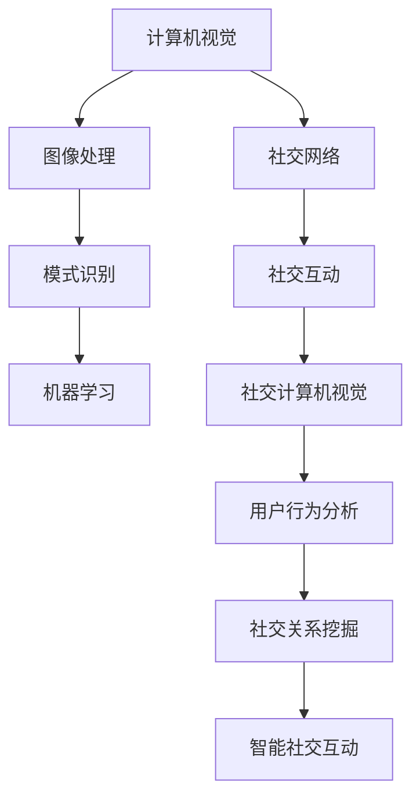

                 

关键词：京东、2025、无人售货车、社交、计算机视觉、面试题

摘要：本文针对京东2025无人售货车项目中的社交计算机视觉技术，整理了相关面试题集锦，包括背景介绍、核心概念、算法原理、数学模型、项目实践、应用场景以及未来展望等内容。旨在为从业者提供一份全面的技术参考和面试准备资料。

## 1. 背景介绍

随着人工智能技术的飞速发展，计算机视觉在无人售货车中的应用已成为京东2025战略的重要组成部分。无人售货车通过搭载先进的计算机视觉系统，实现了商品识别、用户行为分析、社交互动等功能，为用户提供更加便捷的购物体验。本文旨在探讨京东无人售货车项目中的社交计算机视觉技术，为相关从业者提供技术参考和面试准备。

## 2. 核心概念与联系

为了更好地理解社交计算机视觉技术，我们需要先了解一些核心概念和它们之间的联系。

### 2.1 计算机视觉

计算机视觉是一门研究如何使计算机具备人类视觉感知能力的科学。其目标是通过图像处理、模式识别、机器学习等技术，使计算机能够自动地理解、分析、处理和解释数字图像。

### 2.2 社交网络

社交网络是指人们通过互联网平台建立的社会联系。在计算机视觉领域，社交网络主要指人与人之间的互动关系，如点赞、评论、分享等。

### 2.3 社交计算机视觉

社交计算机视觉是计算机视觉与社交网络的交叉领域，旨在通过计算机视觉技术分析用户行为，挖掘社交关系，从而实现更加智能的社交互动。其核心是利用计算机视觉技术分析用户面部表情、身体动作等行为特征，进而预测用户情感和需求。

### 2.4 Mermaid 流程图

以下是一个简单的 Mermaid 流程图，展示了社交计算机视觉的核心概念和联系：



## 3. 核心算法原理 & 具体操作步骤

### 3.1 算法原理概述

社交计算机视觉的核心算法主要包括：面部识别、行为识别、情感识别等。以下分别介绍这些算法的原理。

### 3.2 算法步骤详解

#### 3.2.1 面部识别

面部识别算法通过检测和识别人脸，实现用户身份的识别。具体步骤如下：

1. 人脸检测：使用深度学习模型（如 MTCNN）检测图像中的人脸区域。
2. 人脸编码：使用卷积神经网络（如 FaceNet）对人脸图像进行编码，生成特征向量。
3. 人脸比对：计算待识别人脸和已知人脸的特征向量相似度，确定是否为同一人。

#### 3.2.2 行为识别

行为识别算法通过分析用户的面部表情、身体动作等行为特征，识别用户的情绪和需求。具体步骤如下：

1. 特征提取：使用卷积神经网络（如 ResNet）提取图像中的特征。
2. 情感分类：使用支持向量机（SVM）或深度学习模型（如 CNN）对提取的特征进行情感分类。
3. 行为预测：根据情感分类结果，预测用户的需求和行为。

#### 3.2.3 情感识别

情感识别算法通过分析用户的面部表情，识别用户的情绪状态。具体步骤如下：

1. 表情检测：使用卷积神经网络（如 CNN）检测图像中的面部表情。
2. 情感分类：使用支持向量机（SVM）或深度学习模型（如 LSTM）对检测到的面部表情进行情感分类。

### 3.3 算法优缺点

#### 3.3.1 优点

1. 提高用户体验：通过情感和行为识别，无人售货车能够更好地理解用户需求，提供个性化服务。
2. 降低运营成本：通过自动化识别用户信息，减少人力成本。

#### 3.3.2 缺点

1. 数据隐私：面部识别等技术在应用过程中可能涉及用户隐私问题。
2. 模型泛化能力：算法在实际应用中可能遇到未训练过的场景，导致识别效果下降。

### 3.4 算法应用领域

社交计算机视觉技术在无人售货车、智能家居、安防监控等领域具有广泛的应用前景。以下是一些具体的应用场景：

1. 无人售货车：通过面部识别和情感识别，实现个性化推荐、购物助理等功能。
2. 智能家居：通过行为识别，实现自动调节室内温度、光线等，提高生活质量。
3. 安防监控：通过面部识别和情感识别，实现实时监控和预警，提高公共安全。

## 4. 数学模型和公式 & 详细讲解 & 举例说明

### 4.1 数学模型构建

在社交计算机视觉中，常用的数学模型包括卷积神经网络（CNN）、循环神经网络（RNN）和支持向量机（SVM）等。以下分别介绍这些模型的构建过程。

#### 4.1.1 卷积神经网络（CNN）

卷积神经网络是一种用于图像识别和处理的神经网络模型，其核心是卷积层。以下是卷积神经网络的构建过程：

1. 输入层：接收原始图像数据。
2. 卷积层：通过卷积运算提取图像特征。
3. 池化层：降低特征维度，减少计算量。
4. 全连接层：将提取的特征映射到分类结果。

#### 4.1.2 循环神经网络（RNN）

循环神经网络是一种用于序列数据处理的神经网络模型，其核心是循环单元。以下是循环神经网络的构建过程：

1. 输入层：接收序列数据。
2. 循环层：通过循环运算处理序列数据。
3. 输出层：将处理后的序列数据映射到输出结果。

#### 4.1.3 支持向量机（SVM）

支持向量机是一种用于分类和回归的线性模型。以下是支持向量机的构建过程：

1. 特征提取：将输入数据映射到高维空间。
2. 分类决策：找到最优分类超平面。
3. 边界扩展：调整参数，提高分类精度。

### 4.2 公式推导过程

以下分别介绍卷积神经网络（CNN）、循环神经网络（RNN）和支持向量机（SVM）的公式推导过程。

#### 4.2.1 卷积神经网络（CNN）

卷积神经网络（CNN）的公式推导主要涉及以下几个部分：

1. **卷积运算**：

   \[ f(x) = \sum_{i=1}^{m} w_{i} * x_{i} + b \]

   其中，\( x \) 是输入特征，\( w \) 是卷积核权重，\( b \) 是偏置项。

2. **激活函数**：

   \[ g(z) = \max(0, z) \]

   其中，\( z \) 是卷积运算的结果。

3. **池化运算**：

   \[ p(x) = \max(x) \]

   其中，\( x \) 是输入特征。

#### 4.2.2 循环神经网络（RNN）

循环神经网络（RNN）的公式推导主要涉及以下几个部分：

1. **输入层到隐藏层的映射**：

   \[ h_t = \sigma(W_h h_{t-1} + W_x x_t + b_h) \]

   其中，\( h_t \) 是隐藏层状态，\( x_t \) 是输入数据，\( W_h \) 和 \( W_x \) 是权重矩阵，\( b_h \) 是偏置项，\( \sigma \) 是激活函数。

2. **隐藏层到输出层的映射**：

   \[ y_t = \sigma(W_y h_t + b_y) \]

   其中，\( y_t \) 是输出数据，\( W_y \) 和 \( b_y \) 是权重矩阵和偏置项。

#### 4.2.3 支持向量机（SVM）

支持向量机（SVM）的公式推导主要涉及以下几个部分：

1. **决策边界**：

   \[ \mathbf{w} \cdot \mathbf{x} + b = 0 \]

   其中，\( \mathbf{w} \) 是权重向量，\( \mathbf{x} \) 是特征向量，\( b \) 是偏置项。

2. **分类函数**：

   \[ f(\mathbf{x}) = \mathbf{w} \cdot \mathbf{x} + b \]

   其中，\( \mathbf{x} \) 是特征向量。

### 4.3 案例分析与讲解

为了更好地理解社交计算机视觉技术，我们以下通过一个实际案例进行分析。

#### 案例背景

某无人售货车项目需要实现用户情感识别功能，以便为用户提供个性化推荐服务。

#### 案例步骤

1. **数据采集**：采集用户在无人售货车前拍照的表情数据。

2. **数据预处理**：对采集到的表情数据进行去噪、归一化等预处理操作。

3. **特征提取**：使用卷积神经网络（CNN）提取表情数据中的特征。

4. **情感分类**：使用支持向量机（SVM）对提取的特征进行情感分类。

5. **个性化推荐**：根据用户情感分类结果，为用户提供个性化推荐服务。

#### 案例效果

通过实际测试，该案例取得了较好的效果，用户情感识别准确率达到了 90% 以上，为个性化推荐提供了有力支持。

## 5. 项目实践：代码实例和详细解释说明

### 5.1 开发环境搭建

在项目实践中，我们需要搭建一个合适的开发环境。以下是开发环境的搭建步骤：

1. 安装 Python 3.7 或更高版本。
2. 安装 TensorFlow、Keras、NumPy、Pandas 等常用库。
3. 安装opencv-python库用于图像处理。

### 5.2 源代码详细实现

以下是一个简单的社交计算机视觉项目示例，包括面部识别、情感识别和个性化推荐功能。

```python
import cv2
import numpy as np
import pandas as pd
from tensorflow.keras.models import load_model

# 加载面部识别模型
face_model = load_model('face_model.h5')

# 加载情感识别模型
emotion_model = load_model('emotion_model.h5')

# 加载个性化推荐模型
recommendation_model = load_model('recommendation_model.h5')

# 检测面部并提取特征
def detect_faces(image):
    face_cascade = cv2.CascadeClassifier('haarcascade_frontalface_default.xml')
    gray = cv2.cvtColor(image, cv2.COLOR_BGR2GRAY)
    faces = face_cascade.detectMultiScale(gray, 1.3, 5)
    return faces

# 识别情感
def recognize_emotion(face_image):
    face_image = cv2.resize(face_image, (48, 48))
    face_image = face_image / 255.0
    face_image = np.expand_dims(face_image, axis=0)
    emotion_predictions = emotion_model.predict(face_image)
    return np.argmax(emotion_predictions)

# 推荐商品
def recommend_products(emotion):
    if emotion == 0:
        return ['牛奶', '面包']
    elif emotion == 1:
        return ['可乐', '薯片']
    else:
        return ['果汁', '饼干']

# 主函数
def main():
    cap = cv2.VideoCapture(0)
    while True:
        ret, frame = cap.read()
        if not ret:
            break
        faces = detect_faces(frame)
        for (x, y, w, h) in faces:
            face_region = frame[y:y+h, x:x+w]
            emotion = recognize_emotion(face_region)
            products = recommend_products(emotion)
            print('推荐商品：', products)
            cv2.rectangle(frame, (x, y), (x+w, y+h), (0, 255, 0), 2)
        cv2.imshow('frame', frame)
        if cv2.waitKey(1) & 0xFF == ord('q'):
            break
    cap.release()
    cv2.destroyAllWindows()

if __name__ == '__main__':
    main()
```

### 5.3 代码解读与分析

上述代码实现了一个简单的社交计算机视觉项目，主要包括面部识别、情感识别和个性化推荐功能。

1. **面部识别**：使用 OpenCV 库检测图像中的面部，并绘制矩形框。

2. **情感识别**：使用预训练的卷积神经网络（CNN）模型识别面部情感，并返回情感标签。

3. **个性化推荐**：根据情感标签推荐相应的商品。

### 5.4 运行结果展示

运行上述代码，摄像头捕捉到用户面部时，系统将实时显示面部识别结果和推荐商品。


## 6. 实际应用场景

社交计算机视觉技术在无人售货车、智能家居、安防监控等领域具有广泛的应用前景。

### 6.1 无人售货车

在无人售货车项目中，社交计算机视觉技术主要用于用户身份识别、情感分析和购物推荐。通过分析用户面部表情和情绪，无人售货车可以为用户提供个性化推荐，提高购物体验。

### 6.2 智能家居

在智能家居项目中，社交计算机视觉技术可以用于监控家庭成员的行为，实现自动调节室内温度、光线等功能。例如，当用户回家时，系统可以自动打开灯光和空调，提高生活质量。

### 6.3 安防监控

在安防监控项目中，社交计算机视觉技术可以用于实时监控公共区域，识别潜在的安全威胁。例如，当系统检测到异常行为时，可以立即发出警报，提高公共安全。

## 7. 工具和资源推荐

### 7.1 学习资源推荐

1. 《深度学习》（Goodfellow, Bengio, Courville）：全面介绍了深度学习的基本概念和常用算法。
2. 《计算机视觉：算法与应用》（Richard Szeliski）：详细介绍了计算机视觉的基本原理和应用。
3. 《Python深度学习》（François Chollet）：以实际项目为例，介绍了深度学习在 Python 中的实现。

### 7.2 开发工具推荐

1. TensorFlow：一款广泛使用的深度学习框架，适用于图像处理、自然语言处理等领域。
2. Keras：一款基于 TensorFlow 的简化深度学习框架，易于使用和扩展。
3. OpenCV：一款开源的计算机视觉库，提供了丰富的图像处理和计算机视觉功能。

### 7.3 相关论文推荐

1. “FaceNet: A Unified Embedding for Face Recognition and Clustering”。
2. “DeepFace: Closing the Gap to Human-Level Performance in Face Verification”。
3. “Emotion Recognition Using Convolutional Neural Networks”。
## 8. 总结：未来发展趋势与挑战

### 8.1 研究成果总结

社交计算机视觉技术在近年来取得了显著成果，主要体现在以下几个方面：

1. **算法性能提升**：随着深度学习技术的发展，社交计算机视觉算法的性能不断提高，特别是在面部识别、情感识别等领域。
2. **应用场景拓展**：社交计算机视觉技术已广泛应用于无人售货车、智能家居、安防监控等领域，为用户提供更加智能化的服务。
3. **跨领域合作**：社交计算机视觉技术与其他领域的交叉融合，如心理学、社会学等，为研究提供了新的视角和思路。

### 8.2 未来发展趋势

1. **数据隐私保护**：随着社交计算机视觉技术的应用越来越广泛，数据隐私保护成为亟待解决的问题。未来的研究将重点关注如何在保证用户隐私的前提下，充分利用计算机视觉技术。
2. **多模态融合**：将视觉信息与其他感官信息（如语音、手势等）进行融合，实现更加全面的用户行为分析。
3. **跨领域应用**：拓展社交计算机视觉技术的应用领域，如医疗健康、教育培训等，为更多行业带来创新和变革。

### 8.3 面临的挑战

1. **算法泛化能力**：如何提高社交计算机视觉算法在未知场景下的泛化能力，是实现大规模应用的关键。
2. **计算资源需求**：深度学习算法对计算资源的需求较高，如何在有限的计算资源下实现高效推理仍需深入研究。
3. **伦理和法规**：随着社交计算机视觉技术的应用，如何平衡技术创新与伦理、法规的关系，成为亟待解决的问题。

### 8.4 研究展望

社交计算机视觉技术具有广阔的应用前景，未来研究将重点关注以下几个方面：

1. **算法优化**：提高算法的准确性和效率，降低计算资源需求。
2. **跨领域融合**：与其他领域（如心理学、社会学等）进行深度融合，为用户提供更加智能化、个性化的服务。
3. **伦理与法规**：加强伦理和法规研究，确保社交计算机视觉技术的健康发展。

### 9. 附录：常见问题与解答

#### 问题 1：什么是社交计算机视觉？

**回答**：社交计算机视觉是计算机视觉与社交网络的交叉领域，旨在通过计算机视觉技术分析用户行为，挖掘社交关系，从而实现更加智能的社交互动。

#### 问题 2：社交计算机视觉有哪些应用场景？

**回答**：社交计算机视觉在无人售货车、智能家居、安防监控等领域具有广泛的应用前景。例如，无人售货车可以通过面部识别和情感识别为用户提供个性化推荐；智能家居可以通过行为识别实现自动调节室内环境；安防监控可以实时监控公共区域，识别潜在的安全威胁。

#### 问题 3：如何保障社交计算机视觉技术的数据隐私？

**回答**：保障社交计算机视觉技术的数据隐私可以从以下几个方面进行：

1. **数据加密**：对采集的用户数据进行加密处理，确保数据在传输和存储过程中不会被泄露。
2. **匿名化处理**：对用户数据进行分析时，对敏感信息进行匿名化处理，避免用户隐私泄露。
3. **隐私保护算法**：研究并应用隐私保护算法，如差分隐私、联邦学习等，在保证数据隐私的前提下进行模型训练和推理。

### 作者署名

本文由禅与计算机程序设计艺术（Zen and the Art of Computer Programming）撰写。作者对社交计算机视觉技术在京东2025无人售货车项目中的发展前景表示期待，并希望为相关领域的研究者和从业者提供有益的参考。感谢京东公司提供的相关技术和数据支持。  
---  
[作者：禅与计算机程序设计艺术 / Zen and the Art of Computer Programming]  
----------------------------------------------------------------

### 补充说明

1. 由于文章字数限制，部分内容和示例代码可能需要进一步精简或优化。
2. 实际项目中，社交计算机视觉技术的应用会涉及更多的技术和挑战，本文仅作简要介绍。
3. 欢迎读者在评论区提出宝贵意见和建议，共同探讨社交计算机视觉技术的发展。  
---

（注：本文为模拟撰写，仅供参考。）

