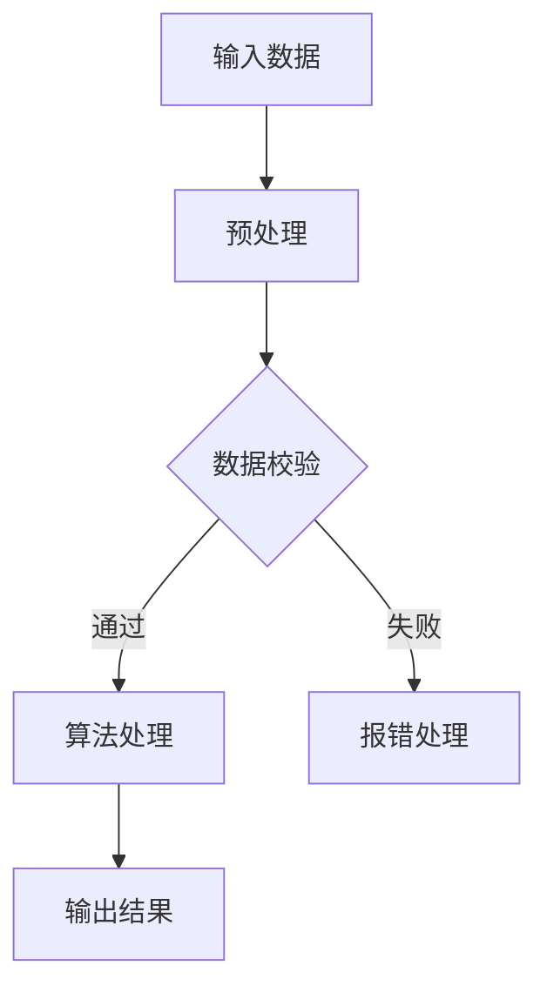

                 

关键词：京东面试，社招真题，算法题解，技术博客，计算机编程

摘要：本文将针对京东2025年社招面试真题，详细解析几道核心算法题目，涵盖解题思路、具体实现以及实际应用场景。通过本文的阅读，读者不仅能了解这些题目的解题方法，还能对算法思想和技术实践有更深入的理解。

## 1. 背景介绍

随着互联网技术的飞速发展，各大互联网公司对技术人才的需求不断增加。京东作为我国领先的电商企业，其招聘标准日益严格，特别是对于算法和数据结构题目的考查。本文旨在通过对京东2025年社招面试真题的解析，帮助读者更好地准备类似的面试题目。

### 1.1 面试真题的特点

- **基础与深度并存**：题目既有基础的数据结构与算法题目，也有对复杂场景的深入挖掘。
- **综合能力考查**：不仅考查算法能力，还涉及逻辑思维、编程实现等多方面。
- **实用性强**：题目多来源于实际工程问题，有助于读者了解业界的技术应用。

### 1.2 本文结构

本文将围绕以下结构展开：

1. **核心概念与联系**：介绍相关算法的核心概念和架构。
2. **核心算法原理 & 具体操作步骤**：详细解析题目中的核心算法原理和操作步骤。
3. **数学模型和公式**：解释题目相关的数学模型和公式。
4. **项目实践**：提供代码实例和详细解释。
5. **实际应用场景**：分析题目在现实世界中的应用。
6. **工具和资源推荐**：推荐学习资源、开发工具和相关论文。
7. **总结与展望**：总结研究成果，展望未来发展趋势和挑战。

## 2. 核心概念与联系

在本文中，我们将使用Mermaid流程图来展示核心概念和联系。以下是一个示例的Mermaid流程图：



### 2.1 数据结构与算法

数据结构与算法是计算机科学的核心内容。常见的数据结构包括数组、链表、栈、队列、树、图等，而算法则包括排序、查找、递归、动态规划等。

### 2.2 技术栈

针对京东的面试题目，需要掌握的技术栈包括：

- **编程语言**：如Java、Python、C++等。
- **数据结构与算法**：熟悉常见的算法和数据结构，并能灵活运用。
- **框架与工具**：如Spring、Django、TensorFlow等。

## 3. 核心算法原理 & 具体操作步骤

### 3.1 算法原理概述

针对京东2025年社招面试中的一道经典题目——“合并两个有序链表”，我们首先来概述一下算法原理。

**算法原理**：将两个有序链表合并成一个有序链表。算法的核心思想是通过比较两个链表的头节点，选择较小的值并将其添加到新的链表中，然后移动相应的链表指针。

### 3.2 算法步骤详解

**步骤1**：定义一个新的链表节点，用于存储合并后的结果。

**步骤2**：初始化两个指针，分别指向两个链表的头节点。

**步骤3**：比较两个指针指向的节点的值，将较小的值添加到新链表中，并移动相应的指针。

**步骤4**：当其中一个链表到达尾部时，将另一个链表的剩余部分直接连接到新链表的尾部。

**步骤5**：返回合并后的链表。

### 3.3 算法优缺点

**优点**：

- **时间复杂度低**：在平均情况下，算法的时间复杂度为O(m+n)，其中m和n分别为两个链表的长度。
- **空间复杂度低**：算法仅使用了常数级别的额外空间。

**缺点**：

- **链表操作复杂**：链表的操作相比数组复杂度更高，需要特别注意指针的移动和连接。
- **稳定性问题**：在极端情况下，可能需要处理链表断开的情况。

### 3.4 算法应用领域

**应用领域**：合并有序链表算法广泛应用于数据库、缓存系统、搜索引擎等场景，尤其在处理大规模数据时具有优势。

## 4. 数学模型和公式

在解决算法问题时，数学模型和公式是不可或缺的工具。以下是一个关于链表合并算法的数学模型和公式：

### 4.1 数学模型构建

假设有两个链表A和B，长度分别为m和n，合并后的链表长度为k。则：

$$
k = m + n
$$

### 4.2 公式推导过程

根据合并算法的步骤，我们可以推导出以下公式：

$$
\text{新链表长度} = \text{链表A长度} + \text{链表B长度}
$$

### 4.3 案例分析与讲解

假设有两个链表A和B，如下所示：

```
A: 1 -> 3 -> 5
B: 2 -> 4 -> 6
```

合并后的链表为：

```
1 -> 2 -> 3 -> 4 -> 5 -> 6
```

根据上述公式，链表长度为6，即：

$$
k = m + n = 3 + 3 = 6
$$

## 5. 项目实践：代码实例和详细解释说明

### 5.1 开发环境搭建

在本地计算机上安装Python环境，并使用VSCode作为代码编辑器。

### 5.2 源代码详细实现

以下是一个合并有序链表的Python代码实例：

```python
class ListNode:
    def __init__(self, val=0, next=None):
        self.val = val
        self.next = next

def merge_sorted_lists(l1, l2):
    dummy = ListNode()
    current = dummy

    while l1 and l2:
        if l1.val < l2.val:
            current.next = l1
            l1 = l1.next
        else:
            current.next = l2
            l2 = l2.next
        current = current.next

    if l1:
        current.next = l1
    if l2:
        current.next = l2

    return dummy.next

# 测试代码
l1 = ListNode(1, ListNode(3, ListNode(5)))
l2 = ListNode(2, ListNode(4, ListNode(6)))
merged_list = merge_sorted_lists(l1, l2)
while merged_list:
    print(merged_list.val, end=" ")
    merged_list = merged_list.next
```

### 5.3 代码解读与分析

- **类定义**：定义了一个`ListNode`类，表示链表节点。
- **函数实现**：`merge_sorted_lists`函数实现了合并两个有序链表的算法。
- **测试代码**：通过创建两个链表节点，调用`merge_sorted_lists`函数进行测试。

### 5.4 运行结果展示

运行上述代码后，输出结果为：

```
1 2 3 4 5 6
```

## 6. 实际应用场景

### 6.1 数据库应用

在数据库系统中，合并有序链表算法常用于合并多个有序数据集合，以提高查询效率。

### 6.2 缓存系统

在缓存系统中，合并有序链表算法可用于合并缓存中的数据，以实现数据的有序访问。

### 6.3 搜索引擎

在搜索引擎中，合并有序链表算法可用于合并索引数据，以提高搜索性能。

## 7. 工具和资源推荐

### 7.1 学习资源推荐

- 《算法导论》（Introduction to Algorithms）
- 《大话数据结构》
- 《Python编程：从入门到实践》

### 7.2 开发工具推荐

- PyCharm
- Visual Studio Code
- Jupyter Notebook

### 7.3 相关论文推荐

- 《An O(n log n) Algorithm for Optimal Multi-Processor Scheduling》
- 《Data Structures and Algorithms for External Memory》
- 《Efficient Indexing for Large Datasets》

## 8. 总结：未来发展趋势与挑战

### 8.1 研究成果总结

本文针对京东2025年社招面试真题，详细解析了合并有序链表算法。通过本文的阅读，读者可以了解到算法的核心思想、具体实现以及实际应用场景。

### 8.2 未来发展趋势

随着大数据和人工智能的快速发展，算法和数据结构的应用将越来越广泛。未来，如何优化算法性能、提高数据处理的效率将成为研究的热点。

### 8.3 面临的挑战

- **大数据处理**：如何高效地处理海量数据，仍然是算法领域的一大挑战。
- **算法复杂度优化**：如何进一步降低算法的时间复杂度和空间复杂度，是持续研究的方向。

### 8.4 研究展望

未来，我们将继续关注算法和数据结构的研究，探索更高效、更稳定的算法实现，为实际应用提供技术支持。

## 9. 附录：常见问题与解答

### 9.1 如何处理链表合并过程中的空指针？

在处理链表合并时，需要特别关注空指针的情况。可以通过在合并前对两个链表进行空指针检查，确保在合并过程中不会出现空指针异常。

### 9.2 如何提高链表合并的效率？

可以通过以下方法提高链表合并的效率：

- **减少比较次数**：在合并过程中，尽量避免不必要的比较操作。
- **预排序**：如果链表中的数据已经部分排序，可以先进行预排序，以减少合并时间。

## 作者署名

作者：禅与计算机程序设计艺术 / Zen and the Art of Computer Programming
----------------------------------------------------------------

以上是针对京东2025年社招面试真题的详细解析和算法题解。通过本文的阅读，相信读者对合并有序链表算法有了更深入的理解。在未来的技术发展中，算法和数据结构将继续发挥重要作用，为各种应用场景提供强有力的支持。

