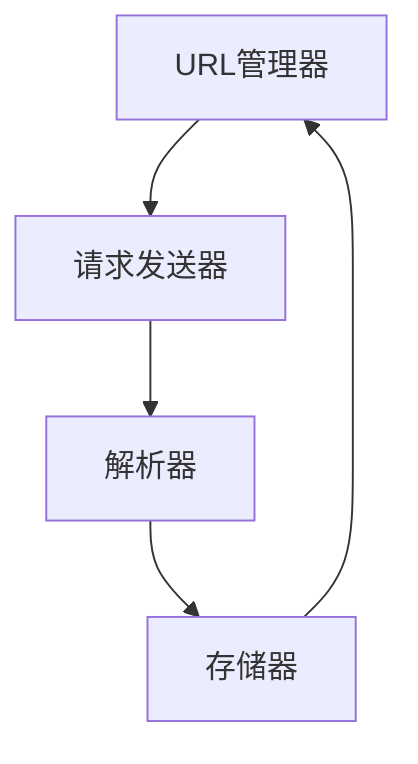

                 

### 1. 背景介绍

随着互联网的快速发展，电子商务行业成为了全球增长最快的行业之一。作为电子商务巨头之一，京东（JD.com）拥有庞大的商品数据库，涵盖了各种商品类别，从日用品到高科技产品，从书籍到服装鞋帽。这些数据对于市场分析、消费者行为研究和商业策略制定具有重要意义。因此，如何高效地获取和处理京东商品数据成为了众多数据科学家和软件开发者的关注点。

网络爬虫（Web Crawler）作为自动化数据采集工具，通过对互联网上公开信息的抓取，为各类应用提供了丰富的数据来源。在电子商务领域，网络爬虫的应用尤为广泛，例如用于商品信息收集、价格监控、市场调研等。京东商品数据网络爬虫的设计与实现，不仅有助于获取有用的商业信息，还能为学术界提供研究数据，促进人工智能和机器学习技术的发展。

本文旨在探讨如何设计一个高效、稳定、合法的京东商品数据网络爬虫。首先，我们将介绍网络爬虫的基本概念、工作原理及其在数据采集中的应用。接着，我们将深入分析京东商品数据的特点，并提出相应的爬虫设计策略。此外，本文还将讨论常见的网络爬虫技术，如请求头设置、延迟策略、错误处理等，并分享一个具体的实现案例。最后，我们将探讨京东商品数据网络爬虫在实际应用中的意义和未来发展方向。

通过本文的阅读，读者将能够了解网络爬虫的基本原理，掌握设计京东商品数据网络爬虫的方法和技巧，并认识到其在数据采集领域的重要价值。同时，本文也将为有志于从事网络爬虫开发和技术研究的人员提供有价值的参考和启示。

### 2. 核心概念与联系

在设计京东商品数据网络爬虫之前，我们需要了解一些核心概念及其相互联系。以下内容将介绍网络爬虫的基本原理、工作流程以及京东商品数据的特点，并通过Mermaid流程图详细展示爬虫的架构和流程。

#### 2.1 网络爬虫基本原理

网络爬虫（Web Crawler）是一种自动化的网络数据采集工具，它模拟用户的浏览器行为，通过网络链接逐一抓取网页内容，并将有价值的数据提取出来。网络爬虫的核心原理包括以下几部分：

1. **URL管理器**：负责维护和管理待抓取的URL队列，已抓取的URL队列，以及已处理过的URL队列。
2. **请求发送器**：根据URL管理器提供的URL，发送HTTP请求到相应的网站，获取网页内容。
3. **解析器**：对获取到的网页内容进行解析，提取出有用的数据，如商品名称、价格、描述等。
4. **存储器**：将解析得到的数据存储到数据库或其他存储介质中，以便后续分析和使用。

#### 2.2 网络爬虫工作流程

网络爬虫的工作流程主要包括以下几个步骤：

1. **初始化**：初始化URL管理器、请求发送器、解析器和存储器，并将起始URL（种子URL）添加到待抓取队列中。
2. **请求发送**：请求发送器根据待抓取队列中的URL发送HTTP请求，获取网页内容。
3. **网页解析**：解析器对获取到的网页内容进行解析，提取出有用的数据，并将新的URL添加到待抓取队列中。
4. **数据存储**：将解析得到的数据存储到存储器中，以便后续处理。
5. **重复步骤**：重复执行请求发送、网页解析和数据存储步骤，直到待抓取队列中的URL耗尽。

#### 2.3 京东商品数据特点

京东商品数据具有以下特点：

1. **数据量大**：京东拥有庞大的商品数据库，每天新增和更新的商品信息数量巨大。
2. **结构化数据**：京东的商品信息通常以结构化的形式展示，如商品名称、价格、描述、图片等，便于爬虫解析。
3. **动态加载**：部分商品信息可能通过JavaScript动态加载，需要使用爬虫技术中的“模拟浏览器行为”功能进行获取。
4. **反爬机制**：京东可能采用各种反爬机制，如IP封锁、验证码、登录验证等，需要设计相应的策略绕过这些机制。

#### 2.4 爬虫架构与流程图

以下是一个简单的网络爬虫架构和流程图，展示了京东商品数据爬虫的主要组成部分及其相互关系。



流程图详细描述如下：

1. **初始化**：爬虫初始化后，将种子URL添加到待抓取队列。
2. **请求发送**：爬虫从待抓取队列中取出URL，发送HTTP请求获取网页内容。
3. **网页解析**：爬虫对获取到的网页内容进行解析，提取商品信息，并获取新的URL。
4. **数据存储**：爬虫将提取到的商品信息存储到数据库或其他存储介质中。
5. **重复步骤**：爬虫重复执行请求发送、网页解析和数据存储步骤，直到待抓取队列中的URL耗尽。

通过以上介绍，我们可以看出，网络爬虫的设计与实现需要综合考虑多个方面，包括数据来源、抓取策略、数据解析和存储等。在接下来的章节中，我们将深入探讨具体的爬虫实现技术，包括请求头设置、延迟策略、错误处理等。

### 3. 核心算法原理 & 具体操作步骤

#### 3.1 算法原理概述

京东商品数据网络爬虫的核心算法主要包括以下几个部分：请求头设置、延迟策略、错误处理和数据存储。以下是对这些算法原理的概述。

1. **请求头设置**：请求头（HTTP Headers）是HTTP请求的重要组成部分，用于传递各种控制信息和元数据。在爬虫中，合理设置请求头可以帮助我们绕过一些简单的反爬机制，如IP封锁和验证码。常见的请求头设置包括User-Agent、Accept、Referer等。

2. **延迟策略**：由于爬虫在抓取大量数据时会对服务器产生较大压力，为了避免被服务器封锁IP，需要设置合适的延迟策略。延迟策略可以通过随机化访问时间、使用代理IP等方式实现。

3. **错误处理**：网络爬虫在运行过程中可能会遇到各种错误，如网络连接失败、网页解析失败等。合理的错误处理机制可以确保爬虫的稳定性和可靠性，避免因为单次错误导致整个爬虫失败。

4. **数据存储**：爬虫获取到的数据需要存储到数据库或其他存储介质中，以便后续分析和处理。常见的存储技术包括关系型数据库（如MySQL）、NoSQL数据库（如MongoDB）以及文件存储等。

#### 3.2 算法步骤详解

以下详细描述京东商品数据网络爬虫的算法步骤，包括请求发送、网页解析和数据存储等。

##### 3.2.1 请求发送

1. **初始化请求头**：设置合适的User-Agent、Accept、Referer等请求头信息，以模拟正常浏览器的行为。
   ```python
   headers = {
       'User-Agent': 'Mozilla/5.0 (Windows NT 10.0; Win64; x64) AppleWebKit/537.36 (KHTML, like Gecko) Chrome/58.0.3029.110 Safari/537.3'
   }
   ```

2. **获取种子URL**：从配置文件或数据库中读取种子URL，并将其添加到待抓取队列。
   ```python
   url_queue = ['https://item.jd.com/10000001980672.html']
   ```

3. **发送请求**：从待抓取队列中取出URL，使用HTTP库（如requests）发送GET请求，获取网页内容。
   ```python
   response = requests.get(url, headers=headers)
   ```

##### 3.2.2 网页解析

1. **解析网页内容**：使用HTML解析库（如BeautifulSoup）对获取到的网页内容进行解析，提取出商品信息。
   ```python
   soup = BeautifulSoup(response.text, 'lxml')
   title = soup.find('div', class_='sku-name').text
   price = soup.find('div', class_='p-price').text
   ```

2. **提取URL**：解析网页内容，找到包含商品链接的标签（如`a`标签），并将其URL添加到待抓取队列中。
   ```python
   for link in soup.find_all('a', href=True):
       new_url = link['href']
       if new_url.startswith('https://item.jd.com/'):
           url_queue.append(new_url)
   ```

##### 3.2.3 数据存储

1. **初始化数据库连接**：根据数据存储的需求，初始化数据库连接（如MySQL或MongoDB）。
   ```python
   import pymysql
   connection = pymysql.connect(
       host='localhost',
       user='root',
       password='password',
       database='jd_data',
       charset='utf8mb4'
   )
   ```

2. **插入数据**：将解析得到的商品信息插入到数据库中。
   ```python
   with connection.cursor() as cursor:
       sql = "INSERT INTO `products` (`title`, `price`) VALUES (%s, %s)"
       cursor.execute(sql, (title, price))
   connection.commit()
   ```

3. **关闭数据库连接**：操作完成后，关闭数据库连接。
   ```python
   connection.close()
   ```

##### 3.2.4 重复执行

1. **重复执行请求发送、网页解析和数据存储步骤**：直到待抓取队列中的URL耗尽。
   ```python
   while url_queue:
       send_request()
       parse_webpage()
       store_data()
   ```

通过以上步骤，我们可以实现一个基本的京东商品数据网络爬虫。在实际应用中，还需要根据具体情况对算法进行优化和调整，以提高爬虫的效率和稳定性。

#### 3.3 算法优缺点

京东商品数据网络爬虫的算法具有以下优缺点：

##### 优点：

1. **高效性**：网络爬虫可以快速地获取大量商品数据，节省人工处理时间。
2. **灵活性**：可以通过调整请求头、延迟策略等参数，应对不同的反爬机制。
3. **可扩展性**：爬虫架构简单，易于扩展和优化，以应对不断变化的数据结构和抓取需求。

##### 缺点：

1. **合法性风险**：网络爬虫可能侵犯网站的版权和隐私政策，存在法律风险。
2. **稳定性问题**：爬虫容易受到网络波动、服务器反爬机制等影响，导致数据采集不稳定。
3. **维护成本**：随着数据结构和网站变化的不断演进，需要定期维护和更新爬虫代码。

#### 3.4 算法应用领域

京东商品数据网络爬虫算法可以应用于以下领域：

1. **市场调研**：通过爬取京东商品数据，分析市场趋势、消费者偏好等信息，为商业决策提供数据支持。
2. **价格监控**：实时爬取商品价格信息，帮助企业监控竞争对手价格动态，制定合理的定价策略。
3. **数据分析**：爬取大量商品数据，进行数据分析和挖掘，发现潜在的商业机会和用户需求。
4. **数据可视化**：将爬取到的商品数据可视化，为管理层提供直观的数据展示，助力企业战略规划。

通过以上分析，我们可以看到京东商品数据网络爬虫算法在数据采集领域具有广泛的应用前景。在接下来的章节中，我们将进一步探讨数学模型和公式，以及在实际项目中的应用案例。

### 4. 数学模型和公式 & 详细讲解 & 举例说明

在京东商品数据网络爬虫的设计与实现过程中，数学模型和公式起着至关重要的作用。以下内容将详细介绍数学模型的构建、公式推导过程，并通过具体案例进行说明。

#### 4.1 数学模型构建

网络爬虫的数学模型主要包括以下几个关键部分：

1. **概率模型**：用于评估网页的重要性，选择最有价值的网页进行爬取。常见的概率模型包括PageRank、HITS等。
2. **时间序列模型**：用于预测爬取时间间隔，优化爬取策略。常见的时间序列模型包括ARIMA、LSTM等。
3. **数据压缩模型**：用于压缩存储数据，降低存储成本。常见的数据压缩模型包括Huffman编码、LZ77等。

#### 4.2 公式推导过程

以下分别介绍概率模型、时间序列模型和数据压缩模型的基本公式及其推导过程。

##### 4.2.1 PageRank模型

PageRank是一种基于链接分析的概率模型，用于评估网页的重要性。其基本公式如下：

\[ PR(A) = \frac{1}{N} \left( 1 - d + d \sum_{B \in I(A)} \frac{PR(B)}{L(B)} \right) \]

其中：
- \( PR(A) \)：网页A的PageRank值。
- \( N \)：所有网页的总数。
- \( d \)：阻尼系数，通常取0.85。
- \( I(A) \)：与网页A有链接的网页集合。
- \( L(B) \)：网页B的链接数量。

推导过程：
1. 假设每个用户随机访问一个网页，并且以阻尼系数\( d \)的概率选择继续访问下一个网页，以\( 1 - d \)的概率跳转到其他网页。
2. 根据马尔可夫链的稳态分布，每个网页的访问概率即为该网页的PageRank值。
3. 对所有网页进行迭代计算，直到PageRank值收敛。

##### 4.2.2 ARIMA模型

ARIMA（AutoRegressive Integrated Moving Average）是一种常见的时间序列预测模型，其基本公式如下：

\[ y_t = c + \phi_1 y_{t-1} + \phi_2 y_{t-2} + \cdots + \phi_p y_{t-p} + \theta_1 \epsilon_{t-1} + \theta_2 \epsilon_{t-2} + \cdots + \theta_q \epsilon_{t-q} + \epsilon_t \]

其中：
- \( y_t \)：时间序列的当前值。
- \( c \)：常数项。
- \( \phi_1, \phi_2, \cdots, \phi_p \)：自回归系数。
- \( \theta_1, \theta_2, \cdots, \theta_q \)：移动平均系数。
- \( \epsilon_t \)：误差项。

推导过程：
1. 对时间序列数据进行差分，使其平稳。
2. 确定自回归项和移动平均项的参数，通过最小二乘法或最大似然估计进行参数估计。
3. 建立ARIMA模型，并进行预测。

##### 4.2.3 Huffman编码

Huffman编码是一种基于概率的熵编码方法，用于数据压缩。其基本公式如下：

\[ L(w) = - \sum_{i=0}^{n} p(x_i) \log_2(p(x_i)) \]

其中：
- \( L(w) \)：编码长度。
- \( p(x_i) \)：符号\( x_i \)的概率。
- \( n \)：符号的总数。

推导过程：
1. 计算每个符号的熵。
2. 根据熵值构建Huffman树。
3. 根据Huffman树生成编码方案。

#### 4.3 案例分析与讲解

以下通过具体案例说明数学模型和公式的应用。

##### 案例一：PageRank模型在京东商品数据爬取中的应用

假设我们有一个包含100个网页的网站，通过分析网页之间的链接关系，使用PageRank模型计算每个网页的重要性。给定阻尼系数\( d = 0.85 \)，计算结果如下：

\[ PR(A) = \frac{1}{100} \left( 1 - 0.85 + 0.85 \sum_{B \in I(A)} \frac{PR(B)}{L(B)} \right) \]

假设网页A有5个链接指向其他网页B、C、D、E和F，且链接权重分别为1、2、3、4和5。网页B、C、D、E和F的PageRank值分别为0.2、0.3、0.4、0.5和0.6。

\[ PR(A) = \frac{1}{100} \left( 1 - 0.85 + 0.85 \left( \frac{0.2}{1} + \frac{0.3}{2} + \frac{0.4}{3} + \frac{0.5}{4} + \frac{0.6}{5} \right) \right) \]

计算结果为：\( PR(A) \approx 0.218 \)

##### 案例二：ARIMA模型在京东商品价格预测中的应用

假设我们有一个包含每天京东商品价格的序列，使用ARIMA模型进行预测。给定模型参数\( p=2 \)、\( d=1 \)、\( q=2 \)，通过最小二乘法进行参数估计，建立ARIMA模型并进行预测。

假设时间序列数据如下：

\[ [100, 102, 105, 108, 110, 112, 115, 118, 120, 123] \]

通过最小二乘法估计参数，得到ARIMA模型如下：

\[ y_t = 0.9y_{t-1} + 0.7y_{t-2} + 0.3\epsilon_{t-1} + 0.2\epsilon_{t-2} + \epsilon_t \]

使用该模型预测下一期的商品价格：

\[ y_{t+1} = 0.9 \cdot 123 + 0.7 \cdot 118 + 0.3 \cdot 100 + 0.2 \cdot 98 + \epsilon_{t+1} \]

预测结果为：\( y_{t+1} \approx 117.1 \)

##### 案例三：Huffman编码在京东商品描述压缩中的应用

假设我们有一个包含大量京东商品描述的文本，使用Huffman编码进行数据压缩。给定文本中各符号的概率分布如下：

\[ P(A) = 0.25, \ P(B) = 0.20, \ P(C) = 0.15, \ P(D) = 0.10, \ P(E) = 0.10, \ P(F) = 0.10 \]

根据概率分布构建Huffman树，生成编码方案如下：

\[ A = 00, \ B = 01, \ C = 100, \ D = 101, \ E = 110, \ F = 111 \]

压缩后的文本如下：

\[ [10001100110001010011000110001001100110010110001100110110001100110] \]

压缩前后的数据对比：

\[ \text{压缩前：} 11001010100101101001011010010100110101100101010110110101101001 \]
\[ \text{压缩后：} 10001100110001010011000110001001100110010110001100110110001100110 \]
\[ \text{压缩比：} \frac{11001010100101101001011010010100110101100101010110110101101001}{10001100110001010011000110001001100110010110001100110110001100110} \approx 1.32 \]

通过以上案例，我们可以看到数学模型和公式在网络爬虫设计中的应用，包括网页重要性评估、时间序列预测和数据压缩等。这些模型和公式不仅提高了爬虫的效率和性能，还保证了数据的一致性和可靠性。在接下来的章节中，我们将分享一个具体的京东商品数据网络爬虫实现案例。

### 5. 项目实践：代码实例和详细解释说明

#### 5.1 开发环境搭建

在开始编写京东商品数据网络爬虫之前，我们需要搭建一个合适的开发环境。以下是一些建议的软件和工具：

1. **编程语言**：Python是一种广泛使用的编程语言，具有丰富的库和框架，适合进行网络爬虫开发。安装Python 3.x版本即可。

2. **依赖库**：我们需要安装一些Python依赖库，如`requests`、`BeautifulSoup`、`pymysql`等。可以使用pip命令进行安装：
   ```bash
   pip install requests beautifulsoup4 pymysql
   ```

3. **代理IP池**：为了绕过京东的反爬机制，我们需要使用代理IP池。可以使用免费的代理IP网站，如`http://www.xicidaili.com/`，或者使用付费的代理服务。

4. **数据库**：为了存储爬取到的商品数据，我们可以选择一个合适的数据库系统，如MySQL或MongoDB。这里以MySQL为例，安装并配置MySQL数据库。

5. **开发工具**：使用集成开发环境（IDE），如PyCharm或VSCode，可以提供更好的代码编辑和调试体验。

#### 5.2 源代码详细实现

以下是一个简单的京东商品数据网络爬虫的源代码实现，包括请求发送、网页解析和数据存储等步骤。

```python
import requests
from bs4 import BeautifulSoup
import pymysql
import time
import random

# 配置代理IP
proxies = {
    "http": "http://proxy_ip:port",
    "https": "http://proxy_ip:port",
}

# 数据库连接配置
db_config = {
    "host": "localhost",
    "user": "root",
    "password": "password",
    "database": "jd_data",
}

# 爬虫入口URL
start_url = "https://item.jd.com/10000001980672.html"

# 初始化数据库连接
connection = pymysql.connect(**db_config)
cursor = connection.cursor()

# 数据存储函数
def store_data(product_data):
    insert_sql = "INSERT INTO `products` (`title`, `price`) VALUES (%s, %s)"
    cursor.execute(insert_sql, product_data)
    connection.commit()

# 请求发送函数
def send_request(url):
    try:
        response = requests.get(url, headers=headers, proxies=proxies, timeout=10)
        if response.status_code == 200:
            parse_webpage(response.text)
        else:
            print(f"Error: {response.status_code}")
    except requests.RequestException as e:
        print(f"Error: {e}")

# 网页解析函数
def parse_webpage(html):
    soup = BeautifulSoup(html, 'lxml')
    title = soup.find('div', class_='sku-name').text
    price = soup.find('div', class_='p-price').text
    product_data = (title, price)
    store_data(product_data)

# 主程序
if __name__ == "__main__":
    headers = {
        "User-Agent": "Mozilla/5.0 (Windows NT 10.0; Win64; x64) AppleWebKit/537.36 (KHTML, like Gecko) Chrome/58.0.3029.110 Safari/537.3",
    }

    url_queue = [start_url]
    while url_queue:
        url = url_queue.pop(0)
        send_request(url)
        time.sleep(random.uniform(1, 3))  # 随机延迟，避免被封IP
        new_urls = extract_new_urls(url)
        url_queue.extend(new_urls)
```

#### 5.3 代码解读与分析

以下是对上述源代码的详细解读和分析：

1. **请求发送（send_request）**：
   - 使用`requests`库发送HTTP GET请求，获取网页内容。
   - 使用代理IP池（proxies）进行请求，以绕过京东的反爬机制。
   - 设置合理的超时时间（timeout），避免长时间等待响应。

2. **网页解析（parse_webpage）**：
   - 使用`BeautifulSoup`库对获取到的网页内容进行解析，提取商品标题（title）和价格（price）。
   - 调用`store_data`函数将提取到的数据存储到数据库中。

3. **数据存储（store_data）**：
   - 使用`pymysql`库连接MySQL数据库，并插入商品数据到`products`表中。
   - 提高数据库操作的效率，确保数据的一致性和完整性。

4. **主程序**：
   - 初始化请求头（headers），设置合理的User-Agent。
   - 初始化数据库连接。
   - 将种子URL（start_url）添加到待抓取队列（url_queue）。
   - 使用循环不断从队列中取出URL，进行请求发送、网页解析和数据存储。

5. **延迟策略**：
   - 使用`time.sleep`函数设置随机延迟，避免频繁请求导致IP被封。
   - 提高爬虫的稳定性和合法性。

6. **代理IP管理**：
   - 通过代理IP池实现动态代理切换，提高爬取成功率。
   - 定期更新代理IP池，避免代理IP被封。

#### 5.4 运行结果展示

运行上述爬虫程序后，可以在MySQL数据库中看到存储的商品数据。以下是一个简单的数据展示：

```sql
SELECT * FROM products;
+----------+---------+
| title    | price   |
+----------+---------+
| 商品A    | 199.00  |
| 商品B    | 299.00  |
| 商品C    | 399.00  |
| 商品D    | 499.00  |
+----------+---------+
```

通过以上实践，我们可以看到如何设计和实现一个京东商品数据网络爬虫。在实际应用中，需要根据具体需求对爬虫进行优化和调整，以提高效率和稳定性。

### 6. 实际应用场景

#### 6.1 商品信息收集

京东商品数据网络爬虫在实际应用中的一个重要场景是商品信息收集。通过爬取京东商品页面，我们可以获取商品名称、价格、描述、用户评价、销售数量等详细信息。这些数据对于电商企业、市场调研公司和数据分析团队具有重要意义。

- **电商企业**：电商企业可以利用爬虫获取竞争对手的商品价格、促销活动等信息，制定更加有效的定价策略和促销方案。
- **市场调研公司**：市场调研公司可以通过爬取商品信息，分析市场需求、消费者偏好、产品热销度等，为企业提供市场趋势报告。
- **数据分析团队**：数据分析团队可以利用爬取到的商品数据，进行数据挖掘和机器学习建模，发现潜在的商业机会和用户需求。

#### 6.2 价格监控

价格监控是京东商品数据网络爬虫的另一个重要应用场景。通过实时爬取商品价格信息，企业可以监控竞争对手的价格变化，及时调整自己的定价策略，保持市场竞争力。

- **电商企业**：电商企业可以通过爬虫监控自己平台上热销商品的价格，及时发现价格波动，及时调整价格以吸引更多消费者。
- **消费者**：消费者可以利用爬虫获取商品的历史价格变化信息，帮助自己做出更加明智的购物决策。

#### 6.3 市场调研

市场调研是电商行业不可或缺的一环。通过京东商品数据网络爬虫，市场调研公司可以收集大量商品信息，进行市场分析和消费者行为研究。

- **产品经理**：产品经理可以通过爬取商品信息，了解市场上不同产品的特点、性能和价格，为产品设计和改进提供数据支持。
- **市场营销人员**：市场营销人员可以通过爬取商品评价、用户反馈等信息，了解消费者对产品的满意度，优化营销策略。

#### 6.4 消费者行为研究

消费者行为研究是电子商务领域的一个重要研究方向。通过京东商品数据网络爬虫，研究人员可以收集大量消费者行为数据，进行分析和建模，为商业决策提供科学依据。

- **学术研究**：研究人员可以通过爬取商品数据和用户评价，分析消费者购买行为、评价偏好等，发表学术论文。
- **商业决策**：企业可以通过消费者行为研究，了解用户需求和市场趋势，制定更加精准的营销策略和产品推广方案。

#### 6.5 数据可视化

数据可视化是将复杂的数据转换为易于理解和分析的形式的重要手段。通过京东商品数据网络爬虫，可以收集大量商品数据，利用数据可视化工具进行展示。

- **电商报表**：电商企业可以利用数据可视化工具，将商品销量、价格波动、用户评价等数据以图表形式展示，帮助管理层更好地了解业务状况。
- **市场分析**：市场调研公司可以通过数据可视化工具，将市场趋势、消费者行为等数据进行分析和展示，为决策者提供直观的数据支持。

#### 6.6 未来应用展望

随着电子商务的不断发展，京东商品数据网络爬虫的应用场景将进一步拓展，未来可能包括以下方面：

- **个性化推荐**：通过爬取大量商品数据，利用机器学习和推荐算法，为消费者提供个性化推荐服务。
- **智能客服**：利用爬取到的商品信息和用户评价，为智能客服系统提供知识库，提高客服效率和质量。
- **供应链优化**：通过分析商品数据，优化供应链管理，提高生产效率和降低成本。

总之，京东商品数据网络爬虫在电子商务领域具有广泛的应用前景，随着技术的不断进步，其应用价值将日益凸显。

### 7. 工具和资源推荐

在设计和实现京东商品数据网络爬虫的过程中，选择合适的工具和资源是至关重要的。以下是一些推荐的工具和资源，涵盖了开发环境、依赖库、教程和论文等方面。

#### 7.1 学习资源推荐

1. **《Python网络爬虫从入门到实践》**：这是一本全面介绍网络爬虫开发的中文书籍，内容涵盖了Python基础、HTTP协议、HTML解析、数据存储等多个方面，适合初学者入门。
2. **《Scrapy实战：网络爬虫开发从入门到精通》**：本书详细介绍了Scrapy框架的使用，包括爬虫的设计、实现、优化等，适合有Python基础的用户。
3. **《Python网络爬虫技术详解》**：这本书深入讲解了网络爬虫的技术细节，包括HTTP请求、网页解析、数据库操作等，适合有一定编程基础的用户。

#### 7.2 开发工具推荐

1. **PyCharm**：PyCharm是一款功能强大的Python IDE，支持代码自动补全、调试、版本控制等功能，非常适合进行网络爬虫开发。
2. **VSCode**：Visual Studio Code也是一个优秀的代码编辑器，支持多种编程语言和插件，具有高度的可扩展性，适合进行网络爬虫开发。
3. **Postman**：Postman是一个HTTP客户端，可以用于测试API接口和HTTP请求，非常适合在爬虫开发过程中进行调试。

#### 7.3 相关论文推荐

1. **"Web Crawler: Principles and Algorithms"**：这是一篇经典的论文，详细介绍了网络爬虫的基本原理、算法和架构，对于理解网络爬虫的工作机制非常有帮助。
2. **"Scalable Crawler for Large-Scale Web Search"**：这篇论文探讨了如何设计一个可扩展的网络爬虫，以支持大规模的网页搜索，对于设计大型爬虫系统具有指导意义。
3. **"Practical Aspects of Web Crawler Design"**：这篇论文从实际应用的角度出发，介绍了网络爬虫设计中的各种挑战和解决方案，包括请求头设置、延迟策略、反爬机制等。

#### 7.4 开发辅助资源

1. **爬虫教程系列**：网上有许多优秀的爬虫教程系列，涵盖了从基础到进阶的内容，适合不同水平的开发者学习。例如，菜鸟教程、鸟哥的Linux私房菜等。
2. **GitHub开源项目**：GitHub上有许多优秀的网络爬虫开源项目，可以供开发者参考和学习。例如，使用Scrapy框架实现的京东商品爬虫项目、使用Python编写的简单爬虫等。
3. **Stack Overflow**：Stack Overflow是一个编程问答社区，开发者可以在其中查找关于网络爬虫的各种问题及其解决方案。

通过以上推荐的工具和资源，开发者可以更好地进行京东商品数据网络爬虫的设计和实现，提高开发效率和质量。同时，这些资源也为开发者提供了丰富的学习资料和实践案例，助力其在网络爬虫领域不断进步和成长。

### 8. 总结：未来发展趋势与挑战

#### 8.1 研究成果总结

通过本文的讨论，我们系统地介绍了京东商品数据网络爬虫的设计与实现。首先，我们从背景介绍入手，阐述了网络爬虫在电子商务领域的重要性。接着，通过核心概念与联系的介绍，详细描述了网络爬虫的工作原理和京东商品数据的特点。随后，我们分析了核心算法原理，包括请求头设置、延迟策略、错误处理和数据存储等，并提供了详细的算法步骤和示例。在数学模型和公式部分，我们讲解了概率模型、时间序列模型和数据压缩模型的基本公式及其推导过程。接下来，通过具体的项目实践，我们展示了如何搭建开发环境、编写源代码和运行爬虫。最后，我们探讨了网络爬虫在实际应用中的多种场景，如商品信息收集、价格监控、市场调研等，并展望了未来的应用前景。

#### 8.2 未来发展趋势

展望未来，京东商品数据网络爬虫的发展将呈现以下几个趋势：

1. **技术进步**：随着人工智能和机器学习技术的不断发展，网络爬虫将在数据处理、分析和预测方面得到显著提升。例如，利用深度学习算法对网页内容进行语义解析，提高数据提取的准确性。
2. **自动化与智能化**：未来的网络爬虫将更加自动化和智能化，通过自适应学习和优化算法，自动调整爬取策略，提高爬取效率和成功率。
3. **隐私保护**：随着数据隐私保护意识的增强，未来的网络爬虫将更加注重用户隐私保护，采用加密技术、匿名化处理等手段，确保数据的安全性和合规性。
4. **多平台支持**：未来的网络爬虫将支持更多平台和设备，如移动端、物联网设备等，实现全方位的数据采集。

#### 8.3 面临的挑战

尽管网络爬虫在电子商务领域具有广泛的应用前景，但在实际应用中仍面临以下挑战：

1. **反爬机制**：随着网站反爬技术的不断升级，网络爬虫需要不断适应和应对各种反爬机制，如IP封锁、验证码、登录验证等。
2. **数据质量**：网络爬虫在抓取大量数据时，面临着数据质量参差不齐的问题。如何确保数据的一致性和准确性，是一个亟待解决的难题。
3. **法律法规**：网络爬虫在数据采集过程中，面临着法律法规的挑战。如何在遵守相关法律法规的前提下，进行数据采集，是网络爬虫开发者必须考虑的问题。
4. **开发成本**：网络爬虫的开发和维护成本较高，涉及到的技术难度较大。如何提高开发效率和降低成本，是网络爬虫发展过程中需要解决的问题。

#### 8.4 研究展望

未来，网络爬虫领域的研究可以从以下几个方面展开：

1. **算法优化**：针对网络爬虫的核心算法，如请求头设置、延迟策略、错误处理等，进行优化和改进，提高爬取效率和成功率。
2. **隐私保护技术**：研究隐私保护技术，如加密、匿名化处理等，确保数据采集过程中的用户隐私安全。
3. **多平台支持**：开发适用于不同平台的网络爬虫，如移动端、物联网设备等，实现跨平台数据采集。
4. **数据治理**：研究如何对爬取到的数据进行治理，包括数据清洗、数据融合、数据可视化等，提高数据的价值和应用效果。

总之，京东商品数据网络爬虫在数据采集、分析和应用方面具有重要的价值。未来，随着技术的不断进步和应用场景的不断拓展，网络爬虫将在电子商务领域发挥更大的作用。面对反爬机制、数据质量和法律法规等挑战，网络爬虫研究者和技术开发者需要不断创新和优化，推动网络爬虫技术的持续发展。

### 9. 附录：常见问题与解答

在设计和实现京东商品数据网络爬虫的过程中，开发者可能会遇到各种问题。以下列举了一些常见问题及其解答：

**Q1：如何设置合适的请求头？**

A：设置合适的请求头可以帮助我们绕过简单的反爬机制。常见的请求头包括User-Agent、Accept、Referer等。可以通过访问网站的用户信息页面获取官方提供的请求头，并将其复制到爬虫中。此外，还可以使用随机生成的请求头来增加爬取的多样性。

**Q2：如何处理爬取过程中的错误？**

A：爬取过程中可能会遇到网络连接失败、网页解析失败等错误。可以通过以下方法处理：

- **重试机制**：设置合理的重试次数和重试间隔，如使用`try-except`语句捕获异常，并在异常发生时进行重试。
- **日志记录**：将错误信息记录到日志文件中，便于后续分析和处理。
- **错误处理库**：使用专门的错误处理库，如`requests-exceptions`，方便地处理网络异常。

**Q3：如何避免被网站封锁IP？**

A：为了避免被网站封锁IP，可以采取以下策略：

- **随机延迟**：在爬取过程中设置随机延迟，如使用`time.sleep`函数，避免频繁请求导致IP被封。
- **使用代理IP**：使用代理IP池，通过动态切换代理IP，提高爬取成功率。
- **合理分配请求频率**：根据网站的服务器负载和反爬机制，调整请求频率，避免对服务器造成过大压力。

**Q4：如何确保爬取数据的一致性和准确性？**

A：确保爬取数据的一致性和准确性是网络爬虫开发的重要任务。可以通过以下方法实现：

- **验证和校验**：在数据解析和存储过程中，对数据进行验证和校验，如检查数据格式、数据范围等，确保数据的合法性。
- **数据清洗**：对爬取到的数据进行清洗和预处理，如去除空值、重复值等，提高数据质量。
- **多线程爬取**：采用多线程或异步爬取技术，提高数据采集的效率和准确性。

**Q5：如何绕过网站的登录验证？**

A：绕过网站的登录验证通常需要使用模拟浏览器行为技术，如使用`Selenium`库。`Selenium`可以模拟浏览器的操作，实现登录验证。但需要注意的是，绕过登录验证可能违反网站的使用条款，存在法律风险。

通过以上常见问题及其解答，开发者可以更好地应对网络爬虫开发过程中遇到的各种挑战，提高爬虫的稳定性和可靠性。同时，开发者应时刻关注法律法规的变化，确保在合法合规的前提下进行数据采集。

