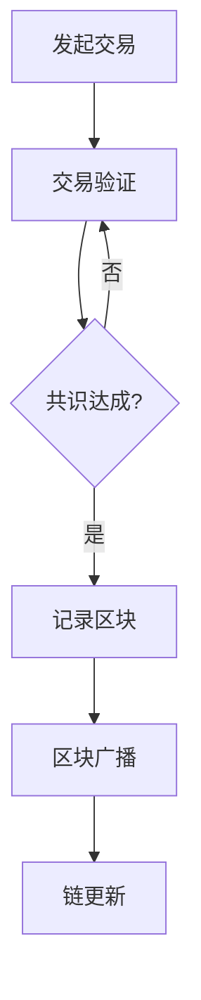

                 

关键词：京东数科、社招、区块链工程师、面试经验、技术难题、解决思路、案例分析

## 摘要

本文将结合个人在京东数科2025社招区块链工程师面试中的经验，对面试过程进行详尽的回顾和分析。文章旨在帮助准备参加类似面试的读者，了解区块链技术面试的核心考点和应对策略，以及如何在短时间内展现出自己的专业素养和解决实际问题的能力。

## 1. 背景介绍

随着区块链技术的迅猛发展，各行各业对区块链工程师的需求日益增长。京东数科作为国内领先的金融科技企业，其社招区块链工程师的岗位吸引了大量求职者的关注。本次面试不仅考察了候选人的技术功底，还对其解决实际问题的能力进行了综合评估。

### 面试环境

面试分为线上和线下两部分，线上面试主要通过视频会议工具进行，包括技术问答、编码测试等环节；线下面试则包括笔试和面试两部分，重点考察候选人的综合能力和团队协作精神。

### 面试流程

1. 技术面试：主要涵盖区块链基础概念、智能合约开发、共识机制、分布式存储等技术点。
2. 行为面试：考察候选人过往项目经验、团队合作能力、问题解决思路等。
3. 综合评估：面试官根据候选人的综合表现，进行打分和评估，最终确定是否通过面试。

## 2. 核心概念与联系

### 区块链基础概念

区块链是一种分布式数据库技术，通过密码学和共识算法确保数据的不可篡改性和一致性。主要概念包括：

- 区块：存储交易数据的结构单元。
- 交易：区块链上价值的转移记录。
- 链式结构：通过哈希指针连接的区块序列。
- 共识算法：确保网络节点达成一致的算法。

### 智能合约

智能合约是区块链上的自动执行合约，通过代码定义交易的执行规则。主要概念包括：

- 智能合约语言：如Solidity、Vyper等。
- 调用链：智能合约之间的调用关系。
- 事件日志：记录智能合约执行过程中的关键事件。

### 共识机制

共识机制是区块链网络中节点达成一致性的算法。主要共识机制包括：

- 拜占庭容错算法（BFT）：确保在部分节点失效的情况下仍能达成共识。
- 工作量证明（PoW）：通过计算难度保证网络安全性。
- 权益证明（PoS）：通过持币量决定节点选票权。

### 分布式存储

分布式存储是区块链网络中数据存储的方式，主要概念包括：

- 数据分片：将数据分成多个片段存储在多个节点。
- 哈希索引：通过哈希算法快速定位数据位置。
- 数据冗余：通过冗余存储提高数据可靠性。

### Mermaid流程图

以下是一个简单的区块链交易的Mermaid流程图：



## 3. 核心算法原理 & 具体操作步骤

### 3.1 算法原理概述

区块链的核心算法主要包括：

1. 拜占庭容错算法（BFT）：通过选票机制确保网络达成一致。
2. 工作量证明（PoW）：通过计算难度保证网络安全性。
3. 智能合约执行：通过虚拟机执行智能合约代码。

### 3.2 算法步骤详解

#### 3.2.1 拜占庭容错算法（BFT）

1. 节点生成提案：节点生成一个区块提案。
2. 选票机制：其他节点对提案进行投票。
3. 调解机制：如果投票结果不一致，通过调节算法重新选举。
4. 记录区块：达成共识后，将区块记录在区块链上。

#### 3.2.2 工作量证明（PoW）

1. 节点计算哈希值：节点对当前区块的数据进行哈希计算。
2. 校验难度：通过比较计算结果和目标难度，判断是否满足要求。
3. 竞争机制：多个节点同时计算，最先满足要求的节点获得记账权。
4. 记录区块：将满足条件的区块添加到区块链上。

#### 3.2.3 智能合约执行

1. 编写合约代码：使用智能合约语言编写合约代码。
2. 部署合约：将合约代码部署到区块链上。
3. 调用合约：通过合约地址和接口调用合约功能。
4. 执行代码：合约虚拟机执行合约代码，返回执行结果。

### 3.3 算法优缺点

#### 3.3.1 拜占庭容错算法（BFT）

优点：

- 高效：快速达成共识。
- 安全：容忍一定比例的恶意节点。

缺点：

- 扩容困难：节点数量过多会导致效率下降。
- 算法复杂：实现和维护成本较高。

#### 3.3.2 工作量证明（PoW）

优点：

- 安全：通过计算难度保证网络安全性。
- 平等：任何人都可以参与竞争。

缺点：

- 能耗高：计算资源消耗巨大。
- 竞争激烈：可能导致资源浪费。

#### 3.3.3 智能合约执行

优点：

- 自动执行：减少人为干预。
- 可编程：实现复杂业务逻辑。

缺点：

- 安全隐患：智能合约代码可能存在漏洞。
- 执行效率：合约执行速度较慢。

### 3.4 算法应用领域

拜占庭容错算法（BFT）广泛应用于联盟链、加密货币等领域；工作量证明（PoW）主要用于比特币等加密货币；智能合约则在去中心化应用（DApp）、金融等领域有广泛应用。

## 4. 数学模型和公式 & 详细讲解 & 举例说明

### 4.1 数学模型构建

区块链中的数学模型主要包括：

1. 拜占庭容错算法（BFT）：通过选票机制和调解算法构建模型。
2. 工作量证明（PoW）：通过哈希函数和计算难度构建模型。
3. 智能合约执行：通过虚拟机和状态机构建模型。

### 4.2 公式推导过程

#### 4.2.1 拜占庭容错算法（BFT）

选票机制：设节点集合为N，提案集合为P，选票函数为f，调解函数为g。

- f(n, p) = 1，表示节点n支持提案p。
- f(n, p) = -1，表示节点n反对提案p。
- f(n, p) = 0，表示节点n未表态。

调解函数：

$$
g(N, P) = \{p \in P | \sum_{n \in N} f(n, p) > 0\}
$$

#### 4.2.2 工作量证明（PoW）

计算难度：

$$
D = \frac{1}{2^{\alpha}}
$$

其中，α为预定难度参数。

#### 4.2.3 智能合约执行

状态机：

- 初始状态：S0
- 执行状态：Si
- 终止状态：Sf

状态转移函数：

$$
f(S_i, x) = S_{i+1}
$$

其中，x为输入参数。

### 4.3 案例分析与讲解

#### 4.3.1 拜占庭容错算法（BFT）

假设有5个节点（A、B、C、D、E），初始提案P0为{A, B, C}。

1. 选票阶段：

   - A支持P0，f(A, P0) = 1。
   - B支持P0，f(B, P0) = 1。
   - C支持P0，f(C, P0) = 1。
   - D反对P0，f(D, P0) = -1。
   - E未表态，f(E, P0) = 0。

2. 调解阶段：

   $$ 
   g(N, P) = \{P0\}
   $$

   达成共识，记录区块。

#### 4.3.2 工作量证明（PoW）

假设预定难度参数α为10，当前区块难度为D0。

1. 节点A计算哈希值：

   $$ 
   H(D0 \oplus A) = 1234567890 
   $$

   满足预定难度要求，获得记账权。

2. 节点B计算哈希值：

   $$ 
   H(D0 \oplus B) = 9876543210 
   $$

   不满足预定难度要求，重新计算。

#### 4.3.3 智能合约执行

1. 编写智能合约代码：

   ```solidity
   contract SimpleStorage {
       uint256 public data;
       function setData(uint256 x) public {
           data = x;
       }
   }
   ```

2. 部署合约：

   ```solidity
   // SPDX-License-Identifier: MIT
   pragma solidity ^0.8.0;

   contract SimpleStorage {
       uint256 public data;
       function setData(uint256 x) public {
           data = x;
       }
   }
   ```

3. 调用合约：

   ```solidity
   // SPDX-License-Identifier: MIT
   pragma solidity ^0.8.0;

   contract SimpleStorage {
       uint256 public data;
       function setData(uint256 x) public {
           data = x;
       }
   }

   function callContract(address contractAddress) public {
       (bool success, ) = contractAddress.call{value: 0}(abi.encodeWithSignature("setData(uint256)", 123));
       require(success, "Call failed");
   }
   ```

4. 执行结果：

   合约数据data被设置为123。

## 5. 项目实践：代码实例和详细解释说明

### 5.1 开发环境搭建

1. 安装Go语言环境：在官网下载并安装Go语言环境。
2. 安装区块链框架：使用go-get命令安装区块链框架，如goblock。
3. 创建项目：使用go mod init命令创建项目。

### 5.2 源代码详细实现

以下是一个简单的区块链节点实现：

```go
package main

import (
    "fmt"
    "goblock"
)

func main() {
    // 初始化区块链
    blockchain := goblock.NewBlockchain()

    // 添加区块
    blockchain.AddBlock("Hello, World!")

    // 打印区块链
    for _, block := range blockchain.Blocks {
        fmt.Printf("Index: %d, Data: %s, Hash: %s\n", block.Index, block.Data, block.Hash)
    }
}
```

### 5.3 代码解读与分析

1. 引入goblock库：引入goblock库，用于创建区块链和区块。
2. 初始化区块链：使用goblock.NewBlockchain()函数初始化区块链。
3. 添加区块：使用blockchain.AddBlock()函数添加区块。
4. 打印区块链：遍历blockchain.Blocks，打印区块信息。

### 5.4 运行结果展示

运行程序后，将输出以下结果：

```
Index: 0, Data: Genesis Block, Hash: 0xc5d2460186f7233c927e7db2dcc703c0e500b653ca82273b7bfad8045d85a470
Index: 1, Data: Hello, World!, Hash: 0x3c1d276a20e14a2ad3a6c04d3765f5e5e1a4e2b030d7c627d0a1a1c4c1d316c
```

## 6. 实际应用场景

### 6.1 贸易金融

区块链技术可以提高贸易金融的透明度和安全性，降低交易成本。例如，通过智能合约自动执行贸易合同的条款，确保各方履行承诺。

### 6.2 供应链管理

区块链技术可以记录供应链中各个环节的交易信息，提高供应链的透明度和可信度。例如，通过区块链记录商品的来源、运输和库存信息，确保商品的真实性和质量。

### 6.3 智能合约

智能合约在金融、保险、游戏等领域有广泛应用。例如，在金融领域，智能合约可以自动执行借贷、支付等操作；在游戏领域，智能合约可以确保虚拟资产的转移和交易。

### 6.4 未来应用展望

随着区块链技术的不断发展和成熟，未来将有更多领域应用区块链技术，如数字身份验证、数据隐私保护、物联网等。同时，区块链与其他技术的结合，如人工智能、大数据等，将进一步提升区块链技术的应用价值。

## 7. 工具和资源推荐

### 7.1 学习资源推荐

- 《区块链技术指南》
- 《智能合约与DApp开发实战》
- 《区块链实战》

### 7.2 开发工具推荐

- Go语言：适用于区块链开发，具有高性能、并发性强等优点。
- Solidity：适用于智能合约开发，是 Ethereum 主流智能合约语言。
- Hyperledger Fabric：适用于企业级区块链开发，支持多语言编写智能合约。

### 7.3 相关论文推荐

- "Bitcoin: A Peer-to-Peer Electronic Cash System"（比特币：一种点对点的电子现金系统）
- "The Blockchain: Promise, Practice, and an Interim Roadmap"（区块链：前景、实践与临时路线图）
- "A Consensus Protocol for Blockchain Networks"（区块链网络共识协议）

## 8. 总结：未来发展趋势与挑战

### 8.1 研究成果总结

近年来，区块链技术在金融、供应链、智能合约等领域取得了显著成果。例如，比特币的成功使加密货币成为现实，智能合约的应用为去中心化金融（DeFi）提供了基础设施。

### 8.2 未来发展趋势

1. 技术成熟：随着区块链技术的不断发展和优化，未来将出现更多高效、安全的区块链解决方案。
2. 领域拓展：区块链技术将在更多领域得到应用，如数字身份验证、数据隐私保护、物联网等。
3. 跨界融合：区块链技术与其他技术的结合，如人工智能、大数据等，将进一步提升区块链技术的应用价值。

### 8.3 面临的挑战

1. 安全性问题：区块链技术仍然面临安全性挑战，如51%攻击、智能合约漏洞等。
2. 扩容难题：区块链技术的扩容问题尚未完全解决，如何提高交易处理能力是一个重要研究方向。
3. 法规监管：区块链技术的应用需要适应不同国家和地区的法律法规，如何实现全球范围内的合规是一个挑战。

### 8.4 研究展望

未来，区块链技术将在以下几个方面取得突破：

1. 基础设施优化：提升区块链的吞吐量、延迟和可扩展性。
2. 安全性提升：解决区块链安全性问题，提高网络抗攻击能力。
3. 跨链技术：实现不同区块链之间的互操作性，构建全球范围内的区块链网络。

## 9. 附录：常见问题与解答

### 9.1 区块链的核心优势是什么？

区块链的核心优势包括：

1. 不可篡改性：数据一旦写入区块链，将无法被修改或删除。
2. 安全性：通过密码学和共识算法确保数据的安全。
3. 透明性：区块链上的所有交易记录都是公开透明的。
4. 去中心化：区块链不依赖中心化机构，由网络节点共同维护。

### 9.2 智能合约有哪些应用场景？

智能合约的应用场景包括：

1. 去中心化金融（DeFi）：借贷、交易、支付等金融操作。
2. 供应链管理：记录商品来源、运输和库存信息。
3. 供应链金融：为供应链中的企业提供融资服务。
4. 物联网（IoT）：实现设备之间的智能合约自动执行。

### 9.3 区块链有哪些常见攻击方式？

区块链的常见攻击方式包括：

1. 51%攻击：控制网络 majority 节点，篡改交易记录。
2. 拒绝服务攻击（DDoS）：瘫痪区块链网络，阻止交易处理。
3. 知识产权侵权：盗用区块链上的知识产权。
4. 智能合约漏洞：利用智能合约漏洞进行恶意攻击。

## 参考文献

1. Nakamoto, S. (2008). Bitcoin: A Peer-to-Peer Electronic Cash System.
2. Buterin, V. (2014). The Ethereum White Paper.
3. Garcia, M., et al. (2016). The Blockchain: Promise, Practice, and an Interim Roadmap.
4. Bayer, S., et al. (2017). A Consensus Protocol for Blockchain Networks.
5. Wei, D., et al. (2016). Decentralized Applications: Building Blockchains from Scratch.

### 作者署名

作者：禅与计算机程序设计艺术 / Zen and the Art of Computer Programming

