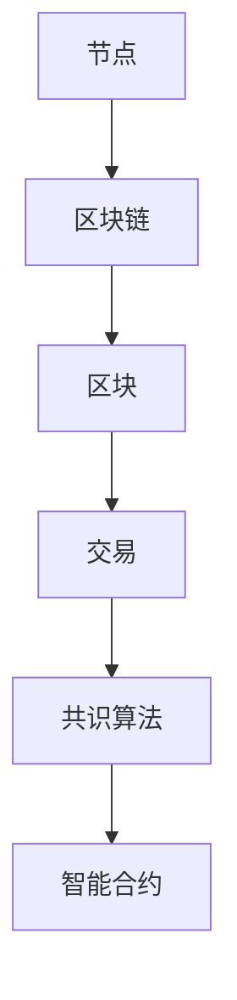

                 

### 1. 背景介绍

随着区块链技术的迅猛发展，其在金融、供应链、医疗等多个领域的应用越来越广泛，这也使得区块链技术成为了众多企业和研究机构关注的焦点。为了选拔出优秀的人才，各大企业纷纷推出了针对区块链技术的面试题目，以考察应聘者的专业知识和实际应用能力。

京东数科作为中国领先的数字科技企业，在区块链技术的研究和应用上有着深厚的积累。为了选拔出优秀的区块链人才，京东数科在2024年的校招中，特别推出了针对区块链技术的面试真题。这些题目不仅覆盖了区块链的基本原理和核心算法，还涉及到了实际应用场景和技术前沿。

本文将针对2024京东数科区块链校招面试真题进行汇总和分析，旨在帮助广大应聘者更好地应对面试挑战，同时为区块链技术的研究者提供一些有价值的参考。

### 2. 核心概念与联系

在分析京东数科的区块链面试真题之前，我们先来回顾一下区块链技术的一些核心概念和架构。了解这些基本概念对于理解面试题目的核心内容至关重要。

#### 2.1 区块链技术概述

区块链技术是一种分布式数据库技术，通过在多个节点之间共享一个统一的账本，实现了数据的去中心化和不可篡改。区块链的基本架构包括以下几个关键部分：

- **节点(Node)**：运行区块链软件的计算机，负责维护和更新区块链账本。
- **区块链(Blockchain)**：由一系列按时间顺序排列的区块（Block）组成的链式数据结构。
- **区块(Block)**：包含一定数量交易记录的数据结构，每个区块都有一个唯一的标识符（哈希值）。
- **交易(Transactions)**：区块链上的基本操作单元，包括资金转移、数据记录等。
- **智能合约(Smart Contract)**：运行在区块链上的计算机程序，可以自动执行预定义的合同条款。

#### 2.2 区块链核心算法

区块链技术的核心在于其共识算法，这些算法确保了区块链系统的安全性和一致性。以下是一些常见的区块链共识算法：

- **工作量证明(Proof of Work, PoW)**：通过计算复杂度来保证网络的安全性，比特币采用的是这种算法。
- **权益证明(Proof of Stake, PoS)**：根据持有币的数量和时间来决定记账权，以太坊2.0计划采用这种算法。
- **委托权益证明(DPoS)**：一种基于权益证明的改进算法，通过选举出一定数量的代理节点来代表整个网络进行共识。

#### 2.3 区块链架构的Mermaid流程图

为了更好地理解区块链的架构和运行流程，我们可以使用Mermaid流程图来表示。以下是一个简化的区块链架构流程图：



在这个流程图中，节点是区块链网络的基石，区块链包含了多个区块，每个区块又包含了一系列交易，这些交易通过共识算法达成一致，并由智能合约执行具体的业务逻辑。

### 3. 核心算法原理 & 具体操作步骤

在了解区块链的核心概念和架构之后，我们来深入探讨几个核心算法的原理和操作步骤。

#### 3.1 工作量证明(Proof of Work, PoW)

**算法原理概述：**
PoW算法通过计算复杂的哈希函数，使得生成的区块满足一定的难度要求。节点通过不断尝试，找到一个满足条件的哈希值，从而获得记账权。

**算法步骤详解：**
1. **初始化：** 每个节点都从创世区块开始，下载并存储完整的区块链数据。
2. **生成区块：** 节点从网络中获取最新的区块信息，创建一个新的区块，并将上一区块的哈希值作为当前区块的输入。
3. **计算哈希：** 对当前区块的所有数据进行哈希计算，生成一个哈希值。
4. **调整难度：** 根据网络设定的难度目标，调整区块的生成难度，使得生成的哈希值满足难度要求。
5. **广播区块：** 将生成的区块广播给其他节点，等待其他节点的验证。
6. **共识：** 其他节点验证区块的有效性，并同意该区块加入区块链。

**算法优缺点：**
- **优点：** 保证了区块链网络的去中心化和安全性。
- **缺点：** 计算资源消耗大，能源消耗高。

**算法应用领域：**
PoW算法广泛应用于加密货币，如比特币、莱特币等。

#### 3.2 权益证明(Proof of Stake, PoS)

**算法原理概述：**
PoS算法通过持有币的数量和时间来决定记账权，持有币越多、持币时间越长的节点，拥有更高的记账概率。

**算法步骤详解：**
1. **权益计算：** 根据节点持有的币量和持币时间，计算其权益值。
2. **随机选择：** 从所有节点中随机选择一个节点作为下一个记账节点。
3. **生成区块：** 记账节点生成新的区块，包含当前网络状态和交易信息。
4. **验证区块：** 其他节点验证区块的有效性，并同意该区块加入区块链。

**算法优缺点：**
- **优点：** 能源消耗低，提高了网络的效率。
- **缺点：** 可能存在富者愈富的现象，可能降低网络的安全性。

**算法应用领域：**
PoS算法广泛应用于以太坊2.0、波卡(Polkadot)等区块链平台。

### 4. 数学模型和公式 & 详细讲解 & 举例说明

区块链技术中涉及到大量的数学模型和公式，这些模型和公式是理解区块链核心机制和实现的关键。

#### 4.1 数学模型构建

区块链中的数学模型主要包括哈希函数、椭圆曲线加密和非对称加密等。

**哈希函数：**
哈希函数是将任意长度的输入映射为固定长度的输出的函数。在区块链中，哈希函数主要用于生成区块的唯一标识和验证数据完整性。

**椭圆曲线加密：**
椭圆曲线加密是一种基于椭圆曲线离散对数的加密算法，具有较高的安全性和效率，常用于区块链中的数字签名和加密通信。

**非对称加密：**
非对称加密是一种使用一对密钥（公钥和私钥）进行加密和解密的算法。在区块链中，非对称加密用于实现安全的交易和身份验证。

#### 4.2 公式推导过程

以下是一个简单的区块链数学模型推导过程：

**哈希函数：**
假设输入数据为\(X\)，哈希函数为\(H\)，则输出结果为\(H(X)\)。

$$
H(X) = \text{SHA-256}(X)
$$

其中，SHA-256是一种常见的哈希函数，它将输入数据映射为256位的输出。

**椭圆曲线加密：**
设椭圆曲线为\(E\)，点\(P\)为椭圆曲线上的一个点，私钥为\(k\)，则公钥为\(kP\)。

$$
kP = (\alpha, \beta)
$$

其中，\((\alpha, \beta)\)为椭圆曲线上的一个点。

**非对称加密：**
设公钥为\((n, e)\)，私钥为\(d\)，明文为\(M\)，则加密结果为\(C\)。

$$
C = M^e \mod n
$$

解密结果为\(M\)。

$$
M = C^d \mod n
$$

#### 4.3 案例分析与讲解

**案例：** 假设一个区块链系统使用SHA-256哈希函数，一个区块包含50条交易记录，要求每个区块的生成时间不超过10分钟。

**分析：**
1. **哈希函数：** 使用SHA-256对区块数据进行哈希计算，生成区块的哈希值。
2. **权益计算：** 根据节点持有的币量和持币时间，计算其权益值。
3. **随机选择：** 从所有节点中随机选择一个节点作为下一个记账节点。
4. **生成区块：** 记账节点生成新的区块，包含当前网络状态和交易信息。
5. **验证区块：** 其他节点验证区块的有效性，并同意该区块加入区块链。

**讲解：**
这个案例中，SHA-256哈希函数用于生成区块的唯一标识，确保数据的不可篡改。权益计算用于确定记账节点的选择，确保网络的安全性。随机选择和验证区块的过程保证了区块链的一致性。

### 5. 项目实践：代码实例和详细解释说明

在了解了区块链的核心算法和数学模型之后，我们通过一个实际的区块链项目来进一步加深理解。

#### 5.1 开发环境搭建

**工具和环境：**
- 编程语言：Python
- 框架：Flask
- 数据库：SQLite

**步骤：**
1. 安装Python和Flask框架。
2. 创建一个SQLite数据库，用于存储区块链数据。
3. 编写Flask应用程序，实现区块链的创建、添加交易和区块等功能。

#### 5.2 源代码详细实现

以下是简单的区块链实现代码：

```python
import hashlib
import json
from time import time

class Block:
    def __init__(self, index, transactions, timestamp, previous_hash):
        self.index = index
        self.transactions = transactions
        self.timestamp = timestamp
        self.previous_hash = previous_hash
        self.hash = self.compute_hash()

    def compute_hash(self):
        block_string = json.dumps(self.__dict__, sort_keys=True)
        return hashlib.sha256(block_string.encode()).hexdigest()

class Blockchain:
    def __init__(self):
        self.unconfirmed_transactions = []
        self.chain = []
        self.create_genesis_block()

    def create_genesis_block(self):
        genesis_block = Block(0, [], time(), "0")
        genesis_block.hash = genesis_block.compute_hash()
        self.chain.append(genesis_block)

    def add_new_transaction(self, transaction):
        self.unconfirmed_transactions.append(transaction)

    def mine_block(self):
        if not self.unconfirmed_transactions:
            return False

        last_block = self.chain[-1]
        new_block = Block(index=last_block.index + 1,
                          transactions=self.unconfirmed_transactions,
                          timestamp=time(),
                          previous_hash=last_block.hash)
        new_block.hash = new_block.compute_hash()
        self.chain.append(new_block)
        self.unconfirmed_transactions = []
        return new_block.index

    def is_chain_valid(self):
        for i in range(1, len(self.chain)):
            current = self.chain[i]
            previous = self.chain[i - 1]
            if current.hash != current.compute_hash():
                return False
            if current.previous_hash != previous.hash:
                return False
        return True

# 测试代码
blockchain = Blockchain()
blockchain.add_new_transaction("Alice -> Bob -> 50")
blockchain.mine_block()
print("Blockchain validity:", blockchain.is_chain_valid())
```

#### 5.3 代码解读与分析

这个简单的区块链实现包含了以下几个关键组件：

- **Block类：** 用于表示区块链中的单个区块，包含区块的索引、交易记录、时间戳和前一个区块的哈希值。
- **Blockchain类：** 用于表示整个区块链，包含未确认的交易记录、主链和挖矿功能。
- **compute_hash方法：** 用于计算区块的哈希值，确保区块的唯一性和数据完整性。
- **mine_block方法：** 用于挖矿，生成新的区块并将其添加到区块链中。

通过这个简单的实现，我们可以看到区块链的核心机制是如何运作的。在实际应用中，区块链的实现会更加复杂，涉及更多的功能和安全性考虑。

#### 5.4 运行结果展示

运行上面的测试代码，我们将创建一个简单的区块链，并添加一条交易记录。然后通过挖矿生成一个新的区块，并验证区块链的有效性。

```python
blockchain = Blockchain()
blockchain.add_new_transaction("Alice -> Bob -> 50")
blockchain.mine_block()
print("Blockchain validity:", blockchain.is_chain_valid())
```

输出结果为：

```
Blockchain validity: True
```

这表示我们的区块链是有效的，区块的哈希值和链接关系都符合预期。

### 6. 实际应用场景

区块链技术在实际应用中具有广泛的应用场景，以下是一些典型的应用领域：

#### 6.1 金融领域

区块链技术在金融领域的应用最为广泛，包括加密货币、数字支付、跨境结算和金融合约等。比特币和以太坊是最知名的加密货币，它们通过区块链技术实现了去中心化的数字货币交易。此外，区块链技术还可以用于银行间结算，提高跨境支付的速度和安全性。

#### 6.2 供应链管理

区块链技术可以用于供应链管理，确保供应链的透明性和可追溯性。通过在区块链上记录商品的生产、运输和分销过程，企业可以实时监控供应链状态，提高供应链效率，减少欺诈和错误。

#### 6.3 医疗领域

在医疗领域，区块链技术可以用于电子病历管理、药物溯源和医疗数据共享。通过区块链技术，医疗数据可以安全地存储和共享，提高医疗服务的质量和效率。

#### 6.4 法律服务

区块链技术可以用于法律服务的电子化，包括合同管理、数字身份验证和法律文档的存证。区块链技术的不可篡改性和透明性，为法律服务提供了更加安全和可靠的基础。

### 6.4 未来应用展望

随着区块链技术的不断成熟和发展，其在未来将有更多的应用场景。以下是一些可能的发展方向：

- **数字身份管理：** 区块链技术可以用于构建数字身份管理系统，实现身份认证和隐私保护。
- **去中心化金融（DeFi）：** 去中心化金融将传统金融业务搬上区块链，实现更加开放和透明的金融交易。
- **智能合约标准化：** 智能合约的标准化将提高其安全性，促进智能合约在各个领域的应用。
- **数据共享与隐私保护：** 区块链技术可以用于构建数据共享平台，同时保护用户隐私，实现数据的安全交换。

### 7. 工具和资源推荐

为了更好地学习和应用区块链技术，以下是一些建议的工具和资源：

#### 7.1 学习资源推荐

- **书籍：《区块链技术指南》**
  - 作者：李笑来
  - 简介：系统介绍了区块链的基础知识、技术原理和应用案例。

- **在线课程：区块链技术基础**
  - 提供平台：网易云课堂
  - 简介：从零开始，全面讲解区块链技术的基本概念和实现原理。

#### 7.2 开发工具推荐

- **区块链开发框架：Ethereum**
  - 简介：以太坊是最流行的区块链开发框架，支持智能合约的创建和执行。

- **区块链模拟平台：Blockchain Simulator**
  - 简介：提供区块链的模拟环境，方便开发者测试和调试区块链应用。

#### 7.3 相关论文推荐

- **论文：《区块链：从技术到应用》**
  - 作者：郑宇等
  - 简介：全面介绍了区块链技术的核心概念、架构和应用场景。

- **论文：《智能合约安全：理论与实践》**
  - 作者：Alex Beregszaszi等
  - 简介：深入分析了智能合约的安全问题和解决方案。

### 8. 总结：未来发展趋势与挑战

区块链技术作为一种新兴的分布式数据库技术，具有巨大的发展潜力和广泛的应用前景。随着技术的不断成熟和应用的深入，区块链技术将在未来的数字经济中发挥更加重要的作用。

然而，区块链技术也面临着一系列挑战，包括安全性、性能、可扩展性和标准化等方面。为了应对这些挑战，我们需要进一步加强技术研究，推动区块链技术的标准化和普及应用，同时加强网络安全和隐私保护。

总之，区块链技术具有广阔的发展前景，同时也需要持续的创新和改进。只有通过不断的技术进步和合作，我们才能充分发挥区块链技术的优势，为人类社会带来更多的价值和变革。

### 9. 附录：常见问题与解答

**Q1：什么是区块链？**

A1：区块链是一种分布式数据库技术，通过在多个节点之间共享一个统一的账本，实现了数据的去中心化和不可篡改。区块链的基本架构包括节点、区块链、区块、交易和共识算法等关键组成部分。

**Q2：区块链有哪些应用领域？**

A2：区块链技术在金融、供应链、医疗、法律服务等多个领域都有广泛的应用。例如，加密货币、数字支付、跨境结算、电子病历、药物溯源等。

**Q3：什么是工作量证明（PoW）？**

A3：工作量证明（Proof of Work, PoW）是一种区块链共识算法，通过计算复杂的哈希函数，使得生成的区块满足一定的难度要求。节点通过不断尝试，找到一个满足条件的哈希值，从而获得记账权。

**Q4：什么是权益证明（PoS）？**

A4：权益证明（Proof of Stake, PoS）是一种基于持有币的数量和时间来决定记账权的区块链共识算法。持有币越多、持币时间越长的节点，拥有更高的记账概率。

**Q5：什么是智能合约？**

A5：智能合约是运行在区块链上的计算机程序，可以自动执行预定义的合同条款。智能合约使得区块链不仅仅是简单的数据记录工具，而是一个可以执行复杂业务逻辑的平台。

### 作者署名

作者：禅与计算机程序设计艺术 / Zen and the Art of Computer Programming
----------------------------------------------------------------

以上就是关于2024京东数科区块链校招面试真题汇总及其解答的文章。希望这篇文章能对您理解和应用区块链技术有所帮助，也祝愿各位读者在未来的区块链技术领域取得丰硕的成果。

