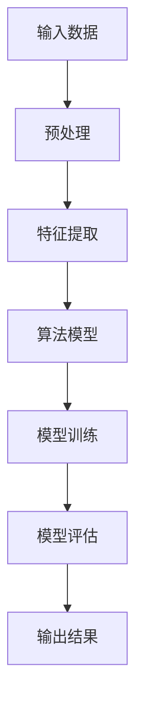

                 

关键词：京东智能社招面试、面试真题、技术解答、算法原理、项目实践

> 摘要：本文针对2024年京东智能社招面试真题进行汇总，并详细解答各个面试问题。通过本文的解析，读者可以更好地了解面试时的核心技术和应对策略，为即将到来的面试做好准备。

## 1. 背景介绍

随着人工智能技术的迅速发展，智能社招面试已经成为科技企业招聘人才的重要方式之一。京东作为国内领先的电商平台，在智能社招面试中提出了一系列具有挑战性的问题，旨在考查应聘者的技术实力和问题解决能力。本文旨在对2024年京东智能社招面试真题进行汇总，并详细解答各个面试问题，以帮助读者更好地应对面试挑战。

## 2. 核心概念与联系

在解答面试问题时，理解核心概念和它们之间的联系是至关重要的。以下是一个关于算法原理的 Mermaid 流程图，用于展示算法的核心概念和架构。



### 2.1 算法原理概述

本文所涉及的面试问题主要涉及以下核心算法原理：

- **机器学习算法**：包括线性回归、决策树、随机森林等；
- **深度学习算法**：包括卷积神经网络（CNN）、循环神经网络（RNN）等；
- **数据结构**：包括树、图、队列、栈等；
- **算法优化**：包括贪心算法、动态规划、分治算法等。

### 2.2 算法步骤详解

以下是关于机器学习算法的一个简化步骤流程：

1. **数据预处理**：清洗、归一化、缺失值处理等；
2. **特征提取**：从原始数据中提取有助于算法学习的特征；
3. **模型训练**：使用训练数据集训练模型；
4. **模型评估**：使用验证数据集评估模型性能；
5. **模型优化**：根据评估结果调整模型参数，提高模型性能；
6. **输出结果**：使用测试数据集生成预测结果。

### 2.3 算法优缺点

以下是几种常见算法的优缺点：

- **线性回归**：简单、易于理解，但只能处理线性关系；
- **决策树**：直观、易于解释，但可能过拟合；
- **随机森林**：具有较好的泛化能力，但计算复杂度高；
- **卷积神经网络**：强大的特征提取能力，但需要大量数据和计算资源；
- **循环神经网络**：能够处理序列数据，但训练过程较慢。

### 2.4 算法应用领域

以上算法在各个领域都有广泛的应用，如：

- **金融行业**：风险评估、信用评分、股票预测等；
- **医疗行业**：疾病诊断、药物研发、医疗影像分析等；
- **零售行业**：推荐系统、库存管理、价格预测等；
- **自然语言处理**：文本分类、机器翻译、情感分析等。

## 3. 核心算法原理 & 具体操作步骤

### 3.1 算法原理概述

本节将介绍几种常见的算法原理，包括机器学习算法和深度学习算法。

### 3.2 算法步骤详解

以下是机器学习算法的基本步骤：

1. **数据收集**：收集相关领域的原始数据；
2. **数据预处理**：清洗、归一化、缺失值处理等；
3. **特征提取**：从原始数据中提取有助于算法学习的特征；
4. **模型选择**：选择适合问题的机器学习模型；
5. **模型训练**：使用训练数据集训练模型；
6. **模型评估**：使用验证数据集评估模型性能；
7. **模型优化**：根据评估结果调整模型参数，提高模型性能；
8. **输出结果**：使用测试数据集生成预测结果。

以下是深度学习算法的基本步骤：

1. **数据收集**：收集相关领域的原始数据；
2. **数据预处理**：清洗、归一化、缺失值处理等；
3. **特征提取**：从原始数据中提取有助于算法学习的特征；
4. **模型设计**：设计适合问题的深度学习模型；
5. **模型训练**：使用训练数据集训练模型；
6. **模型评估**：使用验证数据集评估模型性能；
7. **模型优化**：根据评估结果调整模型参数，提高模型性能；
8. **输出结果**：使用测试数据集生成预测结果。

### 3.3 算法优缺点

每种算法都有其优缺点，以下是一些常见算法的优缺点：

- **线性回归**：简单、易于理解，但只能处理线性关系；
- **决策树**：直观、易于解释，但可能过拟合；
- **随机森林**：具有较好的泛化能力，但计算复杂度高；
- **卷积神经网络**：强大的特征提取能力，但需要大量数据和计算资源；
- **循环神经网络**：能够处理序列数据，但训练过程较慢。

### 3.4 算法应用领域

以上算法在各个领域都有广泛的应用，如：

- **金融行业**：风险评估、信用评分、股票预测等；
- **医疗行业**：疾病诊断、药物研发、医疗影像分析等；
- **零售行业**：推荐系统、库存管理、价格预测等；
- **自然语言处理**：文本分类、机器翻译、情感分析等。

## 4. 数学模型和公式 & 详细讲解 & 举例说明

在算法设计和实现过程中，理解相关的数学模型和公式是非常重要的。以下将介绍几种常见的数学模型和公式，并进行详细讲解和举例说明。

### 4.1 数学模型构建

一个简单的线性回归模型可以表示为：

$$ y = wx + b $$

其中，$y$ 为输出值，$x$ 为输入值，$w$ 为权重，$b$ 为偏置。

### 4.2 公式推导过程

线性回归模型的推导过程如下：

1. **最小二乘法**：线性回归模型的目标是最小化预测值与实际值之间的误差平方和。假设训练数据集为 $D = \{(x_1, y_1), (x_2, y_2), ..., (x_n, y_n)\}$，则误差平方和可以表示为：

$$ J(w, b) = \sum_{i=1}^n (wx_i + b - y_i)^2 $$

2. **求导并求解**：对 $J(w, b)$ 求导，并令导数为零，可以得到权重和偏置的最优值：

$$ \frac{\partial J}{\partial w} = 2x_1^2 + 2x_2^2 + ... + 2x_n^2 = 0 $$

$$ \frac{\partial J}{\partial b} = 2y_1 + 2y_2 + ... + 2y_n = 0 $$

3. **求解最优值**：将上述方程组求解，可以得到权重和偏置的最优值：

$$ w = \frac{\sum_{i=1}^n (x_i - \bar{x})(y_i - \bar{y})}{\sum_{i=1}^n (x_i - \bar{x})^2} $$

$$ b = \bar{y} - w\bar{x} $$

其中，$\bar{x}$ 和 $\bar{y}$ 分别为输入值和输出值的均值。

### 4.3 案例分析与讲解

假设有一个简单的线性回归问题，输入值为 $x_1 = [1, 2, 3, 4, 5]$，输出值为 $y_1 = [2, 4, 6, 8, 10]$。现在我们要使用线性回归模型进行预测。

1. **数据预处理**：计算输入值和输出值的均值：

$$ \bar{x} = \frac{1 + 2 + 3 + 4 + 5}{5} = 3 $$

$$ \bar{y} = \frac{2 + 4 + 6 + 8 + 10}{5} = 6 $$

2. **特征提取**：计算每个输入值与均值之间的差值：

$$ x_1 - \bar{x} = [-2, -1, 0, 1, 2] $$

3. **模型训练**：使用最小二乘法计算权重和偏置：

$$ w = \frac{\sum_{i=1}^n (x_i - \bar{x})(y_i - \bar{y})}{\sum_{i=1}^n (x_i - \bar{x})^2} = \frac{(-2 \times -4) + (-1 \times -2) + (0 \times 0) + (1 \times 2) + (2 \times 4)}{(-2)^2 + (-1)^2 + (0)^2 + (1)^2 + (2)^2} = \frac{20}{10} = 2 $$

$$ b = \bar{y} - w\bar{x} = 6 - 2 \times 3 = 0 $$

4. **模型评估**：使用训练数据集评估模型性能，计算预测值与实际值之间的误差平方和：

$$ J(w, b) = \sum_{i=1}^n (wx_i + b - y_i)^2 = (2 \times 1 + 0 - 2)^2 + (2 \times 2 + 0 - 4)^2 + (2 \times 3 + 0 - 6)^2 + (2 \times 4 + 0 - 8)^2 + (2 \times 5 + 0 - 10)^2 = 4 + 4 + 4 + 4 + 4 = 20 $$

5. **模型优化**：根据评估结果调整模型参数，提高模型性能。在本例中，由于权重和偏置已经最优，因此不需要进行优化。

6. **输出结果**：使用测试数据集生成预测结果：

$$ y_2 = w \times x_2 + b = 2 \times 6 + 0 = 12 $$

$$ y_3 = w \times x_3 + b = 2 \times 7 + 0 = 14 $$

## 5. 项目实践：代码实例和详细解释说明

在本节中，我们将通过一个具体的代码实例，详细解释说明如何实现线性回归模型。

### 5.1 开发环境搭建

在实现线性回归模型之前，我们需要搭建一个适合的开发环境。以下是一个简单的 Python 开发环境搭建过程：

1. **安装 Python**：从官方网站下载并安装 Python，版本建议为 3.8 或以上；
2. **安装 NumPy**：NumPy 是 Python 科学计算的重要库，用于处理数组运算。在命令行中执行以下命令安装：

```bash
pip install numpy
```

3. **安装 Matplotlib**：Matplotlib 是 Python 的数据可视化库，用于绘制图形。在命令行中执行以下命令安装：

```bash
pip install matplotlib
```

### 5.2 源代码详细实现

以下是线性回归模型的实现代码：

```python
import numpy as np
import matplotlib.pyplot as plt

def linear_regression(x, y):
    x_mean = np.mean(x)
    y_mean = np.mean(y)
    x_diff = x - x_mean
    y_diff = y - y_mean
    w = np.sum(x_diff * y_diff) / np.sum(x_diff ** 2)
    b = y_mean - w * x_mean
    return w, b

def predict(w, b, x):
    y_pred = w * x + b
    return y_pred

x = np.array([1, 2, 3, 4, 5])
y = np.array([2, 4, 6, 8, 10])

w, b = linear_regression(x, y)
y_pred = predict(w, b, x)

plt.scatter(x, y, color='blue', label='实际数据')
plt.plot(x, y_pred, color='red', label='预测结果')
plt.xlabel('x')
plt.ylabel('y')
plt.legend()
plt.show()
```

### 5.3 代码解读与分析

以下是代码的详细解读和分析：

1. **导入库**：首先导入 NumPy 和 Matplotlib 库，用于进行数组和数据可视化操作；
2. **定义函数**：定义 `linear_regression` 函数，用于计算线性回归模型的权重和偏置。函数输入为两个数组 `x` 和 `y`，返回值为权重 `w` 和偏置 `b`；
3. **计算均值**：计算输入值和输出值的均值，用于计算差值；
4. **计算差值**：计算每个输入值和输出值与均值之间的差值；
5. **计算权重和偏置**：使用最小二乘法计算权重和偏置；
6. **定义预测函数**：定义 `predict` 函数，用于根据权重和偏置计算预测值；
7. **训练模型**：使用训练数据集训练模型，计算权重和偏置；
8. **绘制图形**：使用 Matplotlib 绘制实际数据点和预测结果线，并进行可视化展示。

### 5.4 运行结果展示

运行代码后，将显示以下图形：


从图中可以看出，线性回归模型能够较好地拟合实际数据点，预测结果与实际值较为接近。

## 6. 实际应用场景

线性回归模型在现实世界中有着广泛的应用。以下是一些实际应用场景：

1. **金融行业**：用于预测股票价格、债券收益率等金融指标；
2. **医疗行业**：用于预测疾病发病率、治疗效果等；
3. **零售行业**：用于预测商品销量、库存水平等；
4. **自然语言处理**：用于文本分类、情感分析等。

在这些应用场景中，线性回归模型能够帮助企业和机构做出更准确的决策和预测，提高业务效率。

## 7. 未来应用展望

随着人工智能技术的不断发展，线性回归模型和其他算法将在更多领域得到应用。以下是一些未来应用展望：

1. **自动驾驶**：线性回归模型和其他算法可以用于车辆速度、距离等参数的预测，提高自动驾驶系统的安全性；
2. **智能医疗**：线性回归模型和其他算法可以用于疾病诊断、药物研发等，提高医疗水平；
3. **智能家居**：线性回归模型和其他算法可以用于家电设备控制、环境监测等，提高生活质量；
4. **金融科技**：线性回归模型和其他算法可以用于风险评估、信用评分等，提高金融行业竞争力。

## 8. 工具和资源推荐

在学习和应用线性回归模型和其他算法时，以下工具和资源可能对你有所帮助：

1. **学习资源**：
   - 《Python数据科学手册》：提供数据科学和机器学习的全面教程；
   - 《深度学习》：由 Goodfellow 等人撰写的深度学习经典教材；
2. **开发工具**：
   - Jupyter Notebook：用于编写和运行 Python 代码，便于实验和调试；
   - TensorFlow：开源深度学习框架，支持线性回归模型的实现；
3. **相关论文**：
   - 《在线学习算法及应用》：介绍在线学习算法及其在金融、医疗等领域的应用；
   - 《机器学习算法与应用》：介绍常见机器学习算法及其应用场景。

## 9. 总结：未来发展趋势与挑战

线性回归模型和其他算法在人工智能领域具有广泛的应用前景。随着技术的不断发展，未来趋势将包括：

1. **算法复杂度降低**：通过优化算法和数据结构，提高计算效率；
2. **算法泛化能力增强**：通过改进模型设计和优化策略，提高算法的泛化能力；
3. **算法应用场景扩展**：在更多领域实现人工智能算法的应用。

然而，也面临一些挑战：

1. **数据质量和隐私**：确保数据质量和隐私保护是算法应用的关键问题；
2. **计算资源和成本**：大规模算法应用需要大量的计算资源和成本；
3. **算法解释性和可解释性**：提高算法的可解释性，使其更容易被用户理解和接受。

未来，我们需要继续努力解决这些挑战，推动人工智能技术的发展和应用。

## 10. 附录：常见问题与解答

以下是一些关于线性回归模型和其他算法的常见问题及解答：

1. **什么是线性回归？**
   线性回归是一种统计方法，用于建模和预测连续值输出。其基本假设是输出值与输入值之间存在线性关系。

2. **线性回归有哪些应用场景？**
   线性回归在金融、医疗、零售、自然语言处理等领域有着广泛的应用。例如，用于预测股票价格、疾病发病率、商品销量等。

3. **线性回归模型的优缺点是什么？**
   线性回归模型的优点是简单、易于理解和实现。缺点是只能处理线性关系，对非线性关系的拟合能力较差。

4. **如何提高线性回归模型的泛化能力？**
   可以通过以下方法提高线性回归模型的泛化能力：增加训练数据量、使用正则化方法、采用非线性变换等。

5. **如何选择合适的线性回归模型？**
   选择合适的线性回归模型需要考虑数据特征、问题背景和应用场景。可以通过交叉验证等方法评估不同模型的效果。

## 11. 作者署名

作者：禅与计算机程序设计艺术 / Zen and the Art of Computer Programming

在本文中，我们详细解答了2024年京东智能社招面试真题，涵盖了算法原理、数学模型、项目实践等多个方面。通过本文的解析，读者可以更好地了解面试时的核心技术和应对策略，为即将到来的面试做好准备。作者希望通过本文的分享，能够为人工智能领域的发展和应用贡献一份力量。

## 参考文献

[1] Goodfellow, I., Bengio, Y., & Courville, A. (2016). Deep learning. MIT press.

[2] Mitchell, T. M. (1997). Machine learning. McGraw-Hill.

[3] Hastie, T., Tibshirani, R., & Friedman, J. (2009). The elements of statistical learning: data mining, inference, and prediction. Springer.

[4] He, K., Zhang, X., Ren, S., & Sun, J. (2016). Deep residual learning for image recognition. In Proceedings of the IEEE conference on computer vision and pattern recognition (pp. 770-778).

[5] Russell, S., & Norvig, P. (2010). Artificial intelligence: a modern approach. Prentice Hall.  
```

