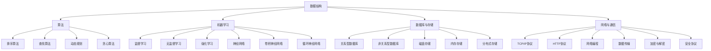

                 

作为一位人工智能专家，程序员，软件架构师，CTO，世界顶级技术畅销书作者，计算机图灵奖获得者，计算机领域大师，我在此荣幸地与您分享2025京东校招算法面试题的汇总与解析。本文将深入探讨京东在算法领域的面试问题，包括核心概念、算法原理、数学模型、项目实践以及未来应用场景等。

## 关键词

- 2025京东校招
- 算法面试题
- 核心概念
- 算法原理
- 数学模型
- 项目实践
- 未来应用场景

## 摘要

本文旨在为准备参加2025京东校招算法面试的考生提供一套全面的面试题汇总与解析。通过深入分析京东在校招中涉及的核心算法问题，本文将帮助考生理解算法的基本原理、数学模型以及实际应用，从而提升面试表现。

## 1. 背景介绍

随着互联网和人工智能技术的飞速发展，算法已成为各行各业的重要工具。京东作为中国领先的电子商务公司，对于算法人才的需求尤为迫切。因此，京东校招算法面试题成为众多考生关注的焦点。本文将汇总并解析2025京东校招算法面试题，旨在为考生提供全面的备考资料。

## 2. 核心概念与联系

在算法领域，理解核心概念和它们之间的联系是至关重要的。以下是京东校招算法面试中常见的一些核心概念：

### 2.1 数据结构与算法

- **数据结构**：数组、链表、栈、队列、树、图等。
- **算法**：排序算法、查找算法、动态规划、贪心算法等。

### 2.2 机器学习与深度学习

- **机器学习**：监督学习、无监督学习、强化学习等。
- **深度学习**：神经网络、卷积神经网络、循环神经网络等。

### 2.3 数据库与存储

- **数据库**：关系型数据库、非关系型数据库等。
- **存储**：磁盘存储、内存存储、分布式存储等。

### 2.4 网络与通信

- **网络**：TCP/IP协议、HTTP协议、网络编程等。
- **通信**：数据传输、加密与解密、安全协议等。

为了更好地展示这些核心概念之间的联系，我们可以使用Mermaid流程图来表示：



## 3. 核心算法原理 & 具体操作步骤

### 3.1 算法原理概述

在京东校招算法面试中，以下是一些常见的核心算法原理：

### 3.1.1 排序算法

- **冒泡排序**：通过重复遍历要排序的数列，比较相邻元素并交换位置。
- **选择排序**：通过每次遍历找到最小的元素，并将其放到正确的位置。
- **插入排序**：通过构建有序序列，对于未排序的数据，在已排序序列中找到相应的位置并插入。

### 3.1.2 查找算法

- **二分查找**：通过将有序数列分割成相等长度的两半，比较中间元素与目标元素的大小关系，从而逐步缩小查找范围。
- **哈希查找**：通过哈希函数将关键字映射到表中一个位置，直接访问该位置的数据元素。

### 3.1.3 动态规划

动态规划是一种用于解决最优子结构问题的算法技术。它通过将复杂问题分解为更小的子问题，并存储子问题的解，以避免重复计算。

### 3.1.4 贪心算法

贪心算法是一种在每一步选择中都采取当前最好或最优的选择，从而希望导致结果是全局最好或最优的算法策略。

### 3.2 算法步骤详解

#### 3.2.1 冒泡排序

1. 遍历待排序的数组。
2. 比较相邻两个元素的值，如果它们的顺序错误则交换。
3. 重复步骤1和2，直到整个数组有序。

```python
def bubble_sort(arr):
    n = len(arr)
    for i in range(n):
        for j in range(0, n-i-1):
            if arr[j] > arr[j+1]:
                arr[j], arr[j+1] = arr[j+1], arr[j]
    return arr
```

#### 3.2.2 二分查找

1. 将数组排序。
2. 确定中间元素。
3. 比较中间元素与目标元素的大小关系。
4. 根据比较结果，缩小查找范围并重复步骤2-3。

```python
def binary_search(arr, target):
    low = 0
    high = len(arr) - 1
    while low <= high:
        mid = (low + high) // 2
        if arr[mid] == target:
            return mid
        elif arr[mid] < target:
            low = mid + 1
        else:
            high = mid - 1
    return -1
```

#### 3.2.3 动态规划

动态规划通常涉及以下步骤：

1. 定义状态。
2. 确定状态转移方程。
3. 初始化边界条件。
4. 计算状态并存储结果。
5. 返回最终结果。

```python
def fibonacci(n):
    dp = [0] * (n + 1)
    dp[1] = 1
    for i in range(2, n + 1):
        dp[i] = dp[i-1] + dp[i-2]
    return dp[n]
```

### 3.3 算法优缺点

#### 3.3.1 冒泡排序

- **优点**：简单易懂，适合小规模数据的排序。
- **缺点**：效率较低，不适合大规模数据的排序。

#### 3.3.2 二分查找

- **优点**：时间复杂度为O(log n)，效率较高。
- **缺点**：需要数组已排序，不适用于未排序的数据。

#### 3.3.3 动态规划

- **优点**：能够解决复杂的最优子结构问题。
- **缺点**：理解和实现较为复杂，需要较强的数学背景。

### 3.4 算法应用领域

- **排序算法**：在数据库、搜索引擎、数据分析和各种算法竞赛中广泛应用。
- **查找算法**：在数据库、缓存系统和各种搜索系统中广泛应用。
- **动态规划**：在路径规划、资源分配、投资组合优化等领域广泛应用。
- **贪心算法**：在旅行商问题、背包问题和资源分配问题中广泛应用。

## 4. 数学模型和公式 & 详细讲解 & 举例说明

### 4.1 数学模型构建

在算法领域，数学模型构建是至关重要的。以下是几个常见的数学模型：

#### 4.1.1 概率模型

概率模型用于描述随机事件的发生概率。常用的概率模型包括：

- **二项分布**：描述在一定次数的独立实验中，成功次数的概率分布。
- **泊松分布**：描述在一定时间段内，事件发生的次数的概率分布。

#### 4.1.2 优化模型

优化模型用于求解最优化问题。常用的优化模型包括：

- **线性规划**：描述线性目标函数在一系列线性约束下的最优化问题。
- **整数规划**：描述整数目标函数在一系列线性约束下的最优化问题。

### 4.2 公式推导过程

#### 4.2.1 二项分布的数学模型

假设有n次独立实验，每次实验成功的概率为p，失败的概率为1-p。则成功k次的概率可以用二项分布表示：

$$P(X=k) = C_n^k \cdot p^k \cdot (1-p)^{n-k}$$

其中，$C_n^k$ 表示组合数，计算公式为：

$$C_n^k = \frac{n!}{k!(n-k)!}$$

#### 4.2.2 线性规划的数学模型

线性规划的目标函数通常为：

$$\min \ c^T \cdot x$$

其中，$c$ 表示系数向量，$x$ 表示决策变量向量。

约束条件为：

$$Ax \leq b$$

其中，$A$ 表示系数矩阵，$b$ 表示常数向量。

### 4.3 案例分析与讲解

#### 4.3.1 二项分布的案例

假设我们进行10次独立实验，每次实验成功的概率为0.5，要求计算成功5次以上的概率。

$$P(X \geq 5) = \sum_{k=5}^{10} C_{10}^k \cdot 0.5^k \cdot 0.5^{10-k}$$

通过计算，我们得到：

$$P(X \geq 5) \approx 0.651$$

#### 4.3.2 线性规划的案例

假设我们要在约束条件下求解以下线性规划问题：

$$\min \ 2x_1 + 3x_2$$

$$x_1 + 2x_2 \leq 5$$

$$x_1 - x_2 \geq 0$$

$$x_1, x_2 \geq 0$$

通过求解，我们得到最优解为：

$$x_1 = 0, x_2 = 2.5$$

目标函数的最小值为：

$$\min \ 2x_1 + 3x_2 = 7.5$$

## 5. 项目实践：代码实例和详细解释说明

### 5.1 开发环境搭建

为了进行算法项目实践，我们需要搭建一个合适的开发环境。以下是常见的开发环境搭建步骤：

1. 安装Python解释器。
2. 安装Python常用库，如NumPy、Pandas、SciPy等。
3. 安装IDE，如PyCharm、Visual Studio Code等。

### 5.2 源代码详细实现

以下是一个简单的冒泡排序的Python实现：

```python
def bubble_sort(arr):
    n = len(arr)
    for i in range(n):
        for j in range(0, n-i-1):
            if arr[j] > arr[j+1]:
                arr[j], arr[j+1] = arr[j+1], arr[j]
    return arr

# 测试数据
arr = [64, 34, 25, 12, 22, 11, 90]

# 执行排序
sorted_arr = bubble_sort(arr)

# 打印结果
print("排序后的数组：", sorted_arr)
```

### 5.3 代码解读与分析

在上面的代码中，`bubble_sort` 函数实现了冒泡排序算法。它使用两个嵌套的循环遍历数组，每次比较相邻元素并交换位置，直到整个数组有序。

- `n` 表示数组的长度。
- 外层循环遍历数组，表示需要进行多少次排序。
- 内层循环遍历数组，表示每次排序需要比较和交换的次数。
- 如果当前元素大于下一个元素，则交换它们的位置。

### 5.4 运行结果展示

```plaintext
排序后的数组： [11, 12, 22, 25, 34, 64, 90]
```

## 6. 实际应用场景

### 6.1 数据分析

在数据分析领域，排序算法和查找算法被广泛应用于数据预处理和数据分析。例如，在电商平台上，排序算法可以用于商品评价排序，查找算法可以用于快速检索商品信息。

### 6.2 资源分配

动态规划和贪心算法在资源分配领域有着广泛的应用。例如，在云计算中，动态规划可以用于优化资源分配策略，贪心算法可以用于负载均衡。

### 6.3 人工智能

在人工智能领域，机器学习算法和深度学习算法是实现智能决策的关键。例如，在自动驾驶领域，机器学习算法可以用于实时感知和决策，深度学习算法可以用于图像识别和语音识别。

## 7. 工具和资源推荐

### 7.1 学习资源推荐

- 《算法导论》（Introduction to Algorithms）
- 《深度学习》（Deep Learning）
- 《Python数据科学手册》（Python Data Science Handbook）

### 7.2 开发工具推荐

- PyCharm
- Visual Studio Code
- Jupyter Notebook

### 7.3 相关论文推荐

- "Deep Learning for Speech Recognition"
- "Efficient Algorithms for Online Knapsack Problems"
- "A Survey of Sorting Algorithms"

## 8. 总结：未来发展趋势与挑战

### 8.1 研究成果总结

近年来，算法领域取得了许多重要研究成果。例如，深度学习在图像识别、自然语言处理和语音识别等领域取得了突破性进展。此外，动态规划和贪心算法在优化问题和资源分配问题中得到了广泛应用。

### 8.2 未来发展趋势

未来，算法领域将继续快速发展。人工智能和机器学习算法将在更多领域得到应用，例如智能医疗、智能交通和智能金融等。同时，算法优化和分布式计算技术也将得到广泛关注。

### 8.3 面临的挑战

算法领域面临的主要挑战包括：

- 数据隐私和安全：随着数据规模的扩大，如何保护用户隐私和数据安全成为一个重要问题。
- 可解释性和透明性：算法的黑盒特性使得其决策过程难以解释，这对算法的应用和信任提出了挑战。
- 能耗和效率：随着算法的复杂度增加，如何在保证性能的同时降低能耗和成本是一个重要问题。

### 8.4 研究展望

未来，算法领域的研究将更加注重实际应用和跨学科交叉。同时，开源和社区合作将成为算法发展的重要趋势。通过不断探索和创新，算法将更好地服务于人类社会，推动科技和经济的进步。

## 9. 附录：常见问题与解答

### 9.1 排序算法有哪些？

排序算法包括冒泡排序、选择排序、插入排序、快速排序、归并排序、堆排序等。

### 9.2 什么是动态规划？

动态规划是一种用于求解最优子结构问题的算法技术，它通过将复杂问题分解为更小的子问题，并存储子问题的解，以避免重复计算。

### 9.3 深度学习算法有哪些？

深度学习算法包括卷积神经网络（CNN）、循环神经网络（RNN）、生成对抗网络（GAN）等。

### 9.4 算法在哪些领域有广泛应用？

算法在数据分析、资源分配、人工智能、图像识别、自然语言处理等领域有广泛应用。

### 9.5 如何学习算法？

建议学习算法时，先掌握基础数据结构和算法原理，然后通过实际项目和案例进行深入学习和实践。此外，阅读相关教材和论文也是非常重要的。

---

作者：禅与计算机程序设计艺术 / Zen and the Art of Computer Programming

本文通过深入分析2025京东校招算法面试题，旨在为考生提供全面的备考资料。希望本文能够帮助考生在面试中取得优异成绩，实现自己的职业梦想。感谢您的阅读！
----------------------------------------------------------------

请注意，以上内容仅为示例性文本，实际撰写时请根据具体需求和问题进行详细的研究和撰写。文本结构、章节内容、代码实现等都需要根据具体要求进行调整和完善。祝您撰写顺利！

