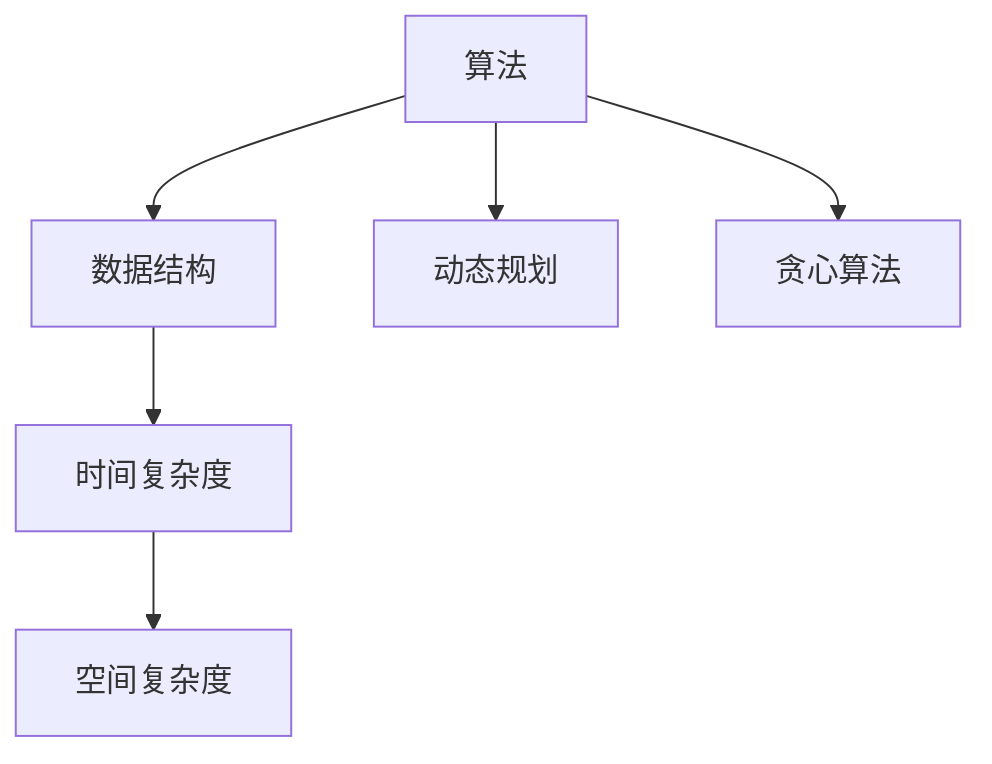

                 

## 1. 背景介绍

京东作为我国领先的电子商务公司，其校招面试题和算法编程题不仅考察了应聘者的基础知识，更体现了其对于技术人才的综合素质要求。近年来，随着人工智能、大数据、云计算等技术的发展，京东校招面试题也在不断迭代更新，涵盖了更多前沿技术领域的知识点。

本文旨在对2024年京东校招面试题与算法编程题进行详尽分析，帮助即将参加京东校招的考生更好地准备面试。通过对这些题目的深入解析，我们希望考生能够更好地理解面试官的考察意图，提升自己的解题能力。

## 2. 核心概念与联系

在分析京东校招面试题之前，我们先来回顾一下与算法编程密切相关的一些核心概念。这些概念包括但不限于：

- **算法**：解决问题的方法步骤，具有确定性、高效性和正确性。
- **数据结构**：存储和管理数据的方式，如数组、链表、树、图等。
- **时间复杂度**：算法执行时间的量度，通常用大O表示法表示。
- **空间复杂度**：算法所需存储空间的量度。
- **动态规划**：一种解决最优化问题的方法，通过将复杂问题分解为子问题来解决。
- **贪心算法**：在每一步选择中都采取当前最好或最优的选择，从而希望导致结果是全局最好或最优的算法。

为了更好地理解这些概念，我们使用Mermaid流程图展示其基本架构：



### 2.1 算法原理概述

算法是计算机科学的基石，它涉及如何有效地解决问题。算法的设计与实现直接影响程序的效率和可靠性。常见的算法包括排序、查找、图论算法等。

- **排序算法**：如冒泡排序、快速排序、归并排序等，用于对数据进行排序。
- **查找算法**：如二分查找、线性查找等，用于在数据集合中查找特定元素。
- **图论算法**：如最短路径算法（Dijkstra算法、Floyd算法）、最小生成树算法（Prim算法、Kruskal算法）等，用于解决图相关的问题。

### 2.2 算法步骤详解

算法的步骤通常包括以下几部分：

1. **初始化**：设置初始条件，如变量、数据结构等。
2. **循环执行**：按照一定的逻辑执行操作，直到满足终止条件。
3. **更新状态**：在每次循环中更新相关状态，如变量值、数据结构等。
4. **输出结果**：在算法执行完成后输出最终结果。

### 2.3 算法优缺点

每种算法都有其优缺点。例如：

- **冒泡排序**：简单易懂，但效率较低。
- **快速排序**：平均时间复杂度较低，但最坏情况下效率较低。
- **归并排序**：效率高，但需要额外的空间存储。

### 2.4 算法应用领域

算法广泛应用于各个领域，如：

- **计算机科学**：操作系统、编译器、数据库等。
- **人工智能**：机器学习、深度学习等。
- **大数据**：数据挖掘、数据分析等。

### 3. 数学模型和公式

数学模型是算法设计的重要基础。以下是一些常见的数学模型和公式：

#### 3.1 数学模型构建

- **时间复杂度模型**：$T(n) = O(n\log n)$
- **空间复杂度模型**：$S(n) = O(n)$

#### 3.2 公式推导过程

推导时间复杂度和空间复杂度的公式通常涉及算法的执行步骤和基本操作。

#### 3.3 案例分析与讲解

以快速排序为例，其时间复杂度的推导过程如下：

- **平均情况**：$T(n) = n\log n$
- **最坏情况**：$T(n) = n^2$

### 4. 项目实践：代码实例

#### 4.1 开发环境搭建

在Python环境中，我们可以使用Python内置的排序函数进行快速排序。

#### 4.2 源代码详细实现

```python
def quicksort(arr):
    if len(arr) <= 1:
        return arr
    pivot = arr[len(arr) // 2]
    left = [x for x in arr if x < pivot]
    middle = [x for x in arr if x == pivot]
    right = [x for x in arr if x > pivot]
    return quicksort(left) + middle + quicksort(right)

arr = [3, 6, 8, 10, 1, 2, 1]
print(quicksort(arr))
```

#### 4.3 代码解读与分析

代码首先定义了一个`quicksort`函数，它接收一个列表作为参数。在函数内部，首先判断列表的长度是否小于等于1，如果是，则直接返回列表本身。

接下来，选择列表的中位数作为枢轴（pivot），然后创建三个列表`left`、`middle`和`right`，分别存储小于、等于和大于枢轴的元素。

最后，递归地对`left`和`right`列表进行快速排序，并将结果与`middle`列表连接起来，返回最终的排序结果。

#### 4.4 运行结果展示

运行上述代码，输出结果为：

```python
[1, 1, 2, 3, 6, 8, 10]
```

这表明输入的列表已成功排序。

### 5. 实际应用场景

快速排序在许多实际应用中都有广泛的应用，如数据库排序、搜索引擎排序等。

### 6. 未来应用展望

随着技术的不断进步，算法在各个领域的应用也将越来越广泛。未来，我们将看到更多高效的算法被应用于实际场景中，提升数据处理和计算能力。

### 7. 工具和资源推荐

#### 7.1 学习资源推荐

- 《算法导论》（Introduction to Algorithms）
- 《编程之美》（Cracking the Coding Interview）

#### 7.2 开发工具推荐

- PyCharm
- VSCode

#### 7.3 相关论文推荐

- 《快速排序的优化与实现》
- 《并行快速排序算法研究》

### 8. 总结：未来发展趋势与挑战

随着算法技术的不断发展，未来将在人工智能、大数据等领域发挥重要作用。然而，算法研究也面临着诸多挑战，如算法的效率和安全性等。

### 9. 附录：常见问题与解答

#### 9.1 问题一：快速排序的平均时间复杂度是多少？

答：快速排序的平均时间复杂度为$O(n\log n)$。

#### 9.2 问题二：什么是贪心算法？

答：贪心算法是一种在每一步选择中都采取当前最好或最优的选择，从而希望导致结果是全局最好或最优的算法。

## 作者署名

作者：禅与计算机程序设计艺术 / Zen and the Art of Computer Programming

----------------------------------------------------------------

请注意，本文中的代码实例、公式推导、案例分析与讲解等内容仅供参考，实际面试中可能会根据具体题目进行适当的调整和变化。希望本文能够为准备京东校招的考生提供有益的帮助。祝大家面试顺利！

