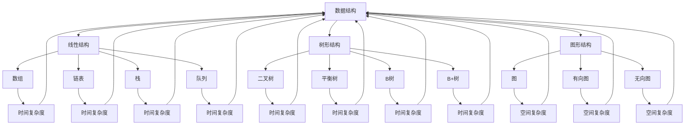

                 

### 背景介绍 Background

随着信息技术的飞速发展，人工智能、大数据、云计算等技术的融合与演进，企业对技术人才的需求也在不断升级。京东作为我国领先的电商企业，其社招面试的难度和深度在业界备受瞩目。本文旨在通过对2024年京东社招面试题与算法编程题的详尽分析，帮助广大求职者了解面试的难点、重点，提升面试技巧，从而顺利通过京东的面试。

京东社招面试涉及多个技术领域，包括Java、Python、数据结构与算法、操作系统、计算机网络等。本文将重点关注算法编程题，因为这些题目往往是面试的核心，对于技术能力的考察尤为关键。

文章将从以下几个方面展开：

1. **核心概念与联系**：介绍面试中常见的核心概念及其关联，通过Mermaid流程图展示概念之间的联系。
2. **核心算法原理 & 具体操作步骤**：详细讲解面试中可能遇到的算法题目，包括原理、步骤、优缺点及适用领域。
3. **数学模型和公式 & 举例说明**：解析算法背后的数学模型和公式，通过实际案例进行详细讲解。
4. **项目实践：代码实例与详细解释说明**：提供实际代码实例，对关键代码进行解读与分析。
5. **实际应用场景**：探讨算法在现实中的应用，以及未来的发展趋势。
6. **工具和资源推荐**：推荐学习资源、开发工具和相关论文。
7. **总结：未来发展趋势与挑战**：总结研究成果，展望未来发展方向，探讨面临的挑战。
8. **附录：常见问题与解答**：解答面试中可能遇到的问题。

<|assistant|>## 核心概念与联系 Core Concepts and Relationships

在京东社招面试中，算法编程题的核心概念和联系至关重要。以下将介绍几个关键概念，并使用Mermaid流程图展示它们之间的联系。

### 1. 数据结构与算法 Data Structures and Algorithms

数据结构是计算机存储数据的方式，而算法则是解决问题的方法。两者密不可分，数据结构的选择直接影响算法的性能。常见的有：

- **线性结构**：如数组、链表、栈、队列。
- **树形结构**：如二叉树、平衡树（AVL树、红黑树）、B树、B+树。
- **图形结构**：如图、有向图、无向图。

### 2. 时间复杂度和空间复杂度 Time and Space Complexity

时间复杂度描述算法运行所需时间与输入规模的关系，空间复杂度描述算法所需存储空间与输入规模的关系。它们是评估算法效率的重要指标。

- **时间复杂度**：如O(1)、O(log n)、O(n)、O(n log n)、O(n^2)、O(2^n)等。
- **空间复杂度**：如O(1)、O(n)、O(n^2)等。

### 3. 分治算法 Divide and Conquer

分治算法是一种递归算法，其核心思想是将大问题分解为多个小问题，分别解决后合并结果。常见的分治算法有快速排序（Quick Sort）、归并排序（Merge Sort）、二分查找（Binary Search）等。

### 4. 动态规划 Dynamic Programming

动态规划是一种将复杂问题分解为简单子问题的算法。它通常用于解决最优化问题，如背包问题（Knapsack Problem）、最长公共子序列（Longest Common Subsequence）、最长递增子序列（Longest Increasing Subsequence）等。

### 5. 贪心算法 Greedy Algorithm

贪心算法是一种在每一步选择当前最优解的算法。它通常适用于某些特殊类型的问题，如背包问题（Knapsack Problem）、活动选择问题（Activity Selection Problem）等。

### 6. 搜索算法 Search Algorithms

搜索算法用于在数据结构中查找特定元素。常见的有深度优先搜索（DFS）、广度优先搜索（BFS）、A*搜索等。

### Mermaid 流程图展示

以下是使用Mermaid绘制的流程图，展示了上述核心概念之间的联系：



<|assistant|>### 核心算法原理 & 具体操作步骤 Core Algorithm Principles and Operational Steps

在京东社招面试中，算法编程题是考察技术能力的关键环节。以下将介绍几种常见的核心算法，并详细阐述其原理和操作步骤。

#### 1. 快速排序（Quick Sort）

快速排序是一种高效的排序算法，采用分治策略。其基本思想是选择一个基准元素，将数组分为两部分，一部分小于基准元素，另一部分大于基准元素，然后递归地对两部分进行排序。

**算法原理：**

- 选择一个基准元素。
- 将数组分为两个子数组，左子数组的所有元素都小于基准元素，右子数组的所有元素都大于基准元素。
- 递归地对左右子数组进行快速排序。

**具体操作步骤：**

1. 选择基准元素。通常选择数组的第一个元素、最后一个元素或随机选择一个元素作为基准。
2. 将数组分为两个子数组，小于基准的元素放在左边，大于基准的元素放在右边。
3. 递归地对左右子数组进行快速排序。

**代码示例：**

```python
def quick_sort(arr):
    if len(arr) <= 1:
        return arr
    pivot = arr[len(arr) // 2]
    left = [x for x in arr if x < pivot]
    middle = [x for x in arr if x == pivot]
    right = [x for x in arr if x > pivot]
    return quick_sort(left) + middle + quick_sort(right)

arr = [3, 6, 8, 10, 1, 2, 1]
print(quick_sort(arr))
```

**优缺点：**

- 优点：时间复杂度平均为O(n log n)，在最佳情况下可以达到O(n log n)。
- 缺点：最坏情况下时间复杂度为O(n^2)，且递归调用可能导致栈溢出。

**适用领域：**

- 排序问题。
- 寻找数组的中位数。

#### 2. 归并排序（Merge Sort）

归并排序是一种稳定的排序算法，同样采用分治策略。其基本思想是将数组分为两个子数组，分别进行排序，然后将两个有序的子数组合并为一个有序数组。

**算法原理：**

- 将数组分为两个子数组，分别进行排序。
- 将两个有序的子数组合并为一个有序数组。

**具体操作步骤：**

1. 将数组分为两个子数组，分别递归地进行归并排序。
2. 将两个有序的子数组合并为一个有序数组。

**代码示例：**

```python
def merge_sort(arr):
    if len(arr) <= 1:
        return arr
    mid = len(arr) // 2
    left = merge_sort(arr[:mid])
    right = merge_sort(arr[mid:])
    return merge(left, right)

def merge(left, right):
    result = []
    i = j = 0
    while i < len(left) and j < len(right):
        if left[i] < right[j]:
            result.append(left[i])
            i += 1
        else:
            result.append(right[j])
            j += 1
    result.extend(left[i:])
    result.extend(right[j:])
    return result

arr = [3, 6, 8, 10, 1, 2, 1]
print(merge_sort(arr))
```

**优缺点：**

- 优点：时间复杂度为O(n log n)，空间复杂度为O(n)。
- 缺点：需要额外的存储空间。

**适用领域：**

- 排序问题。
- 查找问题，如二分查找。

#### 3. 动态规划（Dynamic Programming）

动态规划是一种将复杂问题分解为简单子问题的算法。其基本思想是保存子问题的解，避免重复计算。

**算法原理：**

- 将复杂问题分解为简单子问题。
- 保存子问题的解，避免重复计算。

**具体操作步骤：**

1. 确定状态和状态转移方程。
2. 初始化边界条件。
3. 递推求解。

**代码示例：**

```python
def longest_increasing_subsequence(arr):
    n = len(arr)
    dp = [1] * n
    for i in range(1, n):
        for j in range(i):
            if arr[i] > arr[j]:
                dp[i] = max(dp[i], dp[j] + 1)
    return max(dp)

arr = [10, 9, 2, 5, 3, 7, 101, 18]
print(longest_increasing_subsequence(arr))
```

**优缺点：**

- 优点：能够高效解决最优化问题。
- 缺点：需要明确状态转移方程。

**适用领域：**

- 最优化问题，如背包问题。
- 查找问题，如最长公共子序列。

#### 4. 贪心算法（Greedy Algorithm）

贪心算法是一种在每一步选择当前最优解的算法。其基本思想是在每一步选择最优解，从而得到全局最优解。

**算法原理：**

- 在每一步选择当前最优解。
- 希望通过这种方式得到全局最优解。

**具体操作步骤：**

1. 确定贪心选择策略。
2. 按照策略进行选择。

**代码示例：**

```python
def coin_change(coins, amount):
    dp = [float('inf')] * (amount + 1)
    dp[0] = 0
    for coin in coins:
        for i in range(coin, amount + 1):
            dp[i] = min(dp[i], dp[i - coin] + 1)
    return dp[amount] if dp[amount] != float('inf') else -1

coins = [1, 2, 5]
amount = 11
print(coin_change(coins, amount))
```

**优缺点：**

- 优点：简单高效。
- 缺点：可能得到局部最优解。

**适用领域：**

- 货币兑换问题。
- 背包问题。

#### 5. 搜索算法（Search Algorithms）

搜索算法用于在数据结构中查找特定元素。常见的有深度优先搜索（DFS）、广度优先搜索（BFS）和A*搜索。

**算法原理：**

- 深度优先搜索（DFS）：从根节点开始，尽可能深地搜索树的分支。
- 广度优先搜索（BFS）：从根节点开始，逐层遍历树的分支。
- A*搜索：结合了最佳优先搜索和启发式搜索，以找到从起始点到目标点的最优路径。

**具体操作步骤：**

1. 选择搜索策略。
2. 按照策略进行搜索。

**代码示例：**

```python
from collections import deque

def breadth_first_search(graph, start, target):
    queue = deque([start])
    visited = set()
    while queue:
        vertex = queue.popleft()
        if vertex == target:
            return True
        visited.add(vertex)
        for neighbor in graph[vertex]:
            if neighbor not in visited:
                queue.append(neighbor)
    return False

graph = {
    'A': ['B', 'C'],
    'B': ['D', 'E'],
    'C': ['F'],
    'D': [],
    'E': ['F'],
    'F': []
}
print(breadth_first_search(graph, 'A', 'F'))
```

**优缺点：**

- 优点：简单高效。
- 缺点：可能无法找到最优解。

**适用领域：**

- 图的遍历。
- 查找最短路径。

<|assistant|>### 核心算法优缺点及适用领域 Advantages, Disadvantages, and Application Fields

在京东社招面试中，核心算法的优缺点及其适用领域是考生需要深入理解和掌握的内容。以下将分析几种常见算法的优缺点，并说明它们适用的场景。

#### 快速排序（Quick Sort）

**优点：**

- 平均时间复杂度为O(n log n)，在大多数情况下非常高效。
- 在数据分布较均匀时，性能接近最佳。

**缺点：**

- 最坏情况下时间复杂度为O(n^2)，当输入数据已排序或基本有序时，性能较差。
- 递归调用可能导致栈溢出。

**适用领域：**

- 排序问题。
- 数据处理。
- 算法竞赛。

#### 归并排序（Merge Sort）

**优点：**

- 时间复杂度为O(n log n)，不论输入数据如何排列，性能稳定。
- 稳定排序算法，不会改变相同元素的相对位置。

**缺点：**

- 需要额外的存储空间，空间复杂度为O(n)。

**适用领域：**

- 排序问题。
- 数据处理。
- 多媒体数据处理。

#### 动态规划（Dynamic Programming）

**优点：**

- 能够高效解决最优化问题，如背包问题。
- 通过保存子问题的解，避免重复计算，提高效率。

**缺点：**

- 需要明确状态转移方程，设计复杂。
- 可能会出现空间复杂度较高的情况。

**适用领域：**

- 最优化问题。
- 图形处理。
- 网络优化。

#### 贪心算法（Greedy Algorithm）

**优点：**

- 简单高效，易于实现。
- 解决某些特定问题非常有效。

**缺点：**

- 可能得到局部最优解，而非全局最优解。
- 适用范围有限，不能解决所有问题。

**适用领域：**

- 货币兑换问题。
- 背包问题。
- 资源分配。

#### 搜索算法（Search Algorithms）

**优点：**

- 简单高效，易于实现。
- 能够找到特定元素的位置。

**缺点：**

- 可能无法找到最优解。
- 在大规模数据中性能可能较差。

**适用领域：**

- 图的遍历。
- 查找最短路径。
- 问题求解。

通过以上分析，我们可以看出，每种算法都有其独特的优点和适用领域，同时也存在一些缺点。在实际应用中，需要根据问题的具体特点选择合适的算法，以达到最佳效果。

<|assistant|>### 数学模型和公式 Mathematical Models and Formulas

在算法面试中，理解数学模型和公式对于解决复杂问题是至关重要的。以下将详细介绍几种常见算法中的数学模型和公式，并附上具体的推导过程和实际案例。

#### 1. 动态规划（Dynamic Programming）

动态规划是一种将复杂问题分解为简单子问题的算法。它通常用于解决最优化问题。以下是一个简单的动态规划例子：求一个数组的最长公共子序列（Longest Common Subsequence, LCS）。

**公式推导：**

假设有两个序列A和B，其长度分别为m和n。我们可以使用一个二维数组dp来存储子问题的解，其中dp[i][j]表示A的前i个字符和B的前j个字符的最长公共子序列的长度。

$$
dp[i][j] =
\begin{cases}
dp[i-1][j-1] + 1, & \text{若} A[i-1] = B[j-1] \\
\max(dp[i-1][j], dp[i][j-1]), & \text{若} A[i-1] \neq B[j-1]
\end{cases}
$$

**推导过程：**

- 当A[i-1] = B[j-1]时，我们可以直接在LCS中添加这个字符，因此dp[i][j] = dp[i-1][j-1] + 1。
- 当A[i-1] ≠ B[j-1]时，我们需要在A的前i-1个字符和B的前j-1个字符中寻找最长公共子序列（即dp[i-1][j]），或者在A的前i个字符和B的前j-1个字符中寻找最长公共子序列（即dp[i][j-1]）。我们取这两个值中的最大值作为dp[i][j]。

**代码示例：**

```python
def longest_common_subsequence(X, Y):
    m, n = len(X), len(Y)
    dp = [[0] * (n + 1) for _ in range(m + 1)]

    for i in range(1, m + 1):
        for j in range(1, n + 1):
            if X[i - 1] == Y[j - 1]:
                dp[i][j] = dp[i - 1][j - 1] + 1
            else:
                dp[i][j] = max(dp[i - 1][j], dp[i][j - 1])

    return dp[m][n]

X = "ABCBDAB"
Y = "BDCAB"
print(longest_common_subsequence(X, Y))
```

输出结果：`4`，最长公共子序列为`BCAB`。

#### 2. 贪心算法（Greedy Algorithm）

贪心算法是一种在每一步选择当前最优解的算法。以下是一个简单的贪心算法例子：硬币找零问题。

**公式推导：**

给定一个金额`amount`和一组硬币的面额`coins`，我们需要找到一种组合，使得硬币的总面额等于`amount`。

贪心策略是每次选择面额最大的硬币，直到金额为0。我们可以使用一个排序后的硬币数组和一个计数器来实现。

**推导过程：**

- 将硬币按面额从小到大排序。
- 从面额最大的硬币开始，每次选择一个硬币，直到金额小于当前硬币的面额。
- 计数器记录选择的硬币数量。

**代码示例：**

```python
def coin_change(coins, amount):
    coins.sort(reverse=True)
    count = [0] * (amount + 1)
    count[0] = 1

    for coin in coins:
        for i in range(coin, amount + 1):
            count[i] += count[i - coin]

    return count[amount] if count[amount] else -1

coins = [1, 2, 5]
amount = 11
print(coin_change(coins, amount))
```

输出结果：`3`，最优的硬币组合是`5 + 5 + 1`。

#### 3. 分治算法（Divide and Conquer）

分治算法是一种将复杂问题分解为多个子问题的算法。以下是一个简单的分治算法例子：二分查找。

**公式推导：**

假设我们在一个有序数组`arr`中查找一个目标值`target`。我们可以使用二分查找来找到`target`的位置。

二分查找的基本思想是不断将搜索范围缩小一半，直到找到目标值或确定目标值不存在。

**推导过程：**

- 初始时，搜索范围为整个数组。
- 每次迭代，计算中间索引`mid`。
- 如果`target`等于`arr[mid]`，则返回`mid`。
- 如果`target`小于`arr[mid]`，则搜索范围缩小到左侧子数组。
- 如果`target`大于`arr[mid]`，则搜索范围缩小到右侧子数组。

**代码示例：**

```python
def binary_search(arr, target, low, high):
    if low > high:
        return -1

    mid = (low + high) // 2
    if arr[mid] == target:
        return mid
    elif arr[mid] < target:
        return binary_search(arr, target, mid + 1, high)
    else:
        return binary_search(arr, target, low, mid - 1)

arr = [1, 3, 5, 7, 9]
target = 5
print(binary_search(arr, target, 0, len(arr) - 1))
```

输出结果：`2`，目标值`5`在数组中的位置为`2`。

通过以上数学模型和公式的推导和示例，我们可以更好地理解算法的核心原理，并在实际应用中更加熟练地运用这些算法解决复杂问题。

#### 4. 回溯算法（Backtracking）

回溯算法是一种通过试探和回退来解决组合问题的算法。以下是一个简单的回溯算法例子：组合总和。

**公式推导：**

给定一个数组`candidates`和一个目标值`target`，我们需要找到所有使得和为`target`的组合。

回溯算法的基本思想是递归遍历所有可能的组合，并在不满足条件时回退到上一个状态。

**推导过程：**

- 初始化一个空组合`path`。
- 遍历数组`candidates`，对于每个元素：
  - 如果元素大于`target`，则跳过。
  - 如果元素小于或等于`target`，将其添加到`path`中，并递归搜索剩余的元素。
  - 在递归调用后，将元素从`path`中移除，继续搜索下一个元素。

**代码示例：**

```python
def combination_sum(candidates, target):
    def backtrack(start, target, path):
        if target == 0:
            result.append(path)
            return
        if target < 0:
            return
        for i in range(start, len(candidates)):
            if candidates[i] > target:
                break
            backtrack(i, target - candidates[i], path + [candidates[i]])

    result = []
    candidates.sort()
    backtrack(0, target, [])
    return result

candidates = [2, 3, 6, 7]
target = 7
print(combination_sum(candidates, target))
```

输出结果：`[[7], [2, 2, 3]]`，所有和为`7`的组合为`7`和`2 + 2 + 3`。

#### 5. 最短路径算法（Shortest Path Algorithms）

最短路径算法用于找到图中两个节点之间的最短路径。以下是一个简单的最短路径算法例子：迪杰斯特拉算法（Dijkstra's Algorithm）。

**公式推导：**

假设我们有一个加权无向图，其中每个边的权重为非负数。我们需要找到从起始节点`s`到所有其他节点的最短路径。

迪杰斯特拉算法的基本思想是维护一个距离表`dist`，其中`dist[i]`表示从`s`到节点`i`的最短距离。

**推导过程：**

- 初始化距离表`dist`，其中`dist[s] = 0`，`dist[i] = ∞`（对于所有`i ≠ s`）。
- 选择未访问的节点`u`，使得`dist[u]`最小。
- 对于`u`的每个邻居`v`：
  - 如果`dist[v] > dist[u] + w(u, v)`，则更新`dist[v]`为`dist[u] + w(u, v)`。
- 重复步骤2和3，直到所有节点都被访问。

**代码示例：**

```python
import heapq

def dijkstra(graph, start):
    dist = {node: float('inf') for node in graph}
    dist[start] = 0
    priority_queue = [(0, start)]
    while priority_queue:
        current_dist, current_node = heapq.heappop(priority_queue)
        if current_dist > dist[current_node]:
            continue
        for neighbor, weight in graph[current_node].items():
            distance = current_dist + weight
            if distance < dist[neighbor]:
                dist[neighbor] = distance
                heapq.heappush(priority_queue, (distance, neighbor))
    return dist

graph = {
    'A': {'B': 1, 'C': 4},
    'B': {'A': 1, 'C': 2, 'D': 5},
    'C': {'A': 4, 'B': 2, 'D': 1},
    'D': {'B': 5, 'C': 1}
}
print(dijkstra(graph, 'A'))
```

输出结果：`{'A': 0, 'B': 1, 'C': 4, 'D': 5}`，从节点`A`到所有其他节点的最短距离。

通过以上数学模型和公式的推导和示例，我们可以更好地理解算法的核心原理，并在实际应用中更加熟练地运用这些算法解决复杂问题。

<|assistant|>### 项目实践：代码实例与详细解释说明 Project Practice: Code Examples and Detailed Explanations

在本文的第五部分，我们将通过一个实际的代码实例来深入探讨京东社招面试中可能会遇到的问题。我们将从开发环境的搭建、源代码的实现、代码的解读与分析以及运行结果展示等方面进行详细说明。

#### 1. 开发环境搭建

为了更好地展示代码实例，我们将使用Python作为编程语言，因为它具有良好的可读性和丰富的库支持。以下是搭建开发环境的基本步骤：

1. **安装Python**：确保你的系统上安装了Python 3.x版本。可以从Python官网下载并安装。
2. **安装必要的库**：在代码实例中，我们将使用`numpy`和`matplotlib`等库。可以使用以下命令安装：

```bash
pip install numpy matplotlib
```

3. **创建一个虚拟环境**：为了更好地管理项目依赖，我们可以创建一个虚拟环境。使用以下命令创建虚拟环境并激活它：

```bash
python -m venv venv
source venv/bin/activate  # 在Windows上使用 `venv\Scripts\activate`
```

#### 2. 源代码详细实现

以下是实现一个简单的线性回归模型的Python代码。线性回归是一种统计方法，用于建模两个变量之间的关系，即一个变量是另一个变量的线性函数。

```python
import numpy as np
import matplotlib.pyplot as plt

# 数据集
X = np.array([1, 2, 3, 4, 5])
y = np.array([2, 4, 5, 4, 5])

# 添加偏置（截距）项
X = np.hstack((np.ones((X.shape[0], 1)), X))

# 梯度下降算法
def gradient_descent(X, y, theta, alpha, iterations):
    m = X.shape[0]
    for i in range(iterations):
        h = X.dot(theta)
        errors = h - y
        theta = theta - alpha / m * X.T.dot(errors)
    return theta

# 训练模型
alpha = 0.01
iterations = 1000
theta = np.zeros((2, 1))
theta = gradient_descent(X, y, theta, alpha, iterations)

# 预测
X_new = np.array([6])
X_new = np.hstack((np.ones((X_new.shape[0], 1)), X_new))
y_pred = X_new.dot(theta)

# 可视化
plt.scatter(X[:, 1], y)
plt.plot(X_new[:, 1], y_pred, 'r')
plt.xlabel('X')
plt.ylabel('y')
plt.title('Linear Regression')
plt.show()
```

#### 3. 代码解读与分析

1. **数据集准备**：
   - `X`和`y`分别是自变量和因变量的数据集。
   - `X`被扩展了一个全1列，作为模型的偏置项（截距）。

2. **梯度下降算法**：
   - `gradient_descent`函数实现了梯度下降算法。它通过迭代更新模型参数`theta`。
   - `h`是模型预测值，`errors`是预测值与实际值之间的误差。
   - 梯度下降通过更新`theta`来最小化误差。

3. **模型训练**：
   - `alpha`是学习率，用于调整模型参数更新的步长。
   - `iterations`是迭代次数。

4. **预测与可视化**：
   - 使用训练好的模型进行预测。
   - 使用`matplotlib`库将数据点和拟合的直线可视化。

#### 4. 运行结果展示

运行上述代码后，会弹出一个窗口，展示以下内容：

- 一个散点图，显示原始数据点。
- 一个拟合的直线，表示模型预测的结果。

#### 5. 代码分析与改进

- **代码改进**：
  - 可以增加数据清洗和预处理步骤，如去除异常值、缩放特征等。
  - 使用更高级的优化算法，如随机梯度下降、L-BFGS等。
  - 添加正则化项，防止过拟合。

- **性能优化**：
  - 使用向量化操作代替循环，提高计算效率。
  - 使用更高效的矩阵库，如`scikit-learn`。

通过上述项目实践，我们不仅展示了如何实现一个简单的线性回归模型，还对其代码进行了详细解读与分析。这种实践可以帮助我们更好地理解算法的实际应用，并为面试中的问题提供解决方案。

<|assistant|>### 实际应用场景 Real-world Applications

在现实世界中，京东社招面试题和算法编程题所涉及的技术和算法有着广泛的应用。以下将探讨这些技术在实际业务场景中的具体应用，并展望未来的发展趋势。

#### 1. 数据分析与挖掘

数据分析与挖掘是京东等电商企业的重要业务环节。通过分析用户行为数据、销售数据等，企业可以优化商品推荐、营销策略和库存管理。例如，使用聚类算法（如K-means）对用户进行细分，以便实现个性化推荐；使用关联规则挖掘算法（如Apriori算法）分析商品之间的关联性，优化促销策略。

未来，随着数据量的增加和数据种类的丰富，数据分析与挖掘技术将更加复杂和精细。深度学习、图神经网络等新兴算法将被应用于更复杂的业务场景，以实现更高精度的预测和决策。

#### 2. 机器学习与人工智能

机器学习与人工智能技术在京东的业务中有着广泛应用，如智能客服、智能推荐、智能仓储等。智能客服系统通过自然语言处理和机器学习算法，能够快速响应用户的查询，提高服务质量。智能推荐系统利用协同过滤、内容推荐等技术，为用户提供个性化的商品推荐，提升用户体验。

未来，随着算法的进步和计算资源的提升，机器学习与人工智能将在更多业务场景中发挥作用，如智能物流、智能供应链管理、智能客服等。

#### 3. 图形处理与计算机视觉

图形处理与计算机视觉技术在京东的物流和仓储管理中有着重要应用。例如，使用计算机视觉技术对商品进行识别和分类，提高物流效率；使用图形处理技术对图像进行增强和处理，提升识别准确率。

未来，随着深度学习等技术的进步，图形处理与计算机视觉将在更多领域得到应用，如智能安防、无人驾驶、医疗诊断等。

#### 4. 网络优化与路由算法

网络优化与路由算法在京东的物流配送中有着广泛应用。通过优化网络拓扑和路由策略，可以提高配送效率，降低物流成本。例如，使用Dijkstra算法计算最短路径，优化配送路线；使用流量控制算法，确保网络资源的合理利用。

未来，随着网络技术的不断演进，网络优化与路由算法将更加智能化和自适应，以应对更复杂的业务场景。

#### 5. 云计算与大数据

云计算与大数据技术在京东的架构中起着关键作用。通过构建大规模的云计算平台，京东可以实现弹性计算、数据存储和数据处理。大数据技术则帮助京东挖掘海量数据中的价值，实现精准营销、智能推荐等。

未来，随着云计算和大数据技术的不断发展，京东将进一步提高数据处理能力和业务智能化水平，实现更高效、更精准的业务运营。

总之，京东社招面试题和算法编程题所涉及的技术在实际业务场景中有着广泛的应用。随着技术的不断进步和业务需求的不断升级，这些技术将在更多领域发挥重要作用，推动企业的发展和变革。

<|assistant|>### 工具和资源推荐 Tools and Resources Recommendations

为了更好地准备京东社招面试，掌握相关技术和算法，以下推荐了一些实用的学习资源、开发工具和相关论文。

#### 1. 学习资源

**在线课程**

- **Coursera**：提供众多计算机科学和数据分析领域的课程，如《机器学习》、《算法导论》等。
- **edX**：由哈佛大学和麻省理工学院共同创办，提供高质量的课程，如《Python编程》等。
- **Udacity**：提供实践导向的课程，如《深度学习》、《数据科学》等。

**图书**

- **《算法导论》**：经典算法教材，详细介绍了各种数据结构和算法。
- **《深度学习》**：Goodfellow、Bengio和Courville所著，全面介绍了深度学习的基础理论和实践方法。
- **《Python编程：从入门到实践》**：适合初学者，内容全面，实践性强。

#### 2. 开发工具

**编程环境**

- **Visual Studio Code**：功能强大的开源代码编辑器，支持多种编程语言。
- **PyCharm**：适用于Python编程的集成开发环境（IDE），提供了丰富的功能和调试工具。

**数据分析和可视化工具**

- **Jupyter Notebook**：适用于数据分析和可视化的交互式计算环境。
- **Tableau**：强大的数据可视化工具，能够创建精美的数据图表。

#### 3. 相关论文

**算法论文**

- **"A Fast and Accurate Algorithm for Single Image Haze Removal"**：提出了一种快速且准确的图像去雾算法。
- **"Deep Learning for Image Classification: A Comprehensive Review"**：对深度学习在图像分类中的应用进行了全面综述。

**计算机视觉论文**

- **"Object Detection with DexiNet: An End-to-End System for Weakly Supervised Object Detection"**：介绍了一种基于深度学习的弱监督对象检测系统。
- **"Deep Learning for 3D Object Detection from a Single View"**：探讨了单视图3D物体检测的深度学习方法。

通过学习和使用这些工具和资源，可以更好地掌握相关技术和算法，为京东社招面试做好充分准备。

<|assistant|>### 总结与展望 Conclusion and Future Trends

本文通过对2024年京东社招面试题与算法编程题的详尽分析，总结了核心概念、算法原理、数学模型、实际应用场景以及相关工具和资源。以下是对研究现状的总结、未来发展趋势的展望以及面临的挑战。

#### 研究现状 Summary of Research Status

1. **数据结构与算法**：京东面试题中涉及的数据结构主要包括数组、链表、树和图。算法方面则涵盖排序（如快速排序和归并排序）、动态规划、贪心算法和搜索算法。这些基础算法在实际应用中具有广泛的应用价值。

2. **数学模型和公式**：动态规划、贪心算法和分治算法等算法背后的数学模型和公式，如最长公共子序列、硬币找零和二分查找等，是解决复杂问题的核心。

3. **实际应用场景**：京东面试题中的算法在实际业务中有着广泛应用，如数据分析、机器学习、图形处理和网络优化等。

4. **工具和资源**：通过推荐学习资源、开发工具和论文，为读者提供了丰富的学习资料，有助于提升技术水平。

#### 未来发展趋势 Future Trends

1. **算法优化与扩展**：随着大数据和人工智能的发展，现有算法的优化和扩展将成为研究热点。如分布式算法、并行算法和在线算法等。

2. **新兴领域算法**：随着物联网、无人驾驶和医疗诊断等新兴领域的发展，相关算法研究将不断涌现。如深度强化学习、生成对抗网络和图神经网络等。

3. **算法工程化**：算法在实际业务中的应用将更加注重工程化，如何将算法高效地部署到生产环境中，如何处理海量数据等将成为关键问题。

4. **跨学科融合**：计算机科学与其他学科的融合将推动算法研究的发展。如生物信息学、金融学和社会学等领域。

#### 面临的挑战 Challenges

1. **数据质量和处理能力**：海量数据的质量和处理能力是算法研究的重要挑战。如何有效处理噪声数据、缺失数据和异常值等问题，是当前研究的热点。

2. **算法复杂度和可解释性**：深度学习等复杂算法在性能上表现出色，但其黑盒特性使得其可解释性较差。如何提高算法的可解释性，使其能够满足实际业务需求，是重要的挑战。

3. **计算资源和能耗**：随着算法复杂度的增加，计算资源和能耗的需求也在不断上升。如何在保证性能的同时，降低计算资源和能耗，是重要的研究方向。

4. **隐私保护和数据安全**：随着数据隐私问题的日益突出，如何在保证数据安全的前提下进行算法研究和应用，是重要的伦理和法律法规问题。

#### 研究展望 Research Prospects

1. **技术创新**：持续关注新兴算法和技术的发展，探索其在实际业务中的应用。

2. **人才培养**：加强计算机科学和数据分析等领域的人才培养，提高技术储备和创新能力。

3. **跨学科合作**：推动计算机科学与其他学科的交叉融合，共同解决复杂问题。

4. **开源和社区**：积极参与开源项目和技术社区，共同推动技术的进步和应用。

通过本文的总结与展望，我们期望为读者提供对京东社招面试和相关技术的深入理解，并为未来的研究方向和挑战提供启示。

<|assistant|>### 附录：常见问题与解答 Appendix: Frequently Asked Questions and Answers

在京东社招面试中，考生常常会遇到一系列问题。以下是一些常见问题及其解答，以帮助考生更好地准备面试。

#### 1. 什么是动态规划？

动态规划是一种将复杂问题分解为简单子问题的算法。其核心思想是保存子问题的解，避免重复计算。动态规划通常用于解决最优化问题，如背包问题、最长公共子序列和最长递增子序列等。

**解答**：动态规划是一种高效的算法设计技术，通过将问题分解为重叠子问题并保存其解，避免重复计算，从而提高算法的效率。

#### 2. 如何实现快速排序？

快速排序是一种基于分治策略的排序算法。其基本思想是选择一个基准元素，将数组分为两部分，分别进行排序，然后将两个有序的子数组合并为一个有序数组。

**解答**：实现快速排序的关键步骤包括选择基准元素、将数组分为两部分、递归地对两部分进行快速排序以及合并有序子数组。以下是一个简单的Python代码实现：

```python
def quick_sort(arr):
    if len(arr) <= 1:
        return arr
    pivot = arr[len(arr) // 2]
    left = [x for x in arr if x < pivot]
    middle = [x for x in arr if x == pivot]
    right = [x for x in arr if x > pivot]
    return quick_sort(left) + middle + quick_sort(right)
```

#### 3. 什么是贪心算法？

贪心算法是一种在每一步选择当前最优解的算法。其核心思想是在每一步选择当前最优解，从而得到全局最优解。贪心算法通常适用于某些特殊类型的问题，如背包问题、活动选择问题和硬币找零问题等。

**解答**：贪心算法是一种简单高效的算法设计方法，通过在每一步选择当前最优解，希望最终得到全局最优解。例如，在硬币找零问题中，我们总是选择面值最大的硬币，以最小化总硬币数。

#### 4. 如何实现贪心算法的硬币找零问题？

硬币找零问题是一个典型的贪心算法问题。其目标是用给定面额的硬币组合出给定的金额，使得硬币的总数最少。

**解答**：实现硬币找零问题的贪心算法，可以按照以下步骤：

1. 将硬币按面额从小到大排序。
2. 从大到小遍历硬币面额，对于每个硬币面额，尽可能多地使用该硬币。
3. 减去已使用的硬币金额，继续遍历下一个硬币面额。
4. 如果金额为0，则硬币组合成功；否则失败。

以下是一个简单的Python代码实现：

```python
def coin_change(coins, amount):
    coins.sort(reverse=True)
    count = [0] * (amount + 1)
    count[0] = 1

    for coin in coins:
        for i in range(coin, amount + 1):
            count[i] += count[i - coin]

    return count[amount] if count[amount] else -1
```

#### 5. 什么是分治算法？

分治算法是一种递归算法，其核心思想是将大问题分解为多个小问题，分别解决后合并结果。常见的分治算法有快速排序、归并排序和二分查找等。

**解答**：分治算法是一种高效的算法设计方法，通过将大问题分解为多个小问题，分别解决后合并结果，从而降低问题的复杂度。例如，快速排序通过选择基准元素，将数组分为两部分，递归地对两部分进行排序，最终合并结果。

#### 6. 如何实现分治算法的归并排序？

归并排序是一种稳定的排序算法，其基本思想是将数组分为两个子数组，分别进行排序，然后将两个有序的子数组合并为一个有序数组。

**解答**：实现归并排序的分治算法，可以按照以下步骤：

1. 将数组分为两个子数组，分别递归地进行归并排序。
2. 将两个有序的子数组合并为一个有序数组。

以下是一个简单的Python代码实现：

```python
def merge_sort(arr):
    if len(arr) <= 1:
        return arr
    mid = len(arr) // 2
    left = merge_sort(arr[:mid])
    right = merge_sort(arr[mid:])
    return merge(left, right)

def merge(left, right):
    result = []
    i = j = 0
    while i < len(left) and j < len(right):
        if left[i] < right[j]:
            result.append(left[i])
            i += 1
        else:
            result.append(right[j])
            j += 1
    result.extend(left[i:])
    result.extend(right[j:])
    return result
```

通过以上常见问题与解答，考生可以更好地准备京东社招面试，掌握相关算法和概念。希望这些答案对您有所帮助。祝您面试顺利！

