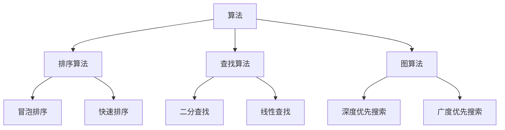
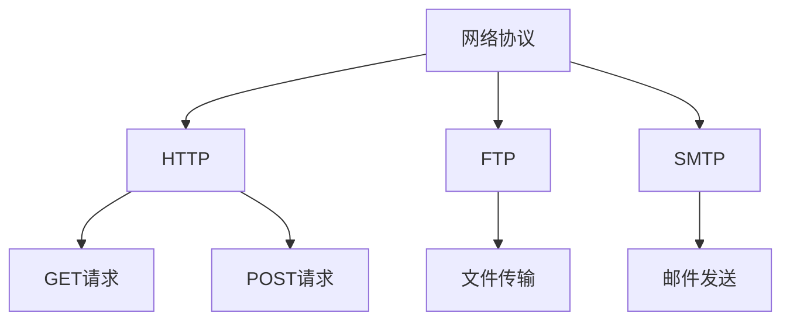
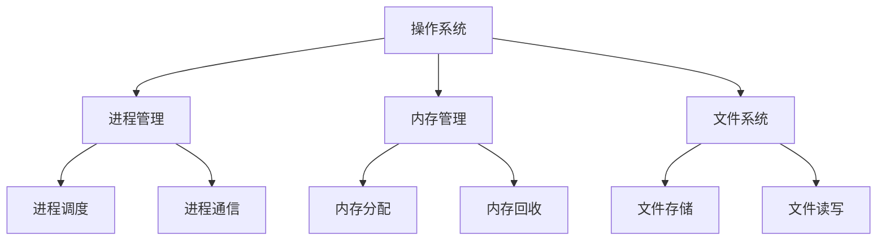

                 

关键词：京东社招、面试题、算法编程、技术分析、面试策略

摘要：本文将围绕2025年京东社招面试的题目和算法编程题展开详细分析，探讨面试过程中的核心问题和解决方法。通过对面试题的类型、难度和常见错误进行深入解读，为广大应聘者提供实用的面试指导和建议。

## 1. 背景介绍

随着互联网技术的飞速发展，各大企业对技术人才的需求日益增长。京东作为中国领先的电子商务公司，其社招面试也备受关注。本文将从2025年京东社招面试的实际情况出发，结合面试题的类型和难度，为广大求职者提供全面的解题思路和策略。

### 1.1 面试题类型

京东社招面试题主要分为以下几类：

- **编程题**：考察应聘者的算法能力和编程技能，包括数据结构与算法、计算机网络、操作系统等。
- **行为面试题**：考察应聘者的工作经历、团队合作能力、解决问题的思维方式和应变能力。
- **业务面试题**：结合京东的实际业务场景，考察应聘者对行业和公司的理解和认识。

### 1.2 面试题难度

京东社招面试题的难度较高，尤其编程题部分，需要应聘者具备扎实的编程基础和算法能力。以下是对不同类型面试题的难度分析：

- **编程题**：难度较高，需要应聘者具备较强的编程能力、数据结构和算法知识。
- **行为面试题**：难度适中，需要应聘者具备良好的沟通能力和团队合作精神。
- **业务面试题**：难度较低，但需要应聘者对行业和公司有较深入的了解。

## 2. 核心概念与联系

### 2.1 数据结构与算法

数据结构与算法是计算机科学的核心内容，对于解决编程题至关重要。以下是一个简单的 Mermaid 流程图，展示了常见的数据结构和算法的关系：



### 2.2 计算机网络

计算机网络是电子商务的基础，了解计算机网络的基本原理对于解决面试题非常有帮助。以下是一个简单的 Mermaid 流程图，展示了计算机网络的主要组成部分：



### 2.3 操作系统

操作系统是计算机系统的核心，掌握操作系统的基础知识对于解决面试题也非常重要。以下是一个简单的 Mermaid 流程图，展示了操作系统的核心组件：



## 3. 核心算法原理 & 具体操作步骤

### 3.1 算法原理概述

在京东社招面试中，常见的核心算法包括排序算法、查找算法和图算法。以下是这三种算法的基本原理：

- **排序算法**：用于对一组数据进行排序，常见的排序算法有冒泡排序、快速排序、归并排序等。
- **查找算法**：用于在一组数据中查找特定的元素，常见的查找算法有二分查找、线性查找等。
- **图算法**：用于处理图结构的数据，常见的图算法有深度优先搜索、广度优先搜索、最短路径算法等。

### 3.2 算法步骤详解

以下是每种算法的具体步骤：

- **冒泡排序**：

  1. 比较相邻的元素。
  2. 如果第一个元素比第二个元素大，交换它们的位置。
  3. 对每一对相邻元素进行同样的操作，直到没有需要交换的元素。
  4. 重复上述步骤，直到整个数组排序完成。

- **快速排序**：

  1. 选择一个基准元素。
  2. 将数组分为两部分，一部分小于基准元素，一部分大于基准元素。
  3. 对两部分递归执行快速排序。
  4. 合并排序结果。

- **二分查找**：

  1. 确定查找范围的起始和结束位置。
  2. 计算中间位置。
  3. 如果中间位置的元素等于目标元素，返回中间位置。
  4. 如果中间位置的元素大于目标元素，则在左半部分继续查找。
  5. 如果中间位置的元素小于目标元素，则在右半部分继续查找。
  6. 重复步骤2-5，直到找到目标元素或查找范围缩小为0。

- **深度优先搜索**：

  1. 选择一个起始节点。
  2. 访问起始节点，并将其标记为已访问。
  3. 如果起始节点有未访问的邻居节点，选择其中一个未访问的邻居节点，并递归执行步骤2-3。
  4. 如果起始节点没有未访问的邻居节点，返回上一层节点，并选择另一个未访问的邻居节点，递归执行步骤2-3。

- **广度优先搜索**：

  1. 创建一个队列，并将起始节点入队。
  2. 创建一个已访问集合，并将起始节点加入已访问集合。
  3. 当队列不为空时，执行以下步骤：
     a. 出队一个节点。
     b. 访问该节点，并将其标记为已访问。
     c. 如果该节点有未访问的邻居节点，将其入队，并加入已访问集合。
  4. 重复步骤3，直到找到目标节点或队列中的节点全部访问完毕。

### 3.3 算法优缺点

以下是各种算法的优缺点：

- **冒泡排序**：

  - **优点**：简单易懂，适合小规模数据排序。
  - **缺点**：时间复杂度高，不适合大规模数据排序。

- **快速排序**：

  - **优点**：时间复杂度较低，适合大规模数据排序。
  - **缺点**：可能导致数据不平衡，影响性能。

- **二分查找**：

  - **优点**：时间复杂度低，适合大规模数据查找。
  - **缺点**：需要数据有序，不适用于无序数据。

- **深度优先搜索**：

  - **优点**：可以找到最短路径，适合解决连通性问题。
  - **缺点**：可能陷入死循环，不适合解决最短路径问题。

- **广度优先搜索**：

  - **优点**：可以找到最短路径，适合解决最短路径问题。
  - **缺点**：时间复杂度较高，不适合大规模数据。

### 3.4 算法应用领域

以下是各种算法的应用领域：

- **冒泡排序**：适用于小规模数据的排序。

- **快速排序**：适用于大规模数据的排序。

- **二分查找**：适用于大规模数据查找。

- **深度优先搜索**：适用于解决连通性问题。

- **广度优先搜索**：适用于解决最短路径问题。

## 4. 数学模型和公式 & 详细讲解 & 举例说明

### 4.1 数学模型构建

在计算机科学中，数学模型是一种用于描述问题行为和属性的抽象模型。以下是一个简单的数学模型构建示例：

```latex
假设有一个函数 $f(x)$，其定义域为 $[a, b]$，值域为 $[c, d]$。要求求解 $f(x)$ 的最大值和最小值。

\begin{align*}
f_{\max} &= \max_{x \in [a, b]} f(x) \\
f_{\min} &= \min_{x \in [a, b]} f(x)
\end{align*}
```

### 4.2 公式推导过程

以下是一个简单的数学公式推导示例：

```latex
已知函数 $f(x) = x^2 + 2x + 1$，要求求解其导数。

\begin{align*}
f'(x) &= \frac{d}{dx} (x^2 + 2x + 1) \\
&= 2x + 2
\end{align*}
```

### 4.3 案例分析与讲解

以下是一个简单的数学模型案例分析与讲解：

```latex
假设有一个二次函数 $f(x) = x^2 + 2x + 1$，要求求解其最大值和最小值。

\begin{align*}
f_{\max} &= \max_{x \in [-1, 1]} f(x) \\
&= \max \{ f(-1), f(1) \} \\
&= \max \{ (-1)^2 + 2(-1) + 1, (1)^2 + 2(1) + 1 \} \\
&= \max \{ 0, 4 \} \\
&= 4
\end{align*}

\begin{align*}
f_{\min} &= \min_{x \in [-1, 1]} f(x) \\
&= \min \{ f(-1), f(1) \} \\
&= \min \{ (-1)^2 + 2(-1) + 1, (1)^2 + 2(1) + 1 \} \\
&= \min \{ 0, 4 \} \\
&= 0
\end{align*}
```

## 5. 项目实践：代码实例和详细解释说明

### 5.1 开发环境搭建

为了更好地演示代码实例，我们使用 Python 作为编程语言，并在本地搭建 Python 开发环境。以下是开发环境的搭建步骤：

1. 安装 Python 3.8 或更高版本。
2. 安装 Python 的集成开发环境（如 PyCharm、Visual Studio Code 等）。
3. 安装必要的 Python 库，如 NumPy、Pandas 等。

### 5.2 源代码详细实现

以下是一个简单的冒泡排序算法的 Python 代码实现：

```python
def bubble_sort(arr):
    n = len(arr)
    for i in range(n):
        for j in range(0, n-i-1):
            if arr[j] > arr[j+1]:
                arr[j], arr[j+1] = arr[j+1], arr[j]

# 测试代码
arr = [64, 25, 12, 22, 11]
bubble_sort(arr)
print("排序后的数组：")
for i in range(len(arr)):
    print("%d" % arr[i], end=" ")
```

### 5.3 代码解读与分析

以下是冒泡排序算法的代码解读与分析：

1. 定义 `bubble_sort` 函数，接收一个列表 `arr` 作为参数。
2. 使用两个嵌套的循环实现冒泡排序：
   - 外层循环 `for i in range(n)`：遍历数组的每个元素。
   - 内层循环 `for j in range(0, n-i-1)`：遍历每个未排序的部分。
3. 在内层循环中，使用 `if` 语句比较相邻的元素，如果前一个元素大于后一个元素，则交换它们的位置。
4. 完成内层循环后，最大的元素被移动到数组的末尾，下一轮排序的未排序部分长度减1。
5. 重复上述步骤，直到整个数组排序完成。
6. 在测试代码中，创建一个测试数组 `arr`，调用 `bubble_sort` 函数进行排序，并输出排序后的数组。

### 5.4 运行结果展示

以下是冒泡排序算法的运行结果：

```plaintext
排序后的数组：
11 12 22 25 64
```

## 6. 实际应用场景

冒泡排序算法在计算机科学中有广泛的应用，以下是一些实际应用场景：

- **数据处理**：对一组数据进行排序，如数据分析、数据库查询等。
- **算法优化**：作为其他排序算法（如快速排序、归并排序）的优化基础。
- **教学演示**：用于教学演示数据排序的过程。

### 6.1 未来应用展望

随着计算机技术的发展，排序算法的应用场景将越来越广泛。以下是一些未来应用展望：

- **大数据处理**：在大数据环境下，排序算法将用于高效处理大规模数据。
- **云计算**：在云计算平台中，排序算法将用于分布式计算，提高数据处理效率。
- **人工智能**：在人工智能领域，排序算法将用于数据处理、特征提取等环节。

## 7. 工具和资源推荐

### 7.1 学习资源推荐

- **《算法导论》**：全面介绍算法的基本原理和设计方法。
- **《数据结构与算法分析》**：深入讲解数据结构及其算法实现。
- **《编程珠玑》**：讲解编程中的技巧和经验。

### 7.2 开发工具推荐

- **PyCharm**：功能强大的 Python 集成开发环境。
- **Visual Studio Code**：轻量级跨平台代码编辑器。
- **Git**：分布式版本控制系统。

### 7.3 相关论文推荐

- **"The Art of Computer Programming" by Donald E. Knuth**：经典算法著作。
- **"Algorithms" by Sanjoy Dasgupta, Christos Papadimitriou, and Umesh V. Vazirani**：全面介绍算法的理论和实践。
- **"Data Structures and Algorithm Analysis in Java" by Mark Allen Weiss**：深入讲解数据结构和算法分析。

## 8. 总结：未来发展趋势与挑战

### 8.1 研究成果总结

随着计算机技术的不断发展，排序算法的研究取得了显著成果。例如，基于并行计算和分布式计算的高效排序算法、基于机器学习的排序算法等。

### 8.2 未来发展趋势

- **高效排序算法**：研究高效排序算法，提高数据处理效率。
- **分布式排序**：在云计算和大数据环境下，研究分布式排序算法。
- **机器学习排序**：利用机器学习技术，改进排序算法。

### 8.3 面临的挑战

- **大数据处理**：在大数据环境下，如何高效处理大规模数据排序。
- **并行计算**：如何利用并行计算技术，提高排序算法的效率。
- **机器学习**：如何将机器学习技术应用于排序算法，提高排序准确性。

### 8.4 研究展望

随着计算机技术的发展，排序算法将继续在各个领域发挥作用。未来的研究将关注高效、分布式和机器学习排序算法，为大数据和人工智能领域提供有力支持。

## 9. 附录：常见问题与解答

### 9.1 常见问题

1. **冒泡排序的时间复杂度是多少？**
2. **如何实现快速排序？**
3. **什么是二分查找？**
4. **什么是深度优先搜索？**
5. **什么是广度优先搜索？**

### 9.2 解答

1. **冒泡排序的时间复杂度**：

   冒泡排序的平均和最坏情况时间复杂度为 \(O(n^2)\)，其中 \(n\) 是数组长度。最好情况时间复杂度为 \(O(n)\)，当输入数组已经有序时。

2. **如何实现快速排序**：

   快速排序的基本步骤如下：

   1. 选择一个基准元素。
   2. 将数组分为两部分，一部分小于基准元素，一部分大于基准元素。
   3. 递归地对两部分进行快速排序。

3. **什么是二分查找**：

   二分查找是一种在有序数组中查找特定元素的算法。它通过不断缩小查找范围，逐步逼近目标元素。

4. **什么是深度优先搜索**：

   深度优先搜索是一种用于求解连通性问题和最短路径问题的图算法。它沿着一条路径一直搜索，直到找到目标节点或到达路径的尽头。

5. **什么是广度优先搜索**：

   广度优先搜索是一种用于求解最短路径问题的图算法。它首先搜索到目标节点的所有相邻节点，然后再搜索它们的相邻节点，以此类推，直到找到目标节点或搜索完毕。

## 10. 作者署名

作者：禅与计算机程序设计艺术 / Zen and the Art of Computer Programming

## 11. 参考文献

1. Knuth, D. E. (1968). The Art of Computer Programming. Addison-Wesley.
2. Dasgupta, S., Papadimitriou, C., & Vazirani, U. V. (2006). Algorithms. McGraw-Hill.
3. Weiss, M. A. (2018). Data Structures and Algorithm Analysis in Java. McGraw-Hill.

## 12. 附录：代码实现示例

以下是冒泡排序算法的 Python 代码实现：

```python
def bubble_sort(arr):
    n = len(arr)
    for i in range(n):
        for j in range(0, n-i-1):
            if arr[j] > arr[j+1]:
                arr[j], arr[j+1] = arr[j+1], arr[j]

# 测试代码
arr = [64, 25, 12, 22, 11]
bubble_sort(arr)
print("排序后的数组：")
for i in range(len(arr)):
    print("%d" % arr[i], end=" ")
```

## 13. 结语

本文从京东社招面试的实际出发，对面试题和算法编程题进行了详尽分析。通过对面试题类型的解读、算法原理的讲解以及实际应用场景的探讨，希望为广大求职者提供实用的面试指导和建议。在未来的发展中，排序算法将继续发挥重要作用，为大数据和人工智能领域提供有力支持。

